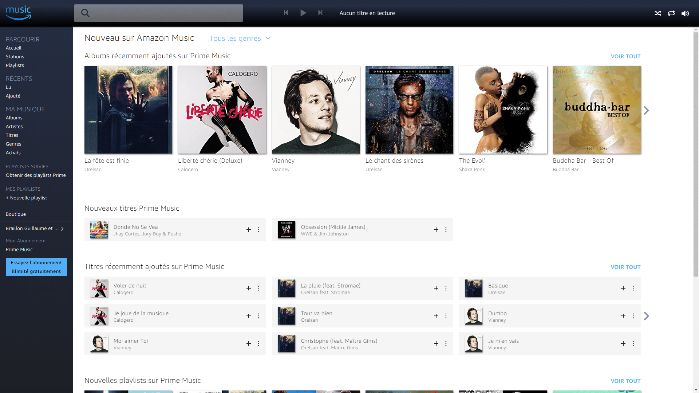
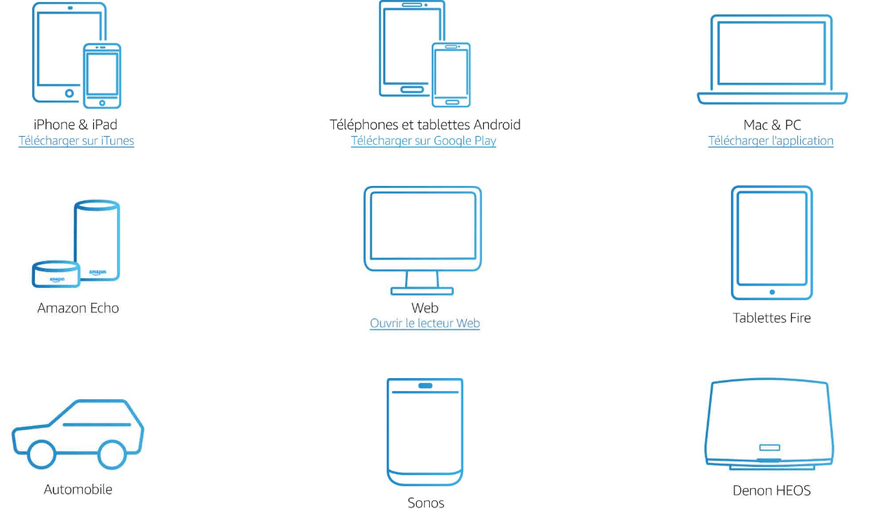
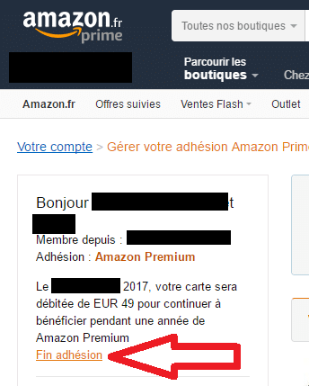

# Amazon Prime Music gratuit

> Après Amazon [Prime Video](https://www.primevideo.com/?tag=guilbraimespa-21), le Streaming vidéo **inclut** avec les abonnements [**Amazon Prime**](https://www.amazon.fr/prime?tag=guilbraimespa-21) que je vous avais présenté [il y a quelque temps](/articles/primevideo-com-le-streaming-gratuit-damazon-premium), c’est au tour de la **musique** de débarquer avec **Amazon [Prime Music](https://www.amazon.fr/prime?tag=guilbraimespa-21)** et [**Amazon Music Unlimited**](https://www.amazon.fr/gp/dmusic/promotions/AmazonMusicUnlimited?tag=guilbraimespa-21).
>
> **[Prime Music](https://www.amazon.fr/prime?tag=guilbraimespa-21)** est bien évidement **compatible** avec le système de reconnaissance vocal d’Amazon **Alexa** et donc, avec les appareils **Amazon Echo**.
>
> - [Écouter Amazon Prime Music](https://www.amazon.fr/gp/aw/d/B074BL27BD?&tag=guilbraimespa-21)
> - [Découvrir Amazon Music Unlimited](https://www.amazon.fr/gp/aw/d/B079PNT5TK?&tag=guilbraimespa-21)
> - [Voir l’enceinte Echo Dot](https://www.amazon.fr/gp/aw/d/B079V74NTG?&tag=guilbraimespa-21)
>
> _Si comme moi vous êtes un aficionado des achats sur **Amazon,** vous êtes sûrement membre d’[**Amazon Prime**](https://www.amazon.fr/prime?tag=guilbraimespa-21) qui, je vous le rappelle, permet principalement de recevoir vos achats en **un jour ouvré** et **sans frais de port** pour **49€** par an, soit un peu plus de **4€ par mois**._
>
> A ce prix-là on trouve, entre autres, le service [**Prime video**](https://www.primevideo.com/?tag=guilbraimespa-21) qui permet d’avoir accès **gratuitement** en **Streaming** ou en **téléchargement,** à des **films** et des **séries** et maintenant **[Prime Music](https://www.amazon.fr/prime?tag=guilbraimespa-21)** qui vous propose jusqu’à **40 heures** de musique **par mois**, parmis plus de **2 millions de titres** à écouter **gratuitement** en **Streaming** ou en **téléchargement.**
>
> Le service musical d’Amazon, **[Prime Music,](https://www.amazon.fr/prime?tag=guilbraimespa-21)** est aussi disponible pour les **non-membres** d’[**Amazon Prime**](https://www.amazon.fr/prime?tag=guilbraimespa-21) avec les formules **[Amazon Music Unlimited](https://www.amazon.fr/gp/dmusic/promotions/AmazonMusicUnlimited?tag=guilbraimespa-21)** qui offrent, en plus, **50 millions de titres** en **écoute illimité.**

## Les offres Amazon Prime Music

- **Offre Prime Music** : Inclue et gratuite pour les membres [**Amazon Prime**](https://www.amazon.fr/prime?tag=guilbraimespa-21).
  - _Limité à 40h d’écoute par mois et 2 millions de titres._
- **Offre echo** : 3,99€ /mois.
  - _Permet d’avoir [**Amazon Music Unlimited**](https://www.amazon.fr/gp/dmusic/promotions/AmazonMusicUnlimited?tag=guilbraimespa-21) sur un appareil Amazon Echo._
  - _Disponible pour les non-membres **[Amazon Prime](https://www.amazon.fr/prime?tag=guilbraimespa-21).**_
- **Offre individuelle** : 9,99€ /mois.
  - _Accès à [**Amazon Music Unlimited**](https://www.amazon.fr/gp/dmusic/promotions/AmazonMusicUnlimited?tag=guilbraimespa-21) sur tout type d’appareil, c’est l’équivalent des **Spotify**, **Deezer** et autres **Google Play Music**._
  - _Disponible pour les non-membres **[Amazon Prime](https://www.amazon.fr/prime?tag=guilbraimespa-21).**_
  - _Offre exclusive pour les membres [**Amazon Prime**](https://www.amazon.fr/prime?tag=guilbraimespa-21) : 99 €/an soit 8,25€/ mois._
- **Offre famille** : 14,99€ /mois.
  - _Accès à [**Amazon Music Unlimited**](https://www.amazon.fr/gp/dmusic/promotions/AmazonMusicUnlimited?tag=guilbraimespa-21) sur tout type d’appareil, pour 6 comptes._
  - _Disponible pour les non-membres **[Amazon Prime](https://www.amazon.fr/prime?tag=guilbraimespa-21).**_
  - _Offre exclusive pour les membres [**Amazon Prime**](https://www.amazon.fr/prime?tag=guilbraimespa-21) : 149 €/an soit 12,40€ /mois._

**Edit du 12/072018 :** 

**4 mois pour 0,99€** pour toute nouvelle inscription à **[Amazon Music Unlimited](https://www.amazon.fr/gp/dmusic/promotions/AmazonMusicUnlimited?&tag=guilbraimespa-21)**.

Offre réservée aux membres Amazon Prime

**Détails**: [Voir l’offre sur Amazon Prime Music](https://www.amazon.fr/gp/dmusic/promotions/AmazonMusicUnlimited?&tag=guilbraimespa-21)

**Date de début**: 03/07/2018
**Date de fin**: 17/07/2018

## Amazon Prime, Amazon Prime Music et Amazon Music Unlimited

Il n’est pas très facile de s’y retrouver dans toutes ces offres, permettez-moi de vous éclairer un peu.

### Amazon Prime

[**Amazon Prime**](https://www.amazon.fr/prime?tag=guilbraimespa-21) ou anciennement **Amazon Premium** est un abonnement à **49,00€** par **an** qui vous permet de bénéficier de la **livraison en 1 jour ouvré, gratuite et illimitée** sur des millions d’articles. C’est par là que tout a commencé.

Très pratique pour ceux qui **commandent** **souvent** sur **Amazon.** Il est même possible de se faire **livrer le jour même** dans certaines villes, comme Paris ou Lyon. C’est parfois **plus rapide** et bien souvent **moins pénible** que d’aller dans un **magasin** au centre-ville.

En prime avec les **Dash Buttons** (remboursés) on peut commander des **produits de consommation courante** avec une simple pression sur le bouton à coller à coté des tablettes du lave vaisselle ou du dentifrice par exemple.

_Info : On peut les **reprogrammer** pour les utiliser avec la box domotique [**Jeedom**](/articles) et leur attribuer l’action de son choix._

Petit à petit, [**Amazon**](https://www.amazon.fr/prime?tag=guilbraimespa-21) a ajouté des services **réservés** aux membres [**Amazon Prime**](https://www.amazon.fr/prime?tag=guilbraimespa-21), comme l’accès prioritaire aux **Ventes Flash**, la possibilité d’**emprunter gratuitement un eBook** par mois, des **promotions** exclusives **Amazon Famille,** le **stockage** **illimité** de photos**,** **Twitch Prime** et quelques autres encore.

_Pour être honnête, rien de vraiment intéressant, mais bon, vu que c’est compris dans l’abonnement [**Amazon Prime**](https://www.amazon.fr/prime?tag=guilbraimespa-21), c’est pas mal._

C’est devenu déjà plus **intéressant** lorsqu’ils ont ajouté **[Prime Video](https://www.primevideo.com/?tag=guilbraimespa-21)** avec un **catalogue** **vidéo** qui s’enrichit de jour en jour et **maintenant** avec **[Prime Music](https://www.amazon.fr/prime?tag=guilbraimespa-21)** qui va donner accès à un **catalogue audio** à de nombreuses personnes qui ne **souhaitent pas s’abonner** à d’autres **services concurrents** et toujours pour **seulement** **4€ par mois**.

### Amazon Prime Music

Donc, Amazon **[Prime Music](https://www.amazon.fr/prime?tag=guilbraimespa-21)**, on l’a vu, c’est l**‘offre musicale gratuite pour les membres [Amazon Prime](https://www.amazon.fr/prime?tag=guilbraimespa-21)**, qui inclut jusqu’à **40 heures de musique par mois**, sans publicité, avec plus de **2 millions de titres**.

Comme chez les concurrents, il est **possible** d’écouter de la musique sur **tous les appareils connectés** compatibles, iPhone et iPad, Tablettes et Smartphones Android, Mac, PC, Enceintes Sonos…

Il est possible de **télécharger** les morceaux pour les écouter **hors connexion** et bien sûr, c’est **compatible** avec **Alexa**, le « Google Assistant » à la sauce **Amazon**.

- [Écouter Amazon Prime Music](https://www.amazon.fr/gp/aw/d/B079VCDXSK?&tag=guilbraimespa-21)
- [Découvrir Amazon Music Unlimited](https://www.amazon.fr/gp/aw/d/B074BL27BD?&tag=guilbraimespa-21)
- [Voir l’enceinte Echo Dot](https://www.amazon.fr/gp/aw/d/B01ETRGE7M?&tag=guilbraimespa-21)

### Amazon Music Unlimited

Avec [**Amazon Music Unlimited**](https://www.amazon.fr/gp/dmusic/promotions/AmazonMusicUnlimited?tag=guilbraimespa-21), vous bénéficiez de **tous les avantages de [Prime Music](https://www.amazon.fr/prime?tag=guilbraimespa-21),** mais avec un catalogue de plus de **50 millions de titres** et en **écoute illimitée**. Bien sûr les membre [**Amazon Prime**](https://www.amazon.fr/prime?tag=guilbraimespa-21) ont droit à leur **petite** réduction avec un abonnement à [**Amazon Music Unlimited**](https://www.amazon.fr/gp/dmusic/promotions/AmazonMusicUnlimited?tag=guilbraimespa-21) pour **99 €/an**, car c’est un abonnement annuel. Les clients qui ne sont pas membres [**Amazon Prime**](https://www.amazon.fr/prime?tag=guilbraimespa-21) ont accès uniquement à l’offre mensuelle à 9,99 €/mois.

Rappel des offres [**Amazon Music Unlimited**](https://www.amazon.fr/gp/dmusic/promotions/AmazonMusicUnlimited?tag=guilbraimespa-21) :

- **Offre echo** : 3,99€ /mois.
  - _Permet d’avoir [**Amazon Music Unlimited**](https://www.amazon.fr/gp/dmusic/promotions/AmazonMusicUnlimited?tag=guilbraimespa-21) sur un appareil Amazon Echo._
- **Offre individuelle** : 9,99€ /mois.
  - _Accès à [**Amazon Music Unlimited**](https://www.amazon.fr/gp/dmusic/promotions/AmazonMusicUnlimited?tag=guilbraimespa-21) sur tout type d’appareil._
- **Offre famille** : 14,99€ /mois.
  - _Accès à [**Amazon Music Unlimited**](https://www.amazon.fr/gp/dmusic/promotions/AmazonMusicUnlimited?tag=guilbraimespa-21) sur tout type d’appareil, pour 6 comptes._

## Ecouter Amazon Prime Music

Evidemment il est possible d’écouter Amazon [Prime Music](https://www.amazon.fr/prime?tag=guilbraimespa-21) sur presque tous les appareils connectés.

Avec l’application **Android** vous pouvez facilement **Chromecaster** la musique sur un appareil compatible comme une **Mi-Box**.

Compatible avec **Android Auto**.

## Conclusion

Pour résumé, **Amazon [Prime Music](https://www.amazon.fr/prime?tag=guilbraimespa-21)**, c’est le service de Streaming musical **compris** dans les abonnements [**Amazon Prime**](https://www.amazon.fr/prime?tag=guilbraimespa-21), avec **tous les services** que l’on à [vu précédemment](#amazon-prime), mais avec une **limite** de **durée d’écoute** et du **nombre de titres**.

Pour **supprimer** ces **limites** vous avez les offres [**Amazon Music Unlimited**](https://www.amazon.fr/gp/dmusic/promotions/AmazonMusicUnlimited?tag=guilbraimespa-21) disponible que vous soyez membre [**Amazon Prime**](https://www.amazon.fr/prime?tag=guilbraimespa-21) ou **non**.

Alors !!! Ça vaut le coup ou non cette offre **Amazon [Prime Music](https://www.amazon.fr/prime?tag=guilbraimespa-21) [Unlimited](https://www.amazon.fr/gp/dmusic/promotions/AmazonMusicUnlimited?tag=guilbraimespa-21) exclusive super géniale** ?

Et bien **ça dépend** de l’utilisateur que vous êtes.

Si vous avez **déjà** un **abonnement** à un service de streaming musical et que vous ne commandez **jamais** sur **Amazon**, vous n’êtes manifestement **pas la cible principale**.

D’ailleurs, **contrairement** à l’offre gratuite **Amazon [Prime Music](https://www.amazon.fr/prime?tag=guilbraimespa-21)**, je ne **pense pas** non plus que l’**offre payante [Amazon Music Unlimited](https://www.amazon.fr/gp/dmusic/promotions/AmazonMusicUnlimited?tag=guilbraimespa-21)** soit très attractive face à celles des mastodontes du secteur que sont Spotify, Google Play Music, Apple Music et autres Deezer. A la rigueur, c’est bien pour ceux qui ne veulent pas multiplier les abonnements et souhaitent tout avoir chez Amazon.

Après, si vous n’**êtes pas abonné** à des **services** de **streaming** audio et/ou vidéo et que vous commandez **occasionnellement** sur **Amazon**, devenir membre [**Amazon Prime**](https://www.amazon.fr/prime?tag=guilbraimespa-21) et donc profiter d’Amazon **[Prime Music](https://www.amazon.fr/prime?tag=guilbraimespa-21)**, peut devenir **intéressant**. Vous aurez pas mal de services pour seulement **4,00€ par mois**.

**Ecouter** de la musique ou **regarder** des films et des séries, **légalement**, partout et sans avoir à chercher des fichiers de mauvaise qualité sur des sites douteux, c’est tout de même **confortable**.

C’est aussi **intéressant** si vous avez des **enfants.** Rien ne vous empêche d’installer **l’application** Amazon **[Prime Music](https://www.amazon.fr/prime?tag=guilbraimespa-21)** ou Amazon **[Prime Video](https://www.primevideo.com/?tag=guilbraimespa-21)** sur leurs **portables**, vous ferez des heureux et ça vous coûtera bien **moins cher** que de leurs prendre chacun un abonnement sur une plateforme de Streaming payante.

Si avec tout ça **vous n’arrivez toujours pas à vous décider**, sachez que vous pouvez tester pendant **[30 jours l’offre Amazon Prime](https://www.amazon.fr/prime?tag=guilbraimespa-21)** et même chose pour **Amazon Music Unlimited** avec **[30 jours gratuits](https://www.amazon.fr/prime?tag=guilbraimespa-21)**.

_**Info** : Pour ne profiter que des **30 jours de l’offre [Amazon Prime](https://www.amazon.fr/prime?tag=guilbraimespa-21)\*\***,** il suffit de cliquer sur « **Fin adhésion** » dans les **30 jours\*\*._

