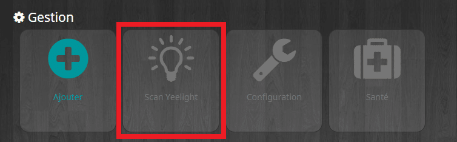
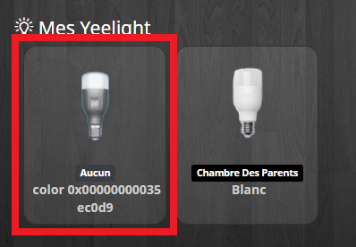
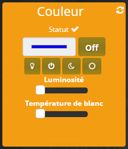
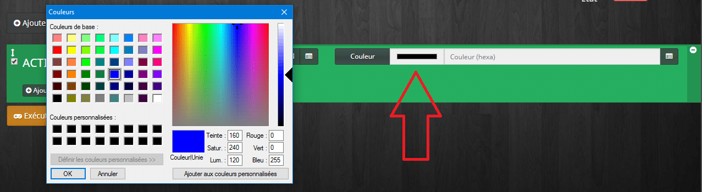
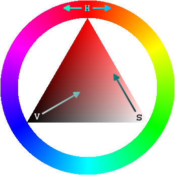
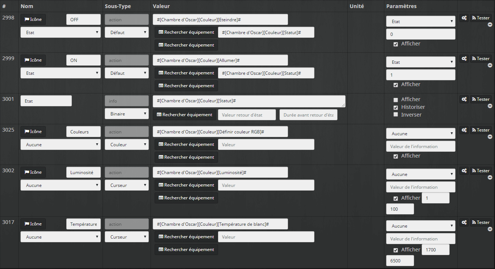
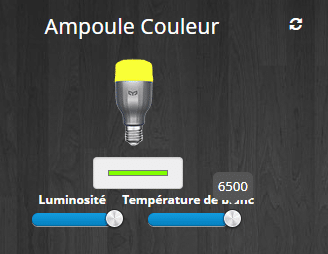
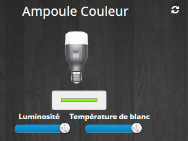

# Ampoules Xiaomi Yeelight

> Les **ampoules Xiaomi Yeelight sont** **compatibles** avec la box domotique **Jeedom**, grâce au **plugin** Xiaomi, voyons comment les intégrer.
>
> _**Une présentation des ampoules Xiaomi Yeelight est disponible ici : [Ampoules connectées couleur et blanc Xiaomi Yeelight](/articles/ampoules-connectees-couleur-et-blanc-xiaomi-yeelight).**_

## Jeedom

Les ampoules **Yeelight** étant **wifi,** elles n’ont **pas** besoin de la **Gateway** pour fonctionner.

Pour utiliser les ampoules **Yeelight** dans **Jeedom,** il existe **2 plugins** :

- **WifilightV2** : 4€ plugin créé par bcaro. Je n’ai pas ce plugin alors je ne vous en parlerai pas.
- **Xiaomi Home** : 6€ plugin créé par [Lunarok](https://lunarok-domotique.com/) et [Sarakha63](http://sarakha63-domotique.fr/). C’est le même plugin utilisé pour contrôler les composants Xiaomi Smart Home.

Il faut dans un **premier** temps **activer** le **mode** **développeur** dans l’application **Yeelight**, ce n’est **pas possible avec l’application Mi-Home**.

- **Aller dans** : 3 points, Developer Mode et activer l’option puis cliquer sur « **Agree**« .
- **Aller dans** : Plugin Xiaomi Home cliquer sur « **Scan Yeelight**« .

- **Aller dans** : Mes Yeelight et votre ampoule devrait apparaître, cliquer dessus pour plus de réglages.

N’hésitez pas à **éteindre** et **allumer** **l’ampoule** via **l’application,** pour **forcer** un peu la main à **Jeedom**.

### Contrôle de la lampe

Il est possible de **contrôler** les ampoules via les **dashboard** et via les **scénarios**.

Les commandes sur le **dashboard** sont **paramétrables** via l’onglet **commande** de l’ampoule. Par défaut, il est possible de c**hoisir la couleur**, ou **d’éteindre** via la couleur noire. Il y a aussi **2 boutons ON et OFF**, puis un **curseur** pour la **température** des **blancs** (1700 à 6500) et de **luminosité** (0 à 100).

_Personnellement, je règle la **luminosité** minimum **à 1** pour ne **pas** que l’ampoule **s’éteigne** complètement lorsqu’elle est au **minimum**._

Contrairement à la lampe de chevet, il est **possible** **d’allumer** la **lumière** en changeant la **luminosité** ou la **température** des blancs et le **réglage** de la **couleur** peut être fait **offline,** afin que la **lumière** soit de la **bonne** **couleur** lors de **l’allumage**.

### Réglage de la couleur via scénario

Il possible de **régler** la couleur via le **widget,** mais aussi via un **scénario**.

**Deux normes** de couleur sont **prises** en **charge**.

#### **RGB** : _(Red, Green, Blue)_

La norme **RGB** est la plus **connue**. Le **principe** c’est de donner une **valeur** à chaque **couleur** **primaire,** comme si vous **mélangiez** des tubes de **peinture**. On trouve 3 formats :

- **rgb(100%,80%,60%)** 100% de rouge, 80% de vert, 60% de bleu.
- **rgb(255,204,153)** 100% = 255, 204 = 255 × 0,8 et 153 = 255 × 0,6.
- **#FFCC99** où FF, CC et 99 sont les conversions en système hexadécimal de 255, 204 et 153.

Mal à la tête ? On respire !!! Le **plugin** utilise les valeurs **hexadécimales,** mais ne vous inquiétez pas, vous n’aurez pas à apprendre à compter en hexa ! **Jeedom** le **fait pour vous**.

- **Ajouter** une **action** dans votre **scénario**.
- **Sélectionner** l’objet (une pièce de votre logement), l’équipement (ampoule) et la **commande** « **Définir couleur RGB**« , valider.
- **Cliquer** sur le **rectangle** de couleur (noir).
- **Sélectionner** une **couleur** dans la palette et cliquer sur **OK**.

#### **HSV** : (_Hue Saturation Value)_

Moins connue, cette norme appelée « **Teinte Saturation Valeur » en français**, fonctionne sur le **principe** d’un **cercle** de **couleur,** dans lequel chaque **degré** représente une **teinte** différente.

- **Hue** (Teinte) :
  - **0°** : rouge.
  - **60°** : jaune.
  - **120°** : vert.
  - **180°** : cyan.
  - **240°** : bleu.
  - **300°** : magenta.

La **teinte** est **réglable** via la commande « **Définir couleur HSV**« , il faut **saisir** un chiffre entre **0 et 253**.

_Je n’ai pas trop compris pourquoi on n’est pas entre 0 et 360 vu que se sont des degrés… Etant [daltonien](/articles/le-daltonisme), je n’ai pas pu vraiment me pencher sur ce sujet ! je vous laisse donc découvrir par vous même 🙂_

- **Saturation** : C’est l’intensité de la couleur qui peut varier entre 0 et 100 %.

La **saturation** est **réglable** via la commande « **Définir saturation HSV**« . Il faut **saisir** un chiffre entre **0 et 100**.

- **Value** (Valeur) : C’est la **luminosité** qui est gérée de la **même** façon que pour le **RGB et le HSV** via la commande « **Luminosité**« .

Source Wikipedia https://fr.wikipedia.org/wiki/Teinte\_Saturation\_Valeur

### Retour d’état

Il  a **un retour d’état** si **j’allume** l’ampoule depuis **l’application** mobile, ou depuis **l’interrupteur** de la lampe. **Jeedom** reçois l’information via la commande **statut**. Par contre il y a un **délai** avant qu’il soit **mis à jour**, on peut utiliser la commande « **rafraîchir**« .

Il y a aussi un état « **OnLine** » qui permet de savoir si **l’ampoule** est **alimentée** électriquement (1) ou **pas** (0).

### Virtuel et widget pour Yeelight RGB

Voila un **exemple** si vous voulez faire un **virtuel** et un **widget** pour votre ampoule **Yeelight RGB.**

#### Virtuel

Pour le **virtuel** rien de bien sorcier, il suffit de faire un **bouton On / Off** et d’ajouter les commandes **Couleurs**, **Luminosité** et **Température** de blanc. Pour une **ampoule blanche**, vous n’ajouterez que la commande **Luminosité**.

Au niveau des **valeurs** de la **luminosité**, je mets un **minimum** de **« 1 »** pour ne **pas** pouvoir **éteindre** l’ampoule complètement via la commande Luminosité.

#### Widget

Pour le **widget**, je crée un **widget On /Off** avec les images suivantes. Je ne **gère** que l’état On /off et **pas** la **couleur** de l’ampoule :

Et pour le même prix, je vous **partage** le fichier **PSD** pour **Photoshop** : [Widget Yeelight RGB](/xiaomi-yeelight-ampoules-e27-wifi-couleurs-et-blanc/widget-yeelight-rgb).

 

Si vous n’êtes **pas à l’aise** avec les **virtuels** et **Widgets**, je vous invite à (re)**lire** l’article **[Lumières & Bouton Switch Xiaomi](/articles/jeedom-scenario-lumieres-bouton-switch-xiaomi)** dans lequel je détaille la marche à suivre.

Je ne vous parlerai pas d’une commande appelée « **Enchaînements**« , mais vous trouverez toutes les **explications** dans la **[documentation officielle](https://jeedom.github.io/documentation/third_plugin/xiaomihome/fr_FR/index.html#_commande_enchainement_des_yeelight)** du plugin Xiaomi Home.
\
