# Aspirateur Robot Xiaomi Mi-Robot

> L’aspirateur **Robot Xiaomi Mi-Robot** est un **aspirateur** robot **connecté**, une **technologie** qui devient de plus en plus **commune** sur les nouvelles générations d’aspirateurs **robot**, mais en plus de son **prix** très **compétitif**, le Mi-Robot est **contrôlable** depuis l’application Mi Home et **interconnectable** avec les **composants** [Xiaomi Smart Home](/articles/installation-et-configuration-de-la-gateway-xiaomi) comme les [capteurs de mouvements](/articles/installation-et-configuration-du-detecteur-de-mouvement-xiaomi) et d’[ouverture de portes](/articles/installation-et-configuration-du-detecteur-douverture-de-porte-xiaomi) par exemple.
>
> Je vous proposerai aussi un petit **comparatif** avec le **robot** aspirateur [**Neato Robotics XV Signature**,](/test-du-neato-robotics-xv-signature) car c’est un **modèle** très **répandu** qui était **bien coté** à sa sortie et parce que c’est le seul aspirateur robot que je possédais jusqu’à maintenant…
>
> C’est parti pour un **test complet** et le détail des **nombreuses** **fonctions** disponibles.
>
> _**Cet aspirateur est aussi compatible avec la box domotique Jeedom, grâce au plugin Xiaomi de [Sarakha63](http://sarakha63-domotique.fr/) et [Lunarok](https://lunarok-domotique.com/), le tutoriel d’installation est disponible ici : [Xiaomi Mi-Robot dans Jeedom](/articles/aspirateur-robot-xiaomi-mi-robot).**_

## Description

Le Mi Robot est un aspirateur robot intelligent. Le capteur de distance laser (LDS) balaye son environnement sur 360 ​​degrés, 1800 fois par seconde, pour tracer et « apprendre » l’intérieur de votre logement. Les processeurs calculent alors l’itinéraire le plus efficace pour le nettoyage.

À l’aide de l’application Mi Home, vous pouvez allumer et contrôler à distance le robot, modifier les modes de nettoyage et régler les horaires.

L’aspirateur Mi-**Robot** de **XIAOMI** est tout **rond** et tout **blanc**, hormis un **cercle**, les **boutons** et les **grilles** pour les capteurs qui sont **gris clair**. Il est en **plastique** de très **bonne qualité**, aussi bien pour les **pare-chocs** que pour le **capot** sur le dessus, qui permet l’accès au bac de récupération.

## Caractéristiques

- Poids 3,8 kg
- Matériau ABS
- Succion (pa) 1800pa
- Tension nominale 14.4V
- Puissance nominale 55W
- Batteries type Li-ion
- Capacité de la batterie 14.4V / 5200mAh
- Temps de travail 2.5h
- Connexion sans fil Wi-Fi
- Dimensions 230mm x 109mm x 129mm
- Puissance nominale 55W
- Entrée nominale 100 – 240V ~
- Rendement nominal 20V 2.2A
- Fréquence nominale 50 / 60Hz
- Couleur blanche
- Paquet 1 x Xiaomi Mi Robot Vacuum
- 1 adaptateur à fiche X CN
- 1 x Station de chargement

## Déballage

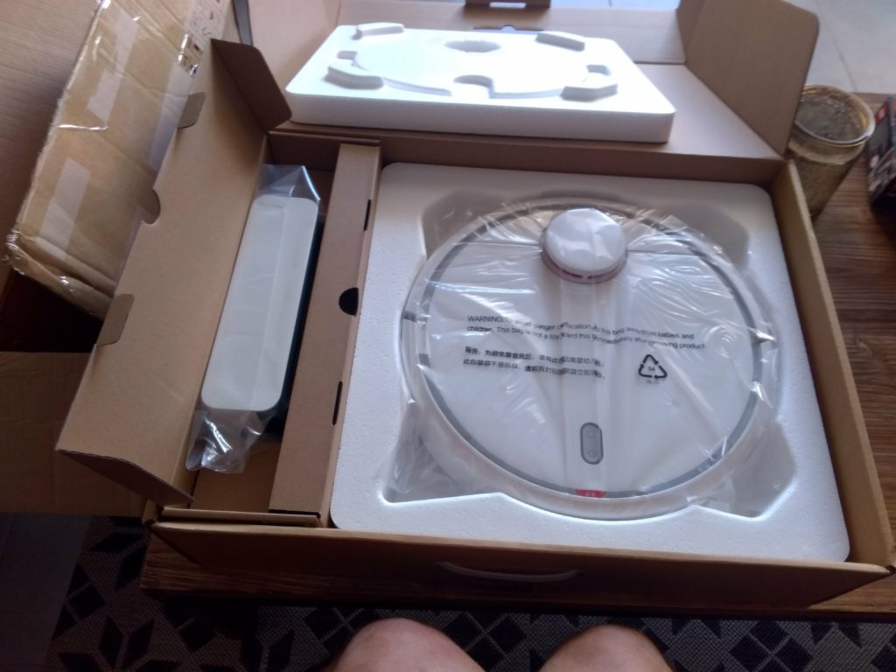

Malgré les « quelques kilomètres parcourus », le carton n’avait qu’un petit coin corné, mais l’aspirateur est très bien protégé dans un carton uni, ensuite dans un carton estampillé Xiaomi, puis entouré de polystyrène à l’intérieur. Donc pas trop de risques de ce coté la.

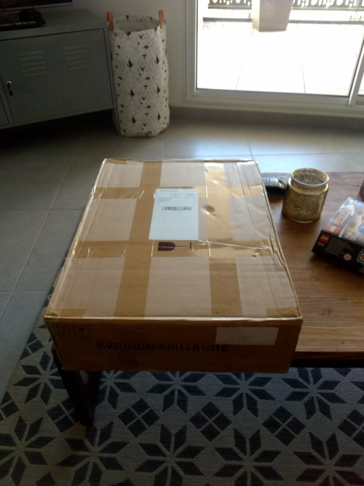 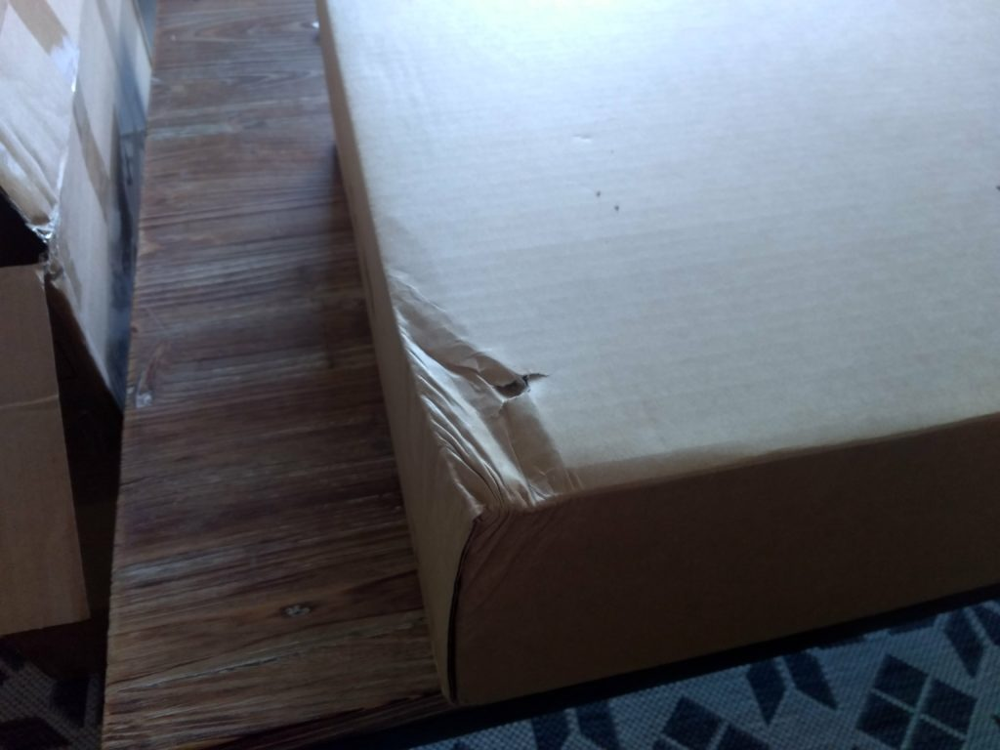 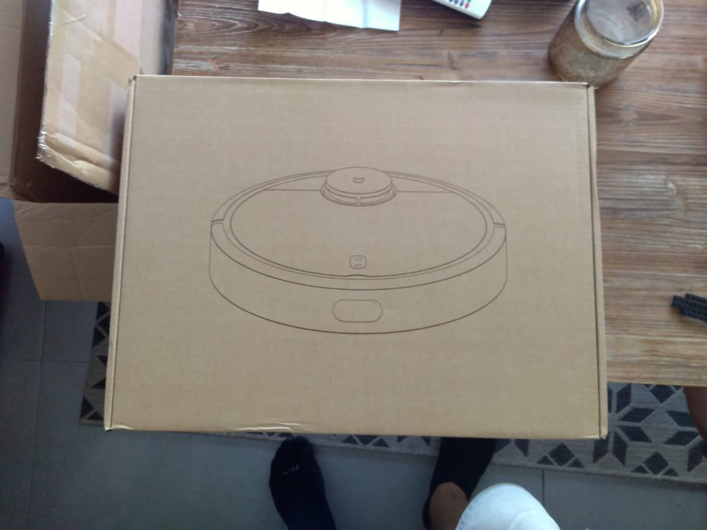

Ils font les choses bien chez Xiaomi (comme toujours), lorsqu’on ouvre la boite, on trouve une enveloppe avec à l’intérieur le mode d’emploi (en chinois). Pas d’inquiétude, la version en anglais est disponible ici : [User manual for Xiaomi Mi-Robot](http://files.xiaomi-mi.com/files/vacuum_cleaner/vacuum_cleaner-EN.pdf).

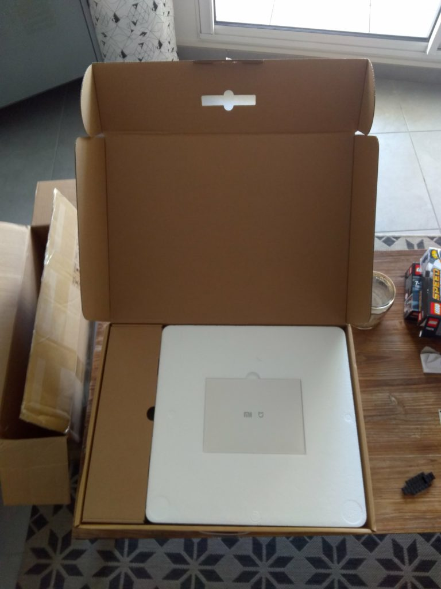 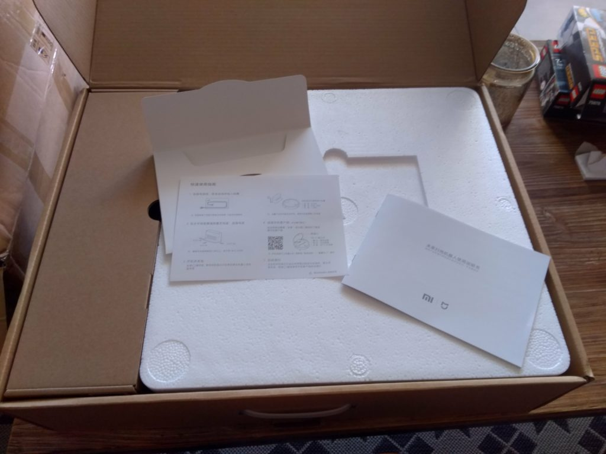

On retrouve des explications tout au long du déballage, bien sur en chinois, mais la plupart sont illustrées et compréhensibles. Dans le colis, il y a, bien évidement, l’aspirateur, la centrale de rechargement, le câble de branchement et un peigne de nettoyage.

Le câble de branchement nécessite un adaptateur pour prises européennes 1,45 € chez Gearbest ou [4 € les 2 sur Amazon](http://amzn.to/2v5CN7u) (Prime). Vous pouvez toujours changer le câble comme je l’ai fait sur [Enceinte connectée Mi-Speaker Xiaomi.](/articles/enceinte-connectee-wifi-upnp-bluetooth-mi-speaker-xiaomi)

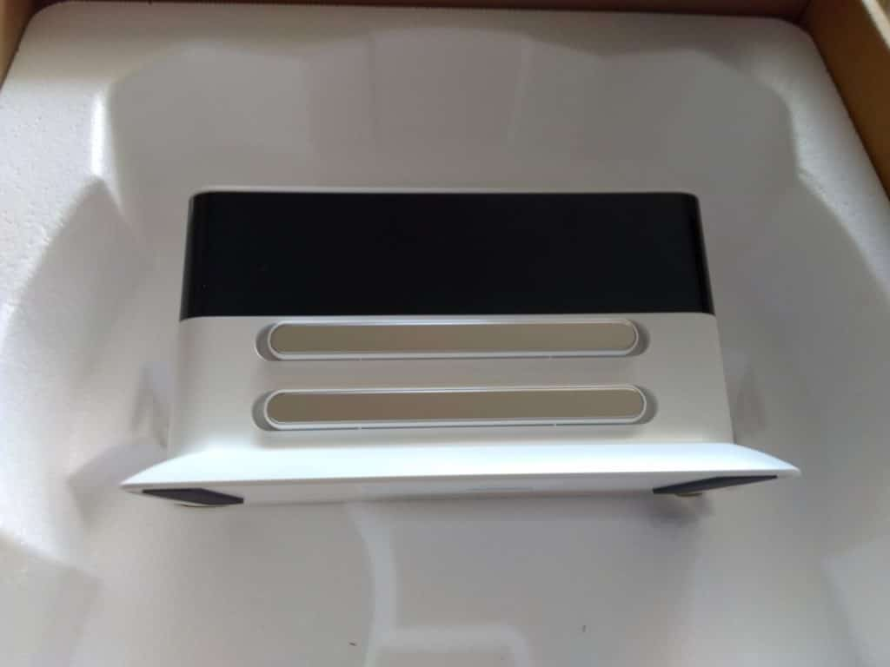 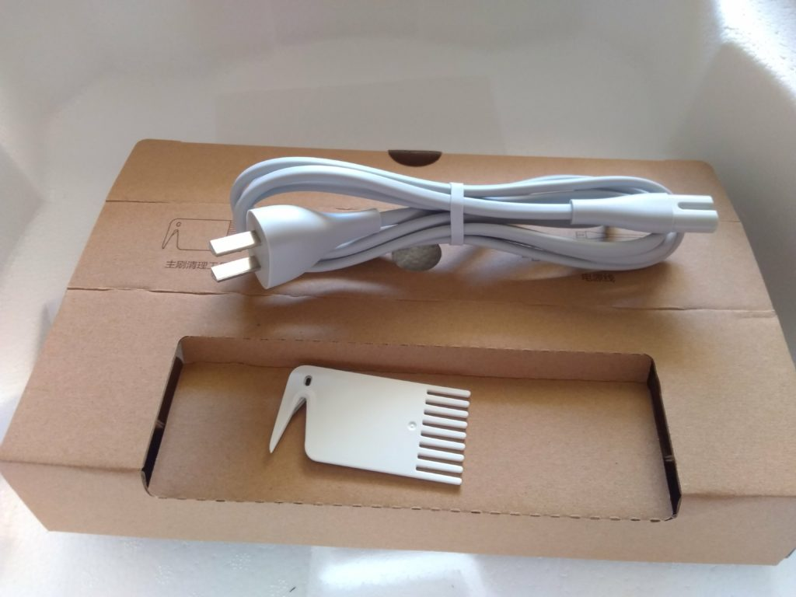 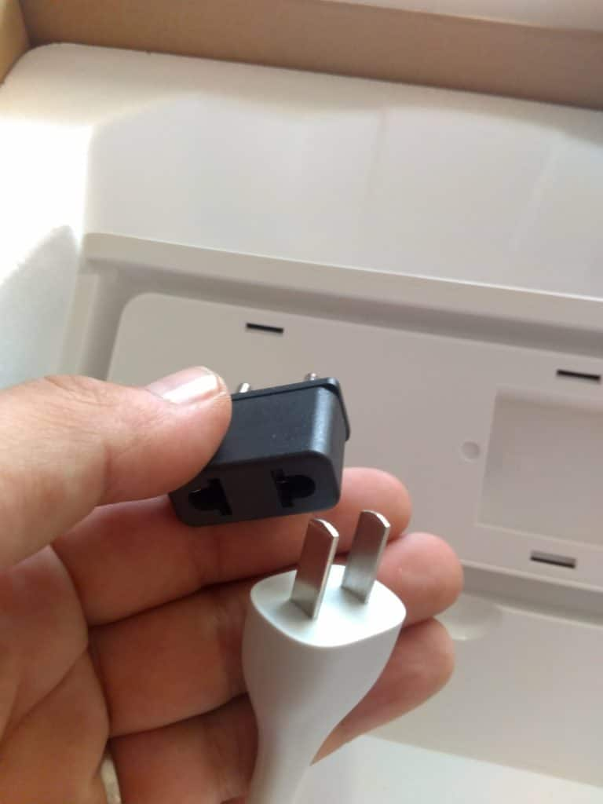 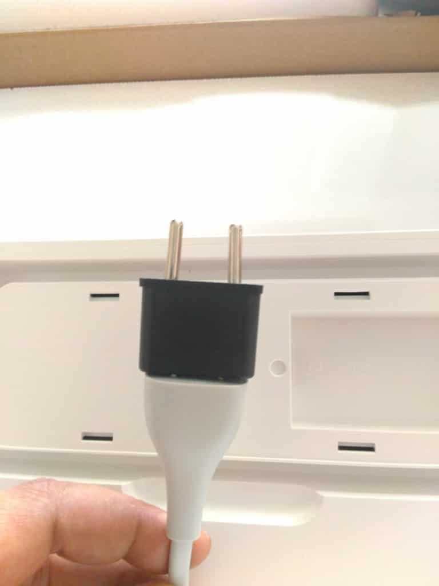 

## **Les fonctions de base de l’Aspirateur Robot Xiaomi Mi-Robot**

Le Mi-Robot peut être **contrôlé** sans l’aide de l’application, **grâce aux deux boutons de contrôle** situés sur le dessus :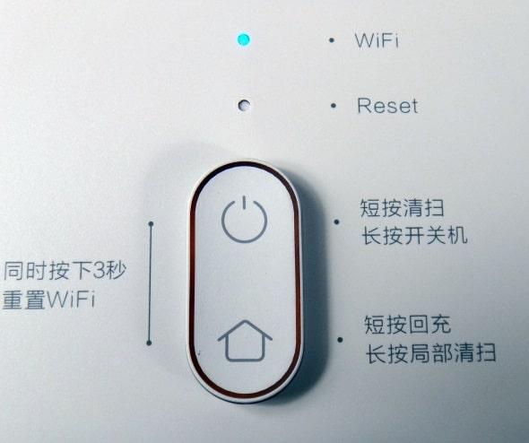

- **Bouton Power** :
  - Appui court : Arrêter ou démarrer le nettoyage.
  - Appui long : Allumer ou éteindre le Mi-Robot.
- **Bouton Maison :**
  - Appuie court : Retour forcé à la station de recharge.
  - Appuie long : Nettoyage d’une zone ciblée.

_Le **retour** à la **base** de chargement est **automatique**. Le **nettoyage** **reprendra** si nécessaire, une fois le Mi-Robot rechargé._ Ces **deux boutons** sont **cerclés** d’un **anneau** lumineux qui permet d’indiquer **l’état** de l’aspirateur :

- **Blanc** : Batterie à plus de 50% de charge.
- **Jaune** : Batterie entre 50 et 20% de charge.
- **Rouge** : Batterie à moins de 20 % de charge.
- **Clignotement lent** : Chargement ou nettoyage.
- **Clignotement rouge rapide** : Alarme.

Pour finir avec les **fonctions** disponibles **directement** sur le Mi-Robot, on à les **notifications** audio indiquant l’état (Démarrage & Fin du nettoyage, Retour à la base, Bac à vider…).

## **Les fonctions** **connectées.**

**Grâce à l’application Mi-home,** vous avez un controle complet du Mi-Robot :

- Les **fonctions** de **base** sont aussi **disponibles** à **distance** :
  - **Arrêter ou démarrer** le nettoyage avec en plus le choix de la puissance.
  - **Retour** forcé à la station de recharge.
  - Nettoyage d’une **zone ciblée**.
- Et en plus, vous avez des **fonction** spécifiques :
  - **Cartographie** du logement avec le tracé de nettoyage, le temps et la superficie nettoyé.
  - Réglage de la **puissance** de nettoyage (Calme, Intermédiaire, Turbo, Vitesse maximum).
  - **Programmation** du nettoyage, unique ou répété (jours de la semaine, weekend ou personnalisé), avec choix de la puissance.
  - Mode « **Ne pas déranger** » pour autoriser le nettoyage et les notifications audio seulement à certaines heures.
  - **Notifications** push de debut et de fin de nettoyage, ainsi que l’état et les alertes (bloqué, station non trouvée, nettoyage des capteurs…).
  - **Historique** du nettoyage avec carte, tracé, puissance, temps et superficie nettoyée par session et en cumulé.
  - **Etat des composants**, avec délais avant changement ou nettoyage. (Filtres, Brosses, capteurs…).
  - Contrôle par **joystick** **virtuel**. (Disponible seulement en local.)
  - Réglage de la **langue** pour les **notifications** audio. **Non disponible en français**, mais il est **possible** de choisir **l’anglais** ou de les désactiver.
  - **Localisation** du Mi-Robot. L’aspirateur émet un message audio afin de le retrouver dans l’appartement en cas de perte.

## **Les fonctions liées à la passerelle Mi-home.**

Si vous possédez une **[Gateway Mi-home](/articles/installation-et-configuration-de-la-gateway-xiaomi)**,vous pouvez créer des **scènes** **contrôlant** le Mi-Robot via l’application Mi-Home, comme par exemple :

- **Lancer** le nettoyage **automatiquement** si, en semaine de 8:00 à 10:00, la porte d’entrée est fermée et qu’il n’y a pas de mouvement depuis 30 minutes.
- Associer le **demarrage** du **nettoyage** et de **l’alarme** à un [interrupteur mural](/xiaomi-les-interrupteurs-muraux-aqara-wall-switch) ou [un bouton](/articles/jeedom-scenario-bouton-switch-xiaomi).

_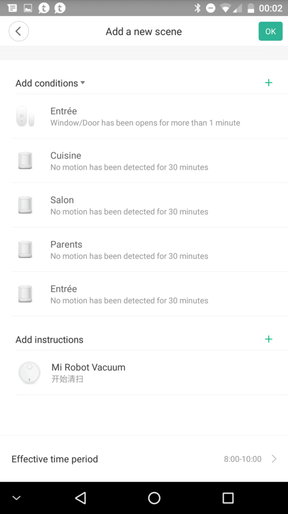 Pour le moment, les **fonctions** de l’aspirateur sont en **chinois**, j’espère qu’une traduction en anglais sera bientôt disponible._

## Démarrage de l’Aspirateur Robot Xiaomi Mi-Robot

Pour la partie [Description,](/presentation-xiaomi-mi-aspirateur-robot#Description) [Caractéristiques,](/presentation-xiaomi-mi-aspirateur-robot#Caracteristiques) [Déballage,](/presentation-xiaomi-mi-aspirateur-robot#Deballage) je vous invite à **relire** l’article de [Présentation – Xiaomi Mi-Robot – Aspirateur Robot.](/presentation-xiaomi-mi-aspirateur-robot) L’aspirateur **fonctionne** avec l’application **Mi-Home** que l’on connait bien, car c’est elle qu’on utilise pour **contrôler** la **Gateway** Xiaomi. N’hésitez pas à lire [cet article](/articles/installation-et-configuration-de-la-gateway-xiaomi#Installation_de_lapplication_Mi-Home) si vous n’avez pas encore installé l’application.

1.  1.  **Ouvrir** l’application **Mi-home**.
    2.  **Cliquez** sur le « **+** » en haut à droite et sélectionner « **Add device**« .
    3.  **Lever le capot** de l’aspirateur et appuyer **simultanément** sur les **2 boutons** du dessus (Power et Maison) jusqu’à ce que **l’indicateur** WIFI **clignote**.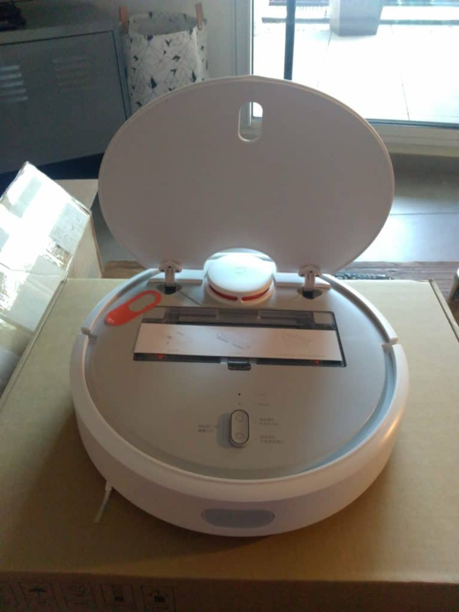
    4.  Depuis l’application **Mi-Home**, cliquez sur « **Scan** » et attendre que l’aspirateur soit **détecté**.
        - _Si ce n’est pas le cas cliquer sur « Add manually » et sélectionner « Mi Robot Vacuum »._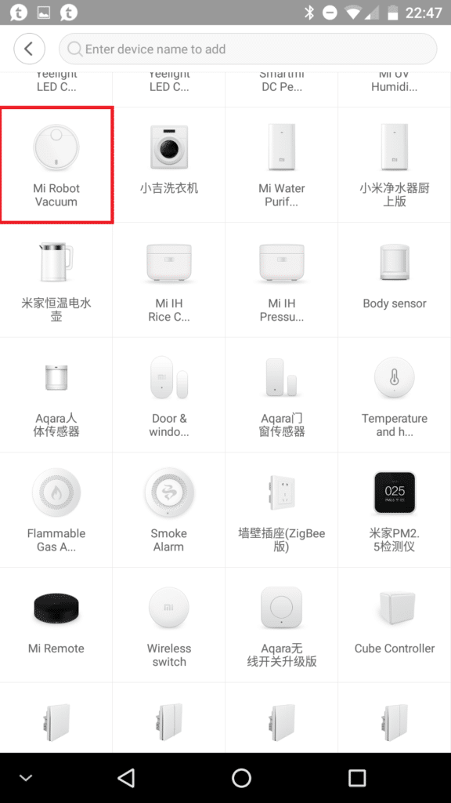
        - Si ça ne fonctionne toujours pas, regarder dans les **réseaux wifi** depuis votre téléphone, ou PC, s’il y a un réseau qui ressemble à « **rockrobo-vacumum… »**. Si ce n’est pas le cas, **recommencer l’étape 3**.
    5.  Une fois l’aspirateur **trouvé**, vous pouvez **l’ajouter** à la liste des appareils connectés.
    6.  Il faudra, bien sûr, **choisir** votre réseau **wifi** et saisir le **mot de passe** pour qu’il se **connecte** à votre réseau local.

## Configuration de l’Aspirateur Robot Xiaomi Mi-Robot

Pour **configurer** votre Mi-Robot il suffit d’ouvrir **Mi-home** et de cliquer sur l’icone « **Mi Robot Vacuum** » dans la liste des appareils.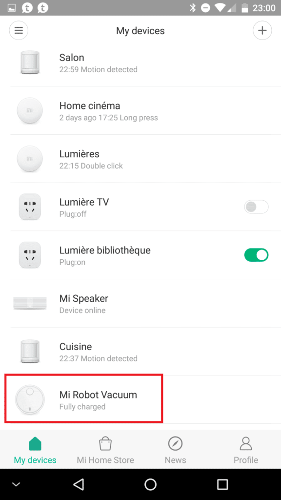 Vous allez vous retrouver sur la **page principale** qui représente la **cartographie** de la zone nettoyée par l’aspirateur. Comme il n’a encore rien nettoyé, vous devez avoir juste un **point qui clignote au centre**. Il symbolise votre aspirateur sur sa station de chargement. 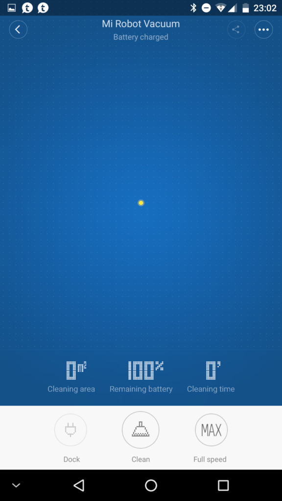 Vous avez aussi les **informations** suivantes :

- La **superficie** nettoyée (0m²).
- Le niveau de **batterie** (100%).
- Le **temps** de nettoyage (0′).

Trois **actions** sont possibles :

- **Dock** : Retour à la station de chargement. Normalement grisé si l’aspirateur y est déjà.
- **Clean** : Permet de lancer le nettoyage.
- **Full speed** : permet de régler la puissance de nettoyage. (Quiet, Balanced, Turbo, Full speed.)

En haut à droite, vous avez toujours les **3 points** « … » permettant d’accéder au menu des **réglages**. 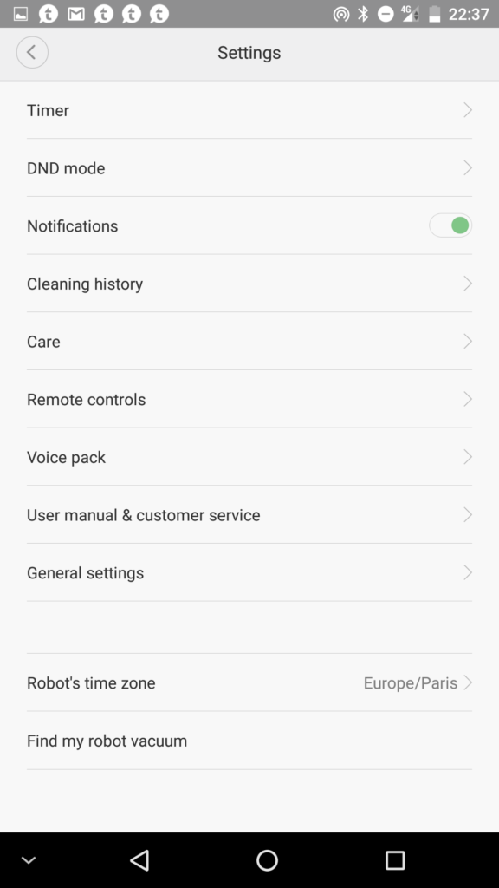

- **Timer** : Programmation du nettoyage, unique ou répété (jours de la semaine, weekend ou personnalisé), avec choix de la puissance.

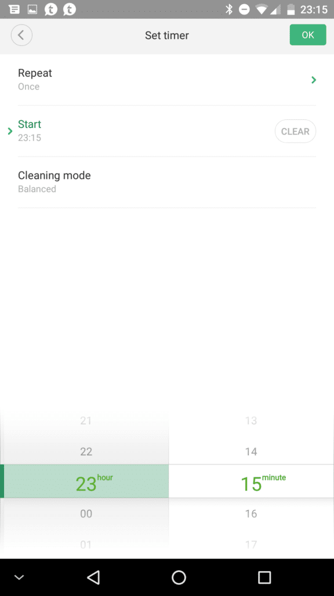

- **DND mode** : Mode « Ne pas déranger » pour autoriser le **nettoyage** et les **notifications** audio, seulement à **certaines** heures.
- **Notifications** : A activer si on veut recevoir des **notifications** de **début** et de **fin** de **nettoyage**, ainsi que **l’état** et les **alertes** (bloqué, station non trouvée, nettoyage des capteurs…).
- **Cleaning history** : Historique du **nettoyage** avec carte, tracé, temps et superficie nettoyée par **session** et en **cumulé**.
- **Care** : **Etat** des **composants**, avec délais avant changement ou nettoyage. (Filtres, Brosses, capteurs…).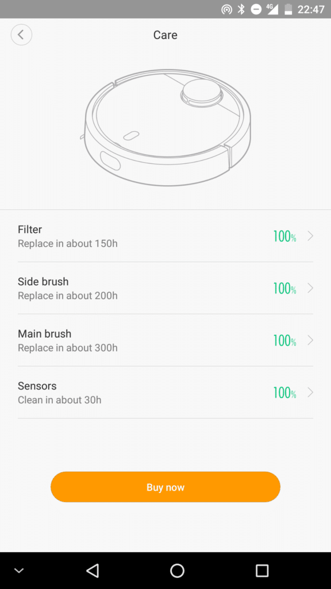
- **Remote controls** : Contrôle par **joystick virtuel**. (Disponible seulement en local.)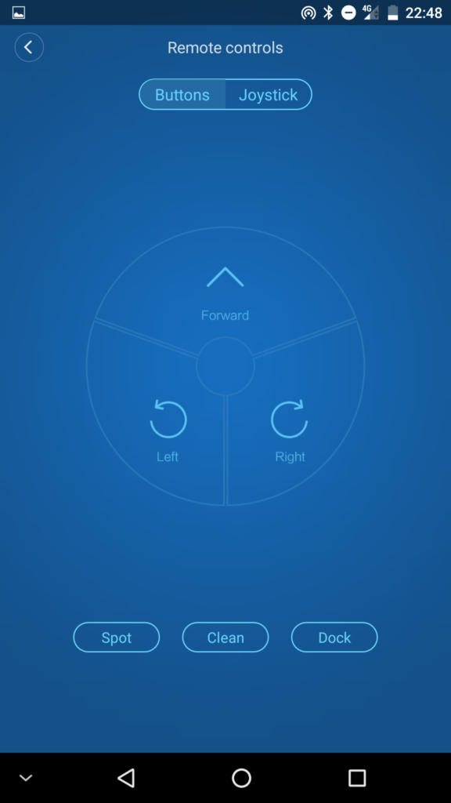
- **Voice pack** : Réglage de la langue pour les **notifications audio**. Non disponible en français, mais il est possible de choisir l’anglais, ou de les désactiver.
- **User manual & customer service** : Mode d’emploi de l’aspirateur en anglais et avec photos et vidéos.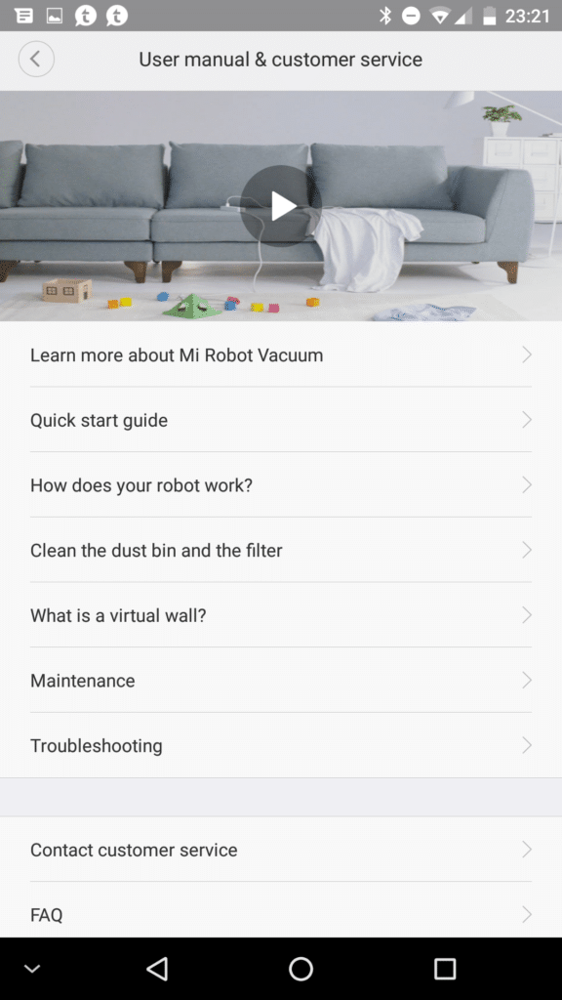
- **General settings** :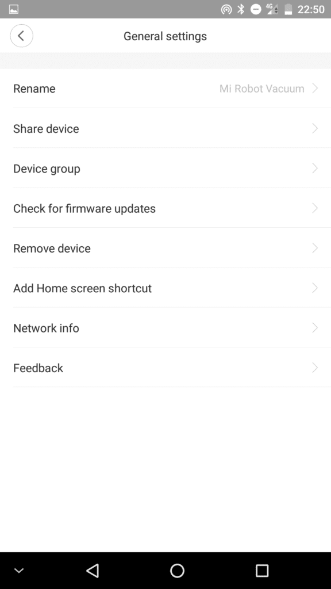
  - **Rename** : Pour changer le **nom** du Mi-Robot.
  - **Share device** : Permet **d’autoriser** une autre personne à **contrôler** l’aspirateur. Pratique si un membre de votre famille à son propre compte Xiaomi et utilise l’application Mi-home.
  - **Manage locations** : Affecter l’aspirateur à une **pièce de la maison**.
  - **Check for firmware updates** : pour vérifier si le **micrologiciel** de l’aspirateur est à jour.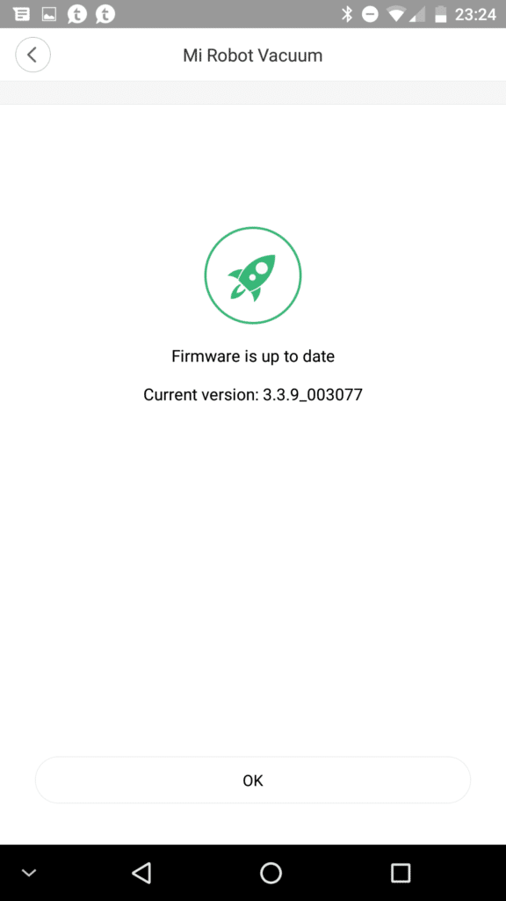
  - **Remove device** : Pour **supprimer** l’aspirateur.
  - **Add home screen shortcut** : Pour avoir l’aspirateur sur la page principale de l’application.
  - **Network info** : Nom du wifi, puissance du signal, adresse IP et MAC…
  - **Feedback** : pour **envoyer** un message à **Xiaomi**.
- **Robot’s time zone** : Réglage de **l’heure** automatique.
- **Find my robot vacuum** : **Localisation** du Mi-Robot. L’aspirateur émet un message audio afin de le retrouver dans l’appartement **en cas de perte**.

## Utilisation

### Comportement de nettoyage

Avec un **diamètre** de seulement **34 cm** et une **hauteur** de **9 cm**, il passe presque partout. Le niveau **sonore** est de **66-68 décibel**…, ça ne fait pas beaucoup de bruit. Le Mi-Robot passe à **1 cm des murs** et des **meubles** et avec sa **brosse latérale,** il récupère la poussière dans les moindres recoins. Il fonctionne très bien sur **toutes les surfaces**, les tapis à poils courts ou moyens, j’ai pas de poils longs et il peut **régler** automatiquement la **hauteur** de la **brosse** en fonction de la surface qu’il nettoie (surfaces lisses, moquettes…). Les **roues** ont des **suspensions** indépendantes, et le robot peut **escalader** des pentes jusqu’à 15 degrés. Je n’ai **pas d’animaux** chez moi pour tester le ramassage des **poils**, mais en ce qui concerne les **long cheveux**, ceux de ma femme pas les miens, ils ne font pas un pli lorsque l’aspirateur passe. La batterie, **lithium-ion de 5200mAh**, peut durer **150 minutes** en nettoyage **continu**, ce qui équivaut, en **théorie**, à **250 m²** de nettoyage. Par exemple, mon appartement fait **90m²** avec **3 chambres** en parquet (Parents et 2 enfants) et le reste en carrelage. Si je fais un nettoyage complet la **surface** nettoyée est de **60 m²** (hors buanderie, toilettes, meubles au sol…), il met à peu près **60 minutes** pour effectuer son parcours et la **batterie** est encore à **50%** de charge à la fin. Pour les très **grandes surfaces** qui utilisent toute la capacité de la batterie, le Mi-Robot **retourne** à sa **station** de chargement et après le **rechargement**, il se souvient de son dernier **emplacement** et revient à cet endroit précis pour **reprendre** le nettoyage. Chez moi, j’ai des **tapis à franges**, un **tapis** de jeu pour **bébé**, un **tipi** avec un **tapis** et des **coussins**, des **tapis** de sol **épais** dans la salle de bain, pas mal de **recoins**, des **meubles** au **sol** et d’autres sur **pieds** de quelques centimètres de haut, des **murs pas** toujours **d’équerre** et beaucoup de **bordel** sous les lits ! Malgré cela, **l’aspirateur** ne s’est **bloqué** **qu’une** seule **fois**. Lors d’une cession de nettoyage, le **câble** d’un chargeur **d’Ipad** s’était **enroulé** (très régulièrement) autour de la **brosse** sous le robot. Le **câble** fonctionne toujours et pour **l’enlever**, il à suffit de **tirer** dessus et il s’est **déroulé** tout simplement. J’avais par ailleurs bien reçu au préalable, une **notification** sur mon téléphone ainsi qu’une **notification** **vocale**, demandant de **libérer** la brosse.

### Le bac à poussières

Le bac fait **0,42 litre**, ça vous parle ? Moi pas vraiment… Je vous laisse **regarder** sur les **photos** pour vous faire une idée, mais je trouve que le **volume** du bac est largement **suffisant**, chez moi il permet de faire **plusieurs** nettoyage. La **périodicité** pour le vider **dépendra** évidemment de la **superficie** à nettoyer, de la **présence** d’animaux ou non, et bien entendu, de la **fréquence** de nettoyage… La première fois que j’ai voulu **vider le bac à poussières**, j’ai du **chercher** un petit moment avant de **trouver** comment faire. Du coup j’ai pris quelques photos pour vous **montrer** comment vider le bac à poussières du Mi-Robot.

### Barrière virtuelle

La **barrière virtuelle** (9 €) n’est **pas** livrée **avec** l’aspirateur, il faut **l’acheter** en plus, soit dans le kit d’accessoires soit seul. Personnellement, je ne l’ai **pas commandée**, car j’ai celle de mon précédent aspirateur robot [Neato](http://amzn.to/2y4ytmD) (livrée avec) et d’après la photo, ça avait l’air d’être le **même principe** qui est un long ruban aimanté qui permet **d’empêcher** l’aspirateur d’aller dans un **lieu** où on ne souhaite pas qu’il aille, ou de protéger une **partie** de la maison bien **précise**. C’est **pratique** par exemple pour faire une **barrière** autour des playmobils ou des Legos, afin qu’il n’avale pas toutes les petites pièces qui traînent. Pour les risques de **chutes** dans le vide, il y a des **capteurs** qui évitent que le robot **tombe** dans les escaliers, ou du haut d’un balcon. Après, je ne tenterai pas le diable !  Si vous avez un **risque** de ce type chez vous, une petite **barrière** virtuelle à moins de 10 € ça peut être très utile. Celle du Mi-Robot a l’air plus **fine** et **découpable**, afin de placer plusieurs **bouts** de barrières dans la maison et ainsi de les **cacher**, sous les pas de porte par exemple. Je vous tiendrai au courant si j’en commande une. Pour finir, j’aurai personnellement **aimé** un système un peu moins « **mécanique** » qui utiliserait la **cartographie** pour **interdire** certaines **zones** que l’on pourrait **programmer** et **intégrer** dans les **scénarios** en fonction de la **présence** et des **heures** de la journée. Mais le **produit** est aussi destiné à un large **public** qui en majorité, se **satisfera** totalement de cette **barrière** physique.

### Les accessoires

Un kit d’accessoires composé de **5 éléments** qu’il faut remplacer régulièrement, est **disponible** aux alentours de **45**€. Le niveau **d’usure** est disponible sur l’application **Mi-Home**, je pense qu’une **notification** est envoyée lorsque le niveau d’usure commence à être élevé. Les **5 éléments** sont aussi disponible dans le **kit** ou à **l’unité** :

- **Barrière virtuelle** : 9 € Gearbest ou [17€ + 10 € frais ports](http://amzn.to/2jsaT0z) Amazon.
- **Filtre HEPA X2** : 10 € Gearbest ou [15€ (prime)](http://amzn.to/2fajJPk) Amazon.
- **Brosse principale** : 9€ Gearbest ou [15€ (prime)](http://amzn.to/2jsaT0z) Amazon.
- **Brosse latérale** : 5€ Gearbest ou [15€ (Prime)](http://amzn.to/2vXo8rI) Amazon.
- **Carters de protection** : 8€ Gearbest ou [18€ (Prime)](http://amzn.to/2fasZTj) Amazon.
- **Kit d’accessoires** : 41€ Gearbest ou [40€ (Filtres + brosses](http://amzn.to/2x45Tm4)) Amazon.

## Xiaomi Mi-Robot VS Neato XV

Vous allez me dire **comparons** se qui est **comparable**, le [Neato](http://amzn.to/2y4ytmD) est un **vieux** modèle et il n’est **pas connecté**. Ok, mais il se trouve que je n’ai pas d’autres modèles à comparer et en plus comme ce **modèle** est **populaire,** je pense que ça **permettra** à certains d’entre vous de pouvoir faire la **comparaison**.

Contrairement au Mi-Robot, le [Neato](http://amzn.to/2y4ytmD) est **contrôlable** uniquement via les **menu** de l’aspirateur. Le menu du [Neato](http://amzn.to/2y4ytmD) est en **français** et permet « **facilement** » de choisir une **option.** Par exemple « nettoyage ciblé », pas besoin de se **souvenir** des codes **couleurs** ou des actions sur les **boutons**. Par contre, il y a **moins** d’options que sur l’application du Mi-Robot et il n’y a pas non plus de **notification** lumineuses ni vocales, il bip simplement.

_(Je ne peux pas mettre de photos du menu du Neato, car il ne fonctionne plus sur le mien.)_

Le [Neato](http://amzn.to/2y4ytmD) n’étant **pas connecté**, pour faire les **mises à jour**, il faut aller sur le site du fabriquant et brancher un câble **USB**. Coté **performance** et **confort,** le Mi-Robot bat le [Neato](http://amzn.to/2y4ytmD) à plate de couture !

Le Mi-Robot est **beaucoup**, mais alors, **beaucoup** **moins** **bruyant**. Avant, je ne faisais même pas **tourner** le [Neato](http://amzn.to/2y4ytmD) dans une pièce à côté tellement le **bruit** était **fatiguant**, alors que je peux **rester** dans la **même** pièce que le Mi-Robot **sans** être trop **gêné**. Mais autant lui faire réaliser sa procédure de **nettoyage** lorsqu’il n’y a **personne** à la maison.

Le Mi-Robot **reprend** le système de **scanner** d’obstacle du [Neato](http://amzn.to/2y4ytmD), mais il est beaucoup plus **malin** pour éviter les objets et s’en **dépatouiller** aisément. _A force de devoir **chercher** le [Neato](http://amzn.to/2y4ytmD) en rentrant à la maison et de le **décoincer** d’un tapis, de sous un meuble, ou en équilibre sur un pied de lampe, on l’avait affublé du joli petit nom de « Débilo ». Par réflexe mon fils de 5 ans appelait aussi le Mi-Robot « Débilo », mais un jour il ma dit : »Il faut lui donner un autre nom, car il trop malin le nouveau »._

Au niveau des **accessoires**, on était pour le [Neato](http://amzn.to/2y4ytmD) dans les [20€ la brosse](http://amzn.to/2y2C6t7), [13€ les 4 filtres](http://amzn.to/2h6UM81), [30€ les 2 batteries](http://amzn.to/2f8wt8Y).

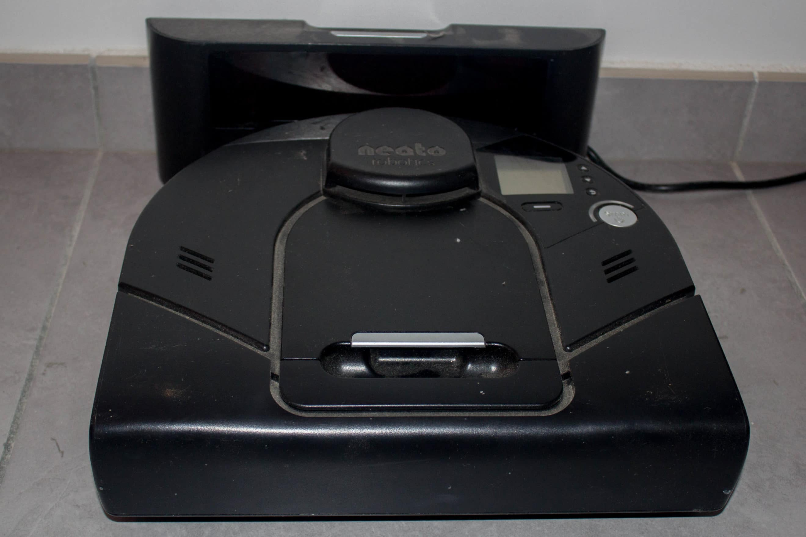

Le Neato sur sa station de rechargement.

## Conclusion

Voila mon **retour d’expérience** sur l’aspirateur Mi-Robot de Xiaomi et je dois dire que c’est un **bonheur** à utiliser aussi bien via l’application **Mi-home** qu’avec les **boutons** en façade (on se rappelle vite des options) et les nombreuses **possibilité** que cela apporte.

On voit bien qu’il y a quelques **générations** entre le [Neato XV](http://amzn.to/2y4ytmD) et le Mi-Robot.

Le **bruit**, la **débrouillardise**, **l’autonomie** et le coté **connecté,** c’est vraiment un autre monde. Et on ne le répétera jamais assez, mais **Xiaomi** nous propose encore un produit de **qualité,** aussi bien au niveau des **matériaux** que de la **conception.** Et tout cela pour un **tarif** vraiment très **attractif,** car ceux qui passeront pas les sites comme **Gearbest,** le trouveront aux alentour des **230 / 250 €** sans oublier les **accessoires** qui ne coûtent pas la moitié du prix de l’aspirateur.

Il est bien sur **possible** de trouver des **pièces de rechange,** comme par exemple les roues (25€), la base de rechargement (55€), le bac à poussière (20€), la batterie (60€)… et même des autocollants de personnalisation.

\
