# Xiaomi Mi-Robot

> Comme l’aspirateur Robot Xiaomi Roborock S50 l’aspirateur **Mi-Robot de Xiaomi** est **compatible** avec la box domotique **Jeedom**, grâce au **plugin** Xiaomi de [Sarakha63](http://sarakha63-domotique.fr/) et [Lunarok](https://lunarok-domotique.com/), voyons comment l’intégrer.
>
> _**Une présentation de l’aspirateur Robot Mi-Robot de Xiaomi  est disponible ici : [Aspirateur Robot Xiaomi Mi-Robot](/articles/aspirateur-robot-xiaomi-mi-robot-le-test).**_

## **Les fonctions liées à Jeedom.**

Le plugin reprend les **informations** et **actions** principales de l’application **Mi-home**, mais grâce aux **scénarios** de Jeedom, on peut facilement **reproduire** et même **améliorer** certaines fonctions. 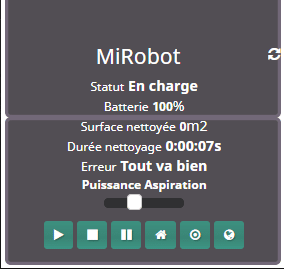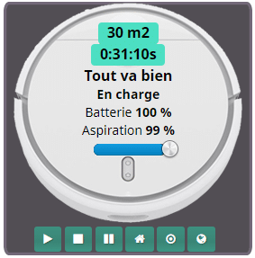

- **Les informations** :
  - **L’état** : En marche, En charge…
  - Le niveau de **recharge**.
  - La **puissance** d’aspiration.
  - La **surface** nettoyée.
  - La **durée** de nettoyage.
  - Les **erreurs**.
- **Les actions** :
  - Réglage de la **puissance** de 0 à 100.
  - **Démarrer**, arrêter, pause.
  - Retour à la **station** de chargement.
  - Nettoyage d’une **zone ciblée**.
  - **Localisation** du Mi-Robot.
- **Les fonctions via des scénarios** :
  - **Programmation** du nettoyage.
  - Mode **« Ne pas déranger ».**
  - **Notifications** push.

## Intégration de l’Aspirateur Robot Xiaomi Mi-Robot avec Jeedom

### Installation du plugin Xiaomi Home

Pour cette partie, je vous invite à lire l’article dédié à [Jeedom et Xiaomi Smart Home – Installation et configuration du plugin Xiaomi](/articles/installation-et-configuration-du-plugin-xiaomi).

### Associer le Mi-Robot et Jeedom

Contrairement aux **autres** composants qui sont **automatiquement** détectés et ajoutés à **Jeedom**, certains **appareils wifi**, comme l’aspirateur Mi-Robot, nécessitent quelques **manipulations** au préalable. Vous pouvez lire la doc qui se trouve ici : http://\[Ip_Jeedom\]/plugins/xiaomihome/doc/fr_FR/index.html#\_appliances_wifi_2 Voila mon **retour d’expérience** pour l’ajout de l’aspirateur à Jeedom. Apres avoir **lu la doc**, j’ai décidé d’utiliser la **première** **méthode** qui utilise [l’outil Mi Toolkit](https://github.com/ultrara1n/MiToolkit).

- Activer **ADB** sur votre téléphone (dans les options développeur)
- Lancer l’exe **MiToolkit** en admin
- Choisir « **Verbindung prufen**« 
- Choisir « **Token auslesen**« , le laisser faire la sauvegarde sur le PC et ne pas mettre de mot de passe
- Une **pop-up** apparaît avec les **tokens**

Personnellement je n’ai **pas** eu de fenêtre avec les **tokens**, mais un **message** en allemand :

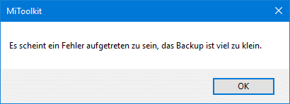

Il semble y avoir une erreur, la sauvegarde est trop petite.

J’ai donc **recommencé** plusieurs fois la manipulation **sans succès**. Je suis donc **retourné** voir la **doc** et là, les **autres** méthodes ne me convenaient pas :

- **aSQLiteManager** : Il faut un téléphone Android **rooté** et je n’en ai pas. Enfin si, un vieux mais sans Mi-home car il faut Android  4.0.
- **iPhoneBackup Viewer** : Il faut un **iPhone** et ma femme à un iPhone, mais elle n’est pas très **open** pour les **expériences** de ce genre.

J’ai donc **abandonné** la doc et j’ai cherché sur **différents** sites comment faire pour **récupérer** le token de l’aspirateur. J’ai trouvé un **tuto** qui utilise MiToolKit et j’ai donc décidé de **retenter** ma chance.

1.  J’ai **télécharger** [Mi Toolkit](https://github.com/ultrara1n/MiToolkit).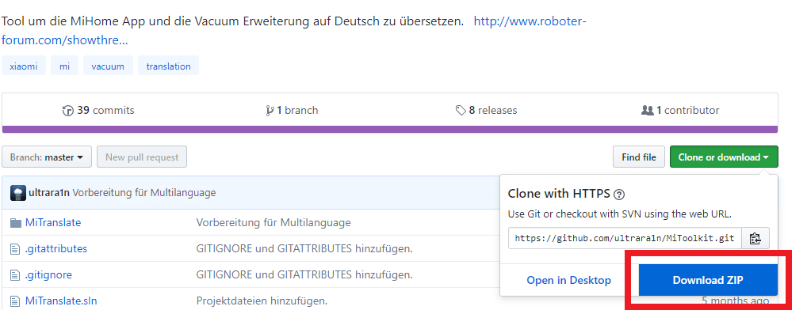
2.  Il n’y a pas d’installation, il faut juste **dézipper** le fichier.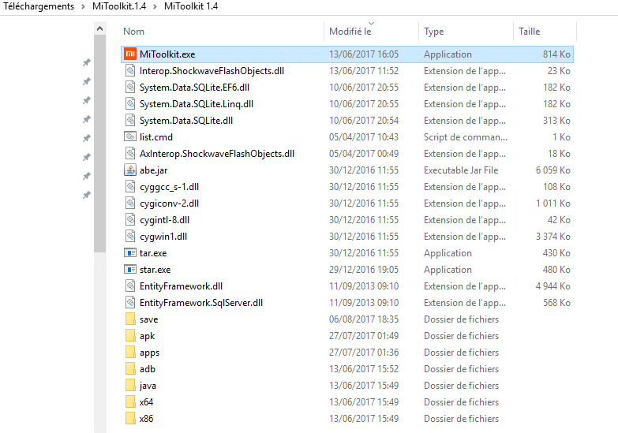
3.  Il faut maintenant **brancher** votre téléphone **Android** au PC via le port **USB**.
4.  **Activer** le mode **débogage**  USB.
    1.  Aller dans les **paramètres** du téléphone et « **A propos du téléphone**« . 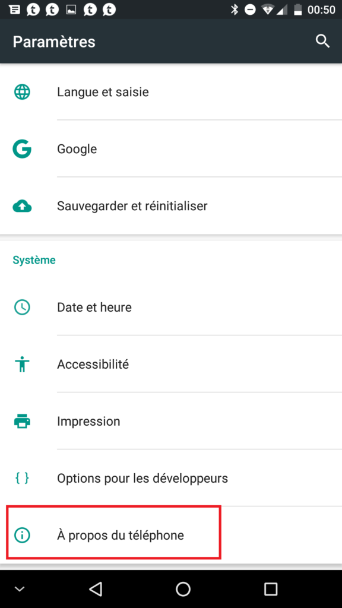
    2.  **Cliquez** plusieurs fois sur « **Numéro de build**« , jusqu’au message d’information. 
    3.  Aller dans le **nouveau** menu : « **Options pour les développeurs**« .
    4.  **Cocher** « Débogage USB ».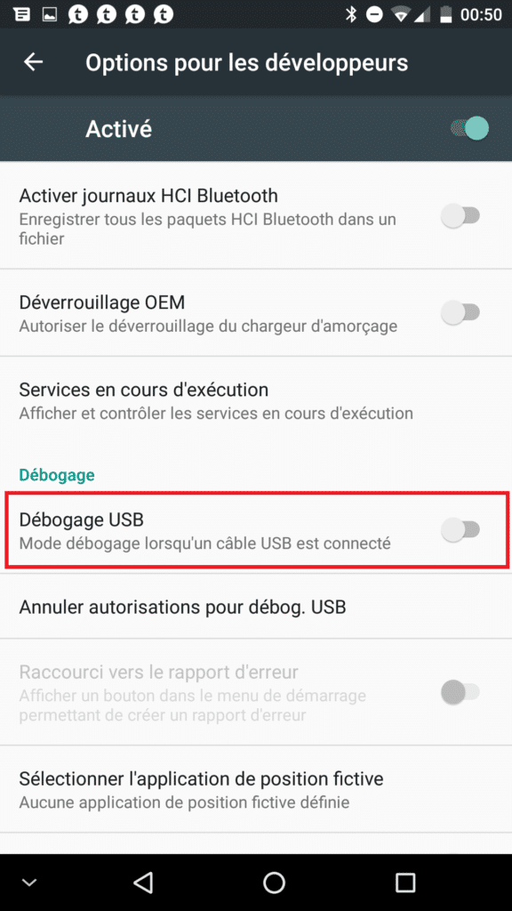
    5.  **Cliquer** sur « OK ».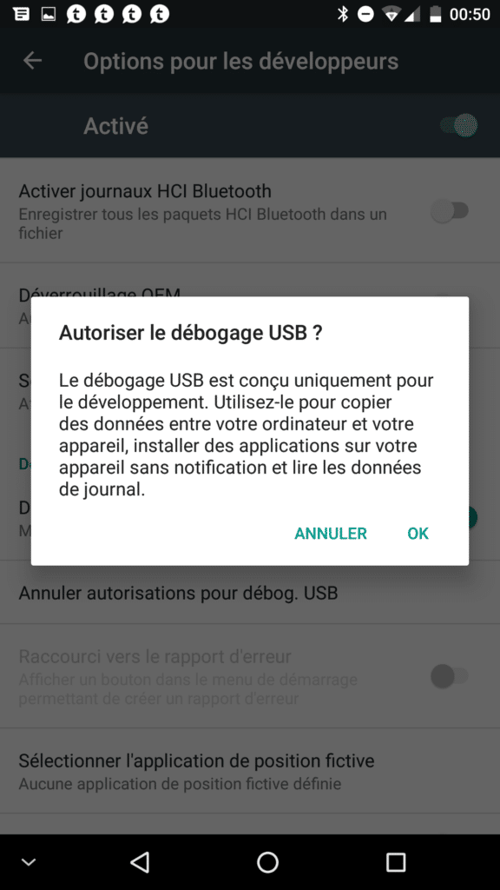
5.  Sur le PC, lancer l’application **MiToolKit** en mode **Administrateur**.
6.  Cliquer sur « **Verbindung prufen** » (Vérifier la connexion).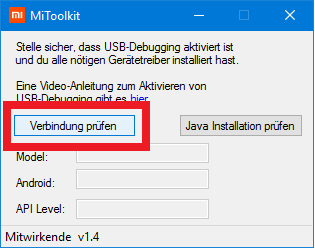
7.  Cliquer sur « **Token auslesen** » (Lecture des Token).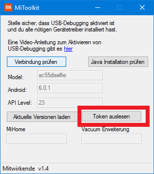
8.  Le message « **Bei der Sicherung KEIN Passwort vergeben** » (NE PAS attribuer de mot de passe à la sauvegarde) apparaît, cliquer sur OK. 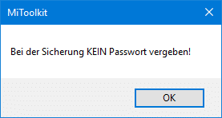
9.  Mi Home **s’ouvre** sur votre téléphone.
10. **Cliquer** sur « Sauvegarder mes données »
11. Le message « **Backup erfolgreich, wird jetzt entpackt** » (Sauvegarde réussie et décompressée) apparaît, **cliquer** sur OK.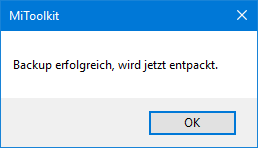
12. Une **fenêtre** appelée **Token** apparaît, récupérer le token à la ligne « **rockrobo.vacuum.v1 – Mi Robot Vacuum** » 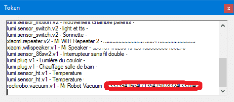
13. Allez dans **Jeedom** et depuis le **plugin** Xiaomi cliquer sur **Ajouter**.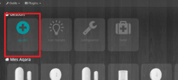
14.  **Sélectionner** « Robot Aspirateur ».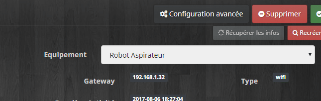
15. **Saisir** l’IP et le Token et **sauvegarder**.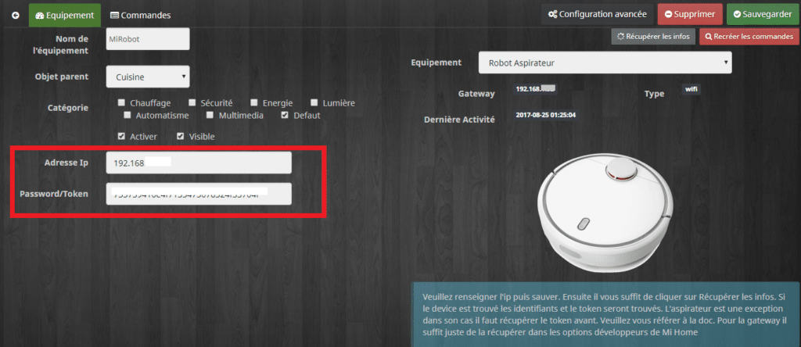
16. Cliquer sur « **Récupérer les infos**« . _Merci à François pour la remarque._

Si à l**’étape 11** vous avez le message « **Il semble y avoir une erreur, la sauvegarde est trop petite.** » pas de bol ça ne marchera pas. 🙂  Je ne saurai pas vous dire **ni comment, ni pourquoi**, j’ai réussi **une fois** et pas les autres… Essayez de **refaire** la manipulation depuis le **début**, aussi bien les **étapes** du **PC** que du **téléphone**. A Priori, je n’ai vu personne qui n’y arrivait pas, donc ça devrait aller pour vous. N’oubliez pas qu’il y a **2 autres méthodes** sur la **doc** **officielle** du plugin.

## Réinitialisation et réglages d’usine de l’Aspirateur Robot Xiaomi Mi-Robot

1.  Si vous n’arrivez pas à récupérer le token vous pouvez **réinitialiser l’aspirateur**, ce qui va **effacer** tous vos **réglages**, y compris le **wifi**.
    - **Appuyer** avec une pointe sur le bouton « **Reset** » se trouvant sous le capot jusqu’au **redémarrage** de l’aspirateur.
2.  Il est aussi possible de faire une **réinitialisation aux réglages d’usine**. - Garder **appuyé** le bouton « **Maison** » et appuyer en même temps sur le bouton « **Reset**« .
