# Aspirateur Robot Xiaomi Roborock S50

> Après l’aspirateur **Mi-Robot de Xiaomi** première version que je vous avais présenté dans les **articles** [Aspirateur Robot Xiaomi Mi-Robot](/articles/aspirateur-robot-xiaomi-mi-robot) et [Aspirateur Robot Xiaomi Mi-Robot le test](/articles/aspirateur-robot-xiaomi-mi-robot-le-test), je vous présente aujourd’hui la **seconde version**, l’aspirateur Robot Xiaomi Roborock S50.
>
> Cet **aspirateur** robot **connecté** reprend les caractéristiques de la première version, en **ajoutant** principalement une fonction de **nettoyage du sol**, à l’aide d’un système d’éponge humide. La **puissance d’aspiration** passe de 1800 Pa à 2000 Pa et un **mode « Tapis »** augmente la puissance d’aspiration lors de la détection d’un tapis.
>
> Son **prix** reste très **compétitif** par rapport aux marques connues en France. On arrive à le trouver aux alentours des **380 € chez Gearbest** avec [des codes promos](/articles).
>
> Sachez que la **première version**, le Mi-Robot est à environ 260 €, ce qui en fait un des **meilleurs rapports qualité / prix** du marché.
>
> _**Cet aspirateur est aussi compatible avec la box domotique Jeedom, grâce au plugin Xiaomi de [Sarakha63](http://sarakha63-domotique.fr/) et [Lunarok](https://lunarok-domotique.com/), le tutoriel d’installation est disponible ici : [Xiaomi Roborock S50 dans Jeedom](/articles/xiaomi-roborock-s50-dans-jeedom).**_

## Le déballage de l’aspirateur Robot Xiaomi Roborock S50

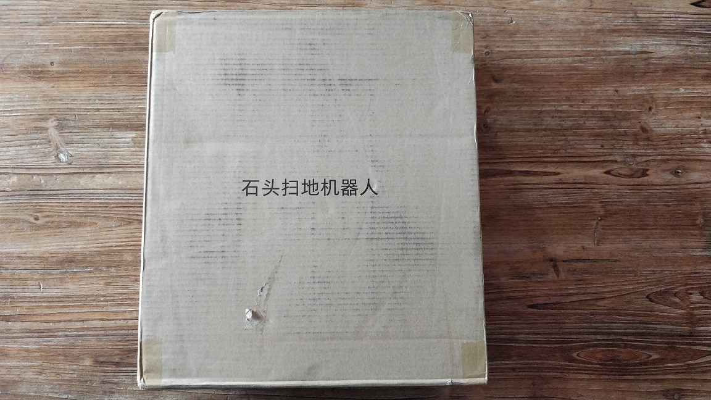

L’aspirateur Robot Xiaomi Roborock S50 est envoyé dans un carton simple mais suffisamment épais pour amortir les chocs.

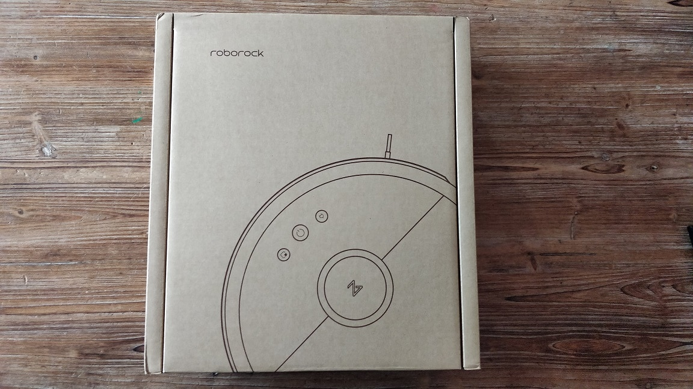

A l’intérieur, il y a un second carton, avec la marque et la photo de l’aspirateur Robot Xiaomi Roborock S50. Aucune trace de la marque Xiaomi. Seulement Roborock.

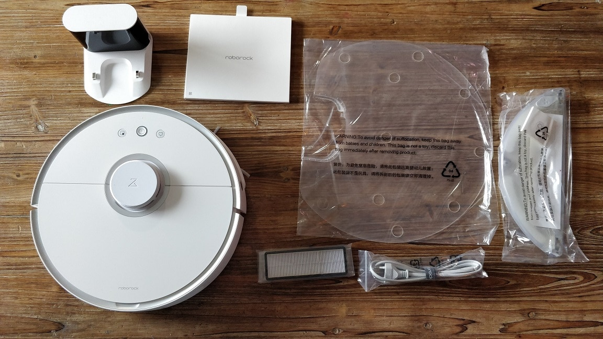

L’aspirateur est fourni avec une base de chargement (beaucoup plus petite que la V1). Un manuel d’utilisation, en Anglais. Un filtre supplémentaire. Un cordon électrique avec une prise au format Européen. C’est un cordon standard que vous pouvez facilement changer si vous n’achetez pas la version Europe. Un bac à eau avec 2 éponges. Des buses de rechange pour le système de nettoyage humide et une plaque de protection qui se fixe devant la base de chargement, surement pour protéger les éponges.

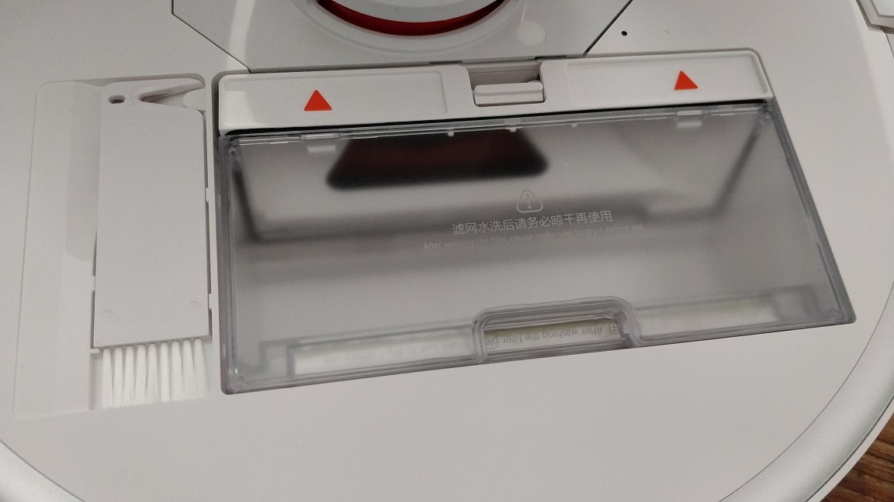

Le bac à poussières est sous le capot. Il est plus petit que sur le Mi-robot V1. Un peigne de nettoyage de la brosse est fournis et se loge à coté du bac à poussière.

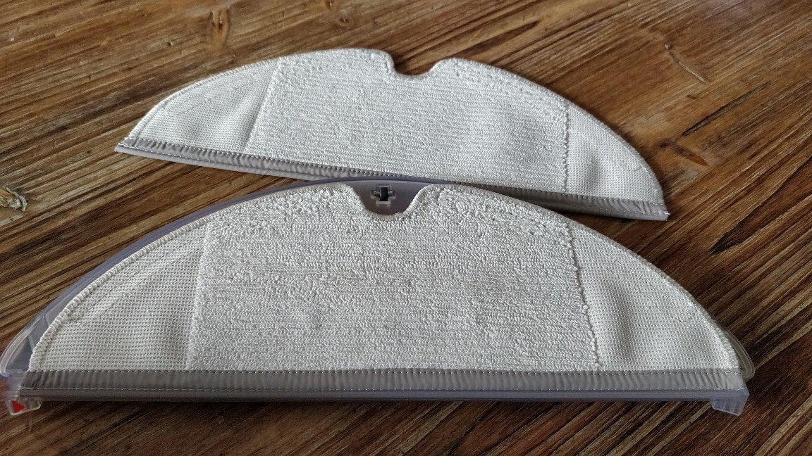

Les 2 éponges pour le système de nettoyage humide. Elles se fixent au bac à eau par un système de glissière et de scratch.

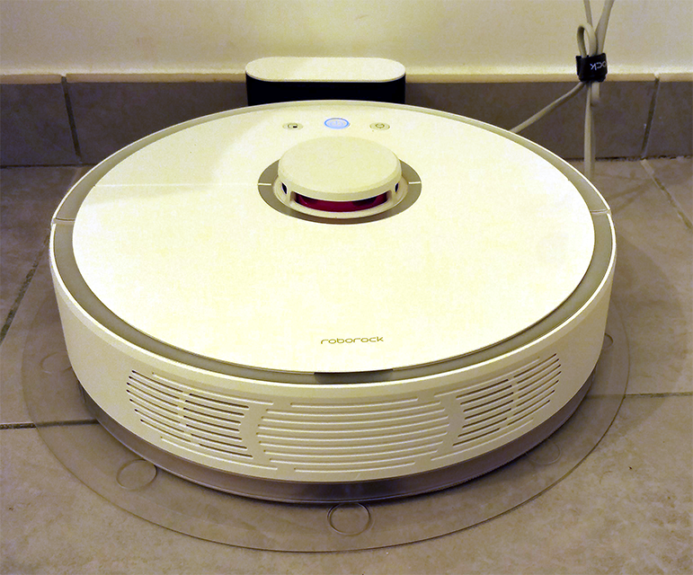

L’aspirateur Robot Xiaomi Roborock S50 sur sa station de recharge, avec la protection ventousé au sol.

## Utilisation de l’aspirateur Robot Xiaomi Roborock S50.

Il est possible de **contrôler** l’aspirateur sans l’aide de l’application Mi-Home, **grâce aux trois boutons de contrôle** situés sur le dessus :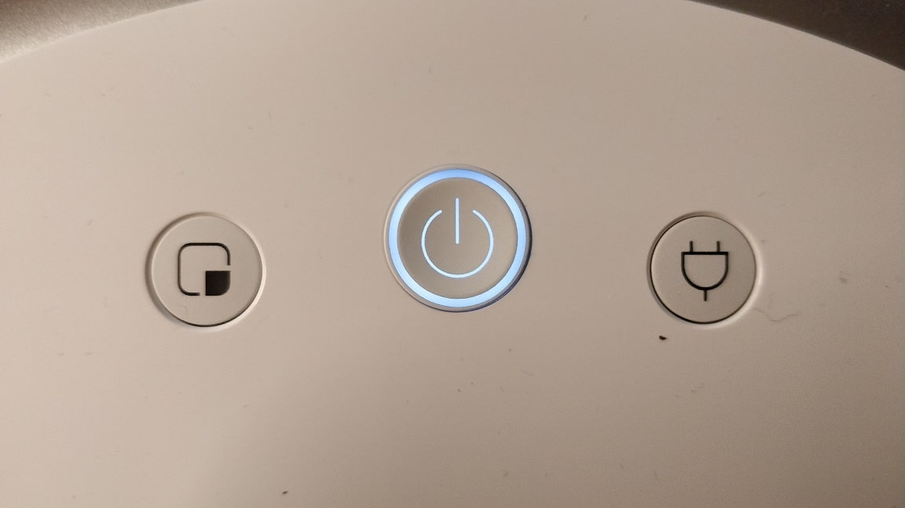

- **Bouton Spot cleaning :** 
  - Appuie court : Nettoyage d’une zone ciblée.
- **Bouton Power :**
  - Appui court : Démarrage du nettoyage.
  - Appui long : Allumer ou éteindre le Roborock.
- **Bouton Recharge :**
  - Appuie court : Retour à la station de recharge.

_**Info : En cours de nettoyage appuyez sur n’importe quel bouton pour arrêter le nettoyage.**_

_Le **retour** à la **base** de chargement est **automatique**. Le **nettoyage** **reprendra** si nécessaire, une fois le Roborock rechargé._

Le **bouton Power** est **cerclé** d’un **anneau** lumineux qui permet d’indiquer **l’état** de l’aspirateur :

- **Blanc** : Batterie à plus de 20% de charge.
- **Rouge** : Batterie à moins de 20 % de charge.
- **Clignotement lent** : Chargement ou nettoyage.
- **Clignotement rouge rapide** : Aspirateur en erreur.

Pour finir le _Roborock_ dispose de **notifications** audio indiquant son état (Démarrage & Fin du nettoyage, Retour à la base, Bac à vider…).

**Grâce à l’application Mi-home,** vous avez un controle complet du *Roborock* :

- **Arrêter ou démarrer** le nettoyage.
- **Retour** à la station de recharge.
- Nettoyage d’une **zone ciblée** autour de l’aspirateur.**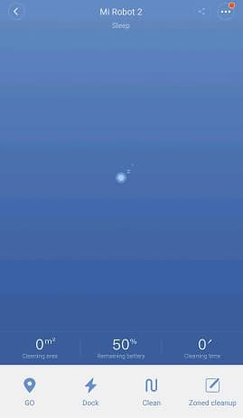**
- **Cartographie** du logement avec le tracé de nettoyage, le temps et la superficie nettoyée.
- **Sélectionner** une ou plusieurs **zones** spécifiques à nettoyer, sur la **carte** du logement.
- **Nettoyer** **plusieurs** **fois** les zones sélectionnées.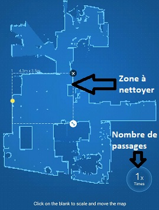
- Réglage de la **puissance** de nettoyage (Calme, Intermédiaire, Turbo, Vitesse maximum).
- **Nettoyage** avec option **serpillère**.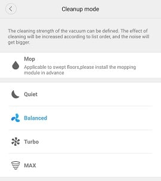
- **Programmation** du nettoyage, unique ou répété (jours de la semaine, weekend ou personnalisé), avec choix de la puissance.
- Mode « **Ne pas déranger** » pour autoriser le nettoyage et les notifications audio seulement à certaines heures.
- **Notifications** push de début et de fin de nettoyage, ainsi que l’état et les alertes (bloqué, station non trouvée, nettoyage des capteurs…).
- **Historique** du nettoyage avec carte, tracé, puissance, temps et superficie nettoyée par session et en cumulé.
- **Etat des composants**, avec délais avant changement ou nettoyage. (Filtres, Brosses, capteurs…).
- Contrôle par **joystick** **virtuel**. (Disponible seulement en local.)
- Réglage de la **langue** pour les **notifications** audio. Il est **possible** de les désactiver.
- **Localisation** du Roborock. L’aspirateur émet un message audio afin de le retrouver dans l’appartement en cas de perte.

## Notifications vocales en Français disponible

Il est maintenant possible d’avoir les **notifications vocales en Français,** pour cela :

- Aller dans **Settings** (… en haut a droite).
- **Voice pack**
- Cliquer sur **Use** en face de **Français**.

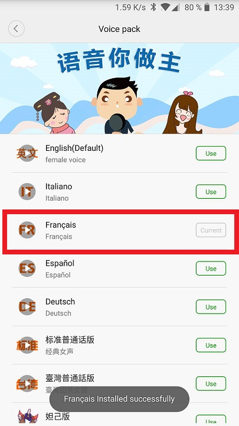

Rien de plus simple et maintenant votre **aspirateur** vous **préviendra** en **Français** pour vider le bac à poussières, nettoyage en cours, retour à la base de recharge…

## Associer l’aspirateur Robot Xiaomi Roborock S50 à Mi-Home

L’aspirateur **fonctionne** avec l’application **Mi-Home**. N’hésitez pas à lire [cet article](/articles/installation-et-configuration-de-la-gateway-xiaomi#Installation_de_lapplication_Mi-Home) si vous n’avez pas encore installé l’application.

- **Ouvrir** l’application **Mi-home**.
- **Cliquez** sur le « **+** » en haut à droite et sélectionner « **Add device**« .
- Cliquez sur « **Scan** » et attendre que l’aspirateur soit **détecté**.
  - Si vous ne voyez pas l’aspirateur cliquer sur « **Add manually** » et sélectionner « **Roborock Vacuum**« .
  - Si vous ne voyez toujours pas l’aspirateur, vous pouvez **réinitialiser le wifi en appuyant 3 secondes sur les boutons « Spot cleaning » et « Recharge »**.
  - 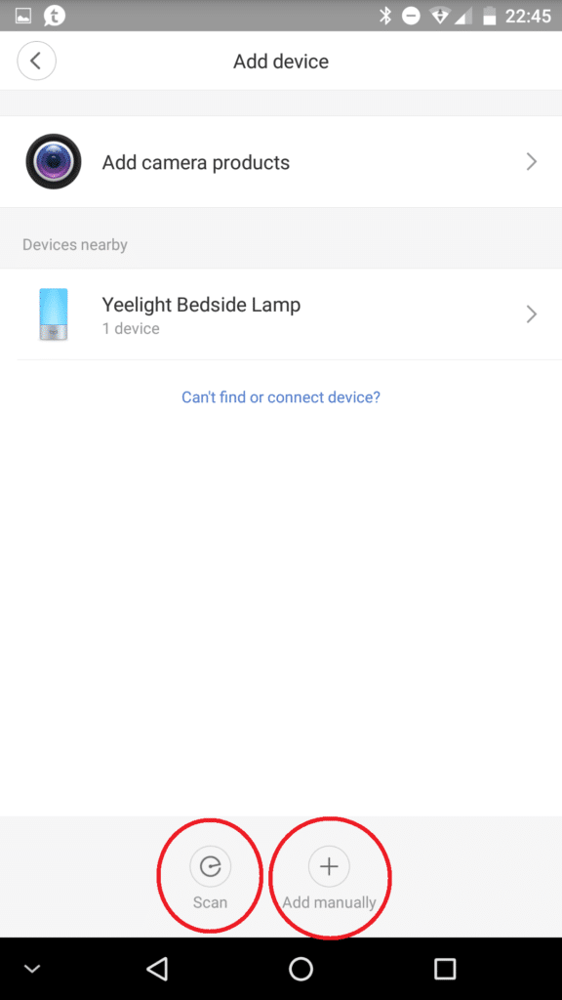
  - Une fois l’aspirateur **trouvé**, vous pouvez **l’ajouter** à la liste des appareils connectés.
  - Il faudra, bien sûr, **choisir** votre réseau **wifi** et saisir le **mot de passe** pour qu’il se **connecte** à votre réseau local.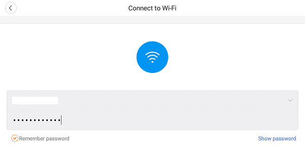

## Conclusion

**Xiaomi** nous propose encore un produit de **qualité** avec cette évolution du **Mi-Robot.**

L’augmentation de prix par rapport à la V1 **ne se justifie pas vraiment**, car le système de **nettoyage humide** que je me refuse d’appeler serpillière, n’est **pas très efficace** et ne remplace pas le passage d’une **vrai serpillière**, ou autre moyen de lavage du sol. Néanmoins, ayant un bébé de 1 an qui passe son temps à 4 pattes, un petit coup d’éponge en plus de l’aspiration ne fait pas de mal.

On reste dans un **tarif** vraiment très **attractif** par rapport aux marques dites « classiques » comme le Neato Botvac Connecté DC02 Wifi à 476,99 € ou l’iRobot Roomba 980 à 499 €.

La plupart des **accessoires** du Mi-Robot sont compatible avec le Roborock.
