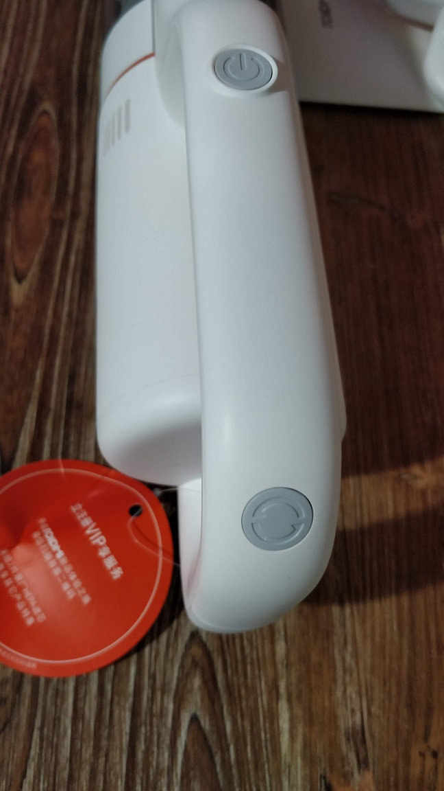
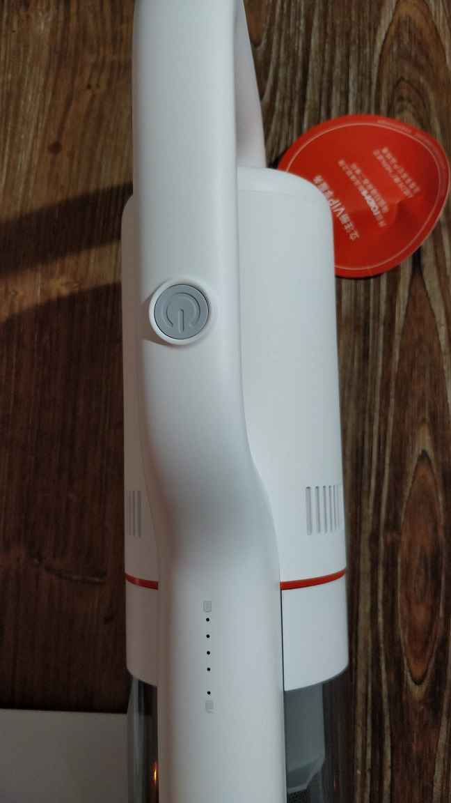
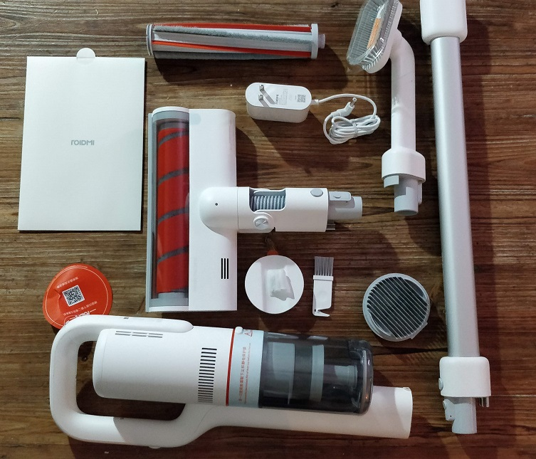
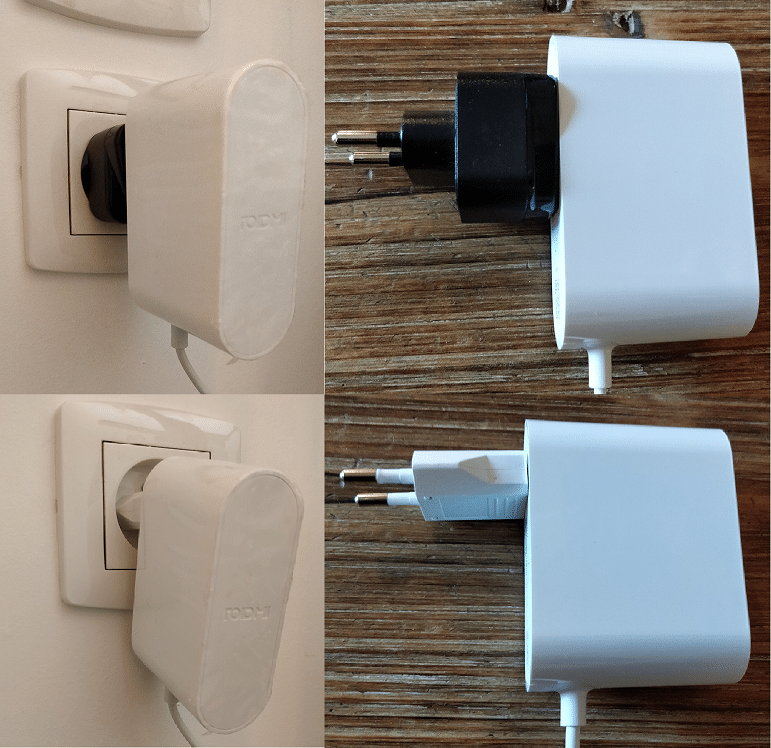
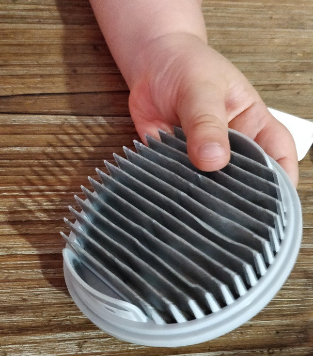
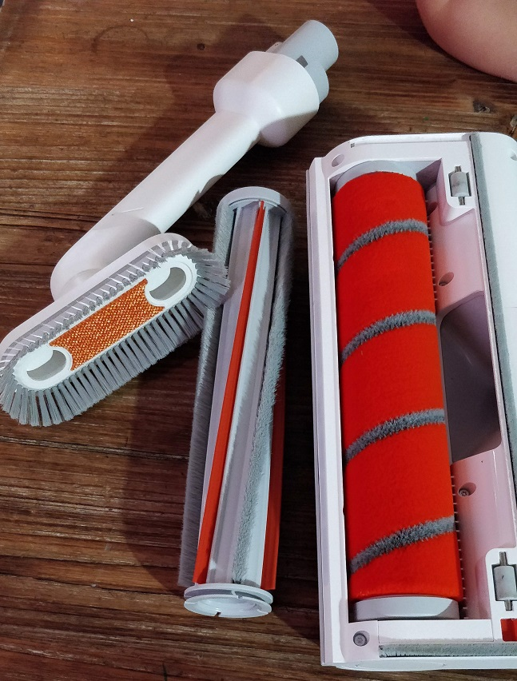
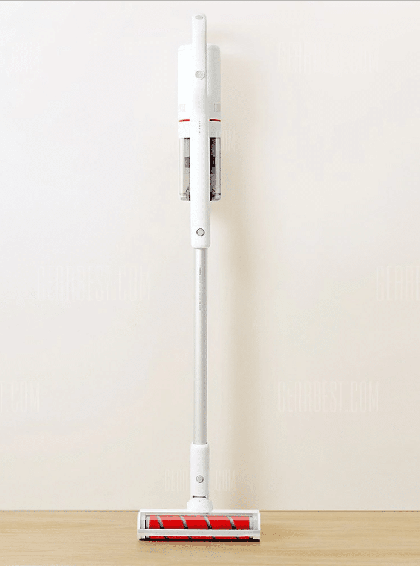

# Aspirateur Xiaomi Roidmi F8

> Aujourd’hui c’est le site **www.gearbest.com** qui m’a proposé de tester l’aspirateur Xiaomi Roidmi F8, un aspirateur à main sans fil du type [Dyson](https://amzn.to/2IxCOoJ).
>
> Contrairement aux aspirateurs robot [Xiaomi Mi-Robot](../articles/aspirateur-robot-xiaomi-mi-robot-le-test) ou [Roborock S50](../articles/aspirateur-robot-xiaomi-roborock-s50) que j’ai testé il y a quelque temps maintenant, le Xiaomi Roidmi F8 n’est pas autonome car c’est un aspirateur balai mais il est tout de même connecté.
>
> Comme beaucoup de produits proposés par Xiaomi c’est une autre marque qui a eu l’idée de cet aspirateur et qui la proposé sur une plateforme de financement participatif (found crowding), [Indigogo](https://www.indiegogo.com/projects/roidmi-f8-lightest-most-powerful-cordless-vacuum#/).
>
> Maintenant que Roidmi a rassemblé les fonds suffisants pour le développement, la commercialisation à grande échelle a commencé et l’aspirateur Xiaomi Roidmi F8 est disponible à l’achat sur des magasins de vente en ligne comme **[Amazon](https://amzn.to/2zLBgVg)** ou **Gearbest**.

Le Roidmi F8 est plutôt esthétique par rapport à d’autres aspirateurs de ce type qui ont souvent un design très industriel. On retrouve le plastique blanc de très bonne qualité, courant sur les appareils Xiaomi et du métal gris qui se marie très bien avec.

Sur le corps il y a 2 boutons gris accessibles en fonction de la position de la main sur le manche. Le premier permet l’allumage et le réglage de la puissance et le second, placé en haut du manche, permet seulement de régler la puissance lorsque l’on tient l’aspirateur sur cette partie du manche.

Sur le devant on retrouve des LED indiquant le niveau de la batterie sur 4 niveaux et l’état de remplissage du bac à poussières.

Le système d’aspiration par tourbillon à 100 000 tours/min et 18500 Pa assure une très bonne puissance d’aspiration pour ramasser toutes les saletés que l’on trouve dans une maison ou même pour aspirer les débris sur une terrasse ou dans une voiture.

Cette puissance à une contrepartie, le bruit. Malgré le fait que le faible bruit soit un argument de vente je trouve que c’est appareils sont assez bruyants.

Grace à sa tête articulée cet aspirateur est très maniable et très agréable à manipuler. On se faufile de partout, même sous des meubles un peu bas et grâce à la lumière de la brosse qui s’allume dans l’obscurité il est facile de détecter les moindres petites saletés.

Malgré tout on sent bien le poids des moteurs et de la batterie dans le corps de l’aspirateur ce qui n’est pas vraiment gênant lorsque l’on aspire les sols mais peut être déséquilibrant lorsque l’on souhaite utiliser l’aspirateur en hauteur pour nettoyer une VMC ou des toiles d’araignées.

La batterie permet, après 2h30 de recharge, environ 55 minutes d’utilisation à puissance normal c’est-à-dire sans la brosse rotative qui consomme beaucoup d’énergie à cause de son moteur indépendant et avec la puissance réglée sur 80W.

Dès que l’on utilise la brosse rotative et que l’on sélection la puissance maximum, 180W, l’autonomie est annoncée à une dizaine de minutes.

Dans la pratique on est plus dans les 7 à 8 minutes d’utilisation à puissance maximal avec la brosse rotative mais vu la puissance d’aspiration il n’est pas utile de laisser l’aspirateur au maximum pour le nettoyage courant. On peut ainsi gagner plusieurs minutes si on utilise l’aspirateur à puissance normale.

**L’aspirateur est livré avec plusieurs accessoires :**

- Une brosse rotative motorisée.
- Une brosse souple pour les sols fragile (parquet…).
- Une brosse rigide pour les sols dur (carrelage…).
- Une petite brosse à tête rotative pour la poussière.
- Un suceur.
- Un tube d’extension.
- Une brosse de nettoyage.
- Un filtre HEPA de rechange.
- Un support mural aimanté.
- Un chargeur au format chinois. _(Il existe une version avec prise Françaises)._
- Manuel en chinois. _(Il existe une version avec manuel en Anglais)._

Il vous faudra donc un adaptateur secteur pour les prises françaises.

- [Aspirateur sans fil Xiaomi](https://www.amazon.fr/gp/aw/d/B077S79F5D?&tag=guilbraimespa-21)
- [Brosse dédiée Roidmi](https://www.amazon.fr/gp/aw/d/B0753SR1RR?&tag=guilbraimespa-21)
- [Filtre HEPA Roidmi](https://www.amazon.fr/gp/aw/d/B077S1Q1BK?&tag=guilbraimespa-21)

**Le système de filtration avec 4 filtres dont un filtre Hepa lavable, absorbe les particules aussi petites que PM2,5 (\*).**

**Ils empêchent la prolifération des bactéries nocives et absorbe les allergènes pour créer un air propre en évitant la pollution secondaire et en purifiant l’air rejeté jusqu’à 99%.**

_(\*)Les PM2,5 incluent les particules très fines et ultrafines et pénètrent dans les alvéoles pulmonaires. [Source Wikipedia.](https://fr.wikipedia.org/wiki/Particules_en_suspension)_

Un support mural magnétique est livré afin de soutenir l’aspirateur à la verticale.Ce support peut être fixé au mur en utilisant des vis ou l’adhésif fournis.

Mais attention, ce support n’est pas destiné à garder Roidmi F8 au-dessus du sol mais seulement à le garder immobile lors des phases de chargement, la brosse doit être en contact avec le sol.

Sur le côté il y a une fente permettant de garder le cordon d’alimentation en place, on regrettera que ce support ne permette pas une recharge par induction.

La brosse rotative est motorisée, ce n’est pas l’aspiration ou le contact au sol qui la fait tourner mais un moteur indépendant ce qui multiplie la puissance de nettoyage même sans mouvement.

Lorsque l’on passe dans un endroit sombre la brosse détecte le manque de luminosité et une lumière s’allume, ça parait gadget à première vue mais ça s’est avéré plutôt pratique à l’utilisation.

Les saletés ressortent bien sous un meuble par exemple ou dans les recoins de la maison qui ne sont pas forcément bien éclairés.

La brosse rotative motorisée peut-être équipée de deux types de brosses. Une brosse souple en nylon tissé doux spécialement conçue pour le nettoyage des sols fragiles comme les parquets afin de ne pas risquer de rayer les surfaces nettoyées.

Le constructeur dit même que cette brosse enlève la poussière tout en polissant le plancher, j’ai quelques réserves sur ce dernier argument.

La seconde brosse est dite plus « agressive », elle est composée de poils de nylon souples combinés avec une bande de caoutchouc qui permet de gratter les tapis pour enlever les poils d’animaux et la saleté incrustée.

C’est le même type de brosse que l’on retrouve sur les aspirateurs robot Xiaomi.

Le suceur à bec avec sa forme réduite permet de passer dans les endroits étroits et augmente la puissance d’aspiration.

On peut y adapter une brosse multifonction qui n’est pas motorisée mais qui tourne à 360 °.

Elle permet de nettoyer les tissus, les rideaux, les canapés, les VMC mais aussi la poussière sur les surfaces fragiles.

Comme pour la plupart des appareils Xiaomi il est possible de connecter l’aspirateur à son smartphone via le Bluetooth.

Le plus simple est de se connecter avec un compte Xiaomi sur l’application Mi home en sélectionnant le serveur Mainland China.

L’application propose différentes informations et statistiques comme la durée d’utilisation, le pourcentage de batterie restant en fonction des modes de nettoyage, l’usure des filtres, l’état du bac à poussière, la puissance par défaut (80W, 130W, 180W) le temps et la surface de nettoyage cumulés, les calories dépensées, la distance parcourue…

> Après 2 mois d’utilisation nous avons totalement adopté cet aspirateur. Le coté sans fil est idéal pour nettoyer le dessus des plinthes, les aérations de la VMC, les canapés ainsi que les extérieurs mais c’est surtout pour le nettoyage quotidien qu’il est devenu indispensable, il est très rapide de passer un coup sur les sols dès que cela est nécessaire comme après les activités ou les repas des enfants. Il est devenu le complément parfait à l’aspirateur robot [Xiaomi Roborock S50](../articles/aspirateur-robot-xiaomi-roborock-s50) qui lui nettoie la maison lorsque l’on n’est pas là.

Pour moins de 300 € le Roidmi F8 est fourni avec tous les accessoires nécessaires à une utilisation complète et vous trouverez facilement des pièces de rechange comme la brosse souple ou à hélices, le filtre HEPA ou même un sac de rangement pour les accessoires.

A mes yeux les principaux défauts sont l’autonomie et le niveau sonore qui ne permettent, suivant la taille de votre logement, pas de l’utiliser suffisamment longtemps lors des grosses sessions de nettoyage. Il vous faudra garder un aspirateur classique sous la main ou faire le ménage en plusieurs fois.

Apparemment ces défauts valent pour tous les aspirateurs sur batterie comme on peut le voir sur le site de Dyson qui annonce 5 à 6 minutes d’autonomie pour son modèle phare, le Dyson v10, qui est sur le papier très proche du Xiaomi Roidmi F8 mais à un tarif bien moins abordable.

Voici deux tableaux comparatifs qui vous permettront de vous faire une idée claire du positionnement du Xiaomi Roidmi F8 par rapport à la concurrence.

## 378 €

## Gearbest

- Entrepôt Hong-Kong
- 10-20 jours GRATUITE
- Prise Française
- Manuel en Anglais

Commander

## 287 €

## Gearbest

- Entrepôt Hong-Kong
- 10-20 jours GRATUITE
- Prise Chinoise
- Manuel en Chinois

Commander

## 339 €

## Amazon

- Amazon's Prime
- Expédié par Amazon
- Livraison GRATUITE
- [Devenez client Prime](https://www.amazon.fr/prime?tag=guilbraimespa-21)

[Commander](https://amzn.to/2zLBgVg)
