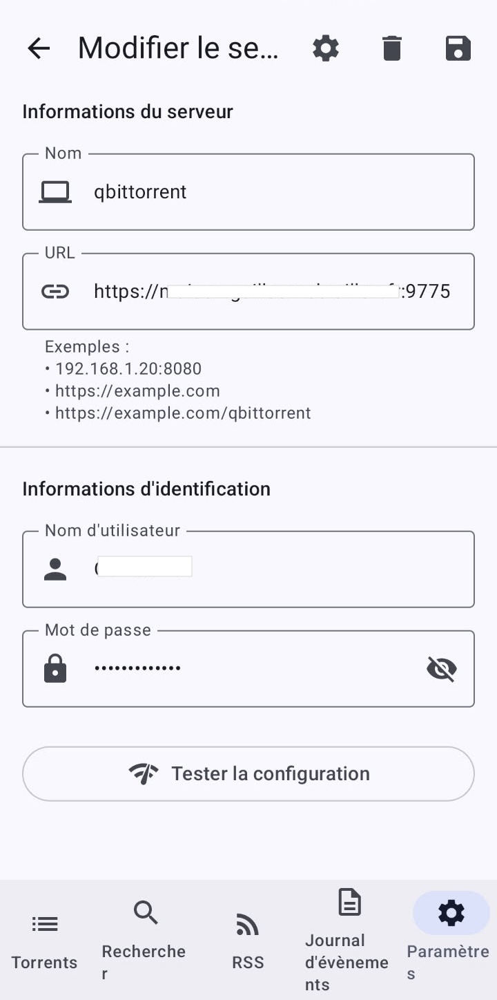

Aujourd'hui, l'auto-hébergement (_self-hosting_) est devenu incontournable pour reprendre le contrôle de ses données et de ses services multimédias. Cependant, assembler différentes briques logicielles au sein de son infrastructure personnelle réserve parfois quelques surprises. Entre les nouvelles implémentations réseau des applications et les contraintes de sécurité d'un système d'exploitation comme Synology DSM, un déploiement "standard" peut vite se transformer en un parcours du combattant : conteneurs qui crashent en boucle au démarrage, débits mystérieusement bridés à quelques kilo-octets par seconde, ou reverse proxy qui refuse de valider vos règles de routage.

Dans ce guide complet, nous allons installer et interconnecter **qBittorrent** et **Prowlarr** sur un NAS Synology (sous **DSM 7.1.1**) en exploitant la puissance de Docker. Mais nous ne nous contenterons pas de copier-coller des lignes de commande basiques : nous allons analyser, pas à pas, comment contourner chaque piège technique (gestion des E/S disques, permissions, conflits de sockets réseau) afin d'obtenir un écosystème stable, sécurisé et configuré au maximum des capacités de votre bande passante.

---

## 0. Prérequis avant de commencer

Avant de vous lancer, assurez-vous de cocher chacun des points suivants :

- **Package Container Manager** (anciennement _Docker_) installé depuis le Centre de paquets DSM. Sur les modèles Synology équipés d'un processeur ARM, vérifiez au préalable la compatibilité de votre NAS : Container Manager exige un processeur x86 (Intel/AMD) ou certains modèles ARM récents, mais reste indisponible sur une grande partie du bas de gamme.
- **Espace disque suffisant** : comptez au minimum quelques Gio libres pour les images Docker elles-mêmes, en plus de l'espace dédié à vos téléchargements.
- **Une adresse IP fixe pour le NAS** sur votre réseau local (à assigner depuis votre box/routeur ou directement dans DSM), afin que vos règles de redirection de ports ne se retrouvent pas orphelines après un simple redémarrage du NAS.
- **Un accès administrateur SSH** activé (Panneau de configuration > Terminal & SNMP) si vous souhaitez récupérer votre `uid`/`gid` en ligne de commande.
- **Un nom de domaine** (personnel ou en sous-domaine gratuit) si vous prévoyez d'exposer vos services en HTTPS via le Reverse Proxy. Si votre abonnement internet ne fournit pas d'IP publique fixe, pensez à activer un service de **DDNS** (DNS dynamique) : Synology propose son propre service gratuit dans Panneau de configuration > QuickConnect > DDNS, qui maintient automatiquement à jour l'enregistrement DNS pointant vers votre IP, même si celle-ci change.
- **Un certificat SSL valide** (Let's Encrypt, généré gratuitement depuis Panneau de configuration > Sécurité > Certificat) est requis en amont pour que le Reverse Proxy puisse chiffrer le trafic HTTPS entrant.
- **Un accès à l'interface d'administration de votre box/routeur**, indispensable pour la redirection de ports abordée en section 5.

---

## 1. Structurer son stockage : Dossiers et Permissions

Avant même de télécharger notre première image Docker, il est impératif de jeter des bases saines sur notre système de fichiers. Sous Linux et au sein de l'environnement virtualisé de Docker, la gestion des accès repose sur des identifiants numériques d'utilisateurs et de groupes, matérialisés par les variables `PUID` (User ID) et `PGID` (Group ID).

Si vos conteneurs s'exécutent avec des privilèges mal configurés ou trop restrictifs, ils se retrouveront dans l'incapacité de lire vos fichiers de configuration ou d'écrire vos données téléchargées sur vos volumes.

### La topologie recommandée dans File Station

Ouvrez File Station et créez l'arborescence avant-gardiste suivante afin de faciliter la persistance et les futurs mécanismes de _hardlinking_ (déplacement instantané sans duplication) :

```text
/volume1/
  ├── docker/
  │    ├── qbittorrent/
  │    │    └── config/
  │    └── prowlarr/
  │         └── config/
  └── downloads/
       ├── incomplete/
       └── films/

```

> **Pourquoi un dossier `incomplete/` dédié ?** En pointant les téléchargements en cours vers un sous-dossier distinct de la destination finale (`films/`), vous évitez que vos autres applications (lecteurs multimédias, Sonarr/Radarr le cas échéant) ne détectent et n'indexent des fichiers partiels ou corrompus pendant qu'ils sont encore en cours d'écriture.

### Récupérer ses identifiants DSM en SSH

Pour que les processus Docker agissent sur votre stockage avec les mêmes droits que votre compte utilisateur DSM habituel, connectez-vous en SSH à votre NAS et exécutez la commande suivante :

```bash
id

```

Notez précieusement la valeur de l' `uid` (généralement `1026` pour le premier compte administrateur créé sur DSM) et du `gid` (généralement `100` pour le groupe _users_). Nous injecterons ces valeurs directement dans nos conteneurs.

> **Astuce sauvegarde :** une fois vos conteneurs en place, pensez à inclure le dossier `/docker/` dans une tâche **Hyper Backup** planifiée. C'est ce dossier qui contient l'intégralité de vos configurations, bases de données d'indexeurs et listes de trackers : le reconstituer manuellement après une panne disque serait fastidieux.

---

## 2. Déploiement des conteneurs via Docker

Sur votre interface DSM 7.1.1, ouvrez l'application **Docker** (renommée _Container Manager_ sur les versions plus récentes du système). Nous allons nous appuyer sur les images officielles maintenues par la communauté _Linuxserver_, réputées pour leur stabilité et leur gestion native des variables d'identifiants Linux.

### Conteneur A : qBittorrent

Recherchez et téléchargez l'image `linuxserver/qbittorrent:latest`.


Lors de la phase de création guidée du conteneur, appliquez minutieusement les configurations suivantes :

1. **Paramètres des ports (Routage réseau) :**

- **Le trafic d'écoute BitTorrent :** Mappez le port local **`6883`** vers le port du conteneur **`6883`** en protocole **TCP**. Créez impérativement une seconde ligne identique (port local `6883` vers port conteneur `6883`) mais basculée en **UDP**. C'est ce canal qui permettra l'échange de paquets de données avec vos pairs.
- **L'interface Web (WebUI) :** Mappez le port local **`8085`** vers le port interne **`8080`** (TCP). _Note : Nous choisissons délibérément un port local alternatif pour Docker afin d'éviter tout conflit immédiat avec notre futur reverse proxy._
  

2. **Mappage des volumes :**

- `/docker/qbittorrent` > `/config`
- `/downloads` > `/downloads`
  

3. **Variables d'environnement :**

- `PUID` : Votre UID précédemment récupéré (ex: `1026`)
- `PGID` : Votre GID (ex: `100`)
  

### Récupérer le mot de passe temporaire généré au premier démarrage

Depuis la version 4.6.x de qBittorrent, l'image Linuxserver ne fournit plus d'identifiants par défaut fixes (`admin` / `adminadmin`) pour des raisons de sécurité. Au premier lancement, un mot de passe temporaire est généré aléatoirement et n'est visible que dans les journaux du conteneur.

Pour le récupérer :

1. Dans DSM, ouvrez **Container Manager** > **Conteneur** > sélectionnez `qbittorrent`.
2. Cliquez sur l'onglet **Journal** (ou _Log_).
3. Repérez la ligne du type `The WebUI administrator password was not set... A temporary password is provided...`.

Connectez-vous une première fois avec l'utilisateur `admin` et ce mot de passe temporaire, puis rendez-vous **immédiatement** dans _Outils > Options > WebUI_ pour définir un nom d'utilisateur et un mot de passe personnalisés et robustes. Ce point est d'autant plus critique que ce conteneur sera, in fine, exposé sur internet via le Reverse Proxy.

---

### Conteneur B : Prowlarr

Prowlarr agit comme un indexeur centralisé. Il va se charger de regrouper vos différents trackers et de synchroniser automatiquement les protocoles de recherche avec qBittorrent. Téléchargez l'image `linuxserver/prowlarr:latest`.


1. **Paramètres des ports :** Mappez le port local **`9696`** vers le port du conteneur **`9696`** (TCP).
   
2. **Mappage des volumes :** `/docker/prowlarr` > `/config`
   
3. **Variables d'environnement :** Renseignez rigoureusement les mêmes valeurs de `PUID` et `PGID` utilisées pour le conteneur précédent.
   

---

## 3. Interconnexion : déclarer qBittorrent comme client de téléchargement dans Prowlarr

Une erreur fréquente consiste à croire que le simple fait d'installer les deux conteneurs sur le même NAS suffit à les faire communiquer. Docker isole chaque conteneur dans son propre réseau interne : sans configuration explicite, Prowlarr n'a aucune connaissance de l'existence de qBittorrent.

Pour que Prowlarr puisse transmettre directement un résultat de recherche (mode "recherche interactive") à qBittorrent :

1. Connectez-vous à l'interface web de Prowlarr (`http://[IP_DE_VOTRE_NAS]:9696`).
2. Rendez-vous dans **Settings > Download Clients**, puis cliquez sur le bouton **+** et sélectionnez **qBittorrent**.
3. Renseignez les champs suivants :
   - **Host** : l'adresse IP locale de votre NAS (par exemple `192.168.1.X`) — n'utilisez pas `localhost`, chaque conteneur ayant sa propre boucle réseau interne.
   - **Port** : `8085` (le port local mappé sur votre hôte Docker, cf. section 2).
   - **Username / Password** : les identifiants personnalisés que vous avez définis pour qBittorrent.
4. Cliquez sur **Test** : un message de confirmation verte doit apparaître avant de sauvegarder.

### Ajouter vos indexeurs (trackers)

Toujours dans Prowlarr, rendez-vous dans **Indexers > Add Indexer** pour ajouter les trackers publics ou privés auxquels vous êtes abonné. Chaque indexeur nécessite généralement une URL, et pour les trackers privés, une clé API ou des identifiants de connexion propres au tracker.

> **Note :** si vous envisagez par la suite d'automatiser entièrement vos téléchargements (séries, films) plutôt que de lancer des recherches manuelles, Prowlarr peut également se synchroniser avec des applications tierces comme **Sonarr** ou **Radarr** via la section **Settings > Apps**, qui se chargeront elles-mêmes de piloter qBittorrent. Cette architecture plus poussée dépasse le cadre de ce guide mais s'appuie sur exactement les mêmes fondations Docker.

---

## 4. Optimisation avancée & Domptage de libtorrent v2

C'est ici que se situe le véritable apport technique de ce guide. Les versions modernes de qBittorrent embarquent la version 2 de la bibliothèque réseau `libtorrent`. Bien que cette version apporte d'excellentes optimisations, ses réglages d'usine entrent en conflit direct avec la virtualisation Docker sur l'architecture noyau des NAS Synology.

Sans modification manuelle, vous ferez face à deux problématiques majeures :

- Vos téléchargements resteront bloqués ou bridés à une vitesse fixe et dérisoire de **10 Kio/s** (un reliquat de l'activation invisible du mode de vitesse alternative).
- Le conteneur plantera de manière intermittente ou figera l'interface en raison d'une mauvaise allocation de la mémoire virtuelle lors des écritures.

### Le Correctif : Alignement chirurgical du fichier `qBittorrent.conf`

Démarrez votre conteneur qBittorrent une première fois pour qu'il structure ses dossiers internes, puis **arrêtez-le immédiatement** depuis l'application Docker de DSM.

Accédez à File Station, naviguez vers le répertoire `/docker/qbittorrent/config/qBittorrent/` et ouvrez le fichier nommé `qBittorrent.conf` avec l'éditeur de texte de DSM. Remplacez ou ajustez les variables stratégiques suivantes pour qu'elles reflètent exactement ce schéma optimisé :
Voici la modification à copier-coller dans ton fichier Markdown, avec le bloc de code nettoyé pour ne garder que ta configuration actuelle, et la mise en facultatif des autres variables :

```ini
[BitTorrent]
Session\UseAlternativeGlobalSpeedLimit=false

```

### Explications et mécaniques techniques :

- **`Session\UseAlternativeGlobalSpeedLimit=false`** : Force la désactivation globale du mode de vitesse alternative (le mode "tortue"). Sur certaines configurations Docker, ce bridage s'enclenche de manière sous-jacente au premier démarrage et sature artificiellement la vitesse de réception.

### [Facultatif] Optimisations avancées pour libtorrent v2

_Si vous rencontrez des bridages de vitesse inexpliqués ou des crashs du conteneur lors de gros téléchargements, vous pouvez ajouter manuellement ces lignes spécifiques dans votre fichier `qBittorrent.conf` :_

```ini
[BitTorrent]
Session\AsyncIOThreadsCount=8

[Preferences]
Advanced\DiskIOType=2
Advanced\DiskIOReadMode=1
Advanced\DiskIOWriteMode=1

```

- **`Advanced\DiskIOType=2`** : Par défaut, `libtorrent v2` s'appuie sur un mécanisme d'E/S nommé _fichiers mappés en mémoire_. Sous l'environnement Docker de Synology, ce protocole peut saturer l'allocation de la RAM et provoquer un crash instantané (_Segmentation Fault_). La valeur `2` force le passage au mode **Compatible POSIX**, garantissant une stabilité absolue.
- **`Session\AsyncIOThreadsCount=8`** : Demande à l'application d'instancier 8 sous-threads de calcul asynchrones en parallèle pour gérer les flux d'écriture sur le disque. Sur un NAS doté de disques durs mécaniques (RAID/SHR), cela permet de lisser l'écriture, d'éviter l'état d'attente du processeur (`I/O Wait`) et d'absorber pleinement le débit de votre connexion.
- **`Advanced\DiskIOReadMode=1 & Advanced\DiskIOWriteMode=1`** : Forcent qBittorrent à utiliser **le mode de cache du système d'exploitation** (OS Cache) pour les lectures et les écritures. Au lieu de solliciter vos disques durs mécaniques en continu pour chaque petit morceau de fichier reçu (chunk), les données sont temporairement accumulées dans la mémoire RAM non utilisée du NAS, puis écrites par blocs. Cela réduit drastiquement l'usure de vos disques et améliore la réactivité générale du système.

_Conseil bonus : Une fois l'interface web accessible, rendez-vous dans les options avancées de l'UI et fixez la ligne "Limite d'utilisation de la mémoire physique (RAM)" sur une valeur fixe (entre **256 Mio** et **512 Mio** selon la RAM globale de votre NAS) afin d'offrir un tampon d'écriture confortable au système._

Après ces modifications, redémarrez le conteneur qBittorrent depuis Container Manager pour que le fichier `.conf` soit relu.

---

## 5. Ouvrir les ports sur votre box/routeur (NAT)

Une confusion classique consiste à croire que mapper un port dans Docker suffit à le rendre accessible depuis internet. Le mappage Docker ne fait que router le trafic **entre le conteneur et l'interface réseau du NAS** : il reste ensuite indispensable d'indiquer à votre box internet (Freebox, Livebox, Bbox, routeur ISP, etc.) qu'elle doit rediriger le trafic entrant vers l'IP locale de votre NAS.

Deux redirections distinctes sont nécessaires :

1. **Port BitTorrent** : redirigez le port externe `6883` en **TCP et UDP** vers l'IP locale de votre NAS, port `6883`. C'est ce port qui conditionne votre capacité à recevoir des connexions entrantes de vos pairs — sans lui, qBittorrent fonctionnera toujours, mais en mode "passif", ce qui réduit sensiblement la disponibilité de certains torrents (statut _"port fermé"_ visible en bas à droite de l'interface).
2. **Port du Reverse Proxy** : redirigez le port externe `9775` en **TCP** vers l'IP locale de votre NAS, port `9775` (voir section suivante).

> **Vérification pratique :** une fois la redirection en place, un site comme _canyouseeme.org_ (ou l'indicateur de connexion en bas à droite de qBittorrent) vous permet de confirmer que le port `6883` est bien ouvert et joignable depuis l'extérieur.

Sur les box françaises grand public, ces réglages se trouvent généralement dans une section nommée "Redirection de ports", "NAT/PAT" ou "Ports virtuels" de l'interface d'administration. Si votre NAS change d'adresse IP locale au fil des redémarrages (attribution DHCP dynamique), pensez à lui réserver une IP fixe (bail DHCP statique) directement depuis votre box, afin que vos règles de redirection ne deviennent pas obsolètes.

---

## 6. Architecture Reverse Proxy : Éliminer les conflits de ports en HTTPS

Pour accéder confortablement et de manière sécurisée à votre tableau de bord qBittorrent depuis l'extérieur via une adresse du type `https://[VOTRE_URL_OU_IP_PUBLIQUE]:9775/`, nous allons mettre en place le **Proxy Inversé** (Reverse Proxy) intégré à DSM. Sa mission est claire : intercepter les connexions entrantes sécurisées en HTTPS sur le port de votre choix, valider le chiffrement grâce à votre certificat SSL (par exemple Let's Encrypt), puis relayer le trafic en HTTP clair vers le port interne de notre conteneur Docker.

### Le piège du socket occupé (Port conflictuel)

Une erreur d'implémentation très fréquente consiste à configurer le "Port local" de son conteneur Docker sur le port `9775`, puis à tenter de créer une règle de Reverse Proxy écoutant elle aussi sur le port source `9775`. Le système d'exploitation de Synology lèvera immédiatement une alerte rouge indiquant que _ce numéro de port est déjà utilisé par une autre application_. Deux services distincts ne peuvent pas écouter simultanément sur le même socket physique de la machine.

**La parade architecturale :** Nous laissons Docker écouter discrètement sur le port local `8085`, libérant ainsi totalement le port public `9775` pour le gestionnaire de Reverse Proxy de Synology.

### Création de la règle de routage dans DSM

Allez dans le **Panneau de configuration** de DSM > **Portail de connexion** > Onglet **Avancé** > **Proxy inversé**. Créez la règle suivante :

- **Source (La requête arrivant du web) :**
- Protocole : `HTTPS`
- Nom d'hôte : `[VOTRE_URL_OU_IP_PUBLIQUE]`
- Port : `9775`

- **Destination (Le conteneur cible sur le NAS) :**
- Protocole : `HTTP`
- Nom d'hôte : `localhost`
- Port : `8085` (Le port local affecté à Docker)
  

### Déverrouiller la sécurité de l'interface WebUI

Parce que les flux réseaux vont désormais transiter par un nom de domaine tiers avant d'atteindre le conteneur, le mécanisme de sécurité intrinsèque de qBittorrent va suspecter une attaque et rejeter la connexion par défaut.

Pour lui indiquer qu'il opère légitimement derrière une passerelle de reverse proxy, vérifiez que les lignes suivantes sont bien présentes dans la section `[Preferences]` de votre fichier `qBittorrent.conf` :

```ini
WebUI\Address=*
WebUI\CSRFProtection=false
WebUI\HostHeaderValidation=false
WebUI\SecureCookie=false
WebUI\ToggleReverseProxy=true
WebUI\ServerDomains=*

```

- **`HostHeaderValidation=false`** et **`CSRFProtection=false`** : Désactivent les vérifications strictes des en-têtes HTTP de l'hôte, évitant les blocages d'authentification ou les écrans blancs lors du changement d'origine (HTTP local vers HTTPS externe).
- **`ToggleReverseProxy=true`** : Informe explicitement l'application qu'elle doit faire confiance aux en-têtes de redirection transmis par le routeur Synology.

---

## 7. Sécuriser durablement l'accès exposé

Exposer une interface d'administration sur internet, même chiffrée en HTTPS, mérite quelques garde-fous supplémentaires :

- **Bannissement automatique des tentatives de connexion échouées** : activez la **Protection contre les attaques par force brute** dans Panneau de configuration > Sécurité > Protection du compte, et envisagez également le blocage automatique d'IP (Panneau de configuration > Sécurité > Protection). Ces mécanismes DSM protègent le point d'entrée du Reverse Proxy lui-même.
- **Mots de passe robustes et uniques** pour qBittorrent et Prowlarr, distincts de votre mot de passe DSM.
- **Limiter Prowlarr à un accès local uniquement** : contrairement à qBittorrent, Prowlarr n'a généralement pas besoin d'être exposé sur internet pour fonctionner au quotidien (les recherches se font depuis votre réseau local ou via vos applications internes). Évitez donc de créer une seconde règle de Reverse Proxy pour son port `9696`, sauf besoin explicite.
- **Authentification à deux facteurs** sur votre compte DSM, en complément de la protection par force brute, pour vous prémunir en cas de compromission plus globale du NAS.
- **Considération légale et de confidentialité** : gardez à l'esprit qu'exposer directement votre trafic BitTorrent expose également votre adresse IP publique aux autres pairs du réseau, ce qui peut avoir des implications selon la nature des contenus échangés et la réglementation en vigueur dans votre pays (en France, la loi encadre notamment le partage d'œuvres protégées). Si vous souhaitez masquer votre trafic BitTorrent, une alternative répandue consiste à faire transiter le conteneur qBittorrent par un tunnel VPN dédié (par exemple via un conteneur `gluetun` positionné en frontal), une architecture plus avancée qui pourra faire l'objet d'un prochain article.

---

## 8. Mobilité : Synchroniser ses applications distantes (Ex: qBitController)

Maintenant que votre reverse proxy est opérationnel et chiffre l'ensemble du trafic, vous pouvez interconnecter vos applications mobiles de contrôle à distance (telles que [qBitController](https://play.google.com/store/apps/details?id=dev.bartuzen.qbitcontroller&hl=fr) sur Android ou Remote pour qBittorrent sur iOS) sans affaiblir la sécurité de votre réseau local.

Dans le gestionnaire de serveurs de votre application mobile, ajustez les paramètres de connexion :

- **Protocole réseau** : Basculez impérativement sur **`https://`**
- **Hôte (Host / URL)** : Saisissez votre domaine `[VOTRE_URL_OU_IP_PUBLIQUE]`
- **Port** : `9775`
- **Authentification** : Renseignez vos identifiants applicatifs (votre nom d'utilisateur personnalisé et votre mot de passe associé).
  

  Le client mobile communiquera de manière fluide et sécurisée via l'API, vous permettant d'administrer, d'ajouter ou de surveiller vos files d'attente à distance.

---

## 9. Maintenance dans la durée

Un déploiement Docker n'est pas une opération figée : quelques réflexes simples vous éviteront des mauvaises surprises sur le long terme.

- **Mise à jour des images** : les images `linuxserver/*` sont régulièrement mises à jour pour corriger des failles de sécurité. Pensez à vérifier périodiquement les nouvelles versions disponibles depuis Container Manager > Image, ou automatisez ce contrôle avec un conteneur type **Watchtower**.
- **Surveillance de l'espace disque** : un volume de téléchargement saturé peut provoquer l'arrêt brutal de qBittorrent en pleine écriture. Un tableau de bord DSM (Moniteur de ressources) ou une alerte par e-mail sur le seuil d'occupation du volume `/downloads` vous évitera la panne.
- **Sauvegarde régulière** des dossiers `/docker/qbittorrent/config` et `/docker/prowlarr/config`, qui contiennent l'ensemble de vos réglages, catégories, indexeurs et historiques.

---

## Conclusion

En adaptant finement la couche d'E/S disque aux spécificités de l'environnement virtualisé du Synology et en structurant rigoureusement la redirection des flux du Reverse Proxy, nous avons transformé une installation Docker générique instable en un serveur d'auto-hébergement performant de qualité industrielle. Vos applications communiquent désormais de manière transparente à travers un canal chiffré, et vos téléchargements peuvent exploiter l'intégralité du débit physique de vos disques durs et de votre architecture réseau.
