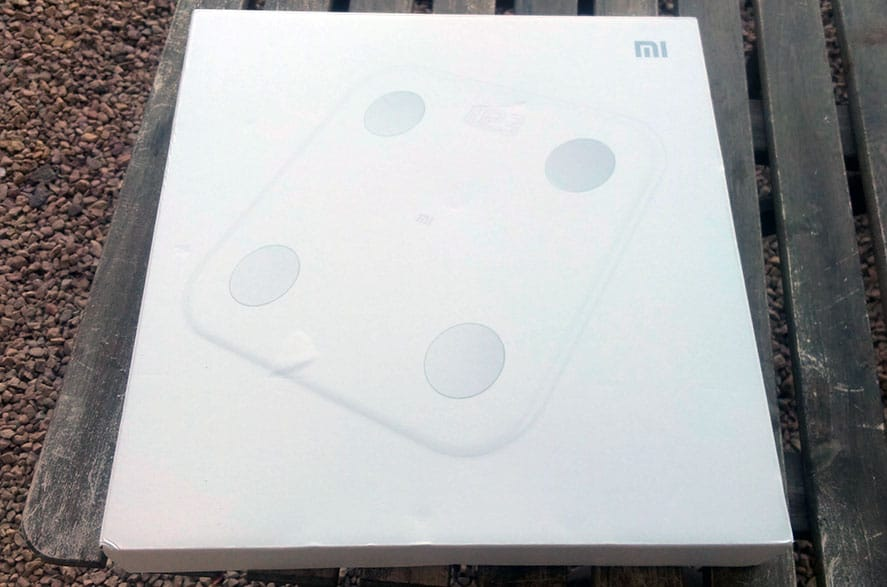
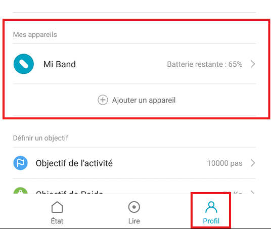
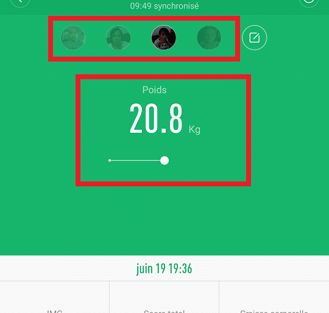
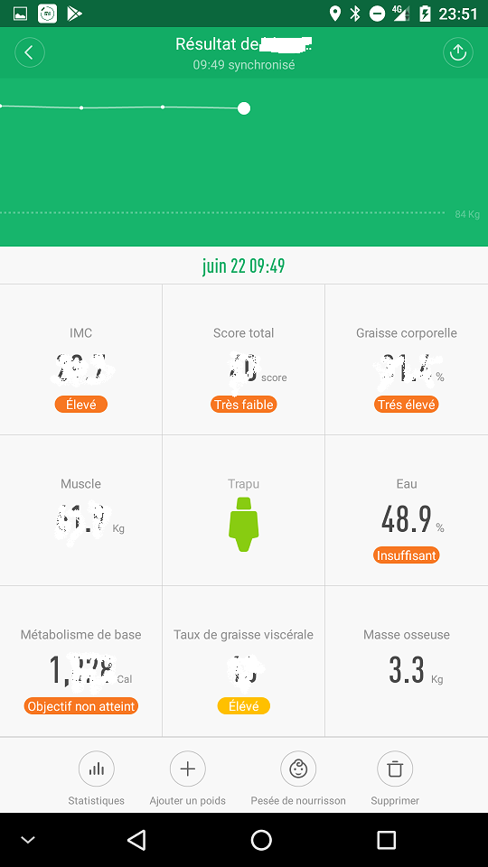
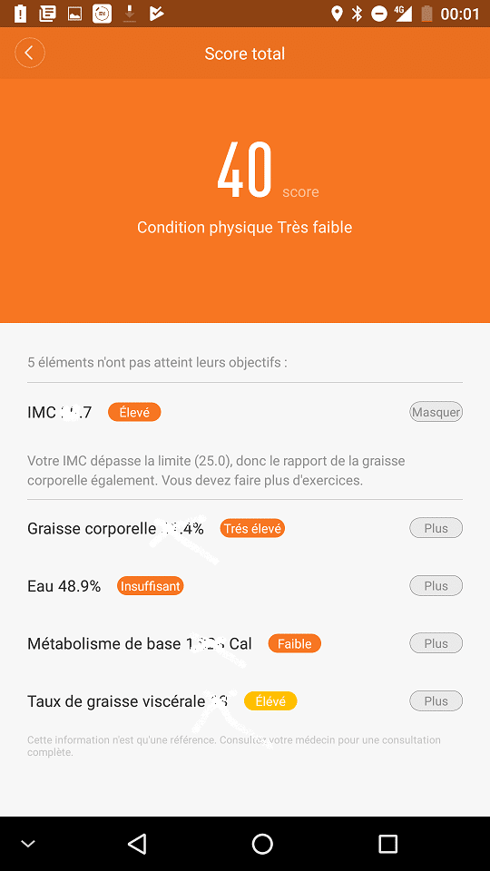
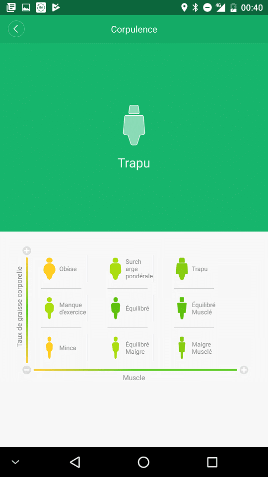

# Balance Connectée XIAOMI Weight Body Fat le test

> La nouvelle Balance Connectée XIAOMI Weight Body Fat est un des **best-sellers** chez **GearBest** surement en raison de son **design** minimaliste, mais surtout grâce aux **nombreuses** **fonctions** disponibles.
>
> Elle mesure bien évidement les **kilos et l’IMC** mais aussi la **masse osseuse**, le **pourcentage d’eau du corps**, la **masse musculaire**, le **métabolisme basal**, le **taux de graisse corporelle**, le niveau de **graisse viscérale**, la **morphologie** et vous avez même une notation regroupant toutes ces mesures.
>
> Pour finir vous pourrez créer un **profil** pour **chaque** **membre** de la **famille** qui seront **reconnus** **automatiquement** lors de la pesée, même si c’est un **nourrisson,** grâce à la fonction « **pèse nourrisson**« . Vous pouvez créer jusqu’à **16 profils**.
>
> Le modèle **Weight Body Fat** remplace l’ancienne version **Smart Weight Scale** qui elle, ne proposait principalement que les mesures de poids et l’IMC.

## Présentation

La balance connectée XIAOMI peut donc mesurer plusieurs données telles que **l’IMC**, le **poids**, la **masse osseuse**, le pourcentage d’**eau du corps**, la **masse musculaire**, le **taux de graisse**, le niveau de **graisse viscérale**, la **morphologie**  etc…

Le poids est affiché sur le **dessus** de la **balance** et toutes les **données** sont **enregistrées** dans l’application **Mi-Fit** qui fournit un historique et des explications, ainsi que des conseils pour se rapprocher des valeurs recommandées.

La balance est **compacte**, elle ne fait que 14,75 mm d’épaisseur pour 30 cm de cotés. Le revêtement est en **plastique** **ABS** de **très** **bonne** **qualité,** avec un **affichage** **invisible** lorsque la balance est en veille. Pour personnaliser votre balance, il est possible d’ajouter des houses de protection colorées, en silicone.Et **Jeedom** alors ? Grâce au plugin gratuit BLEA de [Sarakha63](http://sarakha63-domotique.fr/), les balances connectées XIAOMI Weight Body Fat, Miscale et Miscale2 sont compatibles avec Jeedom.

~Sachez que si la **première version** de la balance Xiaomi était **intégrée** à **Jeedom** grâce au plugin gratuit [BLEA de Sarakha63,](https://market.jeedom.fr/index.php?v=d&p=market&type=plugin&plugin_id=blea) la **nouvelle** **balance** connectée XIAOMI n’est **pas** encore **compatible** et rien n’est sûr quant-à une future **compatibilité** avec Jeedom, mais **Sarakha63** est sur le coup et je ne manquerai pas de **vous** **prévenir** en cas d’évolution.~

XIAOMI Smart Scale WeightV1 Compatible Jeedom

La V1 compatible Jeedom est disponible sur [Amazon en Prime à 38 €](http://amzn.to/2rOkBt3) et sur Gearbest à 37 €.

## Déballage

J’ai reçu la balance dans une **boite en carton** blanche, avec la **photo de la balance** et le **logo MI**, le tout enveloppé dans du **papier bulle** et dans une **enveloppe** **matelassée**.
Le **transport** s’est très bien passé, car il n’y avait **aucune** **marque** de **choc** sur la boite.

La **boite** avait été **ouverte,** mais c’est parce que les **piles** ont été **retirées** pour le **transport**, conformément à la nouvelle **réglementation** du transport aérien.

## Association avec Mi-Fit

Si comme moi vous possédez un bracelet Mi-Band ou Mi-Band 2, vous connaissez déjà l’application **Mi-Fit de Xiaomi,** sinon il faudra la **télécharger** sur les stores correspondant à votre **smartphone**. [Google Store](https://play.google.com/store/apps/details?id=com.xiaomi.hm.health&hl=fr), [Apple Store](https://itunes.apple.com/fr/app/mi-fit/id938688461?mt=8) ou numérisez le **QR code** sur le **mode d’emploi**, en chinois. Je vous rassure **l’application** est bien en **français**.

Les **informations** étant **stockées** sur un **cloud** il faudra créer un **compte** **Mi**.

Si c’est la **première fois** que vous vous connectez au **Mi Fit**, il vous sera demandé de **fournir** certaines **informations** : le genre, date de naissance, taille, poids. Ces mêmes **informations** vous seront demandées lorsque vous **créerez** un **profil**.

Vous allez maintenant pouvoir **associer** votre **balance** à **Mi-Fit**, **activez** le **bluetooth** si ce n’est pas déjà fait.

1.  Aller dans le menu « **Profil** » puis dans la section « **Mes appareils** » cliquer sur « **\+ Ajouter un appareil**« .
2.  Choisir « **Balance de graisse corporelle / Balance**« . Oui « **Body Fat** » ça veut dire « **Graisse Corporelle »** c’est pas très sexy comme nom, les anglicismes ça a du bon parfois.
3.  Pour **Associer** la balance il suffit de **monter** **dessus** et l’application **Mi-Fit** va **automatiquement** la **reconnaître**.
4.  Il vous est demandé de **choisir** **l’unité** de mesure, **Métrique** (Kg) chez nous en général, mais d’autres unités sont disponible.

## Pesée et mesures.

Lors de la mesure, placez la **balance** sur une **surface** **plane** et **touchez** les quatre **électrodes** métalliques rondes. Il est **conseillé** d’être **pieds nus** pour avoir les meilleures mesures possibles.

Le **poids** s’affiche sur **l’écran** de la balance, puis en dessous, des **pointillés** **clignotent** quelques instants avant de se figer. Si vous n’attendez pas la **fin** du **processus,** vous n’aurez **que** le **poids** qui sera mesuré.

Les **mesures** sont **récupérées** et **affichées** en direct sur l’application **Mi-Fit**, si elle est ouverte, sinon elles seront **récupérées** à **l’ouverture** de **l’application**.

On retrouve en haut de l’application les **informations** de **bases**.

- **Les profils** : Il est simple de passer d’un profil à l’autre en cliquant sur la photo et lorsqu’une personne monte sur la balance, elle est automatiquement reconnue.
- **Le poids** : Sous forme de graphique, il suffit de faire glisser le doigt pour remonter dans le temps et voir les évolutions.

Dans la partie basse, on trouve un **résumé** des différentes **mesures**, il suffit de **cliquer** sur l’une d’elles pour avoir **plus** de **détails** sous forme de **graphique** et **d’explications**.

- **IMC** : L’indice de masse corporelle est une grandeur qui permet d’estimer la corpulence d’une personne, il se calcule en fonction de la taille et de la masse corporelle.
- **Score Total** : L’application compile plusieurs éléments pour donner un score accompagné d’explications et de conseils pour comprendre et améliorer votre condition physique.
- **Graisse corporelle :** L’indice de masse grasse (IMG) est un indice, exprimé en pourcentage, permettant de juger de la proportion de tissus adipeux d’une personne adulte, qui rend compte de la disproportion entre la masse de graisse et celles des muscles.
- **Muscle:** La masse musculaire indique le poids du muscle dans votre corps. La masse musculaire se compose de 3 types de muscles: muscle squelettique, lisse et cardiaque.
- **Morphologie :** C’est la forme de votre corps en fonction de votre taux de graisse et de muscle.
- **Eau :** La masse hydrique totale du corps représente la quantité totale de fluide dans le corps. Elle comprend l’eau intracellulaire et l’eau extracellulaire, c’est-à-dire la quantité d’eau contenue dans les cellules et les tissus.
- **Métabolisme de base :** Le métabolisme de base (MB), ou métabolisme basal, correspond aux besoins énergétiques « incompressibles » de l’organisme, c’est-à-dire la dépense d’énergie minimum quotidienne permettant à l’organisme de survivre.
- **Taux de graisse viscérale :** Le niveau de graisse viscérale représente la graisse accumulée dans l’espace des organes internes. Le niveau élevé de graisse viscérale augmentera le risque de maladie cardiaque, d’hypertension, d’hyperlipidémie et d’autres maladies chroniques.
- **Masse osseuse :** La masse osseuse est le poids des os présents dans votre corps.

Personnellement les informations et les conseils fournis par l’application me suffisent, mais si vous voulez plus de détails [Wiki est votre ami](https://fr.wikipedia.org).

## Conclusion

Cette **nouvelle** **balance** connectée XIAOMI Weight Body Fat propose toutes les fonctions qu’une balance connectée doit proposer et avec le confort et la qualité de finition Xiaomi. L’application proposé est bien pensée, intuitive et fournit en plus du multi profils des conseils intéressants.

Si je dois lui trouver des points faibles, je dirais que le systeme de capteurs intégrés aux pieds ne fonctionne pas très bien sur les sols mous genre moquette ou lino. Sachez tout de même que l’on retrouve se principe sur la plupart des modèles disponibles sur le marché.

Pour le côté domotique, on regrettera l’incompatibilité de la **balance** avec Jeedom mais dès que cela sera fait cela rendra ce produit parfait.

Dernière chose, si vous passez commande sur un site chinois pensez aux piles car elles sont ôtées du paquet pour le transport.

_~A la date d’écriture de l’article elle n’est pas encore disponible sur Amazon mais~ souvent en promo sur Gearbest._

NOUVELLE BALANCE CONNECTÉE XIAOMI WEIGHT BODY FAT

Pour ne pas confondre les 2 modèles la première version à un plateau en verre et la secondes un plateau en plastique avec 4 capteurs.

XIAOMI Smart Scale Weight V1 Compatible Jeedom
