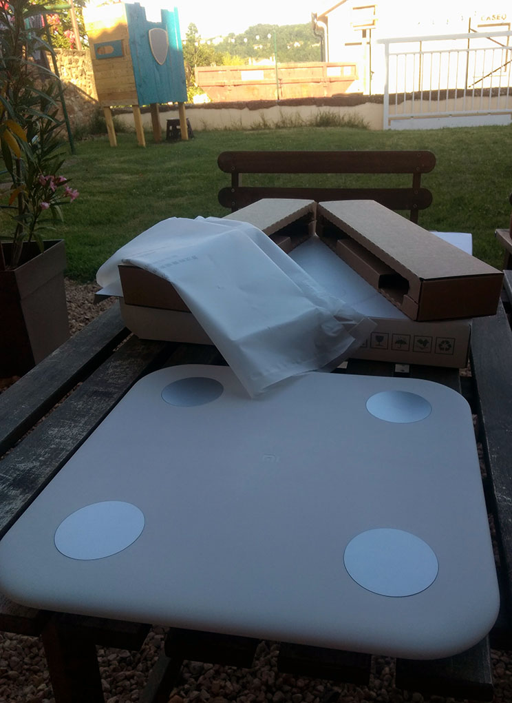

# Balance Connectée XIAOMI Weight Body Fat

> Aujourd’hui j’ai reçu la nouvelle Balance Connectée XIAOMI Weight Body Fat et je vais bientôt vous présenter un [**test complet**](/articles/balance-connectee-xiaomi-weight-body-fat-le-test).

## Description

La balance connectée XIAOMI peut mesurer plusieurs données telles que **l’IMC**, le **poids**, la **masse** **osseuse**, le **pourcentage** **d’eau**, la **masse** **musculaire**, le **métabolisme** de **base**, le **taux** de **graisse** **corporelle**, le **taux** de **graisse** **viscérale**, etc…

Le poids est affiché sur le **dessus** de la **balance** et toutes les **données** sont **enregistrées** dans l’application **Mi-Fit**. On peut créer des **profils** pour chaque **membre** de la **famille** et même pour les **nourrissons,** grâce à la fonction « pèse nourrissons ».

La balance est **compacte**, 14,75 mm d’épaisseur. Le revêtement est en **plastique** **ABS** de **très** **bonne** **qualité,** avec un **affichage** **invisible** lorsque la balance n’est pas utilisée et en veille.

Et **Jeedom** alors ? Grâce au plugin gratuit BLEA de [Sarakha63](http://sarakha63-domotique.fr/), les balances connectées XIAOMI Weight Body Fat, Miscale et Miscale2 sont compatibles avec Jeedom.

~Sachez que si la **première version** de la balance Xiaomi était **intégrée** à **Jeedom** grâce au plugin gratuit [BLEA de Sarakha63,](https://market.jeedom.fr/index.php?v=d&p=market&type=plugin&plugin_id=blea) la **nouvelle** **balance** connectée XIAOMI n’est **pas** encore **compatible** et rien n’est sûr quant-à une future **compatibilité** avec Jeedom, mais **Sarakha63** est sur le coup et je ne manquerai pas de **vous** **prévenir** en cas d’évolution.~

XIAOMI Smart Scale WeightV1 Compatible Jeedom

La V1 compatible Jeedom est disponible sur [Amazon à 38 €](http://amzn.to/2rOkBt3) et sur Gearbest à 37 €.

## Déballage

J’ai reçu la balance dans une **boite en carton** blanche, avec la **photo de la balance** et le **logo MI**, le tout enveloppé dans du **papier bulle** et dans une **enveloppe** **matelassée**.
Le **transport** s’est très bien passé, car il n’y avait **aucune** **marque** de **choc** sur la boite.

La **boite** avait été **ouverte,** mais c’est parce que les **piles** ont été **retirées** pour le **transport**, conformément à la nouvelle **réglementation** du transport aérien.

## Conclusion

Comme je vous le disais, un [**article** **complet**](/articles/balance-connectee-xiaomi-weight-body-fat-le-test) va bientôt arriver, dans lequel je vous présenterai en **détail** cette **nouvelle** **balance** connectée XIAOMI Weight Body Fat .

Edit : [Test – Balance Connectée XIAOMI Weight Body Fat](/articles/balance-connectee-xiaomi-weight-body-fat-le-test) disponible.
