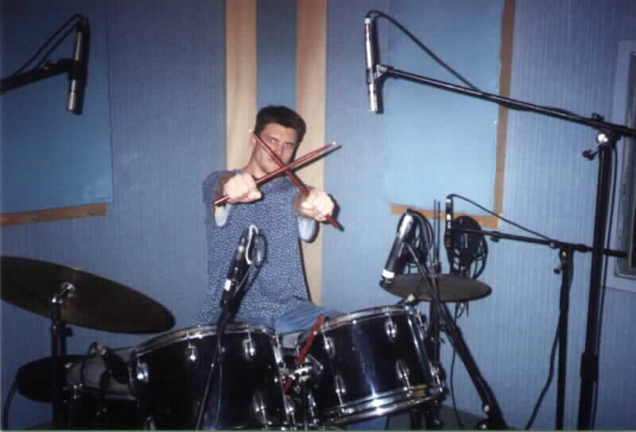
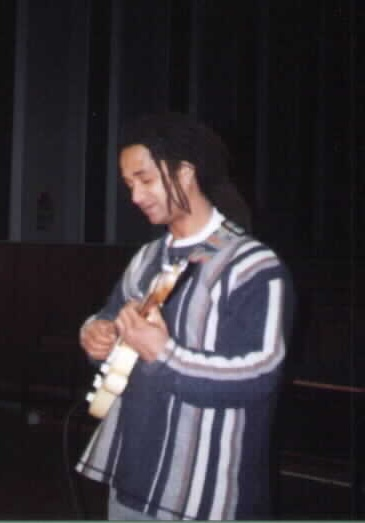

> Depuis ma première guitare reçue à Noël 1994 jusqu'aux jam sessions lyonnaises, la musique a toujours accompagné les grandes étapes de ma vie.
>
> Cette passion m'a permis de rencontrer des musiciens inspirants, de jouer en groupe, d'enregistrer des albums, de voyager en Irlande et en Australie et de découvrir des univers musicaux très variés.
>
> Voici le récit d'un parcours commencé il y a plus de trente ans.

On est en 1994. C'est Noël. Mon père m'achète une **guitare acoustique** chez Carrefour et m'offre un abonnement d'un an à **Guitar Part**, ainsi que le numéro du mois consacré à **Led Zeppelin** et **Stevie Ray Vaughan**. Il n'en fallait pas plus pour que l'aventure commence.

Je me lance alors dans les **gammes pentatoniques** et les **tablatures**. Très vite, je me sens limité par ma guitare acoustique et rêve d'une **guitare électrique** accompagnée d'un petit ampli pour me rapprocher de mes influences du moment :

- Jimi Hendrix, Stevie Ray Vaughan, Mark Knopfler, David Gilmour, Eric Clapton, Paul Personne, Gary Moore, Lucky Peterson, Popa Chubby, Albert Collins, Buddy Guy, Santana, Robben Ford, Chico Banks, Ronny Jordan, David Gogo, Sinclair, Kenny Burrell, Larry Carlton, Biréli Lagrène, Lee Ritenour.

Mon père, grand amateur de musique, compte plusieurs musiciens parmi ses amis. C'est ainsi qu'il me présente **Pierre**, passionné de jazz et guitariste dans un groupe amateur.

**Pierre** prend le temps de m'enseigner la **théorie musicale** et me transmet des bases solides qui me servent encore aujourd'hui.

Avec le recul, j'aurais aimé être un élève plus studieux et apprendre le **solfège**. C'est un manque que je ressens encore, mais à l'époque, malgré les conseils de Pierre, cela me paraissait secondaire et fastidieux.

> « Avec le recul, apprendre le solfège est probablement l'une des choses que j'aurais dû prendre plus au sérieux. »

Grâce à ces séances musicales, je gagne en assurance et découvre la richesse de la musique, ses racines et ses multiples ramifications.

## Les années lycée

Au lycée, je rencontre **Jérôme**, qui est encore aujourd'hui l'un de mes amis les plus proches. Batteur passionné, il devient rapidement mon partenaire musical. Nous répétons régulièrement dans un local mis à disposition par l'établissement.

L'année suivante, le lycée engage **Franck Kouby**, musicien professionnel grenoblois et leader du groupe Natty.

Franck nous apporte rapidement la structure qui nous manquait. D'autres élèves nous rejoignent et nous formons un groupe qui donnera lieu à plusieurs concerts.

La musique que nous jouons alors correspond moins à mes goûts. Je commence donc à voir Franck en dehors du lycée afin de jouer un répertoire plus proche de mes aspirations.

Au fil des années, Franck devient un ami proche. Nous jouons ensemble aussi souvent que possible. Je participe à l'enregistrement de certains de ses albums, réalise le DVD d'un de ses concerts et crée son site web.

Depuis toutes ces années, il continue à m'apprendre énormément sur le plan musical, et je porte toujours une grande attention à ses conseils.

> Franck fait partie des personnes qui ont le plus influencé ma façon d'aborder la musique, aussi bien humainement que musicalement.

## Dublin et les voyages

Après le bac, je quitte Grenoble et mets la musique entre parenthèses. Le manque d'occasions et de partenaires finit par m'éloigner de la guitare. Je ne m'y remets véritablement qu'à l'été 2004, lorsque mes colocataires à **Dublin** m'offrent une guitare folk pour mon anniversaire.

Je découvre alors Keb' Mo', Eric Bibb, Damien Rice, Dave Matthews, Donavon Frankenreiter, Guy Davis, mais surtout Jack Johnson et The Waifs. Avec Jess, ma colocataire australienne, nous écoutons leurs albums en boucle. Il y a aussi Nacho, mon colocataire argentin. Nous animons régulièrement les soirées : Nacho chante et joue de la guitare, je l'accompagne. Une ambiance musicale cosmopolite qui marque profondément ces deux années irlandaises.

> Les soirées improvisées à Dublin, guitare à la main avec des colocataires venus des quatre coins du monde, restent parmi mes meilleurs souvenirs musicaux.

Je continue à jouer tout en voyageant, la guitare accrochée au sac à dos. Ces voyages m'offrent de belles rencontres et enrichissent progressivement mon jeu.

Je rentre d'**Australie** en 2006 avec, dans mes bagages, des découvertes comme John Butler et Xavier Rudd, mais aussi, de manière plus inattendue, Tryo et La Rue Kétanou, que je n'avais jamais vraiment pris le temps d'écouter auparavant.

## Installation à Lyon

Une fois installé à Lyon, je dispose de moins de partenaires de jeu que pendant mes années de voyage, mais je ne cesse jamais complètement de jouer.

Je rencontre alors Betsy, une Américaine installée à Lyon, chanteuse et guitariste, qui deviendra une amie. Nous commençons par jouer chez Seb, un ami commun, puis je m'équipe progressivement pour enregistrer à la maison.

Je monte ainsi un petit **home studio** qui me permet d'enregistrer principalement avec Nelly, ma compagne, mais aussi de réaliser des maquettes et de prendre du recul sur nos compositions.

## Retour aux projets de groupe

Début 2011, l'envie de reprendre la guitare électrique, délaissée depuis près de dix ans, se fait sentir. Je publie alors une annonce sur **EasyZic** afin de trouver des musiciens et former un groupe.

Après quelques essais peu concluants, je reçois un message d'Aurélien me présentant son projet. Le courant passe immédiatement et nous décidons de jouer ensemble régulièrement. Nicolas, batteur, nous rejoint ensuite. Le trio est formé.

Nous nous retrouvons alors chaque semaine dans un local de répétition pour partager notre passion commune.

> Pendant plusieurs années, la répétition hebdomadaire est redevenue un rendez-vous incontournable de ma semaine.

Encore une belle rencontre musicale.

En juin 2012, nous commençons l'enregistrement d'un album de quatre titres issus de notre répertoire, disponible sur [**SoundCloud**](https://soundcloud.com/guillaume-braillon/sets/altjala).

  

J'ai quitté le groupe en 2013 pour partir vers de nouvelles aventures.

## Une longue pause

Nous sommes maintenant en 2021.

Après un mariage, deux enfants et près de huit années passées loin de mes guitares, l'envie est revenue.

> Huit années sans vraiment jouer peuvent sembler longues, mais certaines passions attendent simplement le bon moment pour revenir.

Contrairement au vélo, la guitare ne se récupère pas instantanément : j'ai parfois l'impression d'avoir tout oublié. Pourtant, le plaisir est toujours là.

Je me suis inscrit aux jam sessions de **Plug'n Play** à Lyon, et c'est un vrai bonheur de jouer avec d'autres musiciens, d'être accompagné et encouragé à sortir de ma zone de confort.

## Aujourd'hui

Aujourd'hui encore, la musique reste un fil conducteur de ma vie. Elle m'a permis de faire des rencontres marquantes, de voyager, de créer, de partager et d'apprendre. Plus qu'un simple loisir, elle fait partie de mon histoire.
