# Caméra IP Wanscam HW0026

> Aujourd’hui je vous propose un tutoriel sur la **caméra IP Wanscam HW0026**. Nous verrons comment la **connecter au wifi**, puis à **Jeedom** grâce au **plugin** officiel **Caméra** disponible à 4,00€ sur le Market.
>
> La caméra IP **Wanscam HW0026** est une caméra **wifi** 802.11/b/g/n, sans port Ethernet, avec un **angle de prise de vue de 90 °,** sa résolution est de **720P** en **H.264** ce qui permet d’avoir des images de **bonne qualité.** Il est possible de faire de la **détection de mouvement**, avec **enregistrement** en **local** sur **carte SD**, ou en **déporté** sur un [NAS](https://amzn.to/2Hhn4DW) par exemple.
> La **caméra** est relativement **petite**, 8 x 8 x 11, 70 cm (L x W x H) et très **légère**. On a l’impression d’avoir un petit bout de plastique dans la main.
>
> La conception est d’ailleurs assez étrange, car elle se compose d’un **socle en plastique** (blanc) dans lequel on clipse la **caméra** (noire), avec, à l’avant le **capteur**, le **micro** et les **lumières infrarouge.** A l’arrière on trouve le **haut-parleur** et le bouton **reset**.
>
> Il est **possible** de ne pas utiliser le socle et ainsi de facilement **dissimuler** la **caméra**.
>
> 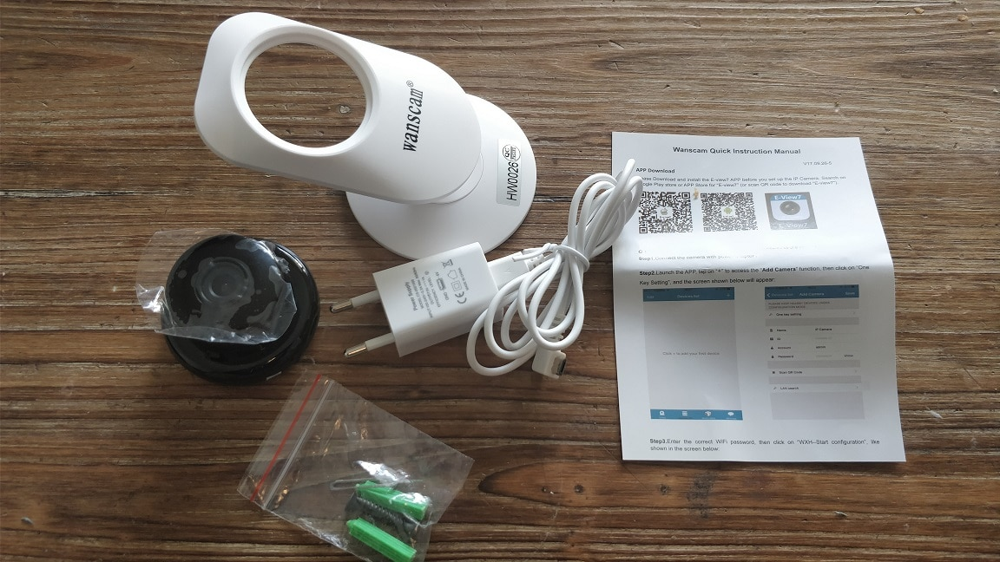
>
> La caméra est livrée avec le socle, un adaptateur secteur, un mode d’emploi en Anglais, des vis de fixation et une aiguille pour faire un reset.
>
> Certes, c’est une **caméra** prévue pour une utilisation **intérieure**, mais il est possible de la mettre à **l’extérieur** si elle est **protégée** de la pluie. Chez moi, elle est sur mon balcon depuis plusieurs mois et elle fonctionne très bien.
>
> La **fonction interphone** permet **d’entendre** ce qui se passe autour de la caméra, mais aussi de **parler** depuis l’application pour smartphone.
>
> La caméra IP **Wanscam HW0026** dispose de 10 LED IR pour la **vision nocturne** jusqu’à 10m.
>
> Pour finir, il est possible d’installer une **[carte micro SD jusqu’à 64 Go](https://amzn.to/2LTkQOG)** pour stocker les **enregistrements**, même s’il est plus sûr de déporter le stockage sur un [**NAS**](https://amzn.to/2Hhn4DW) ou un serveur **FTP** par exemple.
>
> La caméra IP Wanscam HW0026 est **compatible** avec plusieurs **protocoles** et propose plusieurs **aides** à la configuration tel que :
>
> - **PLUG AND PLAY**, qui permet d’accéder à la camera facilement sans configuration de routeur grâce à l’application e-View7.
> - **DDNS**, qui permet d’accéder à votre camera via une adresse http://\[nom_d_utilisateur\].ipcpnp.com.
> - **Onvif**, utilisé par exemple par Surveillance Station disponible sur le NAS Synology.
> - **Http**, pour visualiser et configurer la camera depuis un navigateur internet et entre autres, pour l’utilisation via Jeedom.
> - **FTP**, qui permet d’envoyer les fichiers sur un serveur FTP déporté.
> - **RTSP**, permet de visualiser les images en streaming.
> - **DHCP**, permet d’avoir une adresse IP dynamique ou statique.
>
> La liste est relativement longue, il est donc possible de faire **beaucoup de réglages** sur cette caméra IP Wanscam HW0026. Je vous invite à lire le [**manuel d’utilisation** (en anglais)](http://www.wanscam.com/xiazai/download/HW/HW_User%20manual%20-%20English.pdf) si vous voulez utiliser des fonctions plus spécifiques.
>
> 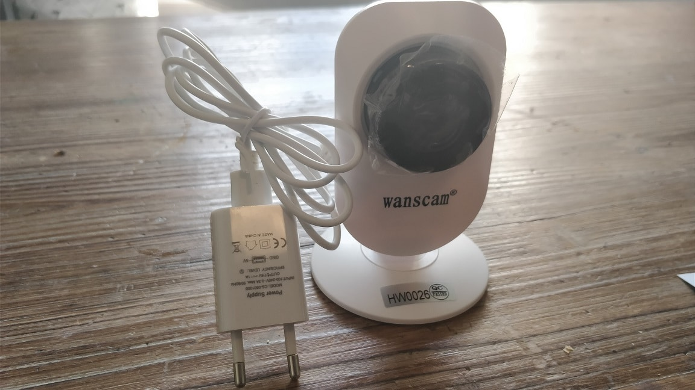
>
> _Attention, l**’adaptateur secteur fournis** est bien au format Européen, mais il est **trop gros** pour être branché sur les prises avec terre, donc **inutile** dans la plupart des cas. Du coup n’hésitez pas à prendre le modèle avec **prise US** si il est **moins cher** car d_an_s les 2 cas il faudra **acheter** un adaptateur secteur du type EU Plug Power Adapter à **0,78€ sur Gearbest** ou [Chargeur secteur USB 5 Watt, 1A](https://amzn.to/2HhsMpq) à **2,55 € sur Amazon**._

## Connexion au wifi de la caméra IP Wanscam HW0026

La configuration est assez **simple** grâce à un système de **QR code** à flasher sur le socle de la caméra avec **l’application [E-View7](https://play.google.com/store/apps/details?id=object.xhapp.client&hl=en)**. Dans un premier temps, il faut donc **télécharger** l’application pour [Android](https://play.google.com/store/apps/details?id=object.xhapp.client&hl=en) ou [IOS](https://itunes.apple.com/us/app/e-view7/id731225813?mt=8) et **l’installer**.

Une fois **l’installation** **terminée,** vérifiez que vous êtes bien **connecté** au **wifi** de votre logement.

- Cliquer sur le **\+ en haut à droite de l’écran**.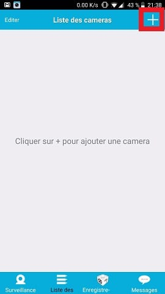
- Cliquer sur **Scanner QR code**.
- Flasher le QR code sur le **socle** de la **caméra**.
- Le **champ ID** devrait se remplir **automatiquement**.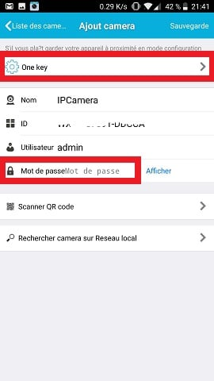
- Saisir le **mot de passe admin**. Le mot de passe est sur le socle à côté du QR code.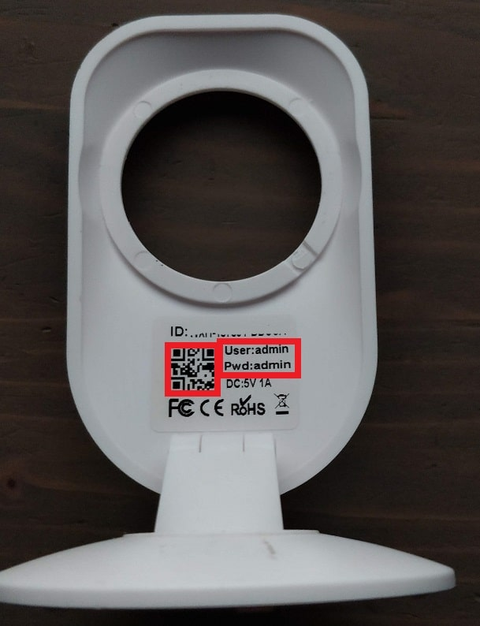
- Cliquer sur **One Key** en haut de la page.
- Saisir la **clé de votre Wifi**. Le wifi utilisé est celui sur lequel votre smartphone est connecté. Attention ! Il ne faut pas être sur un **wifi** en 5Ghz, mais bien en **2.4Ghz**.
- Cliquer sur **XHA-commencez la configuration**. C’est la seconde ligne.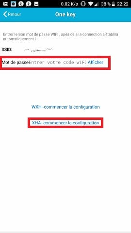
- Cliquer sur la **caméra** pour **finir** l’installation.

## Configuration de la caméra IP Wanscam HW0026

Le plus simple pour **accéder** à la **configuration** de la caméra, c’est d’utiliser le **protocole HTTP** en tapant l’adresse **IP de la camera** dans un navigateur internet, **http://\[Ip_De_La_Caméra\]**.

_Info : La mienne était configurée sur le **port 80**, donc pas de problème pour se connecter, mais certains modèle sont sur le **port 81** il faut donc saisir **http://\[Ip_De_La_Caméra\]:81**._

Avant de pouvoir accéder à la page de configuration, il faut saisir le **nom d’utilisateur et le mot de passe « admin » et « admin »**.

Vous pourrez ensuite **choisir la langue** en haut de la page et **3 menus** s’offrent à vous :

- **Intelligent mode**, permet d’accéder à la configuration de la caméra IP Wanscam HW0026.
- **No Plug-In**, permet d’avoir un accès à l’image en direct.
- **Intelligent online playback**, permet de visionner les enregistrements.

Le menu **Intelligent mode** va nous permettre de **configurer** avec précision toutes les **options** de la caméra, mais je vais simplement évoquer celles qui seront utile pour la **configuration** dans **Jeedom**.

_Info : Avant toute chose, il faut **installer** le **plugin** en cliquant sur **OCX** en haut à droite de la page._

Une fois **dans** le **mode intelligent**, cliquez sur la **roue crantée** en bas a gauche, pour accéder aux **réglages.** N’hésitez pas à parcourir les menus pour voir tout ce qu’il est possible de faire avec cette camera. 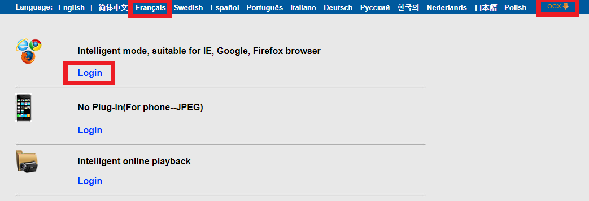

### Réglage de l’heure de la caméra IP Wanscam HW0026

- Aller dans le menu **Installation de horloge d’équipement** (Time set).
- Cocher **Ajuster automatiquement le temps** (Automatically adjust clock for daylight saving time changes).
- Cliquer sur **Synchroniser le temps avec PC** (Sync with PC time).
- Cliquer sur **Application** (Apply).

_Info : Lors de la configuration le fuseau horaire à choisir n’est pas Paris GMT+1, mais Athènes GMT+2, pour être à l’heure._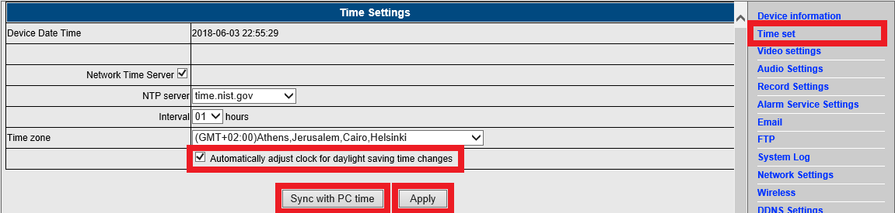

### Réglage de l’IP et des ports HTTP et RTSP de la caméra IP Wanscam HW0026

- Aller dans le menu **Réseau** (Network Settings).
- Sélectionner **Installation manuelle d’IP** (Fixed IP Address).
- Saisir une adresse IP dans le champ **Adresse d’IP** (IP address).
- Saisir un port dans le champ **Port de HTTP** (HTTP Port).
- Saisir un port dans le champ **Port de RTSP** (RTSP Port).
- Cliquer sur **Appliquer** (Apply).

_Info : Il n’est pas indispensable de faire ces modification pour l’utilisation de la camera, mais il est plus sûr d’avoir un IP fixe et de changer les ports._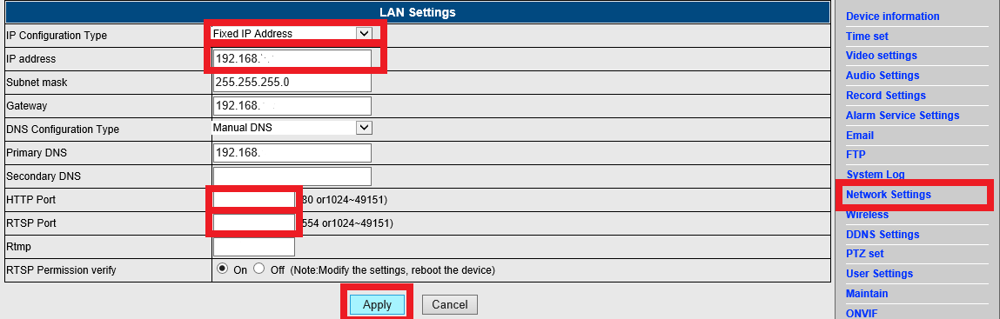

### Changer le nom d’utilisateur et mot de passe admin de la caméra IP Wanscam HW0026

- Aller dans le menu **Utilisateur** (User Settings).
- Saisir un nom **d’utilisateur** et un **mot de passe**.
- Cliquer sur **Appliquer** (Apply).

_Info : Seul le compte admin est utile, je n’ai pas trouvé les différences de droits avec les utilisateurs User et Guest et il n’est pas non plus possible de se loguer avec._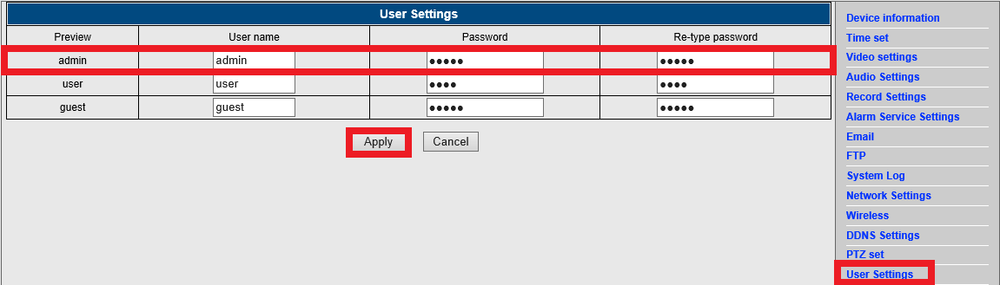

## **Configuration du plugin Caméra dans Jeedom**

Le plugin est à **4,00€ sur le Market** de Jeedom. Vous le trouverez en **tapant camera** dans le moteur de recherche. **L’installation** se fait comme pour tous les autres plugins, en cliquant sur **Installer** **Stable** puis **Activer**. Il faut aussi lancer les **Dépendances**.

### Ajouter la caméra Wanscam HW0026 dans Jeedom

Une fois le **plugin** **installé,** vous le retrouverez dans le menu **Sécurité**.

- Aller dans **Plugins / Sécurité / Caméra**.
- Cliquer sur **Ajouter**.
- Saisir un **nom d’équipement**, exemple : **Wanscam HW0026**.
- Sélectionner l’**objet parent**.
- Cocher **Activer** et **Visible**.
- Saisir l’**adresse Ip** de la caméra et le **port 80**. Si vous ne les avez pas modifiés, certaines camera utilisent le port 81.
- Saisir le **nom d’utilisateur** **admin** et le **mot de passe** **admin**. Si vous ne les avez pas modifiés.
- A droite, sur la page choisir : **Wanscam HW0026** dans la liste des **modèles**.
- Cliquer sur **Sauvegarder**.
- Remplacer dans le champ **URL de snaphot** l’adresse « `/snapshot.cgi?usr=#username#&pwd=#password#` » par « `/web/tmpfs/snap.jpg`« .
- Cliquer sur **Sauvegarder**.

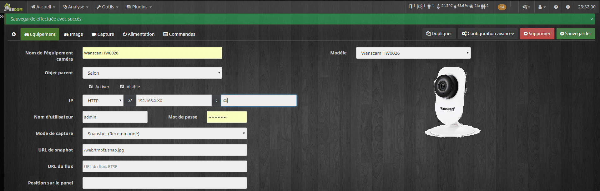

### Configurer les commandes de la caméra Wanscam HW0026

Les **commandes** de la camera pré-enregistrées dans la **config** du plugin ne sont **pas les bonnes.** Il faut donc les **changer**, en allant dans l’onglet **Commandes** :

- **Changer** l’URL de la commande **IR Off** par : `/cgi-bin/hi3510/param.cgi?cmd=setinfrared&-infraredstat=close&usr=#username#&pwd=#password#`.
- **Changer** l’URL de la commande **IR Auto** par : `/cgi-bin/hi3510/param.cgi?cmd=setinfrared&-infraredstat=auto&usr=#username#&pwd=#password#`.
- Vous pouvez **ajouter** une commande **IR On** avec comme URL : `/cgi-bin/hi3510/param.cgi?cmd=setinfrared&-infraredstat=open&usr=#username#&pwd=#password#`.

_Info : La caméra n’étant pas motorisée et le son n’étant pas géré par le plugin Caméra de Jeedom, nous n’avons pas d’autres commande à ajouter._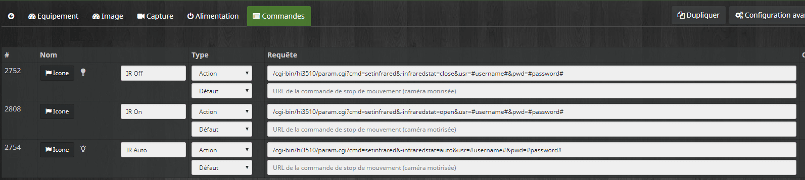

### Ajouter la caméra Wanscam HW0026 sur un design Jeedom

Pour finir, voilà comment **ajouter** la camera sur un **design** Jeedom, afin **d’accéder** facilement à **l’image de la caméra**.

- Aller dans **Accueil / Design** choisir un design.
- Faire clic droit **Edition**.
- Refaire clic droit **Ajouter une image / caméra**.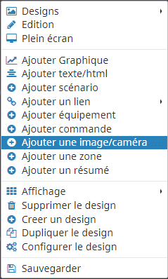
- **Placer** l’image sur le design.
- Faire **clic droit** sur l’image, puis **Paramètres d’affichage**.
- Dans **Afficher,** choisir **Caméra**.
- Dans **Caméra,** sélectionner **Wanscam HW0026** et **valider**.
- Cliquer sur **Sauvegarder**.
- **Ajuster** la taille avec **l’angle** inférieur droit de l’image.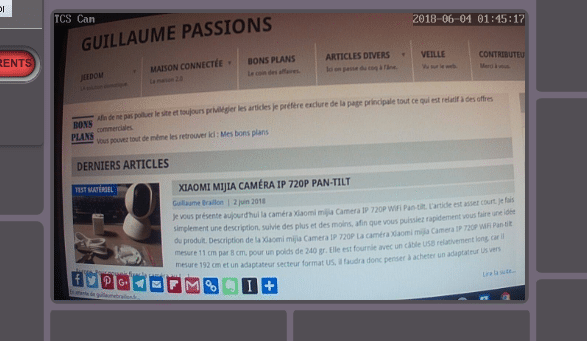

## Où acheter la caméra IP Wanscam HW0026 ?

La **caméra** IP Wanscam HW0026 avec prise US est **disponible** sur **Gearbest** à **18,71 €** avec frais de **port gratuits**.

La **caméra** IP Wanscam HW0026 avec prise EU est **disponible** sur **Gearbest** à **18,92 €** avec frais de **port gratuits**.

_Si vous n’en avez pas, il faudra acheter un **adaptateur secteur** EU Plug Power Adapter à **0,78€ sur Gearbest,** ou [Chargeur secteur USB 5 Watt, 1A](https://amzn.to/2HhsMpq) à **2,55 € sur Amazon**._
