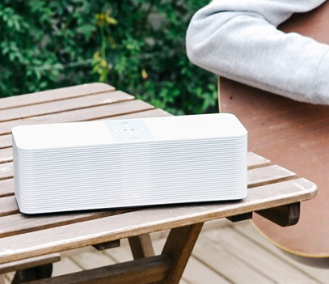
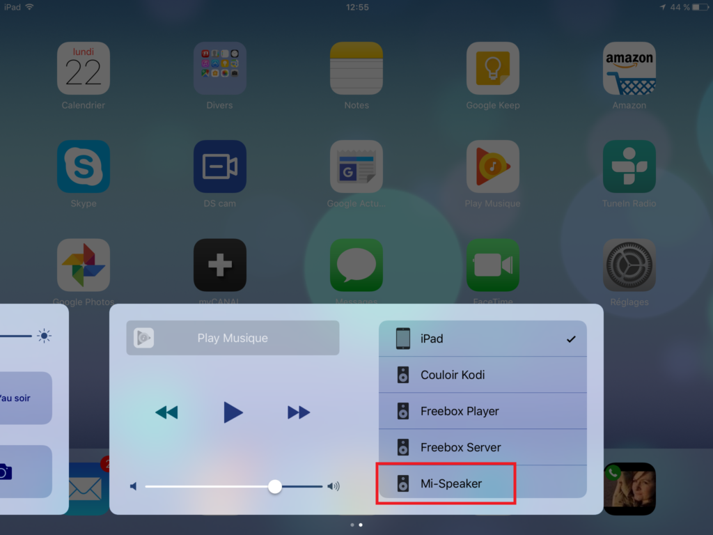
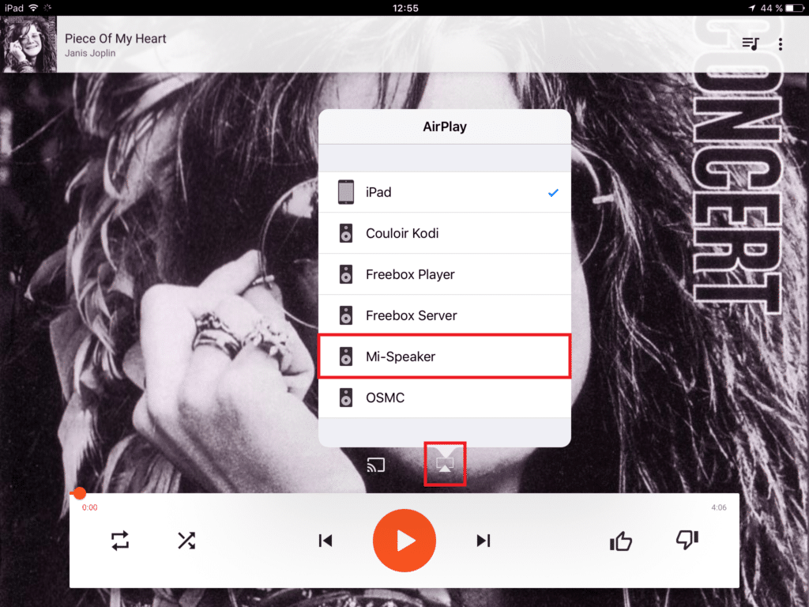
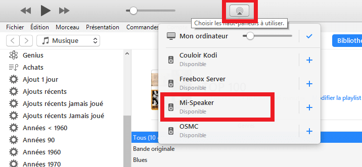
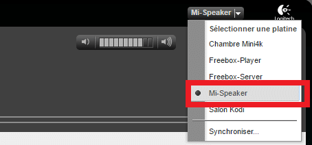

# Enceinte connectée Wifi, UPNP, Bluetooth Mi-Speaker Xiaomi

> Après les gammes Aqara et Yeelights de Xiaomi, je vais maintenant vous présenter une alternative aux célèbres Sonos, l’enceinte connectée **multi-Protocol Xiaomi Mi Smart Network Speaker**.
>
> L’article est assez long car j’ai souhaité évoquer les **différentes possibilités** qu’offre cette enceinte et ne pas me limiter au déballage et à la connexion.
>
> Cette enceinte est capable de fonctionner en **Wifi, UPNP, Bluetooth, USB**… et dispose de **8GO de mémoire interne**.
>
> **Les fonctions proposées** par l’enceinte sont, entre autres, Alarme, Sleep par délai ou par nombre de chansons, Égaliseur, contrôle vocal (Chinois seulement), il est aussi possible d’accéder gratuitement à une **plateforme de musique en Streaming**, quid de la légalité…
>
> La compatibilité avec Jeedom est multiple, grâce aux différents protocoles que propose cette enceinte connectée.
>
> **Mise à jour du 02/07/2017** : Une **mise à jour** de **l’application** et du **firmware** est disponible. Aller dans « **Upgrade** » et cliquer sur « **Check for update**« .

## Présentation

### Déballage et branchement.

Comme toujours chez Xiaomi, le **packaging** est de **très bonne facture**.

L’enceinte est dans une **boîte en carton épais, avec des mousses de protection**, collées à l’intérieur pour protéger des chocs.

Elle est toute revêtue de **plastique blanc de bonne qualité**, sauf la partie supérieure supportant les **boutons de contrôle** qui est en **alu brossé**.

Encore un très beau design signé Xiaomi.

Sous le capot, on a un processeur **Amlogc 8726M3 Cortex A9** avec du **Wi-Fi 802.11ac** et du **Bluetooth v4.1**.

Équipée de **4 haut-parleurs, 2 Sub-woofers** de 2,5 pouces pour des graves profonds, avec la technologie « **Vented Bass-duct** » et **deux tweeters** pour des aigus équilibrés.

Pour se connecter à l’enceinte, on dispose d’un port **USB 2.0**, d’un **jack 3,5 mm, du bluetooth, du wifi** qui permet d’utiliser, entre autre, **Airplay** et **DLNA** / **UPNP** ainsi qu’une plateforme de **Streaming** intégrée à l’application. Pour finir, **8 Go** de stockage interne permettent d’écouter de la musique hors connexion.

Il y a aussi une **sortie Jack 3.5 mm** permettant de connecter l’enceinte à une **chaîne Hifi** par exemple et ainsi utiliser l’enceinte Xiaomi comme **récepteur Multi-protocoles**.

Côté mensurations, la bête fait, 282×95×90 mm, pour un poids de 1,622 kg.

Comme toujours, le mode d’emploi est en chinois, donc inutile, mais il est disponible en [anglais sur le site de Xiaomi](http://files.xiaomi-mi.com/files/mi_internet_radio/Mi%20Internet%20Radio%20EN.pdf).

Le câble d’alimentation électrique est au format **US/CHINA**, il faut donc penser à demander un adaptateur lors de la commande. Sinon, vous pouvez acheter des adaptateurs US =>EU à 0.81 € chez Gearbest ou [5,79 € les 5 sur Amazon](http://amzn.to/2qU6fuU) et en [Premium](https://www.amazon.fr/essayerpremium?tag=guilbraimespa-21) si vous êtes pressé.

Personnellement, j’ai utilisé le câble d’un ancien appareil qui est parfaitement compatible.

_**Quelques informations technique :**_

- Poids 1,622 kg.
- Dimensions 282 × 95 × 90 mm.
- Haut-parleur 4 x HiFi acoustic systems.
  - Haut-parleurs 2 × 2,5 pouces.
  - Haut-parleurs 2 × core top tenor.
- Bluetooth V4.1.
- WiFi, 802.11b / g / n / ac.
- Entrée audio AUX.
- Mémoire intégrée 8 Go.
- Prise en charge du stockage USB externe.
- Puissance nominale 2 x 10W.
- Sortie max 30W.
- Tension AC 100-240V ~ 50 / 60Hz.
- Couleur blanche.

Pour utiliser l’enceinte, il faut installer une **application appelée Mi-Speaker** (en anglais) sur votre smartphone.

_**Attention !** l’enceinte ne **fonctionne pas sur batterie**, il est donc indispensable de la brancher sur le secteur._

Si c’est le côté **nomade** qui vous intéresse, Xiaomi propose de très bons modèles bluetooth **fonctionnant sur batterie**. Codes promo [disponible ici](/articles).

## Configuration de l’enceinte.

### Installation de Mi-Speaker, l’application dédié.

Pour utiliser l’enceinte, il faut utiliser une **application IOS et Android** appelé **[Mi-Speaker](http://soundbar.pandora.xiaomi.com/upgrade/wifi_app.html)**.

L’application est disponible sur le **store Xiaomi** [à cette adresse](http://soundbar.pandora.xiaomi.com/upgrade/wifi_app.html), ou via le QR code présent sous l’enceinte ainsi que dans le mode d’emploi. Pour installer la version Android, il faut avoir autorisé les applications non reconnues, car c’est une APK qui est téléchargée.

- Scanner le **QR code** pour aller sur le store de Xiaomi (en chinois).
- Cliquer sur le **bouton vert** en bas de la page.
- **Télécharger** l’APK.
- Cliquer sur **Installer**.
- Plusieurs autorisations sont demandées. (Stockage, Position, Téléphone).

- Cliquer sur la flèche à côté de **Add speaker** pour lancer la recherche de l’enceinte.
- Sélectionner l’enceinte une fois détectée. Il faut évidemment que le smartphone soit **connecté au wifi**.
- Choisir le **wifi** et entrer le **mot de passe** pour que l’enceinte se connecte au wifi.
- La configuration peut être un peu longue.

### Mise à jour du Firmware.

- Une fois l’installation terminée, vous arrivez sur la **page principale**. Il peut y avoir des playlists (Channel) pré-programmées.
- Je vous conseille de **mettre à jour le firmware**, depuis le menu **Update Assistant,** cliquer sur **Check for updates**.
- Une fois terminé, cliquer sur **Connect speaker**.

### Renommer l’enceinte.

Pour des raisons de clarté il est conseillé de renommer l’enceinte, car pour le moment le nom est en chinois et certains appareils pourraient avoir du mal à la retrouver et/ou se connecter.

1.  Aller dans le menu, en cliquant sur les **3 traits en haut à gauche** de l’application.
2.  Cliquer sur « **Switch devices**« .
3.  Cliquer sur l’icône « **Crayon** » à droite du nom de l’enceinte.
4.  Saisir le **nom de l’enceinte** que vous aurez choisi et **valider**.

## Utilisation de l’application Mi-Speaker.

L’application repose sur des **playlists** appelées **Channels.**

On va mettre les pieds dans le plat tout de suite, l’application n’est pas géniale, et même loin de là.  En même temps, une fois l’enceinte configurée, il est très facile de s’en passer.

On utilisera l’application surtout pour régler l’Alarme, le Sleep, l’Égaliseur, écouter la musique de la **plateforme de Streaming intégrée**, ou de la **mémoire interne**.

Les boutons présents sur le haut de l’enceinte sont : Volume, Play, Pause, titre précédent et suivant.

### Ecouter la musique présente sur smartphone.

1.  Cliquer sur le **« + »** en haut à droite.
2.  Puis sur « **Create channel**« .
3.  Puis sur « **Phone Storage**« 
4.  Parcourir la musique présente sur le smartphone.
5.  Cliquer sur le **« + »** en face des morceaux pour les sélectionner.
6.  Cliquer sur « **Add** » en haut à droite pour créer la playlist.

Comme je vous le disais on est **obligé** de créer des **playlists** pour pouvoir écouter de la musique. il n’est pas possible par exemple de parcourir sa médiathèque et jouer les morceaux directement.

### Ecouter la musique présente sur la mémoire interne.

Pour **copier** de la musique **dans l’enceinte**, il faut monter un **lecteur réseau** depuis son PC.

1.  Depuis l’explorateur de fichier cliquer sur « **Connecter un lecteur réseau**« .
2.  Taper : « **\\\\\[IP_DE_LENCEINTE\]\\media** » et cliquer sur « **Terminé**« .
3.  Vous avez maintenant un disque dur supplémentaire sur votre PC et vous pouvez copier vos morceaux.

Vous pouvez taper [file://\[IP_DE_LENCEINTE\]/media/](file://[IP_DE_LENCEINTE]/media/) dans votre navigateur mais vous serez en lecture seul et ne pourrez ni copier ni supprimer des morceaux.

Pour la lecture des morceaux, le principe est le même que pour la musique présente sur votre smartphone, mais **au point 3, choisir « Speaker storage »**.

### Ecouter la musique de la plateforme de Streaming.

La plateforme de Streaming regroupe plusieurs sources : Xiaomi, Mi Music, Kuke, Beva et Kuwo, ainsi que des radios, mais uniquement en chinois.

J’ai seulement trouvé des titres sur les plateformes **Xiaomi** et **Kuwo** et seule cette dernière fonctionne. Sur Xiaomi, on trouve des morceaux, mais ils ne se jouent pas. C’est peut être lié à ma connexion ADSL faible ou à une limitation légale.

**Pour rechercher un titre :**

- Saisir un artiste ou un titre dans le champ de recherche.

Les résultats sont affichés par sources et en cliquant sur « **More** » on peut voir les autres résultats de chacune des sources.

- Cliquez sur un morceau, il sera lu (seul), il est impossible de l’ajouter à la liste en cours. Il faudra passer par une playlist.
- Si un morceau est en cours de lecture, il sera remplacé par le dernier sélectionné.
- Pour l’ajouter à une playlist, il faut cliquer sur le **« + »**.

Une fois le titre en lecture, vous pouvez le **télécharger** en cliquant sur les **« … »** puis sur « **Download**« .

Sur certains titres, on peut voir s’afficher les **paroles**, même sur les titres français.

## Utilisation depuis une source externe.

Un des gros points forts de l’enceinte connectée **Xiaomi Mi Smart Network Speaker** c’est quelle propose plusieurs mode de connectivité. Il donc possible de relier presque tout type d’appareil multimédia du **smartphone** au l**ecteur Mp3** en passant par les **PC** et bien évidement les **boxes domotiques**.

### Ecouter la musique via l’Airplay.

L’**AirPlay** est un protocole créé par **Apple** qui fonctionne à travers le réseau local (Wi-Fi ou ethernet) et qui permet de connecter les appareils à la pomme. Une fois l’enceinte et l’appareil connectés au **même réseau local,** il suffit de cliquer sur l**‘icone Airplay** et de choisir l’enceinte **Mi-Speaker**.

Icone Airplay

#### Sous IOS.

- Il faut ouvrir le **menu inférieur** en faisant glisser l’écran **vers le haut** et aller dans la partie de droite pour choisir « **Mi speaker**« .

- Certaines applications permettent de sélectionner directement le **périphérique Airplay**, comme par exemple l’application « **Google Music**« .

#### Avec Itunes (Mac et PC).

- Il est aussi possible d’envoyer la **musique présente sur votre PC** en passant par **Itunes** et en cliquant sur l’**l’icône Airplay** à droite des boutons de contrôle.

_**Info : Vous pouvez synchroniser la lecture sur plusieurs périphériques en cliquant sur les « + ».**_

- **Inconvénients** :
  - Disponible en natif uniquement sur les appareils Apple.
  - Le buffering est moins bon qu’en UPNP, le son peut être dégradé sur les périphériques un peu éloignés du signal wifi.
- **Avantage :**
  - L’enceinte n’est pas associée à un seul appareil, ce qui permet de jongler de l’un à l’autre, sans passer par une procédure d’association.

### Ecouter la musique via le Bluetooth.

Le **Bluetooth** est un protocole très répandu, on le trouve sur pratiquement tous les **smartphones et tablettes**. Il permet l’échange de données à **très courte distance** en utilisant des ondes radio UHF.

- **Inconvénients** :
  - Un seul appareil peut être associé à l’enceinte, il faut donc le dissocier pour pouvoir en associer un autre.
  - La portée est assez courte il faut donc rester dans un périmètre réduit autour de l’enceinte, au risque de dégrader, ou perdre, la connexion.
- **Avantages** :
  - On n’a pas besoin de réseau local comme le Wifi ce qui rend l’enceinte plus nomade même si, je vous le rappelle, elle fonctionne uniquement sur secteur.
  - Chez moi, j’ai plus de débit en 4G qu’en ADSL, donc je peux écouter de la musique via la 4G et envoyer la musique sur l’enceinte. Chose impossible avec le Airplay ou l’UPNP par exemple qui utilisent de réseau local.

Rien de bien sorcier pour associer l’enceinte à votre smartphone ou tablette.

- Activer le bluetooth.
- Sélectionner l’enceinte dans la liste des appareils disponibles.
- Cliquer sur « **Associer**« .
- L’enceinte est connectée les sons du périphérique sortirons sur l’enceinte.

### Ecouter la musique via l’UPNP.

L’**Universal Plug and Play** (UPnP) est un protocole réseau qui permet à des périphériques de se connecter et d’échanger des données. On peut l’utiliser sur les **smartphone**, les **TV** et surtout les **boxes domotiques** telles que Jeedom ou Eedomus.

L’UPNP peut être une **alternative à l’Airplay** pour les appareils fonctionnant sous **Android,** mais contrairement à ce dernier qui est natif sous IOS, avec Android il faut installer une **application tiers**, la plus connue c’est [BubbleUPnP](https://play.google.com/store/apps/details?id=com.bubblesoft.android.bubbleupnp&hl=fr).

Je voulais vous parler de cette possibilité, mais personnellement je n’utilise pas l’UPNP depuis mon portable, car ce n’est pas très pratique. Par exemple, j’aime utiliser les vrai applications comme Google Music et non une application tiers comme BubbleUpnp.

Comme nous avons pu le voir dans l’article [Multiroom Audio-Vidéo – Installations coté serveur](/articles/multiroom-audio-video-installations-cote-serveur) **Logitech Media Server** (LMS) permet, grâce au plugin UPNP bridge, de jouer la musique de votre serveur sur n’importe quel appareil compatible UPNP.

Je vous invite à lire l’article si vous avez des questions à ce sujet.

## Utilisation depuis Jeedom.

Nous y voila ! Elle est bien belle cette enceinte mais comment est ce qu’elle se connecte à Jeedom?

Pas de problème pour utiliser l’enceinte avec **Jeedom**, car le **Jack 3.5, le** **bluetooth**, le **DLNA / UPNP / Airplay** permettent de se connecter à un grand nombre d’appareils, tels que les **smartphones**, **tablettes**, **PC**, **RPI**, **NAS**, **box domotique** et donc avec **Jeedom** cette enceinte conviendra à tous les besoins, **notifications audio, TTS, multiroom…**

Vous pouvez par exemple utiliser l’application **Jeedom Paw Interface** ou le plugin **PlayTTS** pour faire parler votre Jeedom, le plugin **Squeeze Box Control** pour jouer de la musique depuis **LMS** etc…

_Pour info, l’enceinte est aussi compatible avec la box domotique Eedomus._

### Jack 3.5mm

Vous savez brancher un casque ? Vous savez brancher l’enceinte, c’est aussi simple que ça.

A l’arrière de l’enceinte, il y a une **entrée jack** sur laquelle il suffit de brancher un **[câble 3.5mm](http://amzn.to/2rKwmkD),** à relier à la **sortie Jack** du Raspberry Pi, ou autre appareil avec Jeedom d’installé.

**_Info : sur les Jeedom mini+ la carte son n’est pas utilisable, il faudra passer par les autres solutions._**

Encore mieux, utilisez un vieux smartphone sous Android, avec l’application **[Jeedom Paw Interface](https://www.jeedom.com/forum/viewtopic.php?f=27&t=18283),** une fois l’application installée et configurée, il suffit de brancher le câble à la **sortie audio du smartphone** et vous pouvez faire de la [synthèse vocal (TTS)](https://fr.wikipedia.org/wiki/Synth%C3%A8se_vocale), ou jouer de la musique.

### Bluetooth.

A partir du **Raspberry Pi3 le bluetooth est intégré.** Sur les versions précédentes, il est possible d’ajouter une **clé bluetooth**. [**Voir le produit sur Amazon**](https://www.amazon.fr/dp/B01GPMYNOA?tag=guilbraimespa-21)

Pour relier l’enceinte à Jeedom via le bluetooth, utilisez le **plugin PulseAudio** qui va vous permettre de **rechercher** l’enceinte et de **l’associer**. La même chose est possible en SSH pour les plus téméraires.

### L’UPNP via LMS.

Comme nous l’avons vu dans le chapitre « [Ecoutez la musique via l’UPNP](#ecouter-la-musiquevia-lupnp) » et dans l’article [Multiroom Audio-Vidéo – Installations coté serveur](/articles/multiroom-audio-video-installations-cote-serveur), il est possible de jouer la musique de votre serveur **LMS** vers les périphériques **UPNP** avec le **plugin LMS UPNP/DLNA Bridge** et grâce au plugin [**Squeeze Box Control**](https://jeedom.github.io/documentation/plugins/squeezeboxcontrol/fr_FR/index.html) de l’intégrer à **Jeedom**.

## Bizarreries

J’utilise l’enceinte depuis **quelques jours** maintenant, aussi j’ai remarqué des **comportements étranges,** mais qui, pour la plupart, n’empêchent pas l’utilisation.
Voici quelques-unes de ces « bizarreries » :

- **LMS**
  - La pause ne fonctionne pas depuis LMS, il faut le faire depuis l’application Mi-Speaker, ou depuis les boutons de l’enceinte.
  - Lorsque l’on écoute de la musique via LMS et que l’on lance un titre depuis l’application Mi-Speaker sans arrêter LMS, la barre de défilement de LMS continue d’avancer en boucle sur le même morceau et si ensuite vous faites « morceau suivant » sur LMS, cela arrête la musique de Mi-Speaker et joue le morceau suivant de LMS.
  - Le volume peut être changé via LMS, même lors de l’utilisation de l’enceinte en Airplay ou via l’application Mi-Speaker.
  - L’enceinte à tendance à disparaître de LMS, il faut soit redémarrer l’enceinte ou faire « Generate » depuis le plugin UPNP. Je n’ai plus ce problème depuis que je ne renomme plus l’enceinte via le plugin UPNP de LMS.
- **Airplay**
  - Le bouton Play de l’enceinte la déconnecte du Airplay, il faut alors la reconnecter depuis le périphérique source (Ipad, Iphone, Itunes).
  - Les boutons « suivant » et « précédent » ne fonctionnent pas.
  - Le volume peut être changé via LMS ou l’application Mi-Speaker.

Je rajouterai au fur et à mesure les bizarreries que je constaterai lors de l’utilisation de l’enceinte, mais à part la déconnexion de l’Airplay et la pause depuis LMS, ce n’est pas très gênant. D’ailleurs le comportement depuis LMS n’est pas présent chez tout le monde.

## Conclusion

Il y a encore **beaucoup de fonctions** que je n’ai pas abordées dans l’article, sinon il serait **encore plus long**.

Néanmoins, je dois dire que **Xiaomi** propose un nouvelle fois un appareil de **qualité,** aussi bien du coté **design** que des matériaux et de la **qualité sonore**. Oui, je n’ai pas trop abordé le coté « **Qualité audio**« , car le son et sa qualité sont des notions très subjectives et personne ne pourra choisir à la place de vos oreilles.

Pour être complet, je me permets tout de même de vous faire part de **mon avis.** Pour vous donner une idée, j’écoute beaucoup de **Rock**, **Blues**, **Jazz** et mon fils ainsi que ma femme écoutent des musiques plus « **modernes**« , comme de la **variété française**, de la **pop,** mais aussi des **contes pour enfants**.

En écoute à un volume sonore faible ou moyen, l’**équilibre entre les aiguës et les basses** est bien respecté, même lorsqu’on pousse un-peu les watts, la qualité est toujours au rendez vous.

Je trouve donc le **son de très bonne qualité** et pour preuve, ça faisait un moment que mon ampli n’était pas resté éteint aussi longtemps.

La **facilité d’utilisation** rend naturel le choix de l’enceinte par rapport à des appareils plus complexes à mettre en route et on est loin du son, souvent plat, des enceintes bluetooth qui sont, par leur coté nomade, moins bien équipées pour sortir un son de qualité.

L’**esthétique** et les **finitions** de qualité, ainsi que les **commandes** présentes sur le haut de l’enceinte, lui apportent en plus des **points WAF**.

Si votre femme utilise un **iPhone** pour écouter la musique, elle sera ravie de pouvoir enfin **écouter sa musique** sur l’enceinte, aussi **facilement** qu’avec des écouteurs, c’est du vécu.

