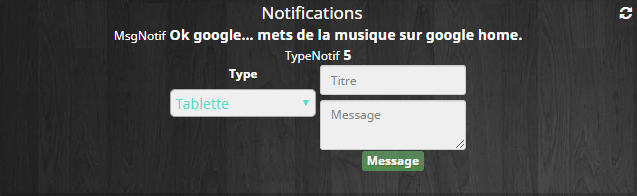
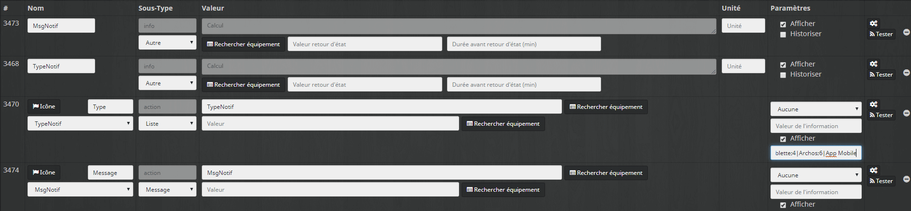
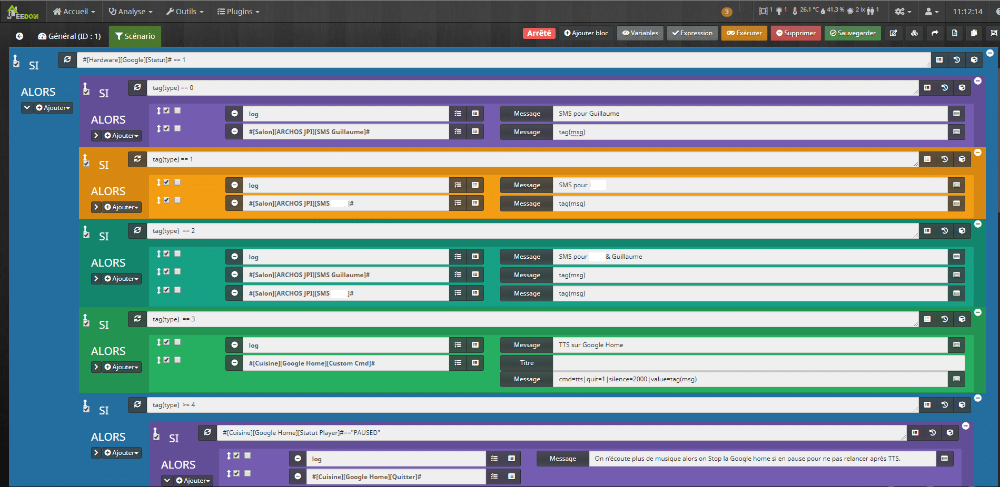
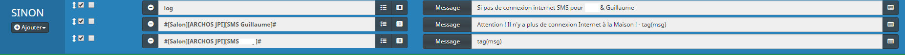

# Envoi des Notifications dans Jeedom

Dans ce tutoriel nous allons voir comment gérer facilement l’envoi de notification dans Jeedom. Le principe est simple, dans vos scénarios il vous suffit d’ajouter 2 commandes, une pour le type de notification sélectionnable dans une liste déroulante et une autre avec votre message.

-  **Coté Software** j’utilise les plugins :
  - [JPI](https://www.jeedom.com/market/index.php?v=d&p=market&type=plugin&&name=JPI) (Gratuit).
  - [Google Cast](https://www.jeedom.com/market/index.php?v=d&p=market&type=plugin&&name=google%20cast) (Gratuit).
  - [Virtuel](https://www.jeedom.com/market/index.php?v=d&p=market&type=plugin&name=Virtuel&certification=Officiel&&categorie=programming) (Gratuit).
  - [Network](https://www.jeedom.com/market/index.php?v=d&p=market&type=plugin&&name=Network) (Gratuit).

- **Coté hardware** j’utilise :
  - Google Home.
  - Tablettes et smartphone avec JPI.

L’utilisation du plugin Network n’est pas indispensable, il permet juste de vérifier si Jeedom est toujours connecté à internet.

## Création du virtuel dans Jeedom

**Le virtuel** permet **d’afficher** une liste déroulante dans les scénarios proposant les types de notifications, SMS, Google Home, TTS, Mail, push app, etc et un champ pour saisir le texte de la notification.

Ce virtuel ne nécessite pas de mise en forme car il n’est pas utilisé sur le Dashboard.



- Aller dans Plugins / Programmation / Virtuel.
- Cliquer sur Ajouter.
- Nommer le virtuel **« Notifications ».**
- Sélectionner un Objet parent, une Catégorie et cocher Activer & Visible.
- Sauvegarder
- Aller dans l’onglet Commandes.
- Cliquer 2 fois sur **« Ajouter une commande virtuelle »**.
- Nommer une commande **« Type »**.
  - Dans Nom information saisir **« TypeNotif »**.
  - Dans Sous-Type choisir **« Liste ».**
- Nommer l’autre commande **« Message »**.
  - Dans Nom information saisir **« MsgNotif »**.
  - Dans Sous-Type choisir **« Message ».**
- Sauvegarder
- Lier les nouvelles commandes info aux commandes Action correspondantes.
- Mettre le sous type des commandes info sur **« Autre ».**

Nous reviendrons plus tard sur le virtuel pour ajouter les éléments à la liste déroulantes afin de pouvoir sélectionner les types de notifications et ajouter l’action sur la commande Message permettant de faire le lien avec le scénario.



## Création du scénario dans Jeedom

Le scénario est en deux partie. Une première partie pour envoyer les notifications lorsque Jeedom est connecté à internet, c’est l’utilisation classique. Une autre partie lorsque Jeedom n’est pas connecté, nous utiliserons alors seulement les types de notifications qui fonctionnent hors ligne, exemple SMS via carte SIM.

- Aller dans Outils / Scénarios.
- Cliquer sur Ajouter.
- Nommer le scénario **« Notifications ».**
- Sélectionner un Groupe, Objet parent, une Catégorie et cocher Activer & Visible.
- Laisser le Mode de Scénario sur **« Provoqué »**.
- Aller dans l’onglet Scénario.
- Cliquer sur **« Ajouter Bloc ».**
- Sélectionner **« Si/Alors/Sinon ».**
- Rechercher la commande Statut de l’équipement Google.

```
SI #[Hardware][Google][Statut]# == 1
```

Cette condition permet de vérifier si Jeedom est bien connecté à internet.

- Cliquer sur **« + Ajouter ».**
- Sélectionner **« Bloc ».**
- Sélectionner **« Si/Alors/Sinon ».**
- Taper :

```
tag(type) == 0
```

Cette condition correspond au premier type de notification envoyé depuis le virtuel. Pour l’exemple ce sera SMS.

- Cliquer sur **« + Ajouter ».**
- Sélectionner **« Action ».**
- Sélectionner la commande correspondante, ici :
  - **`#[Salon][ARCHOS JPI][SMS Guillaume]#`**
- Dans le champ Message saisir :
  - `tag(msg)`
- **Sauvegarder.**

Maintenant il ne vous reste plus qu’à créer autant de commande sous cette forme que nécessaire en changeant simplement le numéro de type **« tag(type) == X ».**



On peut par la suite complexifier le comportement, par exemple chez moi avant un TTS via JPI dans le salon je vérifie l’état de la Google Home PLAY, PAUSED ou STOP afin de mettre la musique en pause le temps de la notification ou de ne pas la relancer si elle était déjà en pause.

Pour la première condition permettant de vérifier que Jeedom est bien connecté à internet il suffit d’ajouter les commandes hors ligne dans le Sinon. Chez moi j’envoi un SMS sur mon portable et celui de ma femme via JPI qui utilise une carte SIM.

- Cliquer sur **« > »** à côté du « + Ajouter ».
- Cliquer sur **« + Ajouter »** de la partie Sinon.
- Sélectionner **« Action ».**
- Sélectionner la commande correspondante, ici :
  - **`#[Salon][ARCHOS JPI][SMS Guillaume]#`**
- Dans le champ Message saisir :
  - `tag(msg)`
- Sauvegarder.



## Configuration des commandes dans Jeedom

Maintenant que notre scénario est terminé nous allons retourner sur le virtuel pour configurer la commande « Type » afin d’afficher une liste déroulante et la commande « Message » afin d’envoyer les informations au scénario.

### Commande Type

La structure de la liste de déroulante est sous la forme **« Elément envoyé | Elément affiché »** avec un **« ; »** entre chaque élément, ce qui donne chez moi :

```js
0|SMS Guillaume;1|SMS Femme;2|SMS ALL;3|Google Home;5|TTS Tablette;4|TTS Archos;6|App Mobile
```

- Copier votre liste dans le champ **« Liste de valeur… »** de la commande **« Type ».**
- Sauvegarder.

Vous pouvez vérifier la liste en cliquant sur la roue crantée.

### Commande Message

Cette commande va permettre d’envoyer le type de notification et le message au scénario **« Notification »** via les **tags**.

- Cliquer sur la roue crantée de la commande **« Message ».**
- Aller dans l’onglet **« Configuration ».**
- Cliquer sur **« + Ajouter »** de la partie Action après exécution de la commande.
- Taper **« scenario ».** Sans majuscule ni accent.
- Sélectionner le scénario **« Notification »** dans le liste.
- Dans la partie Tags saisir :

```js
type=[Commande TypeNotif du virtuel] msg="[Commande MsgNotif du virtuel]"
```

- Ce qui donne chez moi :

```js
type=#[Informations][Notifications][TypeNotif]# msg="#[Informations][Notifications][MsgNotif]#"
```

- Enregistrer.
- Sauvegarder.

## Utilisation des notifications dans Jeedom

Maintenant il ne vous reste plus qu’à ajouter les 2 commandes dans vos scénarios, de choisir le type de notification dans la liste et de saisir le message à envoyer. Il est facile d’ajouter des types de notifications au scénario en fonction de vos besoins mais n’oubliez pas de mettre à jour la liste déroulante du virtuel.


Scénario d'Envoi des Notifications dans Jeedom


Virtuel d'Envoi des Notifications dans Jeedom

Voilà j’espère avoir été clair pour ce tutoriel sur l’Envoi des notifications dans Jeedom qui fait suite à l’article **« [Gestion des Notifications avancées](/articles/jeedom-scenario-notifications-avancees) »** qui était plus complexe à mette en place et à utiliser.

Si vous êtes alaise vous pouvez mettre un système de Queuing des messages dans le cas ou plusieurs notifications seraient envoyées en même temps. La gestion de la fonction ASK est aussi possible pour les plus aventureux.
