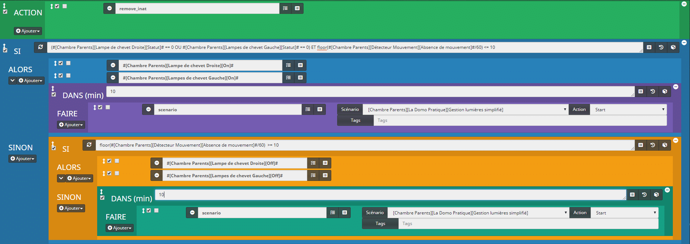
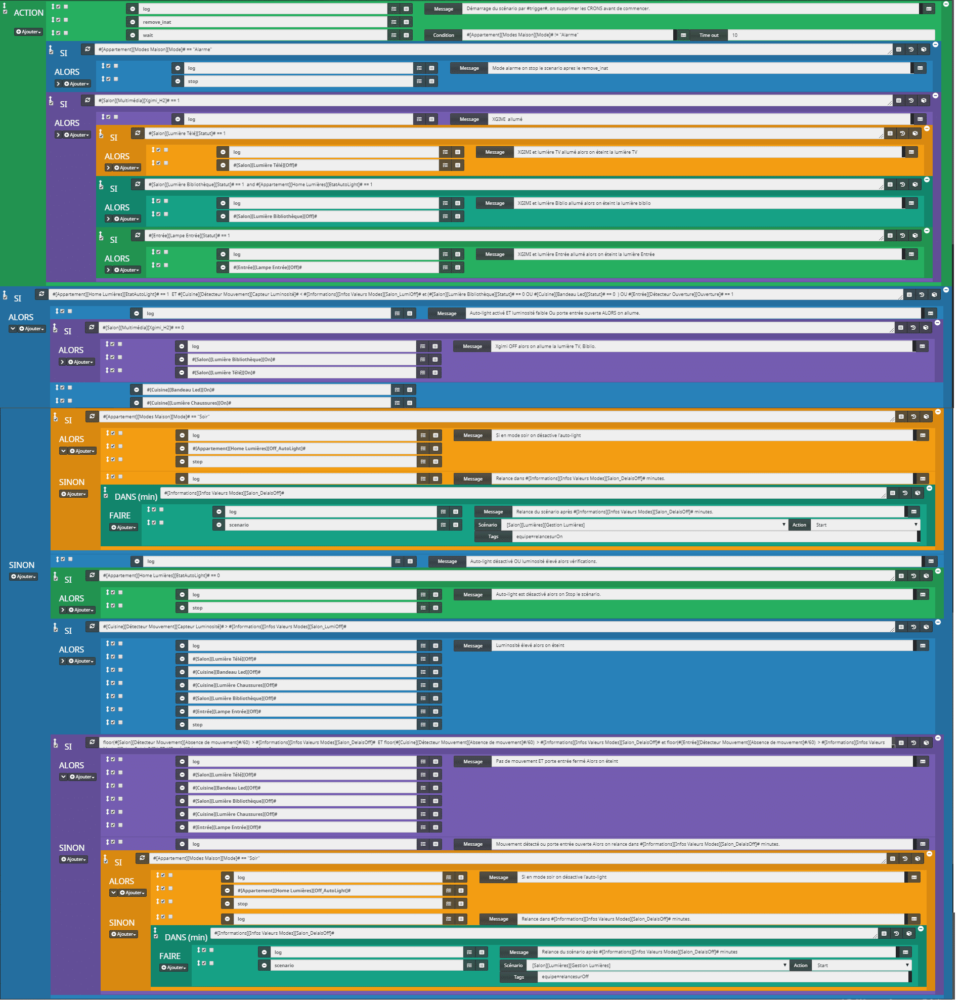
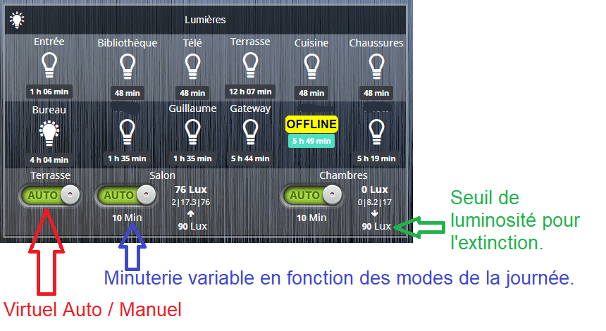

# Gestion des lumières dans Jeedom

Dans ce tutoriel, nous allons voir comment **gérer** simplement **les lumières avec l’allumage automatique** sur la détection de mouvement **puis l’extinction** sur l’absence de présence depuis un temps défini. Le **scénario** est volontairement simple pour qu’il soit **facile à comprendre**. L’exemple est basé sur les lampes de chevet de ma chambre, mais j’utilise le même principe dans mon salon avec, en autre, le niveau de luminosité, l’état d’ouverture des portes ou des volets ou le home cinéma. À la fin, je vous donnerais **quelques exemples** pour rendre le scénario un peu **plus complexe** afin de l’adapter à vos besoins.

-    **Côté Software**, j’utilise les plug-ins :
    -   [Xiaomi Home](https://www.jeedom.com/market/index.php?v=d&p=market&type=plugin&categorie=&&name=xiaomi%20home) (6€).

-   **Côté hardware**, j’utilise :
    -   Lampe de chevet Xiaomi Mijia Bedside Lamp.
    -   Lampe de chevet Yeelight Bedside Lamp Wifi.
    -   Capteurs de mouvement Xiaomi.
    -   Passerelle Zigbee Xiaomi.

Évidemment, le scénario **fonctionne** avec **d’autres appareils** que ceux cités ici.

Retrouvez les produits de **la gamme Xiaomi compatible Jeedom** ici : [Gamme Xiaomi Home Aqara Mijia](/gamme-domotique-xiaomi-home).

Retrouvez les **lampes de chevet Xiaomi Yeelight et Mijia** ici : [Lampes de chevet Yeelight & Mijia](/lampes-de-chevet-yeelight-mijia).

## Création du scénario dans Jeedom

Le scénario sera déclenché lors de la **détection d’un mouvement**. À ce moment-là, on vérifie l’**état des lumières** et la présence d’un **mouvement**. Si les lumières sont éteintes et qu’un mouvement est détecté, **on** les **allume** puis on programme une **minuterie de 10 minutes**. Au bout de ces 10 minutes on **relance la vérification** de l’état des lumières et des mouvements. S’il y a des **mouvements** on repart pour **10 minutes**, s’il n’y en a **pas on éteint**. Voilà le principe de base que nous allons voir dans ce tutoriel.



Gestion des lumières dans Jeedom

-   Aller dans Outils/Scénarios.
-   Cliquer sur Ajouter.
-   Nommer le scénario **« Gestion des lumières ».**
-   Sélectionner un Groupe, Objet parent, une Catégorie et cocher : **«Activer» & «Visible»**.
-   Laisser le Mode de scénario sur **« Provoqué »**.
-   Cliquer sur **« + Déclencher ».**
-   Ajouter la commande d’un détecteur de mouvement et ajouter **« ==1 »** pour limiter le déclenchement seulement lorsqu’il y a un mouvement.
    -   Exemple : **« #\[Chambre Parents\]\[Détecteur Mouvement\]\[Mouvement\]#==1»**
-   Aller dans l’onglet Scénario.
-   Cliquer sur **« Ajouter Bloc ».**
-   Sélectionner **« Action ».**
-   **Enregistrer.**
-   Ajouter une commande action en cliquant sur **« + Ajouter »** et **« Action ».**

```js
Action : remove_inat
```

Ici, on supprime les programmations des blocs **« Dans »** afin de ne pas multiplier les minuteries à chaque déclenchement du scénario.

-   Cliquer sur **« Ajouter Bloc ».**
-   Sélectionner **« Si/Alors/Sinon ».**
-   **Enregistrer.**

```js
SI (#[Chambre Parents][Lampe de chevet Droite][Statut]# == 0 OU #[Chambre Parents][Lampes de chevet Gauche][Statut]# == 0) ET floor(#[Chambre Parents][Détecteur Mouvement][Absence de mouvement]#/60) <= 10 ALORS
```

Ce test permet de **vérifier l’état des lumières et la présence de mouvement**. Ici, l’absence de mouvement est renvoyée en secondes par le plugin Xiaomi. Pour **convertir en minutes** on utilise la fonction PHP **« floor »** et l’on divise par 60.

-   Ajouter 2 commandes Action en cliquant sur **« + Ajouter »** et **« Action »**.

```js
Action : #[Chambre Parents][Lampe de chevet Droite][On]#
```

```js
Action : #[Chambre Parents][Lampe de chevet Gauche][On]#
```

Si une des **lumières est éteinte et qu’un mouvement est détecté** alors on **allume**.

-   Cliquer sur **« + Ajouter »**.
-   Cliquer sur **« Bloc ».**
-   Sélectionner **« Dans ».**
-   **Enregistrer.**

```js
DANS(min) : 10
```

-   Ajouter 1 commande **« Action »** en cliquant sur **« + Ajouter »** et **« Action »** dans la partie **« Faire »**.

```js
Action : scenario
```

```js
Scénario: #[Chambre Parents][Lumières][Gestion Lumières]#
```

```js
Action : Start
```

Là, nous venons de mettre en place **une minuterie qui va relancer le scénario dans 10 minutes**. Le bloc **« Dans »** programme l’action dans 10 minutes. L’action consiste à démarrer le scénario sélectionné.

-   Cliquer sur **« > »** à côté du **« + Ajouter »** pour faire apparaître la partie Sinon.
-   Cliquer sur **« + Ajouter »** de la partie Sinon.
-   Cliquer sur **« Bloc ».**
-   Sélectionner **« Si/Alors/Sinon ».**
-   **Enregistrer.**

```js
SI floor(#[Chambre Parents][Détecteur Mouvement][Absence de mouvement]#/60)> = 10 ALORS
```

Ici, on vérifie l’**absence de mouvement** qui est renvoyé en secondes par le plugin Xiaomi. Pour **convertir en minutes** on utilise la fonction PHP **« floor »** et l’on divise par 60.

-   Ajouter 2 commandes Action en cliquant sur **« + Ajouter »** et **« Action »**.

```js
Action : #[Chambre Parents][Lampe de chevet Droite][Off]#
```

```js
Action : #[Chambre Parents][Lampe de chevet Gauche][Off]#
```

Donc, s’il n’y a **pas de mouvement depuis 10 minutes on éteint** les lumières.

-   Cliquer sur **« > »** à côté du **« + Ajouter »** pour faire apparaître la partie Sinon.
-   Cliquer sur **« + Ajouter »** de la partie Sinon.
-   Cliquer sur **« Bloc ».**
-   Sélectionner **« Dans ».**
-   **Enregistrer.**

```js
DANS(min) : 10
```

-   Ajouter 1 commande « Action » en cliquant sur **« + Ajouter »** et **« Action »** dans la partie **« Faire »**.

```js
Action : scenario
```

```js
Scénario: #[Chambre Parents][Lumières][Gestion Lumières]#
```

```js
Action : Start
```

Dans le cas où il y aurait eu un **mouvement dans les 10 minutes**, on **relance** le scénario **dans 10 minutes**.

Voilà, le **scénario est fonctionnel en l’état**. Dès qu’un mouvement est détecté, le scénario est relancé, la minuterie précédente est supprimée et le scénario teste à nouveau l’état des lumières et les mouvements.

Maintenant si vous voulez **améliorer le scénario** vous pouvez **ajouter des conditions**, je vais maintenant vous proposer **quelques exemples** que vous pourrez adapter selon vos besoins.

### Ajouter un capteur de luminosité

Les capteurs de mouvement Xiaomi Aqara permettent de **mesurer la luminosité** et c’est très pratique dans la gestion de la lumière. Pour prendre en compte cette nouvelle donnée, il faut **ajouter quelques éléments** à notre scénario.

1.  Dans le premier **«Si/Alors/Sinon**» ajoutez en plus des tests d’état des lumières et des mouvements un test de luminosité.

```js
SI (#[Chambre Parents][Lampe de chevet Droite][Statut]# == 0 OU #[Chambre Parents][Lampes de chevet Gauche][Statut]# == 0) ET floor(#[Chambre Parents][Détecteur Mouvement][Absence de mouvement]#/60) <= 10 ET #[Chambre Parents][Détecteur Mouvement][Capteur Luminosité]# < 90 ALORS
```

2.  Dans le **« Sinon »** ajoutez un bloc **Si/Alors/Sinon** et placez-le **avant** celui qui permet de tester l’absence de mouvement.

```js
SI #[Chambre Parents][Détecteur Mouvement][Capteur Luminosité]# > 90 ALORS
```

```js
Action : #[Chambre Parents][Lampe de chevet Droite][Off]#
```

```js
Action : #[Chambre Parents][Lampe de chevet Gauche][Off]#
```

```js
Action : STOP
```

Le fait d’ajouter un bloc spécifique pour la luminosité permet de **ne pas laisser les lumières allumées** en cas de **non-mouvement,** mais avec une **luminosité supérieure au seuil** d’extinction. L’action **« Stop »** permet de ne **pas relancer la minuterie**. _J’ai mis 90 pour le seuil d’extinction, mais à vous de l’adapter à la luminosité de votre pièce._

### Ajouter un bouton pour désactiver le scénario

Il peut être pratique de **désactiver facilement un scénario**, car l’automatisation peut avoir ses limites. Dans le cas où une minuterie soit en cours, il faut qu’elle soit supprimée.

Pour cela j’ai créé un **virtuel** binaire avec une commande **Auto** et une **Manuel**.

Au niveau du scénario, il faut **ajouter la commande État du virtuel** dans les événements déclencheurs. Ensuite, il faut **ajouter un bloc Si/Alors/Sinon après le remove\_init** qui vérifie l’état du virtuel et dans le cas où il est sur Manuel (0) alors on stoppe le scénario.

```js
SI #[Appartement][Home Lumières][Autochambre]# == 0 Alors Stop
```

### Utiliser les Modes dans le scénario

Il peut être utile de **stopper le scénario en fonction des modes de la journée**. (Matin, Journée, Soir, Nuit…) Pour cela, **ajoutez** simplement dans la condition précédente **un test sur les modes**. Par exemple si l’on veut seulement que les lumières s’allument en journée.

```js
SI #[Appartement][Modes Maison][Mode]# != «Journée» Alors Stop
```

Ou si l’on associe les deux.

```js
SI #[Appartement][Home Lumières][Autochambre]# == 0 OU #[Appartement][Modes Maison][Mode]# != «Journée» Alors Stop
```

### Ajouter les heures de lever et de coucher du Soleil

Grâce au **plugin [Weather](https://www.jeedom.com/market/index.php?v=d&p=market&type=plugin&name=weather&categorie=&cost=free)**, vous pouvez récupérer l’heure de lever et de coucher du Soleil afin de **stopper le scénario s’il fait jour**. Pour cela, **ajoutez** ceci au bloc **Si/Alors/Sinon** qui permet de **stopper le scénario**.

```js
#time# <=#[Informations][Lyon][Lever du soleil]# OU #time# >=#[Informations][Lyon][Coucher du soleil]#
```

### Remplacer la commande Absence de mouvement

Si vous **n’utilisez pas le plugin Xiaomi** et que vous n’avez pas de commandes **« Absence de mouvements »**, vous pouvez remplacer la commande.

Remplacer :

```js
floor(#[Chambre Parents][Détecteur Mouvement][Absence de mouvement]#/60) >= 10
```

Par :

```js
floor(lastChangeStateDuration(#[Chambre Parents][Détecteur Mouvement][Mouvement]#,0)/60)
```

### Adapter la durée de la minuterie

Si vous avez suivi le tutoriel **« [Réglage automatique des lumières et des volumes](/articles/reglage-automatique-des-lumieres-et-des-volumes) »**, vous pouvez **ajuster la durée de la minuterie** en remplaçant la valeur des commandes **« Dans »** par la commande**#\[Informations\]\[Infos Valeurs Modes\]\[CH\_DelaisOff\]#**.

Grâce à cela, vous pourrez avoir un **délai réduit** pour la **nuit** puis **plus élevé** le **matin** ou le **soir**.


Gestion des lumières dans Jeedom



Exemple Gestion des lumières du Salon



Exemple de virtuel de Gestion des lumières

Voilà, **j’espère avoir été clair** pour ce tutoriel sur la **gestion des lumières dans Jeedom**. La mise en place est **volontairement simple**, mais n’hésitez pas à l’**adapter à vos besoins** en vous aidant des exemples que je vous ai proposés.

Personnellement, j’utilise ce type de scénario pour **toutes les lumières de mon logement** et ça **fonctionne très bien**. À **l’extérieur**, j’ajoute les heures de coucher du Soleil et le déclenchement sur l’ouverture des portes. Dans **les chambres des enfants**, j’ajoute l’allumage d’une veilleuse toute la nuit à l’inverse des lumières qui sont bloquées la nuit. Dans **le salon**, le scénario est beaucoup plus complexe, car il gère **plusieurs lumières indépendamment les unes des autres** en fonction du home cinéma ou de la télé, des capteurs de luminosité, des mouvements, des portes et encore d’autres conditions qui permettent de rendre la **gestion des lumières** le plus **automatique et personnalisée** possible.

En **exemple**, je vous ai mis une **copie d’écran** de mon **scénario** de **gestion des lumières** dans le **salon** ainsi que mon **virtuel** de **gestion rapide** des lumières. 

_Attention toutefois de **ne pas en faire trop** pour ne pas vous retrouver avec trop de conditions et transformer votre maison en sapin de Noël._
