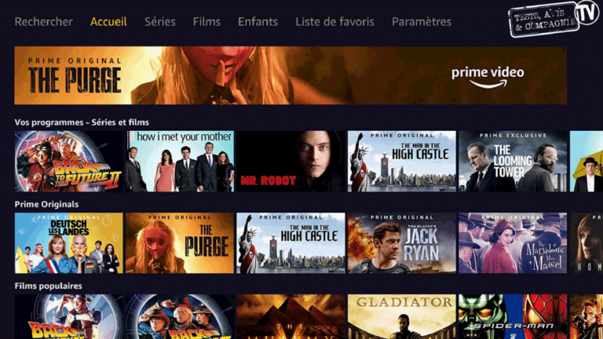
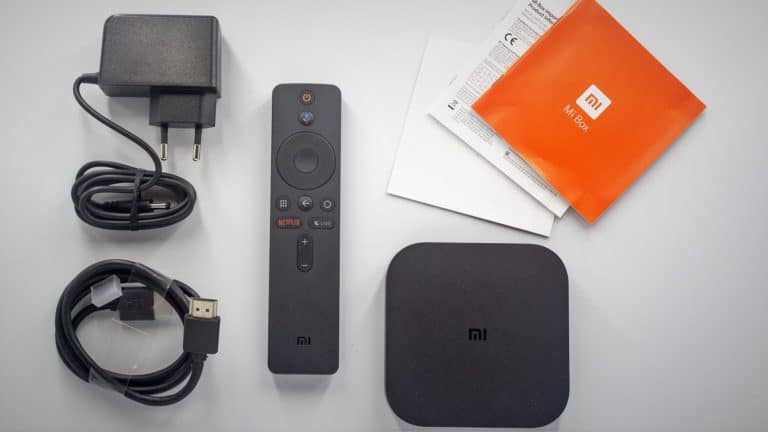

# Installation d’Amazon Prime Vidéo sur Xiaomi Mi-Box TV

> Je vous avais déjà fait un article sur [l’installation d’Amazon Prime Vidéo](/android-oreo-et-amazon-video-sur-mi-box-tv-xiaomi) sur la Mi-box, mais comme certains d’entre vous ont eu des soucis après la mise à jour de la box sous Android Oreo, je vous propose un tuto vidéo expliquant l’installation d’[Amazon Prime Vidéo](https://www.primevideo.com/?tag=guilbraimespa-21) sur une Xiaomi Mi Box TV.
>
> Pour ceux qui ne le savent pas, [Amazon Prime Vidéo](https://www.primevideo.com/?tag=guilbraimespa-21) est une application de streaming vidéo comme NetFlix, mais elle est liée à un abonnement [Amazon prime](https://www.amazon.fr/essayerpremium?tag=guilbraimespa-21). Cet abonnement permet, entre autres, d’être livré gratuitement en 1 jour, d’accéder au catalogue prime music et prime vidéo, pour seulement 49€ par an.
>
> Le hic c’est que l’application [Prime Vidéo](https://www.primevideo.com/?tag=guilbraimespa-21) n’est pas encore disponible sur le Google store d’Android TV, mais seulement pour certaines box comme la [Nvidia Shield](https://amzn.to/2Rj1Ped), ou des télés connectées fonctionnant sous Android TV.
>
> Rassurez-vous il y a une solution.

## [Lisez mon article :](/xiaomi-mi-box-tv)

J'ai testé la Xiaomi Mi-BOX S sous Android TV

## Tutoriel pas à pas pour l’installation d’Amazon Prime Vidéo

L’installation fonctionne aussi bien sur les Mi-Box 3 et Mi-Box S, qu’elles soient sous Android 6 Marshmallow ou Android 8 Oreo. 

Pour vous aider à bien visualiser les **42** étapes de ce tutoriel, vous pouvez suivre la vidéo en parallèle au fur est à mesure de l’avancement. Vous pouvez retrouver la vidéo complète dans la [conclusion du tutoriel](#conclusion).

-   Si vous ne l’avez pas déjà fait, nous allons installer un explorateur de fichier sur la Mi-Box (ES Explorateur de fichier​), pour pouvoir naviguer dans les dossiers comme sur un PC.
-   Dans un second temps nous installerons Aptoide TV qui est un store alternatif au Google Store. Il permet d’installer des applications qui ne sont pas encore disponible pour la Mi box, comme [Amazon Prime Vidéo](https://www.primevideo.com/?tag=guilbraimespa-21).

### Installation de ES Explorateur de fichier

Pour le moment pas de difficultés majeures, on reste sur le pc.

#### Depuis votre ordinateur :

1\. Cliquer sur ce lien pour accéder à ES Explorer sur le Google Store : **[ES EXPLORER](https://play.google.com/store/apps/details?id=com.estrongs.android.pop).**
2\. Cliquer sur « **Installer** ».
3\. Se loguer avec son **compte Google**.
4\. Choisir l’appareil dans la liste : « **MIBOX** ».
5\. Cliquer sur « **Installer** ».
6\. Pour finir cliquer sur **OK**.

7\. Valider les messages et autorisations.

[Vidéo suivante](#téléchargement-daptoidetv)

-   Ouvrir Google Play Store **sur** la **Mi-Box**.
-   Aller sur la loupe en haut à gauche.
    Saisir sur le clavier ou dire : « **ES Explorer** ».
-   Cliquer sur **ES Explorer**.
-   Cliquer sur **Installer**.
-   Attendre la fin du téléchargement et de l’installation.
-   Cliquer sur **Ouvrir**.

### Téléchargement d’AptoideTV

8\. Cliquer sur [ce lien](https://m.aptoide.com/installer-aptoide-tv) pour aller sur le site : **[Aptoide-tv](https://m.aptoide.com/installer-aptoide-tv)**.
9\. Cliquez sur « **Installer Aptoide TV** ».
10\. Un fichier **APK** se télécharge sur votre PC.
11\. Copier ce fichier sur une **clé USB** formatée en **Fat32**.

[Vidéo suivante](#depuis-la-mi-box)

#### Depuis la Mi-Box :

Maintenant **on passe sur la Mi-Box**, normalement Es-explorer est installé sur la Mi-box et vous avez une clé USB avec le fichier APK d’Aptoide-tv.

### Installation d’AptoideTV

12\. **Brancher** la **clé USB** sur la **Mi-Box**.
13\. Es Explorer doit détecter la clé.
14\. Cliquer sur **OK**.
15\. Naviguer jusqu’à la clé USB qui se trouve en haut à droite. **2 fois vers la droite sur la télécommande**.
16\. Cliquer sur **AptoideTV-5.0.2.apk**.
17\. Cliquer sur **Installer**.
18\. Cliquer sur **Paramètres**.
19\. Sélectionner **ES Explorateur de Fichiers** pour lui donner les autorisations nécessaires.
20\. **Recommencer** l’installation en cliquant à nouveau sur **AptoideTV-5.0.2.apk**.
21\. Cliquer à nouveau sur **Installer**.
22\. Et encore une fois sur **Installer**.
23\. Une fois l’installation terminée, cliquer sur **Ouvrir**.
24\. Cliquer sur **OK**.
25\. Valider les autorisations nécessaires.

[Vidéo suivante](#installation-damazon-prime-vidéo)

### Installation d’Amazon Prime Vidéo

26\. Depuis **AptoideTV**, aller sur la loupe en haut à gauche.
27\. Valider les autorisations nécessaires pour l’utilisation du micro.
28\. Taper ou dire « **Amazon Prime vidéo Android TV** ».
29\. Chercher et cliquez sur « **Prime Vidéo – Android TV** ».
30\. Cliquer sur **Installer**.
31\. Attendre la fin du téléchargement et de l’installation.
32\. Cliquer sur **Paramètres**.
33\. Sélectionner **Aptoide TV** pour lui donner les autorisations nécessaires.
34\. Cliquer à nouveau sur **Installer**.
35\. Attendre la fin du téléchargement et de l’installation.
36\. Cliquer à nouveau sur **Installer**.
37\. Cliquer sur **OK**.
38\. Cliquer sur **Ouvrir**.

[Vidéo suivante](#connexion-à-amazon-prime-vidéo)

### Connexion à Amazon Prime Vidéo

39\. Cliquer sur **Continuer**.
40\. Cliquer sur **Identifiez-vous**.
41\. **Loguez-vous** avec vos identifiants [Amazon Prime](https://www.amazon.fr/essayerpremium?tag=guilbraimespa-21).
42\. Cliquer sur **Continuer**.
43\. Profitez de vos films et séries gratuitement sur votre Mi Box TV Xiaomi.

Si vous avez correctement suivi ce tutoriel, [Amazon Prime Vidéo](https://www.primevideo.com/?tag=guilbraimespa-21) doit fonctionner sur votre Mi-Box. Avec cette version, je n’ai eu aucun soucis d’image noire ou de plantage de l’application.

N’oubliez pas que vous pouvez profiter des avantages [Prime Vidéo](https://www.primevideo.com/?tag=guilbraimespa-21) même pendant la **période d’essai de 30 jours** d’[Amazon Prime](https://www.amazon.fr/essayerpremium?tag=guilbraimespa-21).
