# Installation de Jeedom Netinstall sur Raspberry 3

La période d’essai est terminée ! Fini l’installation de Jeedom sous Synology, maintenant je passe à l’installation de Jeedom sur un Raspberry Pi 3 avec les composants Xiaomi.

## Installation de Jeedom Netinstall.

Jeedom Net install s’installe sur une carte MicroSD. Je conseille de prendre une microSD de 16 Go Class 10, mais une carte de 4 Go devrait suffire.
L’installation sur la carte SD se fait de la même manière que l’ancienne version (Non Netinstall). La différence se joue une fois que la carte est dans le RPI, mais l’installation se fait toute seule donc pas d’inquiétude.

### Copie de Jeedom Netinstall sur la carte SD.

[[**Voir le produit sur Amazon**](https://www.amazon.fr/dp/B013UDL5V6?tag=guilbraimespa-21)

#### Récupérer l’image de Jeedom sur l’[Amazon drive de Jeedom](https://www.amazon.fr/clouddrive/share/OwYXPEKiIMdsGhkFeI3eUQ0VcvTEBq0qxQevlXPvPIy/folder/IT3WZ3N0RqGzaLBnBo0qog).

Aller dans « **Images** » et cocher « **Raspberrypi_Debian_jessie_4.4_jeedom_netinstall_20160924_rc1.rar**« , cliquer sur « **Télécharger** » en bas de la page. *Les derniers chiffres étant la version, ils peuvent avoir changé depuis, mais ce qui est important, c’est de prendre l’image « **Raspberrypi\_..**« .*
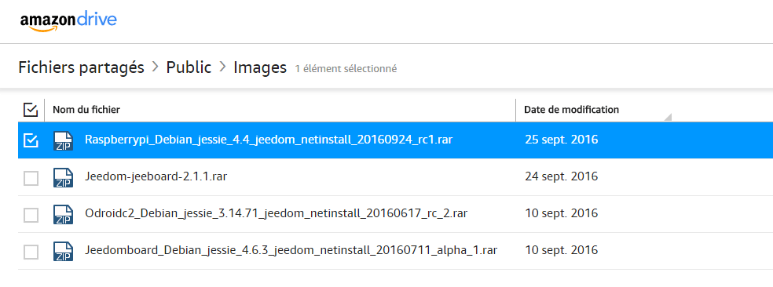
Le téléchargement peut être long en fonction de votre connexion ADSL, car l’image pèse plus de 2 Go. Une fois le téléchargement fini dé-zipper l’image sur votre disque dur.

#### Pour copier l’image sur la carte SD téléchargez [win32diskimager](https://sourceforge.net/projects/win32diskimager/).

Ce logiciel permet de copier une image bootable sur une clé USB ou sur une carte SD. Son utilisation est des plus simples.

1.  Cliquer sur ce lien pour télécharger [win32diskimager](https://sourceforge.net/projects/win32diskimager/). Accepter les messages, puis cliquer sur le bouton vert « **Download**« .
2.  Une fois téléchargé, double-cliquer sur le fichier pour l’installer et l’ouvrir.
3.  Dans « **Image file** » rechercher votre image Jeedom, dé-zippée (**raspberrypi3_Debian_jessie_4.4_jeedom_netinstall_20160924_alpha1.img**)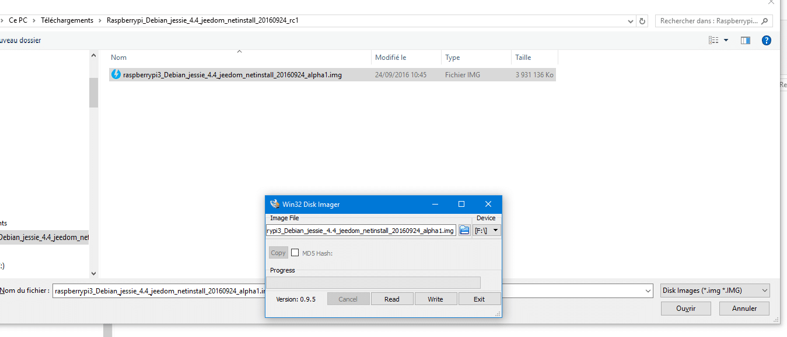
4.  Dans « **Device**« , sélectionner le lecteur de carte SD sur lequel vous voulez installer Jeedom. _**Ne vous trompez par car toutes les données vont être effacées.**_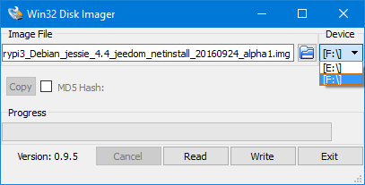
5.  Cliquer sur « **Write**« , un message d’avertissement s’affiche, si vous êtes prêts, cliquez sur « **Yes**« .
6.  A la fin de la copie un message vous préviens, vous avez fini, vous pouvez sortir la carte SD.

[[**Voir le produit sur Amazon**](https://www.amazon.fr/dp/B013UDL5V6?tag=guilbraimespa-21)

### Installation de Jeedom sur Raspberry Pi.

Il n’y a pas grand chose à faire tout est automatique.

1.  Insérer la carte SD dans le slot du RPi.
2.  Brancher un cable réseau RJ45 entre le RPi et votre Modem/Routeur.
3.  Brancher l’alimentation secteur, votre RPI démarre directement.

L’installation se fait tranquillement. Si vous voulez voir les details de l’installation, tapez l’[IP de votre RPi dans un navigateur](#trouver-ladresse-ip-de-votre-raspberry-pi-sur-freebox-revolution).

[[**Voir le produit sur Amazon**](https://www.amazon.fr/dp/B01CD5VC92?tag=guilbraimespa-21)

Pour les curieux, si vous branchez le RPi sur un écran, vous avez ça :
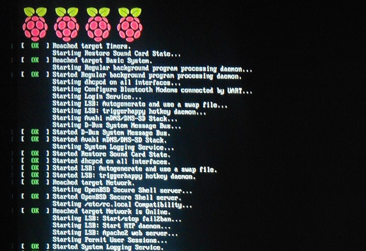

#### Trouver L’adresse IP de votre Raspberry Pi sur Freebox Revolution.

1.  Aller sur Freebox OS depuis :  [http://mafreebox.freebox.fr](http://mafreebox.freebox.fr/).
2.  Entrer votre mot de passe. _Si c’est votre premiere utilisation cliquer sur « **Premiere connexion** » ou si vous ne vous souvenez pas du mot de passe cliquer sur « **J’ai perdu mon mot de passe**« ._
3.  Aller dans « **Périphériques réseau** » (double-cliquer) et chercher « **Jeedom**« .
4.  Faire un clique droit et « **Propriétés** » puis aller dans « **Connectivité**« .
5.  Chercher la ligne « **Joignable / Actif** » et noter l’adresse IP de la colonne adresse. Ici : **192.168.1.33**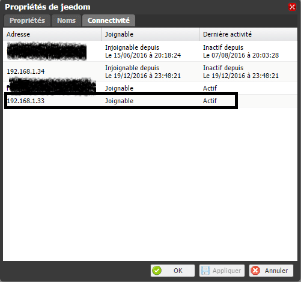

#### Accéder à Jeedom et se connecter.

1.  Saisir l’IP dans un navigateur. 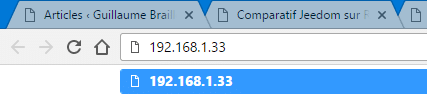
2.  Pendant l’installation des lignes de commandes défilent, laisser faire. 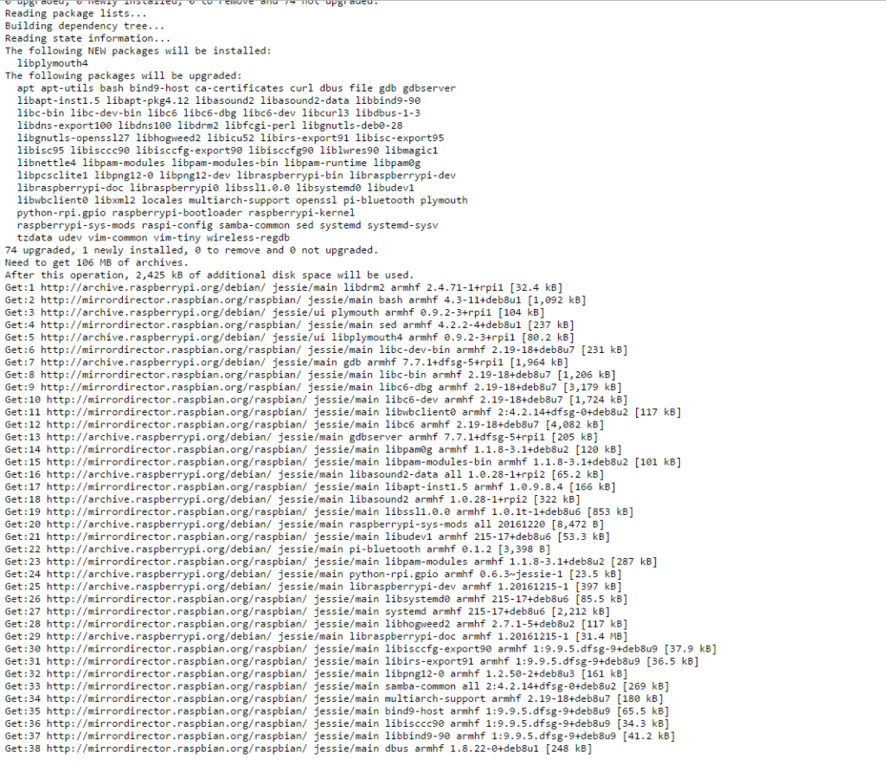
3.  Dés que vous avez le masque d’accueil , saisir l’identifiant et mot le passe « **Admin** » et « **Admin** » et cliquer sur « **Connexion**« .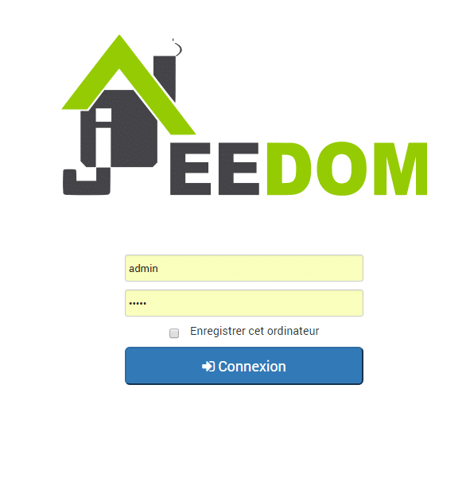
4.  Vous voilà dans Jeedom, je vous conseille de changer le mot de passe Admin, en cliquant sur les roues dentés et « **Utilisateurs**« .

## Connexion au Market de Jeedom

Il reste une dernière chose à faire avant de pouvoir utiliser Jeedom, il faut relier Jeedom à son compte Market.

1.  Créer un compte à cette adresse : [https://www.jeedom.com/market](https://www.jeedom.com/market) et retournez sur Jeedom.
2.  Aller dans la »**Roue dentée**« , « **Configuration**« , « **Mises à jour et fichiers** » et saisissez votre « **Identifiant et mot de passe**« . « **Sauvegarder**« .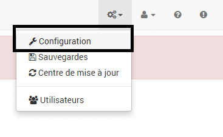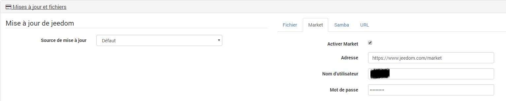

## Correction du message d’erreur passerelle distante injoignable.

Dés le démarrage de Jeedom je vois qu’il y a un message représenté par l’icone :
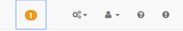
C’est un message d’erreur : **_« La passerelle distante de l’interface Iface est injoignable, je la redemarre pour essayer de corriger »_** apparemment associé au plugin « **Network** » mais je n’ai encore pas installé de plugin. C’est pour indiquer que le problème est lié au réseau et non au plugin « Network ».
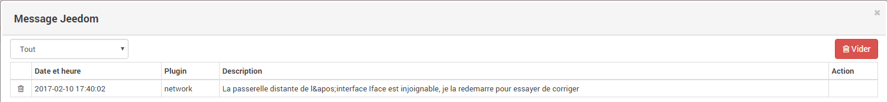
Pour résoudre ce problème il faut se connecter en **SSH** sur Jeedom et modifier le fichier « **Hosts**« 

### Connexion en SSH sous Jeedom

Pour faire simple le SSH c’est une connexion en ligne de commande linux. Pour se connecter il faut utiliser un client SSH par exemple **Putty**. Personnellement j’utilise  « **WinSCP** » qui est un client SFTP graphique pour Windows. Il utilise SSH et est open source.
Il permet surtout d’avoir un environnement graphique pour parcourir les fichiers et Putty est inclut dans le logiciel.

1.  **Télécharger, installer, ouvrir WinSCP** : [https://winscp.net/eng/download.php](https://winscp.net/eng/download.php)
2.  **Protocole de fichier** : SFTP
3.  **Nom** **d’hôte** : Ip de Jeedom
4.  **Numéro de port** : 22
5.  **Nom d’utilisateur** : root
6.  **Mot de passe** : Mjeedom96
7.  **Connexion** : Cliquez sur « Connexion » ou sauver la config pour ne pas avoir à le ressaisir.

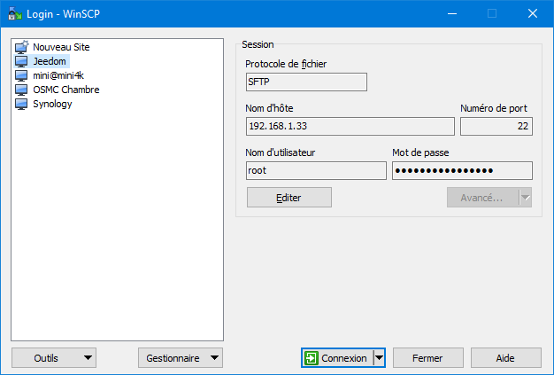

### Modifier le fichier « Hosts »

_**Pour info :** Si vous voulez accéder à Putty cliquer sur l’icone dans la barre de tache mais nous n’en aurons pas besoin pour cette fois ci._
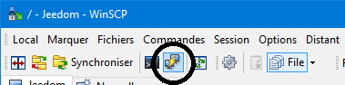
Une fois connecté vous avez un explorateur de fichier.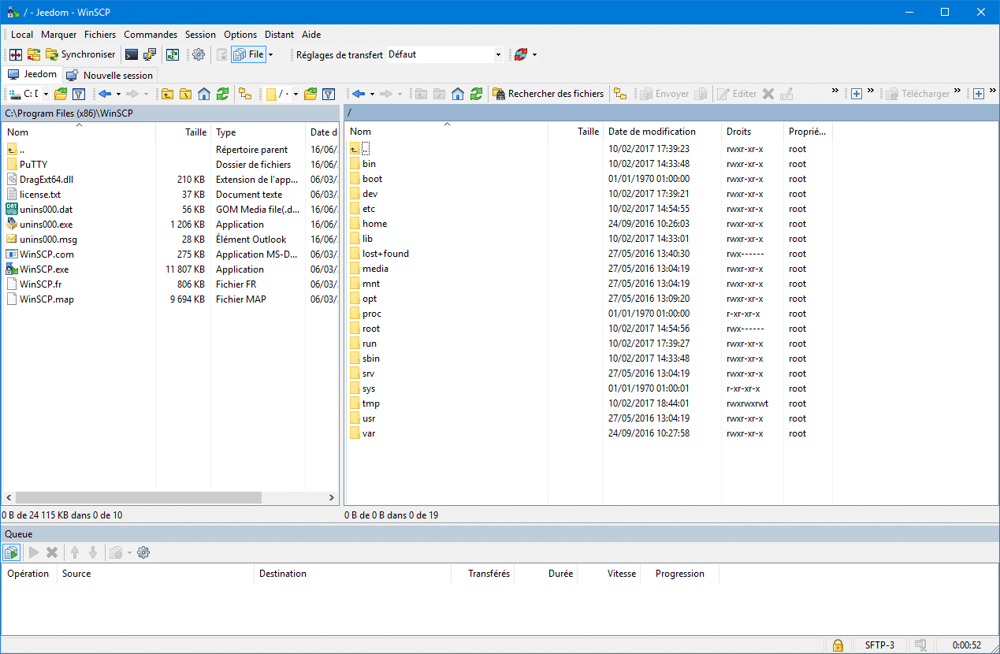
Dans la partie droite c’est Jeedom, allez dans « ***etc*** » et cliquez sur le fichier « ***hosts***« , il y a un éditeur de texte intégré qui permet de facilement faire des modifications , sans ligne de code.
Changer la ligne ***127.0.0.1 localhost*** par _**127.0.0.1 jeedom**_.
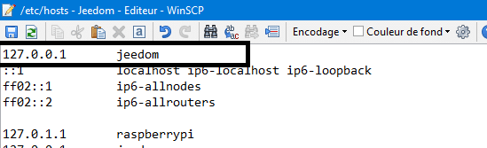
Il faut maintenant supprimer le message sur le dashboard de Jeedom car meme si vous l’avez supprimé plus tôt il a du réapparaître. Cliquez sur « **Vider**« .
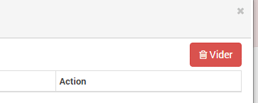
Redémarrer Jeedom depuis le bouton « **Redémarrer** » du dashboard et non en débranchant le Rpi électriquement car vous risquez de corrompre la carte SD.
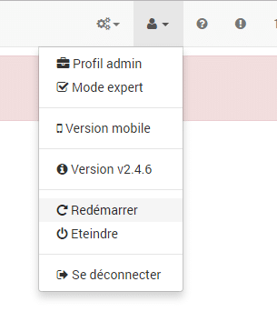

## Conclusion.

L’installation est vraiment à la portée de tout le monde, même si vous n’avez pas de connaissances en informatique. Il faudra tout de meme mettre les doigts dans le cambouis si il y a des messages d’erreur. Meme sur une image propre.
Il faut juste :

1.  Un Raspberry Pi 3.
2.  Une carte MicroSD de 16 Go, vous pouvez prendre 4 Go, mais à ce prix là, c’est dommage de s’en priver.
3.  L’image de [Jeedom Netinstall](#recuperer-limage-de-jeedom-sur-lamazon-drive-de-jeedom).
4.  Le logiciel  [WIN32DISKIMAGER](#pour-copier-limage-sur-la-carte-sd-telechargez-win32diskimager)
