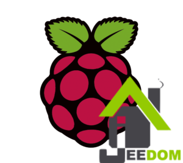
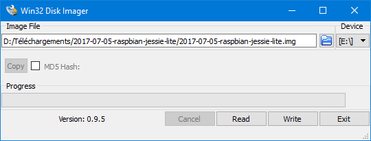
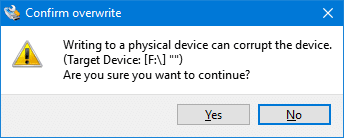
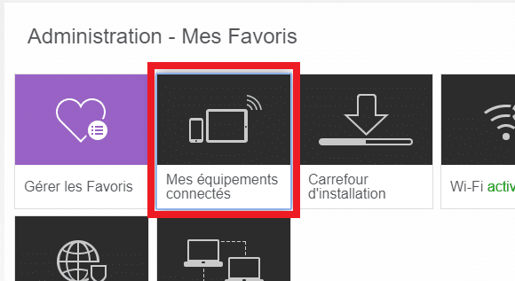
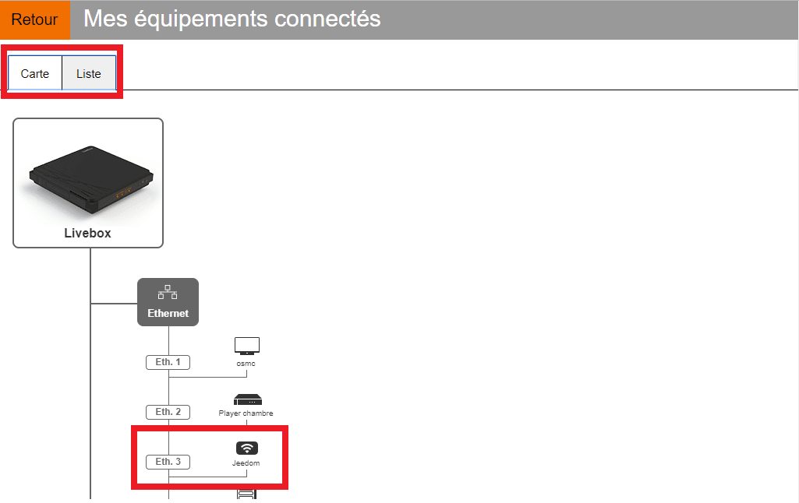
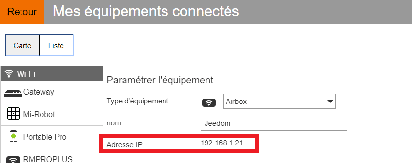

# Installation de Raspbian et Jeedom sur Raspberry

> Vous avez été très nombreux à lire l’article [Jeedom – Installation de Jeedom sur Raspberry 3](/articles/installation-de-jeedom-netinstall-sur-raspberry-3) [Netinstall](/articles/installation-de-jeedom-netinstall-sur-raspberry-3) et je vous en remercie.
> Aujourd’hui, on va passer un cran au dessus, car depuis le passage de **Jeedom en V3**, les fichiers **Netinstall** utiles à **l’installation** de **Jeedom** sur [**Raspberry**](http://amzn.to/2eEGYAO) ne sont plus disponibles. Du coup, si vous n’avez pas une vieille copie sous la main, il ne vous reste plus qu’a passer du coté obscure de Linux et d’installer la **version** destinée au [**Raspberry**](http://amzn.to/2eEGYAO) : **Raspbian**.
> Ne partez pas !!!
> Si vous avez réussi à installer Jeedom [Netinstall](/articles/installation-de-jeedom-netinstall-sur-raspberry-3) les doigts dans le nez, vous devriez arriver à installer **Jeedom** sur **Raspbian** les doigts… sur le clavier, car même s’il y a quelques **manipulations** **supplémentaires** à effectuer,  mon article décrit **pas à pas** chacunes de **étapes** nécessaires.
> C’est parti !

## Installation de Raspbian

**Raspbian** s’installe sur une carte **MicroSD**. Je conseille de prendre une [microSD de 16 Go Class 10](https://www.amazon.fr/gp/aw/d/B013UDL5V6?&tag=guilbraimespa-21), mais une carte de 8 Go devrait suffire.
**L’installation** sur la [carte SD](https://www.amazon.fr/gp/aw/d/B013UDL5V6?&tag=guilbraimespa-21) se fait de la même manière que **[Netinstall](/articles/installation-de-jeedom-netinstall-sur-raspberry-3)**. La différence, c’est qu’il n’y a **pas** **Jeedom** **d’installé.** Il faudra donc le faire dans un **second** **temps**.

### Récupérer l’image de Raspbian

Avant de commencer, il faut **récupérer** l’image de **Raspbian** disponible sur [Raspberrypi.org](https://www.raspberrypi.org/downloads/raspbian/).
Deux versions sont disponibles :

- RASPBIAN WITH DESKTOP
- **RASPBIAN LITE**.

C’est cette dernière qui nous intéresse, car elle est plus **légère** et ne propose pas d’environnement graphique et c’est tant mieux, car on n’en a pas besoin pour **installer** **Jeedom**.
**ATTENTION** : Aujourd’hui (Août 2017) la dernière version disponible est **RASPBIAN STRETCH LITE,** sauf qu’elle n’est **pas** encore **compatible** avec **Jeedom !!!**
Il **faut** donc **prendre** : [Raspbian Jessie Lite](http://downloads.raspberrypi.org/raspbian/images/raspbian-2017-07-05/). ([Zip](http://downloads.raspberrypi.org/raspbian/images/raspbian-2017-07-05/2017-07-05-raspbian-jessie.zip) ou [Torrent](http://downloads.raspberrypi.org/raspbian/images/raspbian-2017-07-05/2017-07-05-raspbian-jessie.zip.torrent))
_**EDIT de septembre 2017 : Strecht est maintenant la distribution officiellement supportée pour la version 3.1.5 de jeedom (mais jessie reste parfaitement fonctionnelle).**_
Le **téléchargement** peut être **long** en fonction de votre connexion ADSL, car l’image pèse environ **1.5 Go**. Une fois le téléchargement terminé, **dé-zipper l’image** sur votre disque dur.

### Installer l’image de Raspbian

Pour installer **Raspbian,** il va falloir un **logiciel** qui permet de copier une image **bootable** sur une clé USB, ou sur une **carte SD**. Pour cela on va utiliser [win32diskimager](https://sourceforge.net/projects/win32diskimager/), son **utilisation** est des plus **simples**.

1.  Cliquer sur ce lien :  [win32diskimager](https://sourceforge.net/projects/win32diskimager/).
2.  **Accepter** les **messages**, puis cliquer sur le bouton vert « **Download**« .
3.  Une fois **téléchargé**, double-cliquer sur le fichier pour **l’installer** et **l’ouvrir**.
4.  Dans « **Image file** » rechercher votre image **Raspbian**, préalablement dé-zippée sur votre disque dur. (**2017-07-05-raspbian-jessie-lite.img**)
5.  Dans « **Device**« , sélectionner le lecteur de **carte SD** sur lequel vous voulez installer Jeedom.
    **ATTENTION !** ***Ne vous trompez par de lecteur car toutes les données vont être effacées.***
6.  Cliquer sur « **Write**« , un message d’avertissement s’affiche, si vous êtes prêts, cliquez sur « **Yes**« .
7.  A la fin de la copie, un **message** vous prévient que l’installation est **finie**.

[[**Voir le produit sur Amazon**](https://www.amazon.fr/dp/B01CD5VC92?tag=guilbraimespa-21)

## Configuration de Raspbian

Une fois l’installation terminée, vous pourriez insérer la carte SD dans votre [**Raspberry**](http://amzn.to/2eEGYAO) Pi et vous auriez alors une version de **Debian** (Linux) optimisée pour [**Raspberry**](http://amzn.to/2eEGYAO) **Pi.** Mais nous, nous voulons **installer** **Jeedom** et pour cela, nous allons faire quelques **manipulations** **supplémentaires**.

### Activer le SSH

Le **SSH** permet de se **connecter** à votre **Raspberry Pi** depuis un autre **ordinateur**. Je vous ai déjà parlé du SSH dans l’article [Installation de Jeedom Netinstall sur Raspberry 3.](/articles/installation-de-jeedom-netinstall-sur-raspberry-3#Connexion_en_SSH_sous_Jeedom)
Vous pouvez vous **passez du SSH** en branchant un **écran** et un **clavier** sur le [**Raspberry**](http://amzn.to/2eEGYAO) .
Pour des raisons de **sécurité**, le **SSH** est **désactivé**. Il faut donc **l’activer** et pour cela, il suffit de **créer** un **fichier** vide appelé **SSH** à la **racine** de la **carte SD**.
**Attention !!!** il ne doit **pas** y avoir **d’extension** à ce **fichier**.

### Démarrer Raspbian

Vous n’avez rien a faire de particulier pour **démarrer** **Raspbian** sur votre Raspberry Pi, si ce n’est de **mettre** la **carte SD** dans le [**Raspberry**](http://amzn.to/2eEGYAO) Pi, de **brancher** un **câble** réseau ainsi que la **prise** de courant. 🙂

### Trouver l’adresse IP de votre Raspberry Pi sur Livebox.

Avant j’étais chez **free**, donc si vous cherchez **l’IP** avec une Freebox Revolution (V6) c’est par [la](/articles/installation-de-jeedom-netinstall-sur-raspberry-3#Trouver_Ladresse_IP_de_votre_Raspberry_Pi_sur_Freebox_Revolution).
Sur **Livebox** il faut :

- Aller sur [http://livebox/](http://livebox/)
- S’authentifier avec **l’identifiant** et le **mot de passe** administrateur Livebox.
- Aller dans « **Mes équipements connectés**« .
- Chercher votre **Raspberry Pi** dans l’onglet « **Carte** » ou « **Liste** » et **l’ouvrir**. **Jeedom** dans la **copie d’écran**, le **vôtre** peut avoir un nom **diffèrent**.
- **Copier** l’adresse **IP**.

  

### Connexion en SSH

Comme nous avons [autorisé le SSH](#activer-le-ssh), on peut maintenant se **connecter.** Mais pour cela il faut **installer** un **client** sur votre **ordinateur**, comme par exemple **Putty** ou **WinSCP.**
Dans l’article [Installation de Jeedom Netinstall sur Raspberry 3](/articles/installation-de-jeedom-netinstall-sur-raspberry-3#Connexion_en_SSH_sous_Jeedom) on avait utilisé **WinSCP**, alors pour changer un peu, on va utiliser **Putty** qui est téléchargeable gratuitement ici : [Putty](https://www.chiark.greenend.org.uk/~sgtatham/putty/latest.html).
Si vous avez WinSCP, il est **conseillé** d’utiliser **Putty** pour les 2 prochains exemples, car il y a certaines **restrictions** avec la console de commande fournie avec **WinSCP**.

- Installer et ouvrir **Putty**.
- Saisir l’adresse **IP** du **Raspberry Pi**.
- Sélectionner **SSH** et port **22**.
- Cliquer sur « **Open**« .

- Une fenêtre **noire** va s’ouvrir avec écrit « **login as:**« , vous êtes **connecté** en **SSH**, il ne reste plus qu’a **s’authentifier**.

### Donner les droits Root en SSH

Sous **Linux** l’utilisateur **Root** c’est l’équivalent de **l’administrateur** sous Windows.
Pour **simplifier** les choses et se **rapprocher** de la configuration de la **Netinstall**, on va se **connecter** en tant que **Root**. Le seul hic ! c’est qu’en **SSH**, ce n’est **pas autorisé** et que là, on est justement en SSH ! Donc, comment faire ???

- On se **logue** avec l’utilisateur : **pi**.
- Le **mot de passe** : **raspberry**.
- **Taper** : `sudo nano /etc/ssh/sshd_config`
- **Chercher**, à l’aide des **flèches**, la ligne : `PermitRootLogin without-password`
- **Changer** la **ligne** en : `PermitRootLogin yes`
- **Fermer** (ctrl + X).
- **Sauvegarder** (Y) et **Valider**
- **Taper** : `sudo /etc/init.d/ssh restart`

- _Taper : `passwd`_
- _Saisir le mot de passe de votre choix, 2 fois._

### Changer le mot de passe root

Niveau passoire et sécurité, on est pas mal !!! Du coup, on va **créer** (changer) le **mot de passe Root**, on reste dans **Putty**.

- **Taper** : `sudo passwd root`
- **Saisir** le **mot de passe** de votre choix, **2 fois**.
- **Taper** : `Exit`
- Relancer **Putty**.
- On se **logue** maintenant avec l’utilisateur : **Root**.
- Le **mot de passe** : Celui que vous venez de taper 2 fois 🙂

### Mise à jour de Raspbian

Cette **étape** est **facultative**, car **Jeedom** va le faire lors de **l’installation**. Mais si vous voulez faire les **mises à jour manuellement**, il faut :

- **Taper** : `apt-get update && apt-get -y dist-upgrade && apt-get -y upgrade`
- **Patienter**…
- C’est prêt !

**_Edit du 13/11/2017 : Vous pouvez aussi mettre à jour le firmware du RaspberryPi._**

- **Taper :** `apt-get install rpi-update`
- **Taper :** `rpi-update`
- **Taper :** `reboot`

_Plus d’info sur la mise a jour du firmware : [https://github.com/Hexxeh/rpi-update](https://github.com/Hexxeh/rpi-update)_

## Installation de Jeedom.

Pour **installer** Jeedom, il va falloir **télécharger** les fichiers d’installation et **lancer** l’installation. Tout ça en ligne de commande !
Ready ?
(Pour rappel on est **toujours** dans **Putty** connecté avec l’utilisateur **Root**.)

- **Taper** : `wget https://raw.githubusercontent.com/jeedom/core/stable/install/install.sh`
- **Valider**. (Entrer)
- **Taper** : `chmod +x install.sh`
- **Valider**. (Entrer)
- **Taper** : `./install.sh`
- L’installation est **finie** lorsque vous avez le **message** suivant :
  - `step_11_jeedom_check success``/!\ IMPORTANT /!\ Root MySql password is abcdef0123456``Installation completed, a system reboot should be performed`
- Pour **rebooter** taper : **`Reboot`**.
- Vous pouvez **fermer** **Putty**.

C’est **compliqué ?** non, et en plus, c’est dans la [doc officielle.](https://jeedom.github.io/documentation/installation/fr_FR/#_autre_diy) 🙂
Cependant, sachez que **l’installation** peut **prendre** du **temps** en fonction de votre connexion internet.
Alors, c’est pas si compliqué que ça linux !
Pour vous **connecter** à **Jeedom,** il suffit de saisir l’adresse **IP** du Raspberry Pi dans un **navigateur** Web et de vous **connectez** avec l’utilisateur « **Admin** » et le mot de passe « **Admin**« .
[[**Voir le produit sur Amazon**](https://www.amazon.fr/dp/B01CD5VC92?tag=guilbraimespa-21)

## Configuration de Jeedom

Maintenant que vous avez une **installation** toute **fraîche** de **Jeedom,** il ne reste plus qu’a le **configurer**. Dans un premier temps, on va **activer** le **mode** **expert** et donner un **nom** à **Jeedom**.

- ~Cliquer sur le **petit bonhomme** en haut à droite et cocher « **Mode Expert**« .~ *Supprimer dans Jeedom 3.1.*
- Cliquer sur Roue crantée / Configuration / Configuration générale, **saisir** un **nom** dans : « Nom de votre Jeedom » et **sauvegarder** en bas à gauche.
- Pensez à mettre votre adresse **IP** en **fixe** dans votre **routeur,** pour ne pas que l’adresse IP change lors d’une reconnexion.

### Changer le mot de passe Administrateur

Je vous conseille de **changer** le **mot de passe Admin,** car pour le moment, tout le monde peut se connecter avec les **identifiants** et mot de passe par **défaut**.

- Cliquer sur les **roues dentés** et aller dans « **Utilisateurs**« .
- Dans la zone « **Action**« , cliquer sur « **Changer le mot de passe**« .
- **Attention !!!** il n’y a **pas** de **confirmation** lors de la saisie, par contre le **mot de passe** est **visible**.
- Vous pouvez aussi créer un **nouvel** **utilisateur** et **désactiver** l’utilisateur « **Admin**« . (Fortement conseillé.)

### Configuration Réseau

Certains plugins ont besoin que la **configuration** **réseau** soit bien **paramétrée**

- **Aller dans** : Roue crantée / Configuration / Configuration réseaux.
- **Saisir** l’adresse **IP** ou l’Url **local** de votre Raspberry Pi dans : « **Accès interne**« . Exemple : 192.168.1.1
- **Saisir** le **port** HTTP qui est par défaut **80**.
- **Saisir** l’adresse **IP** ou l’Url **extérieur** de votre Raspberry Pi dans : « **Accès externe**« . Exemple : 84.125.126.24
- **Saisir** le **port** HTTP qui est par défaut **80**.

### Changer le port d’accès à Jeedom

Comme c’est écris dans la **configuration** **réseau,** ces **informations** n’ont aucun impact sur les **ports** ou **l’IP** utilisés pour joindre Jeedom.
Par défaut le **port** http est **80**, si vous voulez le **changer**, par exemple en **8080**, il va falloir le faire en **SSH**.

- Taper : `sudo nano /etc/apache2/ports.conf`
- **Chercher**, à l’aide des **flèches**, la ligne : `Listen 80`
- **Changer** la **ligne** en :
  - `#Listen 80`
  - `Listen 8080`
- **Fermer** (ctrl + X).
- **Sauvegarder** (Y) et **Valider**
- **Taper** : `sudo /etc/init.d/apache2 restart`

**Pour info:** Là, on a **ouvert** le **fichier** de configuration « `ports.conf`« , on a **interdit** le port **80** grâce au # et on a **autorisé** le port **8080**, on a **enregistré** notre **fichier** avant de **relancer** le **service** web (apache) pour que la nouvelle **configuration** soit **prise** **en compte**.
Par contre, si vous n’êtes **pas à l’aise** avec les **lignes de commandes** via **Putty,** vous pouvez toujours faire la **modification** à l’aide de **WinSCP,** comme nous l’avons vu dans l’article [Installation de Jeedom Netinstall sur Raspberry 3](/articles/installation-de-jeedom-netinstall-sur-raspberry-3#Connexion_en_SSH_sous_Jeedom).

### Trop grand nombre de systèmes Jeedom déclaré

Si vous avez fait **plusieurs** installations de **Jeedom** (>2) vous pouvez, lors de la **connexion** au **market**, avoir ce **message** :

**Code : 0**
**Message : Vous avez un trop grand nombre de systèmes jeedom déclaré, veuillez en réduire le nombre en allant sur votre page profils du market et en supprimant des jeedoms, n’oubliez pas de sauvegarder**

- **Aller dans** : Roue crantée / Configuration / Mises à jour et fichiers / Market.
- **Saisir** les **identifiants** et **mot de passe** du market.
- Cliquer sur « **Tester**« .
- Si vous avez le **message** aller sur : [https://www.jeedom.com/market/](https://www.jeedom.com/market/)
- Se **connecter** avec les mêmes **identifiants**.
- **Aller** **dans** : Services / Mes Jeedoms.
- **Supprimer** les **Jeedoms** inutiles.
- **Retourner** sur Jeedom et **Sauvegarder**.

## Conclusion

Voila une **technique** **supplémentaire** pour installer Jeedom. Certes elle est **moins simple** que l’installation via **Netinstall,** mais au fond, pas si compliquée qu’elle n’y paraît.
Si vous regardez bien, il y a **juste** quelques **étapes supplémentaires**.

- [**Activer** le SSH.](#activer-le-ssh)
- [**Configurer** le Root](#donner-les-droits-root-en-ssh).
- **Saisir** les [3 lignes de commandes](#installation-de-jeedom) de la **doc** de **Jeedom.**

Toute la partie [configuration de Jeedom](#configuration-de-jeedom) est **applicable** à tous les types **d’installation** de **Jeedom,** y compris le Netinstall.
Si ce n’est pas déjà fait, pensez à **lire** l’article [Jeedom – Installation de Jeedom Netinstall sur Raspberry 3](/articles/installation-de-jeedom-netinstall-sur-raspberry-3), vous y trouverez quelques **informations** **complémentaires** pouvant vous servir pour **configurer** Jeedom.
Matériel nécessaire :

- **Raspberry** Pi 3 : [38 €](http://amzn.to/2vZBBie).
- **Carte** micro-**SD** 16 Go : [9 €.](http://amzn.to/2x5U6GO)
- **Boitier** pour Raspberry Pi 3 : [5€.](http://amzn.to/2eEPu2J)
- **Alimentation** pour Raspberry Pi 3 : [10 €.](http://amzn.to/2x5pVzv)
- On arrive à un **total** de **62** €, il y a aussi des **kit** **starter** à [55 €,](http://amzn.to/2ez2S4I) je ne peux pas vous assurer de la **qualité** de **l’alimentation** et de la **carte** **µSD**.
