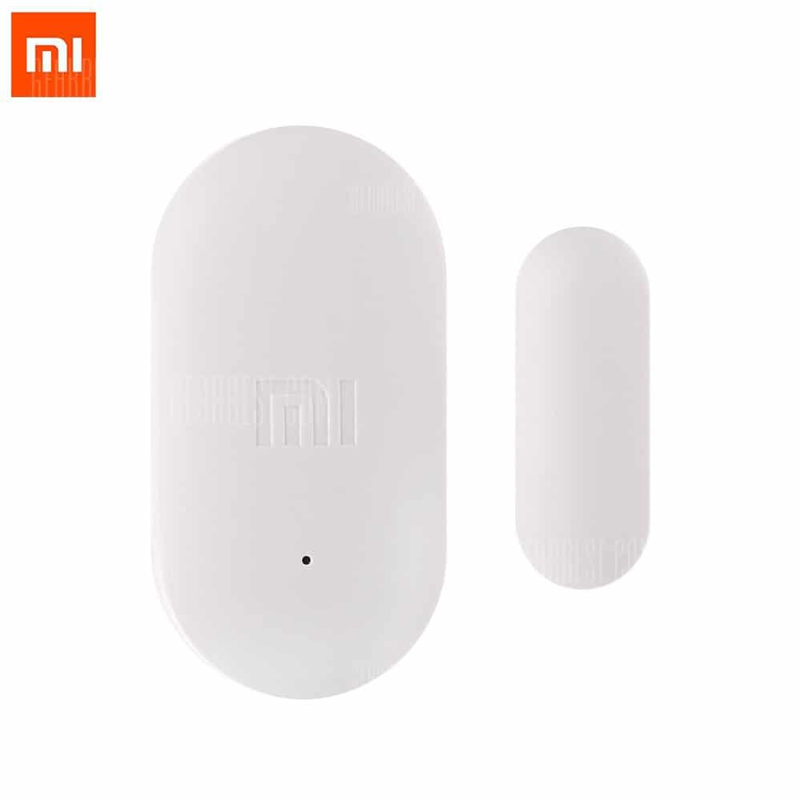
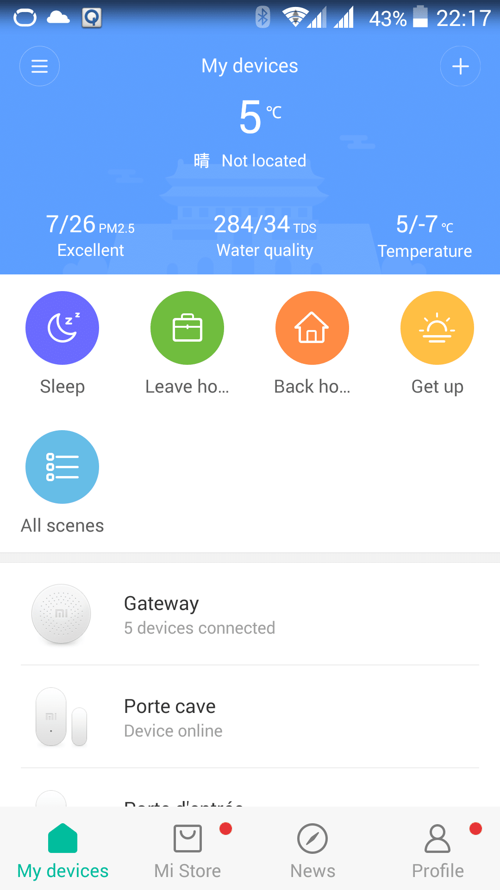
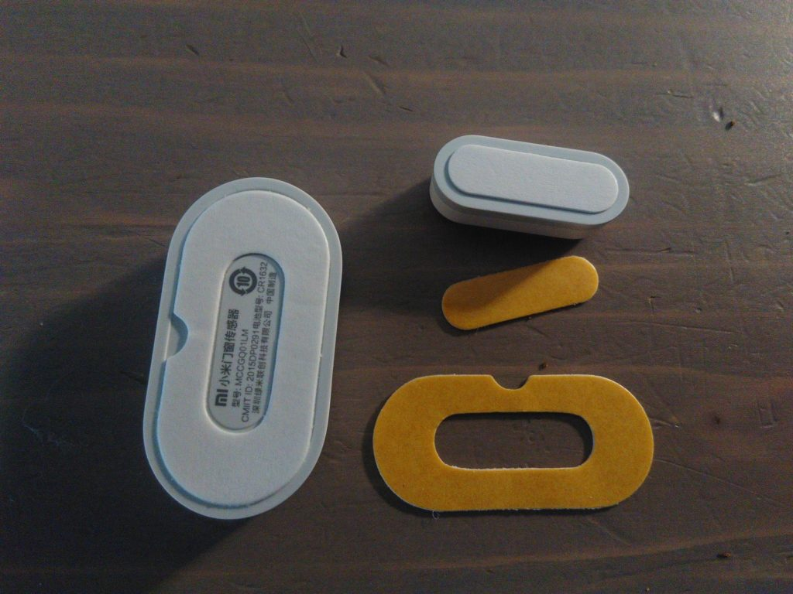
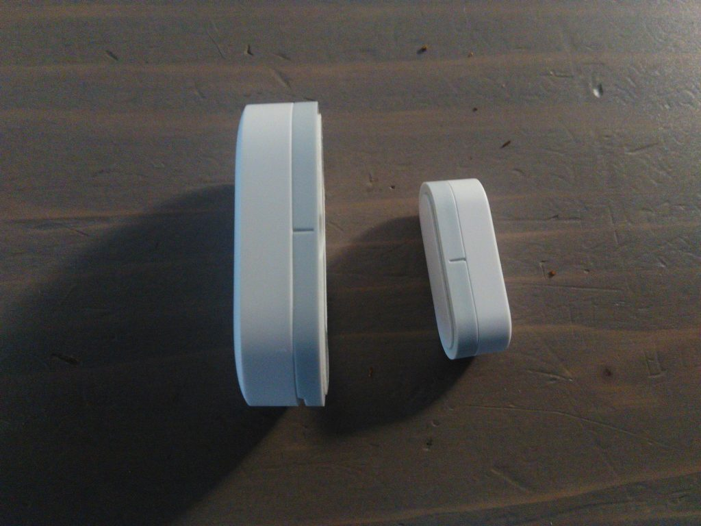
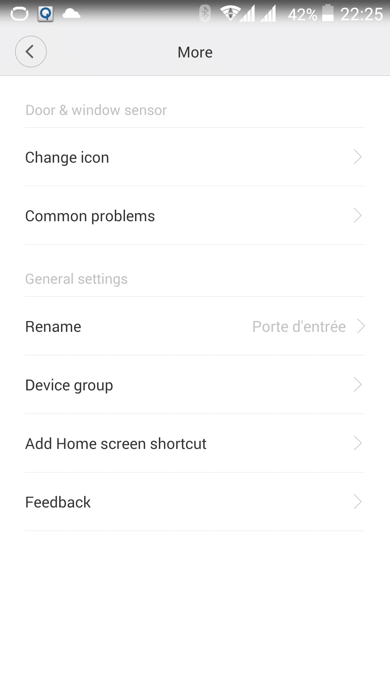

# Installation et configuration du détecteur d’ouverture de porte Xiaomi

Suite de mes articles :

[J’ai passé commande sur un site chinois ! – Gearbest –](/jai-passe-commande-sur-un-site-chinois-gearbest)

[Installation et configuration du Gateway – Xiaomi Smart Home –](/articles/installation-et-configuration-de-la-gateway-xiaomi)

## Installation du détecteur d’ouverture de porte.

Le capteur d’ouverture de porte ainsi que tous les autres composants qui sont vendu dans le kit 5 in 1 Xiaomi sont déjà associés, mais il faut associer les composants supplémentaires.

### Comment associer un composant au Gateway ?

_Le wifi du smartphone doit être allumé._

- Ouvrir l’application Mi-home, cliquer sur « **gateway** » et aller dans « **Device**« .
- Cliquer « **Add subdevice** » puis sur le composant que vous voulez ajouter. Dans mon cas « **Door and Window Sensor**« . Le gateway doit vous parlez en chinois.
- Appuyer 3 secondes, à l’aide d’une aiguille par exemple, sur le bouton qui se trouve dans le petit trou sur un des côtés du composant, la led bleue doit clignoter rapidement.
- Une fois le composant associé, il vous ait demandé de le nommer, de choisir son emplacement et son type.
  **Attention !** Renommer le composant après avoir sélectionné l’emplacement et le type, car un nom  est automatiquement donné lors de la sélection. Cliquez sur « **Next**« .
- Votre composant est maintenant associé, une aide à l’installation est affichée.

> « Traduction de l’aide à l’installation : Appuyez sur le bouton avant d’installer le composant. Si le gateway vous indique « **Connecté**« , la position est bonne. Sinon, déplacez le composant plus près du gateway et appuyez une nouvelle fois sur le bouton. »

Menu principal My Device

### Placement du détecteur d’ouverture de porte.

J’ai décidé d’installer le détecteur d’ouverture sur la porte d’entrée de ma maison. Au dos des éléments il y a un adhésif car il suffit de les coller. Un lot d’adhésif supplémentaire est même fourni.

Adhésif au dos des capteurs.

Les capteurs ont un sens d’utilisation repéré par des petits traits sur les côtés.

Repère sur les capteurs.

J’ai dans un premier temps collé la plus grosse partie sur la porte mais j’ai voulus la décoller et la je me suis rendu compte que la colle était très forte. J’ai du faire levier avec un tournevis. Bien-sur le capteur est tombé au sol plusieurs fois, surement du à sa petite taille, mais heureusement sans dégât, ça a l’air plutôt solide.

Bizarrement, à distance égale, l’ouverture n’est pas détectée lorsque le capteur à la tête en bas. J’ai donc du installer la petite partie sur la tranche de la porte pour que la détection fonctionne.

### Configuration dans l’application Mi-Home

Une fois le composant installé il faut aller sur l’application pour vérifier les log, régler les options, renommer, créer des scénarios, etc…

Depuis le menu principal, appelé **My Devices,** cliquez sur **Gateway** / **Device** / **Porte d’entrée (nom du composant)**.

Menu principal My Device

Vous allez arriver sur deux sous-menus :

- **Scene**, ce sont les scénarios déclenché par le capteur.
- **Log**, historique de chaque événement du composant.

Pour changer le nom ou l’icône d’un composant il faut cliquer sur « **More** » représenté par « **…** » en haut à droite.

More

### Création d’un scénario sur ouverture de porte.

Mon premier scénario consiste à m’avertir si la porte d’entrée reste ouverte pendant plus d’un minute, car les enfants on tendance à laisser la porte ouverte lorsqu’ils sortent jouer dans le jardin et avec les faibles températures que l’on a en ce moment, la maison refroidit vite. Il est aussi bon de savoir si une porte est resté ouverte, j’ai mis le même scénario sur le capteur de la porte de la cave.

1.  Dans le sous-menu « **Scene** » cliquez sur « **Add scene**« .
2.  Le composant est automatiquement ajouté dans « **Add conditions**« , cliquez dessus, puis choisissez « **Window/Door has been opens for more than 1 minute**« .
3.  Cliquez sur le « **+** » a côté de « **Add instructions**« , sélectionnez « **Gateway**« , car c’est l’élément qui va interagir lors de l’ouverture de la porte, choisir « **Play designated ringtone** » (deux fois) et choisissez le son de votre choix. Moi j’ai choisi un son personnalisé que j’ai enregistré depuis les [réglages du Gateway](/articles/installation-et-configuration-de-la-gateway-xiaomi).
4.  Il faut recommencer l’opération pour toutes les actions que l’on veut ajouter.

Pour ce scenario on a donc :

- Si :
  - **Porte d’entrée** = ouverte pour plus d’une minute.
- Alors :
  - **Gateway =** joue le son « Oscar fermer porte ». _Son personnalisé avec la voix de mon fils créé dans les [réglages gateway](/articles/installation-et-configuration-de-la-gateway-xiaomi)._
  - **Time-lapse** = 5 secondes. _Pause avant la prochaine action._
  - **Gateway** = joue le son « Oscar fermer porte ».
  - **Time-lapse** = 5 secondes.
  - **Gateway** = joue le son « Fermer porte entrée ». *Son personnalisé avec ma voix créé dans les [réglages gateway](/articles/installation-et-configuration-de-la-gateway-xiaomi).*
  - **Time-lapse** = 5 secondes.
  - **Gateway** = joue le son « Police siren 2 ». *Son de siren pre-enregistré.*

### Décalage horaire.

> _Sachez qu’il y a un décalage horaire de +7h avec le Gateway, il est toujours à l’heure chinoise !! Ce décalage horaire n’interviens pas pour les log qui eux sont à l’heure du smartphone._

Pour vous aidez à bien paramétrer vos scénarios, voila un tableau de correspondance des heures françaises (Je veux) et chinoises (Je sélectionne).

Correspond-horaire-chine-France

Pour chaque scénario vous pouvez choisir une période d’activation en fonction des jours mais aussi de l’heure.

C’est la qu’il y a un probleme de decalage horaire mais pour que ce soit vraiment drôle parfois il faut saisir la bonne heure et parfois il faut appliquer le décalage de + 7h.

Sur cette exemple j’ai reglé l’activation du scénario les jours de semaines de 8h à 18h et l’heure enregistré est 15:00 à 01:00 mais l’action aura bien lieu de 8h à 18h.

## Conclusion.

_**Les plus gros inconvénients sont :**_

- Il n’est pas possible de faire un scénario avec comme condition l’état d’un composant. Par exemple « Si porte ouverte Alors… »
- Pas d’application officielle en français et une version anglaise parsemée de mots et phrases encore en chinois.
- Un décalage horaire de 7 heures avec le gateway.
- La non distribution officielle sur le marché français / Européen.

_**Les plus gros avantages sont :**_

- La qualité et la taille du capteur d’ouverture de porte.
- La simplicité d’installation malgré les textes en chinois omniprésents.
- Le prix du capteur d’ouverture de porte.
- L’integration possible dans Jeedom via le plugin Xiaomi Home disponible sur le [Jeedom Store](https://www.jeedom.com/market/index.php?v=d&p=market&type=plugin&&name=xiaomi%20home). (Sujet d’un futur article).

Je trouve que pour 7 € le détecteur d’ouverture de porte Xiaomi propose encore un produit d’un rapport qualité / prix exceptionnel. La partie matériel est vraiment de qualité mais on aimerait que l’application soit un peu plus complète pour faire des scenarios un peu plus complexe. Cette faiblesse peut surement être contourné grâce au nouveau plugin Jeedom qui permet d’utiliser les composants Xiaomi.

Box Xiaomi Home avec les capteurs supplémentaire.

_**Mise à jour** : Pour ceux que ça intéresse voila le mode d’emploi en anglais pour le kit 5 in 1 Mi Smart Home. [Mi Home smart kit EN.pdf](http://files.xiaomi-mi.com/files/Mi_Smart_Home_Kit/Mi%20Home%20smart%20kit%20EN.pdf)_
