# Plugin Xiaomi

Suite de l’article « [Jeedom l’Installation de Jeedom Netinstall sur Raspberry 3″](/articles/installation-de-jeedom-netinstall-sur-raspberry-3).
Maintenant que la Xiaomi Smart Home et la Jeedom Box sont configurées il faut installer le **plugin** [**Xiaomi**](https://www.jeedom.com/market/index.php?v=d&p=market&type=plugin&plugin_id=xiaomihome)  de lunarok (**6.00 €**) pour faire communiquer tout ce beau monde.

## Installer le Plugin Xiaomi.

_Le principe d’achat et d’installation est le même pour tous les plugins et les passerelles RFXCom et Z-Wave… les tarifs sont eux différents._

### Achat du plugin

Pour installer un plugin il faut aller dans « **Plugins**« , « **Gestion des plugins**« , « **Ajout depuis le Market** » puis recherchez le plugin via la barre de recherche, taper « **Xiaomi** » et ouvrer le.
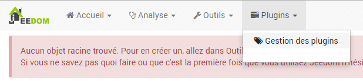
Comme c’est un plugin payant il faut cliquer sur « **Acheter**« . Vous allez alors être redirigé vers le market pour valider l’achat avec PayPal par exemple.
Une fois l’achat effectué, vous avez un message de confirmation qui s’affiche et vous pouvez maintenant l’installer en retournant dans Gestion des plugins, depuis Jeedom.
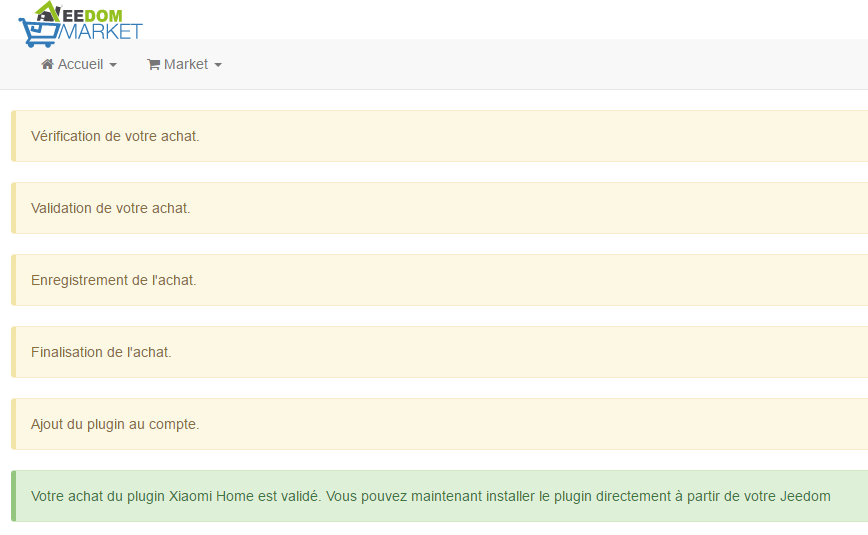

### Configurer le Gateway en mode développeur

Pour pouvoir utiliser le gateway ainsi que les composants dans Jeedom il faut passer ce dernier en mode développeur. Ce réglage se fait depuis l’application Mi-home que nous avions installé [précédemment](/articles/installation-et-configuration-de-la-gateway-xiaomi#Installation_de_lapplication_Mi-Home).
Il faut :

1.  Se rendre dans les [réglages du gateway](/articles/installation-et-configuration-de-la-gateway-xiaomi#Reglage_du_gateway).
2.  Cliquer sur les « **…** » et « **A propos**« .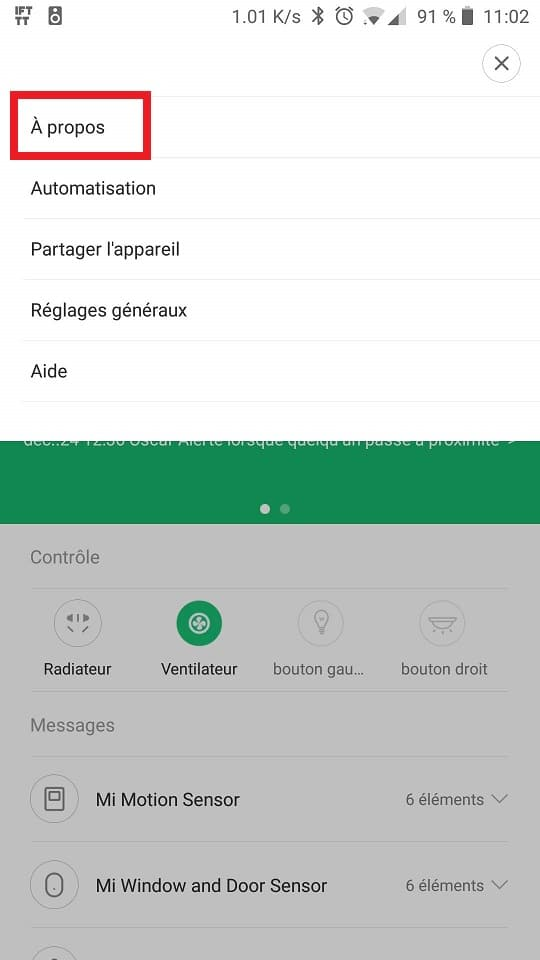
3.  Cliquer plusieurs fois sur « Plug-in **Version : 2.67.12** » jusqu’à l’apparition d’un texte en chinois. (Le numéro de version peut être différent.)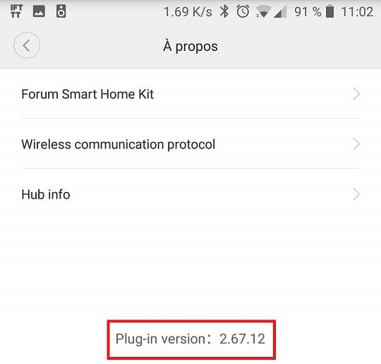
4.  Cliquer sur le menus « **Wireless communication protocol**« .
5.  Activer l’interrupteur en cliquant dessus.
6.  Copier le mot de passe de la 2nd ligne.
7.  Cliquer sur OK.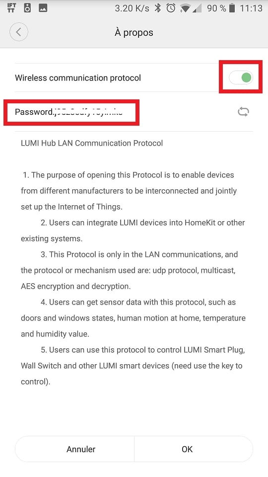

Quand le plugin sera installé et les composants récupérés dans Jeedom, il faudra saisir le [mot de passe dans la configuration du gateway](#mot-de-passe-du-gateway).

### Installation du plugin

De retour dans la gestion des plugins le bouton « **Acheter** » a été remplacé par « **Installer Stable**« , il suffit de cliquer dessus pour lancer l’installation.
A la fin il faut bien penser de l’activer en cliquant sur « **Activer** » à coté de « **Action**« .
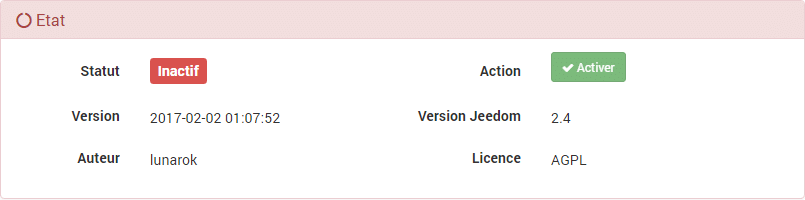
Dans la partie « **Dépendances** » cliquez sur « **Relancer** » et attendez la fin de l’installation.
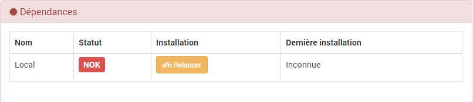
Dans « Démon » cliquez sur « **(Re)Démarrer** » si le statut est à « **NOK**« .
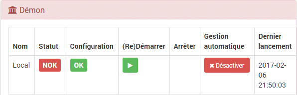
Si vous avez un message d’erreur : « ***Adresse réseau invalide, merci de vérifier votre configuration*** » lors de l’activation il faut ajouter l’IP de Jeedom dans les réglages réseau.
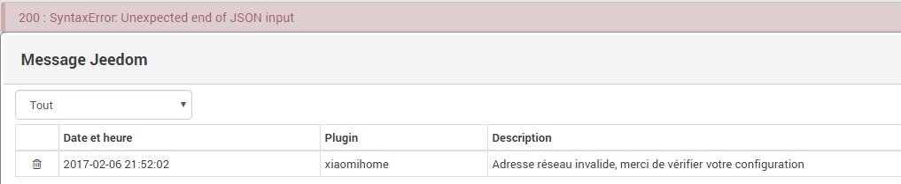
Aller dans la roue cranté, Configuration, Configuration réseaux.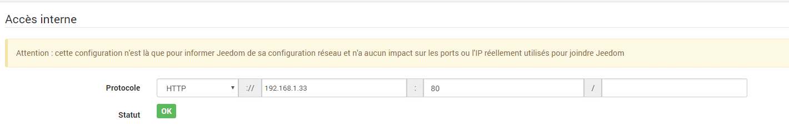

## Configuration du plugin Xiaomi

Aller dans « **Plugins**« , « **Protocole domotique**« , « **Xiaomi Home**« .
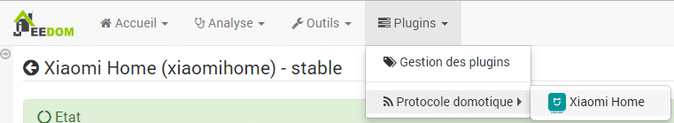
Les composants sont découverts automatiquement, si ce n’est pas le cas vous pouvez les actionner pour aider à l’integration.
Je vous conseille vivement de les renommer, pour faciliter leur utilisation dans Jeedom. Vous pouvez donner le même nom à plusieurs composants, car ils seront différenciés par l’objet auquel ils appartiennent. L’objet est en général la piece où ils se trouvent, pour le moment ils ont « **Aucun**« .
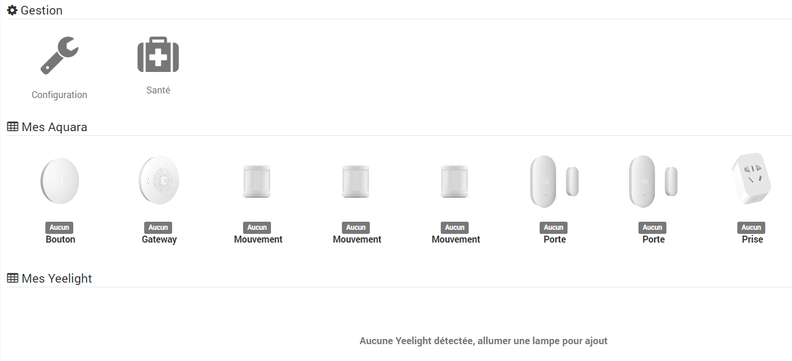

### Mot de passe du Gateway

Pour saisir le [mot de passe récupéré](#configurer-le-gateway-en-mode-developpeur) dans l’application Mi-Home, il faut cliquer sur « **Gateway** » et aller dans « **Password** » puis « **Sauvegarder**« .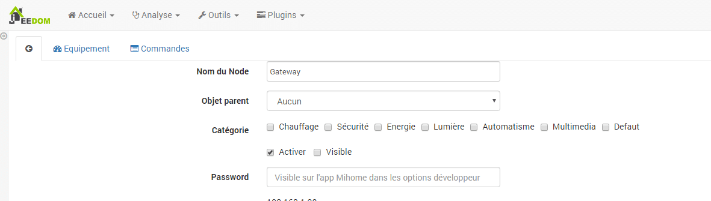
Afin que les commandes soient bien prises en compte, il faut actionner le Gateway, en allumant la led par exemple, depuis l’application. Vous pouvez vérifier la bonne association en allant dans le menu « **Commandes**« , il doit y avoir 4 commandes disponibles.

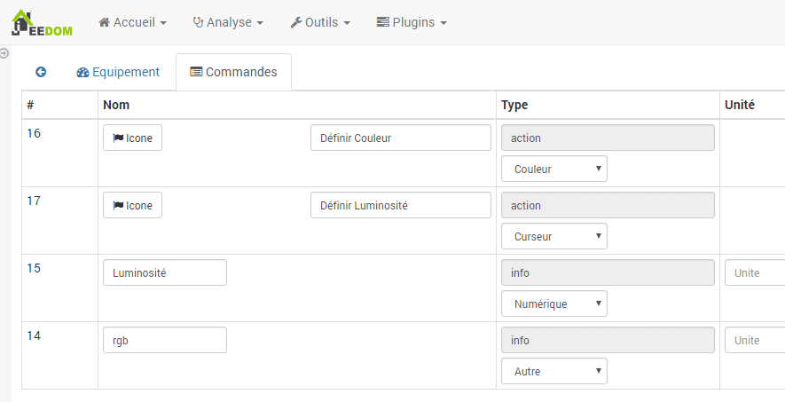

## Conclusion

Encore une fois c’est assez simple, la plupart des actions sont automatisées. Il suffit de cliquer sur le bon bouton, aux bons endroits. Personnellement j’ai eu un problème avec la synchronisation des commandes dans le Gateway, mais j’ai refait la procédure de mot de passe développeur et tout fonctionne bien depuis.
Maintenant, il reste à intégrer les composants dans des objets et des scénarios de Jeedom. Dans un futur article, je vous montrerai comment refaire sous Jeedom, les scenes présentes dans l’application Mi-home et bien sûr, comment les faire évoluer pour être utilisées dans un système domotique complet.
Rappel du materiel nécessaire :

- Un kit Raspberry Pi 3. 66 €.
- Un kit Xiaomi Smart Home 6in1. 66 € [_(Pour l’achat et les reductions voir ici)._](/gamme-domotique-xiaomi-home)
- [Le plugin Xiaomi](https://www.jeedom.com/market/index.php?v=d&p=market&type=plugin&plugin_id=xiaomihome). 6 €.

Vous pouvez retrouver le fil dédié au [plugin Xiaomi sur le forum](https://www.jeedom.com/forum/viewtopic.php?f=28&t=23382) de Jeedom.

\
