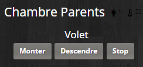
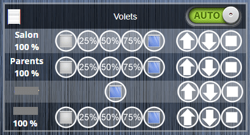

# Installation Plugin RFXcom et volets Somfy RTS

Dans ce tutoriel nous allons voir comment installer le plugin payant RFXcom dans Jeedom, puis comment le configurer pour faire fonctionner l’émetteur récepteur [RFXtrx433XL](https://amzn.to/2UFV1Wi). Pour prendre un exemple concret, nous verrons comment associer des volets roulant Somfy utilisant le protocole RTS.

Pour rappel le [RFXtrx433XL](https://amzn.to/2UFV1Wi) permet de gérer en plus du RTS, plusieurs protocoles fonctionnant sur la bande 433 MHz.

**Quelques protocoles compatibles avec le RFXcom :**

- Blyss
- Chacon DI-O
- HomeEasy
- La Crosse
- Oregon Scientific
- Somfy RTS
- Sonde météo Cresta
- Visonic PowerCode
- X10 lighting, X10 security, X10 Ninja/Robocam, X10 remotes

## Installation depuis Jeedom Market

La technique d’installation est la même que pour tous les plugins payants Jeedom et le paiement se fait via Paypal.

**Depuis Jeedom :**

- Aller dans « Plugins » et « Gestion des Plugins ».
- Cliquer sur « Market ».
- Taper dans la barre de recherche : « rfxcom ».
- Cliquer sur le plugin « RFXcom ».
- Cliquer sur « Acheter ».

Vous allez être redirigé vers le market Jeedom depuis votre navigateur.

- Suivre les instructions de payement via Paypal.
- A la fin de la transaction, le message suivant va s’afficher : « Votre achat est fini vous pouvez fermer la page ».
- Fermer la page.
- Retourner sur Jeedom.
- Rechercher à nouveau « rfxcom ».
- Le plugin a été ajouté à votre compte, il a une marque en bas à droite.
- Cliquer sur le plugin « RFXcom ».
- Cliquer sur « Installer Stable ».

Une fois l’installation terminée, vous pouvez aller directement à la page de configuration du plugin en cliquant sur : « D’accord ». Si vous ne le faites pas, vous pouvez y accéder en faisant :

- Aller dans « Plugins » et « Gestion des Plugins ».
- Cliquer sur le plugin « RFX com ».

## Mise à jour du RFXcom

Afin d’être sûr de pouvoir gérer tous les protocoles, il est possible de mettre à jour le firmware. Les fichiers et le logiciel sont disponibles sur le site officiel [http://www.rfxcom.com](http://www.rfxcom.com) dans la rubrique « Download ».

- Installer le logiciel [RFXflash Programmer](http://www.rfxcom.com/WebRoot/StoreNL2/Shops/78165469/MediaGallery/Downloads/RFXflash.exe).
- Télécharger le firmware correspondant à votre matériel.
  - Dans mon cas le : « RFXtrx433XL ProXL1 Firmware ».
- Dé zipper le fichier sur votre ordinateur.
- Brancher le RFXcom sur un port USB du PC.
- Attendre la fin de l’installation automatique des drivers.
- Lancer le logiciel RFXflash.
  - Le port USB devrait être sélectionné
- Cliquer sur « Connect to device ».
- Attendre qu’il trouve le matériel.
- Cliquer sur « Open HEX file ».
- Sélectionner le firmware correspondant à votre matériel.
- Cliquer sur Ouvrir pour commencer l’importation.
- Attendre le message « HEX file imported… ».
- Cliquer sur « Write device ».
- Attendre le message « Finished operation… ».
- Cliquer sur le bouton « Disconnect device ».

## Configuration du Plugin RFXcom

Pour le tutoriel j’utilise le [Rfxcom Version XL](https://amzn.to/2HlLNMb) mais le principe est le même pour les autres modèles.

- Brancher le RFXcom sur un des ports USB.
- Activer le plugin en cliquant sur « Activer ».
- Dans la partie « Démon » le statut doit être à NOK car il faut sélectionner le port du RFXcom.
- Aller dans la partie « Configuration » « Démon » le « Port RFXcom » est à « Aucun ».
- Choisir « Auto » comme spécifié dans le doc.
- Sauvegarder.
- Si le démon ne passe pas à OK (Ce fut le cas pour moi) alors :
- Choisir votre RFXcom, dans mon cas : « RFXCOM RFXtrx433XL (/dev/ttyUSB0) ».
- Sauvegarder.

## Gestion des protocoles RFXcom

L’un des gros avantages des RFXcom, c’est qu’il est possible de gérer beaucoup de protocoles, mais afin d’éviter les conflits il est conseillé d’activer seulement les protocoles utilisés. Une liste des perturbations entre protocoles est disponible sur la documentation du [Rfxcom](http://www.rfxcom.com/WebRoot/StoreNL2/Shops/78165469/MediaGallery/Downloads/RFXtrx_User_Guide_-_FR.pdf).

- Aller dans la partie « Configuration » « Démon ».
- Cliquer sur « Gestion des protocoles RFXcom ».
- Cocher ou décocher les protocoles en fonction des besoins.
- Enregistrer.

## Particularité du mode Debug

Si vous avez des problèmes lors de l’installation ou de la configuration du plugin, vous pouvez passer en mode « Debug ».
Ce mode permet d’avoir plus d’informations dans les logs sur le fonctionnement du plugin.

**Pour désactiver le mode Debug il faut :**

- Aller dans la partie « Log et surveillance ».
- Cocher la case « Debug ».
- Sauvegarder.
- Aller dans la partie « Démon ».
- Cliquer sur « (Re)Démarrer ».

**Pour désactiver le mode Debug il faut :**

- Aller dans la partie « Log et surveillance ».
- Cocher la case « Défaut ». (Ou autre)
- Sauvegarder.
- Aller dans la partie « Démon ».
- Cliquer sur « (Re)Démarrer ».

## Volets Somfy RTS

Grace au RFXcom, il est possible de contrôler les volets roulant Somfy fonctionnant avec le protocole RTS. Les volets IO ne sont pas supportés.

**Attention, il n’y a pas de retour d’état, c’est-à-dire que si vous actionnez vos volets via les télécommandes, Jeedom ne sera pas informé de ces actions.**

**Pour ajouter les volets il faut :**

- Aller dans « Plugins », « Protocole domotique » et « RFXcom ».
- Cliquer sur « Ajouter ».
- Donner un nom à l’équipement.
- Activer l’équipement et renseigner les informations nécessaires.
- Dans « Equipement » choisir : « \[Somfy\] RTS Moteur – Défaut ».
- Sauvegarder.
- Aller dans l’onglet « Commandes ».

A présent il faut vous munir de la télécommande qui contrôle le volet que vous voulez associer et rechercher le bouton « Prog ».

- Appuyer sur le bouton « Prog » de la télécommande.
- Relâcher lorsque le volet fait un léger mouvement de haut en bas.
- Depuis Jeedom, appuyer sur le bouton « Tester » de la commande « Programme ».
- Pour être sûr que le volet est bien associé, cliquer sur le bouton « Tester » d’une des commandes.

Volets dans le Dashboard

Exemple sur Design jeedom

Voilà, j’espère avoir été clair pour ce tutoriel sur l’installation du plugin RFXcom dans Jeedom. Comme je vous le disais, le principe d’installation est le même pour les autres plugins achetés sur le market Jeedom. La configuration est assez simple, mais en cas de problème, je vous invite à lire la [documentation officielle disponible ici](https://jeedom.github.io/plugin-rfxcom/fr_FR/) ou le [forum dédié ici](https://www.jeedom.com/forum/viewforum.php?f=36).

Nous avons aussi vu comment associer des volets Somfy utilisant le protocole RTS. Dans un prochain article nous verrons comment les contrôler dans Jeedom, via des scenarios et comment avoir un retour d’état fictif.

Quelques références utiles à retrouver sur Amazon : RFXtrx433XL, RFXcom Version XL et leurs accessoires.
