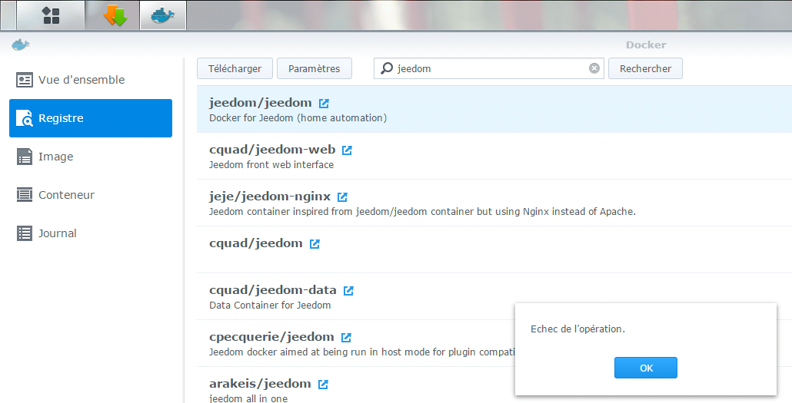
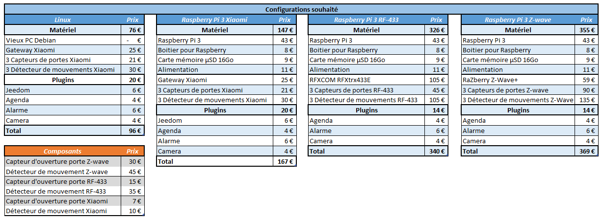

# Comparatif Jeedom sur RPI 3 avec Xiaomi, Zwave ou Rf-433

Dans mon article [Test de Jeedom (l’installation)](/test-de-jeedom-linstallation) j’avais installé Jeedom sur un PC sous Linux Debian 8. Peu de temps après j’ai transformé ce PC en Synology grace à XPenology.
J’ai donc installé Jeedom sur le Synology via Docker, ce qui m’a permis d’appréhender l’interface et le fonctionnement de Jeedom. Malheureusement, après une réinitialisation du Synology, je n’ai jamais pu ré-installer Jeedom… Déjà parce que je n’arrivais pas à télécharger l’image de Jeedom sous Docker, mais aussi, parce que j’avais des messages d’erreur, de redirection de port, entre autres.

J’ai donc lâché l’affaire quelques temps, mais c’était sans compter sur l’article vu sur le site de [domotiquetechnoseb27](https://domotiquetechnoseb27.com) intitulé « **Xiaomi Home sous Jeedom**« …

## Synology Vs Raspberry Pi 3 Vs Jeedom mini+.

Vous savez sans doute que la nouvelle Jeedom Smart devrait sortir fin février 2017, mais à un tarif de 235 €, ce qui est pour moi hors budget, en tout cas pour commencer à faire de la domotique.

Après mes déboires avec l’installation de Jeedom sur Synology, j’ai décidé de trouver une solution alternative. Les choix qui me restaient étaient une Jeedom mini ou un Raspberry Pi3, car hormis Jeedom, mon PC fonctionne très bien en tant que serveur Synology.

Dans mon précédent article, j’avais fait un [Comparatif des solutions à base de Jeedom](/articles/installation-et-configuration-du-detecteur-de-mouvement-xiaomi), comparant une installation sous Linux, RaspberryPi et Jeedom mini+. Ce comparatif n’est plus a jour, car la Jeedom mini n’est plus produite, remplacée par la Jeedom Smart.

Ce qui redistribue les cartes, c’est surtout le fait que Jeedom est désormais compatible avec les [composants Xiaomi](/articles/installation-et-configuration-de-la-gateway-xiaomi) qui sont d’un rapport qualité / prix imbattable.

**Attention le plugin Jeedom Xiaomi n’est pas supporté sur Docker Synology !** Voilà qui règle définitivement le problème de l’installation de Jeedom sous Synology.

## Xiaomi Vs Z-Wave Vs Rf-433

J’ai donc mis à jour mon fameux tableau, en comparant les différentes solutions Jeedom, afin de trouver le meilleur rapport qualité / prix.

Je suis parti sur une installation de base avec, 3 [capteurs d’ouverture de porte](/articles/installation-et-configuration-du-detecteur-douverture-de-porte-xiaomi) et 3 [capteurs de mouvements](/articles/installation-et-configuration-du-detecteur-de-mouvement-xiaomi), ainsi que quelques plugins qui me semblent indispensables (Agenda, Alarme, Camera).

J’ai évidement supprimé du comparatif la Jeedom mini qui n’est plus produite et la Smart Jeedom qui ne joue pas dans la même catégorie de prix (235€).

La difference entre la solution Linux et RPI se joue essentiellement sur le coût du materiel, car un vieux PC coûte 0€ et un RPI 71 €. Il faut cependant savoir qu’un PC consomme plus, prends plus de place et dans le cas ou vous l’utilisez pour autre chose, vous risquez de corrompre votre Jeedom. Cette solution était idéale pour tester, mais en production ça reste assez contraignant.

Je préfère donc comparer le prix des différents composants, plutôt que les box et je pars sur un RPI 3. Rien n’empêche d’acheter une Jeedom Smart, d’installer Jeedom sur une ancienne Jeedom Mini, Odroid C2, etc…

La différence se joue donc sur les passerelles et les composants, donc naturellement, les solutions les moins chères sont sans surprise celles à base de Xiaomi. Cependant, des contraintes peuvent être rédhibitoires pour certains.

#### Xiaomi

**Passerelle** (Gateway) : 25 €. Pour plus de detail  [Installation et configuration du Gateway](/articles/installation-et-configuration-de-la-gateway-xiaomi).

**Capteur d’ouverture de porte** : 7 €. Pour plus de detail [Installation et configuration du détecteur d’ouverture de porte](/articles/installation-et-configuration-du-detecteur-douverture-de-porte-xiaomi).

**Détecteur de mouvement** : 10 €. Pour plus de detail  [Installation et configuration du détecteur de mouvement](/articles/installation-et-configuration-du-detecteur-de-mouvement-xiaomi).

**Adaptateur pour prises EU** : 1,80€ (Gearbest) ou [5,99€](http://amzn.to/2kK7yJD) (Amazon). Vous pouvez les acheter par 5 pour d’éventuelles smart plugs.

Xiaomi utilise le protocol ZigBee. Le gateway est indispensable pour utiliser les composants de la marque, mais elle n’est pas compatible avec les composants ZigBee d’autres marques…

Mais cette solution reste de loin la moins chère, dans la mesure ou on ne souhaite pas utiliser des composants qui n’existent pas chez Xiaomi.

Il faut savoir que les composants Xiaomi sont difficiles à trouver en France pour le moment et doivent donc être achetés en Chine. A ce sujet, n’hésitez pas à lire mon article » [J’ai passé commande sur un site chinois ! – Gearbest –](/jai-passe-commande-sur-un-site-chinois-gearbest)« .

Vous pouvez même encore économiser plus en profitant des packs Xiaomi Smart Home 5 in 1 comprenant la passerelle, 1 détecteur de mouvement, 1 capteur de porte, une prise contrôlable et un interrupteur. [C’est le pack que je vous présente ici.](/articles/installation-et-configuration-de-la-gateway-xiaomi) 

Box Xiaomi Home avec les capteurs supplémentaire.

#### Rf-433

**Passerelle** (RFXtrx433E) : [105 €](http://amzn.to/2kCeI2D).

**Capteur d’ouverture de port**e : [15 €](http://amzn.to/2jPj86w).

**Détecteur de mouvement** : [35](http://amzn.to/2kC7viY) €.

Le protocol Rf-433 est très courant, les composants ne sont pas très chers, mais il faut la [passerelle](http://amzn.to/2kCeI2D) qui coûte aux alentours des 100 €.
Rien n’empêche d’investir plus tard dans une passerelle et des composants rf-433.

#### Z-Wave

**Passerelle** (Razberry) : [59 €](http://amzn.to/2lbNInS). _Remplaçable par un dongle USB z-wave.me à [35](http://amzn.to/2kCihWB)€._

**Capteur d’ouverture de porte** : [30 €](http://amzn.to/2lbIqc6).

**Détecteur de mouvement** : [45 €](http://amzn.to/2kfELvz).

Le Z-Wave est un peu LE protocole domotique pas excellence, la passerelle n’est pas très chère, surtout en [dongle USB](http://amzn.to/2kCihWB) et il y a un grand nombre de composants. Par contre, ils sont assez chers. Comme pour le Rf-433, on peut aisément investir plus tard et l’ajouter au RPI, ou acheter une Jeedom Smart qui en est pourvue par défaut.

## Conclusion.

Pour commencer à moindre prix le combo Raspberry Pi 3 / Smart home Xiaomi est vraiment l’idéal depuis que [Lunarok](https://lunarok-domotique.com) propose un [plugin Jeedom](https://www.jeedom.com/market/index.php?v=d&p=market&type=plugin&&name=xiaomi%20home).
Si vous voulez juste faire un essai, vous pouvez toujours installer Jeedom sur un vieux PC avec Linux, mais personnellement, je trouve que ce n’est pas la meilleure solution pour une utilisation permanente.

L’avantage de Jeedom, c’est qu’il est évolutif. Vous pouvez par la suite ajouter des passerelles Z-Wave et Rf-433, [Edisio](http://www.domadoo.fr/fr/interface-domotique/2915-edisio-dongle-usb-edisio-542007490500.html), etc… et même remplacer votre Raspberry par la future [Jeedom Smart](https://www.jeedom.com/blog/?p=3575)…

Si vous avez fait votre choix et que vous voulez installer Jeedom sur votre RaspberryPi 3 alors mon article « **[Jeedom – Installation de Jeedom Netinstall sur Raspberry 3](/articles/installation-de-jeedom-netinstall-sur-raspberry-3)«**  va vous intéresser.

Alors quelle solution avez vous choisi ?
