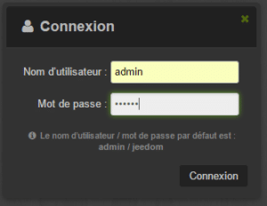
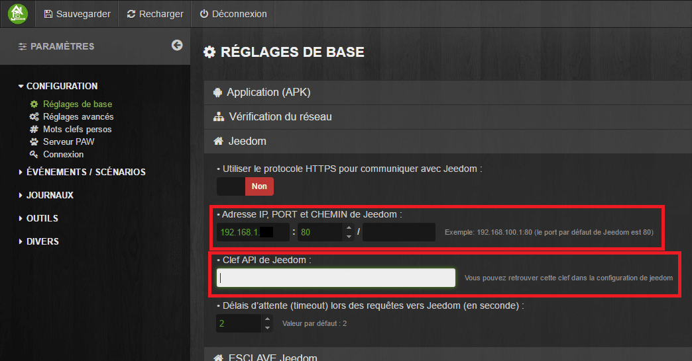
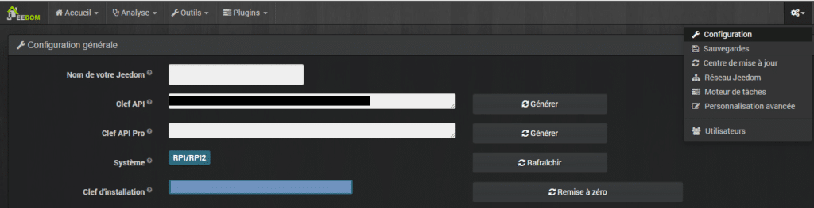
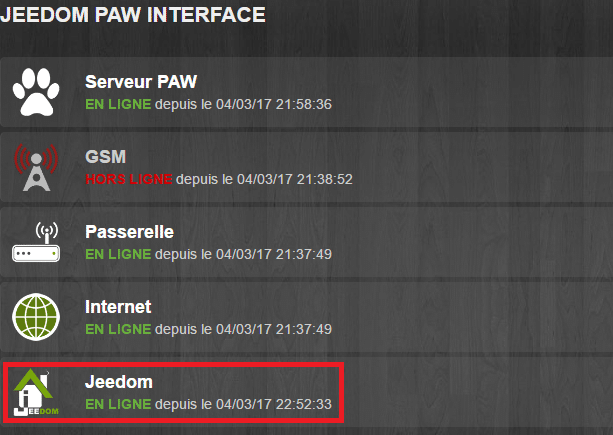
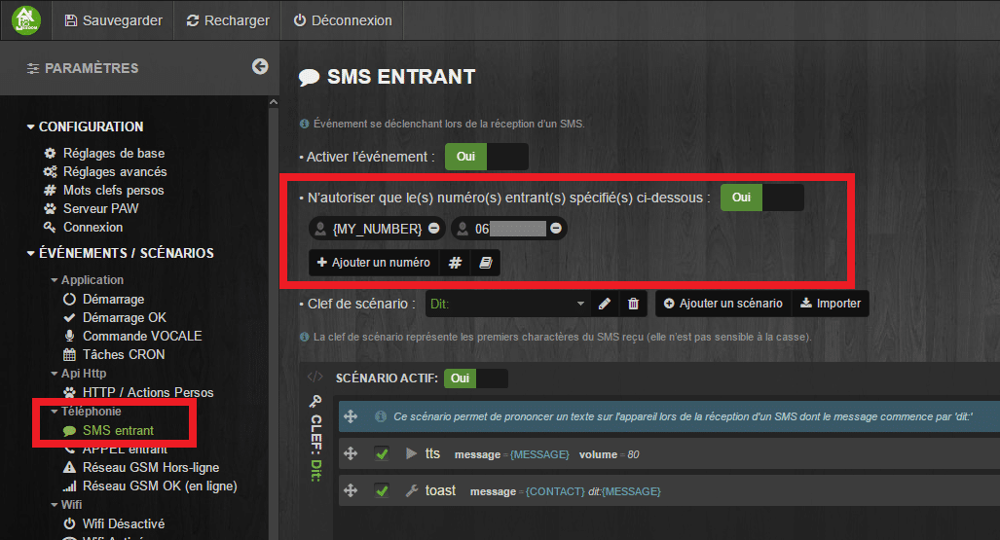
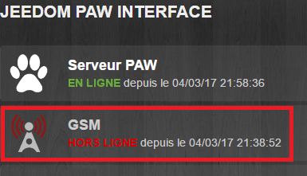

# Installation et configuration de JPI Jeedom Paw Interface

> Dans cet article, je vais détailler l’installation et la configuration de « **Jeedom Paw Interface**« . Ce n’est pas un tuto, mais plutôt un retour d’experience. Je vais décrire toutes les étapes que j’ai rencontré pour le faire fonctionner.
> Jeedom Paw Interface, JPI pour les intimes, n’est pas un plugin, mais plutôt une application sous android, permettant d’utiliser un vieux téléphone, ou une tablette android, en tant que passerelle GSM pour Jeedom.
> Pour plus de détails, [dJuL](https://www.jeedom.com/forum/memberlist.php?mode=viewprofile&u=4552), le créateur de l’APK a ouvert un post sur le [forum Jeedom](https://www.jeedom.com/forum/viewtopic.php?f=27&t=18283&p=469610#p469388).
> Par contre, c’est un peu compliqué de s’y retrouver sur le forum, au milieu des questions, idées, mises à jour, etc… Rien que pour trouver comment installer l’APK il faut déjà bien chercher.
> **Lien pour l’installation :[http://rulistaff.free.fr/JPI/fr.djul.JPI-0.958-minAPI19.apk](http://rulistaff.free.fr/JPI/fr.djul.JPI-0.958-minAPI19.apk).** Je vous invite à vérifier sur le [post Jeedom](https://www.jeedom.com/forum/viewtopic.php?f=27&t=18283&p=469610#p469388) si une nouvelle version est disponible. **\[datedermaj\]**
> Du coup, je me suis dit que j’allais noter toutes les étapes qui m’auront permis de faire fonctionner JPI.

Les prérequis :

- Avoir un telephone ou une tablette Android, avec un port pour carte SIM.
- Activer le Wifi sur votre appareil Android.
- Insérer une carte SIM. Personnellement j’utilise une carte Free-mobile à 0€.
- Utiliser Jeedom.
- Ajouter l’IP de l’appareil, au bail DHCP statique de votre routeur.

## Installation de PSA (Paw Server for Android) et JPI (Jeedom Paw Interface).

### Installation de PSA (facultatif)

- Télécharger et installer l’application [« Paw Server for Android » sur le play store](https://play.google.com/store/apps/details?id=de.fun2code.android.pawserver&hl=fr&rdid=de.fun2code.android.pawserver).
- PSA utilise le port 8080, mais si ce port est déjà utilisé, il faut le changer. Par exemple, moi, j’ai l’application [Ip Webcam](https://play.google.com/store/apps/details?id=com.pas.webcam&hl=fr) qui permet de transformer un telephone android en camera IP qui utilise déjà ce port.
- Pour le changer, aller dans **Menu, Settings, Server Settings, Server Port**, changer le port **8080** par un port dispo, exemple **8082**.

- Lancer l’application en cliquant sur le bouton Play.

### Installation de Jeedom Paw Interface (JPI)

Il faut télécharger et installer cet APK : [http://rulistaff.free.fr/JPI/fr.djul.JPI-0.92-minAPI15.apk](http://rulistaff.free.fr/JPI/fr.djul.JPI-0.92-minAPI15.apk)
Si vous n’avez pas installé Paw Server, vous serez redirigé vers le market pour le faire.
Il faut suivre les instructions à l’écran, jusqu’à la fin de l’installation.
Si votre téléphone n’est pas rooter il vous sera demandé de le redémarrer manuellement.
JPI va redémarrer automatiquement après le reboot.
\[alert-note\]**_Attention_**: l’APK n’a pas l’air compatible avec les téléphones Android sous Gingerbread, car j’ai un message d’erreur lors de l’installation sur un vieux DEFY+.\[/alert-note\]

### Configuration de JPI

Quand l’installation est terminée, il faut configurer JPI depuis un ordinateur connecté sur le même réseau.

- Aller sur **http://\[IP de l’appareil mobile\]:\[Port\]** (Normalement le port est 8080 sauf si vous l’avez changé lors de l’installation de PSA.)
- Sélectionner : « **Jeedom Paw Interface**« .
- Se connecter avec « **Admin** » et « **Jeedom**« .
- Aller dans **Configuration, Réglages de base, Jeedom**.
- Saisir l’**IP, le Port et le répertoire de votre Jeedom**.
- Saisir la **Clé API de Jeedom** que l’on retrouve sur Jeedom dans **Roue dentée, Configuration, Configuration générale**.
- Il faut ensuite faire **Sauvegarder** dans JPI
- A ce stade, si je retourne sur la page d’accueil, je constate que Jeedom est passé à « **EN LIGNE »**.
- Retour dans **Configuration,** puis « **Mots clefs perso**« , et entrer son numéro de téléphone. C’est le numéro de son téléphone perso par exemple, mais pas celui de l’appareil mobile avec JPI.

_**Info :** Malgré tout, mon numéro de téléphone n’était pas dans les numéros autorisé j’ai donc du l’ajouté dans « **Événement /Scénarios / Téléphonie / SMS entrant** » puis cliquer sur « **Ajouter un numéro** » et ajouter son numéro de téléphone._

~Info : A ce stade, pour ma part, GSM  est toujours  OFFLINE, apparemment c’est un problème avec certains téléphones, mais qui n’empêche pas le bon fonctionnement de l’application. Source : [Forum Jeedom](https://www.jeedom.com/forum/viewtopic.php?f=27&t=18283&&start=1480#p444898).~

## Test de fonctionnement avec Interactions.

Pour voir si ça fonctionne, rien de plus simple. Envoyez depuis votre mobile un message à l’appareil qui contient JPI. Si vous avez des interactions configurées, vous pouvez envoyer une phrase clé, sinon, envoyez juste « test » et vous devriez avoir un message en retour « Jeedom: Désolé je ne comprends pas la demande ».

## Conclusion
