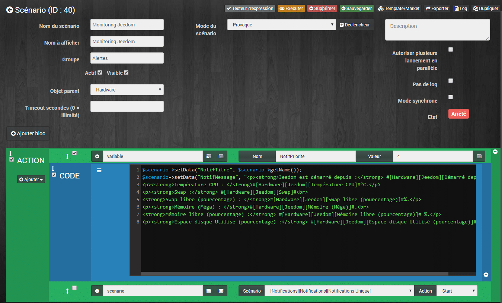
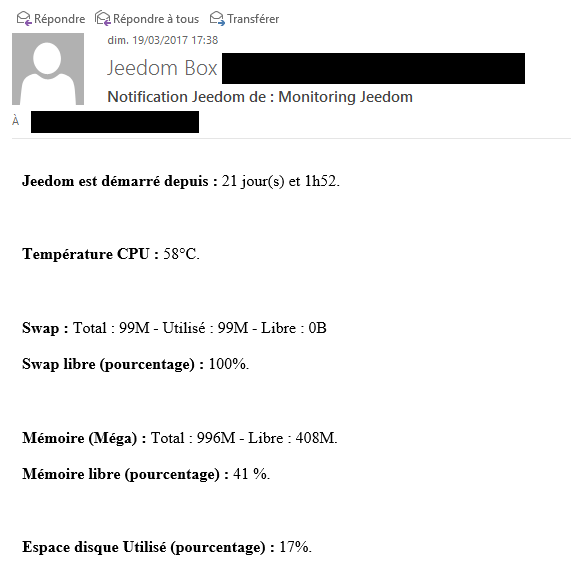
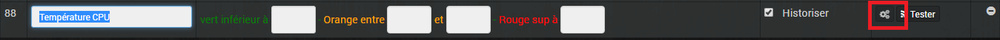
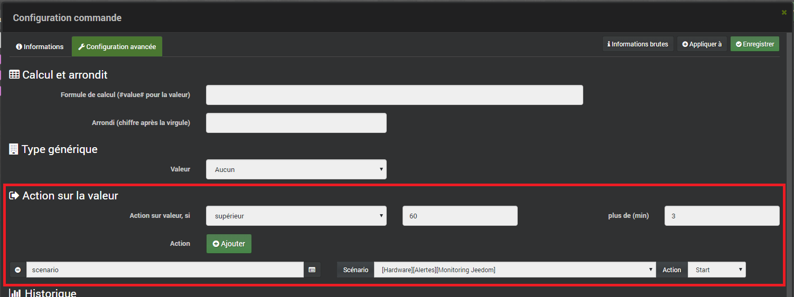

# Alertes par mail en cas de problème matériel

> Ce scénario va vous permettre de recevoir des alertes mails lorsqu’un problème matériel est détecté. Pour cela, nous allons utiliser le plugin gratuit « [Monitoring](https://market.jeedom.fr/index.php?v=d&p=market&type=plugin&plugin_id=Monitoring) » (phifi). Le déclenchement du scénario sera fait directement par les commandes, en utilisant la **configuration avancée.**
>
> L’envoi de mail sera géré par la « **[Notifications avancée](/articles/jeedom-scenario-notifications-avancees)** », mais rien ne vous empêche d’envoyer le mail directement depuis le scenario.

## Mode du scénario = Provoqué.

Le scénario sera provoqué [directement par les commandes du plugin](#configuration-des-commandes-pour-le-declenchement), on ne choisit donc pas de déclencheur.



## Action

### Variable

-   **Nom** : NotifPriorite
-   **Valeur** : 4

Là, on affecte la variable « **NotifPriorite** » qui servira pour l’envoi de mail dans le scénario [Notifications avancées](/articles/jeedom-scenario-notifications-avancees).

### Code

Maintenant, nous allons utiliser le bloc code (Ajouter/Bloc/Code) pour 2 raisons :

1.  La fonction **#Trigger# ne permet plus de récupérer le nom du scénario** qui a provoqué le déclenchement d’un autre scénario et j’ai besoin de cette information pour l’ajouter dans le titre de mon mail.
2.  Il est plus simple pour la mise en page de mon mail, d’utiliser le bloc code, plutôt que le champ variable, beaucoup plus petit.

```js
$scenario->setData("NotifTitre", $scenario->getName());
```

J’utilise la fonction « **GetName()** » pour ajouter le nom du scénario en cours à la variable « **NotifTitre**« .

```
$scenario->setData("NotifMessage", "

<p><strong>Jeedom est démarré depuis :</strong> #[Hardware][Jeedom][Démarré depuis]#.</p>
 <p><strong>Température CPU : </strong>#[Hardware][Jeedom][Température CPU]#°C.</p>
 <p><strong>Swap :</strong> #[Hardware][Jeedom][Swap]#<br>
 <strong>Swap libre (pourcentage) : </strong>#[Hardware][Jeedom][Swap libre (pourcentage)]#%.</p>
 <p><strong>Mémoire (Méga) : </strong>#[Hardware][Jeedom][Mémoire (Méga)]#.<br>
 <strong>Mémoire libre (pourcentage) :</strong> #[Hardware][Jeedom][Mémoire libre (pourcentage)]# %.</p>
 <p><strong>Espace disque Utilisé (pourcentage) :</strong> #[Hardware][Jeedom][Espace disque Utilisé (pourcentage)]#%.</p>

");
```

J’affecte à la fonction « **NotifMessage** » le texte en html que je recevrais dans mon mail. Les commandes sont celles fournies par le plugin Monitoring.



### Scenario

-   **Nom** : #\[Notifications\]\[Notifications\]\[Notifications Unique\]#
-   **Action** : START.

Je démarre le scénario des notifications qui utilisera les variables précédemment affectées.

## Configuration des commandes pour le déclenchement

On pourrait très bien sélectionner des commandes directement dans le scénario pour le déclencher, mais nous allons utiliser une autre méthode.

Les commandes de Jeedom ont toutes une « **configuration avancée** » et c’est de là que nous allons appeler le scénario.

### Ouvrir les configurations avancées

Pour notre exemple, nous voulons recevoir une alerte lorsque la température du CPU de Jeedom est supérieur à 60 °C pendant plus de 3 minutes.

Depuis le menu de Jeedom faire :

1.  **Plugins / Monitoring / Monitoring.**
2.  Ouvrir l’équipement qui correspond à **Jeedom.**
3.  Aller dans **« Commandes ».**
4.  Descendre jusqu’à « **Température CPU**« .
5.  Cliquer sur la **roue crantée**.
6.  Aller dans l’onglet « **Configuration avancée ».**

#### Action sur la valeur

-   **Action sur valeur, Si** : Supérieur 60
-   **Plus de (min) :** 3
-   **Scenario :** #\[Hardware\]\[Alertes\]\[Monitoring Jeedom\]#
-   **Action :** START

Le déclenchement sera lancé depuis la commande, dès que la condition sera remplie. Il suffit de faire la même chose pour toutes les autres commandes que l’on souhaite déclenchantes.

## Conclusion

De cette façon, on ne déclenche pas le scénario pour rien et il n’y a pas besoin de SI, ALORS, SINON, pour tester la valeur à chaque changement, ou à heures régulières.

Dans la mise en forme du mail, j’affiche plusieurs informations, même si elles ne sont pas déclenchantes, car il est bon d’avoir plusieurs valeurs pour identifier plus rapidement un éventuel problème. Pour l’exemple, j’utilise une version simplifiée, mais on peut très bien afficher des informations venant d’autres Jeedom déportés, d’un NAS, de la Freebox etc…

De plus, le fait d’utiliser le bloc code pour la rédaction du message, permet d’utiliser facilement du html pour la mise en page du mail.

Pour ceux qui utilisent le scénario « **[Notifications avancée](/articles/jeedom-scenario-notifications-avancees)** » et qui voudraient afficher dans le titre du mail le scénario déclencheur, il faut modifier la valeur de la variable NotifTitre de : « **Notification ( variable(NotifPriorite) ) de Jeedom.** » par « **Notification Jeedom de : variable(NotifTitre).**« .

Retrouvez la liste des plugins Jeedom, les scénarios, les images et le matériel compatible Jeedom sur la page: [Matériel, Plugin et plus.](/articles)
