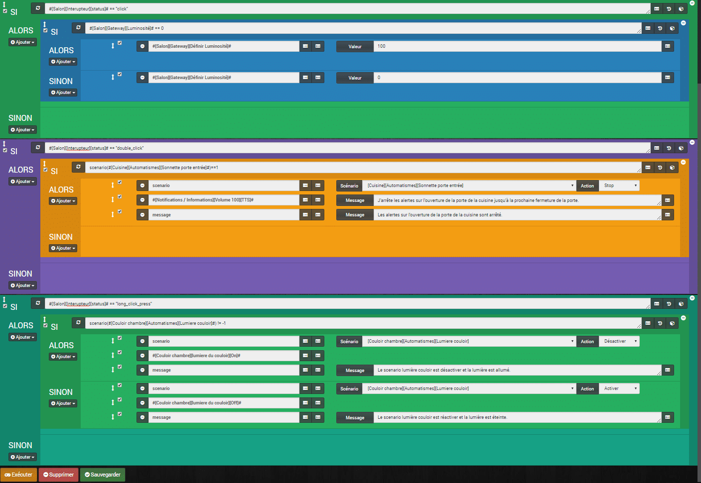
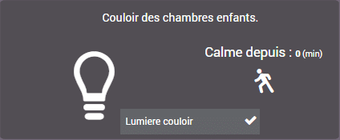

# Utilisation du bouton switch Xiaomi

> Le scenario consiste à utiliser le bouton « Interrupteur Switch Xiaomi » dans Jeedom avec les différentes fonctions disponibles :
>
> -   **Click** : Allume et éteint la LED du Gateway en fonction de son état.
> -   **Double\_click** : Arrêt d’un scénario. Dans mon cas, j’arrête les alertes d’ouverture de la porte d’entrée.
> -   **Long\_click\_press** : Désactive un scénario. Dans mon cas, le scénario d’extinction automatique de la prise qui commande la lumière du couloir des chambres.
> -   **Long\_click\_release** : Je ne l’utilise pas car je n’en voit pas trop l’intérêt, mais la structure du scénario reste la même que pour les autres.

## Mode du scenario = Provoqué.

On aura besoin simplement d’un déclenchement sur le changement de statu du bouton. #\[Salon\]\[Interrupteur\]\[status\]#

## SI #\[Salon\]\[Interupteur\]\[status\]# == « click »

Là, on vérifie s’il n’y qu’un click, alors on rentre dans la boucle.

### ALORS SI #\[Salon\]\[Gateway\]\[Luminosité\]# == 0

Si la lumière du Gateway est à 0 elle est éteinte.

### ALORS #\[Salon\]\[Gateway\]\[Définir Luminosité\]# Valeur : 100

Alors, on allume le Gateway en passant la luminosité à 100.

### SINON #\[Salon\]\[Gateway\]\[Définir Luminosité\]# Valeur : 0

Sinon, on éteint le Gateway en passant la luminosité à 0.

## SI #\[Salon\]\[Interupteur\]\[status\]# == « double\_click »

Là, on vérifie s’il y a un double click, alors on rentre dans la boucle.

### ALORS SI scenario(#\[Cuisine\]\[Automatismes\]\[Sonnette porte entrée\]#) == 1

On vérifie si le scénario « Sonnette porte entrée » est « en cours ».

**_Info_** : La fonction « **scenario**(scenario) » donne le statut du scénario, renvoie 1 en cours, 0 si arrêté, -1 si désactivé, -2 si le scénario n’existe pas et -3 si l’état n’est pas cohérent.

### ALORS

#### Action 1 : scenario : \[Cuisine\]\[Automatismes\]\[Sonnette porte entrée\] : Action : STOP.

Là, on arrête le scénario.

#### Action 2 : #\[Notifications / Informations\]\[Volume 100\]\[TTS\]# message : « J’arrête les alertes sur l’ouverture de la porte de la cuisine jusqu’à la prochaine fermeture de la porte. »

La deuxième action diffuse un message vocal via PlayTTS, indiquant que l’alerte sur l’ouverture de la porte d’entrée est arrêtée. Le scénario n’étant pas désactivé, mais seulement arrêté, dés que la porte sera fermée, le scénario sera prêt à fonctionner de nouveau sans intervention sur le bouton.

#### Action 3 : message : « Les alertes sur l’ouverture de la porte de la cuisine sont arrêtées. »

La dernière action affiche un message dans le centre de message de Jeedom, au cas où je rate la notification vocale, ou si ce n’est pas moi qui l’actionne.

## SI #\[SALON\]\[INTERUPTEUR\]\[STATUS\]# == « LONG\_CLICK\_PRESS »

Là, on vérifie si le bouton est pressé longuement, 2 à 3 secondes, alors on rentre dans la boucle.

### ALORS SI scenario(#\[Couloir chambre\]\[Automatismes\]\[Lumiere couloir\]#) != -1

On vérifie si le scénario « Lumière couloir » est différent de « désactivé ». On fait le test dans ce sens, car il peut être arrêté, ou en cours, ou activé.

**_Info_** : La fonction « **scenario**(scenario) » donne le statut du scénario, renvoie 1 en cours, 0 si arrêté, -1 si désactivé, -2 si le scénario n’existe pas et -3 si l’état n’est pas cohérent.

### ALORS

#### Action 1 : scenario : \[Couloir chambre\]\[Automatismes\]\[Lumiere couloir\] : Action : DÉSACTIVER.

Là, on désactive le scénario. C’est a dire que même si le scénario est provoqué, il ne se passera rien tant qu’il ne sera pas réactivé.

#### Action 2 : #\[Couloir chambre\]\[lumiere du couloir\]\[On\]#

La deuxième action allume la lumière du couloir. Je fais ce choix car lorsqu’un copain de mon fils vient et qu’il n’est pas rassuré, je ne veux pas que la lumière s’arrête. Rien ne m’empêche de l’éteindre depuis mon dashboard si besoin.

#### Action 3 : message : « Le scénario lumière couloir est désactivé et la lumière est allumée. »

La dernière action affiche un message dans le centre de message de Jeedom, au cas où ce n’est pas moi qui l’actionne et pour savoir rapidement qu’il est désactivé.

### SINON

#### Action 1 : scenario : \[Couloir chambre\]\[Automatismes\]\[Lumiere couloir\] : Action : ACTIVER.

La on (re)active le scénario.

#### Action 2 : #\[Couloir chambre\]\[lumiere du couloir\]\[OFF\]#

La deuxième action éteint la lumière du couloir. Elle se rallumera dès qu’il y aura un mouvement de détecté dans le couloir, car le scénario est à nouveau activé.

#### Action 3 : message : « Le scénario lumière couloir est réactivé et la lumière est éteinte. »

La dernière action affiche un message dans le centre de message de Jeedom, au cas où ce n’est pas moi qui l’actionne et pour savoir rapidement qu’il est (re)activé.

## Affichage dans Jeedom

La première action du bouton, « simple click », est représentée sur le dashboard, car j’ai déjà une tuile pour la lumière LED du Gateway. Pour l’action « double click », il n’y a pas d’affichage spécifique, mais je vois que la porte d’entrée est ouverte, car j’ai une tuile pour la porte d’entrée.

Par contre, pour savoir si mon scénario « lumière couloir » est activé ou désactivé, j’ai ajouté une information à mon dashboard.

Lumière couloir est activée.

## Conclusion

Le scénario est en fait, 3 scénarios en un, ils sont appelés en fonction du statu du bouton. Les algorithmes n’ont pas de « SINON », ils se terminent et passent au suivant. J’aurais pu les imbriquer, mais cela n’avait pas vraiment d’intérêt et je pense que cela ralentirait le processus. Il est bien plus simple de lire chaque scénario s’ils sont séparés.

\[alert-announce\]Je ne fais pas de test sur le statu « Long\_click\_release » car je n’en vois pas l’intérêt pour le moment.\[/alert-announce\]

Retrouvez la liste des plugins, les scénarios, les images et le matériel compatible Jeedom sur la page: [Matériel, Plugin et plus.](/articles)
