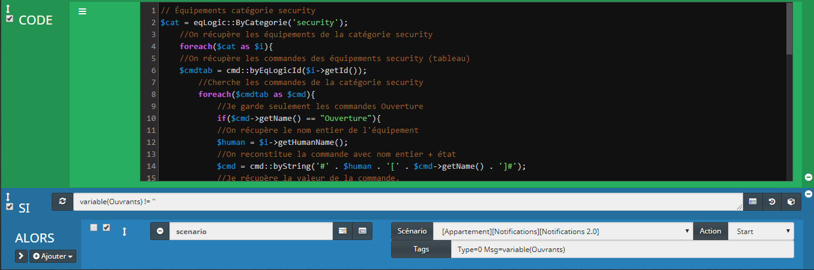
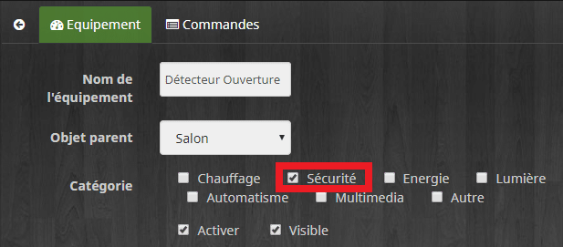
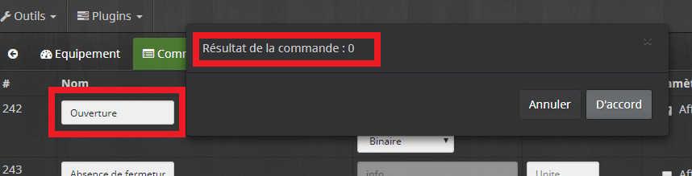
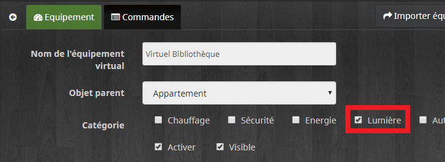
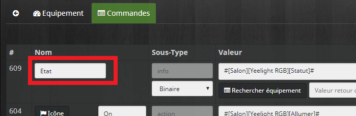
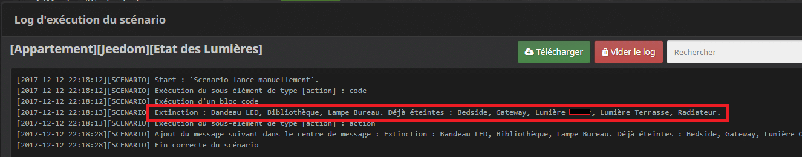

# L’état des ouvrants et des lumières

> Dans Jeedom, il est facile d’avoir visuellement **l’état des ouvrants et des lumières,** en regardant le **dashboard** par exemple. Mais, dès qu’on veut avoir l’information via un **SMS, TTS, Mail**, ou qu’on veut éteindre **toutes** les lumières d’un coup, ça peut devenir vite **fastidieux,** surtout lorsqu’on commence à avoir beaucoup de composants.
>
> L’idée de ces scénarios, c’est de faire le **boulot à notre place.** C’est a dire de **rechercher** tous les équipement, **lumières** ou **ouvrants** du logement, de vérifier leur **état**, puis de nous **informer** et si besoin, d’exécuter une action.
>
> Par exemple, j’utilise ces scénarios lorsque je passe en mode **nuit**, ou **absent.** Cela me permet de ne plus me soucier de savoir si j’ai laissé une lumière **allumée** quelque part dans la maison, ou si une porte est toujours **ouverte**.
>
> Je ne peux pas automatiser la fermeture des portes. Le message est donc juste informatif, mais on pourrait très bien ajouter des volets roulants qui eux pourraient être domotisés.
>
> Pour les lumières, nous verrons comment les éteindre et donc, effectuer une action en fonction de leur état.
>
> Ces scénarios sont basés sur les **« Catégories d’équipements »** et fonctionnent en **« Bloc code »**, c’est un peu plus **compliqué** que les scénarios conventionnels, mais cela nous offre la possibilité de faire **plus** de choses, comme nous allons le voir.
>
> Si vous avez des connaissances en **PHP** c’est un plus.
>
> _L’idée, ce n’est pas que vous fassiez un **copié /collé du code** sans savoir comment ça fonctionne, mais bien de vous **approprier** le concept, pour **l’adapter** à chacun de vos besoins._



## Scénario 1 : L’état des ouvrants

Pour le premier scénario, nous allons **vérifier** l’état **« Ouvert ou Fermé »** de tous les ouvrants du logement. Ensuite, **sauvegarder** ces informations dans une **variable** que nous pourrons réutiliser.

Ceux qui sont fermés depuis plus de 24h00, sont enregistrés dans la variable. Pratique pour penser qu’il faut aérer la pièce.

Exemple : Si la fenêtre de la chambre des parents est ouverte et que les fenêtres des chambres des enfants n’ont pas été ouvertes depuis plus de 24h00, alors on a ce message :

```
Ouvert : Chambre Parents. Fermés : Chambre de Bob depuis 1 Jours, Chambre de Joe depuis 1 Jours.
```

-   La première chose à faire c’est d’**identifier les ouvrants**.

Pour cela j’utilise les catégories d’équipements, tous mes ouvrants sont sous la catégorie « **Sécurité**« .

-   Ensuite, il faut chercher dans ces équipements où se trouve l’information **« Ouvert / Fermé »**.

J’utilise des détecteurs d’ouverture Xiaomi qui sont tous créés sous la même forme. Il suffit donc de récupérer le statut des commandes « **Ouverture**« .



-   Pour finir, il faut **identifier les ouvrants**, pour sauver le résultat final dans une variable.

J’utilise juste **l’objet** qui correspond à la **pièce** où se trouve le détecteur, mais si vous en avez plusieurs dans la même pièce, vous pourrez aussi utiliser **l’équipement**.

-   Structure des commandes d’ouverture :
    -   **\[Objet\]** correspond à la pièce. Exemple **\[Salon\]**.
    -   **\[Equipement\]** sera toujours **\[Détecteur Ouverture\]**.
    -   **\[Commande\]** sera toujours **\[Ouverture\]** avec un statut à 0 (fermé) ou 1 (ouvert).

_Si vous n’utilisez pas des détecteurs d’ouverture Xiaomi il faudra **adapter** vos **libellés** de commandes et/ou le **scénario** à vos détecteurs._

### Bloc Code

Le bloc code est **commenté** pour expliquer chaque commande. Je ne vais volontairement **pas** plus dans le **détail**, car si vous n’arrivez pas à comprendre le code, il vaut mieux **ne pas se lancer dans ce scénario** pour le moment. _(Le copier/coller ne fonctionnera pas 🙂_ .

```
// Équipements catégorie security
$cat = eqLogic::ByCategorie('security')
....//On récupère les équipements de la catégorie security
....foreach($cat as $i){
....//On récupère les commandes des équipements security (tableau)
....$cmdtab = cmd::byEqLogicId($i->getId())
........//On cherche les commandes de la catégorie security
........foreach($cmdtab as $cmd){
............//On garde seulement les commandes Ouverture
............if($cmd->getName() == "Ouverture"){
............//On récupère le nom entier de l'équipement
............$human = $i->getHumanName()
............//On reconstitue la commande avec le nom entier + état
............$cmd = cmd::byString('#' . $human . '[' . $cmd->getName() . ']#')
............//On récupère le statut de la commande.
............$statut = $cmd->execCmd()
............//On récupère le nom de l'objet
............$objet = $i->getObject()->getName()
................//On sépare les fenêtres ouvertes 1 et fermées 0
................if ($statut > 0){
....................//On affecte la variable messageOpen avec l'objet pour les fenêtres ouvertes.
....................if ( empty($messageOpen)) {
....................$messageOpen = $objet
....................} else {
....................//A partir du 2nd élément ouvert j'ajoute les messages les uns après les autres.
....................$messageOpen = $messageOpen.', '.$objet}
................} else {
........................//Sinon on vérifie depuis combien de temps c'est fermé
........................$stateDuration = scenarioExpression::stateDuration($cmd->getId(),0)
........................//Si ça fait plus de 86400 sec soit 24 h
........................if ($stateDuration >= 86400) {
........................$stateDuration = round($stateDuration/86400,0).' Jours'
............................//On affecte la variable messageClose avec l'objet pour les fenêtres fermées et on ajoute la durée
............................if ( empty($messageClose)) {
............................$messageClose = $objet." depuis ".$stateDuration
............................} else {
............................$messageClose = $messageClose.', '.$objet." depuis ".$stateDuration
........................}
....................}
................}
............}
........}
.....}
//On formate les messages si les variables ne sont pas vides
if ( !empty($messageOpen)) { $messageOpen = 'Ouvert : '.$messageOpen.'. '}
if ( !empty($messageClose)) { $messageClose = 'Fermés : '.$messageClose.'.'}
//On colle les 2 variables dans une variable message
$message = $messageOpen.$messageClose
//On log le message pour avoir une trace
$scenario->setLog($message)
//On affecte le message à une variable Lumières pour pouvoir l'utiliser dans un mail, TTS, SMS
$scenario->setData('Ouvrants',$message)
```

### SI variable(Ouvrants) !=  » ALORS

Je vérifie grâce à un simple bloc « Si Alors » la présence d’informations dans la variable Ouvrants. Si c’est le cas, je provoque mon scénario **Notifications avancées**.

_**Attention** : pour les utilisateurs du scénario [Notifications avancées](/articles/jeedom-scenario-notifications-avancees), j’ai modifié son fonctionnement depuis l’écriture de l’article. J’utilise maintenant les TAGs à la place des variables._

-   **Scénario** : #\[Appartement\]\[Notifications\]\[Notifications 2.0\]#
-   **Action :** Start
-   **Tags** : Type=0 Msg=variable(Ouvrants)

## Scénario 2 : Etat des lumières et extinction

Pour le second scénario, nous allons **vérifier** l’état de toutes les lumières du logement, puis **éteindre** celles qui sont allumées et **sauvegarder** ces informations dans une **variable** que nous pourrons réutiliser.

Exemple : Si des lumières ont été éteinte alors on à ce message :

```
Extinction : Bibliothèque, Gateway, Lampe Bureau.
```

-   La première chose à faire c’est d’**identifier les** **lumières**.

Pour cela, j’utilise les catégories d’équipements, toutes mes lumières sont sous la catégorie « **Lumière**« .

-   Ensuite, il faut chercher dans ces équipements où se trouve l’information **« On/ Off »**.

J’utilise des **virtuels** pour la plupart de mes lumières qui sont tous créés sous la même forme. Il suffit donc de récupérer « **l’état** » des commandes.



-   Pour finir, il faut **identifier les lumières** pour sauver le résultat final dans une variable.

J’utilise le **« Nom de l’équipement virtuel »** qui est toujours sous la forme **« Virtuel Nom de l’équipement ».** 

Exemple, pour la lampe dans ma bibliothèque : **« Virtuel Bibliothèque ».** Après je supprime le mot virtuel avec la commande « **str\_replace(‘Virtuel ‘, », $equipement)** » pour une meilleur visibilité.

_On peut voir dans le copie d’écran qu’il y a « Radiateur », c’est simplement parce que j’ai ajouté le radiateur de la salle de bain pour être sûr qu’il soit bien éteint._

### Bloc Code

Le bloc code est **commenté** pour expliquer chaque commande, je ne vais volontairement **pas** plus dans le **détail**, car si vous n’arrivez pas à comprendre le code, il vaut mieux **ne pas se lancer dans ce scénario** pour le moment. _(Le copier/coller ne fonctionnera pas )_ .

```
// Équipements catégorie Lumière
$cat = eqLogic::ByCategorie('light')
....//On récupère les équipements de la catégorie lumière
....foreach($cat as $i){
....//On récupère les commandes des équipements lumière (tableau)
....$cmdtab = cmd::byEqLogicId($i->getId())
........//On cherche les commandes de la catégorie Light
........foreach($cmdtab as $cmd){
............//On garde seulement les commandes Etat
............if($cmd->getName() == "Etat"){
............//On récupère le nom entier de l'équipement
............$human = $i->getHumanName()
............//On reconstitue la commande avec le nom entier + l'état
............$cmd = cmd::byString('#' . $human . '[' . $cmd->getName() . ']#')
............//On récupère le statut de la commande.
............$statut = $cmd->execCmd()
............//On récupère le nom de l'équipement
............$equipement = $i->getName()
............//On supprime le mot Virtuel
............$equipement = str_replace('Virtuel ','', $equipement)
................//On sépare les lumières éteintes 0 et allumées 1
................if ($statut > 0){
................//On éteint les lumières en ajoutant la commande off
................$cmd = cmd::byString('#' . $human . '[Off]#')
................$cmd->execCmd()
....................//On affecte la variable message avec les lumières éteintes.
....................if ( empty($message)) {
....................$message = $equipement
....................} else {
....................//A partir de la 2nd j'ajoute les messages.
....................$message = $message.', '.$equipement}
................}
............}
........}
....}
//On crée le message
if ( !empty($message)) { $message = 'Extinction : '.$message.'.';}
//On log pour avoir une trace
$scenario->setLog($message);
//On affecte la variable Lumières pour pouvoir l'utiliser dans un mail, TTS, SMS...
$scenario->setData('Lumieres',$message);
```

### SI variable(Lumières) !=  » ALORS

Je vérifie grâce à un simple bloc « **Si Alors** » la présence d’informations dans la variable « **Lumières**« . Si c’est le cas, je **provoque** mon scénario [Notifications avancées](/articles/jeedom-scenario-notifications-avancees).

_**Attention**: pour les utilisateurs du scénario [Notifications avancées](/articles/jeedom-scenario-notifications-avancees), j’ai **modifié** son fonctionnement depuis l’écriture de l’article. J’utilise maintenant les **TAGs** à la place des variables._

-   **Scénario** : #\[Appartement\]\[Notifications\]\[Notifications 2.0\]#
-   **Action :** Start
-   **Tags** : Type=0 Msg=variable(Lumieres)

## Conclusion

Avec les **blocs codes**, on peut vraiment aller plus loin qu’avec les scénarios classiques, mais il faut aller **chercher** dans la [documentation **développeur** de Jeedom](https://jeedom.github.io/documentation/phpdoc/index.html) et avoir également quelques **connaissances** en **PHP**.

**L’avantage** des blocs code, c’est qu’on peut rendre les **scénarios** plus **dynamiques** et ainsi, éviter de faire plusieurs scénarios pour la même chose. Il devient par contre **important** d’être **rigoureux** dans le paramétrage des commandes, afin de pouvoir faire du **traitement** par **lot**.

Par contre, **attention** avec les blocs code, car vous pouvez faire des **dégâts dans votre Jeedom**. C’est pour cela que j’ai **volontairement** fait quelques modifications (simples) dans les **codes**, pour que vous ne puissiez **pas faire un simple copier/coller** et mettre votre Jeedom par terre.

**Je décline toute responsabilité en cas de mauvaise manipulation et je vous invite vivement à faire un backup, voir même de faire vos tests sur une box de test.**

_Si les blocs code vous intéressent, n’hésitez pas à m’en faire part. Je suis d’ailleurs en train de faire une alarme en bloc code à base de composants Xiaomi_.
