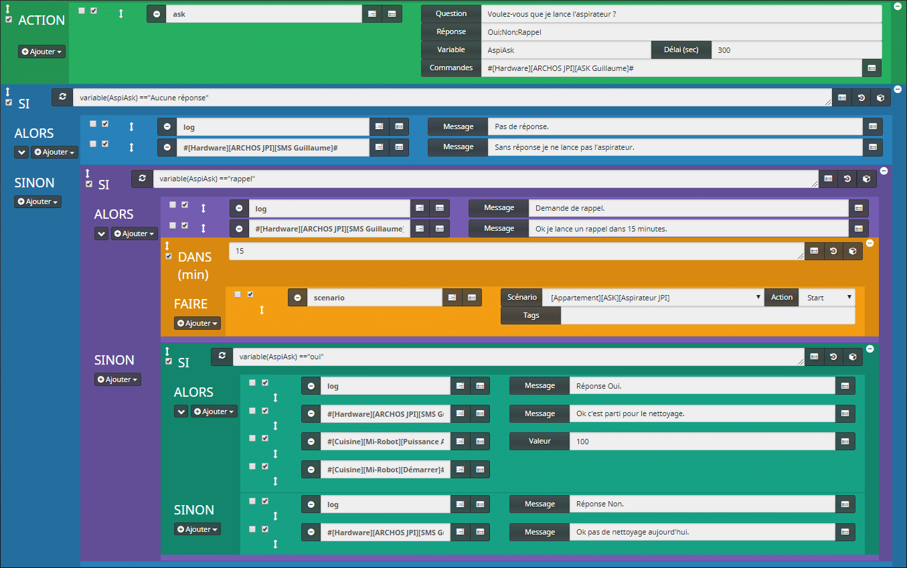
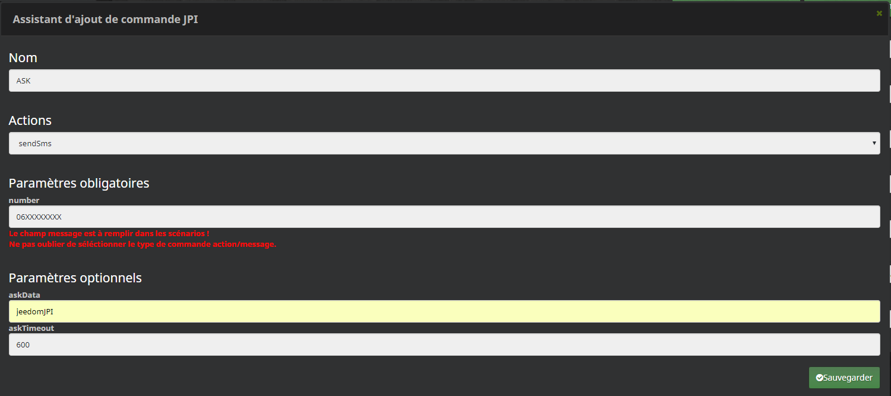
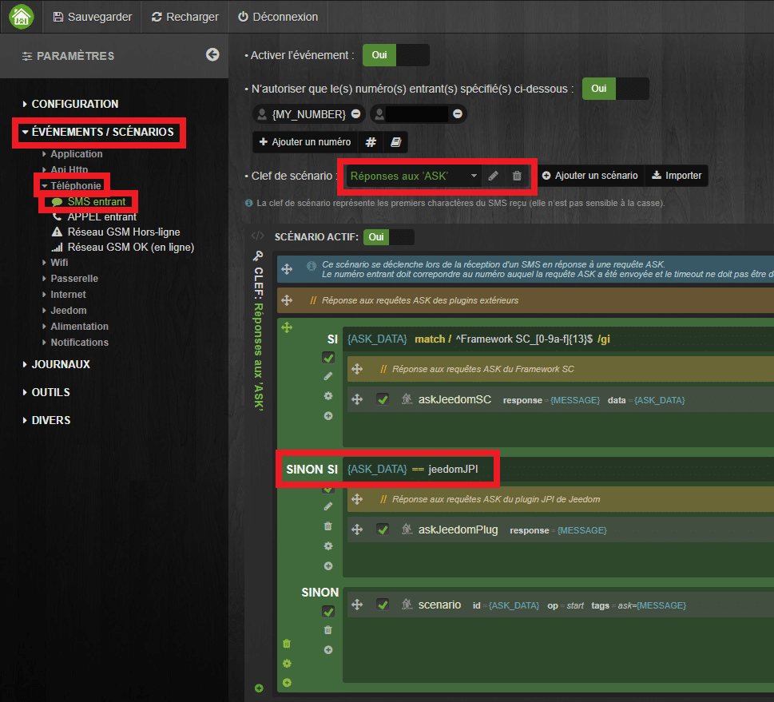

# Fonction ASK via le Plugin JPI

> On **demande** beaucoup de choses à notre **Jeedom,** mais si maintenant, c’était lui qui vous posait des **questions** ? C’est le principe de la **fonction ASK** que je vous propose aujourd’hui.
>
> Pour aborder cette fonction, nous aurons besoin de **JPI** et son **plugin** que nous avons déjà vus dans plusieurs articles, dont le dernier [Jeedom Paw Interface (JPI) APK et Plugin](/articles/jeedom-jeedom-paw-interface-jpi-apk-et-plugin).
>
> Selon votre installation, la fonction **ASK** peut être utilisée via le **TTS,** façon Jarvis, ou comme nous allons le voir dans l’article, par **SMS**.
>
> Dans notre exemple, **Jeedom** nous **demandera** si on souhaite **lancer** l’aspirateur **Mi-Robot** de Xiaomi et nous pourrons lui répondre « **Oui** » pour lancer le nettoyage, « **Non** » pour qui ne fasse rien, « **Rappel** » pour qu’il nous repose la question dans quelques minutes. En cas de non réponse il ne fera rien.

Si vous n’avez pas de **Mi-Robot** de Xiaomi, le **principe du scénario** sera exactement le même pour toute autre question, comme par exemple :

-   Dois-je éteindre les lumières ?
-   Dois-je activer l’alarme ?
-   Télé ou radio ?
-   Dois-je passer en mode Absent ?
-   C’est l’heure de #programme\_tv#. Dois-je le lancer ?



## Commandes de JPI

Avant de commencer le scénario, nous allons créer **2 commandes** dans le **plugin JPI :**ASK et SMS.


-   Aller dans **JPI**.
-   Sélectionner le téléphone qui enverra les **SMS** (Nécessite une carte SIM GSM.)
-   Dans l’onglet **Commandes**, cliquer sur « **Assistant de commande JPI**« .
-   Nom  : **ASK** ou **SMS**. _J’ajoute mon prénom après le nom de la commande, pour pouvoir en faire une par membre de la famille._
-   Action : **sendSms**.
-   Number : Le numéro de téléphone du **destinataire**.
-   AskData : **jeedomJPI**. Pour la commande ASK il faut ajouter cette variable pour que JPI sache que le SMS envoyé attend une réponse.
-   **Sauvegarder**.
-   **Changer** le type de la commande « **Défaut** » par « **Message**« .
-   **Sauvegarder**.



Si vous n’avez pas modifié les réglages par défaut du scénario « **Réponses aux ASK** » de **l’APK** de **JPI** sur le téléphone, vous devriez avoir en face de **ASK\_DATA**, la variable : **jeedomJPI** que nous avons saisi plus tôt.

Voila pour les réglages de JPI, maintenant on passe au scénario.

## MODE DU SCÉNARIO = PROVOQUÉ ou Programmé.

Le scénario sera, dans mon cas, provoqué par un autre scénario, en fonction de la présence, ou plutôt, de l’absence pour être précis. _(Un article est en cours de rédaction sur « La gestion de la présence ».)_ Vous pouvez donc provoquer le scénario comme bon vous semble, en fonction de vos besoins.

## ACTION : ASK

Pour commencer, il faut **sélectionner** la commande **ASK**.

-   Cliquer sur : **Ajouter un bloc.**
-   Sélectionner : **ACTION**.
-   **Enregistrer**.
-   Cliquer sur : **Ajouter**.
-   Sélectionner le mot clé : **Faire une demande.**

### Question : Voulez-vous que je lance l’aspirateur ?

La forme de la question n’a pas d’importance pour le bon déroulement de la fonction ASK.

### Réponse : Oui;Non;Rappel

Le champ réponse permet de connaître **les options disponibles** lors de l’envoi du **SMS** de **réponse**. Ces réponses seront entre parenthèses après la question.

### Variable : AspiAsk délais : 300 sec (5 minutes.)

-   La variable sera utilisée pour **interpréter** la **réponse** à la question dans le scénario. La réponse ne tient pas compte de la casse, vous pouvez, ou pas, mettre des majuscules aux réponses.
-   Le délais, en secondes, permet de renvoyer « **Aucune réponse** » en cas de **non réponse**. J’ai choisi de mettre 300 secondes (5 minutes), car si la question est envoyée lorsque je pars de chez moi, je ne veux pas devoir me dépêcher à répondre lorsque je suis au volant.

### Commandes : #\[Hardware\]\[ARCHOS JPI\]\[ASK Guillaume\]#

Pour finir de paramétrer l’action, il faut **sélectionner** la commande **ASK**, créé précédemment dans le **plugin JPI**.

Cette commande va envoyer un SMS avec la question et attendre une réponse.


Voila pour la **première partie du scénario**.

Maintenant, nous allons voir comment **activer les commandes** en fonction des réponses.

Le principe, c’est de faire un **bloc** pour chacune des **réponses** qui seront envoyées par **SMS** « **Oui, Non, Rappel** » et « **Aucune réponse** » qui sera générée automatiquement à la **fin du TimeOut** saisi dans le délais de la variable.

## SI variable(AspiAsk) == »oui » ALORS

## Commande : #\[Hardware\]\[ARCHOS JPI\]\[SMS Guillaume\]# Message : Ok c’est parti pour le nettoyage.

## Commande : #\[Cuisine\]\[Mi-Robot\]\[Démarrer\]#

Si le scénario reçoit la réponse « **oui**« , alors on envoie un **SMS** pour confirmer la **prise en compte** de l’information, puis on lance la commande pour **démarrer l’aspirateur Robot**.

### SINON SI variable(AspiAsk) == »non » ALORS

### Commande : #\[Hardware\]\[ARCHOS JPI\]\[SMS Guillaume\]# Message : Ok pas de nettoyage aujourd’hui.

Si le scénario reçoit la réponse « **non**« , alors on envoie un **SMS** pour confirmer la **prise en compte** de l’information et on **s’arrête** là.

#### SINON SI variable(AspiAsk) == »rappel » ALORS

#### Commande : #\[Hardware\]\[ARCHOS JPI\]\[SMS Guillaume\]# Message : Ok je lance un rappel dans 15 minutes.

#### DANS 15 FAIRE

#### Scénario : #\[Appartement\]\[ASK\]\[Aspirateur JPI\]# Start

Si le scénario reçoit la réponse « **rappel**« , alors on envoie un **SMS** pour confirmer la **prise en compte** de l’information et **15 minutes** plus tard, on **relance** le scénario et on recevra à nouveau la question.

##### SINON

##### Commande : #\[Hardware\]\[ARCHOS JPI\]\[SMS Guillaume\]# Message : Sans réponse je ne lance pas l’aspirateur.

Dans les cas ou on ne **réponds pas**, ou qu’on envoie une réponse qui ne fait pas partie des réponses traitées, alors on envoie un **SMS** pour être informé.

## Exemple de LOG 

```js
Demande[message] => Voulez-vous que je lance l'aspirateur ?[timeout] => 300[variable] => AspiAskRéponse ouiif ["oui" =="oui"] = Vrai[Hardware][ARCHOS JPI][SMS Guillaume] [message] => Ok c'est parti pour le nettoyage.[Cuisine][Mi-Robot][Démarrer]Fin correcte du scénario------------------------------------Demande[message] => Voulez-vous que je lance l'aspirateur ?[timeout] => 300[variable] => AspiAskRéponse nonif ["non" =="oui"] = Fauxelseif ["non" =="non"] = Vrai[Hardware][ARCHOS JPI][SMS Guillaume] [message] => Ok pas de nettoyage aujourd'hui.Fin correcte du scénario------------------------------------Demande[message] => Voulez-vous que je lance l'aspirateur ?[timeout] => 300[variable] => AspiAskRéponse rappelif ["rappel" =="oui"] = Fauxelseif["rappel" =="non"] = Fauxelseif ["rappel" =="rappel" ] = Vrai[Hardware][ARCHOS JPI][SMS Guillaume] [message] => Ok je lance un rappel dans 15 minutes.Tâche : programmé + 15 minFin correcte du scénario------------------------------------Demande[message] => Voulez-vous que je lance l'aspirateur ?[timeout] => 300[variable] => AspiAskRéponse Aucune réponseif ["Aucune réponse" =="oui"] = Fauxelseif ["Aucune réponse" =="non"] = Fauxelseif ["Aucune réponse" =="rappel" ] = Fauxelse[Hardware][ARCHOS JPI][SMS Guillaume] [message] => Sans réponse je ne lance pas l'aspirateur.Fin correcte du scénario
```

## Conclusion

La fonction ASK apporte **beaucoup** de **possibilités.** A vous maintenant de l’adapter à vos besoins, sans en abuser. Personnellement j’utilise les ASK seulement dans mes scénarios d’absence.
Sachez que pour pouvoir lancer **plusieurs ASK** en même temps, il faudra faire quelques **modifications** au niveau de **JPI (APK) ou du** **scénario**. On peut par exemple faire une variable **ASK\_En\_Cours** qui sera testée au **début** de chaque scénario ASK, avec un **Wait** jusqu’à ce que la variable soit vide.

Voilà pour la fonction **ASK avec le plugin JPI**, mais si vous utilisez le **plugin Script**, vous ne pourrez pas utiliser la fonction ASK des scénarios. Mais il est possible **d’adapter** le scénario, c’est ce que nous verrons dans un **prochain article**.

_Pour info en ce moment (08/12/2017) le **Mi-Robot** de Xiaomi est en vente flash à **266,15 €** depuis l’entrepôt européen. (Livraison en 2 à 7 jours)_
