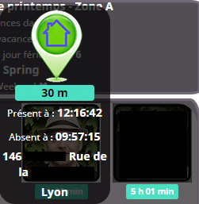
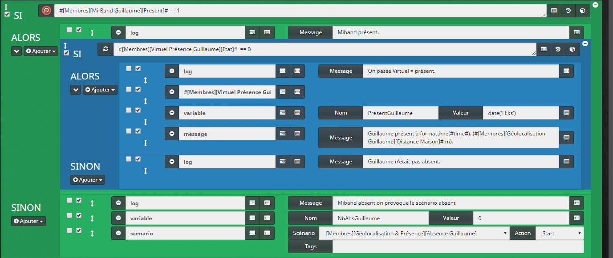
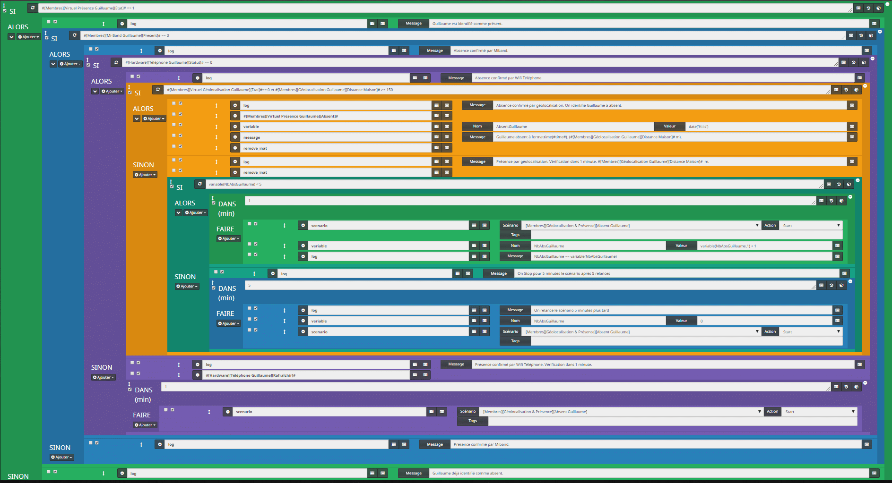
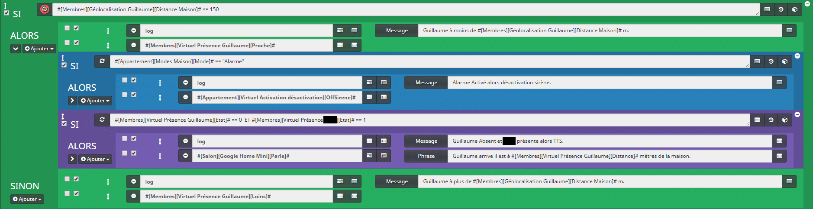
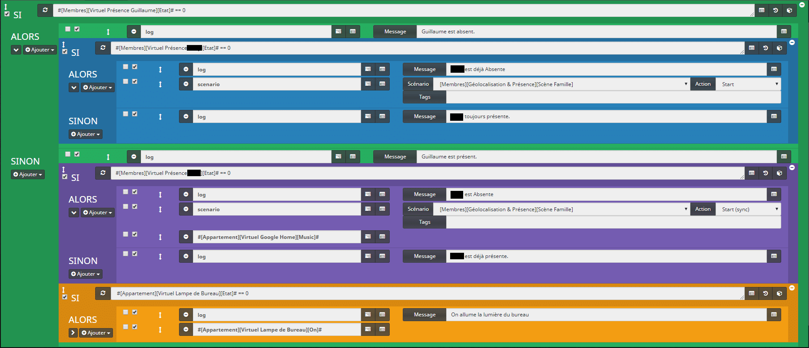
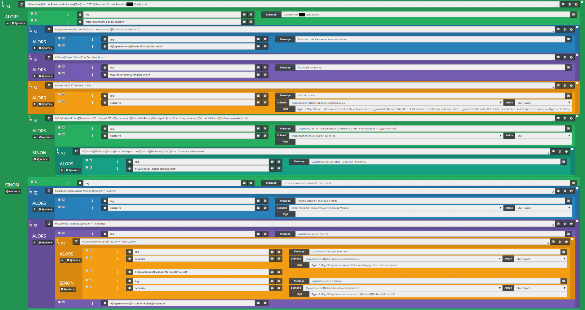
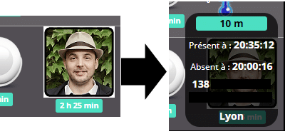
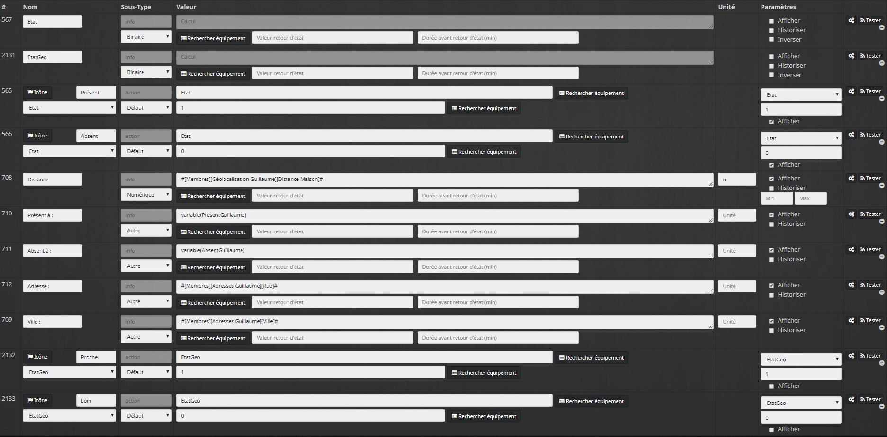

# Gestion de la présence avancées

Lorsqu’on parle de la présence, on peut parler de la **détection de mouvement dans une pièce**, avec un détecteur de mouvement comme nous l’avons vus dans l’article [Xiaomi Smart Home – Installation et configuration du détecteur de mouvement](/articles/installation-et-configuration-du-detecteur-de-mouvement-xiaomi), mais aussi, et c’est ce que nous allons voir aujourd’hui, **la présence ou l’absence d’une personne spécifique dans le logement**.

Il existe **plusieurs possibilités** pour **déterminer** la **présence.** Toutes ont leurs **avantages** et leurs **inconvénients.** C’est pour cela que j’ai voulu faire un système qui prend en compte **plusieurs solutions**.

Le but est de pouvoir **valider** la **présence** d’une personne sur **3 critères**, plutôt qu’un seul. **_Le bluetooth, le wifi et la géolocalisation._**

La gestion de la présence est une **fonction** très **intéressante** en **domotique**, à condition de pouvoir lui **faire confiance.** On peut alors imaginer plusieurs scénarios, comme par exemple :

- _Allumer la radio lorsque l’on rentre chez soit et l’éteindre lorsque l’on part, si il n’y a plus personne._
- _Lancer l’aspirateur robot lorsque l’on sort et le mettre en pause lorsque l’on rentre pour qu’il finisse lorsque l’on repart._
- _Ouvrir la porte du garage et allumer les lumières lorsque l’on est en approche du logement._



## Les prérequis pour la gestion de la présence dans Jeedom

Pour mettre en place une **gestion** de la **présence** **efficace** avec Jeedom, nous allons avoir **besoin** de **pas mal de choses**.

_Je pars du principe que vous avez déjà Jeedom, je ne vais pas expliquer comment installer les plugins que j’utilise, sinon l’article serait encore plus long qu’il ne l’est déjà._

Si vous n’avez **pas** tout le **matériel** dont je parle dans l’article, ce n’est pas très grave, vous pourrez **adapter** les **scénarios**, mais vous risquez de **perdre** en **précision** sur la détection de la présence.

### Le bluetooth et Jeedom

Le **bluetooth** à une très courte portée (même trop courte parfois), une dizaine de mètres, ce qui en fait un **détecteur** de **présence** assez **précis**. C’est pour cela que je l’utiliserai comme **déclencheur** **principal**.

#### Appareil Bluetooth portatif pour Jeedom

- _Ces appareils doivent toujours être avec vous pour indiquer votre présence ou votre absence à Jeedom._

Il existe différents **appareils** **bluetooth** permettant de **gérer** la **présence**, par exemple ma femme utilise un NUT Mini sous forme de porte clé et moi un Xiaomi Mi-Band 2.

- **Mi-band 2** : Ce sont des bracelets qui comptent les pas, mesurent la fréquence cardiaque, le sommeil, les calories brûlées, les distances parcourues, etc. L’avantage c’est qu’on les porte  toujours au poignet, ce qui est parfait pour la détection de la présence.

- **Nut**  : Si comme ma femme vous n’êtes pas adepte des bracelets connectés, vous pouvez utiliser des petits trackers comme les NUT qui peuvent s’utiliser en porte-clés.  A l’origine, ils sont fait pour localiser les objets perdus via une application sur smartphone.

Sachez que **beaucoup d’appareils bluetooth** (bracelets, [porte clé](https://amzn.to/2GDfKY4), montres, [tracker](https://amzn.to/2EmSQxO)…) sont **utilisables** pour la gestion de la **présence.** La seule contrainte, c’est que vous les ayez toujours avec vous.

Des accessoires Bluetooth comme des trackers ou des bracelets peuvent être retrouvés sur Amazon.

#### Antenne Bluetooth pour Jeedom

- _Elle servira de récepteur pour détecter la présence, ou non, d’un appareil bluetooth._

**L’antenne** peut être **intégrée** comme sur les **raspberry Pi 3**, ou **ajoutée** via une clé **USB** Bluetooth, comme sur les Raspberry Pi précédents.

La **portée** du bluetooth dépend de **l’environnement** du logement. De l**’épaisseur** et de la **composition** des murs, ou autres **éléments** **perturbateurs**, comme des structures **métalliques**, etc.

Il est possible et **conseillé** d’ajouter une ou plusieurs **antennes** **déportées**, à l’aide par exemple d’un [Raspberry pi W](https://amzn.to/2Jj3CsJ) comme nous l’avons vu dans cet article : [Jeedom – BLEA sur Raspberry pi Zero W](/articles/blea-sur-raspberry-pi-zero-w).

L’intérêt des **antennes déportées** est **d’augmenter** la **portée** du **bluetooth** pour couvrir tout le logement.

Des modèles de Raspberry Pi compatibles sont également disponibles sur Amazon.

#### Plugin Jeedom Bluetooth Advertisement (BLEA)

- _Le plugin permet à Jeedom de gérer la présence des appareils bluetooth._

Si vous avez lu mes articles [Xiaomi Yeelight – Lampe de chevet](/articles/lampe-de-chevet-xiaomi-yeelight) et [Jeedom – BLEA sur Raspberry pi Zero W](/articles/blea-sur-raspberry-pi-zero-w) vous connaissez le **plugin BLEA**, qui en plus de **contrôler** certains **appareils** comme la lampe de chevet Xiaomi, **gère** la **présence** de presque tout les **appareils bluetooth**.

_Le plugin est développé par [Sarakha63](http://sarakha63-domotique.fr/blea-plugin-bluetooth-jeedom/) et en plus il est gratuit. Si ce n’est pas déjà fait je vous invite à lire [son article](http://sarakha63-domotique.fr/blea-plugin-bluetooth-jeedom/) pour l’installation ._

### Le Wifi et Jeedom

Le **wifi** à une **meilleur portée** que le bluetooth, si on capte le wifi du logement, c’est qu’on est **proche** du logement, mais **pas** forcement à **l’intérieur**.

#### Appareil Wifi portatif pour Jeedom

- _Il faut un appareil wifi qui est toujours avec vous et connecté, pour indiquer votre présence ou votre absence à Jeedom._

Vous l’aurez compris, on parle ici d’un **smartphone**.

#### Routeur wifi

- _Le routeur ou la box internet serviront à connecter un appareil wifi au réseau local._

Un bon **routeur** avec un wifi **puissant** permettra d’avoir une **meilleure** gestion de la **présence**. Chez moi, j’ai une Livebox pour la Fibre optique, mais tout ce qui est **réseau local**, est géré par un **[routeur ASUS RT-AC88U](https://amzn.to/2GC3Eyn)**, je vous invite à lire cet article pour plus d’informations : [Routeur ASUS RT-AC88U – Livebox 4](/articles/routeur-asus-rt-ac88u-livebox-4).

Si vous n’avez **pas** prévu d’investir dans un **routeur**, mais que votre wifi ne couvre pas tout votre logement vous pouvez utiliser des petits **amplificateur Wifi** comme le Xiaomi Mi WiFi 300M Amplifier 2 à moins de 10€.

Des amplificateurs Wi‑Fi Xiaomi peuvent être trouvés sur Amazon.

#### Plugin Jeedom Network

- _Il servira à gérer la présence des appareils Wifi dans Jeedom._

Le plugin est développé par Loic (Créateur de Jeedom) et il est gratuit également. Il permet de faire un **ping** sur n’importe quel **appareil** connecté au réseau.

Pour l’installation, la doc officiel suffit amplement : [Plugin-networks](https://jeedom.github.io/plugin-networks/fr_FR/).

### La géolocalisation et Jeedom

La **géolocalisation** à une précision d’une **centaine de mètres,** ce qui est bien pour savoir si une personne est en **approche** du logement.

_Grâce au GPS présent dans les téléphones portable, on peut connaitre la position des personnes même à plusieurs kilomètres._

#### Applications Android pour Jeedom

- *Voila 2 exemples d’applications Android permettant d’envoyer votre position à Jeedom.* 
  - **JeeBud** : [https://play.google.com/store/apps/jeebudv3](https://play.google.com/store/apps/details?id=eebud.com.jeebudv3&hl=fr)  A privilégier si on veut **seulement** gérer la **géolocalisation**.
  - **Domo Widget** : [https://play.google.com/store/apps/domowidget](https://play.google.com/store/apps/details?id=illimiteremi.domowidget&hl=fr) En plus de la **géolocalisation** on peut ajouter des **widgets** pour Jeedom sur le bureau du smartphone.

#### Plugin Jeedom de géolocalisation

- _Voila 2 exemples de plugins permettant à Jeedom de traiter les informations de géolocalisation._
  - **Geoloc** : [https://jeedom.github.io/plugin-geoloc/fr_FR/](https://jeedom.github.io/plugin-geoloc/fr_FR/) Simple et efficace je l’utilise pour **récupérer les coordonnées GPS** des membres et **calculer** la distance avec le logement.
  - **Geotrav** : [https://jeedom.github.io/documentation/third_plugin/geotrav/fr_FR/index.html](https://jeedom.github.io/documentation/third_plugin/geotrav/fr_FR/index.html) Moins efficace que le précédent (avis personnel après quelques tests) j’ai gardé ce plugin simplement pour **convertir** les **coordonnées** GPS en **adresses**.

## Les scenarios de gestion de la présence dans Jeedom

Les scenarios vont nous permettre **d’interagir** sur ces **différents** **éléments** (Bluetooth, Wifi et Géolocalisation) afin de **déterminer** le plus précisément possible la **présence ou non** d’une personne et **d’exécuter** des **actions** en conséquences.

Ils peuvent être plus ou moins long en fonction de ce que vous voulez automatiser. Je vous propose là, quelques exemples, mais libre à vous d’adapter les scénarios à vos besoins.

_Certains scénarios sont spécifique à un membre et d’autres sont commun à toute la famille._

- [**\[Présent Membre\]**](<#présent-membre>) : C’est le scénario qui détermine la **présence ou non d’un membre** de la famille.
  - _Il est déclenché par un appareil bluetooth (Bracelet, NUT, iTag…)._
- [**\[Absent Membre\]**](<#absent-membre>) :  C’est le scénario qui **valide l’absence d’un membre** de la famille. Il va faire la **triple vérification d’absence** (Bluetooth, Wifi et Géolocalisation).
  - _Il est déclenché par le scénario [**\[Présent Membre\]**](<#présent-membre>)._
- [**\[Géolocalisation Membre\]**](#géolocalisation-membre) : Ce scénario permet d’informer Jeedom qu’un **membre** est en **approche**, mais pas encore présent et donc d’automatiser des scènes.
  - _Ouvrir la porte du garage, allumer les lumières extérieures, prévenir par TTS de l’arrivé d’une personne s’il y a déjà quelqu’un à la maison…_
- **[\[Scène Membre\]](<#scène-membre>)** : C’est le scénario qui va permettre l’automatisation de **scènes spécifiques pour un membre**.
  - _Allumer la lumière du bureau, seulement lorsque c’est Membre X qui rentre…_
- [**\[Scène Famille\]**](#scène-famille) : Ce scénario à la même fonction d’automatisation de scènes que le scénario précédent, mais il est **commun à tous les membres**.
  - _Activer et désactiver l’alarme, éteindre les lumières et la musique, lorsqu’il n’y a plus personne à la maison…_

Tout au long de l’article, il faudra remplacer **« Membre »**, **« Membre1 »**, **« Membre2 »** par le nom des membre de votre famille, animaux y compris 🙂

_**Info** : Je vous conseille de faire d’abord un scénario pour vous et une fois qu’il sera bien en place, de le dupliquer pour un autre membre de la famille et ainsi de suite pour chacun des membres._

### Scénario : **\[Présent Membre\]**



Le scénario sur l’image et un peu différent de celui de l’article.

Le scénario est **déclenché** par la **présence** ou **l’absence** d’un appareil **bluetooth,** Mi-Band dans l’exemple.

**L’état** des appareils bluetooth étant **vérifié** à **intervalles** réguliers, il faut bien **cocher** l’option de **« Non exécution pour cause de répétition »** sur le **premier** **SI** du scénario, cercle rouge à gauche de la commande, afin de **lancer** le scénario, **seulement** sur le **changement** d’état.

_Ce scénario est volontairement court pour qu’il s’exécute rapidement afin de déterminer au plus vite la présence d’une personne via un virtuel, ou de lancer le scénario de vérification d’absence [**\[Absent Membre\]**](<#absent-membre>) qui lui, est plus long, mais qui demande moins de réactivité._

**SI #\[Membres\]\[Mi-Band Membre\]\[Present\]# == 1 ALORS**

**log : Miband présent.**

Si l’appareil **bluetooth** est détecté comme **présent**, alors on rentre dans la boucle pour **valider** la **présence** du membre.

**SI #\[Membres\]\[Virtuel Présence Membre\]\[Etat\]# == 0 ALORS**

**log : On passe le virtuel à présent.**

**Action : #\[Membres\]\[Virtuel Présence Membre\]\[Présent\]#**

**variable : Nom : PresentMembre Valeur : date(‘H:i:s’)**

**message : Membre présent à formattime(#time#). (#\[Membres\]\[Géolocalisation Membre\]\[Distance Maison\]# m).**

Le virtuel binaire **« Etat / présent(1) / absent(0) «**   appelé **[\[Virtuel Présence Membre\]](#virtuel-virtuel-presence-membre)** permet de connaitre l’état de présence du membre.

Si le virtuel  **[\[Virtuel Présence Membre\]](#virtuel-virtuel-presence-membre)** est à 0 (absent), alors on modifie l’état du virtuel pour indiquer que le membre est à nouveau présent (1).

Le changement d’état du virtuel **[\[Virtuel Présence Membre\]](#virtuel-virtuel-presence-membre)** va déclencher le scénarios **[\[Scène Membre\]](<#scène-membre>)**.

Ce test permet d’éviter les erreurs en cas de perte momentanée du signal du bracelet, malgré que le membre soit toujours dans le logement, mais hors de porté de l’antenne bluetooth.

On enregistre l’heure dans une variable qui sera visible dans le virtuel **[\[Virtuel Présence Membre\]](#virtuel-virtuel-presence-membre)** et on envoi un message dans le centre de message de Jeedom (**Membre présent à 18h58. (20 m).**), c’est utile pour le débogage.

**SINON**

**log : Membre n’était pas absent.**

Le virtuel indique que le membre est déjà présent, il y a donc eu une perte de signal du bracelet, ou alors le membre est rapidement sorti et rentré avant d’avoir été validé comme absent. On ne fait rien dans ce cas, si ce n’est un log pour le débogage.

**SINON**

**log : Miband absent on provoque le scénario absent**

**variable : Nom : NbAbsMembre Valeur : 0**

**scenario : #\[Membres\]\[Géolocalisation & Présence\]\[Absent Membre\]# Action : start**

Si le scénario est déclenché par l’absence du bracelet Mi band (0), alors on lance le scénario [**\[Absent Membre\]**](<#absent-membre>) qui va faire la triple vérification avant de passer le virtuel à absent.

La variable **« NbAbsMembre »** est mise à 0, elle sera utile dans le scénario d’absence.

### Scénario : **\[Absent Membre\]**



Le scénario sur l’image et un peu différent de celui de l’article.

Le scénario est **déclenché** par le **scénario** précédent **[\[Présent Membre\]](<#présent-membre>),** ou par **lui même.** On ne met rien dans l’événement déclencheur.

Ce scénario va faire les différentes **vérifications** nécessaires pour **valider** **l’absence** d’un membre et une fois cette absence **confirmée**, le virtuel **[\[Virtuel Présence Membre\]](#virtuel-virtuel-presence-membre)** passera à absent.

**SI #\[Membres\]\[Virtuel Présence Membre\]\[Etat\]# == 1 ALORS**

**log : Membre est identifié comme présent.**

Le but de ce scénario est de passer l’état du virtuel **[\[Virtuel Présence Membre\]](#virtuel-virtuel-presence-membre)** de présent, à absent. Donc, on vérifie si le membre est absent ou présent.

**SI #\[Membres\]\[Mi-Band Membre\]\[Present\]# == 0 ALORS**

**log : Absence confirmé par Miband.**

Même si la vérification de l’absence du bracelet à déjà été faite dans le scénario [**\[Présent Membre\]**](<#présent-membre>), on refait le test, car le scénario peut s’auto-provoquer.

**SI #\[Hardware\]\[Téléphone Membre\]\[Statut\]# == 0 ALORS**

**log : Absence confirmée par Wifi Téléphone.**

Voila le deuxième test de présence, le wifi du téléphone. Mais Il arrive que le wifi du téléphone soit parfois désactivé, sa fiabilité est donc toute relative.

**SI #\[Membres\]\[Virtuel Présence Membre\]\[EtatGeo\]#== 0 ALORS**

**log : Absence confirmé par géolocalisation. Virtuel présence Membre à absent.**

**Action : #\[Membres\]\[Virtuel Présence Membre\]\[Absent\]#**

**variable : Nom : AbsentMembre Valeur : date(‘H:i:s’)**

**message : Membre absent à formattime(#time#). (#\[Membres\]\[Géolocalisation Membre\]\[Distance Maison\]# m).**

**Action : remove_inat**

Pour finir,nous avons le troisième test de présence, la géolocalisation. On ne fait pas directement un test sur la distance, on utilise simplement l’état du virtuel **[\[Virtuel Présence Membre\]](#virtuel-virtuel-presence-membre)\*\***,** mais cette fois, avec l’état **\[EtatGeo\]** qui est mise à jour grâce au scénario [**\[Géolocalisation Membre\]**](#géolocalisation-membre)**.\*\* L’état de la géolocalisation est réglé sur 150 mètres pour passer d’un état Proche (1) à un état Loin (0).

Si l’état de la géolocalisation est à 0, alors le membre est vraiment absent. On passe donc le virtuel **[\[Virtuel Présence Membre\]](#virtuel-virtuel-presence-membre)** à absent.

Comme précédemment, on enregistre l’heure dans une variable qui sera visible dans le virtuel **[\[Virtuel Présence Membre\]](#virtuel-virtuel-presence-membre)** et on envoie un message dans le centre de message de Jeedom (**Membre absent à 18h27. (310 m).**) pour le débogage.

Le remove_inat permet de supprimer les taches programmées du scénario.

**SINON**

**log : Présence par géolocalisation. Vérification dans 1 minute. #\[Membres\]\[Géolocalisation Membre\]\[Distance Maison\]# m.**

**Action : remove_inat**

Dans le cas ou la géolocalisation ne confirme pas l’absence, malgré le bluetooth et le wifi, on relance la vérification toutes les minutes pendant 5 minutes, puis on fait une pause de 5 minutes, avant de recommencer la vérification.

Il peut arriver parfois qu’on reste à moins de 150 mètres de la maison et donc que l’état de géolocalisation reste à « présent ». Cela peut arriver le temps de sortir la voiture du garage ou de discuter avec un voisin par exemple.

**SI variable(NbAbsMembre) < 5 ALORS**

C’est la variable que nous avions mise à 0 dans le scénario [**\[Présent Membre\]**](<#présent-membre>) qui va nous permettre de savoir combien de fois on a vérifié la géolocalisation. Si c’est moins de 5 fois, on continue.

**DANS 1 (MIN)**

**variable : Nom : NbAbsMembre Valeur : variable(NbAbsMembre,1) + 1**

**scénario** **: #\[Membres\]\[Géolocalisation & Présence\]\[Absent Membre\]# Action : start**

**log : NbAbsMembre == variable(NbAbsMembre)**

On relance simplement le scénario au bout d’une minute. L’avantage, c’est que l’on refait le triple test à chaque fois, d’ou l’importance de revérifier le bluetooth au début du scénario.

Il faut aussi incrémenter de 1 la variable **NbAbsMembre**, pour bloquer le test au bout des 5 vérifications.

**SINON**

**log : On Stop pour 5 minutes le scénario après 5 relances**

Apres 5 minutes (5 fois 1 minute) de test, si la géolocalisation ne confirme toujours pas l’absence, alors on fait une pause de 5 minutes avant de recommencer.

**DANS 5 (MIN)**

**log : On relance le scénario 5 minutes plus tard**

**variable : Nom : NbAbsMembre Valeur : 0**

**scenario : #\[Membres\]\[Géolocalisation & Présence\]\[Absent Membre\]# Action : start**

Au bout de 5 minutes, on réinitialise la variable et on recommence les tests en relançant le scénario. Il est aussi possible d’utiliser la [fonction ASK](/articles/jeedom-scenario-fonction-ask-via-jpi-plugin) à cet endroit, pour recevoir un SMS indiquant que la géolocalisation du membre ne permet pas de valider son absence et donc de le faire manuellement.

**SINON**

**log : Présence confirmée par Wifi Téléphone. Vérification dans 1 minute.**

**Action : #\[Hardware\]\[Téléphone Membre\]\[Rafraîchir\]#**

**DANS 1 (MIN)**

**scenario : #\[Membres\]\[Géolocalisation & Présence\]\[Absent Membre\]# Action : start**

```js
Si, lors du test du wifi la présence est confirmée, alors, on relance le scénario 1 minute plus tard.
```

**SINON**

**log : Présence confirmé par Miband.**

**Action : remove_inat**

Dans le cas ou le bluetooth indique présent, on arrête les vérifications, car on ne souhaite plus passer le membre à absent. On supprime les taches éventuelles.

**SINON**

**log : Membre déjà identifié comme absent.**

Théoriquement, on ne devrait jamais arriver ici, car le scénario déclencheur [**\[Présent Membre\]**](<#présent-membre>) vérifie aussi l’état du virtuel **[\[Virtuel Présence Membre\]](#virtuel-virtuel-presence-membre),** avant de provoquer ce scénario.

### Scénario : **\[\*\***Géolocalisation\*\* **Membre\]**



Ce scénario permet de définir **l’éloignement** d’un membre par rapport au **logement.** C’est le test qui va **confirmer** l’absence **réelle** d’un membre, après le **bluetooth** et le **wifi**. Il va aussi indiquer à Jeedom qu’un **membre** est en **approche** du logement.

Le scénario est **déclenché** par la **distance entre le membre et le logement**. Cette information est renvoyée par le **plugin GeoLoc** qui gère la **géolocalisation**.

La distance étant **mise à jour régulièrement** en fonction des déplacements du membre, il faut bien **cocher** l’option de **« Non exécution pour cause de répétition »** sur le **premier SI** du scénario, **cercle rouge** à coté de la commande, afin **de n’exécuter** le scénario **seulement** si le membre passe de **moins** 150 mètres à **plus** de 150 mètres, ou **inversement**.

Ce scénario peut être assez court si on veut seulement changer l’état d’un membre, mais on peut aussi ajouter des fonctions comme par exemple, ouvrir le garage, allumer les lumières extérieures, lever les volets, lorsque le membre est en approche du logement.

**SI #\[Membres\]\[Géolocalisation Membre\]\[Distance Maison\]# <= 150 ALORS**

**log : Membre à moins de #\[Membres\]\[Géolocalisation Membre\]\[Distance Maison\]# m.**

**Action : #\[Membres\]\[Virtuel Présence Membre\]\[Proche\]#**

Si le membre est à une distance d’au moins 150 mètres, alors on modifie l’état **\[EtatGeo\]** du virtuel **[\[Virtuel Présence Membre\]](#virtuel-virtuel-presence-membre)** à **\[Proche\].** Cette action ne provoquera pas de scénario dans notre exemple, car les actions à effectuer lors de l’approche d’un membre seront directement exécutées dans ce même scénario. Mais il est possible de déporter ces actions dans un scénario spécifique.

**SI #\[Appartement\]\[Modes Maison\]\[Mode\]# == « Alarme » ALORS**

**log : Alarme Activé alors désactivation sirène.**

**Action : #\[Appartement\]\[Virtuel Activation désactivation\]\[OffSirene\]#**

Voila un exemple d’action que l’on peut effectuer lors de l’approche d’un membre. Si le mode alarme est activé, alors on désactive la sirène.

Le but est que l’alarme ne sonne pas, si elle ne se désactive pas automatiquement lorsqu’un membre entre dans le logement. On pourrait aussi désactiver l’alarme de la zone garage et extérieure.

**SI #\[Membres\]\[Virtuel Présence Membre X\]\[Etat\]# == 0 ET #\[Membres\]\[Virtuel Présence Membre Y\]\[Etat\]# == 1 ALORS**

**log : Membre X Absent et Membre Y présente alors TTS.**

**Action : #\[Salon\]\[Google Home Mini\]\[Parle\]# Phrase : Membre X arrive il est à #\[Membres\]\[Virtuel Présence Membre X\]\[Distance\]# mètres de la maison.**

```js
Si le membre X est absent et que le membre Y est présent, alors on fait une annonce TTS pour annoncer l’arrivée du membre X.
```

On peut ajouter plusieurs actions ou fonctions au scénario suivent ses besoins. Dans le cas d’un grand nombre d’actions, je vous conseille d’utiliser un scénario dédié, provoqué par le changement d’état **\[EtatGeo\]** du virtuel **[\[Virtuel Présence Membre\]](#virtuel-virtuel-presence-membre)**.

**SINON**

**log : Membre à plus de #\[Membres\]\[Géolocalisation Membre\]\[Distance Maison\]# m.**

**Action : #\[Membres\]\[Virtuel Présence Membre\]\[Loin\]#**

Si le membre est à une distance de plus de 150 mètres, alors on modifie l’état **\[EtatGeo\]** du virtuel **[\[Virtuel Présence Membre\]](#virtuel-virtuel-presence-membre)** à **\[Loin\]\*\***.\*\* Cette action ne provoquera pas de scénario, mais sera utilisable dans différents autres scénarios.

### Scénario : **\[\*\***Scène Membre\]\*\*



Ce scénario permet de lancer des actions personnalisées lors de la présence, ou de l’absence, d’un membre. Pour les actions communes à tout les membres, on utilisera le scénario [**\[Scène Famille\]**](#scène-famille).

Le scénario est déclenché par le changement d’état, présent ou absent, du virtuel **[\[Virtuel Présence Membre\]](#virtuel-virtuel-presence-membre)\*\***.\*\*

**SI #\[Membres\]\[Virtuel Présence Membre\]\[Etat\]# == 0 ALORS**

**log : Membre est absent.**

```js
Si le membre est absent, alors on Log son état, avant de lancer les actions à effectuer lors de son absence.
```

**SI #\[Membres\]\[Virtuel Présence Membre Y\]\[Etat\]# == 0 ALORS**

**log : Membre Y est déjà Absent**

**Scénario** **: #\[Membres\]\[Géolocalisation & Présence\]\[Scène Famille\]# Action Start**

**SINON**

**log : Membre Y est toujours présent.**

Dans un premier temps, on vérifie la présence, ou non, d’un autre membre dans le logement. Dans cet exemple, s’il n’y a personne, on lance le scénario [**\[Scène Famille\].**](#scène-famille) Sinon on ne fait rien**.** Libre à vous d’ajouter les actions en fonction de vos besoins.

**SINON**

**log : Membre est présent.**

```js
Si le membre est présent, alors on Log son état, avant de lancer les actions à effectuer en cas de présence.
```

**SI #\[Membres\]\[Virtuel Présence Membre Y\]\[Etat\]# == 0 ALORS**

**log : Membre Y est Absent.**

**Scénario** **: #\[Membres\]\[Géolocalisation & Présence\]\[Scène Famille\]# Action Start(sync)**

**Action : #\[Appartement\]\[Virtuel Google Home\]\[Music\]#**

**SINON**

**log : Membre Y est déjà présent.**

Comme lors de l’absence, on vérifie la présence, ou non, d’un autre membre dans le logement. Dans cet exemple, s’il n’y a personne, on lance le scénario [**\[Scène Famille\]**](#scène-famille) en mode synchrone, pour que la, ou les actions suivantes, ne soient lancées que lorsque le scénario [**\[Scène Famille\]**](#scène-famille) aura été complètement exécuté. Ensuite, on lance l’action, en l’occurrence la musique sur Google Home. Par contre, s’il y a un autre membre dans le logement, on ne fait rien**.** Libre à vous d’ajouter les actions en fonction de vos besoins.

**SI #\[Appartement\]\[Virtuel Lampe de Bureau\]\[Etat\]# == 0 ALORS**

**log : On allume la lumière du bureau.**

**Action : #\[Appartement\]\[Virtuel Lampe de Bureau\]\[On\]#**

Pour ce dernier exemple, on ne vérifie pas la présence d’un autre membre. L’action est exécutée à chaque fois que le membre est à nouveau présent. Libre à vous d’ajouter les actions en fonction de vos besoins.

### Scénario : \[**Scène Famille\]**



Ce scénario permet de lancer des actions en fonction de la présence, ou de l’absence, de tous les membres.

_Pour les actions spécifiques à un membre, on utilisera les scénarios **[\[Scène Membre\]](<#scène-membre>)** qui déclencheront ce scénario**.**_

**SI #\[Membres\]\[Virtuel Présence Membre X\]\[Etat\]# == 0 ET #\[Membres\]\[Virtuel Présence Membre Y\]\[Etat\]# == 0 ALORS**

**log : Membre X et Membre Y sont absent.**

**Action :#\[Hardware\]\[Mi-Box JPI\]\[home\]#**

```js
Si tous les membres sont absents, alors on Log avant le lancer les actions à effectuer. La première action, c’est de mettre ma Mi-Box TV sur Home, pour couper d’éventuelles lectures en cours via Google Home, YouTube, Google Music…
```

**SI #\[Appartement\]\[Virtuel Activation désactivation\]\[EtatAutoAlarme\]# == « 1 » ALORS**

**log : Activation de l’alarme car en Automatique.**

**Action :#\[Appartement\]\[Modes Maison\]\[Alarme\]#**

Pour ce premier exemple, l’alarme s’active si elle est réglée sur automatique.

**SI #\[Salon\]\[Player Salon\]\[Etat Decodeur\]# == 1 ALORS**

**log : TV allumé on l’éteint.**

**Action :#\[Salon\]\[Player Salon\]\[ON-OFF\]#**

Dans cet exemple, on éteint la Livebox TV, si elle est restée allumée.

**SI #time#>=800 ET #time# <1300 ALORS**

**log : Infos du matin.**

**Scénario** **: #\[Appartement\]\[Notifications\]\[Notifications 2.0\]# Action : Start (sync)**

**Tags : Type=0 Msg= »Chambre 1= #\[Chambre 1\]\[Capteur Température Hygrométrie\]\[Température\]#°C et #\[Chambre 1\]\[Capteur Température Hygrométrie\]\[Humidité\]# %. Chambre 2= #\[Chambre 2\]\[Capteur Température Hygrométrie\]\[Température\]#°C et #\[Chambre 2\]\[Capteur Température Hygrométrie\]\[Humidité\]# %. Salon = #\[Salon\]\[ThemoHydroDigital\]\[Température\]#°C et #\[Salon\]\[ThemoHydroDigital\]\[Humidité\]# %. Extérieur= #\[Extérieur\]\[Capteur Température Hygrométrie\]\[Température\]#°C et #\[Extérieur\]\[Capteur Température Hygrométrie\]\[Humidité\]# %. »**

Ici, si on est entre 8:00 et 13:00, alors on envoie un SMS vie les scénario **[\[Notifications 2.0\]](/articles/jeedom-scenario-notifications-avancees)** avec les informations de température et d’hydrométrie de la maison.

**SI #\[Cuisine\]\[Mi-Robot\]\[Statut\]# == « Au Repos » ou #\[Cuisine\]\[Mi-Robot\]\[Statut\]# == « Chargeur déconnecté » ALORS**

**log : L’aspirateur est au repos (Pause) on le relance.**

**Action : #\[Cuisine\]\[Mi-Robot\]\[Démarrer\]#**

```js
Si l’aspirateur Robot est en pause, c’est à dire « Repos ou Déconnecté », alors on le redémarre.
```

**SINON**

**SI #\[Cuisine\]\[Mi-Robot\]\[Statut\]# == « En charge » ET (#\[Appartement\]\[Virtuel Mi-Robot\]\[Fini depuis :\]# >= 12 ou #\[Appartement\]\[Virtuel Mi-Robot\]\[Surface nettoyée\]# < 10) ALORS**

**log : L’aspirateur est en charge depuis 12 heures ou que le nettoyage est < 10m² alors on demande.**

\***\*Scénario** : #\[Appartement\]\[ASK\]\[Aspirateur Script\]# Action : Start\*\*

```js
Si l’aspirateur n’est pas en pause, alors on vérifie qu’il soit bien à sa station de recharge et également si un nettoyage de plus de 10 m² à eu lieu dans les 12 dernières heures.
```

_Je fais ce test, car il arrive qu’on utilise l’aspirateur pour une petite surface (<10m²) en nettoyage ciblé, ou dans une pièce fermée comme la salle de bain et je ne veux pas que cela bloque le nettoyage._

L’aspirateur ne démarre pas automatiquement, mais seulement via un SMS en réponse au scénario ASK, pour plus d’info voir [Jeedom Scénario – Fonction ASK via JPI Plugin](/articles/jeedom-scenario-fonction-ask-via-jpi-plugin).

**SINON**

**log : Un des membre de la famille est présent.**

```js
Si un des membres est présent, alors on Log avant le lancer les actions à effectuer.
```

**SI #\[Appartement\]\[Modes Maison\]\[Mode\]# == « Alarme » ALORS**

**log : Alarme activé on change de mode.**

\***\*Scénario** : #\[Informations\]\[Programmation\]\[Réglage Modes\]# Action : Start\*\*

A l’inverse maintenant, on désactive l’alarme dès qu’un membre est à nouveau présent.

_Ici, j’utilise un scénario qui me permet de mettre le bon mode en fonction de l’heure et du jour, mais on pourrait très bien forcer le mode Journée._

**SI #\[Cuisine\]\[Mi-Robot\]\[Statut\]# != « En charge » ALORS**

**log : L’aspirateur est en marche.**

A présent, on vérifie si l’aspirateur est en charge ou pas (signe différent de !=). Si il ne l’est pas, alors on rentre dans la boucle.

**SI #\[Cuisine\]\[Mi-Robot\]\[Erreur\]# == « Tout va bien » ALORS**

**log : L’aspirateur n’est pas en erreur.**

**Scénario** **: #\[Appartement\]\[Notifications\]\[Notifications 2.0\]# Action : Start (sync)**

**Tags : Type=2 Msg= »L’aspirateur n’a pas fini son nettoyage, il se mets en pause. »**

**Action : #\[Appartement\]\[Virtuel Mi-Robot\]\[Pause\]#**

Si l’aspirateur n’est pas en erreur, alors on envoie une notification TTS via le scénario **[\[Notifications 2.0\]](/articles/jeedom-scenario-notifications-avancees)** et on met l’aspirateur en pause.

**SINON**

**log : L’aspirateur à un problème, notification vocal.**

**Scénario** **: #\[Appartement\]\[Notifications\]\[Notifications 2.0\]# Action : Start (sync)**

**Tags : Type=2 Msg= »L’aspirateur est en erreur : #\[Cuisine\]\[Mi-Robot\]\[Erreur\]# »**

En cas d’erreur de l’aspirateur, j’envoie aussi une notification TTS via le scénario **[\[Notifications 2.0\]](/articles/jeedom-scenario-notifications-avancees)**.

**Action : #\[Appartement\]\[Virtuel Mi-Robot\]\[Trouver\]#**

Pour finir, on exécute l’action « trouver l’aspirateur », pour savoir ou il se trouve, qu’il soit en pause ou en erreur.

_Il faut faire bien attention de mettre les actions aux bons endroits, pour ne pas risquer d’arrêter la TV ou d’activer l’alarme, à chaque fois que quelqu’un devient absent, même si quelqu’un est encore présent._

## Virtuels et Widgets Jeedom



Pour les virtuels et les widgets, c’est vraiment un choix personnel, en fonction de son design et de ce que l’on veut avoir comme informations sur le dashboard.

### Virtuel : \[Virtuel Présence Membre\]



Vous avez vu tout au long des scénarios que le virtuel **\[Virtuel Présence Membre\]** est souvent utilisé. Il permet d’avoir **l’état de présence et de géolocalisation des membres.**

- **Etat (Indispensable) :** C’est la **commande principale du virtuel**. Elle est **indispensable** pour le bon fonctionnement des scenarios. Elle permet de savoir si le **membre est présent (1) ou absent (0)**. Elle sera créé **automatiquement** lors de **l’enregistrement** des commandes action **« Présent » et « Absent »**.
  - **Sous-type :** Info / Binaire.
  - **Valeur :** Calcul.
- **Présent (Indispensable) :** Cette commande action est **indispensable** elle permet de changer **l’état de présence du virtuel à présent (1)**. Il faut bien **saisir « Etat »** dans le champ **valeur** lors de la **création** et après l’enregistrement **affecter « Etat »** à la commande valeur par défaut.
  - **Sous-type :** Action/ Défaut.
  - **Valeur :**
    -  Etat.
    - 1.
  - **Paramètres :**
    - Etat.
    - 1.
    - Afficher. _A cocher seulement si vous voulez pouvoir changer manuellement l’état d’un membre à « présent »._
- **Absent (Indispensable) :** Cette commande action est **indispensable.** Elle permet de changer **l’état de présence du virtuel à absent (0)**. Il faut bien **saisir « Etat »** dans le champ valeur lors de la **création** et après l’enregistrement **affecter « Etat »** à la commande valeur par défaut.
  - **Sous-type :** Action/ Défaut.
  - **Valeur :**
    -  Etat.
    - 0.
  - **Paramètres :**
    - Etat.
    - 0.
    - Afficher. _A cocher seulement si vous voulez pouvoir changer manuellement l’état d’un membre à « absent »._
- **EtatGeo :** Cet état **spécifique à la géolocalisation** permet savoir si le membre est **proche (1) ou loin (0)**. L’état sera créé **automatiquement** lors de **l’enregistrement** des commandes action « **Proche » et « Loin »**.
  - **Sous-type :** Info / Binaire.
  - **Valeur :** Calcul.
- **Proche :** Cette commande action permet de changer **l’état de géolocalisation du virtuel à proche (1)**. Il faut bien **saisir « EtatGeo »** dans le champ valeur, lors de la création et après l’enregistrement **affecter « EtatGeo »** à la commande valeur par défaut.
  - **Sous-type :** Action/ Défaut.
  - **Valeur :**
    - EtatGeo.
    - 1.
  - **Paramètres :**
    - EtatGeo.
    - 1.
    - Afficher. _A cocher seulement si vous voulez pouvoir changer manuellement l’état de géolocalisation d’un membre à « proche »._
- **Loin :** Cette commande action permet de changer **l’état de géolocalisation du virtuel à loin (0)**. Il faut bien **saisir « EtatGeo »** dans le champ valeur lors de la création et après l’enregistrement **affecter « EtatGeo »** à la commande valeur par défaut.
  - **Sous-type :** Action/ Défaut.
  - **Valeur :**
    - EtatGeo.
    - 0.
  - **Paramètres :**
    - EtatGeo.
    - 0.
    - Afficher. _A cocher seulement si vous voulez pouvoir changer manuellement l’état de géolocalisation d’un membre à « loin »._
- **Distance :** Cette commande est utile pour **l’affichage de la distance entre le membre et la maison**. La valeur est fournie par la commande **Distance Maison** du plugin **Geoloc**.
  - **Sous-type :** Info / Numérique.
  - **Valeur :** #\[Membres\]\[Géolocalisation Membre\]\[Distance Maison\]#.
  - **Unité :** m.
  - **Paramètres :** Afficher.
- **Présent à :** Cette commande est utile pour **l’affichage de l’heure de présence du membre**. La valeur est fournie par une **variable** mise à jour dans le **scénario** [**\[Présent Membre\]**](<#présent-membre>) .
  - **Sous-type :** Info / Autre.
  - **Valeur :** variable(PresentMembre).
  - **Paramètres :** Afficher.
- **Absent à :** Cette commande est utile pour **l’affichage de l’heure d’absence du membre**. La valeur est fournie par une **variable** mise à jour dans le **scénario** [**\[Absent Membre\]**](<#absent-membre>).
  - **Sous-type :** Info / Autre.
  - **Valeur :** variable(AbsentMembre).
  - **Paramètres :** Afficher.
- **Adresse :** Cette commande est utile pour **l’affichage de l’adresse du membre**. La valeur est fournie par la commande **Rue** du plugin **Localisation et Trajet (geotrav)**.
  - **Sous-type :** Info / Numérique.
  - **Valeur :** #\[Membres\]\[Adresses Membre\]\[Rue\]#.
  - **Paramètres :** Afficher.
- **Ville :** Cette commande est utile pour **l’affichage de la ville du membre**. La valeur est fournie par la commande **Ville** du plugin **Localisation et Trajet (geotrav)**.
  - **Sous-type :** Info / Numérique.
  - **Valeur :** #\[Membres\]\[Adresses Membre\]\[Ville\]#.
  - **Paramètres :** Afficher.

Je **n’affiche** pas ce **virtuel** en permanence sur mon **Design**, mais seulement lorsque je **survole** avec la **souris** le virtuel [**\[Virtuel Famille\]**](#virtuel-virtuel-famille) grâce à la **fonction Zone** du mode design :

- **Clique droit.**
- **Ajouter un zone**.
- **Paramètres d’affichage.**
- **Type de zone** : Widget au survol.

Pour la **mise en page** du virtuel, j’utilise le **mode tableau** disponible dans :

- **Configuration avancés.**
- **Disposition.**
- **Configuration général**
  - **Disposition** : Tableau.
  - **Nombre de ligne** : 5.
  - **Nombre de colonne** : 1
  - **Centrer dans les cases** : coché.
  - **Style général des cases (CSS)** : Rien.
  - **Style du tableau (CSS)** : background: rgba(0,0,0,0.7);-webkit-border-radius: 20px; width: 100%;
- **Configuration détaillée** (Faire glisser les commandes au bon endroit).
  - **Ligne 1** : Rafraîchir (caché), Présent(si affiché), Absent(si affiché), Distance.
  - **Ligne 2** : Présent à :
  - **Ligne 3** : Absent à :
  - **Ligne 4** : Adresse :
  - **Ligne 5** : Ville :

### Virtuel : \[Virtuel Famille\]

Ce virtuel permet d’afficher l’**état présent ou absent des membres** et lors du **survol** de la souris sur un **membre,** le virtuel **\[Virtuel Présence Membre\]** correspondant apparaît.

_Une seul virtuel pour tout les membres suffit, il est conseillé d’utiliser le mode tableau pour une mise en page claire._

- **Présence Membre 1 :** Cette commande est utile pour **l’affichage du membre 1** sur le dashboard. La **valeur** est fournie par la **commande** **état** du virtuel **\[Virtuel Présence Membre1\].**
  - **Sous-type :** Info / Binaire.
  - **Valeur :** #\[Membres\]\[Virtuel Présence Membre1\]\[Etat\]# .
  - **Paramètres :** Afficher.
- **Présence Membre 2:** Cette commande est utile pour **l’affichage du membre 2** sur le dashboard. La **valeur** est fournie par la **commande** **état** du virtuel **\[Virtuel Présence Membre2\].**
  - **Sous-type :** Info / Binaire.
  - **Valeur :** #\[Membres\]\[Virtuel Présence Membre2\]\[Etat\]# .
  - **Paramètres :** Afficher.
- **Présence Membre … : ajoutez** les **membres** les uns après les autres.

### Widget : \[Membre\]

Ce widget permet **d’afficher la photo d’un membre**, **claire** en cas de **présence** et **grisée** en cas **d’absence**, avec la **durée** depuis le dernier **changement** d’état (présent ou absent).

_Il faut un widget par membre et l’affecter à la commande « Présence Membre X » correspondante du virtuel **\[Virtuel Famille\].**_

- - **Type** : Info
  - **Sous type** : Binaire
  - **Code** : Pour avoir l’affichage du temps depuis le dernier changement d’état, ajouter ce code au widget :
    `<span class="timeCmd#uid# timeCmd label label-default" style="background-color:#cmdColor# !important;"></span>`

`<script>`
`jeedom.cmd.update['#id#'] = function(_options){`
`jeedom.cmd.displayDuration(_options.valueDate, $('.cmd[data-cmd_id=#id#] .timeCmd'));`
`$('.cmd[data-cmd_id=#id#]').attr('title','Valeur du '+_options.valueDate+', collectée le '+_options.collectDate)` `}`
`jeedom.cmd.update['#id#']({display_value:'#state#',valueDate:'#valueDate#',collectDate:'#collectDate#',alertLevel:'#alertLevel#'});`
`</script>`

## Conclusion

Je suis d’accord que cet **article** est un peu **long**, \[rt_reading_time\] minutes pour le **lire** et au moins **autant** pour **comprendre** son fonctionnement, mais la **gestion de la présence** c’est complexe et ça n’aurait **pas eu de sens** de faire des **articles** successifs pour chaque **scénario**.

J’utilise cette gestion de la présence depuis **plusieurs mois** et je dois dire que j’en suis **très satisfait.** J’ai vraiment l’impression que la **maison interagit intelligemment** avec les différents **membres** de la famille.

Il pourrait être tentant **d’ajouter** de nombreuses **fonctions**, mais **attention** à ne pas vous « embrouiller les pinceaux », surtout si vous avez **beaucoup** de **membres** et que vous automatisez des éléments **sensibles**, comme l’activation et la désactivation de **l’alarme** par exemple.

N’hésitez pas à **ajouter** des **notifications** SMS pour être **informés** des différentes **actions** et **changement** d’états. Personnellement j’en ajoute lors des **périodes de test** et je les remplace petit à petit par des **messages Jeedom**, puis des **logs**, lorsque tout fonctionne comme prévu. L’utilisation de **virtuel d’activation, désactivation**, peut être utile en cas de **problème** ou d’événement **inhabituel**, comme la présence d’un invité à la maison.
