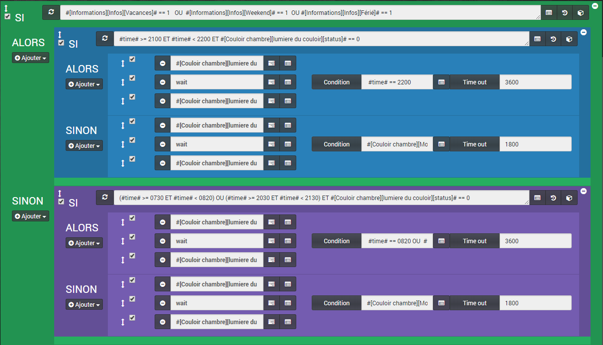
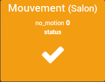
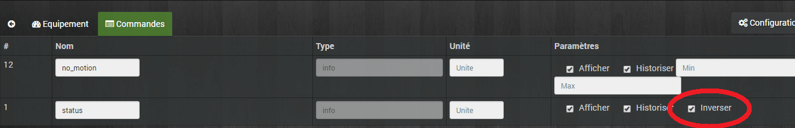
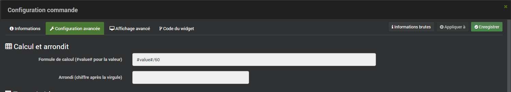
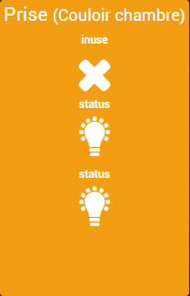

# Lumière automatique sur présence version simplifiée

> _**Mise à jour du 08/06/2017 : L’utilisation du Wait dans ce scénario n’est pas optimisé j’ai donc publié une nouvelle version : [Jeedom Scénario – Lumière sur présence (Corrigé, optimisé)](/articles/jeedom-scenario-lumiere-sur-presence-corrige-optimise)**_
>
> Aujourd’hui, je vous présente une simplification du scénario « [Jeedom Scénario – Lumière sur présence (Evolution)](/articles/jeedom-scenario-lumiere-sur-presence-evolution)« . Dans cette version je supprime l’option d’allumage pendant 10 minutes, s’il y a eu plus de 5 mouvements en 5 minutes. A présent, j’attends simplement qu’il n’y ait plus de mouvement depuis 3 minutes, avant d’éteindre.

Pour rappel, le scénario allume la lumière branchée sur une prise Xiaomi Plug pendant 1 minute sur la détection d’un mouvement, capté par un détecteur de mouvement Xiaomi, le tout contrôlé par le Gateway géré par Jeedom.



**Versions alternatives du scenario :**

-   **[Jeedom Scénario – Lumière sur présence](/articles/jeedom-scenario-lumiere-sur-presence)**
-   **[Jeedom Scénario – Lumière sur présence (Evolution)](/articles/jeedom-scenario-lumiere-sur-presence-evolution)**

## Mode du scénario = Provoqué.

On aura seulement besoin d’un déclenchement sur la détection de mouvement.

### Événement : #\[Couloir chambre\]\[Mouvement\]\[status\]#

Le scénario se lance dès que le capteur détecte une présence.

## SI #\[Informations\]\[Infos\]\[Vacances\]# == 1   OU  #\[Informations\]\[Infos\]\[Weekend\]# == 1  OU #\[Informations\]\[Infos\]\[Férié\]# == 1

Ce test récupère les informations fournies par le plugin « [Informations du jour](https://market.jeedom.fr/index.php?v=d&p=market&type=plugin&plugin_id=dayinfo)« , afin de savoir si c’est un jour travaillé ou pas. Je pourrais être plus précis à l’aide du plugin [Icalendar,](https://market.jeedom.fr/index.php?v=d&p=market&type=plugin&plugin_id=iCalendar) mais là, c’est surtout pour identifier les jours d’école.

### ALORS SI #time# >= 2100 ET #time# < 2200

Donc s’il n’y a pas école, on rentre dans la boucle et on vérifie si on est entre 21:00 et 22:00.

### ALORS

```js
Si c’est le cas, alors on lance 3 actions.
```

#### Action 1 : #\[Couloir chambre\]\[lumière du couloir\]\[On\]#

On allume la lumière.

#### Action 2 : Wait

-   **Condition** :  #time# == 2200
-   **Time Out** : 3600

L’action « **wait** » permet d’attendre que la condition soit vraie, en l’occurrence que l’heure soit égale à 22:00, avec une attente maximum de 3600 secondes, soit une heure.

#### Action 3 : #\[Couloir chambre\]\[lumière du couloir\]\[Off\]#

On éteint la lumière.

### SINON

#### Action 1 : #\[Couloir chambre\]\[lumière du couloir\]\[On\]#

#### Action 2 : Wait

-   **Condition** : #\[Couloir chambre\]\[Mouvement\]\[Calme depuis : \]#>=3
-   **Time Out** : 1800

Cette action attend que la commande « **Calme depuis :** » soit supérieur ou égale à **3 minutes**. Pour plus d’information, voir la configuration du « [Détecteur de mouvement](#detecteur-de-mouvement)« . Le « **Time Out** » est à **1800** secondes, donc, dans tous les cas, la lumière s’éteindra au bout de **30 minutes**. C’est une sécurité, mais de toute façon, la lumière se rallumera dès qu’il y aura un mouvement détecté.

#### Action 3 : #\[Couloir chambre\]\[lumière du couloir\]\[Off\]#

**_Évolution_** _: Dans cette boucle, j’ai remplacé l’action « **sleep** » par une action « **wait** » qui attends que la condition soit vraie. C’est la que vous pouvez régler le temps d’allumage de la lumière, ici 3 minutes._

### SINON (Voir Code)

```
SI <(#time# >= 0730 ET #time# < 0820) OU (#time# >= 2030 ET #time# < 2130)
 ALORS #[Couloir chambre][lumière du couloir][On]#
 wait #time# == 0820 OU #time# == 2130 [timeout] => 3600
 #[Couloir chambre][lumière du couloir][Off]#
 SINON
 #[Couloir chambre][lumière du couloir][On]#
 wait #[Couloir chambre][Mouvement][Calme depuis : ]#>=3
 #[Couloir chambre][lumière du couloir][Off]#
```

Je ne détaille pas ce code, car c’est la même chose que précédemment. Pour les détails voir l’article [Lumière sur présence (Evolution)](/articles/jeedom-scenario-lumiere-sur-presence-evolution)

## Affichage dans Jeedom

Pour que l’affichage des tuiles soit correct, il faut faire quelques modifications au niveau des commandes. _(Identique à l’ancienne version)._

### Détecteur de mouvement

Aller dans les réglages du détecteur de mouvement, en cliquant sur la tuile depuis le dashboard, ou dans « **Plugins / Protocole Domotique / Xiaomi Home**« , puis cliquer sur le composant. Sélectionner l’onglet « **Commandes**« .

-   Il faut inverser l’icône, car lorsqu’il n’y a pas de mouvement, l’icône représente un personnage en mouvement et lorsqu’il y a un mouvement on a un signe « valider ».


Pas de mouvement



Mouvement détecté

Pour cela, dans le réglage de la commande « **Status**« , il faut cocher « **Inverser**« .



-   Maintenant, lorsqu’il n’y a pas de mouvement depuis un certain temps, la commande « **no\_motion** » renvoie un temps en secondes, ce qui n’est pas très parlant.

Nous allons ajouter une formule pour convertir les secondes en minutes. Pour cela, il faut aller dans les « **Roues crantées**« , à côté du bouton « **Test** » de la commande « **no\_motion**« , puis dans « **Configuration avancée**« .

Là, ajouter « **#value#/60** » dans le champ « **Formule de calcul**« . **Tips** : Vous pouvez appliquer cette formule aux autres capteurs de mouvement, en cliquant sur « **Appliquer à**« .

-   Maintenant, on a un 3 au lieu de 180.

Pour que se soit un peu plus sympa, on va changer l’unité de mesure, soit les minutes **« (min)** » et on va changer le « **no\_motion**« , en,  par exemple, « **Calme depuis :**  » dans les réglages des commandes.


Et voilà : 

\[alert-warning\]Le statut no\_motion est incrémenté à 120, 180, 300, 600, 1200 et 1800 secondes, soit un maximum de 30 minutes.\[/alert-warning\]

### La prise ou la lumière

Pour la tuile de la lumière, on peut aussi l’améliorer, pour l’instant elle ressemble à ça :



Pour avoir simplement une tuile avec le nom de la prise ou de la lampe et un bouton ampoule qui permet de savoir si la lampe est allumée ou pas et le cas échéant, changer le statut en cliquant dessus, il faut :

Aller dans les réglages « **Commandes** » de l’équipement. Décocher les 2 premières cases à cocher « **Afficher**« .


Et voilà :


## Conclusion

Voilà une troisième version du [scénario d’allumage sur présence](/articles/jeedom-scenario-lumiere-sur-presence) qui est plus simple à mettre en place. Attention toutefois, si vous modifiez les durées d’allumage, les capteurs de mouvements Xiaomi ne renvoient pas d’information de déclenchement avant 1 minute, donc si vous mettez un temps d’attente de 45 secondes, vous allez vous retrouver 15 secondes dans le noir avant que la lumière se déclenche à nouveau.

Retrouvez la liste des plugins, les scénarios, les images et le matériel compatible Jeedom sur la page: [Matériel, Plugin et plus.](/articles)
