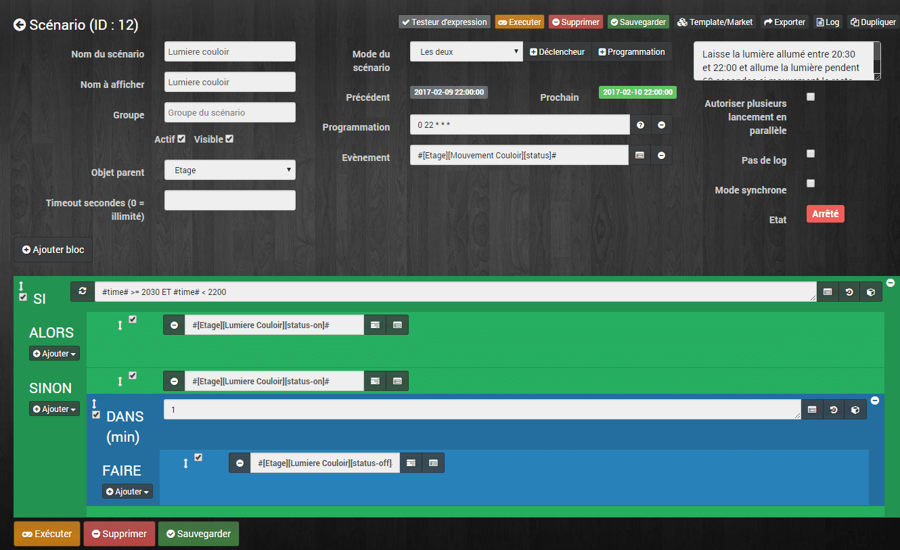
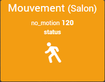
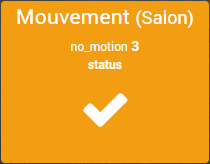
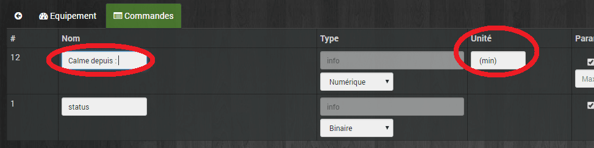
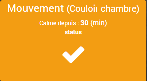

# Lumière automatique sur présence

> Le scénario consiste à allumer la lumière branché sur une prise pendant 1 minute sur la détection de mouvement. Cependant à partir de 20:30 dès qu’un mouvement est détecté la lumière reste allumé jusqu’à 22:00.



**Versions alternatives du scénario :**

- [Jeedom Scénario – Lumière sur présence (Corrigé, optimisé)](/articles/jeedom-scenario-lumiere-sur-presence-corrige-optimise)

## Mode du scenario = Les deux.

On aura besoin d’un déclenchement sur la détection de présence et un déclenchement à 22 :00.

### Programmation = 0 22 \*\*\*

Le scénario se lance automatiquement tous les jours à 22 :00 pour repasser en mode allumé 1 minute.

### Evènement : #\[Etage\]\[Mouvement Couloir\]\[status\]#

Le scénario se lance dès que le capteur détecte une présence.

## SI #time# >= 2030 ET #time# < 2200

La on vérifie si l’heure #time# est supérieur ou égale à 20 :30 et inférieur à 22 :00. On ne met pas inférieur ou égal à 22 :00 car on ne veut pas entrer dans la boucle si il est 22 :00.

### ALORS #\[Etage\]\[Lumiere Couloir\]\[status-on\]#

```js
Si la boucle est positive alors on passe le statut de la lumière à ON.
```

## SINON #\[Etage\]\[Lumiere Couloir\]\[status-on\]#

```js
Si la boucle est positive alors on passe le statut de la lumière à ON.
```

### DANS 1 (min)

Là on attend une minute avant d’exécuter la prochaine action.

### FAIRE #\[Etage\]\[Lumiere Couloir\]\[status-off\]#

On passe le statut de la lumière à OFF.

## Affichage dans Jeedom

Pour que l’affichage des tuiles soit correct il faut faire quelques modifications au niveau des commandes.

### Détecteur de mouvement

Aller dans les réglages du détecteur de mouvement en cliquant sur la tuile depuis le dashboard ou dans « **Plugins / Protocole Domotique / Xiaomi Home**« , puis cliquer sur le composant. Sélectionner l’onglet « **Commandes**« .

- Il faut inverser l’icone car lorsqu’il n’y a pas de mouvement l’icone représente un personnage en mouvement et lorsqu’il y a un mouvement on a un signe valider.



Pas de mouvement


Mouvement détecté

Pour cela dans le réglage de la commande « **Status** » il faut clocher « **Inverser**« .


- Maintenant lorsqu’il n’y a pas de mouvement depuis un certain temps la commande « **no_motion** » renvoi un temps en secondes ce qui n’est pas très parlant.

Nous allons ajouter une formule pour convertir les secondes en minutes. Pour cela il faut aller dans dans les « **Roues crantées** » à coté du bouton « **Test** » de la commande « **no_motion** » puis dans « **Configuration avancée**« .

Là ajouter « **#value#/60** » dans le champ « **Formule de calcul**« . **Tips** : Vous pouvez appliquer cette formule aux autres capteurs de mouvement en cliquant sur « **Appliquer à**« .

- Maintenant on a un 3 au lieu de 180.

Pour que se soit un peu plus sympa on va changer l’unité de mesure soit les minutes **« (min)** » et on va changer le « **no_motion** » en  par exemple « **Calme depuis :**  » dans les réglages des commandes.



Et voila : 

\[alert-warning\]Le statut no_motion est incrémenté à 120, 180, 300, 600, 1200 et 1800 secondes soit un maximum de 30 minutes.\[/alert-warning\]

### La prise ou la lumière

Pour la tuile de la lumière on peut aussi l’améliorer, pour l’instant elle ressemble à ça :


Pour avoir simplement une tuile avec le nom de la prise ou de la lampe et un bouton ampoule qui permet de savoir si la lampe est allumer ou pas et le cas échéant changer le statut en cliquant dessus il faut :

Aller dans les réglages « **Commandes** » de l’équipement. Décocher les 2 premières cases à cocher « **Afficher**« .


Et voila :


## Conclusion

Voila un scénario assez simple à mettre en place et qui peut être utile dans plusieurs situations (couloir des chambres, hall d’entrée, porte d’entrée extérieur…). Avec les modifications des tuiles il est possible de l’adapter aux besoins.

\[alert-note\]Il faut savoir que les capteurs de mouvements Xiaomi ne renvoient pas d’information de déclenchement avant 1 minute donc si vous mettez un temps d’attente de 45 secondes vous allez vous retrouver 15 secondes dans le noir avant que la lumière se déclenche à nouveau.\[/alert-note\]
