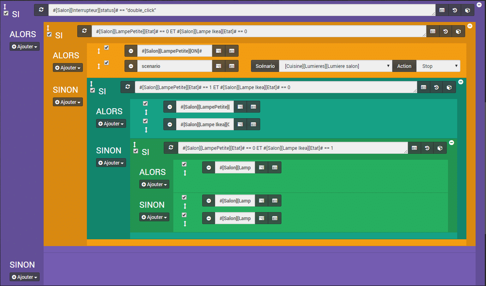
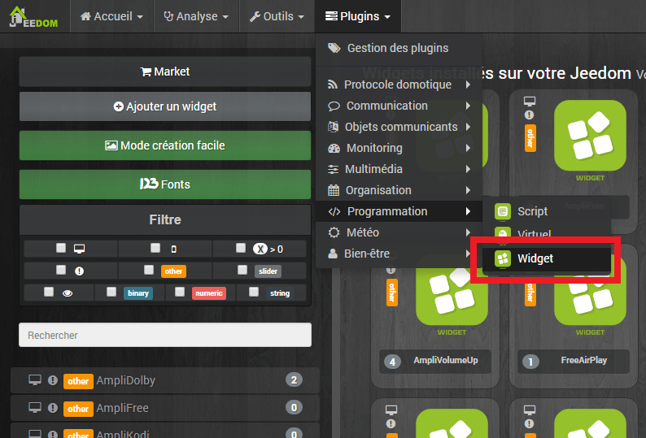
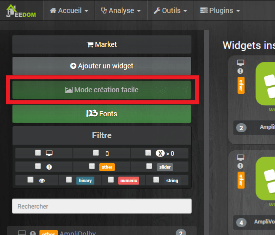
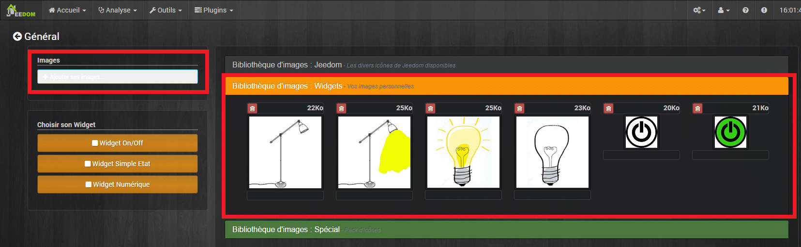
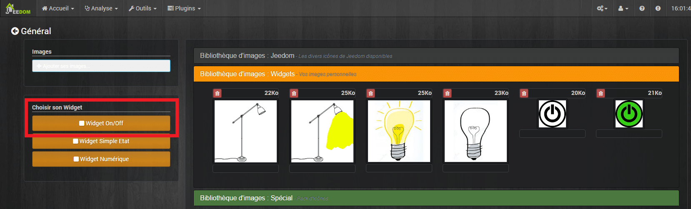
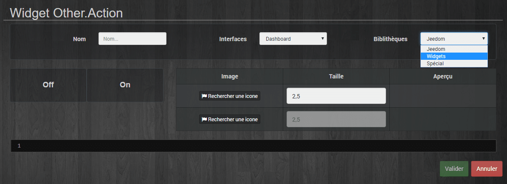
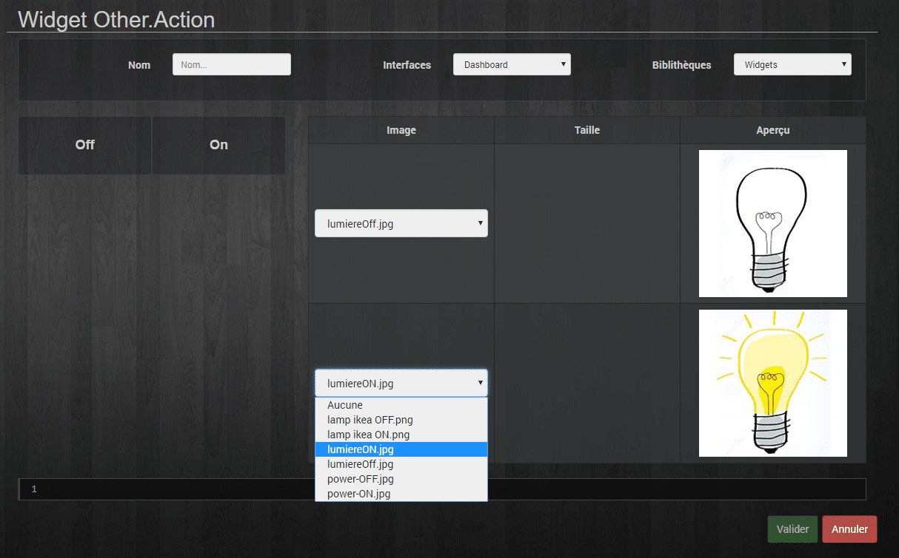
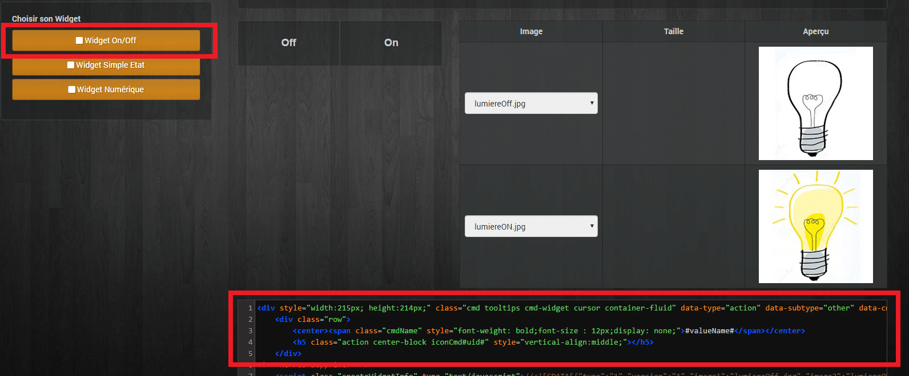
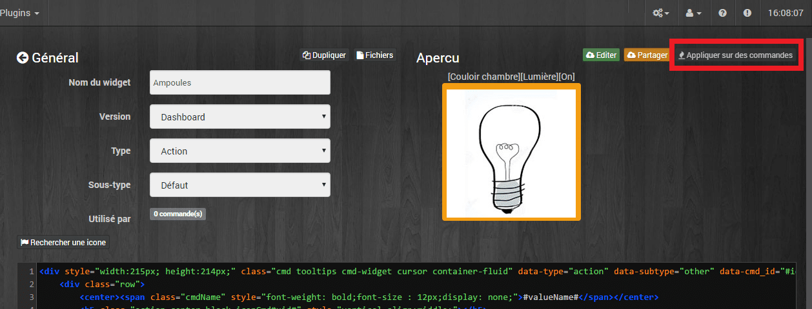
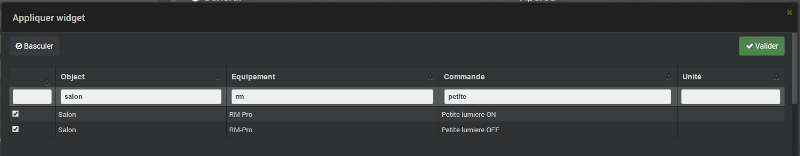

# Lumière manuel via bouton switch Xiaomi

> Encore un scénario lumières ?!!! Et oui, mais la **gestion de la lumière** se doit d’être **optimisée** \[tooltip content= »Wife acceptance factor » gravity= »s » fade= »0″\]W.A.F\[/tooltip\] car les dames n’aiment pas les **lumières** trop **autonomes** qui s’allument ou s’éteignent dans tout les sens mais avec le **bouton switch Xiaomi** ça change tout.
>
> Dans ce scénario, j’utilise l’interrupteur **bouton switch Xiaomi** qui est aussi **pratique** et **discret** que **pas cher**. Pour plus de détails sur son fonctionnement, je vous invite à lire l’article dédié [Jeedom Scenario – Bouton Switch Xiaomi](/articles/jeedom-scenario-bouton-switch-xiaomi).
>
> Aujourd’hui, nous n’allons voir qu’une seule commande, le « **double_click**« , vous pouvez, bien évidement, utiliser les autres commandes pour d’autres actions.
>
> Xiaomi Smart Wireless Switch
>
> Le but de ce scénario, c’est de pouvoir allumer les 2 lumières que j’ai dans mon salon, indépendamment l’une de l’autre, ou ensemble et les éteindre. Le tout avec une seule commande, le « **double_click**« .
>
> Le schéma d’allumage :
>
> 1.  Petite lampe
> 2.  Grosse lampe
> 3.  Les deux
> 4.  Aucunes.



## MODE DU SCENARIO = PROVOQUÉ.

On aura besoin simplement d’un déclenchement sur le changement de statut du bouton. #\[Salon\]\[Interrupteur\]\[status\]#

## SI #\[Salon\]\[Interrupteur\]\[status\]# == « double_click » ALORS

Là, on vérifie s’il y a un double clic, alors on rentre dans la boucle.

### SI #\[Salon\]\[LampePetite\]\[Etat\]# == 0 ET #\[Salon\]\[Lampe Ikea\]\[Etat\]# == 0 Alors

Je vérifie si les 2 lumières sont éteintes.

#### ACTION 1 : #\[Salon\]\[LampePetite\]\[ON\]#

J’allume seulement ma petite lampe.


ON

#### ACTION 2 : SCENARIO : \[Salon\]\[Lumiere\]\[Lumiere salon\] : ACTION : STOP.

J’ai un scénario qui allume la lumière et l’éteins s’il n’y a plus de présence, mais là je l’arrête, car je veux gérer l’allumage en manuel.

### SINON

#### SI #\[Salon\]\[LampePetite\]\[Etat\]# == 1 ET #\[Salon\]\[Lampe Ikea\]\[Etat\]# == 0 ALOR S

Je vérifie si la petite lampe est allumée et la grosse (Ikea) éteinte.

#### ACTION 1 : #\[Salon\]\[LampePetite\]\[OFF\]#

#### ACTION 2 : #\[Salon\]\[Lampe Ikea\]\[ON\]#

J’éteins ma petite lampe et j’allume la grosse.

### SINON

#### SI #\[Salon\]\[LampePetite\]\[Etat\]# == 0 ET #\[Salon\]\[Lampe Ikea\]\[Etat\]# == 1 ALORS

Je vérifie si la petite lampe est éteinte et la grosse allumée.

#### ACTION 1 : #\[Salon\]\[LampePetite\]\[ON\]#

J’allume ma petite lampe sans éteindre la grosse, j’ai donc les 2 allumées.


ON

#### SINON

##### ACTION 1 : #\[Salon\]\[Lampe Ikea\]\[OFF\]#

##### ACTION 2 : #\[Salon\]\[LampePetite\]\[OFF\]#

```js
Si aucune des conditions précédentes n’est vraie, alors j’éteins les 2 lampes.
```

##### ACTION 3 : SCENARIO : \[Salon\]\[Lumiere\]\[Lumiere salon\] : ACTION : STOP.

Pour finir, il faut bien penser à réactiver le scénario, pour que l’allumage repasse de manuel à automatique.

## AFFICHAGE DANS JEEDOM

Pour l’affichage des lumières, il est possible d’utiliser les tuiles de Jeedom. Mais avec les widgets, on peut avoir des affichages plus personnalisés.

Voila un pas à pas rapide pour créer un widget simple, avec un état On et Off, utile pour des lumières, mais aussi pour n’importe quel interrupteur ou retour d’état.

### Aller dans Plugin / Programmation / Widget



### Cliquer sur Mode création facile



### Ajouter 2 images. Une pour l’état On et une pour l’état Off.



### Cliquer sur « Widget On/Off »



### Aller dans Bibliothèques Widget



### Choisir les images en commençant par l’état Off



### Cliquer à nouveau sur « Widget On/Off



Le code se crée automatiquement dans la fenêtre, il ne reste plus qu’à valider.

### Cliquer dans Appliquer sur des commandes



### Cocher les commandes à associer aux images



## Conclusion

Voila un scénario pratique qui fait gagner des points WAF, car son utilisation est simple et ne demande pas d’apprendre des règles particulières, si ce n’est qu’il faut faire des doubles cliques sur le bouton. Il est possible de gérer plus de 2 lampes si on le souhaite, mais il ne faut pas en faire trop, pour ne pas à avoir à cliquer 10 fois pour faire le tour.

Si vous voulez télécharger les images ou retrouvez la liste des plugins Jeedom et du matériel nécessaire pour l’utilisation du scénario c’est sur la page: [Matériel, Plugin et plus.](/articles)
