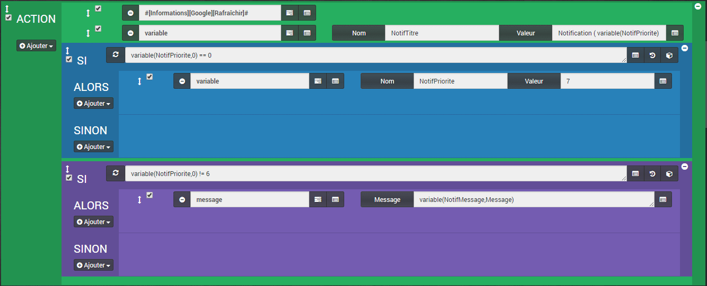
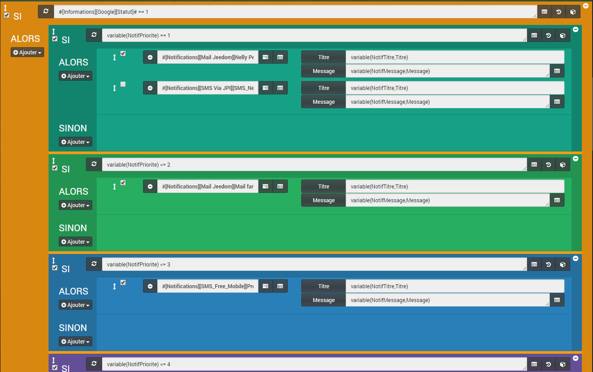
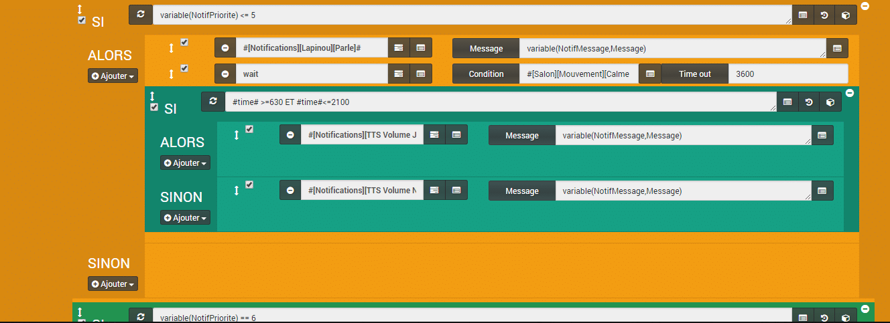
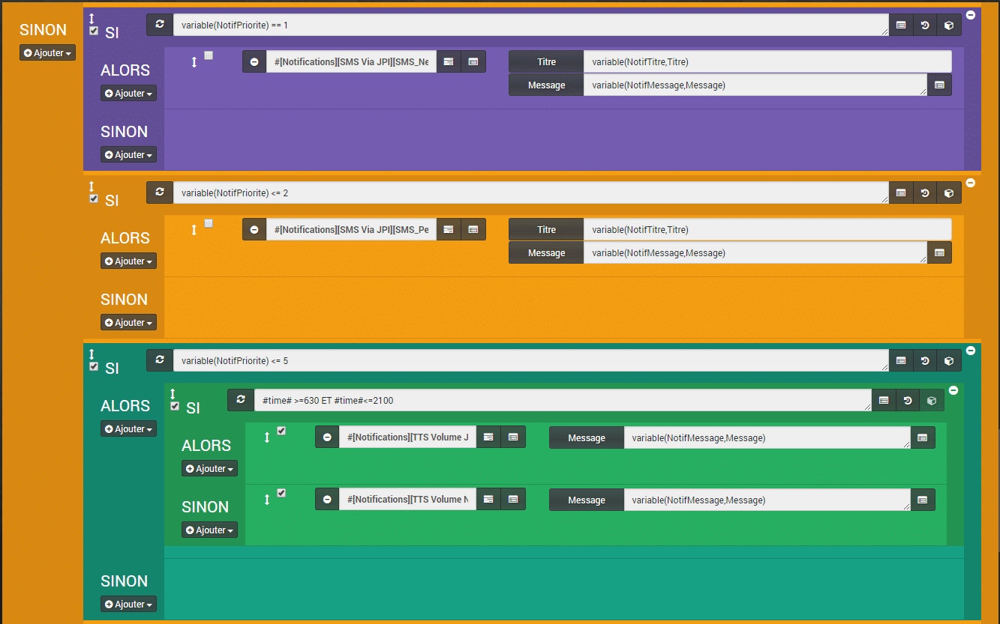
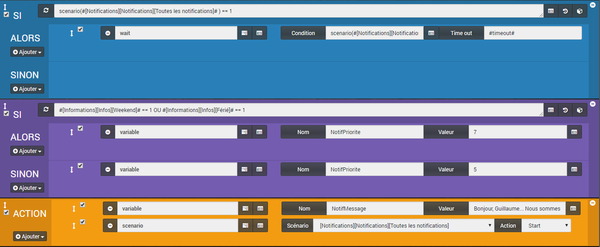

# Gestion des Notifications avancées

> Aujourd’hui, je vais vous présenter le scénario « Gestion des Notifications avancées » inspiré d’un article trouvé sur le blog de **Sarakha63**, [Les variables dans Jeedom domotique – Introduction](http://sarakha63-domotique.fr/les-variables-dans-jeedom-domotique-introduction/).
>
> Le but est de centraliser les notifications de Jeedom, à un endroit unique qui est appelé par les scénarios, lorsqu’on a besoin d’envoyer une notification.
>
> Jeedom étant compatible avec de multiples médias permettant d’envoyer des notifications, Mail, SMS, TTS,  Message interne, notification IFTTT sur mobile, objects connectés, etc… on a vite fait d’en avoir de partout.
>
> Un autre avantages mis en avant, c’est la possibilité d’ajouter ou supprimer un média de notification, puisqu’il suffit de modifier uniquement le scénario notifications et pas tous les scénarios. Par exemple, la gateway Xiaomi devrait bientôt être mise à jour avec la gestion du haut parleur. Il sera simple de l’ajouter.
>
> Il est facile aussi d’ajouter des options, comme par exemple, bloquer l’envoi de mail en cas de coupure d’internet. Pour les notifications vocales ou les sons, on peut régler le volume en fonction des horaires. On peut aussi changer le type de notifications en, semaines, weekend, vacances…
>
> J’ai aussi choisi de prioriser l’importance des différents médias. Un message vocal sera suffisant pour l’annonce de la météo le matin, alors que pour l’alarme, on pourrait choisir de recevoir tous les types de notifications.

Il y a beaucoup d’instructions possibles, mais je ne vais pas toutes les détailler. Certaines étant relativement similaires.

## Les variables

Nous allons utiliser deux variables, « **NotifMessage** » qui contiendra le message à envoyer et « **NotifPriorite** » qui indiquera la priorité de la notifications (voir ci dessous).

**Priorité 1** == SMS & Mail Femme.
**Priorité 2** == Mail Famille.
**Priorité 3** == SMS Boulot Guillaume.
**Priorité 4** == Mail & SMS Perso Guillaume.
**Priorité 5** == TTS Vocal.
**Priorité 6** == TTS Audio.
**Priorité 7** == Message.

La priorité 1 est pour le média le plus important, « **SMS & Mail Femme**« , puis on va jusqu’à la priorité 7 qui est le média le moins important, « **message** » du centre de messages de Jeedom.

Il y a une autre variable, « **NotifTitre** » qui est utilisée pour les mails par exemple. On peut choisir de l’envoyer depuis les différents scénarios et lui affecter une valeur personnalisée, ou lui affecter une valeur par défaut, dans le scénario notification.

## Mode du scénario = Provoqué.

Le scénario sera provoqué par les autres scénarios. Donc, on ne choisit pas de déclencheur.

## Action

### #\[Informations\]\[Google\]\[Rafraîchir\]#

Là, on rafraîchit la fonction Ping vers Google, pour pouvoir tester la connexion internet.

### Variable

-   **Nom** : NotifTitre
-   **Valeur** : Notification ( variable(NotifPriorite) ) de Jeedom.

Là, on affecte la variable « **NotifTitre** » qui servira pour les médias nécessitant un titre, comme les mails par exemple. Ici j’ajoute la valeur de la variable « **NotifPriorite** » dans une phrase, mais on peut entrer ce que l’on veut.

Il est aussi possible d’envoyer cette variable depuis les scénarios, si on veut plus de personnalisation.

##  SI variable(NotifPriorite,0) == 0 ALORS

### Variable

-   **Nom** : NotifPriorite
-   **Valeur** : 7

Si la variable « **NotifPriorite** » n’existe pas, ou est égal à 0, alors on la mets à 7. C’est juste une sécurité pour bloquer au minimum la valeur de la variable.

##  SI variable(NotifPriorite,0) != 6 ALORS

### Message : variable(NotifMessage,Message)

Si la variable « **NotifPriorite** » n’est pas 6 (TTS Music), alors on envoie un message dans le centre de message de Jeedom.

-   On ne veut pas envoyer de message avec le nom d’un fichier TTS Music correspondant à la priorité 6.
-   Un message est envoyé dans tous les autres cas. Si on veut envoyer un message seulement pour la priorité 7 on remplace « **!= 6** » par « **\== 7**« .

## SI #\[Informations\]\[Google\]\[Statut\]# == 1 ALORS

On fait un ping vers Google et si la connexion internet est active, alors on entre dans la boucle.

### SI variable(NotifPriorite) == 1 ALORS

On teste la priorité, si elle est égale à 1, alors on envoi « **Mail & SMS Femme**« .

#### #\[Notifications\]\[Mail Jeedom\]\[Femme Perso\]#

-   **Titre** : variable(NotifTitre,Titre)
-   **Message** : variable(NotifMessage,Message)

On affecte le titre et le message pour le Mail.

#### #\[Notifications\]\[SMS Via JPI\]\[SMS\_Femme\]#

-   **Titre** : variable(NotifTitre,Titre)
-   **Message** : variable(NotifMessage,Message)

On affecte le titre et le message pour le SMS. Le titre n’est pas utile pour un SMS, mais il est demandé et je n’aime pas laisser une variable vide, surtout quand on a de quoi la remplir.

### SINON

Là, je ne mets rien et je fais un autre bloc, SI – ALORS – SINON, après. On pourrait vouloir imbriquer les instructions les unes dans les autres, mais personnellement, je ne sais pas si cela représente un intérêt ou pas ? Si quelqu’un à la réponse, qu’il n’hésite pas à me le faire savoir.

### SI variable(NotifPriorite) <= 2 ALORS

Alors maintenant, on teste la priorité. Si elle est **inférieure ou égale** à 2, alors on envoi « **Mail Famille**« . Le test « **<=** » va donc prendre les priorités 1 et 2. Si on veut seulement prendre les priorités 2, on remplace « **<= 2** » par « **\== 2**« .

#### #\[Notifications\]\[Mail Jeedom\]\[Mail famille\]#

-   **Titre** : variable(NotifTitre,Titre)
-   **Message** : variable(NotifMessage,Message)

On affecte le titre et le message pour le Mail.

On continue de la même manière pour les autres médias de notifications, en changeant les priorités. [Voir l’image precedente](./Jeedom-scenarios-Notification-2.png).

## Gestion du volume pour les TTS Vocal et TTS Audio



## SI variable(NotifPriorite) <= 5 ALORS

### Action : #\[Notifications\]\[Lapinou\]\[Parle\]#

-   **Message** : variable(NotifMessage,Message)

```js
Si la priorité est inférieure ou égale à 5, alors on fait parler le Nabaztag.
```

### Action : wait

-   **Condition** : #\[Salon\]\[Mouvement\]\[Calme depuis : \]#<=1
-   **TimeOut** : 3600

On attend qu’il y est quelqu’un dans la pièce avant de jouer les notifications, pour être certain qu’on ne les joue pas dans le vide.

### SI #time# >=630 ET #time#<=2100 ALORS

#### Action : #\[Notifications\]\[TTS Volume Jour\]\[TTS\]#

-   **Message** : variable(NotifMessage,Message)

#### SINON

#### Action : #\[Notifications\]\[TTS Volume Nuit\]\[TTS\]#

-   **Message** : variable(NotifMessage,Message)

Si on est en journée, entre 6:30 et 21:00, on joue la notification avec le volume de jour, sinon on joue avec le volume de nuit.

## SINON

**Rappel** : On arrive ici, s’il n’y a pas de connexion internet suite au test « [SI #InformationsGoogleStatut#== 1\_ALORS](#siinformationsgooglestatut-1-alors)« .



Là, on recommence sur le même principe, sauf qu’on supprime tous les médias de notification qui ont besoin d’internet pour fonctionner. Mail, Push IFTTT, SMS Free, etc…

## Envoi des variables vers le scenario Notifications.

Maintenant que nous pouvons jouer les notifications en fonction de leurs priorités, nous allons voir comment appeler le scénario avec les deux variables « **NotifMessage** » et « **NotifPriorite** ».

Si vous voulez personnaliser la variable « **NotifTitre**« , il faudra la rajouter au même endroit et la supprimer dans le scénario notification.

Je vais utiliser le scénario qui me donne diverses informations le matin, pour vous montrez le fonctionnement. Mais pour faire simple, il faut remplir les variables et lancer le scénario Notification.
[
](./Jeedom-scenarios-Notification-7.png)

### Eviter le chevauchement des notifications.

Pour ne pas que 2 notifications soient jouées en même temps, je fais un test sur l’état du scénario notification.

#### SI scenario(#\[Notifications\]\[Notifications\]\[Toutes les notifications\]# ) == 1 ALORS

-   **Action** : wait
-   **Condition** : scenario(#\[Notifications\]\[Notifications\]\[Toutes les notifications\]# ) == 0
-   **TimeOut** : 120 (sec)

Si le scénario est en cours (1), j’attends qu’il s’arrête (0), attente maximum de 2 minutes.

### Changer la priorité en fonction de divers critères.

On peut faire un test qui change la priorité de la notification, en fonction d’un ou plusieurs critères. Ici, les jours travaillés ou chômés.

#### SI #\[Informations\]\[Infos\]\[Weekend\]# == 1 OU #\[Informations\]\[Infos\]\[Férié\]# == 1 ALORS

-   **Action** : Variable
-   **Nom** : NotifPriorite
-   **Valeur** : 7

#### SINON

-   **Action** : Variable
-   **Nom** : NotifPriorite
-   **Valeur** : 5

```js
Si nous sommes le weekend, ou un jour férié, alors on affecte la variable de priorité à 7 (Message) sinon à 5 (TTS vocal).
```

### On envoi les variables vers le scénario des notifications.

#### ACTION 1 : Variable

-   **Nom** : NotifMessage
-   **Valeur** : Bonjour, Guillaume… Nous sommes le #sjour#, #jour#, #smois#  et il est #heure# heure  #minute#… Le temps sera : #\[Informations\]\[Lyon\]\[Condition\]#… La température maximal : #\[Informations\]\[Liergues\]\[Température Max\]# °… L’horoscope du jour : #\[Guillaume\]\[Guillaume (horoscope)\]\[horoscopeDuJour\]#…  Les évenements du jour : variable(AgendaJeedomToday), variable(AgendaPersoToday). Bonne journée.

Ici, on remplit la variable « **NotifMessage**« , avec le texte qui sera joué par les notifications. Les « **…** » dans la phrase servent à faire des pauses pour le TTS.

#### ACTION 2 : Variable

-   **Nom** : NotifPriorite
-   **Valeur** : de 1 à 7

#### ACTION 3 : SCÉNARIO : \[NOTIFICATIONS\]\[NOTIFICATIONS\]\[Toutes les notifications\] ACTION : START.

Pour finir, on lance le scénario avec la fonction scénario start.

## Conclusion

Voilà un scénario un peu complexe, mais qui permet à long terme une meilleure gestion et utilisation des notifications dans Jeedom. Il peut être utile de le dupliquer et de faire une autre version qui ne lance que le média correspondant à la priorité et non tous ceux qui ont une priorité inférieure à celle choisie, comme c’est le cas dans l’article. Pour cela il faut remplacer les « **<=** » par des « **\==**« , je vous [l’explique ici](#si-variablenotifpriorite-lt-2-alors).

On peut aussi ajouter des options, comme nous l’avons fait pour l’[accès à internet](#siinformationsgooglestatut-1-alors), les [créneaux horaires](#sitime-gt630-et-timelt2100-alors).

Retrouvez la liste des plugins, les scénarios, les images et le matériel compatible Jeedom sur la page: [Matériel, Plugin et plus.](/articles)
