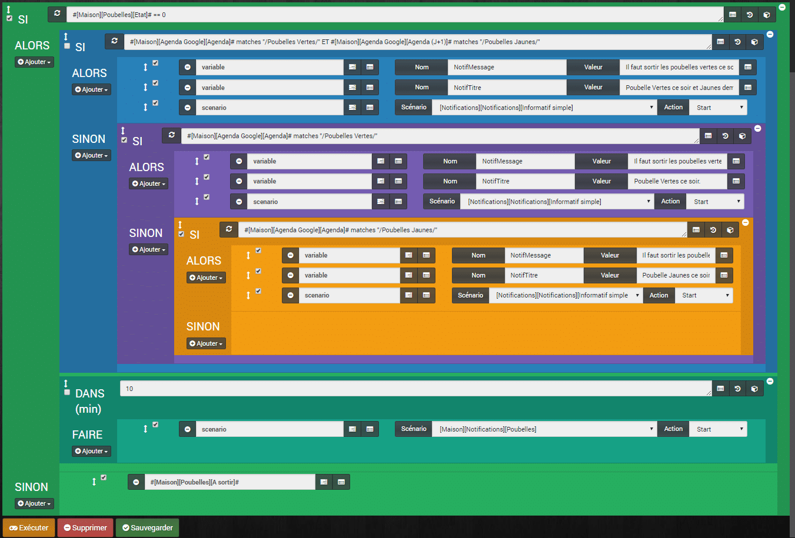
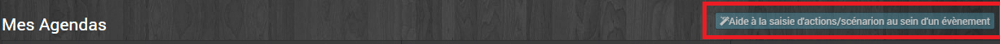
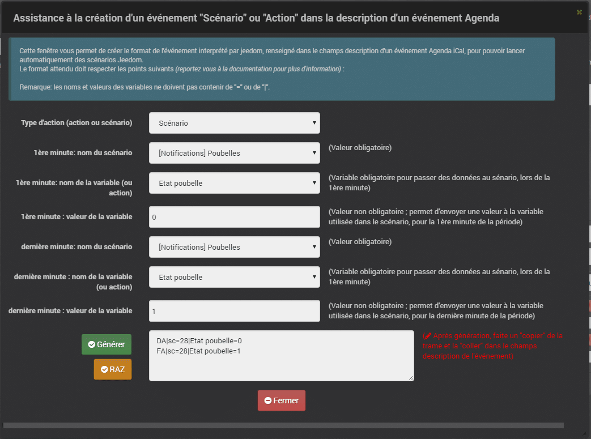

# Gestion de la sortie des poubelles avec option rappel

> Le scénario a pour but de m’avertir si c’est le jour de sortir les poubelles classiques ou de recyclage, avec un rappel jusqu’à ce que j’indique à Jeedom que j’ai bien sorti les poubelles.


Pour mettre en place mon scénario, j’utilise le Plugin **Icalendar** (5€) qui récupère les jours de sorties des poubelles contenus dans mon agenda Google. Il est possible d’utiliser n’importe quel [plugin agenda](https://www.jeedom.com/market/index.php?v=d&p=market&type=plugin&&name=agenda).

Pour avertir Jeedom que j’ai bien sorti les poubelles et donc arrêter les notifications, j’utilise un bouton virtuel sur mon dashboard.  Le bouton pourrait aussi être un « Interrupteur Switch Xiaomi » ou un [Dash Button](http://amzn.to/2lV7mnx) d’Amazon hacké, pour être utilisé dans Jeedom avec le plugin [Dash Button](https://www.jeedom.com/market/index.php?v=d&p=market&type=plugin&&name=dash%20button). On peut même imaginer de mettre un capteur d’ouverture de porte, ou de mouvement, dans le local à poubelle. Peu importe le déclencheur, le principe est le même dans le scénario.

Dans mon cas, les poubelles vertes sont à sortir tous les lundis soirs et les jaunes, un mardi soir sur 2, pour un ramassage les lendemains matin. Rien ne vous empêche de modifier le scénario pour l’adapter à vos besoins.

- Je souhaite être averti le **lundi soir à 20:00** que je dois sortir les **poubelles vertes** et le cas échéant, les jaunes le lendemain.
- Je souhaite être averti le **mardi soir à 20:00** que je dois sortir les **poubelles jaunes**.

A l’origine, j’avais un simple rappel le soir, mais comme je suis tête en l’air, j’oubliais 1 fois sur 2 de les sortir. J’ai donc souhaité que Jeedom m’avertisse toutes les 10 minutes, tant qu’elles ne sont pas sorties au moment opportun.

Pour les notifications, j’utilise des variables qui sont envoyées dans un scénario « **Notification**« . Je centralise mes notifications dans des scénarios spécifiques, pour ne pas avoir à modifier tous mes scénarios en cas de suppression, ou d’ajout, d’un mode de notification. Je ferai bientôt un article sur mon système de notification.



## Mode du scénario = Programmé.

On aura besoin d’un déclenchement les jours de sorties des poubelles.

### Programmation = 0 20 \* \* 1

Déclenchement les lundis à 20:00.

### Programmation = 0 20 \* \* 2

Déclenchement les mardis à 20:00.

## SI #\[Maison\]\[Poubelles\]\[Etat\]# == 0

On fait un test sur le bouton virtuel, pour vérifier si les poubelles ont été sorties. 0 = non sorti, 1 = sorti.

### ALORS SI #\[Maison\]\[Agenda Google\]\[Agenda\]# matches « /Poubelles Vertes/ » ET #\[Maison\]\[Agenda Google\]\[Agenda (J+1)\]# matches « /Poubelles Jaunes/ »

On vérifie dans l’agenda si c’est le jour des poubelles vertes **et** si le lendemain (j+1) celui les jaunes.

**_Info_** : La fonction « **matches** » recherche dans la commande si la chaîne de caractère entre **« // »** est présente.

### ALORS

```js
Si c’est le cas, alors on lance 3 actions qui me permettent de jouer les notifications.
```

#### Action 1 : Variable

- **Nom** : NotifMessage
- **Valeur** : Il faut sortir les poubelles vertes ce soir et les poubelles Jaunes demain.

J’affecte à la variable « **NotifMessage** » le message qui sera utilisé pour les notifications.

#### Action 2 : Variable

- **Nom** : NotifTitre
- **Valeur** : Poubelles Vertes ce soir et Jaunes demain.

J’affecte à la variable « **NotifTitre** » le titre qui sera utilisé pour les notifications de type mail par exemple.

#### Action 3 : scénario : \[Notifications\]\[Notifications\]\[Informatif simple\] Action : START.

Je démarre le scénario des notifications « **Informatif simple** » qui jouera les variables précédemment affectées.

### SINON

## SI #\[Maison\]\[Agenda Google\]\[Agenda\]# matches « /Poubelles Vertes/ »

On vérifie dans l’agenda si c’est le jour des poubelles vertes.

### ALORS

```js
Si c’est le cas, alors on lance 3 actions qui me permettent de jouer les notifications.
```

#### Action 1 : Variable

- **Nom** : NotifMessage
- **Valeur** : Il faut sortir les poubelles vertes ce soir.

J’affecte à la variable « **NotifMessage** » le message qui sera utilisé pour les notifications.

#### Action 2 : Variable

- **Nom** : NotifTitre
- **Valeur** : Poubelle Vertes ce soir.

J’affecte à la variable « **NotifTitre** » le titre qui sera utilisé pour les notifications de type mail par exemple.

#### Action 3 : scénario : \[Notifications\]\[Notifications\]\[Informatif simple\] Action : START.

Je démarre le scénario des notifications « **Informatif simple** » qui jouera les variables précédemment affectées.

### SINON SI #\[Maison\]\[Agenda Google\]\[Agenda\]# matches « /Poubelles Jaunes/ »

On vérifie dans l’agenda si c’est le jour des poubelles jaunes.

### ALORS

```js
Si c’est le cas, alors on lance 3 actions qui me permettent de jouer les notifications.
```

#### Action 1 : Variable

- **Nom** : NotifMessage
- **Valeur** : Il faut sortir les poubelles jaunes ce soir.

J’affecte à la variable « **NotifMessage** » le message qui sera utilisé pour les notifications.

#### Action 2 : Variable

- **Nom** : NotifTitre
- **Valeur** : Poubelle jaunes ce soir.

J’affecte à la variable « **NotifTitre** » le titre qui sera utilisé pour les notifications de type mail par exemple.

#### Action 3 : scénario : \[Notifications\]\[Notifications\]\[Informatif simple\] Action : START.

Je démarre le scénario des notifications « **Informatif simple** » qui jouera les variables précédemment affectées.

### DANS 10(min)

#### Action : scénario : \[Maison\]\[Notifications\]\[Poubelles\] Action : START.

Là, on relance le scénario dans 10 minutes. Si le bouton est toujours à « **A sortir** » alors on est à nouveau averti puis le scénario est à nouveau relancé 10 minutes plus tard.

## SINON

Si le bouton est passé à « **Sorti** » alors on termine par une dernière action.

#### Action : #\[Maison\]\[Poubelles\]\[A sortir\]#

Cette action repasse le bouton à « **A sortir** » car le scénario ne sera relancé que par les programmations du scénario.

## Alternatif pour le lancement du scénario

Le scénario est lancé par la programmation configurée dans l’entête du scénario, mais il est aussi possible de lancer le scénario directement depuis l’événement du calendrier.

Pour cela il faut que :

- L’heure de l’événement soit configurée dans le calendrier, 20:00 dans mon cas.
- Créer une variable « **Etat poubelle** » qui remplacera l’état du bouton virtuel.

### Configuration de l’événement.

Aller dans le plugin ICalendar, puis sur votre Agenda. Dans la partie « **Mes agendas** » cliquez sur le bouton d’aide à la saisie.



Là, il faut remplir un formulaire qui va générer un code, à copier dans le champs description de l’événement.



### Modification du scénario

Lorsque l’on lance le scénario depuis l’événement du calendrier, il faut obligatoirement affecter une variable. On va donc remplacer la commande du bouton virtuel **#\[Maison\]\[Poubelles\]\[Etat\]#** par une variable « **Etat poubelle**« .

Maintenant, dans le scénario, on remplace le premier SI par un test sur la variable.

**SI #\[Maison\]\[Poubelles\]\[Etat\]# == 0** devient **SI variable(Etat poubelle) ==0**

On remplace aussi le dernier SINON de la même manière, mais on pourrait aussi simplement le supprimer.

**SINON Action : #\[Maison\]\[Poubelles\]\[A sortir\]#** devient **SINON Action : Variable Nom : Etat poubelle Valeur : 0**

Il faut savoir que de cette manière, l’événement lance le scénario avec la valeur définie pour la variable « **Etat poubelle ==0** » au début de l’heure prévue et envoie à la fin la variable « **Etat poubelle ==1**« . Dans ce cas, les alertes vont s’arrêter à la fin de l’événement, même si vous n’avez pas cliqué sur le bouton et donc pas sorti les poubelles.

### Modification de la variable via le bouton virtuel

Pour finir, il faut ajouter un scénario provoqué par le bouton virtuel qui modifie la variable « **Etat poubelle == 0″**.

```
SI #[Maison][Poubelles][Etat]# == 0;
Alors 
variable(Etat poubelle) ==0;
Sinon
variable(Etat poubelle) ==1;
```

## Conclusion

C’était mon premier scénario avec le plugin Icalendar, du coup, j’ai un peu improvisé. Il est certainement possible d’optimiser le scénario, je reviendrai sur ce sujet si je le fais évoluer.

Il existe d’autres exemples de scénarios pour les poubelles, mais ils ne répondaient pas à mes exigences. En effet, je voulais un rappel régulier jusqu’à ce que la tâche soit effectivement réalisée.

Je pense que je vais adapter le scénario pour d’autres sujets, comme par exemple « Rapporter le livre de mon fils à la bibliothèque les mercredi matin », « Faire la fiche de paye de la nounou en fin de mois », les déclinaisons sont infinies.

Retrouvez la liste des plugins, les scénarios, les images et le matériel compatible Jeedom sur la page: [Matériel, Plugin et plus.](/articles)
