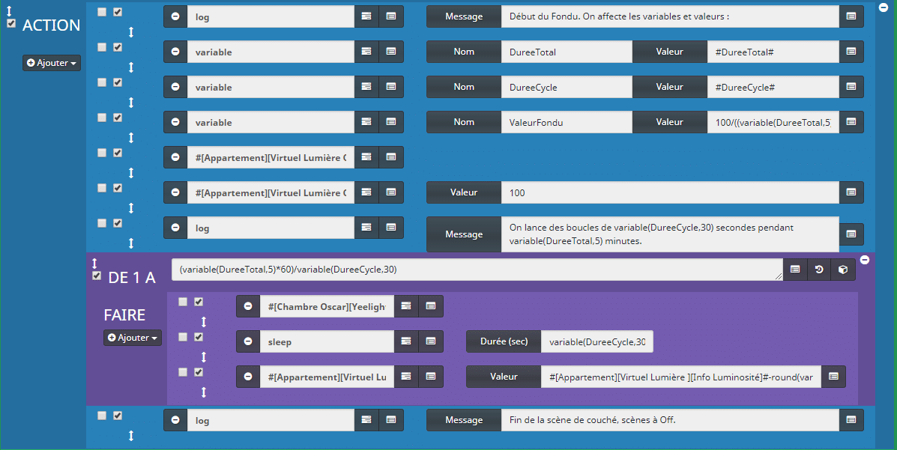
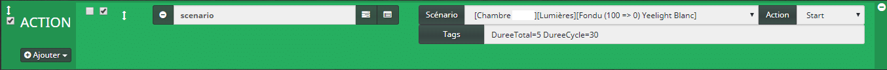
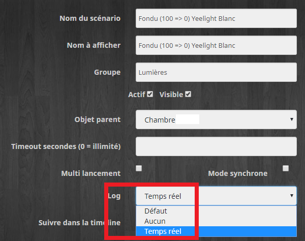

# Fondu paramétrable des ampoules Yeelight

> Aujourd’hui je vous propose un scénario Jeedom permettant de faire un Fondu paramétrable des ampoules Yeelight.
>
> _Ça faisait longtemps que je n’avais pas fait d’article sur les scénarios Jeedom et pour cause, j’ai déménagé ! J’ai donc remis à plat mon Jeedom et j’en ai profité pour faire le ménage en repartant de zéro, sans sauvegarde, histoire d’être véritablement sur une installation parfaitement propre. Voilà pour la petite histoire._
>
> Donc, ce scénario consiste à faire un **fondu** sur la **luminosité** de **0 à 100%**, ou **l’inverse**. L’intérêt, c’est d’avoir un seul scénario et de saisir en paramètres la **durée du fondu** et la **durée des cycles**.
>
> Pour cela, nous allons utiliser une **nouveauté** de Jeedom V3, **les Tags** de scénarios.

## Prérequis.

Pour l’article j’utilise une **ampoule Yeelight Blanche**, mais le principe est rigoureusement le même pour les RGB, ou même pour une lampe de bureau, ou toute autre lumière avec **un retour d’état du niveau de luminosité**.

Pour les lampes n’ayant **pas de retour d’état**, comme la lampe de chevet, on pourra utiliser une **variable** pour faire office de retour d’état du niveau de luminosité.

## Le scénario pour le fondu de la luminosité (Cible)



Il faut faire **un scénario** pour le fondu de **0% à 100%** et **un** pour **100% à 0%**, on pourrait ajouter une option dans les paramètres mais je ne veux pas trop compliquer le scénario pour l’article, après, libre à vous d’ajouter ce que vous voulez.

Dans cet exemple, on va faire un **fondu de 15 minutes**, avec des **cycles de 30 secondes** qui commence avec une luminosité à **100 %** pour finir à **0%**.

_Pour être totalement exact, je finis à 1%, car j’ai bloqué la **valeur minimum** dans les paramètres de la commande. Voir l’article [Xiaomi Mijia – Lampe de Bureau](/xiaomi-mijia-lampe-de-bureau#Virtuel) pour plus de détails._

### Les Tags

Le scénario va recevoir **deux** TAGs :

-   **#DureeTotal#** : La durée du fondu en minutes, c’est à dire la **durée** pour **passer** d’une luminosité de **100 % à 0 %**, (15 minutes).
-   **#DuréeCycle#** : La durée d’un cycle en secondes, c’est à dire le **temps entre deux changement** de luminosité, (30 secondes).

A cause des tags vous ne pouvez **pas provoquer** le scénario directement, il faudra passer par un **scénario source**.

### Les variables

Il n’est **pas possible** de faire des **opérations** avec les **TAGs**, donc nous allons les stocker dans des **variables**.

Nous allons affecter trois variables :

-   **DureeTotal** : On stock la valeur du TAG **#DureeTotal#.** (En minutes)
-   **DureeCycle**: On stock la valeur du TAG **#DureeCycle#****.** (En secondes)
-   **ValeurFondu** : **100/((variable(DureeTotal)\*60)/variable(DureeCycle))**
    -   **100** : C’est la valeur de luminosité au début du fondu.
    -   **variable(DureeTotal)\*60** : On convertit la durée totale en secondes. (15 minutes X 60 = 900 secondes)
    -   **/variable(DureeCycle) :** On divise par la durée d’un cycle, pour obtenir la valeur de luminosité à décrémenter.
    -   **Exemple : 100/(900/30) = 3.3333333** 
-   **Commande** : **#\[Appartement\]\[Virtuel Lumière\]\[On\]#** On allume l’ampoule.
-   **Commande** : **#\[Appartement\]\[Virtuel Lumière\]\[Luminosité\]#** Valeur = **100.** On règle la luminosité à 100 %.

### La Boucle pour le fondu

Maintenant qu’on a nos valeurs et que **l’ampoule** est allumée à **100%**, on peut commencer la **boucle** pour le fondu.

Le nombre de tour pour la boucle est définit par la **durée du fondu (15 min)** et la **durée des cycles (30 sec)**. On va donc mettre dans la valeur de la boucle :

#### De 1 A **(variable(DureeTotal)\*60)/variable(DureeCycle)** FAIRE

Ça doit vous rappeler quelque chose, c’est la même formule que l’on utilise pour le calcul de l’incrémentation de la luminosité. _On aurait pu la mettre dans une variable._

#### **Commande : #\[Chambre\]\[Yeelight Blanc\]\[Rafraichir\]#**

Je rafraîchis les valeurs de l’ampoule, pour être sûr d’avoir le bon **retour d’état** de la commande **info luminosité**.

#### **Sleep** : Valeur = **variable(DureeCycle)**

C’est là qu’on utilise la durée du cycle reçue par le TAG **#DureeCycle#****.** (30 secondes)

#### **Commande : #\[Appartement\]\[Virtuel Lumière\]\[Luminosité\]#** Valeur = **#\[Appartement\]\[Virtuel Lumière \]\[Info Luminosité\]#-round(variable(ValeurFondu))** 

-   **#\[Appartement\]\[Virtuel Lumière \]\[Info Luminosité\]# =** C’est la valeur de la luminosité.
-   **\-round(variable(ValeurFondu))  =** On décrémente la valeur de la **variable(ValeurFondu)** qu’on arrondit, car on ne peut pas affecter à la commande luminosité une valeur avec décimal.

## Le scénario pour paramétrer les valeurs (Source)

Depuis un scénario **source** il faut **lancer** le scénario **cible** que l’on vient de créer avec les **TAGs** pour que le fondu commence.



-   Depuis un **autre Scénario**
-   Insérer une commande : **ACTION**
-   Taper : **scénario**
-   Dans la liste déroulante, **sélectionner** le **scénario** que nous venons de créer.
-   Laisser l’action sur : **Start**
-   Dans la partie Tags, pour 5 minutes et 30 secondes, saisir : **DureeTotal****\=5 DureeCycle=30**.
    -   **Sans espace** autour des signes « égal ».
    -   **Avec un espace** entre les deux tags.
-   Cliquer sur **exécuter** et le fondu devrait commencer.

-   _Pensez à mettre les **Log du scénario** sur « **Temps réel** » pour faire vos tests, sinon vous devrez **attendre** la fin du fondu pour voir les logs._
-   _Commencez avec des fondus courts (1 minute et 10 secondes) par exemple : **DureeTotal=1 DureeCycle=10**_

Exemple de log :

```
Start
//Les TAGS envoyés depuis le scénario source.
[#DureeTotal#] => 1
[#DureeCycle#] => 10

//Les variables sont peuplées avec les valeurs des Tags
Affectation de la variable DureeTotal => 1 = 1
Affectation de la variable DureeCycle => 10 = 10

//On calcule la valeur du fondu
Affectation de la variable ValeurFondu => 100/((1*60)/10) = 16.666666666667

//On allume l'ampoule et on met la luminosité à 100 %
[Appartement][Virtuel Lumière][On]
[Appartement][Virtuel Lumière][Luminosité] [slider] => 100

//On rafraîchit les valeurs de l'ampoule avant la pause, pour laisser le temps aux valeurs de remonter.
[Chambre][Yeelight Blanc][Rafraichir]

//Pause de 10 secondes (#DureeCycle#) et on change la luminosité. (Luminosité - ValeurFondu)
Pause de 10 seconde(s)
[Appartement][Virtuel Lumière][Luminosité] [slider] => 83

//C'est reparti pour un tour
[Chambre][YeelightBlanc][Rafraichir]
Pause de 10 seconde(s)
[Appartement][VirtuelLumière][Luminosité][slider]=>66

[Chambre][YeelightBlanc][Rafraichir]
Pause de 10 seconde(s)
[Appartement][VirtuelLumière][Luminosité][slider]=>49

[Chambre][YeelightBlanc][Rafraichir]
Pause de 10 seconde(s)
[Appartement][VirtuelLumière][Luminosité][slider]=>32

[Chambre][YeelightBlanc][Rafraichir]
Pause de 10 seconde(s)
[Appartement][VirtuelLumière][Luminosité][slider]=>15

[Chambre][YeelightBlanc][Rafraichir]
Pause de 10 seconde(s)

//La dernière valeur est négative, mais la lumière ne s'éteint pas, car elle est bloquée à un mini de 1 dans les réglages
[Appartement][VirtuelLumière][Luminosité][slider]=>-2

Fin correcte du scénario
```

## Évolutions possibles

-   Pour avoir un fondu qui augmente de 0% à 100 % de luminosité, il faut changer les commandes :
    -   **#\[Appartement\]\[Virtuel Lumière\]\[Luminosité\]#** Valeur = **0.**
    -   **#\[Appartement\]\[Virtuel Lumière\]\[Luminosité\]#** Valeur = **#\[Appartement\]\[Virtuel Lumière \]\[Info Luminosité\]#+ round(variable(ValeurFondu))** 
-   Vous pouvez ajouter un Tag sur le sens du fondu et remplacer le **–** de la commande :
    -   **#\[Appartement\]\[Virtuel Lumière \]\[Info Luminosité\]# variable(SenseFondu) round(variable(ValeurFondu))** 
-   Vous pouvez ajouter un Tag sur la luminosité de départ qui est fixé à 100 dans l’exemple et remplacer les valeurs « 100 »  :
    -   **variable(DepartFondu)****/((variable(DureeTotal)\*60)/variable(DureeCycle))**
    -   **#\[Appartement\]\[Virtuel Lumière\]\[Luminosité\]#** Valeur = **variable(DepartFondu)**
-   Pour ne pas avoir des valeurs négatives ou supérieures à 100 %, vous pouvez ajouter un bloc :
    -   SI **#\[Appartement\]\[Virtuel Lumière \]\[Info Luminosité\]#+ round(variable(ValeurFondu)) >= 0 ET #\[Appartement\]\[Virtuel Lumière \]\[Info Luminosité\]#+ round(variable(ValeurFondu)) <= 100.**
-   Vous pouvez aussi ajouter la gestion de la couleur sur une ampoule RGB.

## Conclusion

Ce scénario peut être très utile dans un réveil matin par exemple. Personnellement je l’utilise le matin dans ma chambre avec la lampe de bureau pour me réveiller ou bien avec la gestion de la couleur sur une ampoule RGB le soir dans la chambre des enfants, pour qu’ils sachent que c’est la fin du temps libre et l’heure de dormir.
