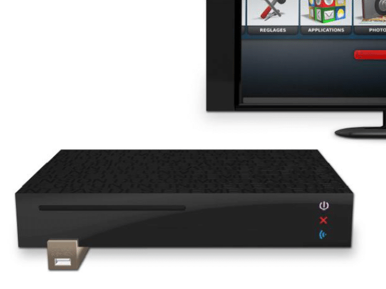
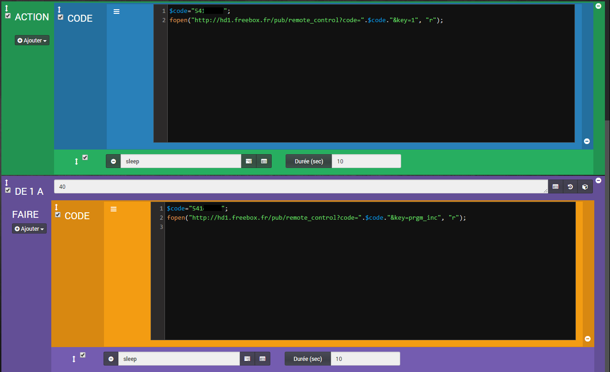
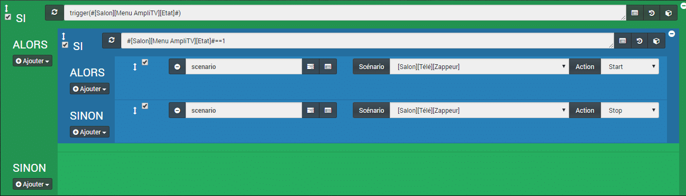
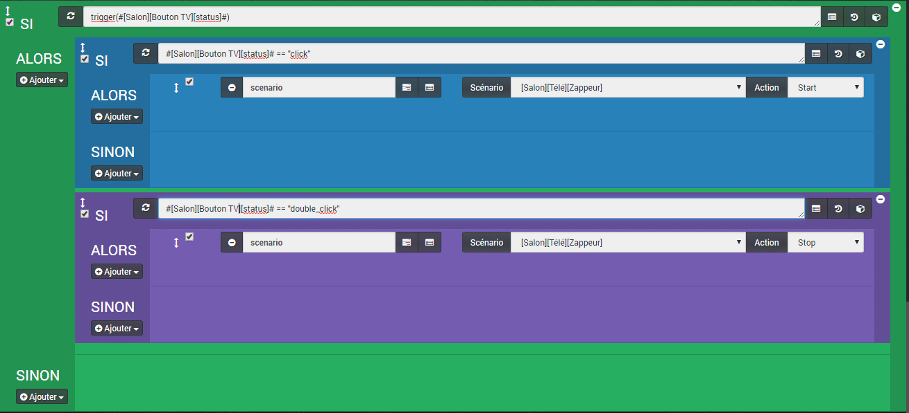
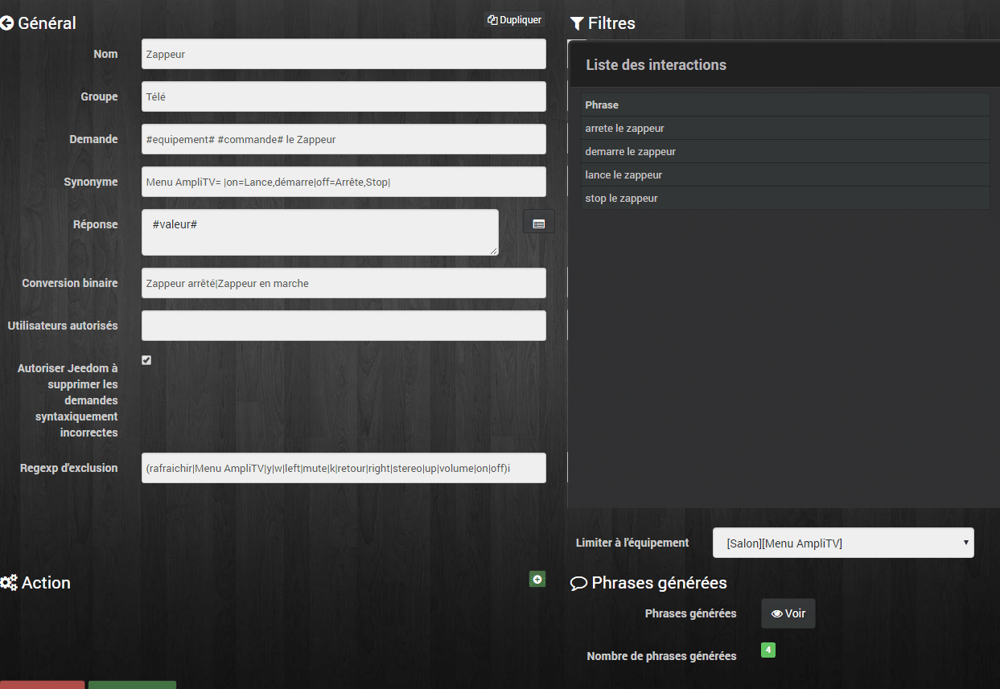

# Zappeur automatique pour Freebox Player

> Cette article fait suite à l’article [Jeedom Interactions – Contrôle Freebox Player](/articles/controler-le-freebox-player) qui montrait comment contrôler le Player de la Freebox V6 via les interactions et les plugin FreeBox_OS et Script.
>
> Cette fois je vais vous présenter un **zappeur automatique** qui consiste à changer de chaîne **toutes les 10 secondes** ce qui permet de balayer toutes les chaines TV sans avoir à faire programme suivant manuellement.
>
> Si vous n’avez **pas de Freebox** il est possible de remplacer les **commandes** pour le Player par celle de **votre box** (si elle est contrôlable) ou même de contrôler votre **TV** via un **contrôleur infrarouge** du type RM broadlink.



## Prérequis.

Pour contrôler le **Player de la Freebox** nous aurons besoin du **plugin** (gratuit) FreeBox_OS ainsi que des commandes mises à disposition par Free dans l’**[API Freebox](https://dev.freebox.fr/sdk/index.html)**.

### Plugin : Freebox_OS.

Le plugin permet de **récupérer des informations sur la Freebox Serveur**, mais aussi de **contrôler le Player** grâce à une télécommande virtuelle. En bonus, il peut même donner l’état du Player, Allumé ou éteint. Cela est très pratique si l’on n’a pas de télé connectée, le [HDMI-CEC](http://www.universfreebox.com/article/18200/Freebox-Revolution-Parametrez-la-fonction-HDMI-CEC) permet de contrôler la TV, ou l’ampli et de connaitre leur état.

### L’API Freebox.

Nous allons utiliser les fonctions misens à disposition par Free dans l’[API Freebox](https://dev.freebox.fr/sdk/index.html). Ce sont des **requêtes HTML** envoyé au Player par Jeedom. Rien de bien sorcier.

_**API** = Application Programming Interface ou interface de programmation applicative. [Wiki](https://fr.wikipedia.org/wiki/Interface_de_programmation)_

## Le scénario



### ACTION

#### CODE

```
$code="5414*****";
fopen("http://hd1.freebox.fr/pub/remote_control?code=".$code."&key=1", "r");
```

#### Sleep durée 10

La première action permet d’**afficher la première chaîne** et de la laisser **pendant 10 secondes** avant de **passer à la suivante**. Délai à adapter selon ses besoins.

On peut **remplacer** le bloc code **par la commande** du plugin Freebox_Os : **#\[Salon\]\[player fbx v6 telec\]\[1\]#**. J’utilise un bloc code dans l’optique d’ajouter des commandes comme par exemple afficher la fiche info de la chaîne et c’est plus simple qu’avec les commandes du plugin.

### Pour De 1 à 40 FAIRE

#### CODE

```
$code="5414*****";
fopen("http://hd1.freebox.fr/pub/remote_control?code=".$code."&key=prgm_inc", "r");
```

#### Sleep durée 10

Une fois les **10 secondes écoulées** on rentre dans la boucle qui va être **répétée 40 fois**. Ce chiffre est à adapter en fonction du nombre de chaînes que vous avez dans votre bouquet.

Le code permet de faire « **programme +**« , on peut utiliser la commande du plugin Freebox_Os : **#\[Salon\]\[player fbx v6 telec\]\[Programme +\]#**.

On fait encore une pause de **10 secondes** avant de refaire la boucle pour passer à la **chaîne suivante**.

## Activation, désactivation

### Via Interrupteur Virtuel

Il suffit de faire un **virtuel On/Off** que j’appelle ici **#\[Salon\]\[Menu AmpliTV\]\[Etat\]#** puis un **scénario** qui permet de **lancer** ou **stopper** le scénario en fonction de l’état du virtuel.



```
SI trigger(#[Salon][Menu AmpliTV][Etat]#) ALORS
   SI #[Salon][Menu AmpliTV][Etat]#==1 ALORS
      Start scénario [Salon][Télé][Zappeur]
   SINON
      Stop scénario [Salon][Télé][Zappeur]
SINON
```

_**J’utilise un trigger car je regroupe plusieurs virtuels dans le même scénario, vous pouvez supprimer cette ligne si vous n’en avez pas besoin.**_

### Via Bouton Switch Xiaomi

Le scénario suivant permet de **lancer** ou **stopper** le scénario **Zappeur** en fonction de l’état du **bouton switch** appeler « **#\[Salon\]\[Bouton TV\]\[status\]#**« . Un **clic**, je **lance le zappeur**, **double** clic, **je l’arrête**.



```
SI trigger(#[Salon][Bouton TV][status]#) ALORS
   SI #[Salon][Bouton TV][status]# == "click" ALORS
      Start scénario [Salon][Télé][Zappeur]
   SINON
   SI #[Salon][Bouton TV][status]# == "double_click" ALORS
      Stop scénario [Salon][Télé][Zappeur]
```

On peut faire l’économie du double clics en vérifiant l’état du scénario :

```
SI trigger(#[Salon][Bouton TV][status]#) ALORS
   SI #[Salon][Bouton TV][status]# == "click" ALORS
      SI scenario(#[Salon][Télé][Zappeur]# ) == 1 ALORS
         Stop scénario [Salon][Télé][Zappeur]
      SINON
         Start scénario [Salon][Télé][Zappeur]
```

_**J’utilise un trigger car je regroupe plusieurs boutons Xiaomi dans le même scénario, vous pouvez supprimer cette ligne si vous n’en avez pas besoin.**_

### Via Interaction

On peut mettre en place une **interaction** pour **contrôler vocalement** le virtuel et **lancer** ou **stopper** le scénario **Zappeur**.



Pour plus de détails concernant les interactions je vous invite à lire les articles [Jeedom Interactions – Gestion des lumières](/articles/gestion-des-lumieres) ou [Jeedom Interactions – Contrôle Freebox Player](/articles/controler-le-freebox-player).

#### Demande : *#equipement# #commande# le Zappeur*

Pour la demande, on saisit les variables correspondant aux On / Off du virtuel.

#### Synonymes : *Menu AmpliTV= |on=Lance,démarre|off=Arrête,Stop|*

Menu AmpliTV= | permet de remplacer l’équipement par rien pour ne pas avoir à le nommer dans la demande. Vous pouvez ajouter les synonymes de votre choix pour les commandes On et Off.

#### Conversion binaire : *Zappeur arrêté|Zappeur en marche*

Phrase de réponse que vous pouvez adapter. La première correspond à l’état 0 du virtuel.

#### Limiter à l’équipement : \[Salon\]\[Menu AmpliTV\]

Je limite la génération de phrases à mon virtuel.

#### Phrases générées :

- arrête le zappeur
- démarre le zappeur
- lance le zappeur
- stop le zappeur

## Conclusion

L’utilité du zappeur n’est pas évidente à première vue mais c’est **très pratique à l’usage** et puis c’est un peu une façon d’aborder **plusieurs fonctions** disponibles dans **Jeedom** que vous pouvez **adapter** à votre sauce.
