# Lampe de chevet Xiaomi Yeelight

> Dans les autres articles du site, je vous ai parlé de la gamme Aqara de chez Xiaomi mais aujourd’hui je vais vous parler d’une autre gamme de la marque, les Yeelights et particulièrement de la la lampe de chevet Xiaomi. Vous l’aurez compris ce sont des lumières, ampoules, lampes et autres guirlandes de LED, le tout connecté bien évidement.
>
> D’ailleurs sachez que certains modèles sont wifi et d’autres Bluetooth, ou même les deux, comme par exemple le plafonnier Yeelight Ceiling Light.
>
> En ce qui concerne la lampe de chevet Xiaomi Yeelight Bedside Lamp, c’est le bluetooth qui est utilisé et grâce au plugin (gratuit) de Ludovic SARAKHA [Bluetooth Advertisement (blea)](https://market.jeedom.fr/index.php?v=d&p=market&type=plugin&plugin_id=blea) cette lampe est contrôlable via Jeedom.
>
> **_Edit : La nouvelle lampe Xiaomi Mijia Bedside Lamp WiFi remplace le modèle bluetooth. Elle apporte les mêmes fonctions avec une meilleur connectivité grâce au Wifi et au bluetooth. Elle est 100% compatible Jeedom, grâce au plugin Xiaomi home et maintenant il y a un retour d’état pour savoir si la lampe est allumé ou éteinte._**
>
> 

## Présentation

Cette lampe de chevet est équipée de LED offrant 16 millions de couleurs RGBW. Grâce au contrôle tactile, il suffit de toucher et de glisser le doigt sur le haut de la lampe pour régler la luminosité, la température des blancs et les couleurs.

Pour disposer de plus de fonctions, il faut installer les applications Yeelight ou Mi-home, sur un smartphone. Plus intéressant encore, vous pouvez intégrer cette lampe à votre domotique via Jeedom grâce au plugin [BLEA](https://market.jeedom.fr/index.php?v=d&p=market&type=plugin&plugin_id=blea).

**_Edit : La nouvelle lampe Xiaomi Mijia Bedside Lamp WiFi remplace le modèle bluetooth. Elle est 100% compatible Jeedom, grâce au plugin Xiaomi home._**

Pour pousser la « connectivité » encore plus loin, associez un bracelet connecté Mi-band et la lampe s’éteindra lorsque vous serez endormi. 🙂

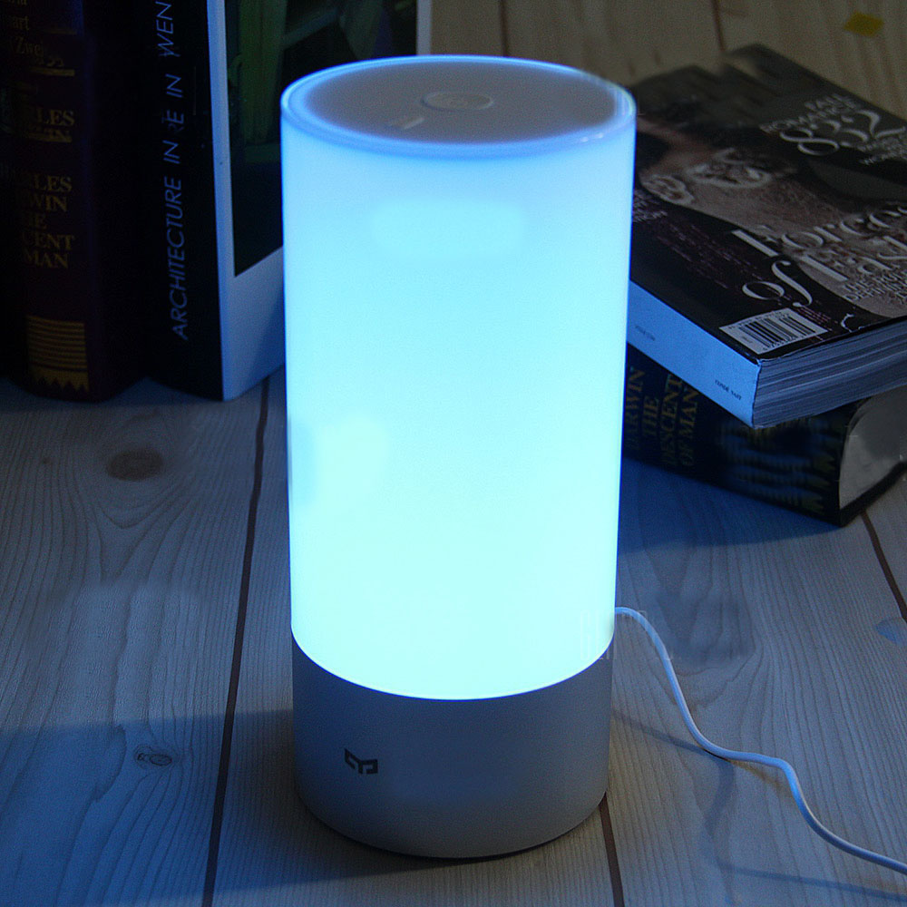_**Quelques informations technique pour les puristes :**_

- **Température de couleur de 1700K à 6500K.**
- **Puissance: 10W.**
- Tension d’entrée de la lampe: 12V, 1A.
- Tension d’entrée de l’adaptateur: 100 – 240V, 50 / 60HZ, 0.5A.
- Durée de vie: 20000h.
- Système: compatible avec les systèmes Android 4.4 / iOS 8.0 et supérieurs.
- Lumen: 300Lm.
- Poids du produit: 1.2980 kg.
- Poids du paquet: 1,3400 kg.
- Taille du produit (L x L x H): 8 x 8 x 18 cm.
- Taille de l’emballage (L x L x H): 15 x 10 x 20 cm.

## Installation de la lampe

Comme toujours chez Xiaomi, le packaging est de très bonne facture.

La lampe est dans une boite en carton épais, avec, en petite impression le logo de la marque. Des mousses de protection collées à l’intérieur protègent des chocs et la lampe est glissée dans une protection supplémentaire pour éviter les rayures. Sobre et efficace.

La surface tactile, sur la partie supérieure de la lampe, est protégé par une pastille autocollante avec quelques indication en chinois. Une fois retirée, on se rend compte de la qualité de finition de cette lampe, aussi bien au niveau du socle en alu brossé que du plexiglas qui enveloppe cette lampe, très beau design.

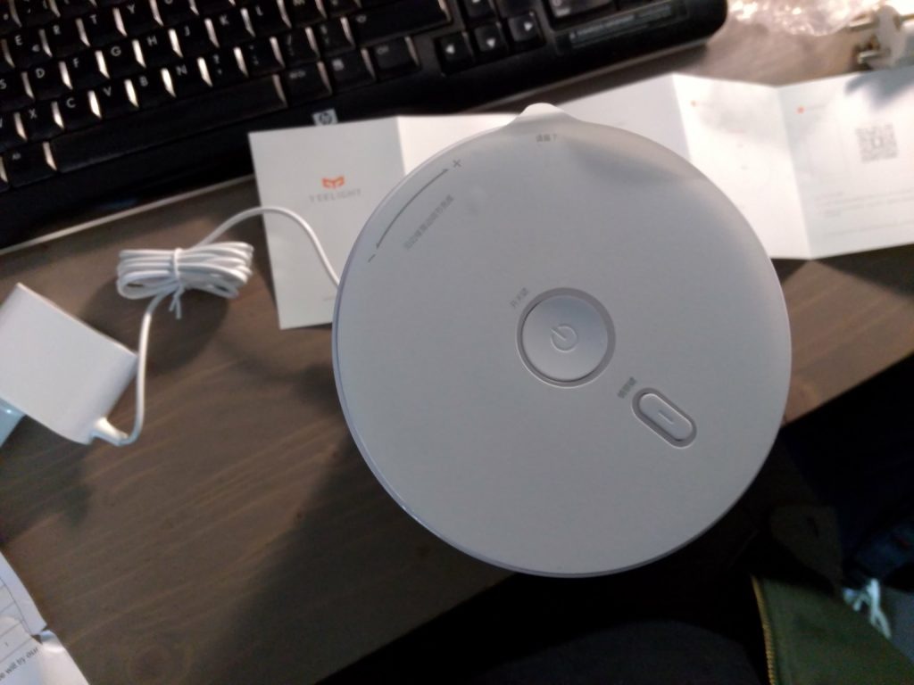

Comme toujours, le mode d’emploi est en chinois, donc inutile. En même temps, personne (ou presque) ne lit les modes d’emplois et mon site est fait pour ça.
Pour les fans de mode d’emploi, j’ai fait la traduction avec google translate mais je n’ai rien trouvé de bien intéressant.

Pour finir, le chargeur est au format US/CHINA, il faut donc penser à demander un adaptateur lors de la commande. Sinon, vous pouvez acheter des adaptateurs US =>EU pour la modique somme de 0.81 € chez Gearbest ou [5,79 € les 5 sur Amazon](http://amzn.to/2qU6fuU) et en [Premium](https://www.amazon.fr/essayerpremium?tag=guilbraimespa-21) si vous êtes pressé.

## Utilisation

Maintenant, qu’est ce que l’on peut faire avec ?

Cette lampe à l’avantage de pouvoir être utilisée comme une lampe « normale », **en local**, puisqu’il y a une zone tactile sur le haut qui permet de faire pas mal de réglages.

On peut aussi utiliser l’application **smartphone** pour avoir accès à plus d’options et pour finir on peut l’intégrer à **Jeedom**.

De toutes façons, l’un n’empêche pas les autres, vous pouvez très bien l’allumer avec un scénario **Jeedom**, régler le délai d’extinction automatique avec **l’application** et changer la luminosité **manuellement**.

### En local

Comme vous pouvez le voir sur l’image, 4 fonctions sont directement contrôlables depuis la zone tactile et les boutons de la lampe :

1.  **Le petit bouton :** Permet de changer de mode (Couleurs, Blancs et alternance des couleurs).
2.  **Rotation du doigt :** Permet de faire varier la luminosité.
3.  **Le petit bouton + rotation du doigt :** Permet de faire varier la température du blanc ou de changer de couleur.
4.  **Appuie long sur le bouton central :** Permet de passer en mode Sleep, la lampe s’arrêtera seule.

Il n’en font pas mention sur l’image, mais le bouton central c’est aussi le bouton On/Off.

### Smartphone

Pour contrôler la lampe depuis un smartphone, vous pouvez utiliser l’application Mi-Home que nous avons installé pour utiliser [les produit Xiaomi Home](/articles/installation-et-configuration-de-la-gateway-xiaomi#Installation_de_lapplication_Mi-Home).

Si vous n’avez pas de produits Xiaomi Home, il est possible d’utiliser une application dédiée aux lampes Yeelight qui est une version simplifié de Mi-Home pour la partie lumière.

Comme je vous le disais précédemment, cette lampe se connecte en bluetooth. Il faut donc [l’appairer](https://fr.wiktionary.org/wiki/appairer) à votre smartphone.

- Assurez vous que le **bluetooth** est bien activé sur votre **smartphone**.
- Ouvrez l’application **Mi-home** et cliquez sur le **+** en haut à droite, puis sur « **Add device**« .
- Branchez la lampe sur le secteur et appuyez sur le **petit bouton,** sur le dessus, pour lancer l’**appairage**.
- Si ce n’est pas déjà le cas, vous devez **activer le wifi sur le smartphone**, puis cliquer sur « **Scan »**.
- Votre lampe devrait être reconnue très rapidement.

L’installation se fait extrêmement rapidement. Installez le plugin et/ou les mises à jour si besoin.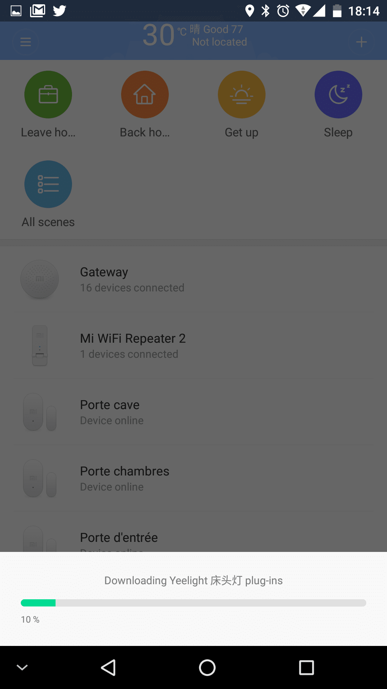

Dans Mi-Home, on retrouve la lampe sur la première page, dans la partie « **Bluetooth device**« . Il suffit de cliquer dessus pour se connecter.

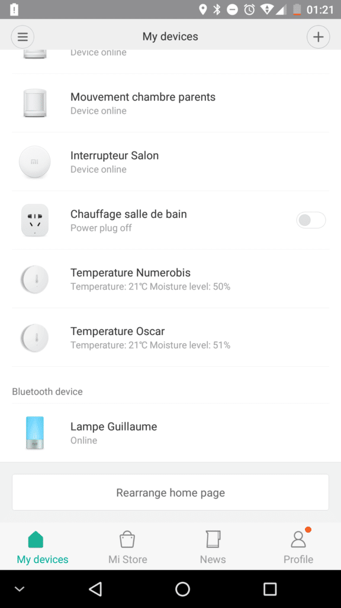

Un check se lance au démarrage. Ma lampe étant dans la chambre, lorsque je veux me connecter depuis le bureau qui est un peu loin, il m’est arrivé de devoir faire « **Retry** » pour que la connexion se fasse. Néanmoins, j’ai toujours pu me connecter.

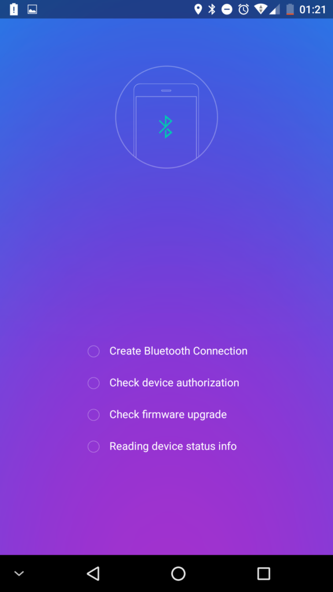

Une fois démarré, on se retrouve sur un écran animé qui représente un ciel de nuit avec des étoiles filantes. On dispose d’un bouton pour entrer dans le **menu de configuration,** représenté par les **3 petits points dans un cercle** en haut à droite et d’un bouton **Power** en bas.

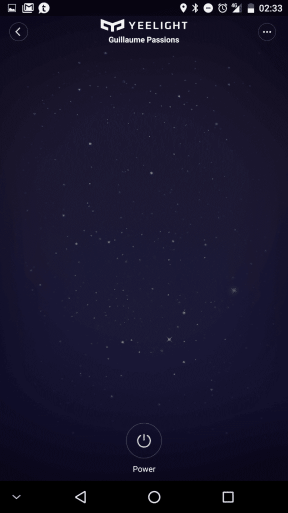

#### Le menu de configuration

C’est très intuitif et simple à utiliser :

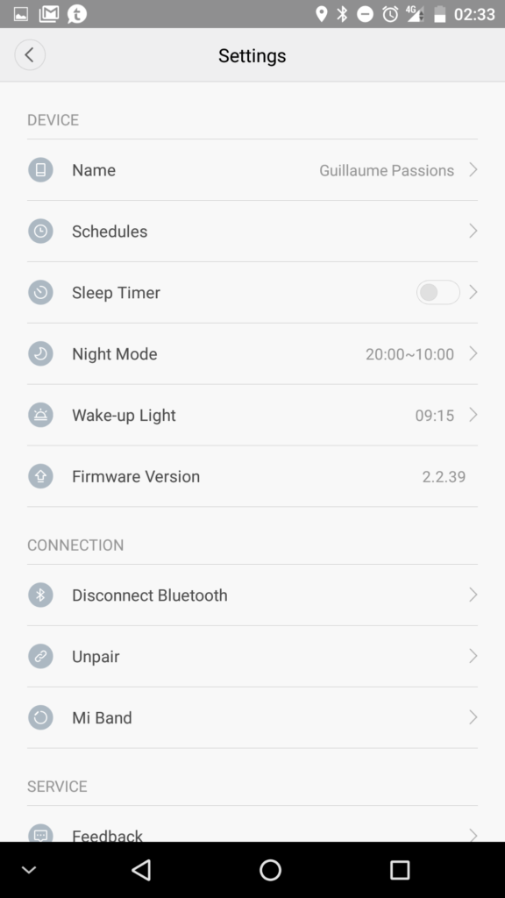

- **Nom** (Name) : Nom de votre lampe.
- **Planning** (Schedules) : Programmer l’allumage et l’extinction à heures fixe et répétitivement (une fois, tous les jours, les jours de la semaine ou libre).
- **Sommeil** (Sleep Timer) : Réglage du délai avant extinction lors de l’appuie long sur le bouton central.
- **Mode nuit** (Night Mode) : Définir une plage horaire où la lampe s’allumera avec une lumière douce lorsque vous toucherez la zone tactile.
- **Réveil** (Wake-up Light) : Fonction de réveil, la lumière va augmenter régulièrement 30 minutes avant votre réveil.
- **Mi-Band** : Permet d’associer sont bracelet Mi Band pour que la lumière s’éteigne automatiquement lorsque vous vous endormez.

#### Réglage des couleurs et des blancs.

Personnellement je ne suis pas un grand fan des éclairages en couleur, je trouve que ça donne vite une ambiance bizarre lorsque le salon ou la chambre est teinté de bleu, vert, rouge ou toute autre nuance de couleur. C’est tout de même utile pour faire des notifications lumineuses, mais à vraiment utiliser avec parcimonie si on ne veut pas avoir l’impression de vivre dans une fête foraine.

Par contre, je trouve que la gestion des blancs est un vrai plus. La nuit, on peut préférer un blanc chaud qui allumera suffisamment pour ne pas perdre un orteil sur un pied de lit en embuscade, mais pas trop non plus pour ne pas finir aveugle. De même, le soir, si on veut lire, on peut régler la luminosité et l’intensité en fonction de ses besoins et c’est bien mieux que les lampes à économie d’énergie qui ne commencent à éclairer correctement qu’au deuxième chapitre du livre.

Là encore, l’application est simple à utiliser et très intuitive.

L’écran se divise en 2 parties :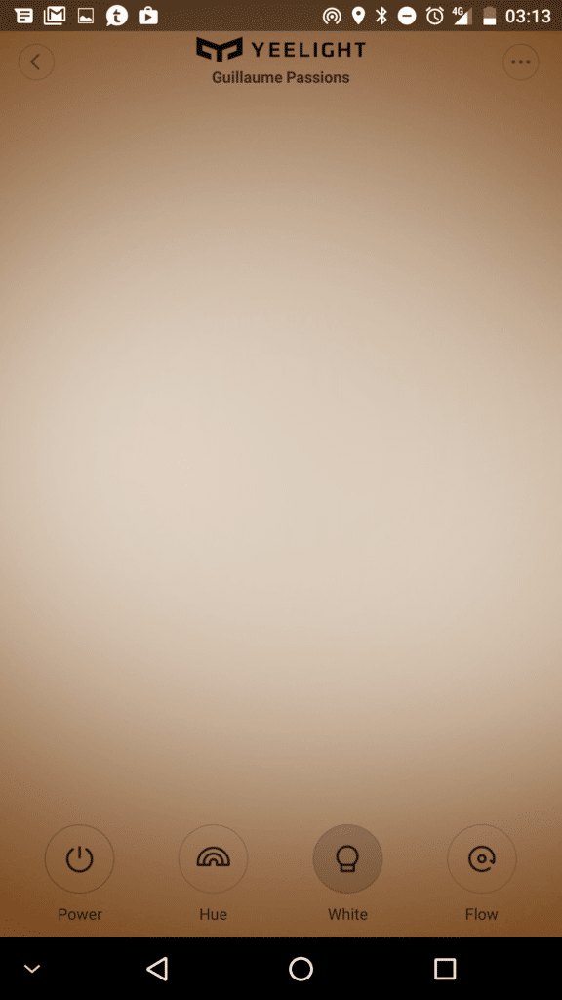

1.  La partie inférieure permet de choisir les différents modes, l’équivalent du petit bouton sur le dessus de la lampe.
    - **Hue** (Teinte) : Gestion des couleurs.
    - **White** (Blanc) : Gestion du blanc.
    - **Flow** (Alternance) : La lampe alterne automatiquement entre 4 couleurs.
2.  Le reste de l’écran permet d’ajuster les différents modes en faisant glisser son doigt.
    - Droite & Gauche
      - **Hue** : Sélection de la couleur.
      - **White** : Température du blanc.
      - **Flow** : Vitesse de l’alternance.
    - Haut & Bas
      - Luminosité.
    - Setting (Flow uniquement)
      - **Colors** : Permet de choisir les 4 couleurs à alterner.
      - **Color Picker** : Permet de sélectionner les couleurs à alterner depuis une image.

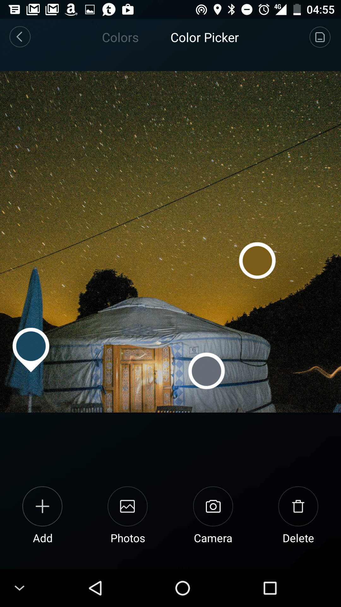

### Jeedom.

Pour utiliser la lampe de chevet Xiaomi Yeelight dans Jeedom, il faut installer le plugin (gratuit) de Ludovic SARAKHA [Bluetooth Advertisement (blea)](https://market.jeedom.fr/index.php?v=d&p=market&type=plugin&plugin_id=blea), puis faire un scan afin de trouver la lampe.

**_Edit : La nouvelle lampe Xiaomi Mijia Bedside Lamp WiFi remplace le modèle bluetooth. Elle est 100% compatible Jeedom, grâce au plugin Xiaomi home._**

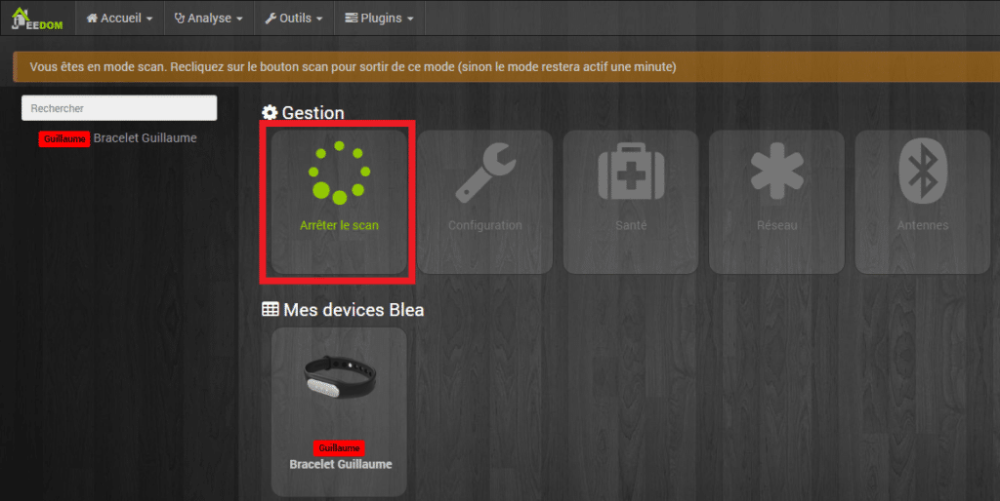

Une fois la lampe trouvée par Jeedom, il est possible de la configurer suivant vos besoins. Vous pouvez cocher « Garder la connexion », car la lampe étant sur secteur, elle ne devrait normalement pas sortir de votre logement.

**Attention ! à ce stade, votre lampe est reconnue par Jeedom, mais pas encore appairée.** C’est comme sur un smartphone lorsque l’appareil est visible, il faut encore l’appairer pour pouvoir l’utiliser.

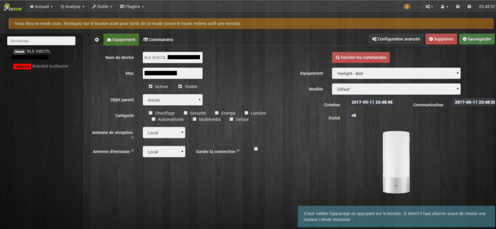

Pour appairer la lampe, il faut cliquer sur le bouton « Test » de la commande « Pair »et appuyer sur le petit bouton du dessus de la lampe, elle doit alors se mettre à clignoter.

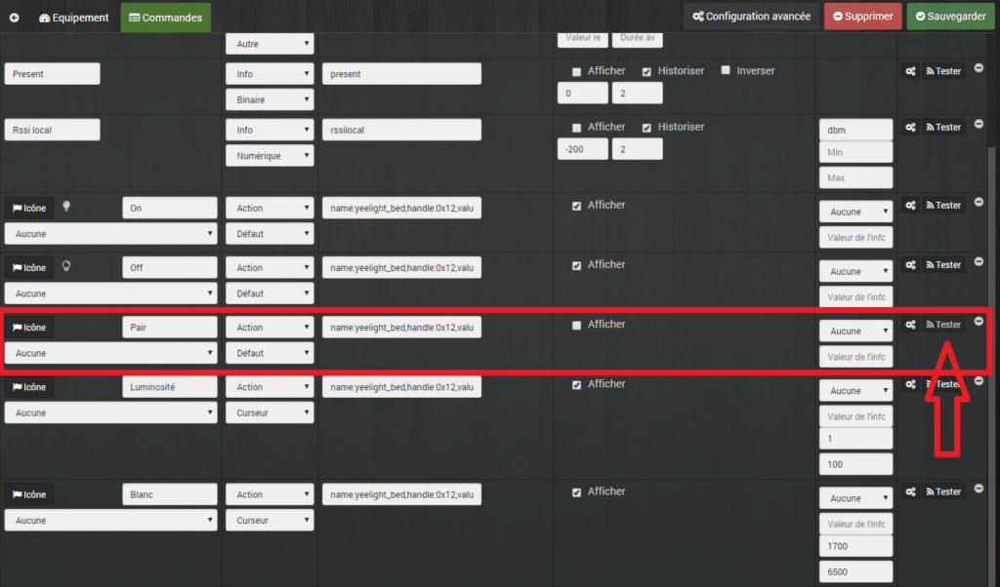

#### Contrôle de la lampe

Les commandes sur le dashboard ressemblent à celles du Gateway Xiaomi. Il est possible de choisir la couleur, ou éteindre via la couleur noire. Il y a aussi 2 boutons ON et OFF, puis un curseur de luminosité (1 à 100) et du blanc (1700 à 6500).

Contrairement au Gateway, il n’est pas possible d’éteindre la lumière en mettant la luminosité à 0. Il faut obligatoirement actionner un des boutons OFF. Idem pour l’allumage, il faut cliquer sur ON au préalable. Le seul fait d’augmenter la luminosité ou le blanc ne suffit pas.

Une dernière chose à savoir, sur le contrôle via Jeedom, la lampe **doit** être allumée pour que les réglages soient pris en compte. Si, lorsque j’ai éteint la lumière, elle était verte et que je veux l’allumer en bleu, je dois l’allumer, elle sera verte, puis la je peu la passer au bleu. Cela veut dire que les changements sont visibles.

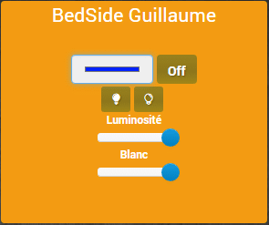

#### Retour d’état

Contrairement à la gateway, où il y a des commandes d’informations sur l’état de la luminosité et de la couleur, la lampe ne remonte pas son état (On/Off, Luminosité, couleur..).

Si j’utilise la lampe depuis l’application mobile, ou directement depuis la surface tactile, ou encore les boutons, Jeedom n’en saura rien. Il n’est donc pas possible de faire un virtuel donnant réellement l’état de la lampe, sauf si je me contraint à la contrôler uniquement via Jeedom, ce qui est peu probable.

**_Edit : La nouvelle lampe de chevet Xiaomi Mijia Bedside Lamp WiFi remplace le modèle bluetooth. Elle est 100% compatible Jeedom, grâce au plugin Xiaomi home et maintenant il y a un retour d’état pour savoir si la lampe est allumé ou éteinte._**

## Conclusion

Je trouve dommage que l’intégration dans Jeedom soit limitée par rapport aux nombreuses fonctions disponibles sur l’application mobile. Toutefois c’est déjà une bonne chose de pouvoir contrôler les fonctions de base de la lampe depuis Jeedom. Je fais confiance à [Sarakha63](http://sarakha63-domotique.fr) pour nous sortir une mise à jour.

**_Edit : La nouvelle lampe de chevet Xiaomi Mijia Bedside Lamp WiFi remplace le modèle bluetooth. Elle apporte les mêmes fonctions avec une meilleur connectivité grâce au Wifi et au bluetooth. Elle est 100% compatible Jeedom, grâce au plugin Xiaomi home et maintenant il y a un retour d’état pour savoir si la lampe est allumé ou éteinte._**

Sinon le produit en lui même est de très bonne qualité et (je trouve) très esthétique. La possibilité de contrôler la lampe en local grâce à la surface tactile fait gagner des points WAF et rend cette lampe vraiment facile d’utilisation pour tout le monde.

Mode d’emplois en anglais [téléchargeable ici](http://files.xiaomi-mi.com/files/Bedside_lamp/Bedside_Lamp_EN.pdf).
