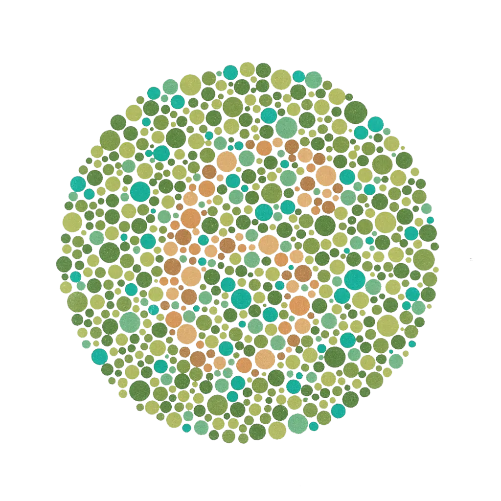
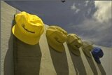
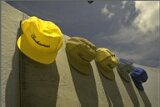
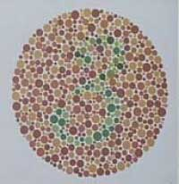
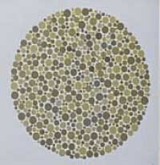
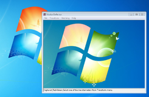

# Le daltonisme

> Depuis toujours, la perception des couleurs influence notre lecture du monde.
>
> Le daltonisme est une particularité visuelle qui modifie cette perception, sans pour autant empêcher de vivre normalement.
>
> À travers des exemples concrets et des tests visuels, cet article illustre comment cette différence se manifeste au quotidien.

> Le **daltonisme** (ou dyschromatopsie) est une anomalie de la vision des couleurs due à un dysfonctionnement ou à l’absence d’un ou plusieurs des trois types de cônes de la rétine oculaire, utilisés pour la vision en couleur.

Un **daltonien** est une personne atteinte de ce trouble.

Il s’agit le plus généralement d’une anomalie génétique (maladie congénitale), mais elle se produit aussi parfois en cas de lésion nerveuse, oculaire, cérébrale, ou peut encore être due à certaines substances chimiques.

Il existe plusieurs formes de dyschromatopsie partielle, la plus fréquente étant la confusion du vert et du rouge. Les autres formes sont nettement plus rares, comme la confusion du bleu et du jaune. La plus rare de toutes est la déficience totale de vision des couleurs, où le sujet ne perçoit que des nuances de gris.

## Les différentes formes de daltonisme

On classe le daltonisme selon les 3 types de cônes atteints et l’importance du trouble visuel :

### 1. Monochromatisme (Achromate)

C’est l’absence totale de perception des couleurs. Très rare, il touche environ une personne sur 33 000 à 40 000 en Occident. Le sujet atteint voit le monde en noir et blanc avec des nuances de gris. Les cônes de la rétine sont dépourvus des 3 pigments habituels ; la vision provient essentiellement des bâtonnets.

Dans sa forme congénitale, elle est associée à une forte photophobie, une acuité visuelle réduite (< 2/10) et un nystagmus. À noter qu'il existe aussi une forme cérébrale, consécutive à une lésion du cerveau.

> **L'anecdote géographique :** L’île de Ponape (en Micronésie) est particulièrement connue des scientifiques car l’achromatopsie y est extrêmement commune : près d’un douzième de la population locale en est affectée.

### 2. Dichromatisme (Dichromate)

C’est l’absence totale du gène, et donc du pigment photorécepteur associé. Cela se traduit par la perception de deux couleurs seulement :

- **Deutéranopie** : absence dans la rétine des cônes de réception au vert ; les personnes affectées sont incapables de différencier le rouge du vert.
- **Protanopie** : absence des récepteurs rétinaux au rouge ; cette couleur est totalement indétectable par le sujet.
- **Tritanopie** : absence des récepteurs rétinaux au bleu ; le bleu est indétectable.

### 3. Trichromatisme anormal (Trichromate anormal)

Dans ce cas, le gène est hybride : le pigment est présent mais possède une mutation qui modifie sa sensibilité spectrale. Le sujet perçoit les 3 couleurs mais avec des intensités anormales :

- **Deutéranomalie** : présence d'une mutation du pigment de la perception du vert ; la sensibilité à cette couleur est diminuée. Elle constitue la majorité (environ la moitié) des anomalies congénitales de la vision des couleurs.
- **Protanomalie** : présence d'une mutation du pigment de la vision du rouge ; la sensibilité au rouge est diminuée (besoin de plus d'intensité de rouge).
- **Tritanomalie** : présence d'une mutation du pigment de la vision du bleu ; la sensibilité au bleu est diminuée.

## Historique

Le nom scientifique de la maladie est la dyschromatopsie, mais elle est couramment appelée "daltonisme" d’après le nom de son découvreur, John Dalton.

Le célèbre chimiste anglais publia en effet le tout premier article scientifique sur ce sujet en 1794, intitulé _« Faits extraordinaires à propos de la vision des couleurs »_, à la suite de la prise de conscience de sa propre déficience visuelle.

> **Le saviez-vous ?** John Dalton était atteint de deutéranopie. Son diagnostic a pu être confirmé scientifiquement en 1995 (plus de 150 ans après sa mort) grâce à une analyse ADN effectuée sur l'un de ses globes oculaires, préservé et conservé jusqu'à nous. Les autres formes de déficiences (comme la tritanopie) ne sont d'ailleurs qualifiées de "daltonisme" que par abus de langage.

## Tests de dépistage

Au XXIe siècle, le daltonisme est dépisté très tôt chez les jeunes français, à l'école, lors des visites médicales obligatoires.

Il est principalement détecté grâce aux **tests d'Ishihara**, qui consistent en une série d'images (planches) représentant des groupes de gros points de couleur. Un nombre est inclus au centre de l'image, dessiné sous la forme d'une série de points d'une couleur légèrement différente. Ce nombre est visible avec une vision complète des couleurs, mais pas lorsque l'on possède une déficience.

_Regardez l’exemple ci-dessus : vous devriez voir le nombre 6. Pour ma part, étant deutéranope, je ne vois qu'un amas de points de couleur sans distinguer le moindre chiffre._

Chaque planche teste une déficience chromatique précise ; l'ensemble de la série permet de déterminer avec exactitude le type et l'intensité de l'anomalie. Ces tests de détection peuvent également être complétés ou réalisés en utilisant la **lanterne de Beyle**.

## Types de daltonisme et statistiques

La répartition statistique mondiale varie grandement selon le sexe, mettant en évidence les facteurs génétiques du trouble :

| Types d’anomalie                | Hommes (%)  | Femmes (%)  |
| :------------------------------ | :---------- | :---------- |
| Monochromatisme (Achromatopsie) | Très rare   | Très rare   |
| **Dichromatisme**               | **2,105**   | **0,043**   |
| - Protanopie                    | 1,000       | 0,020       |
| - Deutéranopie                  | 1,100       | 0,010       |
| - Tritanopie                    | 0,005       | 0,003       |
| **Trichromatisme**              | **5,900**   | **0,400**   |
| - Protanomalie                  | 1,000       | 0,020       |
| - Deutéranomalie                | 4,900       | 0,380       |
| - Tritanomalie                  | Très rare   | Très rare   |
| **TOTAL**                       | **8,005 %** | **0,443 %** |

## Les causes physiologiques et génétiques

### Les gènes et les chromosomes

Les cônes de la rétine humaine contiennent des pigments photorécepteurs codés par nos gènes.

- Les gènes codant les pigments du **rouge** et du **vert** se situent l’un à la suite de l’autre sur le **chromosome X**.
- Le gène codant le pigment sensible au **bleu** se trouve sur le **chromosome 7**.

Cette différence d’emplacement explique pourquoi la fréquence d’anomalie est nettement plus forte pour le couple rouge-vert. Situés côte à côte sur le chromosome X, ces gènes ont beaucoup plus de chances de subir des accidents de recombinaison lors de la méiose.

### La recombinaison génétique

Lors de la formation des gamètes, l'enjambement (recombinaison) entre deux chromosomes homologues peut provoquer deux cas de figure :

1. **La perte d’un gène :** Un gène est complètement absent de l’un des chromosomes. L'enfant qui en hérite sera _dichromate_ (il ne possédera que deux pigments fonctionnels). Celui qui hérite de l'autre chromosome aura un gène double et une vision normale.
2. **L'apparition de gènes hybrides :** La rupture se fait en plein milieu du gène, séparant sa séquence en deux et formant un gène hybride. Une partie des codons de la iodopsine L (rouge) est transférée vers le gène de la iodopsine M (vert), et inversement. Ces substitutions d’acides aminés modifient la structure de la protéine-pigment, décalant son spectre d’absorption. Cela entraîne soit une anomalie de vision légère (_trichromatisme anormal_), soit un _dichromatisme_ franc.

Chez certains deutéranopes, par exemple, le gène du pigment vert est totalement absent. Chez d’autres, le gène hybride s'exprime en fabriquant un pigment rouge à la place du pigment vert dans les cônes censés détecter le vert. Chez les trichromates anormaux, les pigments hybrides élaborent des propriétés spectrales intermédiaires (les spectres du rouge et du vert se rapprochent), rendant la différenciation des nuances très difficile.

### Pourquoi les femmes sont-elles moins touchées ?

Les anomalies rouge-vert étant portées par le chromosome X, les femmes (XX) sont naturellement protégées. La présence d’un gène hybride ou l’absence d’un gène sur un chromosome X est le plus souvent compensée par le gène sain et normal présent sur leur second chromosome X.

Pour qu’une femme soit structurellement daltonienne, il faut obligatoirement que ses deux parents soient porteurs d'un gène anormal (un père daltonien et une mère conductrice ou daltonienne). En revanche, une femme peut être porteuse saine du gène du daltonisme sans en souffrir, et le transmettre directement à ses enfants.

## Comment perçoit un daltonien ? (Témoignage)

En premier lieu, il faut savoir que **je suis personnellement atteint de deutéranopie**, ce qui signifie que mon œil ne perçoit pas la couleur verte. À travers les simulations d'images suivantes, vous allez pouvoir comprendre concrètement ma vision au quotidien ainsi que celle d'un tritanope (qui ne perçoit pas le bleu).

### La planète Terre

|        Vision normale         |  Deutéranopie (Ma vision)   |         Tritanopie          |
| :---------------------------: | :-------------------------: | :-------------------------: |
|  |  |  |

**Mon observation :** Pour une vision normale, les forêts apparaissent d'un vert éclatant sur la première photo, tandis qu'elles sont marrons sur la deuxième. Pour ma part, **je vois la première et la seconde image de la Terre identiques en tous points**. En revanche, la troisième (tritanope) me paraît complètement différente, presque comme un niveau de gris parsemé de taches de couleurs indéfinissables (au sud-ouest de l'Amérique du Sud par exemple).

### Les casquettes

|           Vision normale            |     Deutéranopie (Ma vision)      |            Tritanopie             |
| :---------------------------------: | :-------------------------------: | :-------------------------------: |
|  |  |  |

**Mon observation :** Avec des yeux normaux, vous distinguez cinq casquettes distinctes : jaune fluo, orange fluo, vert pomme, rose bonbon et bleu marine. Personnellement, **je vois ces trois images quasi identiques**. Les seules variations résident dans de légères différences de luminosité sur la dernière photo. Ma palette de couleurs étant réduite, mon cerveau ne fait pas la différence entre un jaune fluo et un vert pomme, ni entre certaines nuances d'orange ou de rose.

### Les tests d'Ishihara vus de l'intérieur

|           Vision normale            |     Deutéranopie (Ma vision)      |
| :---------------------------------: | :-------------------------------: |
|  |  |

Ci-dessus, voici un comparatif direct montrant comment un daltonien deutéranope perçoit les teintes d'une planche d'Ishihara classique. Les contrastes colorés s'effacent au profit d'un ton beige-jaunâtre uniforme.

---

## Solutions numériques : le logiciel Visolve

Le logiciel **Visolve** est un utilitaire informatique spécifiquement développé pour venir en aide aux personnes souffrant de dyschromatopsie. Ce programme traite l'affichage de l'écran à la volée en appliquant des filtres numériques pour augmenter artificiellement l’intensité des couleurs, de la lumière, des contrastes ou des gammes chromatiques.

### Fonctionnalités principales

Le logiciel propose des outils avancés pour adapter l'affichage de l'ordinateur à chaque type de vue :

- **Filtres de transformation :** Permet d'intensifier, de saturer ou de mettre en valeur les couleurs problématiques (filtrer le rouge, le vert, le jaune, etc.).
- **Aides visuelles :** Fonctions de hachurage des zones de couleur texturées, réglage fin de la saturation et inversion complète des couleurs.
- **Outils dédiés :** La suite logicielle intègre trois modules :
  1. **Visolve Deflector :** Une fenêtre transparente et mobile qui se lance au démarrage et permet de capturer et filtrer instantanément tout ou partie de l'image présente à l'écran (via les fonctions "Capture Image" puis "Transform").
  2. **Barre d'outils Windows :** Une icône compacte intégrée directement dans la barre des tâches pour appliquer des raccourcis clavier de filtrage sans ouvrir le menu.
  3. **Extension de navigation :** Un module pour appliquer les filtres directement sur les pages web visitées.

Malgré une interface disponible uniquement en anglais et une ergonomie perfectible, c'est un utilitaire léger, rapide à installer (disponible sur Windows, Mac et iOS) qui évite que la navigation sur internet ou le travail graphique ne deviennent trop fastidieux pour un daltonien.

---

Si vous souhaitez tester votre vision, je vous recommande vivement de faire le test d'Ishihara complet sur le site de référence [https://www.fr.colorlitelens.com/ishihara-test](https://www.fr.colorlitelens.com/ishihara-test), qui s'avère être une excellente source d'informations sur le sujet.
