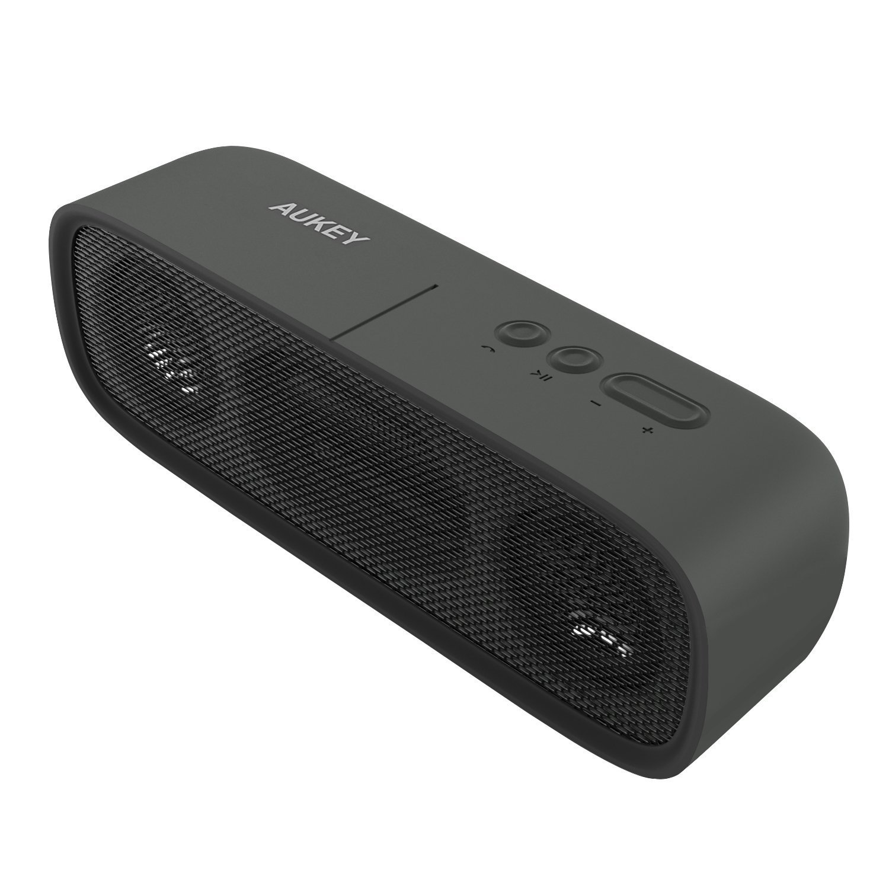

# Matériel compatible

> Quoi de plus **énervant** que d’**attendre 2 ou 3 semaines** pour recevoir son **nouveau matériel** et de se rendre compte à la réception qu’il n’est **pas compatible avec Jeedom,** ou encore qu’il **ne correspond pas** à ce que l’on espérait ?
> **\[datedermaj\]**
> Pour **éviter cela** et pour être **certains de commander le bon produit lors de vos achats**, je vous propose cette **liste** qui ne contient que du **matériel** que j’ai **testé** et **approuvé,** avec les liens vers les **articles correspondants** (tests, comparatifs, scénarios…). Vous saurez ainsi exactement ce qu’ils **font** ou **ne font pas**…
>
> Dès que j’aurai **testé de nouveaux produits compatibles avec Jeedom,** je les ajouterai sur cette page.
>
> N’hésitez pas à **vous abonner à la mailing list,** pour être tenus informé de l’évolution de cette liste et autres informations.
>
> \[mailpoet_form id= »2″\]

---

En cliquant sur les **liens des produits**, vous arriverez sur **Gearbest** ou **Amazon**. Si vous **achetez** le **produit** que je présente, je toucherai une petite **commission sur cette vente**.

Rassurez-vous, **vous ne paierez pas le produit plus cher,** cela me permet juste de **tester plus de produits** et donc de faire **plus d’articles**.

**Les sites n’ont pas de droit de regard sur les articles que j’écris** : je tiens à rester **intègre** et à donner **mon avis** (bon ou mauvais) sur ce que je teste.

De plus, **je ne touche rien de la part de Jeedom**, je suis donc totalement **libre de dire ce que je pense**, aussi bien sur **Jeedom** que sur les **plugins**.

_Bien évidemment, si un **développeur** souhaite **ajouter** une **information,** ou **constate** une **erreur,** il est tout à fait en **droit** de me le **faire savoir**, afin que je puisse apporter la **correction nécessaire**._

---

<table id="bonplans" class="w-full table-fixed border-collapse bg-white text-left text-sm"><tbody><tr><td style="font-size: 24px;width: 100%" valign="middle" height="20"><em><strong>Raspberry Pi 3</strong></em></td></tr><tr><td valign="top">Le <strong>Raspberry Pi</strong> c’est la base ! C’est le <strong>meilleur rapport qualité / prix</strong> pour installer Jeedom et dans sa version 3, vous avez le <strong>Wifi et le Bluetooth intégrés</strong>. Pour les néophytes, c’est un nano-ordinateur qui a la taille d’une carte de crédit. Il est vendu nu, c’est à dire juste la carte mère, sans boîtier, sans alimentation, ni clavier, ni souris ou d’écran.

<strong>Gearbest :</strong> 35 €.

<strong>Amazon : </strong><a href="http://amzn.to/2uNEqqr" target="_blank" rel="noopener noreferrer">40 €</a>.

<a href="https://www.amazon.fr/gp/aw/d/B01CD5VC92?&tag=guilbraimespa-21" target="_blank" rel="noopener noreferrer">Voir le Raspberry Pi 3 sur Amazon</a>

<strong>Pour aller plus loin :</strong>

<a href="/articles/installation-de-jeedom-netinstall-sur-raspberry-3" target="_blank" rel="noopener noreferrer">Jeedom – Installation de Jeedom Netinstall sur Raspberry 3</a>

<a href="/articles/jeedom-comparatif-sur-rpi-3-avec-xiaomi-zwave-ou-rf-433" target="_blank" rel="noopener noreferrer">Comparatif Jeedom sur RPI 3 avec Xiaomi, Zwave ou Rf-433</a>

<a href="/articles/multiroom-audio-video-installations-clients-videos-kodi" target="_blank" rel="noopener noreferrer">Multiroom Audio-Vidéo – Installations clients Vidéos (Kodi)</a>
</td></tr><tr><td style="font-size: 24px;" valign="middle" height="20"><em><strong>SanDisk Carte Mémoire microSDHC 16GB, Classe 10.</strong></em></td></tr><tr><td valign="top">Un Raspberry Pi (RPI) sans carte mémoire, c’est comme une voiture sans essence, ça ne démarre pas.

Pour <strong>installer</strong> <strong>Jeedom</strong> sur le RPI, il faut une <strong>carte SD</strong>, c’est l’équivalent du disque dur sur un PC.

Comme pour Mac ou PC, Android ou IOS, il y a la guerre des cartes SD, SanDisk ou Samsung…

Personnellement j’utilise ce modèle et je n’ai jamais eu de plantage que ce soit sur smartphone, ou RPI avec Kodi ou Jeedom.

L’important, c’est de prendre une carte <strong>classe 10</strong> et entre 8 et <strong>16 Go</strong> (8Go c’est presque le même prix que 16Go).

<strong>Gearbest :</strong> 10 €.

<strong>Amazon : </strong><a href="http://amzn.to/2n0tDoM" target="_blank" rel="noopener noreferrer">9 €</a>.
</td></tr><tr><td style="font-size: 24px;" valign="middle" height="20"><em><strong>Boitier pour RASPBERRY</strong></em></td></tr><tr><td valign="top">La petite <strong>boite</strong> qui va bien pour <strong>protéger tout ça !</strong>

Il y a aussi un <strong>tournevis</strong>, ainsi que des <strong>dissipateurs de chaleurs</strong>&nbsp;fournis qui permettent de refroidir la bête.

<strong>Gearbest :</strong> 3 €.

<strong>Amazon : </strong><a href="http://amzn.to/2voYVXy" target="_blank" rel="noopener noreferrer">8 €</a>.
</td></tr><tr><td rowspan="2" valign="top" width="240"></td><td style="font-size: 24px;" valign="middle" height="20"><em><strong><a href="http://amzn.to/2uH4ov1" target="_blank" rel="noopener noreferrer">ALIMENTATION POUR RASPBERRY PI 3</a></strong></em></td></tr><tr><td valign="top">Pour l’<strong>alimentation électrique,</strong> j’ai ce modèle qui est performant, car pour le <strong>Raspberry Pi 3</strong>, il faut pensez à prendre une alimentation <strong>5v</strong> d’au moins <strong>3000mA</strong>.

<strong>Amazon : </strong><a href="http://amzn.to/2uH4ov1" target="_blank" rel="noopener noreferrer">10 €</a>.
</td></tr><tr><td style="font-size: 24px;" valign="middle" height="20"><em><strong>XIAOMI MI GATEWAY</strong></em></td></tr><tr><td valign="top"><strong>Pour communiquer</strong> <strong>avec</strong> les différents composants (capteurs de porte, présence…) <strong>Jeedom</strong> à besoin de passerelles.

La <strong>Xiaomi Mi Gateway</strong> est parfaite pour cela, car elle n’est vraiment <strong>pas chère</strong> et <strong>compatible Jeedom</strong>&nbsp;via le plugin Xiaomi (6€), développé par <a href="https://lunarok-domotique.com/" target="_blank" rel="noopener noreferrer">Lunarok</a> et <a href="http://sarakha63-domotique.fr/" target="_blank" rel="noopener noreferrer">Sarakha63</a>.

<strong>Gearbest :</strong> 25 €.

<strong>Pour aller plus loin :</strong>

<a href="/articles/installation-et-configuration-de-la-gateway-xiaomi" target="_blank" rel="noopener noreferrer">Xiaomi Smart Home – Installation et configuration du Gateway</a>

<a href="/articles/installation-et-configuration-du-plugin-xiaomi" target="_blank" rel="noopener noreferrer">Jeedom et Xiaomi Smart Home – Installation et configuration du plugin Xiaomi</a>

<a href="/jeedom-et-xiaomi-smart-home-mises-a-jour-du-firmware-et-plugin" target="_blank" rel="noopener noreferrer">Jeedom et Xiaomi Smart Home – Mises à jour du Firmware et plugin</a>
</td></tr><tr><td style="font-size: 24px;" valign="middle" height="20"><em><strong>XIAOMI DÉTECTEUR DE MOUVEMENT</strong></em></td></tr><tr><td valign="top">Ce <strong>détecteur de mouvement,</strong> ou <strong>détecteur de présence,</strong> permet de <strong>déclencher</strong> une <strong>action</strong> lorsqu’un mouvement est détecté.

Nécessite la <a href="#xiaomi-mi-gateway">Mi Gateway</a> pour fonctionner.

<strong>Gearbest :</strong> 9 €.

<strong>Pour aller plus loin :</strong>

<a href="/articles/installation-et-configuration-du-detecteur-de-mouvement-xiaomi" target="_blank" rel="noopener noreferrer">Xiaomi Smart Home – Installation et configuration du détecteur de mouvement</a>

<a href="/articles/jeedom-scenario-lumiere-sur-presence-corrige-optimise" target="_blank" rel="noopener noreferrer">Jeedom Scénario – Lumière sur présence (Corrigé, optimisé)</a>
</td></tr><tr><td style="font-size: 24px;" valign="middle" height="20"><em><strong>XIAOMI CAPTEUR D’OUVERTURE DE PORTE.</strong></em></td></tr><tr><td valign="top">Ce <strong>capteur d’ouverture de porte </strong>ou<strong> fenêtre,&nbsp;</strong>permet de <strong>déclencher</strong> une <strong>action</strong> lors de <strong>l’ouverture</strong> ou de la <strong>fermeture</strong>.

Nécessite la <a href="#xiaomi-mi-gateway">Mi Gateway</a> pour fonctionner.

<strong>Gearbest :</strong> 7 €.

<strong>Pour aller plus loin :</strong>

<a href="/articles/installation-et-configuration-du-detecteur-douverture-de-porte-xiaomi" target="_blank" rel="noopener noreferrer">Xiaomi Smart Home – Installation et configuration du détecteur d’ouverture de porte</a>
</td></tr><tr><td style="font-size: 24px;" valign="middle" height="20"><em><strong>XIAOMI INTERRUPTEUR BOUTON</strong></em></td></tr><tr><td valign="top">Cet <strong>interrupteur </strong><strong>bouton,&nbsp;</strong>permet de <strong>déclencher</strong> une <strong>action</strong> grâce à un simple <strong>clic</strong>, <strong>double clic,&nbsp;</strong>ou<strong> long clic</strong>.

Nécessite la <a href="#xiaomi-mi-gateway">Mi Gateway</a> pour fonctionner.

<strong>Gearbest :</strong> 6 €.

<strong>Pour aller plus loin :</strong>

<a href="/articles/jeedom-scenario-bouton-switch-xiaomi" target="_blank" rel="noopener noreferrer">Jeedom Scénario – Bouton Switch Xiaomi</a>

<a href="/articles/jeedom-scenario-lumieres-bouton-switch-xiaomi" target="_blank" rel="noopener noreferrer">Jeedom Scénario – Lumières – Bouton Switch Xiaomi</a>

<a href="/articles/jeedom-scenario-sortie-des-poubelles-avec-rappel" target="_blank" rel="noopener noreferrer">Jeedom Scénario – Sortie des Poubelles avec rappel</a>
</td></tr><tr><td style="font-size: 24px;" valign="middle" height="20"><em><strong>Xiaomi Capteur de température et d’humidité.</strong></em></td></tr><tr><td valign="top">Ce petit objet qui <strong>se colle partout,</strong> mesure la <strong>température et l’humidité</strong> de la pièce où il se trouve, il permet d’être <strong>averti</strong> en cas de <strong>température</strong> ou d’<strong>humidité</strong> <strong>anormales</strong> et de&nbsp;<strong>déclencher</strong> un <strong>avertissement</strong> ou une <strong>action</strong>.

Nécessite la <a href="#xiaomi-mi-gateway">Mi Gateway</a> pour fonctionner.

<strong>Gearbest :</strong> 9 €.

<strong>Pour aller plus loin :</strong>

Je n’ai pas encore fait d’article autour de ce composant, mais je l’utilise par exemple pour <strong>m’avertir que la température intérieure est supérieure ou inférieure à la température extérieure</strong>, afin de fermer ou ouvrir les fenêtres.
</td></tr><tr><td style="font-size: 24px;" valign="middle" height="20"><em><strong>Xiaomi Prise murale – Version ZigBee.</strong></em></td></tr><tr><td valign="top">Cette <strong>prise connectée</strong> permet non seulement <b>d’allumer</b>&nbsp;ou <strong>d’éteindre</strong> les appareils branchés sur elle, mais aussi de <strong>mesurer la consommation d’électricité</strong>.

Nécessite la <a href="#xiaomi-mi-gateway">Mi Gateway</a> pour fonctionner.

<strong>Gearbest :</strong> 10 €.

<strong>Pour aller plus loin :</strong>

<a href="/articles/jeedom-scenario-lumiere-sur-presence-corrige-optimise" target="_blank" rel="noopener noreferrer">Jeedom Scénario – Lumière sur présence (Corrigé, optimisé)</a>

<strong>Tips :</strong> pensez à commander en même temps l’adaptateur de prise Europe / Asie.

<strong>Gearbest :</strong> 2 €.

<strong>Amazon : </strong><a href="http://amzn.to/2ufYTCU" target="_blank" rel="noopener noreferrer">11 € les 5</a>.
</td></tr><tr><td style="font-size: 24px;" valign="middle" height="20"><em><strong>Xiaomi Aqara Interrupteurs muraux à coller</strong></em></td></tr><tr><td valign="top">Cet <strong>interrupteur mural</strong> se <strong>colle au mur</strong>. Il se compose de <strong>2 boutons</strong> qui permettent de <strong>déclencher</strong> des <strong>actions</strong> grâce au <strong>clic droit</strong>, <strong>clic gauche,</strong> ou <strong>clic sur les 2 boutons</strong>.

Nécessite la <a href="#xiaomi-mi-gateway">Mi Gateway</a> pour fonctionner.

Attention il existe <strong>plusieurs variantes</strong>, voir <a href="/xiaomi-les-interrupteurs-muraux-aqara-wall-switch" target="_blank" rel="noopener noreferrer">l’article </a>pour plus de détails.

<strong>Gearbest :</strong> 12 €.

<strong>Pour aller plus loin :</strong>

<a href="/xiaomi-les-interrupteurs-muraux-aqara-wall-switch" target="_blank" rel="noopener noreferrer">Xiaomi – Les interrupteurs muraux – Aqara Wall Switch</a>
</td></tr><tr><td style="font-size: 24px;" valign="middle" height="20"><em><strong>Xiaomi Aqara Interrupteurs muraux encastrables</strong></em></td></tr><tr><td valign="top">Cet <strong>interrupteur mural</strong> est <strong>encastrable</strong>. Il se compose de <strong>2 boutons</strong> qui permettent de <strong>déclencher</strong> des <strong>actions</strong> grâce au<strong> clic droit, clic gauche, ou clic sur les 2 boutons</strong>. <strong>Attention</strong>, en chine les <strong>boites d’encastrement</strong>&nbsp;sont <strong>carrées</strong>&nbsp;et&nbsp;<strong>non</strong>&nbsp;<b>cylindriques comme en France</b>.

Nécessite la <a href="#xiaomi-mi-gateway">Mi Gateway</a> pour fonctionner.

<b>Attention :</b> il existe <strong>plusieurs variantes</strong>, voir <a href="/xiaomi-les-interrupteurs-muraux-aqara-wall-switch" target="_blank" rel="noopener noreferrer">l’article </a>pour plus de détails.

<strong>Gearbest :</strong> 26 €.

<strong>Pour aller plus loin :</strong>

<a href="/xiaomi-les-interrupteurs-muraux-aqara-wall-switch" target="_blank" rel="noopener noreferrer">Xiaomi – Les interrupteurs muraux – Aqara Wall Switch</a>
</td></tr><tr><td style="font-size: 24px;" valign="middle" height="20"><em><strong>Xiaomi 5 in 1 Smart Home</strong></em></td></tr><tr><td valign="top"><strong>Ce pack</strong> est celui que j’ai acheté lorsque j’ai commencé la domotique. Il <strong>contient tout</strong> ce dont vous aurez besoin <strong>pour vous faire la main</strong> :

<ul><li>La <a href="#xiaomi-mi-gateway">Mi Gateway</a>.</li><li>Un <a href="#xiaomi-detecteur-de-mouvements">détecteur de mouvement</a>.</li><li>Un<a href="#xiaomi-capteur-douverture-de-porte"> capteur d’ouverture de porte</a>.</li><li>Un <a href="#xiaomi-interrupteur-bouton">interrupteur bouton</a>.</li><li>Une <a href="#xiaomi-prise-murale-8211-version-zigbee">prise connectée.</a></li></ul>
<strong>Gearbest :</strong> 50 €.

<strong>Pour aller plus loin :</strong>

<a href="/jai-passe-commande-sur-un-site-chinois-gearbest" target="_blank" rel="noopener noreferrer">J’ai passé commande sur un site chinois ! – Gearbest</a>
</td></tr><tr><td style="font-size: 24px;" valign="middle" height="20"><em><strong>Xiaomi 6 in 1 Smart Home</strong></em></td></tr><tr><td valign="top"><strong>Ce pack</strong> est la <strong>nouvelle version</strong>, il contient en plus le <strong>capteur de temperature et humidité :</strong>

<ul><li>La <a href="#xiaomi-mi-gateway">Mi Gateway</a>.</li><li>Un <a href="#xiaomi-detecteur-de-mouvements">détecteur de mouvement</a>.</li><li>Un<a href="#xiaomi-capteur-douverture-de-porte"> capteur d’ouverture de porte</a>.</li><li>Un <a href="#xiaomi-interrupteur-bouton">interrupteur bouton</a>.</li><li>Une <a href="#xiaomi-prise-murale-8211-version-zigbee">prise connectée.</a></li><li>Un <a href="#xiaomi-capteur-de-temperature-et-dhumidite">capteur de température et humidité.</a></li></ul>
<strong>Gearbest :</strong> 75 €.
</td></tr><tr><td style="font-size: 24px;" valign="middle" height="20"><em><strong>Xiaomi Mi Enceinte connectée</strong></em></td></tr><tr><td valign="top">Cette <strong>enceinte</strong> connectée <strong>Multi-protocole,</strong> propose de<strong> nombreuses fonctions</strong> qui ne sont pas directement liées à Jeedom, mais une fois les 2 reliés, vous pourrez <strong>faire entrer&nbsp;<a href="http://www.allocine.fr/video/player_gen_cmedia=19537846&amp;cfilm=139589.html" target="_blank" rel="noopener noreferrer">Jarvis </a>dans votre maison</strong>.

<strong>Gearbest :</strong> 60 €.

<strong>Pour aller plus loin :</strong>

<a href="/articles/enceinte-connectee-wifi-upnp-bluetooth-mi-speaker-xiaomi" target="_blank" rel="noopener noreferrer">Xiaomi – Enceinte connectée – Mi-Speaker – Wifi, UPNP, Bluetooth</a>
</td></tr><tr><td rowspan="2" valign="top" width="240"></td><td style="font-size: 24px;" valign="middle" height="20"><em><strong><a href="http://amzn.to/2lF5tQA" target="_blank" rel="noopener noreferrer">AUKEY Enceinte Bluetooth 4.1 Portable Haut-Parleur 6W</a></strong></em></td></tr><tr><td valign="top">Si toutes les fonctions du modèle Xiaomi ne vous intéressent pas, cette petite enceinte <strong>se connecte facilement en Bluetooth à Jeedom</strong>.

<strong>Amazon : </strong><a href="http://amzn.to/2lF5tQA" target="_blank" rel="noopener noreferrer">24 €</a>.

<a href="https://www.amazon.fr/gp/aw/d/B01CV4L0FQ?&tag=guilbraimespa-21" target="_blank" rel="noopener noreferrer">Voir le produit sur Amazon</a>
</td></tr><tr><td style="font-size: 24px;" valign="middle" height="20"><em><strong>Xiaomi Mi routeur de WiFi</strong></em></td></tr><tr><td valign="top">Ce petit appareil se <strong>branche sur n’importe quelle prise USB</strong>, comme un chargeur de téléphone. Elle permet d’<strong>amplifier votre signal wifi</strong>. Vous pouvez soit utiliser le <strong>nom du wifi de votre box internet</strong> (Freebox, LiveBox…) ou <strong>créer un nouveau nom</strong> et donc un nouveau réseau.

Il existe une <strong>version chinoise et une version anglaise.</strong>&nbsp;Contrairement à ce que l’on peut lire sur certains blogs, il n’y a <strong>pas de différence</strong>. J’ai la <strong>version chinoise</strong> et elle est totalement <strong>compatible</strong> avec <strong>Mi-home en anglais</strong>.

<strong>Gearbest :</strong> 8 €.

<strong>Amazon : </strong><a href="http://amzn.to/2uNTNPN" target="_blank" rel="noopener noreferrer">20 €</a>.

<a href="https://www.amazon.fr/gp/aw/d/B071HDZ2W6?&tag=guilbraimespa-21" target="_blank" rel="noopener noreferrer">Voir le produit sur Amazon</a>

Pensez à acheter un<strong> chargeur USB</strong> pour le brancher partout.

<strong>Gearbest :</strong> 0.75 .

<strong>Amazon :</strong> <a href="http://amzn.to/2tkzCo5" target="_blank" rel="noopener noreferrer">3.60 </a>(Panier Plus).
</td></tr><tr><td style="font-size: 24px;" valign="middle" height="20"><em><strong>Xiaomi Mi Band 1S</strong></em></td></tr><tr><td valign="top">Xiaomi fait aussi dans les <strong>bracelets connectés</strong> et certains modèles sont <strong>compatible avec Jeedom</strong>. Cette fois pas besoin de la passerelle Mi Gateway ni même du plugin Xiaomi mais du <strong>plugin gratuit BLEA</strong> développé par <a href="http://sarakha63-domotique.fr/" target="_blank" rel="noopener noreferrer">Sarakha63</a>.

Le bracelet permet de compter le nombre de pas et analyser le sommeil.

<strong>Gearbest :</strong> 8 €.

<strong>Amazon : </strong><a href="http://amzn.to/2vp1BUO" target="_blank" rel="noopener noreferrer">18 €</a>.

<strong>Pour aller plus loin :</strong>

Personnellement je n’exploite pas le bracelet avec Jeedom, car il faut <strong>choisir entre l’application dédiée Mi-Fit ou Jeedom</strong>. Il est possible d’utiliser Mi-fit et Jeedom en même temps, mais <strong>Jeedom ne fera que détecter la présence</strong> ou non du bracelet.
</td></tr><tr><td style="font-size: 24px;" valign="middle" height="20"><em><strong>Broadlink RM PRO WiFi IR RF</strong></em></td></tr><tr><td valign="top">Voici un produit qui n’est pas estampillé Xiaomi ! Le RM Pro de chez Broadlink <strong>permet de contrôler</strong> un nombre impressionnant d’<strong>appareils</strong> qu’ils soient à <strong>infrarouge</strong> (TV, Ampli, Box…) ou&nbsp;<strong>télécommandable</strong> (Prises connectées…).

Le <strong>plugin gratuit Broadlink </strong>développé par&nbsp;<a href="http://sarakha63-domotique.fr/" target="_blank" rel="noopener noreferrer">Sarakha63</a> vous permettra de <strong>contrôler</strong> tous ces <strong>appareils</strong> <strong>depuis</strong> <strong>Jeedom</strong>.

<strong>Gearbest :</strong> 33 €.

<strong>Amazon : </strong><a href="http://amzn.to/2tzZoso" target="_blank" rel="noopener noreferrer">38 €</a>.

<strong>Pour aller plus loin :</strong>

<a href="/articles/controler-le-freebox-player" target="_blank" rel="noopener noreferrer">Jeedom Interactions – Contrôle Freebox Player</a>

<a href="/articles/jeedom-scenarios-zappeur-automatique-freebox-player" target="_blank" rel="noopener noreferrer">Jeedom Scénarios – Zappeur automatique Freebox Player</a>
</td></tr><tr><td rowspan="2" valign="top" width="240"></td><td style="font-size: 24px;" valign="middle" height="20"><em><strong><a href="http://amzn.to/2un5j2Q" target="_blank" rel="noopener noreferrer">Dash Button d’Amazon</a></strong></em></td></tr><tr><td valign="top">Les <strong>Dash Button</strong> d’Amazon peuvent être utilisés comme <strong>bouton</strong> <strong>simple clic</strong> avec <strong>Jeedom</strong>.

Le <strong>plugin gratuit Dash Button </strong>développé par <a href="https://lunarok-domotique.com/" target="_blank" rel="noopener noreferrer">Lunarok</a> vous permettra de <b>détourner </b>les <strong>Dash Button</strong> de leur fonction première afin d’être utilisés comme bouton <strong>Wifi</strong> dans <strong>Jeedom</strong>.

<strong>Amazon : </strong><a href="http://amzn.to/2tzZoso" target="_blank" rel="noopener noreferrer">4,99 € (Gratuit après la première commande)</a>.

<a href="https://www.amazon.fr/gp/aw/d/B06Y1PGG7H?&tag=guilbraimespa-21" target="_blank" rel="noopener noreferrer">Voir le produit sur Amazon</a>

<strong><em>Réservé aux clients Amazon premium (Prime).</em></strong>

<strong>Pour aller plus loin :</strong>

<a href="/articles/primevideo-com-le-streaming-gratuit-damazon-premium" target="_blank" rel="noopener noreferrer">Primevideo.com le Streaming Gratuit d’Amazon Premium</a>

<a href="/articles/amazon-prime-music-gratuit">Amazon Prime Music gratuit</a>
</td></tr><tr><td rowspan="2" valign="top" width="240"></td><td style="font-size: 24px;" valign="middle" height="20"><em><strong><a href="http://www.samsung.com/fr/consumer/mobile-devices/smartphones/others/GT-I9205ZKAXEF/" target="_blank" rel="noopener noreferrer">Samsung GALAXY Mega</a></strong></em></td></tr><tr><td valign="top">J’utilise ce <strong>smartphone</strong> pour faire tourner <strong>l’application</strong> <a href="https://www.jeedom.com/forum/viewtopic.php?f=27&amp;t=18283&amp;p=469610#p469388" target="_blank" rel="noopener noreferrer">Android Jeedom Paw Interface</a> créé par <a href="https://www.jeedom.com/forum/viewtopic.php?f=27&amp;t=18283&amp;p=469610#p469388" target="_blank" rel="noopener noreferrer">DjuL</a>.&nbsp;Il ne se <strong>vend plus</strong> dans le commerce mais se trouve <strong>d’occasion</strong>.

Il n’est <strong>pas </strong><strong>très</strong><strong>&nbsp;puissant</strong> mais avec son <strong>grand </strong><strong>écran</strong>&nbsp;c’est une bonne alternative à une tablette avec carte SIM 4G.

<strong>Pour aller plus loin :</strong>

<a href="/articles/jeedom-installation-et-configuration-de-jeedom-paw-interface" target="_blank" rel="noopener noreferrer">Jeedom – Installation et configuration de Jeedom Paw Interface</a>

<a href="/articles/jeedom-envoi-de-sms-via-jeedom-paw-interface" target="_blank" rel="noopener noreferrer">JEEDOM – Envoi de SMS Via JEEDOM PAW INTERFACE</a>
</td></tr><tr><td style="font-size: 24px;" valign="middle" height="20"><em><strong>XIAOMI MI MAGIC CONTROLLER</strong></em></td></tr><tr><td valign="top">Le Xiaomi <strong>Mi Magic</strong> est une sorte de <strong>télécommande</strong>. Nécessite la Gateway pour fonctionner.

<strong>6 gestes</strong> : pousser, secouer, frapper, faire pivoter, renverser 90 degrés, renverser 180 degrés.

<strong>Gearbest :</strong> 12 €.

<strong>Pour aller plus loin :</strong>

Article en préparation
</td></tr><tr><td style="font-size: 24px;" valign="middle" height="20"><em><strong>XIAOMI MI ROBOT VACUUM</strong></em></td></tr><tr><td valign="top">Le Mi Robot est un <strong>aspirateur robot</strong>. Le capteur de distance laser (LDS) balaye son environnement sur 360 degrés, 1800 fois par seconde, pour <strong>tracer</strong> et&nbsp;<strong>apprendre</strong>&nbsp;<strong>l’intérieur</strong> de votre <strong>logement</strong>. Les processeurs calculent alors <strong>l’itinéraire</strong> le plus efficace pour le <strong>nettoyage</strong>.

A l’aide de l’application <strong>Mi Home</strong>, vous pouvez allumer et <strong>contrôler à distance</strong> le robot, modifier les modes de nettoyage et régler les horaires.

<strong>Gearbest :</strong> 290 €.

<strong>Amazon : </strong><a href="http://amzn.to/2xawPCx" target="_blank" rel="noopener noreferrer">390 €</a>.

<strong>Pour aller plus loin :</strong>

<a title="Pr�sentation � Xiaomi Mi-Robot � Aspirateur Robot" href="/presentation-xiaomi-mi-aspirateur-robot" rel="bookmark">Présentation – Xiaomi Mi-Robot – Aspirateur Robot</a>

<a href="/test-xiaomi-mi-robot-aspirateur-robot">Test – Xiaomi Mi-Robot – Aspirateur Robot</a>
</td></tr><tr><td style="font-size: 24px;" valign="middle" height="20"><em><strong>ASPIRATEUR ROBOT XIAOMI ROBOROCK S50</strong></em></td></tr><tr><td valign="top">Cet&nbsp;<strong>aspirateur</strong>&nbsp;robot&nbsp;<strong>connecté&nbsp;</strong>reprend les caractéristiques de la première version, en&nbsp;<strong>ajoutant</strong>&nbsp;principalement une fonction de&nbsp;<strong>nettoyage du sol</strong>, à l’aide d’un système d’éponge humide.

La&nbsp;<strong>puissance d’aspiration</strong>&nbsp;passe de 1800 Pa à 2000 Pa et un&nbsp;<strong>mode «&nbsp;Tapis&nbsp;»</strong>&nbsp;augmente la puissance d’aspiration lors de la détection d’un tapis.

<strong>Gearbest :</strong> 480 €.

<strong>Amazon : </strong><a href="https://amzn.to/2lN2rHF" target="_blank" rel="noopener noreferrer">490 €</a>.

<strong>Pour aller plus loin :</strong>

<a href="/articles/aspirateur-robot-xiaomi-roborock-s50">Aspirateur Robot Xiaomi Roborock S50</a>
</td></tr><tr><td rowspan="2" valign="top" width="240"></td><td style="font-size: 24px;" valign="middle" height="20"><em><strong>XIAOMI YEELIGHT E27 RGBW</strong></em></td></tr><tr><td valign="top">Une <strong>ampoule de couleur</strong> qui peut être contrôlée via l’application <strong>Mi-home</strong> que nous connaissons bien, avec les produits Xiaomi smart home, ou avec l’application dédiée appelée&nbsp;<strong>Yeelight</strong>. Grâce aux <strong>plugins</strong> disponibles sur le market, elle est intégrable à <strong>Jeedom</strong>.

Cette fois <strong>pas besoin</strong> de la passerelle Mi <strong>Gateway, </strong>elle juste a <strong>besoin</strong> d’être connectée au réseau <strong>wifi</strong> de votre logement pour <strong>fonctionner</strong>.

<strong>Gearbest :</strong> 14 €.

<strong>Amazon : </strong><a href="http://amzn.to/2xQdwf3" target="_blank" rel="noopener noreferrer">28 €</a>.

<a href="https://www.amazon.fr/gp/aw/d/B0773H9FY3?&tag=guilbraimespa-21" target="_blank" rel="noopener noreferrer">Voir le produit sur Amazon</a>

<strong>Pour aller plus loin :</strong>

<a href="/articles/ampoules-connectees-couleur-et-blanc-xiaomi-yeelight">Xiaomi Yeelight – Ampoules E27 Wifi – Couleurs et Blanc</a>
</td></tr><tr><td rowspan="2" valign="top" width="240">&nbsp;</td><td style="font-size: 24px;" valign="middle" height="20"><em><strong>XIAOMI YEELIGHT E27 Blanc</strong></em></td></tr><tr><td valign="top">Une <strong>ampoule blanche</strong> qui peut être contrôlée via l’application <strong>Mi-home</strong>&nbsp;également, avec les produits Xiaomi smart home, ou avec l’application dédiée appelée&nbsp;<strong>Yeelight</strong>. Grâce aux <strong>plugins</strong> disponibles sur le market, elle est intégrable à <strong>Jeedom</strong>.

Cette fois <strong>pas besoin</strong> de la passerelle Mi <strong>Gateway, </strong>elle juste a <strong>besoin</strong> d’être connectée au réseau <strong>wifi</strong> de votre logement pour <strong>fonctionner</strong>.

<strong>Gearbest :</strong> 10 €.

<strong>Amazon : </strong><a href="http://amzn.to/2eIQ0g7" target="_blank" rel="noopener noreferrer">19 €</a>.

<strong>Pour aller plus loin :</strong>

<a href="/articles/ampoules-connectees-couleur-et-blanc-xiaomi-yeelight">Xiaomi Yeelight – Ampoules E27 Wifi – Couleurs et Blanc</a>
</td></tr><tr><td style="font-size: 24px;" valign="middle" height="20"><em><strong>XIAOMI MI BAND 2</strong></em></td></tr><tr><td valign="top">Mi Band 2 est un <strong>bracelet connecté</strong>, en particulier pour les amateurs de sport ou autres activités physiques ! Ce bracelet&nbsp;<strong>enregistre</strong> le nombres de pas, la distance parcourue, les calories consommées, le rythme cardiaque, et les <strong>données</strong> sont <strong>synchronisées</strong> et <strong>analysées</strong> sur votre smartphone, grâce à l’application <strong>Mi-Fit</strong>. Lorsque vous <strong>dormez</strong>, il surveille aussi votre <strong>sommeil</strong> et vous <strong>réveille</strong>&nbsp;en vibrant <strong>doucement</strong>.Cette fois <strong>pas besoin</strong> de la passerelle Mi <strong>Gateway</strong> ni même du plugin Xiaomi, mais du <strong>plugin gratuit BLEA</strong> développé par <a href="http://sarakha63-domotique.fr/" target="_blank" rel="noopener noreferrer">Sarakha63</a><strong>Gearbest :</strong> 18 €.<strong>Amazon : </strong><a href="http://amzn.to/2f29b0T" target="_blank" rel="noopener noreferrer">28 €</a>.<strong>Pour aller plus loin : </strong><del>Personnellement je n’exploite pas le bracelet avec Jeedom, car il faut <strong>choisir entre l’application dédiée Mi-Fit ou Jeedom</strong>.</del> Il est possible d’utiliser Mi-fit et Jeedom en même temps, mais <strong>Jeedom ne fera que détecter la présence</strong> ou non du bracelet.</td></tr><tr><td rowspan="2" valign="top" width="240">&nbsp;</td><td style="font-size: 24px;" valign="middle" height="20"><em><strong>Détecteur d’incendie Xiaomi mijia Honeywell</strong></em></td></tr><tr><td valign="top">Détecteur <strong>d’incendie</strong>&nbsp;<strong>connecté. </strong>Il s’intègre dans la suite de produits <strong>Xiaomi smart Home</strong>. Doté d’une connexion sans fil <strong>ZigBee</strong>, il nécessite la <strong>Gateway</strong> pour fonctionner et il est contrôlable via l’application «&nbsp;<strong>Mi Home</strong>&nbsp;» ainsi que&nbsp;<strong>Jeedom</strong> via le <strong>plugin</strong> Xiaomi.

<strong>Gearbest :</strong> 25 €.

<strong>Pour aller plus loin :</strong>

Article en préparation.
</td></tr><tr><td rowspan="2" valign="top" width="240">&nbsp;</td><td style="font-size: 24px;" valign="middle" height="20"><em><strong>Interrupteur sans fil Xiaomi Aqara</strong></em></td></tr><tr><td valign="top"><strong>L’interrupteur</strong> sans fil <strong>Aqara</strong> est un bouton poussoir. Il fait partie de la suite <strong>Xiaomi Smart Home</strong>. Doté d’une connexion sans fil <strong>ZigBee</strong>, il nécessite la <strong>Gateway</strong> pour fonctionner et il est contrôlable via l’application «&nbsp;<strong>Mi Home</strong>&nbsp;» ainsi que&nbsp;<strong>Jeedom</strong> via le <strong>plugin</strong> Xiaomi.

Il est <strong>différent</strong> du modèle «&nbsp;<strong>rond</strong>&nbsp;» car il permet <strong>seulement</strong> de faire un «&nbsp;<strong>simple clic</strong>&nbsp;» ou un «&nbsp;<strong>double clic</strong>«&nbsp;, il n’y a <strong>pas</strong> le <strong>«&nbsp;long</strong> <strong>clic&nbsp;»</strong>.

<strong>Gearbest :</strong> 5 €.

<strong>Pour aller plus loin :</strong>

Article en préparation. Cependant le <strong>fonctionnement</strong> est <strong>similaire</strong> au <strong>switch</strong> Xiaomi. (long clic en moins.)

<a href="/articles/jeedom-scenario-lumieres-bouton-switch-xiaomi">Jeedom Scenario – Lumières – Bouton Switch Xiaomi</a>

<a href="/articles/jeedom-scenario-bouton-switch-xiaomi">Jeedom Scenario – Bouton Switch Xiaomi</a>
</td></tr><tr><td rowspan="2" valign="top" width="240">&nbsp;</td><td style="font-size: 24px;" valign="middle" height="20"><em><strong>Capteur de porte &amp; fenêtre Xiaomi Aqara</strong></em></td></tr><tr><td valign="top">Le <strong>capteur de porte &amp; fenêtre</strong> Xiaomi <strong>Aqara</strong> détecte l’ouverture et la fermeture des portes et fenêtres. Doté d’une connexion sans fil <strong>ZigBee</strong>, il nécessite la <strong>Gateway</strong> pour fonctionner et il est contrôlable via l’application «&nbsp;<strong>Mi Home</strong>&nbsp;» ainsi que&nbsp;<strong>Jeedom</strong> via le <strong>plugin</strong> Xiaomi.

Le capteur se compose d’un <strong>capteur</strong> et d’un <strong>aimant</strong>. Le fonctionnement est le <strong>même</strong> que pour le modèle&nbsp;«&nbsp;<strong>rond</strong>«&nbsp;<strong>.</strong>

<strong>Gearbest :</strong> 5€.

<strong>Pour aller plus loin :</strong>

Article en préparation. Cependant le <strong>fonctionnement</strong> est <strong>similaire</strong> au <strong>détecteur</strong> d’ouverture «&nbsp;<strong>rond</strong>«&nbsp;.

<a href="/articles/installation-et-configuration-du-detecteur-douverture-de-porte-xiaomi" target="_blank" rel="noopener noreferrer">Xiaomi Smart Home – Installation et configuration du détecteur d’ouverture de porte</a>
</td></tr><tr><td rowspan="2" valign="top" width="240">&nbsp;</td><td style="font-size: 24px;" valign="middle" height="20"><em><strong>Capteur d’humidité &amp; de température Xiaomi Aqara</strong></em></td></tr><tr><td valign="top">Le <strong>capteur d’humidité &amp; de température</strong> Xiaomi <strong>Aqara</strong> peut surveiller la température, l’humidité et la <strong>pression atmosphérique</strong>. Doté d’une connexion sans fil <strong>ZigBee</strong> il nécessite la <strong>Gateway</strong> pour fonctionner et est contrôlable via l’application «&nbsp;<strong>Mi Home</strong>&nbsp;» et <strong>Jeedom</strong> via le <strong>plugin</strong> Xiaomi.

Le fonctionnement est le <strong>même</strong> que pour le modèle&nbsp;«&nbsp;<strong>rond</strong>&nbsp;» sauf qu’il propose la <strong>pression atmosphérique en plus.</strong>

<strong>Gearbest :</strong> 8 €.

<strong>Pour aller plus loin :</strong>

Article en préparation. Cependant le <strong>fonctionnement</strong> est <strong>similaire</strong> au <strong>détecteur</strong> d’ouverture «&nbsp;<strong>rond</strong>&nbsp;» avec la <strong>pression atmosphérique en plus</strong>.
</td></tr><tr><td rowspan="2" valign="top" width="240">&nbsp;</td><td style="font-size: 24px;" valign="middle" height="20"><em><strong>Capteur de mouvements Xiaomi Aqara</strong></em></td></tr><tr><td valign="top">Le <strong>capteur de mouvements</strong> Xiaomi <strong>Aqara</strong> détecte les mouvements et la luminosité dans une pièce. Doté d’une connexion sans fil <strong>ZigBee</strong>, il nécessite la <strong>Gateway</strong> pour fonctionner et il est contrôlable via l’application «&nbsp;<strong>Mi Home</strong>&nbsp;» ainsi que&nbsp;<strong>Jeedom</strong> via le <strong>plugin</strong> Xiaomi.

Le fonctionnement est le <strong>même</strong> que pour le <strong>détecteur</strong> de mouvements <strong>précédent</strong>, avec la <strong>luminosité en plus.</strong>

<strong>Gearbest :</strong> 5€.

<strong>Pour aller plus loin :</strong>

Article en préparation. Cependant le <strong>fonctionnement</strong> est <strong>similaire</strong> a la <strong>première version</strong> du détecteur de mouvements <strong>avec la luminosité en plus</strong>.

<a href="/articles/installation-et-configuration-du-detecteur-de-mouvement-xiaomi">Xiaomi Smart Home – Installation et configuration du détecteur de mouvement</a>

<a href="/articles/jeedom-scenario-lumiere-sur-presence-corrige-optimise">Jeedom Scénario – Lumière sur présence (Corrigé, optimisé)</a>
</td></tr><tr><td rowspan="2" valign="top" width="240">&nbsp;</td><td style="font-size: 24px;" valign="middle" height="20"><em><strong>Xiaomi Mijia Smart LED Desk Lamp</strong></em></td></tr><tr><td valign="top">Cette lampe Wifi peut être <strong>contrôlée</strong>&nbsp;via l’application <strong>Mi-home</strong>&nbsp;que nous connaissons bien, avec les produits Xiaomi smart home, ou avec l’application dédié Yeelight, mais surtout en <strong>local</strong>, avec le <strong>bouton</strong> sur le pied de la lampe.

Grâce au&nbsp;<strong>plugin</strong>&nbsp;Xiaomi disponible sur le market, elle est intégrable à&nbsp;<strong>Jeedom.</strong>

<strong>A noter</strong> : Elle doit&nbsp;être <strong>connectée</strong>&nbsp;au réseau <strong>wifi</strong> de votre logement pour <strong>fonctionner,</strong> par contre, elle n’a&nbsp;<strong>pas</strong> besoin de la <strong>gateway</strong> Xiaomi.

<strong>Gearbest :</strong> 30 €.

<strong>Pour aller plus loin :</strong>

<a href="/xiaomi-mijia-lampe-de-bureau">Xiaomi Mijia – Lampe de Bureau</a>
</td></tr><tr><td rowspan="2" valign="top" width="240">&nbsp;</td><td style="font-size: 24px;" valign="middle" height="20"><em><strong>Xiaomi Yeelight Smart Light Strip</strong></em></td></tr><tr><td valign="top">Une <strong>bande de Led en couleur</strong> qui peut être contrôlée via l’application <strong>Mi-home</strong> que nous connaissons bien, avec les produits Xiaomi smart home, ou avec l’application dédiée appelée&nbsp;<strong>Yeelight</strong>. Grâce aux <strong>plugins</strong> disponibles sur le market, elle est intégrable à <strong>Jeedom</strong>.

Cette fois <strong>pas besoin</strong> de la passerelle Mi <strong>Gateway, </strong>elle a juste&nbsp;<strong>besoin</strong> d’être connectée au réseau <strong>wifi</strong> de votre logement pour <strong>fonctionner</strong>.

<strong>Gearbest :</strong> 25 €.

<strong>Pour aller plus loin :</strong>

<strong>Article en préparation.</strong> Cependant le <strong>fonctionnement</strong> est <strong>similaire</strong>&nbsp;à l’ampoule <a href="/articles/ampoules-connectees-couleur-et-blanc-xiaomi-yeelight">Yeelight RGB</a>.
</td></tr><tr><td rowspan="2" valign="top" width="240">&nbsp;</td><td style="font-size: 24px;" valign="middle" height="20"><em><strong>Xiaomi Mi Home Smart WiFi Socket</strong></em></td></tr><tr><td valign="top">Cette <strong>prise connectée</strong>&nbsp;Wifi permet, contrairement au model Zigbee, seulement <b>d’allumer</b>&nbsp;ou <strong>d’éteindre</strong> les appareils. Il n’y a pas de&nbsp;<strong>mesure de la consommation d’électricité</strong>.

Par contre elle ne nécessite pas la <a href="#xiaomi-mi-gateway">Mi Gateway</a> pour fonctionner, elle se connecte simplement au wifi du logement.

<strong>Gearbest :</strong> 11 €.

<strong>Pour aller plus loin :</strong>

<a href="/articles/jeedom-scenario-lumiere-sur-presence-corrige-optimise" target="_blank" rel="noopener noreferrer">Jeedom Scénario – Lumière sur présence (Corrigé, optimisé)</a>

<strong>Tips :</strong> pensez à commander en même temps l’adaptateur de prise Europe / Asie.

<strong>Gearbest :</strong> 2 €.

<strong>Amazon : </strong><a href="http://amzn.to/2ufYTCU" target="_blank" rel="noopener noreferrer">11 € les 5</a>.
</td></tr><tr><td rowspan="2" valign="top" width="240">&nbsp;</td><td style="font-size: 24px;" valign="middle" height="20"><em><strong>Xiaomi Mi TV Box</strong></em></td></tr><tr><td valign="top">Cette <b>box est compatible Jeedom </b>non pas pour installer Jeedom mais avec JPI qui est une application qui permet de contrôler&nbsp;un appareil Android depuis Jeedom.

<ul><li><strong>Gearbest :</strong> 59 €.</li><li><strong>Amazon</strong> : <a href="http://amzn.to/2Fn1Ngi" target="_blank" rel="noopener noreferrer">115 €.</a></li></ul>
<strong>Pour aller plus loin :</strong>

<a href="/jeedom-xiaomi-mi-box-android-tv">Jeedom – Xiaomi Mi-Box – Android TV</a>

&nbsp;
</td></tr><tr><td rowspan="2" valign="top" width="240">&nbsp;</td><td style="font-size: 24px;" valign="middle" height="20"><em><strong>RASPBERRY PI ZERO W</strong></em></td></tr><tr><td valign="top">Vous connaissez certainement les fameuses nano cartes mères&nbsp;<strong>Raspberry Pi</strong>&nbsp;et surtout la version 3 qui apporte le&nbsp;<strong>Wifi</strong>&nbsp;et le&nbsp;<strong>bluetooth</strong>.

Permettez-moi de vous présenter sa petite sœur, la&nbsp;<strong>Raspberry Pi Zero W,&nbsp;</strong>sortie il y a tout juste un an à l’occasion des 5 ans du premier modèle de Raspberry.

<strong>Plus petit</strong>,&nbsp;<strong>moins&nbsp;</strong><strong>puissant</strong>, mais aussi&nbsp;<strong>moins&nbsp;</strong><strong>cher</strong>, ce&nbsp;<b>nano-ordinateur&nbsp;</b>convient parfaitement pour une&nbsp;<strong>antenne bluetooth</strong>&nbsp;associée au plugin (gratuit)&nbsp;<strong>Bluetooth Advertisement</strong>, plus connu sous le nom de&nbsp;<strong>BLEA</strong>.
<ul><li><strong>20 €</strong>&nbsp;avec le boitier sur&nbsp;Gearbest.</li><li><strong>26 €</strong>&nbsp;avec le boitier sur&nbsp;<a href="http://amzn.to/2BHHvfc" target="_blank" rel="noopener noreferrer">Amazon</a>&nbsp;(prime).</li></ul>
<strong>Pour aller plus loin :</strong>

<a href="/articles/blea-sur-raspberry-pi-zero-w" target="_blank" rel="noopener noreferrer">Jeedom – BLEA sur Raspberry pi Zero W</a>
</td></tr><tr><td rowspan="2" valign="top" width="240">&nbsp;</td><td style="font-size: 24px;" valign="middle" height="20"><em><strong>Xiaomi Mijia Bedside Lamp WiFi</strong></em></td></tr><tr><td valign="top">Cette lampe <strong>Wifi</strong> peut être <strong>contrôlée</strong>&nbsp;via l’application <strong>Mi-home</strong>&nbsp;que nous connaissons bien, avec les produits Xiaomi smart home, ou avec l’application dédié Yeelight, mais surtout en <strong>local</strong>, avec les&nbsp;<strong>bouton</strong>&nbsp;et la <strong>surface tactile</strong> sur le dessus de la lampe.

Grâce au&nbsp;<strong>plugin</strong>&nbsp;Xiaomi disponible sur le market, elle est intégrable à&nbsp;<strong>Jeedom.</strong>

<strong>A noter</strong> : Elle doit&nbsp;être <strong>connectée</strong>&nbsp;au réseau <strong>wifi</strong> de votre logement pour <strong>fonctionner,</strong> par contre, elle n’a&nbsp;<strong>pas</strong> besoin de la <strong>gateway</strong> Xiaomi.

<strong>Gearbest :</strong> 46 €.

<b>Pour aller plus loin : </b>(Article sur la version bluetooth mais l’utilisation est très&nbsp;proche).

<a href="/articles/lampe-de-chevet-xiaomi-yeelight" target="_blank" rel="noopener noreferrer">Xiaomi Yeelight – Lampe de chevet (Bedside Lamp)</a>
</td></tr><tr><td rowspan="2" valign="top" width="240">&nbsp;</td><td style="font-size: 24px;" valign="middle" height="20"><em><strong>Xiaomi Yeelight Bedside Lamp Bluetooth</strong></em></td></tr><tr><td valign="top">Cette lampe <b>Bluetooth&nbsp;</b>peut être <strong>contrôlée</strong>&nbsp;via l’application <strong>Mi-home</strong>&nbsp;que nous connaissons bien, avec les produits Xiaomi smart home, ou avec l’application dédié Yeelight, mais surtout en <strong>local</strong>, avec les&nbsp;<strong>bouton</strong>&nbsp;et la <strong>surface tactile</strong> sur le dessus de la lampe.

Grâce au&nbsp;<strong>plugin</strong>&nbsp;Blea disponible sur le market, elle est intégrable à&nbsp;<strong>Jeedom.</strong>

<strong>A noter</strong> : Elle doit&nbsp;être <strong>connectée</strong>&nbsp;au Bluetooth de Jeedom ou à une antenne Blea pour <strong>fonctionner,</strong> par contre, elle n’a&nbsp;<strong>pas</strong> besoin de la <strong>gateway</strong> Xiaomi.

<strong>Gearbest :</strong> 44 €.

<strong>Pour aller plus loin :</strong>

<a href="/articles/lampe-de-chevet-xiaomi-yeelight" target="_blank" rel="noopener noreferrer">Xiaomi Yeelight – Lampe de chevet (Bedside Lamp)</a>
</td></tr><tr><td rowspan="2" valign="top" width="240">&nbsp;</td><td style="font-size: 24px;" valign="middle" height="20"><em><strong>CAMÉRA IP WANSCAM HW0026</strong></em></td></tr><tr><td valign="top">La&nbsp;caméra IP&nbsp;<strong>Wanscam HW0026</strong>&nbsp;est une caméra&nbsp;<strong>wifi</strong>&nbsp;802.11/b/g/n, sans port Ethernet, avec un&nbsp;<strong>angle de prise de vue de 90 °,</strong>&nbsp;sa résolution est de&nbsp;<strong>720P</strong>&nbsp;en&nbsp;<strong>H.264</strong>&nbsp;ce qui permet d’avoir des images de&nbsp;<strong>bonne qualité.</strong>

Il est possible de faire de la&nbsp;<strong>détection de mouvement</strong>, avec&nbsp;<strong>enregistrement</strong>&nbsp;en&nbsp;<strong>local</strong>&nbsp;sur&nbsp;<strong>carte SD</strong>, ou en&nbsp;<strong>déporté</strong>&nbsp;sur un&nbsp;<a href="https://amzn.to/2Hhn4DW">NAS</a>&nbsp;par exemple.

La&nbsp;<strong>caméra</strong>&nbsp;est relativement&nbsp;<strong>petite</strong>, 8 x 8 x 11, 70 cm (L x W x H) et très&nbsp;<strong>légère</strong>.

<strong>Gearbest :</strong> 19 €.

<strong>Pour aller plus loin :</strong>

<a href="/articles/camera-ip-wanscam-hw0026">Caméra IP Wanscam HW0026</a>
</td></tr></tbody></table>

