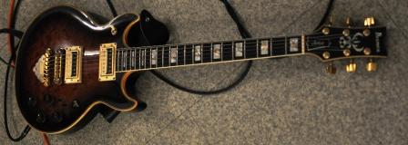
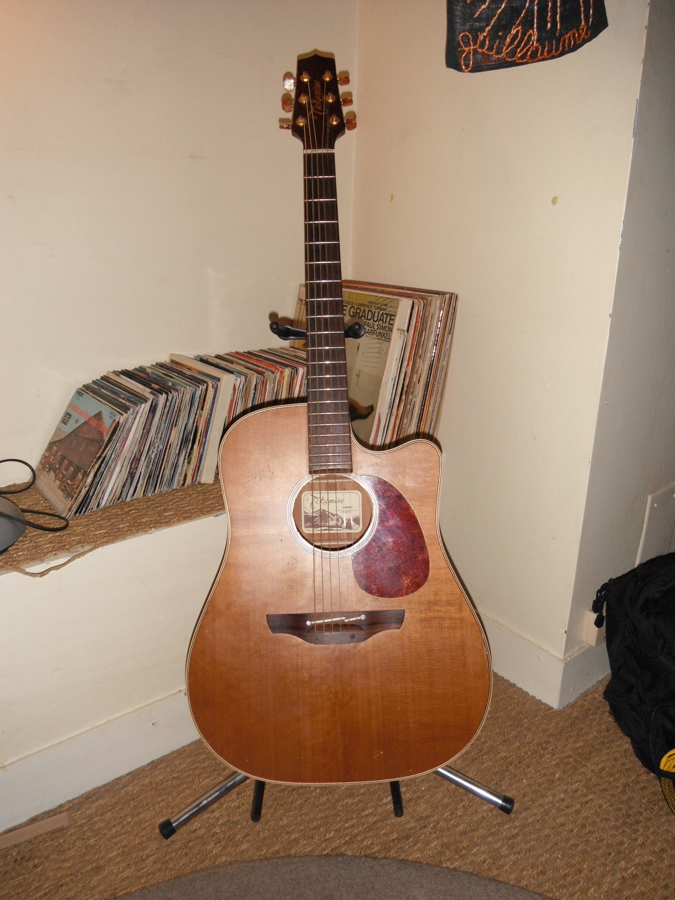
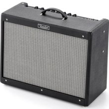
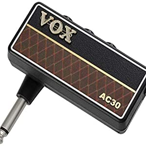
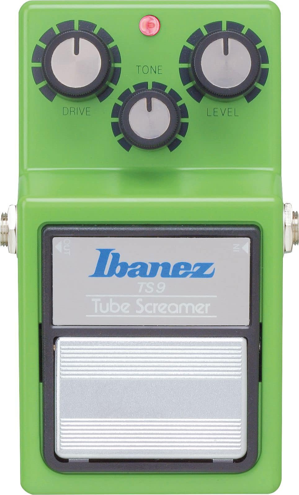
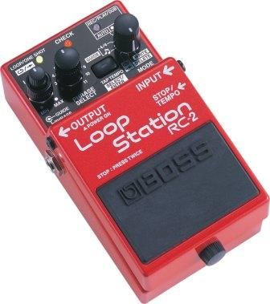
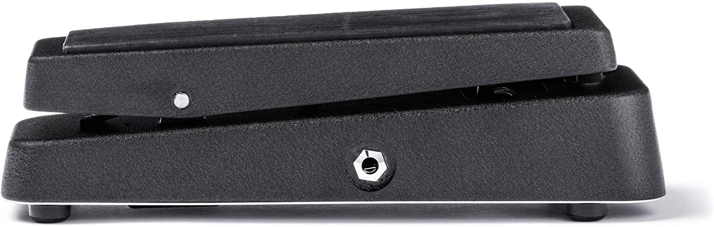
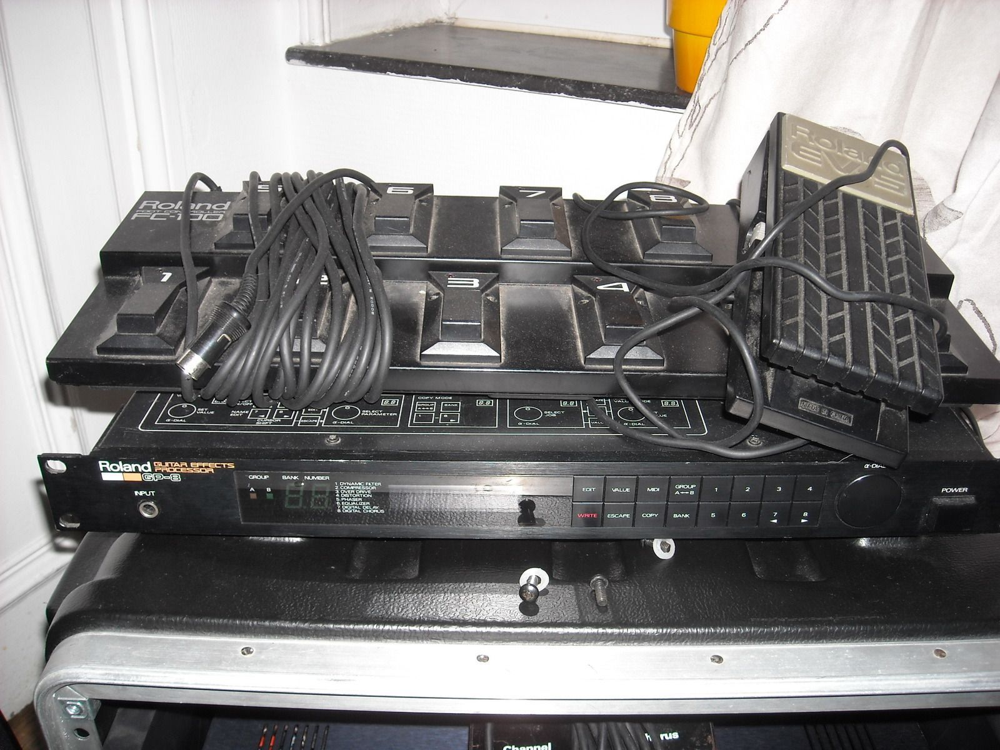

# Mon matos

Mes instruments de prédilection, ceux que j’utilises le plus souvent et qui ont, pour la plupart, fait partie de mon univers depuis mes débuts.

## Guitares

### Fender Stratocaster SRV

En 1992, Fender introduit officiellement la « Stevie Ray Vaughan Signature Stratocaster », une guitare conçue en étroite collaboration avec l'artiste avant sa tragique disparition en 1990. Conçue initialement pour le NAMM Show 1992, elle est entrée en production sous le contrôle avisé de son frère, Jimmie Vaughan.

Cette guitare est directement basée sur la 'Number One', la légendaire Stratocaster vintage de 1963 acquise par Stevie Ray Vaughan en 1974 dans une boutique d'Austin, au Texas, et utilisée sur tous les enregistrements studio et live avec Double Trouble.

Le modèle n'a pratiquement pas évolué depuis sa première mouture, exception faite de la touche : initialement en Palissandre Brésilien, elle est désormais conçue en **Pau Ferro** (ou Pao-Ferro / Palissandre de Bolivie). Ce bois exotique possède une densité lui conférant un caractère sonore intermédiaire entre le Palissandre et l'Érable, tout en restant sensiblement plus proche de ce dernier.

L'autre atout majeur réside dans son set de **micros Custom Shop Texas Special**. Ces micros à simple bobinage délivrent des sonorités riches et détaillées grâce à des médiums très présents. Ils s'avèrent plus mordants et réactifs que les standards de la marque, notamment le micro chevalet qui excelle sur des niveaux de saturation élevés.

#### Spécifications techniques

- **Catégorie :** Guitare électrique solidbody
- **Série :** Artist Signature (Provenance : USA)
- **Corps :** Aulne
- **Manche :** Érable (Profil _Deep, Thick Oval_)
- **Touche :** Pao-Ferro (Radius 12" / Diapason 25.5" / 21 frettes Dunlop® 6105 Jumbo)
- **Largeur au sillet :** 1.650” (42 mm)
- **Configuration micros :** 3 simples Fender Custom Shop Texas Special
- **Contrôles :** Master Volume, Tone 1 (Manche), Tone 2 (Milieu), sélecteur 5 positions
- **Chevalet :** Vibrato Fender American Vintage Synchronized (Modèle inversé pour gaucher)
- **Accastillage :** Doré
- **Couleur :** 3-Color Sunburst
- **Accessoires :** Livrée en étui Fender Deluxe Vintage Tweed
- **Cordes d'origine :** Fender® USA Super 250R, NPS (.010 - .046)
- **Référence catalogue :** 010-9200-800

---

### Ibanez Artist AR-300

L'AR300 est un modèle solid body de la prestigieuse série _Artist_, introduit par Ibanez en 1979 et fabriqué au Japon (venant remplacer l'ancien modèle 2619).

Elle est dotée d'une table en érable flammé sculpté avec plusieurs reliures de lutherie sur un corps en acajou à double pan coupé. Son manche collé en érable (3 pièces) accueille une touche en ébène de 22 frettes, incrustée de repères en blocs fendus associant nacre et abalone.

Côté électronique, la configuration d'origine comprenant une paire de micros humbucker Ibanez Super 80 a été modifiée au profit d'un set de **Seymour Duncan**. L'instrument conserve sa polyvalence légendaire grâce à ses commandes individuelles et surtout à ses deux commutateurs **Tri-sound**, offrant trois câblages par micro : humbucker standard, simple bobinage, ou phase inversée. L'accastillage inclut un chevalet Gibraltar de style Tune-o-matic avec bloc de sustain intégré et des mécaniques VelveTune.

---

### Takamine EAN10c

Une guitare électro-acoustique sobre et efficace _Made in Japan_ (20 frettes) issue de la série "Natural". Elle se caractérise par une lutherie épurée dénuée de fioritures esthétiques, recouverte d'un vernis satiné qui laisse respirer le bois.

Elle dispose d'une table en cèdre massif, associée à un dos en acajou massif et des éclisses en acajou laminé (une configuration garantissant une excellente robustesse structurelle sans impacter le timbre). Les sillets de tête et de chevalet sont taillés en os et les mécaniques dorées à bain d'huile arborent des boutons ambrés.

L'électronique repose sur le micro **Takamine Palathetic Pickup**, qui exploite de manière originale la technologie piézoélectrique en isolant chaque corde. Le tout est couplé au préampli **CT4B-II**, doté d'un accordeur chromatique intégré et d'un égaliseur à 4 bandes.

---

## Amplificateurs

### Fender HotRod Deluxe III

Dans la digne lignée des architectures à lampes de la marque (Blues Deluxe, Hot Rod séries I & II), ce combo de 2010 s'impose comme un standard absolu pour les amateurs de sons clairs cristallins, de crunchs dynamiques et de saturations blues rock.

Cette troisième révision intègre plusieurs optimisations notables :

1. **Haut-parleur :** Un Celestion® G12P-80 de 12" offrant une réponse plus tendue dans les graves et des harmoniques plus riches sur le canal Drive.
2. **Égalisation :** Un circuit de tonalité modifié délivrant des overdrives plus dynamiques dans les fréquences médiums.
3. **Potentiomètres :** Des potards de volume et de tonalité gradués de manière plus linéaire pour un contrôle de la puissance nettement plus progressif.
4. **Praticité & Robustesse :** Un footswitch renforcé pour la scène et un panneau de contrôle noir反反 facilitant la lecture des réglages à la verticale.

---

### Vox amPlug V2 (AC30)

L'amPlug est une solution d'amplification nomade ultra-compacte qui se branche directement sur le jack de la guitare. Équipé d'une sortie casque, il permet de s'exercer n'importe où sans encombrement.

Le modèle **AP2-AC** simule les circuits analogiques du légendaire canal _Top Boost_ de l'ampli à lampes **Vox AC30**. Ses circuits 100 % analogiques restituent fidèlement le grain britannique riche en harmoniques de cette époque. Cette version intègre également un effet trémolo complet (2 modes) ainsi que 9 effets numériques intégrés (3 types de chorus, 3 types de delay et 3 types de réverbe).

---

## Pédales d'effets

### Ibanez TS9 Tube Screamer

La Tube Screamer possède une histoire riche de plus de 30 ans dans l'univers du rock et du blues, largement documentée par des experts comme Analog Man.

Introduite à la fin des années 70 sous la déclinaison TS808, cette pédale d'overdrive bon marché promettait de reproduire fidèlement la saturation naturelle d'un ampli à lampes poussé dans ses retranchements. Le pari fut réussi au-delà des espérances marketing, faisant de la pédale un outil indispensable pour de nombreux professionnels. Le plus célèbre utilisateur reste Stevie Ray Vaughan, qui en intégrait régulièrement deux en série dans son rig de scène.

La TS808 a été remplacée en 1982 par la **TS9**, puis par la TS10 (1986) et la TS5 (1990), avant qu'Ibanez ne relance la production de ses modèles vintage face à la demande.

---

### Boss RC-2 Loop Station

Logée dans le boîtier compact standard de la marque, la RC-2 est une _Loop Station_ performante qui permet d'enregistrer, d'empiler et de mémoriser des boucles audio à la volée.

- **Capacité :** Jusqu'à 16 minutes d'enregistrement continu en qualité audio standard.
- **Connectique & Stockage :** Permet d'enregistrer l'instrument ou une source auxiliaire externe (lecteur MP3) et de sauvegarder ses compositions sur 11 mémoires internes dédiées.
- **Fonctions avancées :** Intègre les outils _Rhythm Guide_ (guide de rythmes), _Auto Start_ (déclenchement automatique), _Tap Tempo_, _Loop Quantize_ (quantification de la boucle au tempo) et les commandes d'annulation _Undo/Redo_.
- **Intégration :** Son format compact respecte scrupuleusement les dimensions des pédaliers de la série Boss BCB.

---

### Jim Dunlop Cry Baby Wah-Wah

La Jim Dunlop Cry Baby demeure la pédale de Wah-wah la plus populaire et la plus vendue au monde. Devenue un outil d'expression incontournable dans l'histoire de la guitare électrique, elle doit son succès aux artistes majeurs qui l'ont adoptée. Jimi Hendrix en reste le maître absolu, notamment à travers l'introduction historique du morceau _Voodoo Child (Slight Return)_, tout comme Slash qui possède désormais son propre modèle signature chez le fabricant.

---

### Multi-Effets en rack : Roland GP8

Le GP-8 est une unité de traitement en rack de la fin des années 80 combinant la polyvalence du numérique et le grain de l'analogique. Il embarque l'équivalent de huit pédales d'effets mythiques de l'époque issues du catalogue Boss/Roland, entièrement programmables et pilotables via le pédalier dédié **Roland FC-100** et la pédale d'expression **EV-5**.

L'appareil propose un total de 31 paramètres modifiables répartis sur ses 8 effets, sauvegardables au sein de 128 patchs (organisés en groupes A/B de 8 sous-groupes). Le système supporte les sauvegardes et transferts de configurations via les protocoles MIDI Bulk Dump.

#### Analyse des effets embarqués

- **Dynamic Filter :** Un filtre enveloppe modifiant la fréquence de coupure selon l'attaque, simulant une pédale de type Auto-Wah ou Boss TW-1.
  - _Paramètres : Sensibilité, Cutoff, Résonance, Direction._
- **Overdrive :** Une excellente saturation analogique émulant le comportement et le grain des circuits de type Turbo Overdrive.
  - _Paramètres : Tone, Distortion, Turbo Boost._
- **Distortion :** Une distorsion vintage typée, basée sur l'architecture de la célèbre pédale Boss DS-1.
  - _Paramètres : Tone, Distortion._
- **Compressor :** Un compresseur efficace offrant un long sustain propre en limitant les pics d'entrée élevés (-35dB).
  - _Paramètres : Attack, Sustain._
- **Phaser :** Un phaser au rendu assez froid et métallique, typique des modulations analogiques complexes de cette génération.
  - _Paramètres : Rate, Depth, Resonance._
- **Equalizer :** Un égaliseur paramétrique simple à trois bandes, idéal pour sculpter le signal en fin de chaîne.
  - _Paramètres : Hi, Mid, Low, Level._
- **Digital Delay :** Un delay numérique propre offrant jusqu'à 1000ms de retard avec une quantification sur 12 bits.
  - _Paramètres : Effect Level (Wet), Delay Time, Feedback._
- **Chorus :** Le point fort de l'unité. Un chorus stéréo profond et chaleureux, digne du savoir-faire historique de Roland en la matière.
  - _Paramètres : Rate, Depth, Effect Level (Wet), Pre-delay, Feedback._
