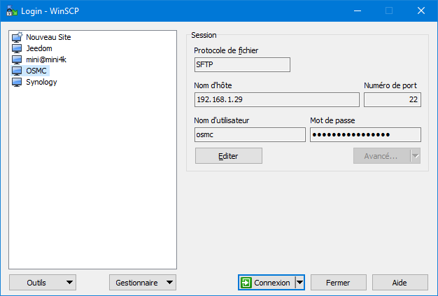
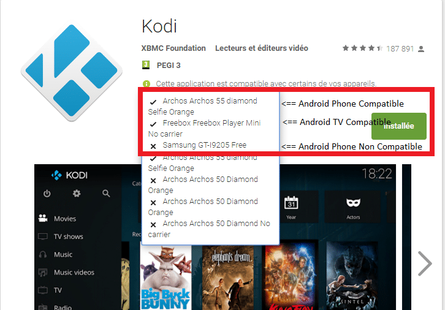

# Multiroom Audio-Vidéo – Installations clients Vidéos (Kodi)

-   **Cet article fait suite aux articles :**
    -   [Multiroom Audio-Vidéo – Le principe de fonctionnement](/articles/multiroom-audio-video-le-principe-de-fonctionnement)
    -   [Multiroom Audio-Vidéo – Installations coté serveur](/articles/multiroom-audio-video-installations-cote-serveur)

> Pour la partie client vidéos, nous allons voir comment mettre en place des clients permettant de lire les vidéos stockées sur le serveur NAS. Comme, « **qui peut le plus, peut le moins**« , nous verrons que les clients vidéo seront aussi clients audio.
>
> Les clients vidéo utilisent le lecteur multimédia Kodi. Pour ceux qui ne connaissent pas, un petit tour sur [Wiki](https://fr.wikipedia.org/wiki/Kodi_Entertainment_Center) et vous en saurez plus.
>
> L’avantage de Kodi, c’est qu’il tourne nativement sous plusieurs plateformes : Linux, Mac,Windows, Android et iOS. Dernier avantage, il est possible d’utiliser [l’UPNP](https://fr.wikipedia.org/wiki/Universal_Plug_and_Play) et donc de s’en servir comme client audio.
>
> Pour résumer, les clients Audio/Vidéo (TV, PC, Tablettes) fonctionneront avec Kodi et les clients Audio (Mobiles, Freebox) avec l’UPNP.

Nous allons voir comment installer Kodi sur RaspberryPi, Android TV / Phone et Windows.

## Liaison entre les clients et le serveur.

Peu importe la plateforme utilisée pour installer Kodi, il faut lui donner les informations nécessaires pour se connecter au NAS. Pour cela nous allons créer un fichier de configuration appelé **advancedsettings.xml** que nous copierons dans les répertoires **Userdata** des différents Kodi du réseau.

-   Ouvrir un éditeur de texte du type [Notepad++](https://notepad-plus-plus.org/download/v7.3.3.html) ou bloc note et copier le texte suivant. N’oubliez pas de modifier les informations avec les vôtres puis d’enregistrer le fichier sous **advancedsettings.xml.**

```
<advancedsettings>
<videodatabase>
<type>mysql</type>
<host>[IP du NAS]</host>
<port>3306</port>
<user>kodi</user>
<pass>[Mot de passe que vous avez crée]</pass> Ou trouver l'info.
</videodatabase>
<videolibrary>
<importwatchedstate>true</importwatchedstate>
<importresumepoint>true</importresumepoint>
</videolibrary>
</advancedsettings>
```

-   Ce fichier devra être copié dans le répertoire **userdata** de Kodi, nous verrons pour chaque plateforme comment y accéder.

## Installation de Kodi sur Raspberry

Pour l’installation de kodi sur Raspberry j’utilise la version OSMC qui est simple et efficace à installer. Il y a la gestion du wifi et bluetooth en natif.

1.  **Raspberry pi3** (recommandé) et les accessoires nécessaires.
    -   [Kit complet](http://amzn.to/2y1fGx3)
    -   [Raspberry pi3](http://amzn.to/2yGeaQ9)
    -   [Carte µSD](http://amzn.to/2gyRMxs)
    -   [Boitier](http://amzn.to/2yQi34C)
    -   [Alimentation](http://amzn.to/2yH3qkD)
    -   [Cable HDMI](http://amzn.to/2gE5N0u)
2.  **OSMC**
    -   Télécharger un installeur en fonction de votre systeme d’exploitation ([Windows](http://download.osmc.tv/installers/osmc-installer.exe), [OS X](http://download.osmc.tv/installers/osmc-installer.dmg), [Linux](http://software.opensuse.org/download.html?project=home:osmc&package=osmc-installer&hcolor=17394a&fcolor=17394a&acolor=17394a)).
    -   Une fois l’installeur téléchargé, le lancer.
    -   Choisir la langue (English), et le matériel cible : **Raspberry pi 2/ 3**.
    -   Sélectionner la version, il faut prendre la plus récente.
    -   Sélectionner le support, ici **SD Card**.
    -   Sélectionner le moyen de connexion du Raspberry, **Wifi ou Ethernet**.
    -   Sélectionner la **SD Card** pour l’installation.
    -   Valider la licence.
    -   La copie se lance sur la carte SD, une fois finie il suffit de mettre la carte SD dans le Raspberry Pi.

Voila vous avez maintenant Kodi (OSMC) d’installé sur votre RaspberryPi il ne reste plus qu’a copier le fichier **advancedsettings.xml** créé plus tôt.

### Copie du fichier **advancedsettings.xml sur** OSMC

Pour accéder au répertoire **userdata** d’OSMC sur Raspberry il faut se connecter en SSH.

Pour faire simple le SSH c’est une connexion en ligne de commande linux. Pour se connecter il faut utiliser un client SSH par exemple **Putty**. Personnellement j’utilise  « **WinSCP** » qui est un client SFTP graphique pour Windows. Il utilise SSH et est open source.

Il permet surtout d’avoir un environnement graphique pour parcourir les fichiers et Putty est inclut dans le logiciel.

1.  **Télécharger, installer, ouvrir WinSCP** : [https://winscp.net/eng/download.php](https://winscp.net/eng/download.php)
2.  **Protocole de fichier** : SFTP
3.  **Nom** **d’hôte** : Ip d’OSMC
4.  **Numéro de port** : 22
5.  **Nom d’utilisateur** : osmc
6.  **Mot de passe** : osmc
7.  **Connexion** : Cliquez sur « Connexion » ou sauver la config pour ne pas avoir à le ressaisir.



_**Pour info :** Si vous voulez accéder à Putty cliquer sur l’icone dans la barre de tache mais nous n’en aurons pas besoin pour cette fois ci._


Une fois connecté vous avez un explorateur de fichier il suffit d’aller dans **/home/osmc/.kodi/userdata** et faire glisser le fichier de la gauche (Votre PC) vers la droite (OSMC).

C’est fini pour l’installation sur Raspberry, maintenant il faut configurer kodi. Si vous n’avez pas d’autres types de clients à installer aller directement à la [configuration de Kodi](#configuration-de-kodi).

## Installation de Kodi sur Android

Il existe une version de Kodi pour les appareils Android phone et TV par contre la dernière version à ce jour, Kodi 17, nécessite au minimum Android 5 (Lollipop). Pour installer Kodi sur un appareil plus ancien vous pouvez trouver les anciennes releases de Kodi sur le [site officiel](http://mirrors.kodi.tv/releases/android/).

Pour l’installation rien de bien compliqué, il suffit d’aller sur le Store et d’installer l’application [Kodi](https://play.google.com/store/apps/details?id=org.xbmc.kodi&hl=fr).

Si votre appareil n’est pas compatible vous aurez une croix dans ce cas installer une version plus ancienne depuis le [site officiel](http://mirrors.kodi.tv/releases/android/).

### Copie du fichier **advancedsettings.xml sur Android**

Sous Android le fichier **advancedsettings.xml** doit être copié dans le répertoire **userdata** qui se trouve dans **Android/data/org.xbmc.kodi/files/.kodi/userdata/**.

Parfois, le chemin exact diffère d’un appareil à l’autre. Le dossier userdata est habituellement dans la « carte SD », de sorte que le chemin peut être **/sdcard/Android/data/org.xbmc.kodi/files/.kodi/userdata/.**

-   **Copie sur une tablette ou un téléphone** : Il faut simplement se connecter à l’ordinateur et parcourir les dossiers. Il faut afficher les fichiers cachés pour aller jusqu’au répertoire.
-   **Copie sur Android TV** : Sur une Freebox Mini4k par exemple, il faut installer un logiciel pour pouvoir explorer les fichiers comme [Es Explorateur](https://play.google.com/store/apps/details?id=com.estrongs.android.pop&hl=fr&rdid=com.estrongs.android.pop). Celui-ci permet de parcourir les dossiers du téléphone mais aussi d’accéder au dossier en FTP depuis un pc Windows ce qui est plus simple pour faire la copie du fichier.

1.  Ouvrir l’application est cliquer sur « **Affichage sur le PC**« .
2.  Cliquer sur « **Démarrer**« .
3.  Vous avez maintenant un accès FTP à votre Android TV, vous pouvez vous connecter avec WinSCP.

## Installation de Kodi sur Windows

Je ne vous ferai pas l’affront de vous expliquer comment installer Kodi sous Windows, voila tout de même le lien vers [le site officiel](https://kodi.tv/download).

### Copie du fichier **advancedsettings.xml sur Windows**

Sous Windows le fichier **advancedsettings.xml** doit être copié dans le répertoire **userdata** qui se trouve dans **%APPDATA%\\kodi\\userdata**.

1.  Cliquer droit sur « Démarrer » ou sur l’icone Windows sous Windows 10.
2.  Dans « **Exécuter** » taper « **%APPDATA%\\kodi\\userdata**« .
3.  Copier le fichier.

## Configuration de Kodi

Pour que les clients Kodi aient tous les mêmes réglages j’utilise aussi le fichier **advancedsettings.xml.** Il suffit de coller les codes suivants à la fin du fichier, avant la balise **</advancedsettings>**.

### Informations local.

```
<locale>
 <audiolanguage default="true">original</audiolanguage>
 <charset default="true">DEFAULT</charset>
 <country>France</country>
 <keyboardlayouts>French AZERTY</keyboardlayouts>
 <language>resource.language.fr_fr</language>
 <longdateformat default="true">regional</longdateformat>
 <shortdateformat default="true">regional</shortdateformat>
 <speedunit default="true">regional</speedunit>
 <subtitlelanguage default="true">original</subtitlelanguage>
 <temperatureunit default="true">regional</temperatureunit>
 <timeformat default="true">regional</timeformat>
 <timezone default="true">default</timezone>
 <timezonecountry default="true">default</timezonecountry>
 <use24hourclock default="true">regional</use24hourclock>
 </locale>
```

### Informations réseau.

_C’est là que vous pouvez activer le **Airplay** et **l’UPNP** pour le Streaming audio._

`<services>   <devicename>Bureau</devicename> <=== Nom du client Kodi   <airplay>true</airplay> <=== Options Airplay   <airplaypassword default="true"></airplaypassword>   <airplayvideosupport>false</airplayvideosupport>   <airplayvolumecontrol default="true">true</airplayvolumecontrol>   <useairplaypassword default="true">false</useairplaypassword>`
`   <upnpannounce default="true">true</upnpannounce> <=== Options UPNP   <upnpcontroller>true</upnpcontroller>   <upnplookforexternalsubtitles>true</upnplookforexternalsubtitles>   <upnprenderer>true</upnprenderer>   <upnpserver>true</upnpserver>`
`   <webserver>true</webserver> <=== Options Web   <webserverpassword default="true"></webserverpassword>   <webserverport default="true">8080</webserverport>   <webserverusername default="true">Bureau</webserverusername> <=== Nom du client Kodi   <zeroconf>true</zeroconf>   </services>`
`   <network>   <httpproxyport default="true">8080</httpproxyport>   </network>`

Pour plus de détails sur les options du fichier **advancedsettings.xml** je vous invite à aller sur le site [officiel de Kodi](http://kodi.wiki/view/advancedsettings.xml).

### Création de la base de données

Ajouter les [répertoires NFS](/articles/multiroom-audio-video-installations-cote-serveur) sur un des clients Kodi pour que tous les autres soient reliés à la base de données.

1.  Aller dans **Paramètres**, **Gestionnaire de fichier** et double clique sur **Ajouter une source**.
2.  Choisir **Protocole Réseau de Fichier (NFS)**.
3.  Parcourir jusqu’au répertoire contenant les Vidéos à ajouter à la base de données.
4.  Choisir le fournisseur d’informations, exemple : **The Movie Database**.
5.  Paramétrer les options pour que Kodi récupère automatiquement les informations des fichiers. Titres, genres, acteurs, pochettes…
6.  **Valider** et répéter le processus autant de fois que nécessaires (Films, Séries, Dessins animés…)

## Conclusion

Voilà, la configuration des clients vidéos est finie, il ne vous reste plus qu’a paramétrer Kodi à votre convenance. Maintenant nous allons nous occuper des clients audio qui nous permettront de jouer la musique dans toute la maison.

Nous avons vu dans cet article que les clients vidéos permettaient aussi de faire office de client audio grâce à l’UPNP et le Airplay. Dans le prochain article, nous verrons comment installer des clients audio en recyclant un vieux téléphone Android en Squeezebox.

-   [Multiroom Audio-Vidéo – Le principe de fonctionnement](/articles/multiroom-audio-video-le-principe-de-fonctionnement)
-   [Multiroom Audio-Vidéo – Installations coté serveur](/articles/multiroom-audio-video-installations-cote-serveur)
-   [Multiroom Audio-Vidéo – Installations clients Audio](#) (A venir)
