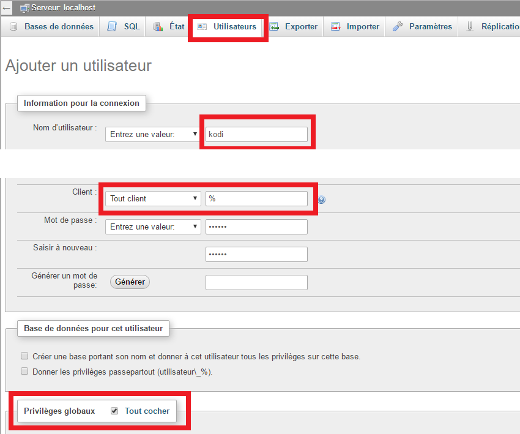

# Multiroom Audio-Vidéo – Installations coté serveur

- Cet article fait suite à l’article [Multiroom Audio-Vidéo – Le principe de fonctionnement](/articles/multiroom-audio-video-le-principe-de-fonctionnement).

> Pour la partie serveur, l’idéal est d’utiliser un Nas Synology. Mais si comme moi vous n’en avez pas, il est possible de recycler un PC obsolète pour en faire un dérivé du Synology appelé Xpenology. Certaines fonctions ne sont pas présentes sur le Xpenology, mais rien d’indispensable dans notre cas. Vous pourrez installer la base de données, le LMS, stocker vos médias, les partager sur le réseau, etc…
>
> \[alert-warning\]Avant de commencer à installer Xpenology, sachez que c’est illégal, car DSM est réservé aux NAS Synology. Les XPEnology doivent être des machines de test, ou de démonstration. Pour une utilisation à long terme, il est préférable d’acheter un NAS Synology.\[/alert-warning\]

## Transformer un PC en NAS Xpenology.

_Si vous avez déjà un NAS Xpenology ou Synology vous pouvez passer au chapitre suivant._

L’installation d’Xpenology peut paraître compliquée pour quelqu’un qui n’a pas l’habitude d’installer des logiciels de type linux, mais avec un peu de patience et de concentration, tout devrait bien se passer.

Le PC doit avoir au minimum un disque dur interne pour pouvoir installer le système d’exploitation appelé DSM. Il est préférable d’avoir des disques durs internes, mais vous pourrez utiliser des disques durs externes. Néanmoins, il y a une restriction sur la taille des fichiers (4Go) due au type de système de fichier vFat. Il faudra aussi qu’il y ait des ports USB pour connecter la clé USB de Boot.

Pour l’installation seulement, vous aurez besoin d’un écran et d’un clavier.

### Installation de la clé USB de Boot.

Vous aurez besoin d’une clé USB qui ne sera pas récupérable, car elle restera branchée au NAS, même après l’installation. Elle servira de Boot grâce au logiciel XPEnoboot. Vous pouvez recycler une vieille clé USB de 64 Mo par exemple.

- Formater la **clé en FAT32**.
- Télécharger l’image du **logiciel [XPEnoboot](http://download.xpenology.me/xpenoboot/5.2-5644.5/XPEnoboot_DS3615xs_5.2-5644.5.img)**.
- Installer l’image sur la clé, avec [Win32DiskImager](https://sourceforge.net/projects/win32diskimager/) . [Même technique que pour installer Jeedom sur une carte SD.](/articles/installation-de-jeedom-netinstall-sur-raspberry-3#Pour_copier_limage_sur_la_carte_SD_telechargez_win32diskimager)
- **Brancher** la clé sur un port usb du PC et **démarrer**.
- Aller dans le **BIOS du PC** pour lui demander qu’il boot sur la clé à chaque démarrage. [Technique différente en fonction des marques.](http://www.commentcamarche.net/faq/389-bios-acceder-au-setup-du-bios#quelle-est-la-touche-qui-donne-acces-au-setup)
- Redémarrer et choisir « **Xpenology DSM 5.2-5644 Install/Upgrade**« .
- Attendre que « **LOGIN** » s’affiche à l’écran.
- **Ne plus rien toucher** et aller sur votre PC principal.

### Installation du système d’exploitation DSM.

Maintenant que votre PC boot sur la clé USB, vous avez l’équivalent d’un Synology. Il ne reste plus qu’à installer le système d’exploitation DSM.

Le DSM disponible pour les Synology est en version 6, mais pour les XPenology, la dernière version est la 5. Ceci ne posera pas de problème dans notre cas.

- Télécharger « [DSM_5.2-5644](http://download.synology.com/download/DSM/release/5.2/5644/DSM_DS3615xs_5644.pat)« .
- Télécharger les mises à jour : [Update 1](http://download.synology.com/download/DSM/criticalupdate/update_pack/5644-1/synology_bromolow_3615xs.pat), [2](http://download.synology.com/download/DSM/criticalupdate/update_pack/5644-2/synology_bromolow_3615xs.pat), [3](http://download.synology.com/download/DSM/criticalupdate/update_pack/5644-3/synology_bromolow_3615xs.pat), et [5.](http://download.synology.com/download/DSM/criticalupdate/update_pack/5644-5/synology_bromolow_3615xs.pat)
- Aller à [http://\[IP DE VOTRE NAS\]:5000](<http://[IP DE VOTRE NAS]:5000>).
- Cliquer sur « **Configurer**« 
- Cliquer sur « **Installation manuelle**« 
- Sélectionner le fichier DSM_5.2-5644 précédemment téléchargé.
- Suivre les indications d’installation.
- A la fin, ne pas choisir l’installation automatique des mises à jour.
- Une fois sur le bureau du NAS, aller dans « **Panneau de configuration** ».
- Aller dans « **Mise à jour et restauration**« .
- Cliquer sur « **Mise à jour manuelle de DSM**« .
- Sélectionner le 1er fichier de mise à jour, puis l’installer.
- Faire la même chose pour les autres.

L’installation et l’utilisation de DSM étant identique sur Xpenology et sur Synology, vous trouverez de l’aide sur le net en cas de problème, ou pour copier vos fichiers sur les disques durs.

## Médiathèque Audio.

### Installation du Logitech Media Server.

Maintenant que notre NAS est opérationnel, nous allons installer LMS qui servira à gérer la musique.

- Ouvrir « **Centre de paquets** ».
- Cliquer sur « **Paramètres** ».
- Dans l’onglet « **Bêta** » cocher « **Oui, je veux voir les versions bêta !** ». OK
- Faire une recherche de « **Logitech** ».
- Installer « **Logitech Media Server** ».
  - La dernière version à ce jour est la **7.9.0-062**. C’est important pour jumeler LMS et Jeedom.
- Une fois installé, aller à [**http://\[IP DE VOTRE NAS\]:9002**](<http://[IP DE VOTRE NAS]:9002>)/

### Installation des plugins UPNP et Airplay.

N’ayant pas de SqueezBox pour diffuser la musique sur les différents appareils multimédia déjà présents à la maison, j’ai cherché une solution pratique, économique et très répandue pour le faire. Grace à l’aide de 2 plugins, n’importe quel appareil UPNP et Airplay, sera reconnu comme une Squeezebox.

Rien ne vous empêche d’acheter une Squeezebox, mais c’est de plus en plus dur à trouver et les prix grimpent rapidement.

Pour installer les 2 plugins il faut :

- Aller dans les **paramètres de LMS**.
- Dans l’onglet « **Plugins**».
- Aller tout en bas et cocher « **Afficher tous les plugins tiers**» et appliquer.
- Rechercher et cocher « **UPnP/DLNA bridge (v0.2.11.0)** ». Il permet de voir les appareils UPNP dans LMS.
- Rechercher et cocher « **AirPlay bridge (v0.2.2.2)** ». Il permet de voir les appareils AirPlay dans LMS.
- Appliquer et attendre la fin de l’installation.
- Une fois installé, cliquer sur l’option « **Paramètres** » des plugins pour les configurer.

La détection des périphériques UPNP et AIRPLAY se fait toute seule, mais pensez bien à allumer vos appareils pour qu’ils soient détectables.

- Aller dans l’onglet « **Platines** » pour voir apparaître les appareils.

## Médiathèque vidéo.

Il va falloir installer une base de données sur le NAS, afin de stocker les informations de la médiathèque. Titre des films et séries, saisons, genres, synopsis, acteurs, réalisateurs, chemin vers les fichiers etc… Ces informations seront disponibles et mises à jour par tous les Kodi du réseau.  Par exemple si l’on commence à regarder un film dans le salon, on peut le continuer dans la chambre, ou si l’on regarde un épisode d’une série sur une tablette, il sera noté comme vu pour tous les autres Kodi.

### Installation de la base de données

- Ouvrir « **Centre de paquets** ».
- Rechercher et installer « **MariaDB** » et « **phpMyAdmin** ».

Une fois les paquets installés, il faut se connecter à phpMyAdmin en tapant [http://\[IP DE VOTRE NAS\]/phpMyAdmin/](<http://[IP DE VOTRE NAS]/phpMyAdmin/>)

Pour se connecter :

- Utilisateur : **root**
- Mot de passe : **laisser vide**

Pour créer l’utilisateur Kodi :

- Aller dans l’onglet « **Utilisateurs** ».
- Cliquer sur « **Ajouter un utilisateur** ».
- Nom d’utilisateur : **kodi**
- Client : **Tout client** et **%**
- Mot de passe : **de votre choix**
- Privilèges globaux : **Tout cocher**

### Partage de fichier NFS

Le NAS est maintenant prêt à recevoir la base de données que Kodi va créer automatiquement, lorsque nous lui indiquerons le chemin vers les fichiers vidéo. Mais il faut d’abord que ces répertoires soient partagés entre les différents appareils du réseau.

- Activer le partage de fichier :
  - Aller dans « **Panneau de configuration** ».
  - Puis dans « **Services de fichiers** ».
  - Dans « **Service NFS** ».
  - Cocher « **Activer NFS** ».
  - Appliquer

- Partage des répertoires :
  - Aller dans « **Panneau de configuration** ».
  - Puis dans « **Dossiers partagés** ».
  - Si besoin créer les répertoires.
  - Cliquer sur « **Modifier** ».
  - Aller dans l’onglet « **Autorisation NFS** ».
  - Cliquer sur « **Créer** ».
  - Nom d’hôte ou IP : « **192.168.1.\*** ». J’autorise toutes les IP qui commencent par « 192.168.1 » l’étoile veut dire n’importe quel chiffre.
  - Privilèges : **Lecture/Ecriture**.
  - Squash : **Mappage de tous les utilisateurs sur admin**.
  - Cocher : **Activer le mode asynchrone**.
  - Cocher : **Permettre les connexions à partir des ports non privilégiés**.
  - Cocher : **Permettre à des utilisateurs d’accéder aux sous-dossiers montés**.

Répéter la même manipulation pour tous les répertoires. (Films, Séries, Dessins animé…) Si vous créez un répertoire « Vidéos » par besoin de faire cette manipulation pour les sous dossiers.

## Conclusion.

Voilà, l’installation d’un système MultiRoom commence à prendre forme, la partie serveur est configurée. Maintenant nous allons nous occuper des clients qui nous permettront de lire les vidéos et la musique dans toute la maison.

Dans le prochain article, nous verrons comment lire les vidéos en installant Kodi sur un Raspberry, une Android TV (Freebox Mini4k), un Pc sous Windows, ainsi qu’un téléphone ou une tablette Android. Nous verrons aussi comment configurer ces clients pour lire la musique et comment recycler un vieux téléphone en Squeezebox.

- [Multiroom Audio-Vidéo – Le principe de fonctionnement](/articles/multiroom-audio-video-le-principe-de-fonctionnement)
- [Multiroom Audio-Vidéo – Installations coté serveur](/articles/multiroom-audio-video-installations-cote-serveur)
- [Multiroom Audio-Vidéo – Installations clients Vidéos (Kodi)](/articles/multiroom-audio-video-installations-clients-videos-kodi)
