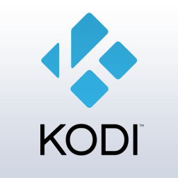

# Multiroom Audio-Vidéo – Le principe de fonctionnement

> Je vais vous présenter sous la forme de plusieurs articles, un système Multiroom Audio-Vidéo.
>
> - [Multiroom Audio-Vidéo – Le principe de fonctionnement](/articles/multiroom-audio-video-le-principe-de-fonctionnement)
> - [Multiroom Audio-Vidéo – Installations coté serveur](/articles/multiroom-audio-video-installations-cote-serveur)
> - [Multiroom Audio-Vidéo – Installations clients Vidéos (Kodi)](/articles/multiroom-audio-video-installations-clients-videos-kodi)
>
> La musique et les vidéos sont stockés sur un serveur NAS et la diffusion se fait sur les différents appareils multimédias de la maison, via des logiciels gratuits et open source.
>
> Pour la musique, j’utilise Logitech Media Server (LMS) et pour la vidéo, Kodi. L’ensemble connecté à un NAS Xpenology qui me permet de stocker et gérer la médiathèque.
>
> Afin de limiter les coûts au maximum, j’ai réutilisé des composants et matériels que j’avais déjà en ma possession. Un vieux PC pour le NAS (Serveur), un RaspberryPi, mes Freebox Server/Player/Mini4k, un téléphone, une tablette Android et mon ampli pour la diffusion de la musique et des vidéos (clients).

## Diffusion des films et séries.

Les vidéos sont diffusées via Kodi. C’est un lecteur multimédia, lié à une base de données SQL, stockée sur le serveur, ce qui permet de gérer l’état des vidéos (films et séries) titres, genre, saison, nombres de vues, positions, pochettes, etc…

Il est possible de lire des vidéos téléchargées, ou en streaming (Vstream).

Kodi est accessible depuis plusieurs pièces de la maison :

- Dans le salon, la TV est connectée à un RaspberryPi3, contrôlé en HDMI-CEC avec la télécommande de la TV.
- Dans la chambre des parents, j’ai une Freebox Mini4k qui tourne sous Android.
- Dans le bureau, j’ai un PC fixe et des PC portables sous Windows.
- Pour le reste de la maison, j’utilise une tablette Android.
- On pourrait diffuser sur les mobiles Android, mais vu la taille des écrans je n’en vois pas l’intérêt, du moins à la maison.

Il est aussi possible de lire les vidéos depuis l’extérieur de la maison, si la connexion internet le permet.

## Diffusion de la musique.

La musique est diffusée via Logitech Media Server (LMS) sur (presque) tous les appareils multimédias connectés au réseau local. TV (Boxes), PC, Tablettes, Téléphones…

LMS est un système de diffusion de musique sans fils, distribué par Logitech, mais ce dernier a décidé de l’abandonner. Heureusement ils ont eu la bonne idée de diffuser le code en open source pour pouvoir le réutiliser.

Vocabulaire :

- **LMS**: Serveur de musique. Stockage, gestion.
- **SqueezBox**: Les appareils diffusant la musique. Ampli, TV, Portable…
- **SqueezPlayer**: Télécommandes permettant de contrôler la musique. Portable, PC, Tablette, Jeedom …

Il est toujours possible de trouver sur [Amazon](http://amzn.to/2mmVaz9) des Squeezebox, mais à des prix plutôt élevés.

## Gestion de la médiathèque Audio-Vidéo.

Vous avez certainement entendu parler des NAS Synology. Non ? Alors en gros, ce sont des ordinateurs sans écran qui permettent de créer un « cloud » à la maison. Vous pouvez stocker et sauvegarder vos données et y accéder depuis n’importe quel ordinateur ou téléphone, de chez vous ou depuis internet dans le monde entier.

Il est par exemple possible d’héberger un site internet, faire des copies de sauvegarde automatique, gérer des caméras de surveillance, installer Jeedom et dans notre cas, stocker nos fichiers audio et vidéos, puis installer LMS ainsi qu’une base de données SQL.

Le problème, c’est qu’un Syno, ça coûte dans les 150 €, plus les disques durs.

On a, pour la plupart, tous un vieux PC qui traîne et on ne sait pas quoi en faire. Et bien vous allez pouvoir le transformer en NAS Synology, enfin presque, en NAS Xpenology qui est une version détournée que l’on peut installer sur la plupart des PC fixes ou portables.

## Intégration du Multi Room Audo/Vidéo dans Jeedom.

Grace aux plugins Jeedom, il est possible de contrôler Kodi et LMS.

**Kodi**: Plugin pour envoyer et recevoir des commandes à/depuis Kodi. [(4€) créé par sarakha63](https://www.jeedom.com/market/index.php?v=d&p=market&type=plugin&name=kodi&).

- Vous avez accès au cover, heure de fin, type de média, titre, statut.
- Le tout, agrémenté d’effets visuels lors de la diffusion de musique et également accompagné par des commandes.
- Ainsi, vous pouvez contrôler Kodi depuis votre Jeedom, ou encore mieux, laisser Jeedom vous allumer la lumière lorsque vous mettez pause.
- Ou aussi, mettre vos diodes RGBs, ou Philips hue en rouge, pour un film d’horreur.
- Bref, la seule limite est votre imagination.

**Squeeze Box Control**: Plugin pour contrôler LMS. [(4€) créé par sarakha63](https://www.jeedom.com/market/index.php?v=d&p=market&type=plugin&&name=squeezebox).

- Il fait de l’auto découverte, il attribue vos squeeze box aux bons objets, si elles contiennent le nom de l’objet.
- Il permet aussi une gestion complète multidirectionnelle de la synchro. La possibilité de synchroniser toutes les squeezebox en un clic, toutes les allumer, toutes les éteindre etc….
- Une fonction TTS est aussi disponible.
- Un panel dédié simple, est aussi disponible.
- De nombreuses autres fonctions sont également possibles.

## Conclusion.

Voilà, vous savez maintenant comment va fonctionner le système MultiRoom. Dans le [prochain article](/articles/multiroom-audio-video-installations-cote-serveur) nous verrons comment configurer la partie serveur, puis dans un second les clients qui nous permettrons de lire les vidéos et la musique dans toute la maison.

Pour ceux qui connaissent un peu Kodi, je n’utilise pas la partie musique que je ne trouve pas très fonctionnelle et moins ouverte que LMS qui permet d’écouter de la musique sur Kodi mais aussi sur n’importe quel autre média compatible UPNP/Airplay et les options sont plus nombreuses : la synchronisation, TTS…

- [Multiroom Audio-Vidéo – Le principe de fonctionnement](/articles/multiroom-audio-video-le-principe-de-fonctionnement)
- [Multiroom Audio-Vidéo – Installations coté serveur](/articles/multiroom-audio-video-installations-cote-serveur)
- [Multiroom Audio-Vidéo – Installations clients Vidéos (Kodi)](/articles/multiroom-audio-video-installations-clients-videos-kodi)
