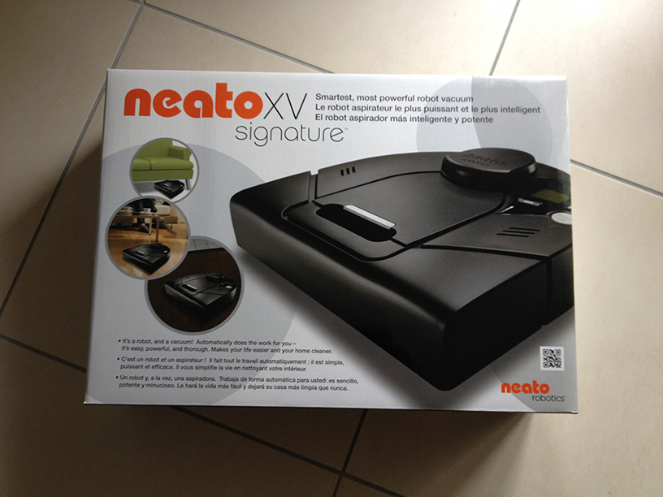
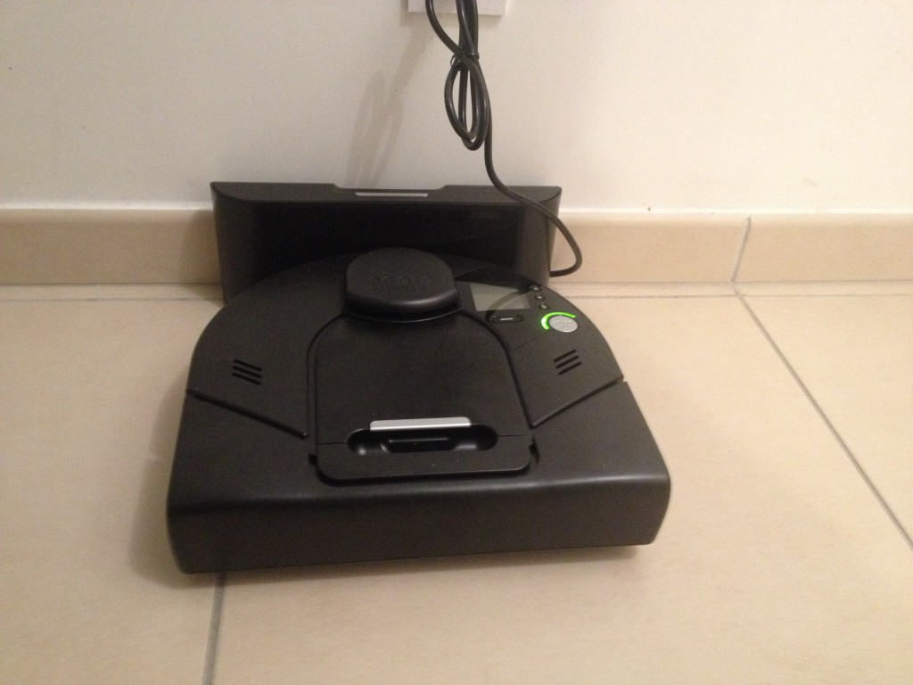

# Neato Robotics XV Signature

> Cela fait quelques temps que je fais des recherches sur les aspirateurs robots et j’ai enfin jeté mon dévolu sur le [Neato Robotics XV signature](http://www.amazon.fr/gp/product/B00FN7Q79I/ref=as_li_tl?ie=UTF8&camp=1642&creative=19458&creativeASIN=B00FN7Q79I&linkCode=as2&tag=guilbraimespa-21&linkId=RHK2VDHJQBYMKZA5), voilà comment j’ai fait mon choix et mon retour après quelques jours d’utilisation.

- ### Les besoins.

Le ménage à la maison ce n’est pas une mince affaire, surtout avec un petit de 2 ans et demi. Il faut passer l’aspirateur tous les jours autour de la table à manger car la technique de la cuillère n’est pas encore au point, il faut aspirer les tapis et la chambre régulièrement pour les problèmes d’allergies et à 2 ans et demi on est souvent très près du sol pour jouer.

Nous avions le choix de passer nos dimanches à faire le grand ménage au lieu de profiter du beau temps et repasser l’aspirateur ou un coup de balai chaque jour sur les points sensibles (cuisine, chambre enfants…).

Nous avons aussi fait appel à un services de femme de ménage, 2 heures par semaine pour un appartement d’environ 85 m² mais après les changements réguliers de femmes de ménage, le nettoyage approximatif, le coût mensuel et autres réjouissances nous avons laissé tomber cette solution.

C’est là que nous nous sommes penchés sur les aspirateurs robots.

- ### Le choix.

Apres des heures de lectures sur des sites comme, [http://www.lesnumeriques.com/](http://www.lesnumeriques.com/aspirateur-robot/comparatif-choisir-meilleur-aspirateur-robot-a1555.html), [http://www.bestofrobots.fr](http://www.bestofrobots.fr/robot-domestique/aspirateurs-robots.html), [http://choisirsonaspirateur.free.fr/](http://choisirsonaspirateur.free.fr/aspirateur-robot), etc… notre choix c’est arrêté sur les aspirateurs robots de la marque [Neato Robotics](http://neatorobotics.com/fr/).

D’après tous les tests lu ce sont vraiment les aspirateurs robot les plus performants, bien que relativement bruyants.

Notre appartement n’a pas d’étage, il est composé au sol de carrelage et de parquet, nous avons bien un ou deux tapis mais à poils courts que nous pouvons facilement enlever si besoin.

Nous avons toujours notre aspirateur traîneau que nous aurions dû changer mais du coup il fera bien l’affaire pour repasser derrière le Neato si celui-ci à quelques loupés.

Je pense qu’il n’y a pas d’aspirateur qui convienne à tout le monde. Chacun doit adapter son choix en fonction de ses besoins, tant que l’aspirateur est performant. Par exemple, pour nous, le fait que l’aspirateur soit bruyant n’est pas vraiment un problème car nous le programmerons pour qu’il fonctionne lorsque nous sommes au travail ; et quel bonheur de rentrer chez soi et de voir que les sols sont propres.

Chez Neato il y a plusieurs modèles, il est vrai que le coté bicolore des anciens modèles ne nous plaisait pas trop mais lorsqu’ils ont sorti des modèles plus sobres de couleur noire nous avons été ravis. La dernière génération est à nouveau bicolore et encore plus performante mais là c’est la bourse qui nous a limité. Nous avons donc choisi de rester sur les modèles Neato XV.

Nous hésitions entre le modèle **[Neato Robotics XV signature](http://www.amazon.fr/gp/product/B00FN7Q79I/ref=as_li_tl?ie=UTF8&camp=1642&creative=19458&creativeASIN=B00FN7Q79I&linkCode=as2&tag=guilbraimespa-21&linkId=RHK2VDHJQBYMKZA5)** et le **[Neato Robotics XV Signature PRO](http://www.amazon.fr/gp/product/B00FN7Q7O8/ref=as_li_tl?ie=UTF8&camp=1642&creative=19458&creativeASIN=B00FN7Q7O8&linkCode=as2&tag=guilbraimespa-21&linkId=RQ42RVR3VDSAVPAK)**. La différence réside essentiellement dans les accessoires fournis et le prix, 350 € contre 417 €.

Le modèle PRO est fourni avec 2 filtres anti-allergènes contre un filtre normal et une brosse à poil supplémentaire contre une simple brosse en caoutchouc pour l’autre.

Vu que les filtres doivent être changés je pense que je prendrai, sous réserve qu’ils soient compatibles mais je le pense, les filtres anti-allergènes du modèle PRO et pareil lorsque le changement de la brosse sera nécessaire. Brosse qui est vraiment utile pour les poils d’animaux et les tapis à poils long, je n’ai ni l’un ni l’autre.

Voilà pourquoi mon choix c’est arrêté sur le modèle [Neato Robotics XV signature](http://www.amazon.fr/gp/product/B00FN7Q79I/ref=as_li_tl?ie=UTF8&camp=1642&creative=19458&creativeASIN=B00FN7Q79I&linkCode=as2&tag=guilbraimespa-21&linkId=RHK2VDHJQBYMKZA5).

- ### L’achat.

Je dois vous dire tout de suite je suis plutôt fan [d’Amazon](http://www.amazon.fr/?tag=guilbraimespa-21), je fais presque tous mes achats en ligne chez eux. Je n’ai jamais été déçu par leurs services, je n’ai jamais eu de mauvaise surprise, les délais de livraisons sont en général très courts et les prix souvent les plus bas, frais de ports compris !

J’ai passé ma commande le mardi et le colis est arrivé à Lyon le vendredi. Il se trouve que je n’ai pas pu aller le chercher du coup j’ai attendu jusqu’au mardi que le point Kiala ouvre, un peu frustré.

- ### L’installation.

Comme toujours avec [Amazon](http://www.amazon.fr/?tag=guilbraimespa-21) l’emballage était nickel. J’ai ouvert le carton dans lequel été l’aspirateur avec la base de rechargement, les quicks Start et les modes d’emplois.

Là il faut trouver l’emplacement pour la base de recharge avec, dans l’idéal, 1 mètre de libre à gauche, à droite et en face pour que l’aspirateur retourne facilement à sa place. Il faut aussi une prise de courant.

Une fois l’emplacement trouvé il faut le recharcher 12 heures, encore un peu frustré.

J’en profite pour programmer les heures de nettoyage automatique. Un jeu d’enfant grâce à l’écran LCD.

Je vais aussi sur le site de [Neato Robotics](http://neatorobotics.com/fr/) pour enregistrer mon aspirateur afin de profiter de la garantie constructeur mais surtout d’accéder aux mises à jour du logiciel. Il se trouve qu’il était à jour.

- ### Le premier test.

L’aspirateur est programmé pour commencer son ménage juste un peu avant que je parte au boulot, histoire de le voir un peu en action.

Pendant que j’étais dans la salle de bain en train de me laver les dents j’entends un avion qui passe dans le salon, à non c’est le Neato qui démarre ! Effectivement il est bruyant, je n’ai jamais eu d’appareil de ce genre donc je ne peux pas comparer. C’est plus fort qu’un aspirateur traîneau.

Tranquillement le p’tit pépère fait le tour de l’appartement comme un chiot qui découvre une nouvelle maison, il prend ses marques.

Je l’observe un petit moment, il se débrouille bien. Pour la première fois je vais l’aider un peu en levant tout ce qui traîne dans la maison, pèse personne et tapis dans la salle de bain, bac à linge sale et boites en carton dans notre chambre, les jouets du petit etc…

Je veux voir si il passe vraiment partout. Je vais même chercher des moutons de poussière derrière les armoires pour en déposer un peu partout dans l’appartement pour voir si il ne loupe pas un angle ou des coins moins accessibles.

Je pars en suite au boulot le laissant faire son travail tranquillement.

Retour à la maison à 12 :45, pas de bruit dans la maison, l’entrée est propre. J’arrive dans le salon horreur je ne vois pas Neato sur sa base de chargement !!! Il est parti ! Et non cet âne été bloqué dans les franges du tapis du salon que j’avais laissé, il y a la table basse dessus je ne vais pas non plus déménager l’appart. Je lui demande une explication en appuyant sur le bouton et là il me dit « Ma brosse est bloquée merci de me la débloquer ». J’appuie sur Start et voilà que monsieur repart sur le tapis sans aucun problème. Il repassera plusieurs fois par le tapis par la suite sans ennui. Au bout de quelques minutes il retourne à sa base pour se recharger.

Je repars donc au travail et à mon retour même topo, pas un bruit dans l’appartement et surtout pas de Neato sur sa base de recharge ! Je vais voir sur le tapis, personne, dans ma chambre, personne, dans la salle de bain, personne et après quelques minutes de recherche je trouve mon p’tit bonhomme bloqué sous une armoire dans la chambre du petit. J’essaye de l’attraper mais impossible il est bloqué. Je le sort tant bien que mal et là il me dit « libérer mon chemin », à oui ?! Je le pose devant l’armoire et il reprend son nettoyage. Même chose que pour le tapis ce matin, il est repassé sous l’armoire sans se bloquer, étrange.

[Voir la video sur YouTube](https://www.youtube.com/embed/FJ0ezdQ5Ny8?feature=oembed)

- ### Conclusion.

Alors après quelques jours d’utilisation voilà ce que je pense du Neato, j’adore !
Il est conseillé de le charger à fond puis de le décharger à fond 3 fois de suite pour optimiser la batterie, c’est ce que j’ai fait il a donc tourné tous les jours depuis que je l’ai reçu. A part les 2 blocages du 1er jour il ne s’est plus jamais bloqué dans la maison, a t il appris ou est-ce juste un hasard ? Je ne sais pas, quoi qu’il en soit je suis vraiment content de son boulot. Chose étonnante c’est qu’il trouve de la poussière même quand on croit que c’est propre. Apres son passage nous avons lavé le sol, l’appart était nickel, et bien le lendemain il était programmé pour tourner et il y avait encore de la poussière dans le bac de l’aspirateur.

Il est vrai qu’il passe de partout, sous les armoires, sous les lits, sous le bureau, rien ne lui résiste, en fin si, il a du mal avec les angles et le long de certains murs. La petite brosse latérale qu’ils ont ajoutée sur le nouveau modèle le [Neato BotVac](http://www.amazon.fr/gp/product/B00IZD9Z46/ref=as_li_tl?ie=UTF8&camp=1642&creative=19458&creativeASIN=B00IZD9Z46&linkCode=as2&tag=guilbraimespa-21&linkId=ILJ46UGM5OCUZGRT) doit combler cette petite lacune.

Si le budget n’est pas un frein pour vous, passer directement au model [Neato BotVac](http://www.amazon.fr/gp/product/B00IZD9Z46/ref=as_li_tl?ie=UTF8&camp=1642&creative=19458&creativeASIN=B00IZD9Z46&linkCode=as2&tag=guilbraimespa-21&linkId=ILJ46UGM5OCUZGRT) qui est la nouvelle version.

Si non le [Neato Robotics XV signature](http://www.amazon.fr/gp/product/B00FN7Q79I/ref=as_li_tl?ie=UTF8&camp=1642&creative=19458&creativeASIN=B00FN7Q79I&linkCode=as2&tag=guilbraimespa-21&linkId=RHK2VDHJQBYMKZA5) vous conviendra parfaitement j’en suis sûr.

Il est vrai que je n’ai jamais eu d’aspirateur robot mais je trouve que c’est un appareil génial et qui remplit totalement les taches que je lui demande de faire c’est-à-dire garder un sol propre dans toute la maison sans intervention de ma part. Un petit coup rapide d’aspirateur traîneau ou ramasse poussière reste nécessaire lors du ménage hebdomadaire, mais la corvée d’aspirateur est belle et bien fini.

Bientôt j’achète un [iRobot Scooba](http://www.amazon.fr/gp/product/B007OSV9Q0/ref=as_li_tl?ie=UTF8&camp=1642&creative=19458&creativeASIN=B007OSV9Q0&linkCode=as2&tag=guilbraimespa-21&linkId=L46NQ5Y7JT5DS5GS) pour passer la serpillière et un [WINBOT laveur de vitre](http://www.amazon.fr/gp/product/B00OJ768SS/ref=as_li_tl?ie=UTF8&camp=1642&creative=19458&creativeASIN=B00OJ768SS&linkCode=as2&tag=guilbraimespa-21&linkId=CFG6CC44FS6ALXI3) !

**Et vous robot ou pas robot ? Neato ou un autre ? Faites nous parts de votre expérience avec les robots aspirateur.**
