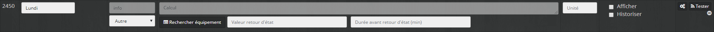
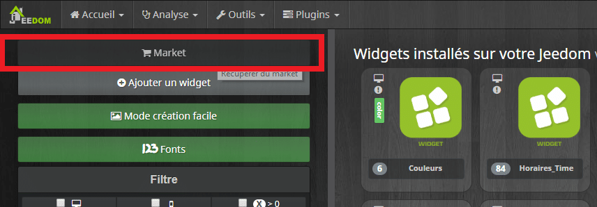
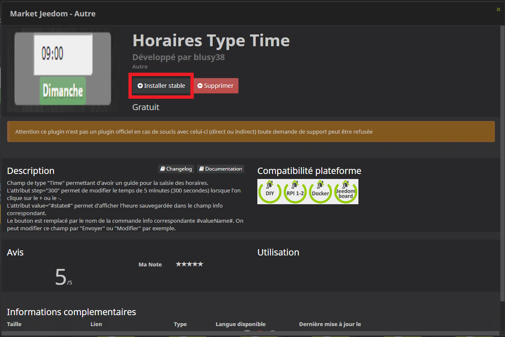
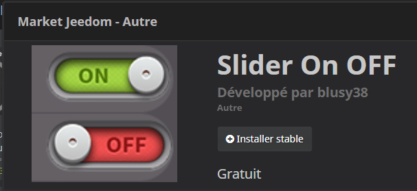

# Planification d’événements dans Jeedom [virtuel et widget]

> Vous étiez plusieurs à me demander un tutoriel de **planification d’événements**, avec réglage de **l’heure** et du **jour** dans Jeedom et avec **virtuel**, **widget** et **scénario.** Voilà qui est fait !
> Ce tutoriel est en **2 parties**.
>
> - **La première vous détaille la marche à suivre pour créer les virtuels de saisie des horaires, avec les widgets permettant de mettre tout ça en forme.**
> - [La seconde vous détaille la mise en place des scénarios de planification d’événements quotidiens.](/articles/planification-devenements-dans-jeedom-scenarios)
>
> Cet article vous permettra de facilement faire de la planification d’événements journaliers comme :
>
> - **Activer le « Mode journée »** du lundi au vendredi à 7:30 et les weekends à 8:30.
> - Recevoir un **rappel pour allez chercher vos enfants à l’école** les lundis à 16:30, les mardis à 17:45. Vous pourrez même choisir d’être prévenu une première fois 15 minutes avant, puis 5 minutes avant l’heure choisie.
> - Vous voulez programmer un **réveil tous les matins** de la semaine avec un allumage progressif 15 minutes avant l’heure sélectionnée, et bien vous pourrez aussi le faire.
>
> Pour ce tutoriel, nous aurons besoin de :
>
> - **Un virtuel par événement.** Nous pourrons facilement **dupliquer** le premier virtuel créé pour tous les autres événements.
> - **Un scénario par jour**, là aussi, on fait un premier scénario qu’on **duplique** pour les autres jours de la semaine, grâce à la fonction « **Template**« .
> - **Trois Widgets**, que nous récupérons sur le **Market**.
>
> Je vous ai dit que ce serait un **article complet**, mais ne vous inquiétez pas, la réalisation des **virtuels**, du **widget** et des **scénarios** sont à la portée de **tous**, si vous suivez bien le **tutoriel pas à pas**.

## Création d’un Virtuel dans Jeedom

Pour commencer, dans cette **première partie**, nous allons **créer un virtuel** correspondant à un **événement**.

Pour le tutoriel, nous allons créer un événement « **Réveil**« . Le but étant de pouvoir régler une heure **différente** **chaque jour** de la semaine, avec la possibilité, si besoin, de **définir** un **délai** avant l’exécution appelé « **minuteur**« .

Le **minuteur** permettra, par exemple pour notre réveil, de **définir** le temps **avant** l’allumage complet des lumières et le démarrage de la musique.

Enfin, le **virtuel** aura un **bouton** permettant de **désactiver** l’événement pour toute la semaine, **sans** être obligé de **réinitialiser** les horaires.

Depuis **Jeedom** pour créer ce virtuel :

- Aller dans « **Plugins**« .
- Aller dans « **Programmation**« .
- Aller dans « **Virtuel**« .
- Cliquer sur « **Ajouter**« .
- Remplir « **Nom de l’équipement virtuel**« , exemple : Réveil.
- Sélectionner un « **Objet parent**« .
- Sélectionner une « **Catégorie**« .
- Aller sur l’onglet  » **Commandes**« .

### Création de la commande « Etat On/Off » du virtuel

- Cliquer 2 fois sur « **Ajouter une commande virtuelle** » puis créer une commande « **On et Off**« .
- Cliquer sur « **Enregistrer** » pour créer la commande info « **Etat**« .
- Sélectionner « **Etat** » dans la liste « **Valeur par défaut** » sous le « **On et le Off** » des commandes.![Planification d’événements dans Jeedom [virtuel et widget]](./Scenario-programmation-1-1.png)

### Création de la commande « Minuteur » du virtuel

Cette commande est **facultative**. Elle n’est utile que si vous avez **besoin** de **définir** un **délai** avant votre événement. Je vous conseille de la **créer** et de la **cacher** pour les événements qui n’en ont **pas besoin**.

**Exemple** d’utilisation de la commande **« Minuteur »** :

- Le réveil commence **15 minutes avant** l’heure réglée pour un allumage type « Lever de soleil ».
- Rappelle **20 minutes avant** d’aller chercher les enfants à l’école.

Cette commande est à créer sur le **même** virtuel :

- Cliquer sur « **Ajouter une commande virtuelle** » .
- Remplir les informations :
  - Nom : **Minuteur_Action**.
  - Type : **Curseur**.
  - Nom information : **Minuteur**.
  - Cliquer sur « **Enregistrer**« , la commande info se crée.
- Sélectionner « **Minuteur** » dans la liste « **Valeur par défaut** » sous le nom de la commande action « **Minuteur_Action**« .

### Création des commandes « Jours de la semaine » du virtuel

Nous allons **créer une commande action de type message** pour chaque jour, ce qui permettra **d’enregistrer** **l’horaire** de l’événement.

- Cliquer sur « **Ajouter une commande virtuelle** » .
- Remplir les informations :
  - Nom : **Lundi_action**.\*
  - Type : **Message**.
  - Nom information : **Lundi**.\*
  - Cliquer sur « **Enregistrer**« , la commande info se crée.
- Sélectionner « **Lundi** » dans la liste « **Valeur par défaut** » sous le nom de la commande action « **Lundi_action**« .

![Planification d’événements dans Jeedom [virtuel et widget]](./Scenario-programmation-3.png)

- **Recommencer** la même procédure pour chaque **jour** de la semaine.

***Info \* :*** ***Je vous conseille de bien garder la même structure pour le nom des commandes (Lundi_action et Lundi) pour vous faciliter le travail lors de la duplication du scénario.***

## Ajout des Widgets au Virtuel dans Jeedom

Maintenant que notre **virtuel** est **fini**, nous allons **ajouter** des **widgets** aux **commandes** de saisie des **horaires journaliers,** au bouton d’état « **On/Off**« , ainsi qu’au curseur de réglage du « **Minuteur**« , pour qu’ils correspondent mieux à l’utilisation que nous voulons en faire.

Pour le moment votre virtuel doit ressembler à ça, pas terrible.![Planification d’événements dans Jeedom [virtuel et widget]](./Scenario-programmation-4.png)

**_Édit : Pour télécharger un widget sur le market Jeedom il faut passer pas le plugin Widget._**

Depuis Jeedom  :

- Aller dans : **Plugins**
- Puis dans  : **Programmation**
- Sélectionner : **Widget.**
- Cliquer sur : **Market.**

### Widget pour les commandes « Jours de la semaine » du virtuel

Vous pouvez télécharger le widget **« Horaires Type Time »** sur le **Market Jeedom,** je l’ai créé, car je n’en ai pas trouvé permettant de **saisir des horaires** comme je le souhaitais. Je vous détaille aussi la marche à suivre pour le créer vous-même.

#### Télécharger le widget sur le market Jeedom

- **Rechercher** sur le **Market** Jeedom le widget « **Horaires Type Time** » développé par **Blusy38**.
  - _Le **moteur de recherche** n’étant pas très performant je vous **conseille** de saisir seulement **« horaire ».**_
- **Installer** le widget en cliquant sur « **Installer stable**« .
- **Ouvrir** le widget et l’appliquer aux commandes « **Action**« . [Associer des Widgets aux commandes.](#associer-des-widgets-aux-commandes)

#### Créer le widget Jeedom « Horaires Type Time »

Maintenant la marche à suivre pour créer le widget vous-même, ne vous inquiétez pas, c’est simple à faire en suivant les différentes étapes.

_**Info : Pour plus de détails, nous avons déjà vu comment** [« Créer un Widget personnalisé »](/articles/widget-personnalise) **dans cet article.**_

- Aller dans : **« Plugins / Programmation / Widget ».**
- **Cliquer** sur **« + Ajouter un widget »**.
- **Saisir** les paramètres.
  - **Nom du widget** : Choix_heures
  - **Version** : Dashboard
  - **Type** : Action
  - **Sous-type** : Message
- **Cliquer** sur **« Ajouter »**.

Votre **widget est créé**, mais il est **vierge.** Il va maintenant falloir lui **ajouter du code** pour qu’il fonctionne. Pour cela, on va **récupérer** le **code officiel** des widgets Messages sur le Github de Jeedom.

- **Aller** sur : [https://github.com/jeedom/core/tree/beta/core/template/dashboard](https://github.com/jeedom/core/tree/beta/core/template/dashboard).
- **Chercher** et **cliquer** sur [cmd.action.message.default.html](https://github.com/jeedom/core/blob/beta/core/template/dashboard/cmd.action.message.default.html "cmd.action.message.default.html").
- **Sélectionner** le code qui se trouve dans la fenêtre. *(Les lignes avec des numéros.)*
- Faire **« Clic droit »** et  **« Copier »**.![Planification d’événements dans Jeedom [virtuel et widget]](./creation-widget-jeedom11.png)
- **Retourner** dans Jeedom et **coller le code** dans la fenêtre noire.
- **Sauvegarder**.

À ce stade, vous avez créé **un widget identique au widget Message par défaut.** Vous pouvez voir le résultat dans l’aperçu en haut à droite.

Pour que le **widget** nous permette de **saisir** des horaires, nous allons le **modifier**.

- **Supprimer** la ligne  :
  - `<input class="form-control input-sm title" placeholder="#title_placeholder#" data-cmd_id="#id#"/>`
    - Cette ligne permet d’afficher le champ **« Titre »**, mais nous n’en avons pas besoin.
- **Remplacer** la ligne commençant par : « `<textarea` » par :
  - `<input type="time" class="form-control input-sm message" style="width: 90px;height: 30px;" data-cmd_uid="#uid#" data-cmd_id="#id#" step="300" value="#state#">`
    - Cette ligne permet d’**afficher un champ texte**. Nous allons la **remplacer** par un champ de **type « Time »** qui permet d’avoir un **guide** pour la **saisie** des horaires.
    - L’attribut `step="300"` permet de **modifier le temps de 5 minutes** (300 secondes) lorsque l’on clique sur le **\+ ou le –**.
    - L’attribut `value="#state#"` permet d**‘afficher l’heure sauvegardée** dans le champ.
- **Aller** à la ligne commençant par : « `
<a class=` » et remplacer :
  - `#name_display#`
  - par :
  - `#valueName#`
    - Cette variable permet d’**afficher le nom de la commande info.** Dans notre exemple, le jour de la semaine.
- Pour finir, on peut **nettoyer la partie script** pour enlever toutes les **références** au champ « **titre** » et deux trois petites choses inutiles. Si vous n’êtes pas sûr de vous, **vous pouvez tout laisser tel quel**.
  - Le script **nettoyé** :
    - ``
- **Sauvegarder**.
- [Associer le widget aux commandes.](/)

### Widget de la commande « Etat On/Off » du virtuel

**_Édit : Le widget « Slider ON/OFF Animé » n’étant plus compatible avec Jeedom V3  j’ai mis en ligne un nouveau widget appelé : « Slider On Off »._**

Ce widget n’est **pas indispensable pour le bon fonctionnement** de la planification d’événements, mais je l’utilise pour ma mise en forme.

- **Rechercher** sur le Market Jeedom le widget « **Slider ON/OFF Animé** » développé par **Drastef**.
- **Installer** le widget en cliquant sur « **Installer stable**« .
- **Ouvrir** le widget et l’appliquer aux commandes « **On Off**« .

![Planification d’événements dans Jeedom [virtuel et widget]](./Scenario-programmation-5-1024x749.png)

### Widget de la commande « Minuteur » du virtuel

Ce widget n’est **pas indispensable pour le bon fonctionnement** de la planification d’événements, mais je l’utilise pour ma mise en forme.

- **Rechercher** sur le **Market** Jeedom le widget « **Slider Popup Value** » développé par **Drastef**.
- **Installer** le widget en cliquant sur « **Installer stable**« .
- **Ouvrir** le widget et l’appliquer aux commandes « **Minuteur**« .

![Planification d’événements dans Jeedom [virtuel et widget]](./Scenario-programmation-6.png)

_**Info : Ce n’est pas moi qui ai créé ces widgets, c’est un hasard si les deux sont développés par la même personne, merci à lui pour son travail.**_

### Associer des Widgets aux commandes.

Pour **associer** des **widgets** aux **commandes** d’un virtuel nous allons voir comment le faire avec le widget **« Horaires Type Time »** que nous allons associer aux **commandes** action, mais la **technique** est la **même** pour les **autres** widgets.

Depuis le widget **« Horaires Type Time »** :

- **Cliquer** en haut à droite sur **« Appliquer sur des commandes »**.
- **Rechercher** les commandes action à l’aide des filtres si besoin.
- **Cocher** les cases, à gauche des commandes.
- **Valider**.
- **Sauvegarder**.![Planification d’événements dans Jeedom [virtuel et widget]](./Scenario-programmation-7.png)

## Mise en forme Tableau du Virtuel dans Jeedom

_Exemple pour la commande Minuteur_Action._

- Aller dans le virtuel.
- Cliquer sur la **roue crantée de la commande** (Minuteur_Action).
- Aller dans l’onglet affichage
- Décocher les cases en face de « Afficher le nom ».
- Enregistrer.

Pour ne pas avoir le nom du virtuel, c’est un peu la même chose.

- Aller dans le virtuel.
- Cliquer sur **« Configuration avancée »** en haut à droite.
- Aller dans l’onglet affichage
- Décocher les cases en face de « Afficher le nom ».
- Enregistrer.

Normalement vous **aviez** ça : ![Planification d’événements dans Jeedom [virtuel et widget]](./Scenario-programmation-4.png)

Et **maintenant** vous avez ça : ![Planification d’événements dans Jeedom [virtuel et widget]](./Scenario-programmation-8.png)

Nous allons faire en sorte **d’avoir** ça :

![Planification d’événements dans Jeedom [virtuel et widget]](./Scenario-programmation-9-1.png)

- Aller dans « **Plugins**« .
- Aller dans « **Programmation**« .
- Aller dans « **Virtuel**« .
- Ouvrir le virtuel « **Réveil**« .
- Cliquer sur « **Configuration** **avancée**« . En haut à droite.
- Aller dans l’onglet « **Disposition**« .
- Sélectionner « **Tableau**« .
- Remplir les champs :
  - Nombre de lignes : **1**.
  - Nombre de colonnes : **9**.
  - Centrer dans les cases : **coché**.
  - Style général des cases (CSS) : « **border-bottom: 1px solid #AAAAAA; background: rgba(255,255,255,0.1);**« .
    - Permet d’avoir un **cadre de 1 pixel** en bas de chaque case du tableau.
    - Permet de **régler la transparence** des cases et d’avoir un fond un peu plus opaque.
  - Style du tableau (CSS) : « **width: 100%; -webkit-border-radius: 30px; overflow: hidden; border: 3px solid #652299;** »
    - Permets d’avoir un **tableau** qui remplit la **largueur à 100%** , avec un **cadre** aux bords **arrondis**.
- **Enregistrer**.
- **Fermer** la fenêtre et **retourner** dans l’onglet « **Disposition** » pour appliquer les critères.
- **Placer** une commande action **par case**, en les faisant **glisser**.
- **Copier** dans le champ « **Style de la case (CSS)** » de la première case : « **width: 110px; background: rgba(255,255,255,0.1);** »
  - Permets de **régler la largueur** de la case à **110 pixels** et de **gérer la transparence**.
- **Saisir** « Réveil » dans la **première** case du **tableau**. _(À remplacer par le nom de votre événement, Mode Matin, Mode journée…)_

![Planification d’événements dans Jeedom [virtuel et widget]](./Scenario-programmation-10.png)

_**Info : Pour plus de détails sur le CSS,  je vous invite à regarder ce site :** [https://www.w3schools.com/css/default.asp](https://www.w3schools.com/css/default.asp)_

## Conclusion

Voilà pour cette **première partie** qui consiste, à **créer les virtuels** de saisie des horaires, puis de **mettre** tout cela **en forme** grâce aux différents **widgets** et à l’option de **mise en page Tableau**.

Il est par la suite facile **d’ajouter** plusieurs **événements** programmables dans la semaine, en **dupliquant** le **virtuel.** Il faut juste **changer son nom.** Les autres champs n’ont pas besoin d’être modifiés.

On peut voir dans l’image plus bas que l’**on peut** programmer le **changement** automatique des **modes**, le **réveil** pour les parents, des rappels aux enfants pour les **taches de fin de journée**, des rappels pour **récupérer les enfants** à l’école et à la crèche… à vous d’imaginer la planification d’événements en fonction de vos besoins.

![Planification d’événements dans Jeedom [virtuel et widget]](./Scenario-programmation-11.png)

On peut voir que **certains événements** n’ont pas de **minuteur** ou de **saisie les weekends**. Il suffit pour cela de **décocher** les cases « **Afficher** » des commandes du virtuel.

Dans la [**seconde partie**](/articles/planification-devenements-dans-jeedom-scenarios), nous verrons comment **mettre en place les scénarios** de planification d’événements et de les faire exécutés le **bon jour et à la bonne heure**. La suite: [Planification d’événements dans Jeedom \[Scénarios\]](/articles/planification-devenements-dans-jeedom-scenarios).
