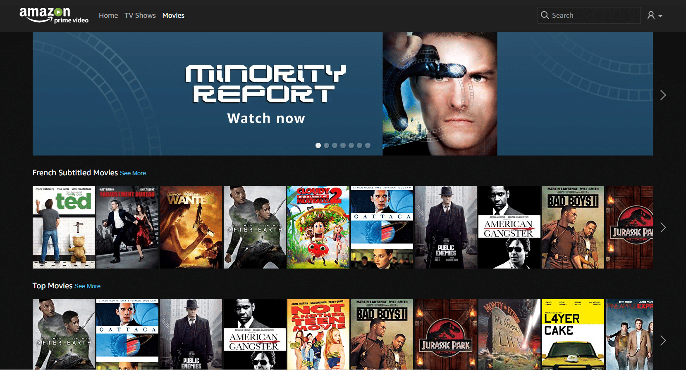
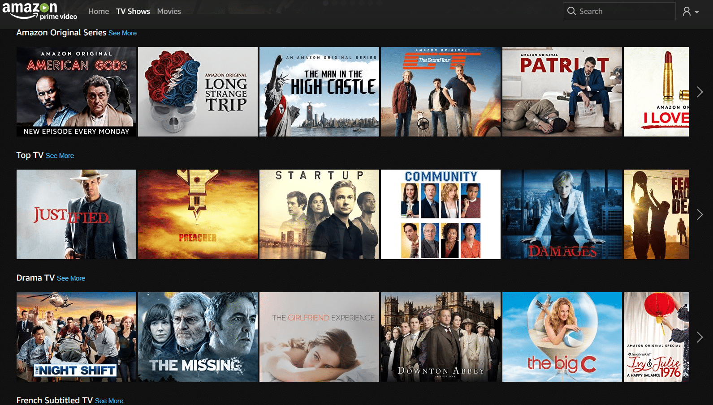
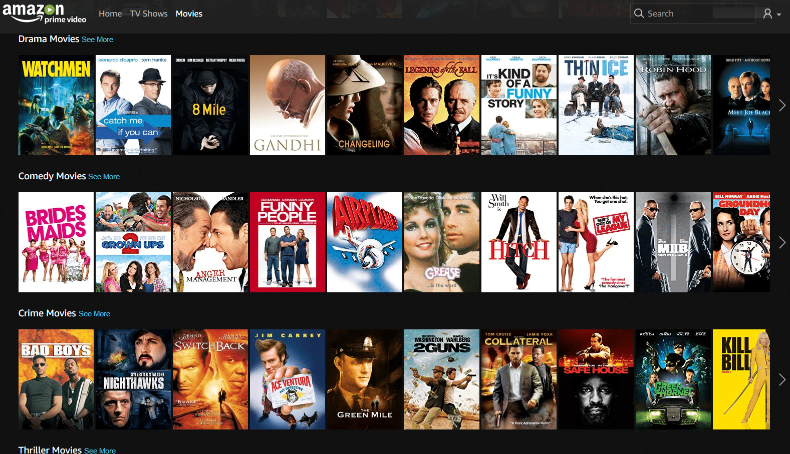

# Primevideo le Streaming Gratuit d’Amazon Premium

> [**Primevideo**](https://www.primevideo.com/?tag=guilbraimespa-21) le Streaming Gratuit d’Amazon Premium qu’est ce que c’est ?
>
> Vous vous posez la question et bien ça ne m’étonne pas, car je me la suis aussi posée. Personnellement je n’en avais **jamais entendu parler** avant de tomber dessus par hazard, en me baladant sur le site d’[**Amazon**](https://www.amazon.fr/essayerpremium?tag=guilbraimespa-21).
>
> Si comme moi vous êtes un aficionado des achats sur [**Amazon,**](https://www.amazon.fr/essayerpremium?tag=guilbraimespa-21) vous êtes surement membre d’[**Amazon Premium**](https://www.amazon.fr/essayerpremium?tag=guilbraimespa-21) qui, je vous le rappelle, permet principalement de recevoir vos achats en **un jour ouvré** et **sans frais de port.**
>
> Il y a d’autres avantages, mais je ne m’y étais jamais vraiment intéressé; et bien j’aurais dû, car on y trouve le service [**Primevideo**](https://www.primevideo.com/?tag=guilbraimespa-21) qui permet d’avoir accès **gratuitement** en **Streaming** ou en **téléchargement,** à des **films** et des **séries.** Et en prime 🙂 c’est **inclus** dans **l’[abonnement](https://www.amazon.fr/essayerpremium?tag=guilbraimespa-21)** [**premium**](https://www.amazon.fr/essayerpremium?tag=guilbraimespa-21) qui n’est que de **49,00€** ! Non ! Pas par mois ! Mais par an ! soit un peu plus de **4,00€ par mois**.
>
> Je vais vous présenter le service [**Primevideo**](https://www.primevideo.com/?tag=guilbraimespa-21) et tenter de vous convaincre de **devenir membre d’[Amazon Premium](https://www.amazon.fr/essayerpremium?tag=guilbraimespa-21).**

## Amazon Prime Vidéo, qu’est-ce que c’est ?

[**Prime**](https://www.primevideo.com/?tag=guilbraimespa-21) **vidéo,** c’est le service de **Streaming** vidéo **d’Amazon,** inclus dans [Amazon Premium](https://www.amazon.fr/essayerpremium?tag=guilbraimespa-21). Le service est **disponible** depuis décembre 2016 dans plus de 200 pays, dont la **France**. Amazon souhaite **concurrencer** **Netflix,** en proposant **son propre catalogue** d’émissions, de séries et de films, **sur PC**, **tablette et** **smartphone**.

[**Prime**](https://www.primevideo.com/?tag=guilbraimespa-21) **vidéo** ne déroge pas à la règle des **catalogues exclusifs,** ce qui, pour moi, n’est pas une qualité. Je m’explique.

On est tous habitués aux différents **services** de Streaming audio,, comme **Deezer**, **Spotify**, **Google Music,** pour ne citer qu’eux. Ils proposent tous plus ou moins les **mêmes catalogues**. **Malheureusement,** ce n’est **pas** la même chose dans le monde du **Streaming vidéo**.

Si vous voulez avoir accès à toutes les **séries phares,** ou aux **derniers films** sortis en DVD, il va vous falloir **plusieurs** **abonnements**. Par exemple, si vous voulez regarder **Game Of Thrones,** il faut s’abonner à **OCS** (10€/mois), **House of Cards** à **Netflix** (10€/mois) sans compter les **séries originales de canal,** visibles uniquement sur **Canal Play** (10€/mois). Chacun veut appâter le chaland avec sa série, mais au final, c’est **trop compliqué** de choisir. Alors on a tendance à vouloir pirater, pas forcement par radinerie ou transgression, mais juste parce-que **ce n’est pas pratique**.

Comme les autres, [**Primevideo**](https://www.primevideo.com/?tag=guilbraimespa-21) propose des **séries originales**, donc produites par « **Amazon Studios** » et disponibles uniquement sur leur propre plateforme. Je ne vais pas vous faire un **comparatif** des disponibilités sur les différents **catalogues** de **Streaming,** mais si vous voulez savoir sur quel catalogue regarder un film ou une série, il y a le site **[www.justwatch.com](https://www.justwatch.com/fr)** qui vous donnera toutes les informations que vous souhaitez.

Mais soyons lucides, le service [**Primevideo**](https://www.primevideo.com/?tag=guilbraimespa-21) est jeune et il n’y a pas encore beaucoup de **super productions** récentes. Laissons lui le temps de **faire sa place**.

Personnellement, je ne suis pas un grand fan de **séries TV,** je n’ai donc jamais souscrit à un de ces services de **Streaming** et surtout, **Kodi** est mon ami ! Tout particulièrement avec le plugin qui va bien, mais nous en reparlerons dans les articles [consacrés au **multiroom**](/articles).

Par contre, je regarde beaucoup de **films** et j’aime bien pouvoir en regarder quel que soit le lieu ou je me trouve. **Kodi** peut le faire, mais il faut une bonne connexion internet, avec un **débit montant suffisant** et pour le moment, ce n’est pas mon cas. Du coup, pour l’heureux membre du service **[Premium](https://www.amazon.fr/essayerpremium?tag=guilbraimespa-21)** d’Amazon que je suis, [**Primevideo**](https://www.primevideo.com/?tag=guilbraimespa-21) tombe à point nommé, car si je n’ai pas un débit ADSL suffisant, j’ai de la **4G à revendre**.

Il ne faut **pas** non plus s’attendre à avoir les **derniers films** du box office et bon nombre de vos films fétiches ne seront **pas disponibles,** mais ça permet tout de même d’avoir un petit catalogue sympa de **films sous la main**.

## Amazon PrimeVidéo combien ça coûte ?

Comme je vous l’ai dit, [**Primevideo**](https://www.primevideo.com/?tag=guilbraimespa-21) est compris dans le programme **[Amazon Premium](https://www.amazon.fr/essayerpremium?tag=guilbraimespa-21)** qui pour **49,00€** par an, vous permet de bénéficier de :

- **_La livraison en_ _1 jour ouvré gratuite_ _et illimitée, sur des millions d’articles._**
  - C’est pour cela que je suis passé à [Premium](https://www.amazon.fr/essayerpremium?tag=guilbraimespa-21) et c’est vraiment pratique, en plus on peut commander des **Dash Buttons** ([remboursés](http://amzn.to/2sBxpom)) que l’on peut reprogrammer pour les utiliser avec **Jeedom**.
- **_L’accès prioritaire aux Ventes Flash éligibles 30 minutes après leur démarrage._**
  - Ça permet d’avoir un peu d’avance sur les autres pour profiter de bonnes affaires, ça laisse un peu le temps de farfouiller.
- **_La possibilité d’emprunter gratuitement un eBook par mois._**
  - J’ai un peu regardé, c’est pas mal, mais je vous avoue que je ne suis pas fan des eBooks.
- _**Les promotions exclusives Amazon Famille.**_
  - Ça, c’est pour avoir 20% sur les couches par exemple et des promos ciblées famille.
- **_L’accès au stockage sécurisé et illimité de vos photos._**
  - C’est du stockage sur cloud, personnellement je ne l’utilise pas.
- _**Twitch Prime : Des jeux in-game, lives et vidéos sans publicité et un abonnement Twitch gratuit par mois.**_
  - C’est pour voir des vidéos de jeux vidéos… à vous de voir. Il parait que c’est un concept apprécié par les adeptes du genre.

Et **maintenant** vous avez en plus [**Primevideo**](https://www.primevideo.com/?tag=guilbraimespa-21), ce qui fait finalement pas mal de services pour **4,00€ par mois**.

Si avec tout ça vous n’arrivez toujours pas à vous décider, sachez que vous avez **[30 jours gratuit](https://www.amazon.fr/essayerpremium?tag=guilbraimespa-21)s** pour tester et que les bénéfices de l’offre d’**essai gratuit** **[Amazon Premium](https://www.amazon.fr/essayerpremium?tag=guilbraimespa-21)** sont les **mêmes que ceux de l’adhésion payante**.

_**Info** : Pour ne profiter que de l’**offre gratuite,** il suffit de cliquer sur « **Fin adhésion** » avant les **30 jours**._

