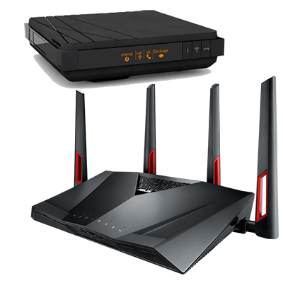
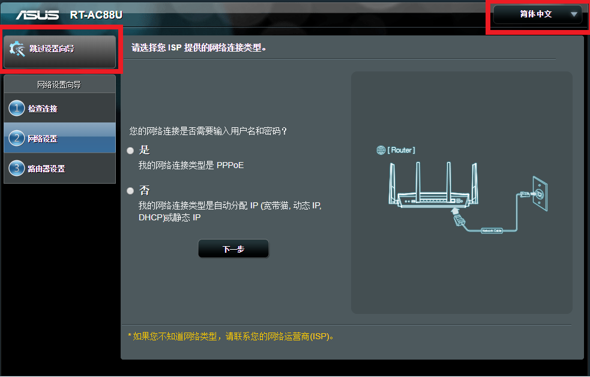
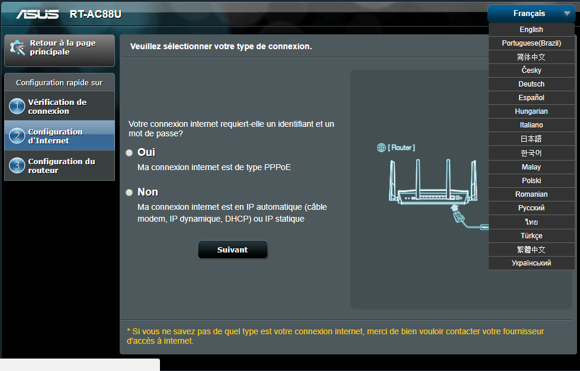
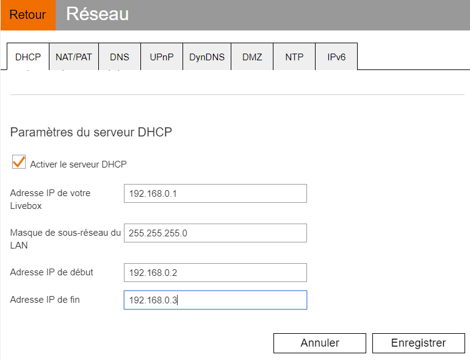
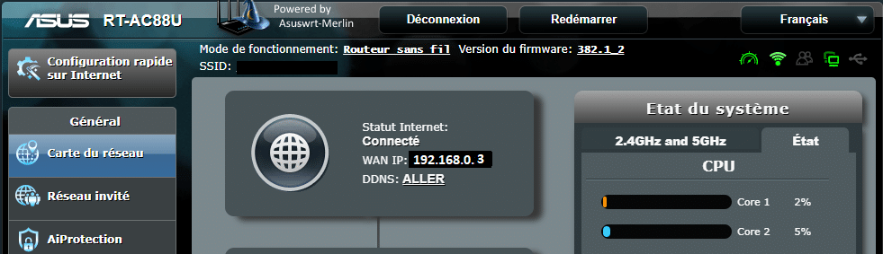
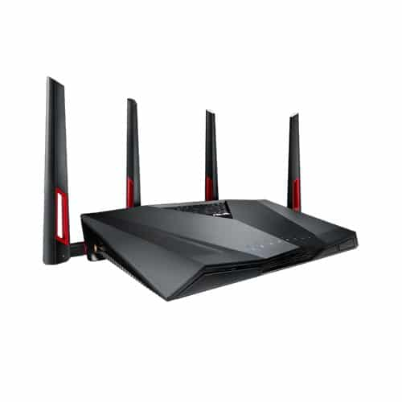

# Routeur ASUS RT-AC88U & Livebox 4

> Je vous propose aujourd’hui un **article** orienté **réseau**, détaillant la **configuration** d’un routeur, le **[Asus Rt-AC88U](http://amzn.to/2DHgVnQ)**, connecté derrière une **Livebox 4.**
>
> *En fonction du routeur et de votre fournisseur internet, la configuration peut varier sur quelques points, mais le principe restera le même.* 
>
> Pour les **tests** de débits, de bandes passante, de processeur et autres records, il y a plein **de spécialistes** sur le **net** qui font ça **très bien.** Je vais donc me **limiter** à une petite **description**, histoire de savoir de quoi on parle.
>
> Pour commencer, ce routeur est **double bande Wi-Fi, MU-MIMO** avec **8 ports LAN Gigabit** donc **wifi** **puissant** et 2 fois plus de **place** pour brancher des **appareils** en **filaire.** Ce qui est parfait en domotique.
>
> Il permet de faire du **Dual-WAN** : Un des ports LAN peut être converti en port WAN et permet de connecter **deux** **modems.** Par exemple une **box ADSL** et un **modem** **4G** de secours.
>
> Il est possible de faire de l’**agrégation de ports** : Deux des ports LAN peuvent être combinés en une seule **connexion** **ultra**–**rapide**, vers un NAS par exemple.
>
> L’interface **Web d’ASUS Asuswrt** et surtout la **version Merlin**, sont très **fonctionnels** et la **prise en main** est **rapide**. Il est possible, entre autres, de surveiller le réseau, d’utiliser un VPN, et de **protéger** votre **réseau** domestique contre les logiciels malveillants et les intrus…
> Pour plus d’infos, allez voir sur le site d’[ASUS](https://www.asus.com/fr/Networking/RT-AC88U/), il y a toutes les informations nécessaires.




## ASUS RT-AC88U

Depuis peu, je suis équipé d’une **Livebox** **4** fibre qui est très **limitée** niveau **paramétrage**, surtout lorsqu’on était habitué à la Freebox Révolution.

Comme beaucoup d’entre nous, j’ai de **plus en plus d’appareils connectés** et donc de **plus en plus de réglages** à faire. La **Livebox** n’est pas faite pour cela et on est vite **bloqué**.

En plus, on est jamais à l’abri d’une **panne** de **box** ou d’un **changement** **d’opérateur,** donc de **perdre** tous les **réglages**.

Un **routeur** permet principalement **d’optimiser** son réseau et de ne **pas** être **dépendant** du matériel de son FAI.

J’ai donc commandé le modèle **[Asus Rt-AC88U](http://amzn.to/2DHgVnQ)**, car j’avais vu sur plusieurs sites, dont celui de [Lunarok](https://lunarok-domotique.com/2017/11/asus-rt-ac88u-asuswrt-domotique/), qu’il était vraiment **performant**, particulièrement au niveau du **wifi**, ainsi que des **8 Ports LAN** qui permettent de se passer d’un switch supplémentaire.

Le routeur est disponible sur Gearbest et sur [Amazon](http://amzn.to/2DHgVnQ).

[[**Voir le produit sur Amazon**](https://www.amazon.fr/dp/B018WJTTG6?tag=guilbraimespa-21)

### L’interface web d’ASUS Asuswrt



Oui c’est du chinois, lorsque je me suis connecté au routeur, j’ai été un peu **dérouté** par **l’interface** dans cette langue. En général lors de l’installation, l’interface est en anglais, ou du moins, il y a une liste pour choisir la langue. Là, ce n’était pas le cas, J’ai donc dû chercher un peu.

La langue se **change** grâce à une l**iste déroulante en haut à droite**, mais **impossible** de choisir le Français ou l’Anglais depuis **Chrome.** J’ai été obligé d’utiliser **Internet Explorer** pour le faire.

_**Pour info**: depuis la mise à jour du firmware, je peux désormais modifier la langue depuis Chrome. Donc, vous n’aurez sans doute pas le même problème que moi._

Une fois le routeur en Français, **l’installation** se fait très facilement, grâce à **l’assistant** qui nous guide pas à pas, afin de choisir les bonnes **options** disponibles. Le routeur peut être utilisé comme :

- **Routeur Sans Fil (par défaut)** : C’est l’utilisation de base du routeur, il géré les adresses IP, les ports…
- **Répéteur** : Le RT-AC88U se connecte à un signal Wifi existant et étend sa portée.
- **Mode Point d’accès** : C’est la même chose que le mode répéteur sauf qu’il faut le connecter à sa box en ethernet et non en wifi.
- **Media Bridge** : Ce mode nécessite d’avoir **deux** [Rt-AC88U](http://amzn.to/2DHgVnQ). C’est un peu l’inverse du mode Point d’accès. Les **2 routeurs** sont reliés en wifi et le signal est envoyé par les ports ethernet.



### L’interface web d’ASUS Asuswrt Merlin

Si vous voulez avoir **plus d’options** dans la configuration du routeur, vous pouvez **mettre à jour l’interface Web** avec le **firmware Merlin**.

Le firmware Asuswrt-Merlin est un firmware **non officiel** qui ne vient pas en remplacement, mais en **extension** du **firmware officiel**.

_Toutes les fonctionnalités présentes en standard sont conservées et les fonctionnalités Merlin sont ajoutées._

Pour l’installer :

- **Télécharger** la dernière version correspondant à votre routeur sur [https://sourceforge.net/projects/asuswrt-merlin/files/](https://sourceforge.net/projects/asuswrt-merlin/files/)
- **Dé-zipper** le fichier

Depuis l’interface Web de votre **routeur** aller dans :

- Administration.
- Mise à jour du microcode.
- Nouveau fichier de firmware.
- Choisir un fichier.
- Sélectionner le fichier **RT-\[NomDuRouteur\].trx** précédemment dé-zippé.
- Cliquer sur **Charger**.

Attendez quelques minutes et ça devrait être bon. Vous devriez voir le logo « **Powered by Asuswrt-Merlin** » en haut à gauche.


## Configuration du routeur avec une Livebox

L’idée, c’est de ne **plus** utiliser la **Livebox**, sauf comme **modem** fibre ou ADSL.

On va donc **désactiver** le **wifi** de la Livebox. Je vous conseille de faire toutes les configurations qui suivent en ethernet.

Comme il n’est pas possible de mettre la Livebox en mode Bridge, on va **réduire** les plages du **DHCP** et changer le type d’adresse IP.

On va donc avoir **2 serveurs DHCP**, la **Livebox** (192.168.0.X) et le **Routeur** (192.168.1.X).

Par défaut, la **Livebox** attribue des adresses IP sous la forme **192.168.1.X**, sauf que maintenant, on veut que ce soit le **routeur** qui gère l’attribution de ces adresses IP, car **tous** nos appareils sont **déjà** **paramétrés** avec ce type d’adresse IP. **l’intérêt**, c’est de ne **pas** avoir à tout **refaire**.

Pour cela, on va **changer** le **DHCP** de la **Livebox**, pour attribuer des adresses en **192.168.0.X** et laisser le **routeur** gérer les adresses en **192.168.1.X**.

### Configuration de la Livebox

- Se **connecter** à votre Livebox sur : **[http://192.168.1.1](http://192.168.1.1)**.
- Faire une **sauvegarde** dans : **Paramètres avancés**.
- Cliquer sur : **Sauvegarder et restaurer**.
- Cliquer sur : **Sauvegarder en local**.
- Faire : **Retour**.
- Aller dans : **Wifi**.
- **Désactiver** le wifi. _(Sous réserve d’être en ethernet sinon changer le nom)._
- Faire : **Retour.**
- Aller dans : **Informations système**.
- Aller dans l’onglet : **Internet**.
- Chercher et **noter** les adresses : **DNS**.
  - 4.12 Adresse IP du **DNSv4 primaire** : X.X.X.X
  - 4.13 Adresse IP du **DNSv4 secondaire** : X.X.X.X
- Faire : **Retour.**
- Aller dans : **Réseau**.
- Aller dans : **NAT/PAT**.
- **Supprimer** toutes les règles NAT.
- Aller dans : **DHCP**.
- Aller dans : **Paramètres du serveur DHCP**.
  - Adresse IP de votre Livebox : **192.168.0.1**
  - Masque de sous-réseau du LAN : **255.255.255.0**
  - Adresse IP de début : **192.168.0.2** _(Ip de secours si besoin)._
  - Adresse IP de fin : **192.168.0.3** _(IP pour le routeur)._
- Aller dans : **Baux DHCP statiques.**
- Faire un **copier/coller** des adresses **MAC et IP** dans un fichier Excel ou Txt**.** _(Utile pour la configuration du routeur)._
- **Supprimer** tous les baux créés.
- **Enregistrer**.



Vous pouvez maintenant **arrêter votre Livebox**, **débrancher** tous vos **appareils** reliés en **ethernet** et on va alors pouvoir **brancher** le **routeur**.

Coté **Livebox**, brancher un **câble** ethernet sur un **port LAN** et coté **Routeur**, brancher l’autre extrémité du **câble** sur le **port WAN**.

Par défaut, le **routeur** a comme **adresse** **192.168.1.1**, on ne sera donc pas en conflit avec la **Livebox** qui est maintenant accessible sur **192.168.0.1**

### Configuration du routeur Asus RT-AC88U

- Tapez [http://192.168.1.1](http://192.168.1.1) depuis votre navigateur.
- Choisir la **langue** _(utiliser IE si besoin)._
- Connectez vous avec l’utilisateur : **admin** et le mot de passe : **admin**_._
- L’assistant va vous demander de **changer le mot de passe**.
- Choisir le mode : **Routeur Sans Fil (par défaut).**
- Choisir **Adresse IP statique**.
- Configurer les IP et DNS :
  - Adresse IP : **192.168.0.3** _(IP du routeur sur le DHCP Livebox)._
  - Masque de sous réseau : **255.255.255.0**
  - Passerelle par défaut : **192.168.0.1** _(IP de la Livebox)._
  - Serveur DNS1 : **X.X.X.X** _(Celle que l’on a récupéré sur la Livebox)._
  - Serveur DNS2 : **X.X.X.X** *(Celle que l’on a récupéré sur la Livebox).*

- Configurer le **Wifi** avec le **même nom** et le **même mot de passe** que vous utilisiez sur la **Livebox**. Cela permet de ne pas avoir à reconfigurer tous vos appareils wifi.
- **Valider** l’écran récapitulatif.
- Vous êtes maintenant **connecté** sur l’interface **ASUS WRT** du routeur.



Pour finir, il faut retourner dans l’interface de la Livebox ([http://192.168.0.1/](http://192.168.0.1/)).

- Aller dans : **DHCP.**
- Attribuer au **routeur** l’adresse **IP** statique **192.168.0.3**.

### Assigner manuellement les adresses IP

Voila ! c’est presque fini pour les réglages de base.

Vous savez surement qu’il est ~conseillé~ **indispensable** d’assigner des adresses **IP fixe** à tous vos appareils, surtout si vous faites de la **domotique**.

A ce sujet, je vous conseille de vous faire un **tableau Excel** avec le **nom** du périphérique, son adresse **MAC** et son adresse **IP**. C’est bien **pratique** en cas de **problème**. Il est possible d’utiliser des DNS, mais cela fera l’occasion d’un nouvel article.

- Aller dans : **Réseau local**.
- Dans l’onglet : **Serveur DHCP**.
- Descendre Jusqu’à : **Adresse IP assignée manuellement dans la liste DHCP**.
- Si vous avez **copié/collé** les **MAC et IP** de la **Livebox** dans un fichier, vous pouvez alors facilement les ré-assigner à vos appareils.
- Sinon, **identifier** les appareils les **uns après les autres**.

### Livebox TV sur Routeur Asus RT-AC88U

Pour **brancher la Livebox TV sur le routeur**, il faut faire des réglages spécifiques dans les paramètres avancés :

- Aller dans : **Réseau local**.
- Dans l’onglet : **IPTV**.
  - Sélection de FAI : **Aucun**.
  - Port IPTV STB : **Aucun.**
  - Utiliser le routage DHCP : **Microsoft**.
  - Activer le routage multi-diffusion (IGMP Proxy) : **Activer**.
  - Optimisation de la diffusion des trames de multidiffusion (IGMP Snooping) : **Activer\*\***.\*\*
  - Proxy UDP (Udpxy) : **0**.

_Info : Sachez qu’il est possible de laisser la **Livebox TV** ou **tout autre appareil,** branché sur la **Livebox**, mais pour **y accéder** depuis le réseau du **RT-AC88U**, il faudra ajouter des règles de routage. (Paramètres avancés,  Réseau Local, Routage)._

## Problème de Wifi 5Ghz

Après plusieurs heures à configurer aux petits oignons mon nouveau routeur, je suis allé dans les **réglages** du wifi afin **d’optimiser** au maximum la **bande passante**.

Quelle n’a pas été ma surprise lorsque je me suis rendu compte que le **wifi 5Ghz** émettait sur les **fréquences** **chinoises**, soit les canaux de **149 à 165**, alors qu’en **Europe** nous sommes sur des canaux de **36 à 140**.

> Dans certains pays, certaines fréquences peuvent être en conflit avec d’autres usages, notamment militaires ou avec des radars météo. Les organismes de régulation européens et français ont autorisé deux bandes de fréquences : l’une allant de 5,150 à 5,350 GHz et l’autre de 5,470 à 5,725 GHz. [Wikipedia](https://fr.wikipedia.org/wiki/Liste_des_canaux_Wi-Fi)

Pour faire simple, le **routeur** utilise les **fréquences** **chinoises** **interdites** en **Europe**.

Vous me direz c’est pas bien grave, sauf que les **appareils** vendus en **Europe** sont eux aussi **limités** à ces fréquences. Résultat des courses, la plupart de mes appareils qui se connectaient très bien sur ma **Livebox** en **Wifi 5 Ghz**, ne peuvent se connecter au **routeur** **que** sur le **wifi 2.4 Ghz**.

Ce qui est encore plus gênant, c’est que certains **appareils** connectés sur le **wifi 5G**, ne **communiquent** **pas** particulièrement bien avec ceux connecté au **Wifi 2.4G**.

Par exemple, la **Google Home** qui est maintenant limitée au **wifi 2.4G**, n’arrive plus à diffuser sur ma **Mi-Box** qui elle, se connecte au **Wifi 5G**.

Bien joué l’optimisation…

### Recherche de solutions

#### FAQ Gearbest

N’ayant trouvé **aucune information** parlant de ce problème de wifi sur la page Gearbest de présentation du routeur, j’ai posé la question dans la **FAQ** et la réponse fut très rapide :

> **Q**
> Chaque pays a des fréquences différentes pour le wifi 5 Ghz. Le routeur est-il limité aux fréquences chinoises 149 à 156 (U-NII-3) ou est-il possible d’utiliser les fréquences européennes 36 à 48 (U-NII-1)?
>
> **A**
> Bonjour Guillaume,
> Il peut être utilisé partout dans le monde. Soyez assuré que vous pouvez l’utiliser correctement.

#### Forum divers

Il est rare d’être le seul à avoir un problème, je suis donc allé chercher sur les différents **forum** **d’ASUS** et de **Merlin**, pour voir si d’autres personnes avaient eu ce soucis. Et bien apparemment ce n’est pas très courant.

J’ai trouvé que quelques personnes qui ont eu ce **problème** ont tenté de le **régler** en se connectant en **SSH** au routeur. Mais sans succès, car les commandes ne se sont pas mises à jour. Après quelques recherches, j’ai lu que c’était **enregistré** en **dur** dans la **mémoire** du routeur depuis **2014**.

- _Pour info voici les commandes SSH._

Cette commande permet de **connaitre les codes pays** :

```js
nvram show | grep “country_code\”
```

Elle me renvoie :

`wl0_country_code=CN`
`1:ccode=CN`
`0:ccode=CN`
`wl1_country_code=CN`

Cette commande devrait **changer les codes pays** : _(Inopérant depuis 2014)._

`nvram set pci/1/1/ccode=EU`
`nvram set pci/2/1/ccode=EU`
`nvram set wl0_country_code=EU`
`nvram set wl1_country_code=EU`

#### Support ASUS

En dernier recours, j’ai envoyé un **message** au **Support d’ASUS**, afin de savoir comment configurer le **routeur** sur les **fréquences** **européennes** et ainsi, me mettre en **conformité** avec la **législation**. Ça n’a vraiment pas eu l’air de les déranger…

> Suite à votre demande, sur le routeur modèle RT-AC88U, je comprends que vous demandez comment changer les canaux du 5GHz pour avoir les fréquences françaises.
>
> J’ai le regret de vous informer que votre routeur est destiné à être vendu en Chine c’est pourquoi vous ne pouvez pas changer les canaux du 5GHz et devez rester sur les canaux de chinois.

Ha oui ? Merci le support technique d’ASUS…!!!

### LA solution !

Convaincu que je ne pourrais pas régler mon problème, j’ai donc **abandonné** l’idée de modifier les fréquences et j’ai alors décidé d’utiliser mon **routeur** en mode « **Point d’accès** » et « **Répéteur wifi 2.4G**« , puis d’utiliser la **Livebox** comme **routeur** en **wifi 5G**.

Après avoir tout reconfiguré, en me baladant dans les menus, je suis tombé sur le **graal**, la petite liste déroulante cachée en bas d’un onglet et simplement nommé : « **Région** » et avec sélectionné : « **China (default)**« .

J’ai donc évidement sélectionné « **Europe** » et après un reboot du routeur, miracle ! les canaux **Wifi 5G européens étaient disponibles** .


Paramètres avancés / Sans fil / Professionnel / Bande : 5Ghz / Région : Europe.

_Je devrais peut être envoyer un mail au support d’ASUS… 🙂_

Avec le recul je pense que lors de la première **mise en route**, quand le routeur était encore en **chinois** et que je ne pouvais pas **changer la langue**, j’ai du malencontreusement sélectionner **China** au lieu **d’Europe**. Si un jour je fais un Reset usine du routeur, je vous dirai.

## Ou acheter le routeur ASUS RT-AC88U

Si l’idée d’avoir un **routeur en chinois** vous fait un peu peur, je vous **conseille** de l’acheter sur un **site plus connu** comme [Amazon](http://amzn.to/2DHgVnQ), pour une **centaine d’euros de plus** [313 €](http://amzn.to/2DHgVnQ) (Février 2018) les clients [prime](https://www.amazon.fr/prime?tag=guilbraimespa-21) le recevront en 24h.

[](http://amzn.to/2DHgVnQ)En fonction de vos **besoins** la gamme des **routeurs ASUS** est assez large.

<table style="width: 100%;"><tbody><tr><td><a href="https://www.amazon.fr/Asus-BRT-AC828-Routeur-AC2600-Dual-WAN/dp/B071VCVQ54/ref=as_li_ss_il?s=computers&amp;srs=7086729031&amp;rps=1&amp;ie=UTF8&amp;qid=1517700052&amp;sr=1-1&amp;keywords=routeur&amp;linkCode=li2&amp;tag=guilbraimespa-21&amp;linkId=8ef935a14eb38c5b1d2e56c5d8949181" target="_blank" rel="noopener noreferrer"></a></td><td><ul><li>&nbsp;Amazon Prime : <a href="http://amzn.to/2nGlGD1">450€</a>.</li><li>Gearbest : 400€.&nbsp;</li></ul></td><td><a href="https://www.amazon.fr/Asus-RT-AC5300-Router-AC5300-Protection/dp/B018WJUGA4/ref=as_li_ss_il?s=computers&amp;srs=7086729031&amp;rps=1&amp;ie=UTF8&amp;qid=1517700313&amp;sr=1-6&amp;keywords=routeur&amp;linkCode=li2&amp;tag=guilbraimespa-21&amp;linkId=8a74ecffb472e01d6e843a55b74b6067" target="_blank" rel="noopener noreferrer"></a></td><td><ul><li>&nbsp;Amazon Prime : <a href="http://amzn.to/2s7AoIS">340€</a>.</li><li>Gearbest : 260€.&nbsp;</li></ul></td></tr><tr><td>&nbsp;</td><td><ul><li>Gearbest : 160€.&nbsp;</li></ul></td><td><a href="https://www.amazon.fr/Asus-RT-AC68-Router-AC1900-Protection/dp/B00FL1IFM8/ref=as_li_ss_il?ie=UTF8&amp;linkCode=li2&amp;tag=guilbraimespa-21&amp;linkId=9472329591ba28f4946227917fc364eb" target="_blank" rel="noopener noreferrer"></a></td><td><ul><li>&nbsp;Amazon Prime : <a href="http://amzn.to/2E9kv9N">150€</a>.</li><li>Gearbest : 120€.&nbsp;</li></ul></td></tr></tbody></table>
