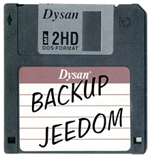
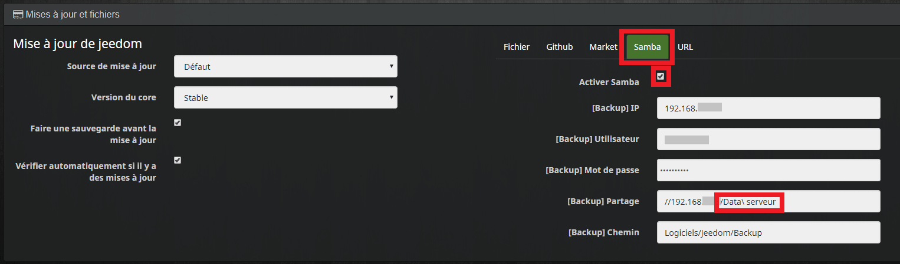
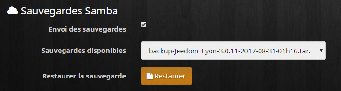
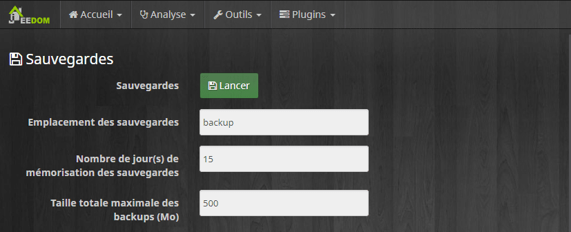
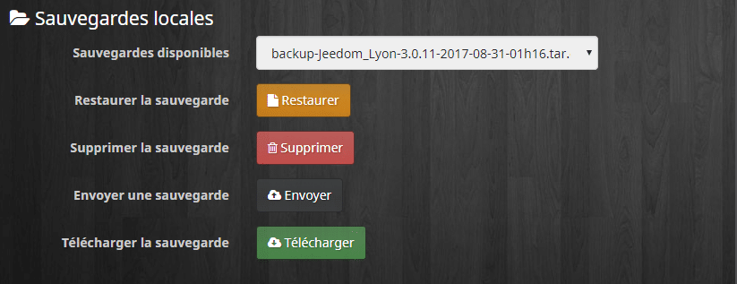
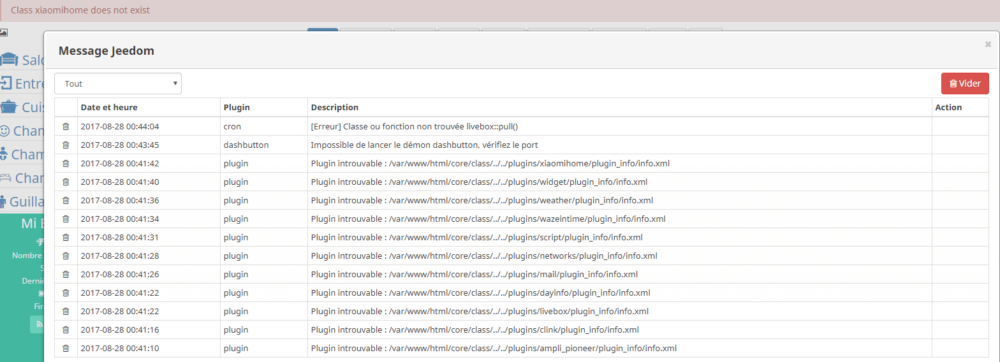

# Sauvegarde et restauration de Jeedom

> Aujourd’hui, je vous propose de parler d’une des **fonctions** essentielles de **Jeedom,** **sauvegarde** ou **backups**  et **restaurations**.
> Comme pour beaucoup de logiciels, on n’en parle pas assez et **malheureusement,** on se penche sur le problème bien souvent quand il est déjà **trop tard**.
> En cas de **corruption** de la [carte SD](http://amzn.to/2gqNdF9) de votre [Raspberry](http://amzn.to/2eraCWo) ou du [disque dur](http://amzn.to/2gqmNTN), en cas de mauvaise **manipulation,** ou pour plein d’autres raisons qui pourraient faire **planter** **Jeedom,** les **sauvegardes** sont **indispensables,** afin de ne pas tout perdre du jour au lendemain.
> Par précaution, **Jeedom** fait une **sauvegarde** **automatique** toutes les nuits et il la stock dans un dossier Backup. Le problème, c’est que si votre carte SD est corrompue, ce qui m’est déjà arrivé, vous perdez tout !
> Mais je n’ai pas tout perdu, car j’avais heureusement **déporté** par précaution, la copie des **sauvegardes** sur un **autre** **support** de stockage.
> Voilà donc quelques **conseils** pour **configurer** et **restaurer** une **sauvegarde,** de manière sûre. A la fin de l’article, je vous propose pour information, un retour d’expérience sur des **problèmes** rencontrés lors de mes **restaurations**.



## Enregistrer automatiquement les sauvegardes sur un NAS Synology.

Si vous êtes l’heureux possesseur d’un [NAS Synology](http://amzn.to/2ewbTPr), ou comme moi d’un [Xpenology](/articles/multiroom-audio-video-installations-cote-serveur), vous pouvez y **déporter** le **stockage** de vos **Sauvegardes**.
En fait n’importe quelle machine avec un **serveur** **Samba** fera l’affaire, une Freebox V6 par exemple.
Dans le cas ou vous n’avez **pas** de **solution** matériel pour déporter le stockage de vos sauvegardes, vous pouvez toujours vous acquitter d’un **abonnement de 2,00€** par mois, pour que vos **sauvegardes** soient envoyées sur le **serveur** de [**Jeedom** market.](https://www.jeedom.com/market/index.php?v=d&p=profils&tab=backup) Avec néanmoins une limite aux **6 dernières sauvegardes** des **2 derniers mois**.

### Configurer la sauvegarde

- **Aller dans** : Roue crantée / Configuration / Mises à jour et fichiers / Samba.
- **Cocher** : Activer Samba.
- **Saisir l’adresse** IP du NAS.
- **Saisir l’utilisateur** et le **mot de passe** du NAS.
- **Saisir le nom du disque** réseau contenant le(s) répertoire(s) de sauvegarde, exemple : « //192.168.X.X/Data\\ serveur ».
  - Attention les **« / »** ne sont **pas** dans le **même** **sens** que pour les adresses sous Windows **« \\ »**.
  - Si il y a un **espace** dans le **nom** de votre **disque** réseau, il faut mettre un **« \\ »** **devant l’espace**.
- **Saisir le chemin** dans lequel vous voulez copier les sauvegardes, exemple : « Logiciels/Jeedom/Backup ».
  - Attention il n’y a **pas** **de « / »** au debut et à la fin du chemin.
- **Sauvegarder** en bas à gauche.



### Activer l’envoi des sauvegardes

- **Aller dans** : Roue crantée / Sauvegardes.
- **Onglet** « Sauvegardes Samba ».
- **Cocher la case** « Envoi des sauvegardes ».
- **Cliquer** sur : Sauvegarder. (Et pas sur Restaurer :))


C’est ici également que vous pourrez **lancer** la **restauration** d’une sauvegarde stockée sur votre NAS, en **cliquant** sur **Restaurer** (cette fois ci).

## Faire une sauvegarde manuellement

Il peut parfois être utile de faire une **sauvegarde** **manuellement.** Par exemple, avant de faire des tests, d’installer un plugin, ou de faire des modifications importantes sur votre Jeedom.
N’oubliez pas que la **sauvegarde** sera **stockée** dans le **répertoire** **« /var/www/html/backup »** de Jeedom. Donc, si vous avez prévu de tout **formater,** pensez à **récupérer** le fichier.
Si vous avez **activé** le stockage déporté des **sauvegardes,** Jeedom se chargera d’envoyer les **copies** au bon endroit. Exemple pour le NAS : `Send backup Samba...`

- **Aller dans** : Roue crantée / Sauvegardes
- **Cliquer** sur « Lancer ».
- **Attendre**…
- **C’est Prêt !**


Dans la **fenêtre** de **droite,** vous allez voir **l’avancement** de la sauvegarde.
Vous n’êtes **pas** obligés de **rester** sur cette **fenêtre.** La sauvegarde se fait en **arrière plan.** Mais évitez cependant de trop solliciter Jeedom à ce moment la.
`[START BACKUP]   ***************Start of Jeedom backup at 2017-09-01 23:09:38***************   Send begin backup event...OK   Check database...   OK   Backup database...   OK   Persist cache :   OK   Create archive...   OK   Clean old backup...OK   Limit the total size of backups to 500 Mo...   Remove : /var/www/html/core/php/../../backup/backup-Jeedom_Lyon-3.0.11-2017-08-25-05h33.tar.gz   OK   Send backup Samba...   Domain=[WORKGROUP] OS=[Unix] Server=[Samba 4.1.18]   putting file backup-Jeedom_Lyon-3.0.11-2017-09-01-23h09.tar.gz as \Logiciels\Jeedom\Backupackup-Jeedom_Lyon-3.0.11-2017-09-01-23h09.tar.gz (7018.2 kb/s) (average 7018.2 kb/s)   Domain=[WORKGROUP] OS=[Unix] Server=[Samba 4.1.18]   Domain=[WORKGROUP] OS=[Unix] Server=[Samba 4.1.18]   OK   Name of backup : /var/www/html/core/php/../../backup/backup-Jeedom_Lyon-3.0.11-2017-09-01-23h09.tar.gz   Send end backup event...OK   Backup duration : 129s   ***************Fin de la sauvegarde de Jeedom***************   [END BACKUP SUCCESS]`

## Restauration d’une sauvegarde

La **restauration** est possible depuis une **sauvegarde** présente en **local**, par exemple un Raspberry, ou stockée sur un **autre support**, par exemple un [NAS synology](http://amzn.to/2iO7Teu).

### Sauvegardes locales

- **Aller dans** : Roue crantée / Sauvegardes.
- **Aller dans l’onglet** : Sauvegardes locales.
- **Sélectionner** une sauvegarde dans la liste « Sauvegardes disponibles ».
- **Cliquer** sur « Restaurer ».


C’est ici que vous pourrez **envoyer**, **supprimer** ou **télécharger** des **sauvegardes** locales.

### Sauvegardes sur NAS

- **Aller dans** : Roue crantée / Sauvegardes.
- **Aller dans l’onglet** : Sauvegardes Samba.
- **Sélectionner** une sauvegarde dans la liste « Sauvegardes disponibles ».
- **Cliquer sur** « Restaurer ».


C’est le **même principe** dans le cas ou vous stockez vos **sauvegarde** sur le Jeedom **Market**, il faut juste aller dans l’onglet : « Sauvegardes Market »

## Problèmes suite à une restauration de Jeedom

Lorsque j’ai fait une **restauration** de Jeedom, j’ai rencontré quelques **soucis.** Voilà mon **retour d’expérience** avec des **solutions** aux **problèmes** rencontrés.

### Mise à jour des plugins

Après une **restauration,** il est recommandé de lancer une **mise à jour,** pour être certain que les **plugins** et le **core** soient bien dans les dernières versions disponibles.

- **Aller dans** : Roue crantée / Centre de mise à jour.
- **Cliquer sur** : Vérifier les mises à jour.
- **Cliquer sur** : Mettre à jour.

### Dépendances NOK après restauration

J’ai eu également quelques **plugins** (capricieux) qui m’ont posés **problème** après la **restauration**. Impossible de relancer les **dépendances** et les **démons**, statuts à **NOK**, le plugin ne démarre pas.

- La solution :
  - **Refaire** une **installation** « propre » de Jeedom.
  - **Installer** les **plugins** juste après avoir installé Jeedom et avant **même** de lancer la **restauration**.
  - **Vérifier** que les **statuts** soient bien à **OK**, si ce n’est pas le cas, il est plus facile de **débugger** un **Jeedom** tout frais.
  - Après je **restaure** la sauvegarde.

- Quelques plugins ayant posé problème, réglé avec cette technique :
  - Xiaomi Home.
  - Bluetooth Advertisement.
  - Broadlink.

### Plugin introuvable info.xml

Dès que la **restauration** s’est **terminée**, j’ai reçu plein de **messages** de Jeedom avec **l’erreur** suivante :
`Plugin introuvable : /var/www/html/core/class/../../plugins/[nom du plugin]/plugin_info/info.xml`
L’intitulé du **message** n’est pas très juste, car les **plugins** sont bien **présents** si on va dans le gestionnaire de plugins. Je n’ai pas vérifié, mais je pense que c’est le fichier **info.xml** qui était **introuvable**.

- La solution :
  - **Aller dans** : Roue crantée / Centre de mise à jour.
  - **Cliquer** sur « Réinstaller » en face des plugins ayant le problème, afin de forcer la réinstallation.

### Message d’erreur lors de la connexion

```js
The stream or file "/var/www/html/core/class/../../log/event" could not be opened: failed to open stream: Permission denied
```

- La solution :
  - En SSH taper :
    - sudo chmod 775 -R /var/www/html
    - sudo chown www-data:www-data -R /var/www/html

### Démon Statut NOK

Le statut de 2 plugins (Xiaomi Home et JeeOrangeTv) restaient à NOK malgré le statut des dépendances à OK.
Dans le Log j’avais le message suivant :
`IOError: [Errno 13] Permission denied: '/tmp/jeedom/xiaomihome/deamon.pid'`
Un simple reboot de Jeedom suffit.

## Conclusion
