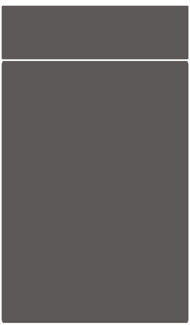
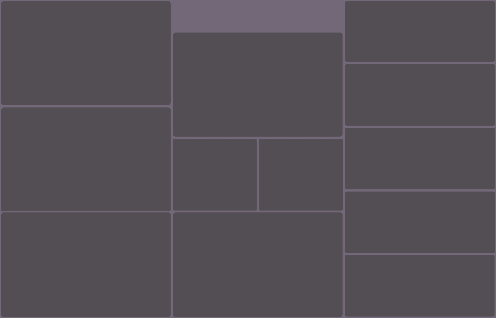
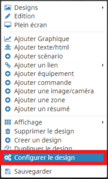
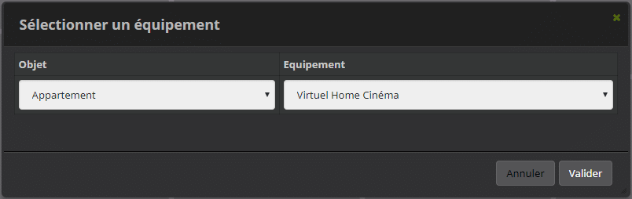
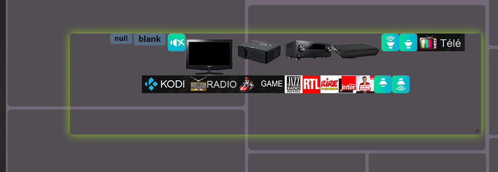
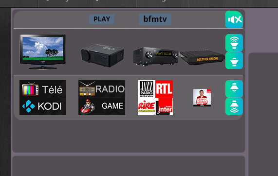
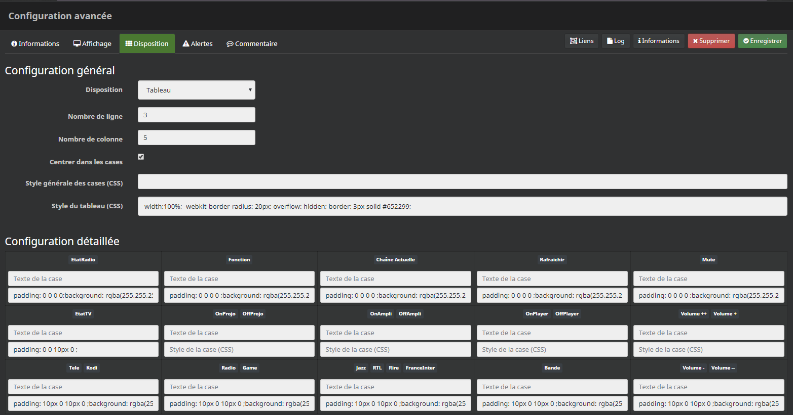
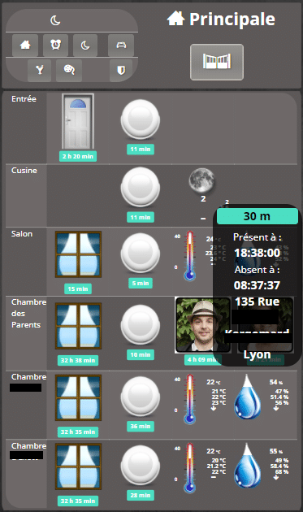
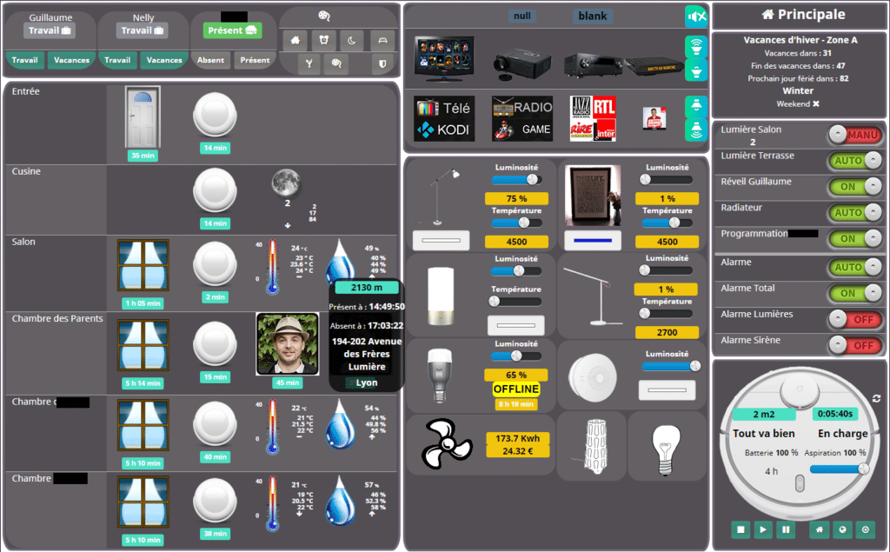
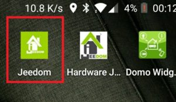

# Design Jeedom niveau débutant

> Aujourd’hui je vous propose un article pour vous montrer comment **créer un Design** très simple et l’ouvrir en **plein écran** sur votre smartphone.
>
> Le mode **Design,** aussi appelé mode **Plan,** fait parti du core de Jeedom et ne nécessite **pas** l’installation de **plugin**. Il permet **d’afficher** les différents **composants** de Jeedom, avec une mise en forme plus poussée que sur le Dashboard et avec, entre autres, l’ajout **d’images** de **fond**.
>
> Nous verrons rapidement l’option **tableau** disponible depuis Jeedom V3 pour la **mise en forme,** puis comment créer **un raccourci** sur le bureau de votre **smartphone**, avec un effet « application » **plein écran**.
>
> Il est possible d’utiliser le **même Design** pour les écrans de PC, tablettes et smartphones, ou des **Designs** adaptés à chaque **taille** d’écran.
>
> _**Pour aller plus loin : [Design Jeedom niveau intermédiaire.](/articles/design-jeedom-niveau-intermediaire)**_

## Ajout d’une image de fond

Pour l’exemple, j’utilise une **image** très simple qui se compose de cadres de différentes tailles que je peux modifier dans Photoshop en fonction du contenu.

Il est possible de mettre la photo de son appartement, ou encore la photo d’un paysage. Mais attention de ne pas surcharger le Design avec une image de fond qui pourrait gêner la lecture des équipements. Le but est d’avoir une vue d’ensemble claire et rapide. Vous trouverez des exemples sur [Google](https://www.google.fr/search?q=exemple+design+jeedom&tbm=isch&tbo=u&source=univ&sa=X&ved=0ahUKEwjRz9-zl87YAhUF66QKHY0rCbwQsAQINQ&biw=1680&bih=919).

-   Pour les smartphones, il est conseillé d’utiliser le **mode portrait.** L’image utilisée est adaptée à la taille de mon OnePlus 5, soit 375 \* 640 px, afin de ne pas devoir **scroller** de haut en bas ou de gauche à droite. Vous devrez peut-être la modifier pour l’adapter à la taille de vos écrans.

    

    Design d’exemple pour smartphone. Vous pouvez le télécharger si besoin.

La source Photoshop (psd) est disponible [ici](/articles), ainsi que d’autres exemples.

-   L’image suivante est plus destinée aux **tablettes et PC.** Elle fait 1400 \* 900 px en **mode paysage**, vous pouvez la modifier à votre convenance.

    

    Design d’exemple pour PC et tablette. Vous pouvez le télécharger si besoin.

La source Photoshop (psd) est disponible [ici](/articles), ainsi que d’autres exemples.

-   Aller dans : **Accueil**, **Design**, créer un nouveau Design.
-   Au centre de l’écran faire : Clic droit, **Edition**.
-   Refaire un clic droit, **Configurer le Design**.
-   Dans image clic sur « **Envoyer** » et sélectionner l’image.

L’image s’affiche directement au centre de votre écran.

## Ajout d’un équipement

-   Pour ajouter un équipement faire un clic droit, « **Ajouter équipement**« .
-   Sélectionner un équipement.

    

    J’ai choisi un virtuel avec mes équipements Home-cinéma.

-   L’équipement est inséré **en-haut à gauche** du Design.
-   Pour le déplacer, faire clic droit, **Edition**.
-   L’équipement doit être en **surbrillance**.
-   Le faire **glisser** avec la souris pour le **déplacer** à l’emplacement voulu.
-   Ajuster la **taille** en déplaçant le **coin inférieur droit**.

Virtuel en surbrillance avant la mise en forme.

### Mise en forme en tableau

-   Pour mettre en forme l’équipement, faire un clic droit sur l’équipement, **Configuration avancée**.
    -   Dans l’onglet « **Informations** » : Vous pouvez activer et rendre visible l’équipement et accéder aux commandes qui le composent.
    -   Dans l’onglet « **Affichage** » : Vous pouvez modifier plusieurs options, couleur de fond (transparent), afficher le nom…
    -   Dans l’onglet « **Disposition** » : Vous pouvez organiser votre équipement sous forme de tableau, en utilisant le [CSS](https://www.w3schools.com/css/default.asp).

Pour chacune des commandes, j’ai caché leur nom dans « **Configuration de la commande** » onglet « **Affichage**« . Comme vu juste au dessus, vous pouvez accéder aux différentes commandes depuis l’onglet « **Informations**« .

Mon tableau se compose de **3 lignes et 5 colonnes** avec des **bords arrondis**. Il occupe **100% de la largeur** et une ligne sur deux a un **fond transparent**. Pour finir il y a une **bordure** en bas des lignes 1 et 2 et les éléments sont **centrés** dans les cases.

Virtuel, une fois la mise en forme tableau appliquée.

-   Dans l’onglet « **Disposition**« , choisir « **Tableau**« .
-   Nombre de ligne : 3.
-   Nombre de colonne : 5.
-   Cocher : **Centrer dans les cases.**
-   Style du tableau (CSS) : **width:100%; -webkit-border-radius: 20px; overflow: hidden;**
    -   **width:100%;** C’est la largeur du tableau.
    -   **\-webkit-border-radius: 20px;** Permet d’arrondir les angles.
    -   **overflow: hidden;** Permet de rogner les éléments.
-   **Enregistrer**, **fermer la fenêtre**, et **retourner** dans l’onglet « **Disposition** » pour voir les lignes et colonnes du tableau apparaître.
-   Faire **glisser** les commandes dans les cases désirées.
-   Ajouter du code **CSS** pour personnaliser les cases, exemple : **padding: 0 0 0 0;background: rgba(255,255,255,0.1);border-bottom: 1px solid #AAAAAA;** 
    -   **padding: 0 0 0 0;** c’est l’espacement autour des elements.
    -   **background: rgba(255,255,255,0.1);** permet de régler l’opacité du fond.
    -   **border-bottom: 1px solid #AAAAAA;** permet de mettre une bordure en bas de la case.

_Vous trouverez plus de détails au sujet du CSS sur : [https://developer.mozilla.org/fr/docs/Web/CSS/](https://developer.mozilla.org/fr/docs/Web/CSS/border-bottom)._

## Ajout d’un élément

En plus des **équipements**, il est possible d’ajouter des **commandes**, ou d’autres **éléments**, en choisissant les options disponibles. Pour cela, faire un **clic droit** sur le Design.

Voila 2 exemples :

-   **Ajouter text/html**  : Permet d’ajouter un simple texte, ou du code html, comme un lien vers l’image d’une caméra  :

``

-   **Ajouter une Zone** : Permet d’ajouter une zone qui se superpose sur le passage de la souris ou sur un clic. Par exemple lorsque l’on passe la souris sur la photo d’un membre de ma famille les détails de géolocalisation s’affichent. Distance de la maison, heure de présence / absence et adresse.

Exemple pour smartphone.

Exemple pour Pc ou tablettes.

## Ouvrir un Design en plein écran

Maintenant que vous avez fait un beau Design, nous allons voir comment y accéder depuis une **icône** sur le bureau de votre smartphone, comme si c’était une application et l’ouvrir en **plein écran**.

_**Edit du 15/01/2018** : Pour pouvoir modifier l’icone il faut utiliser un lanceur tiers comme [Nova Launcher](https://play.google.com/store/apps/details?id=com.teslacoilsw.launcher&hl=fr)._

**Depuis votre smartphone :**

-   **Télécharger** l’icone Jeedom ci dessous ou une autre sur [Google](https://www.google.fr/search?q=jeedom&tbm=isch&source=lnt&tbs=isz:i&sa=X&ved=0ahUKEwiBkfvYvcnYAhXQJVAKHZZ6BVwQpwUIHg&biw=1680&bih=919&dpr=1) .
-   Ouvrir **Chrome** et taper l’adresse **externe** de votre Jeedom. _Lire cet article pour plus de détails [Réseau – Accès distant avec Nom de domaine](/reseau-acces-distant-avec-nom-de-domaine)._
-   Cliquer sur **Design** et choisir le Design désiré.
-   Cliquer sur les **3 point verticaux**, en haut à droite de la page.
-   Cliquer sur « **Ajouter à l’écran d’accueil** » et donner un nom.
-   Cliquer sur **Ajouter**.
-   Sur le bureau rechercher le raccourci créé et **garder le doigt** appuyé quelques secondes.
-   Cliquer sur « **Modifier**« , puis sur l’icone à **gauche**.
-   Sélectionner l’icone préalablement téléchargé et **valider**.

Maintenant vous avez une **icône** sur le bureau, comme si c’était une **application** et si vous cliquez dessus, le Design va s’ouvrir en **plein écran**.

## Conclusion

Voila pour ce **premier article** sur les Designs Jeedom, plutôt axé sur les smartphones, mais au final, le **principe** est le même pour l’affichage sur PC ou tablette. Vous êtes nombreux à me demander des articles sur les Designs et j’espère qu’avec cet article, vous allez pouvoir **commencer** à créer vos **premiers** Designs personnalisés.
