# Utilisation du vidéoprojecteur XGIMI H2

> Si vous êtes l’heureux propriétaire d’un [vidéoprojecteur XGIMI H2](/videoprojecteur-xgimi-h2) vous avez surement trouvé le mode d’emploi traduit en 18 langues fourni, mais vous avez sans doute constaté qu’il se limite à l’allumage de l’appareil, à la description des touches de la télécommande et à son appairage ainsi qu’à l’activation de l’Autofocus. Rien de bien intéressant lorsqu’on sait toutes les fonctions que propose ce vidéoprojecteur.
>
> Grace à ce tutoriel, vous en saurez un peu plus sur les différents réglages et fonctions disponibles et l’utilisation du Xgimi H2.
>
> Cet article se limite à l’utilisation de l’appareil, je vous invite donc à lire : [« J’ai testé le vidéoprojecteur XGIMI H2 Global Version »](/articles/videoprojecteur-xgimi-h2-global-version) pour une présentation plus détaillée.

## Réglages de base du XGIMI H2

En fonction du positionnement lors de l’installation, l’image du H2 peut être tronquée et déformée. Si c’est le cas, faites un **réglage rapide** afin de voir l’image en entier et d’accéder aux réglages :

- Lancer un **réglage automatique** :
  - Appuyer plus de **4 secondes** sur le **bouton menu** de la télécommande.
  - Cliquer sur « **Auto Adjustment** ».
- Ajuster le zoom en cliquant sur :
  - « **Image settings** ».
  - « **Stepless Zooming** ».
  - « **Full Screen** ».

### Mise à jour du système

La première chose à faire, c’est la mise à jour du système. Pour cela il faut :

- Sélectionner le menu « **System settings** ».
- Descendre jusqu’à « **System Upgrade** ».
- Choisir « **Online Update** ».
- Cliquer sur « **Download** ».
- Cliquer sur « **Download in the background** » pour télécharger en arrière-plan.
- A la fin cliquer sur « **Upgrade now** », le XGIMI H2 redémarre.

Au moment où j’écris cet article (Janvier 2019) la dernière mise à jour est : 

- Version du système : **V1.3.3**
- Version GMUI : **3.2.0**
- Version Android : **Android 6.0**

### Changer la langue

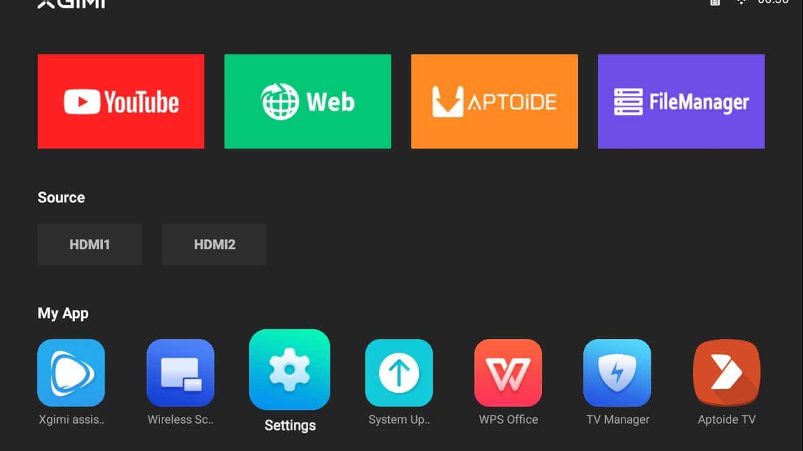

Aller dans « Settings »

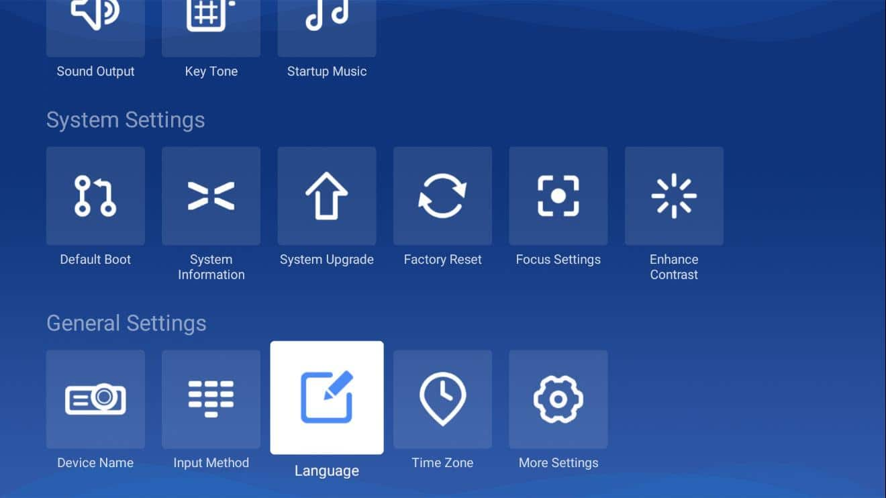

Descendre jusqu’à « Language ».

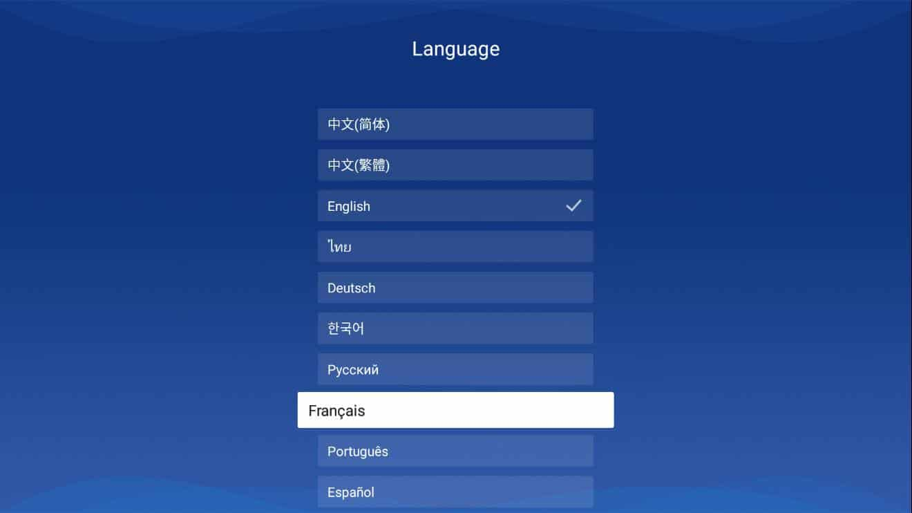

Choisir la langue « Français ».

### Régler le fuseau horaire

Aller dans « Réglages » anciennement « Settings ».

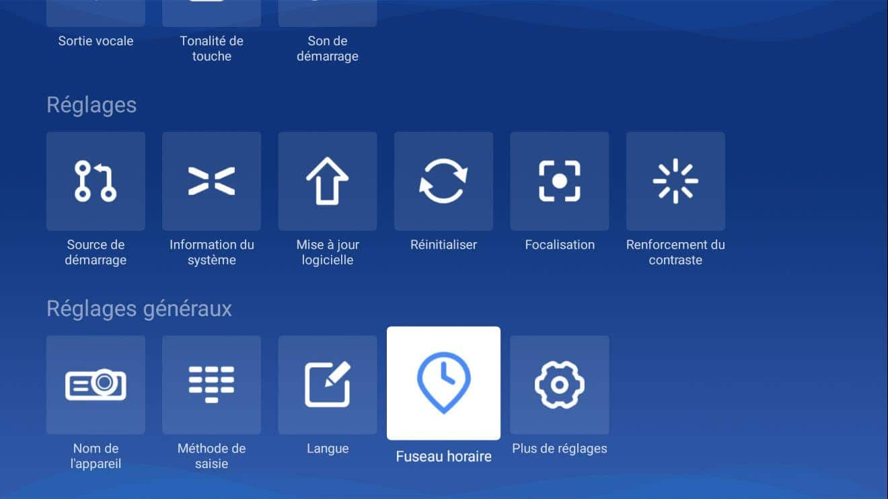

Descendre jusqu’à « Fuseau horaire » dans « Réglage généraux ».

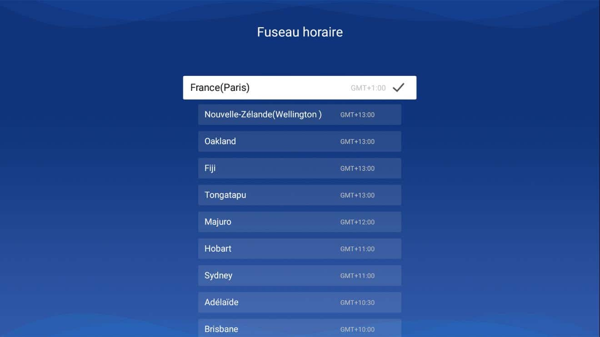

Choisir « France (Paris) GMT +1:00 ».

### Activer ou désactiver l’autofocus au démarrage

L’avantage de cette fonction c’est qu’on est sûr de toujours avoir une image nette car l’autofocus est lancé à chaque démarrage du vidéoprojecteur. L’inconvénient, dans le temps, c’est un risque d’usure prématurée de l’appareil.

- Aller dans « **Réglages** ».

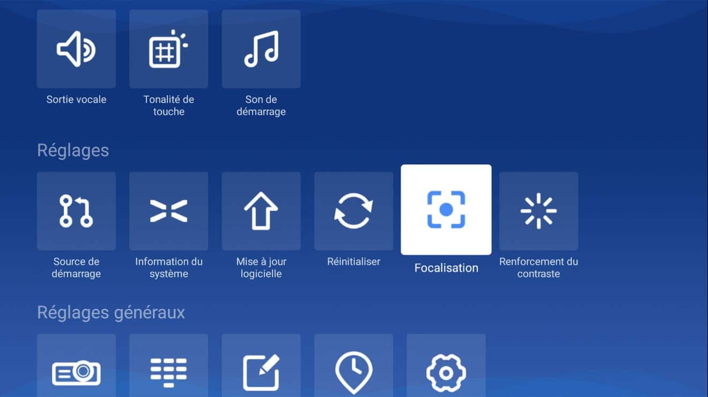

Descendre jusqu’à « Focalisation » dans « Réglage ».

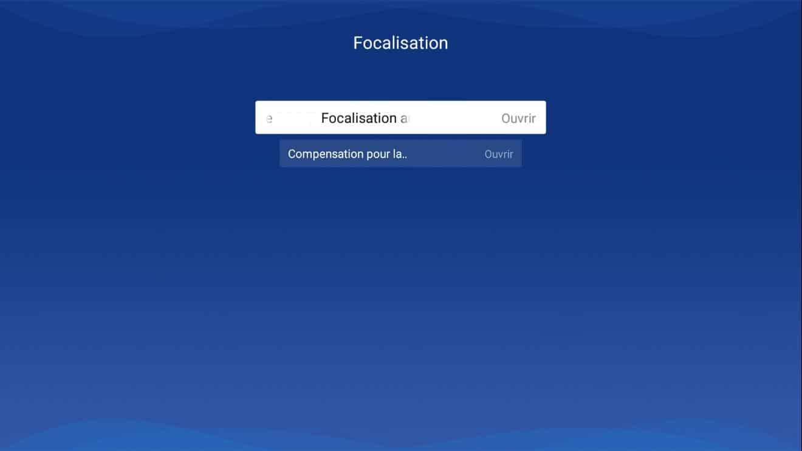

Sélectionner « Ouvrir » pour activer ou « Fermer » pour désactiver.

### Choisir la source lors du démarrage

Vous pouvez choisir, lors du démarrage du H2, d’afficher Android ou bien une source externe connectée en HDMI.

- Aller dans « **Réglages** ».
- Descendre jusqu’à « **Source démarrage** » dans « **Réglage** ».
- Sélectionner :
  - « **Fermer** » pour démarrer sur Android.
  - « **HDMI1 ou HDMI2** » pour démarrer sur une source externe.

Si vous êtes sous Android et qu’une source est détectée sur un des ports HDMI, un message vous propose de basculer sur celle-ci. De même, si vous êtes sur une sources externe, vous pouvez retourner sous Android en cliquant sur le bouton « Home » de la télécommande.

### Choix de la sortie Audio.

Lors de la lecture depuis le vidéoprojecteur, le son est diffusé sur les enceintes Harman-Kardon de l’appareil. Mais grâce au HDMI ARC, ou au S-PDIF, vous pouvez choisir une source externe, comme un ampli Home-cinéma.

- Aller dans « **Réglages** ».
- Descendre jusqu’à « **Sortie vocale** » dans « **Réglage son** ».
- Sélectionner :
  - « **Haut-parleur interne** ».
  - « **Fibre optique/arc** » jouer le son sur une source externe.
    - Format de sortie vocale : **Raw** (Passthrough) ou **Pcm**.

## Réglages de l’image

Comme nous l’avons vu plus haut les réglages de l’image ont été grandement automatisés par rapport au XGIMI H1. Une fonction permet de lancer un réglage automatique de la correction trapézoïdale et de l’autofocus.

- Appuyer plus de **4 secondes** sur le **bouton menu** de la télécommande.
- Aller dans « **Correction intelligente** ».

### Correction trapézoïdale

La correction trapézoïdale peut aussi être réglée indépendamment de manière automatique, ou manuelle, depuis le menu « **Réglages** ».

- Aller dans « **Réglages** ».

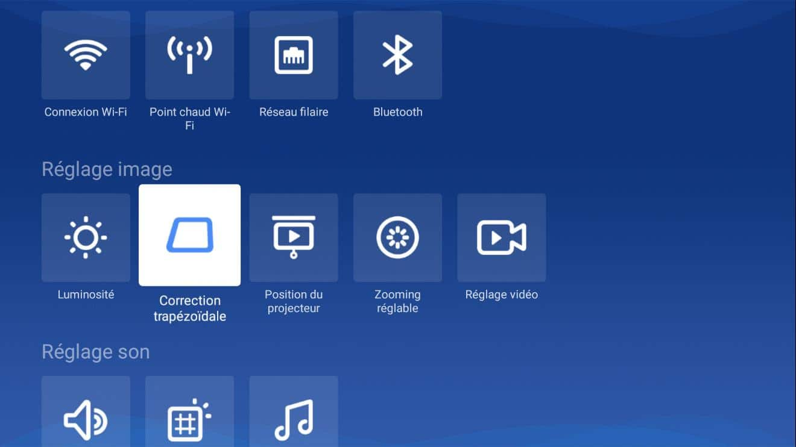

Descendre jusqu’à « Correction trapézoïdale » dans « Réglage Image ».

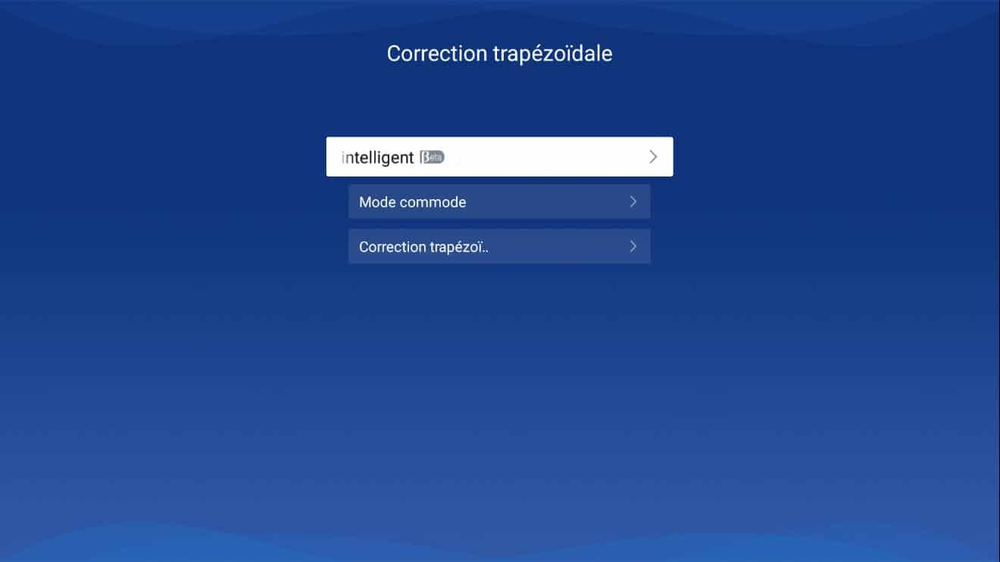

« Correction auxiliaire intelligente » réglage automatique.

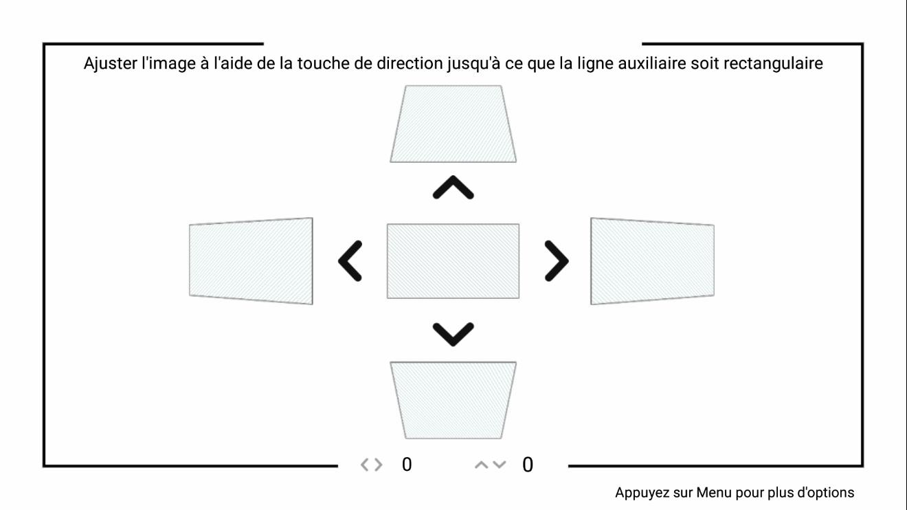

« Mode commode » réglage manuel simplifié.

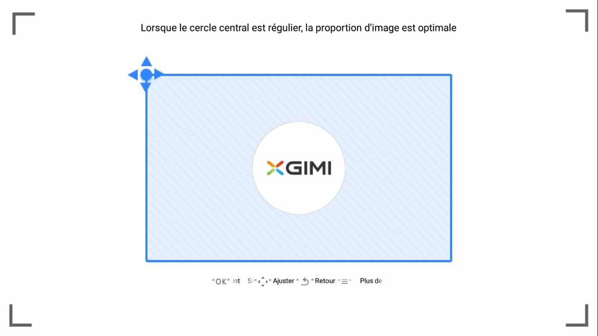

« Correction trapézoïdale avancée » réglage manuel avancé.

### Zooming réglable

Cette fonction n’est pas automatisée, mais permet d’affiner la taille de l’image afin qu’elle s’ajuste parfaitement à la surface de projection que ce soit un mur ou un écran de projection.

- Aller dans « **Réglages** ».

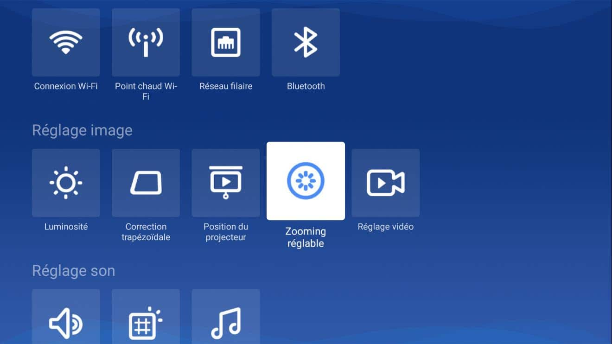

Descendre jusqu’à « Zooming réglable » dans « Réglage Image ».

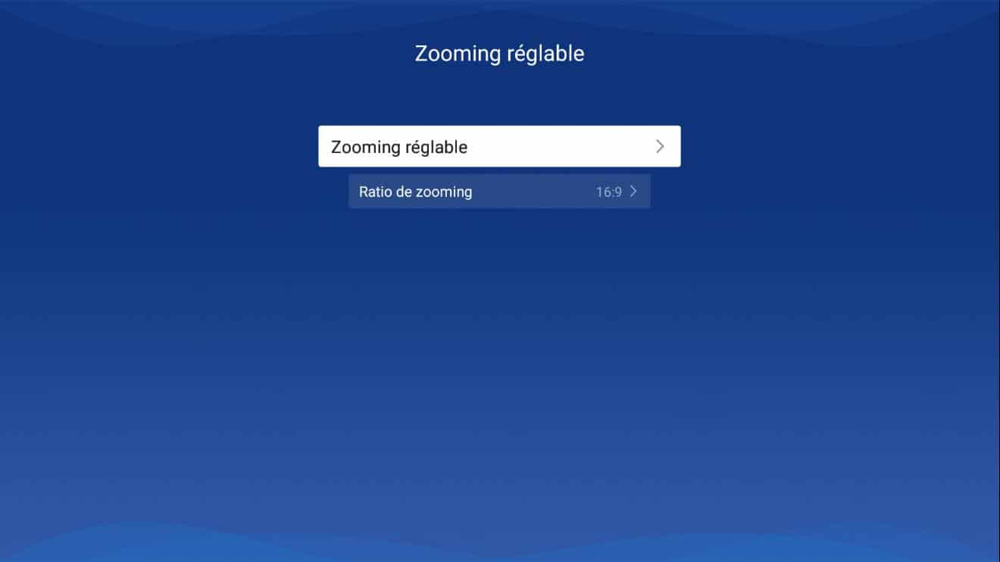

Aller dans « Zooming réglable ».

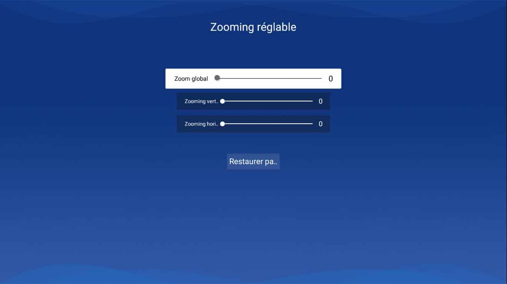

« Zooming réglable ».

- « **Zoom global** » : permet de réduire la taille verticalement et horizontalement.
- « **Zooming vert…** » : permet de réduire la taille verticalement.
- « **Zooming hori…** » : permet de réduire la taille horizontalement.

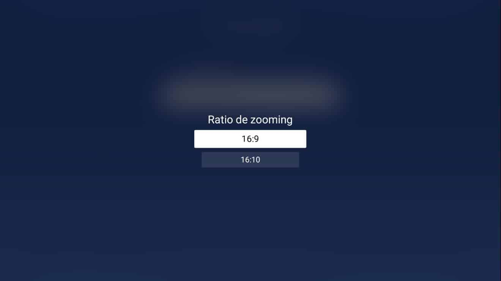

Ratio de Zooming permet de choisir entre 16 :9 ou 16 :10.

### Position du projecteur

L’image peut être inversée où retournée en fonction du mode d’installation du vidéoprojecteur.

- Aller dans « **Réglages** ».

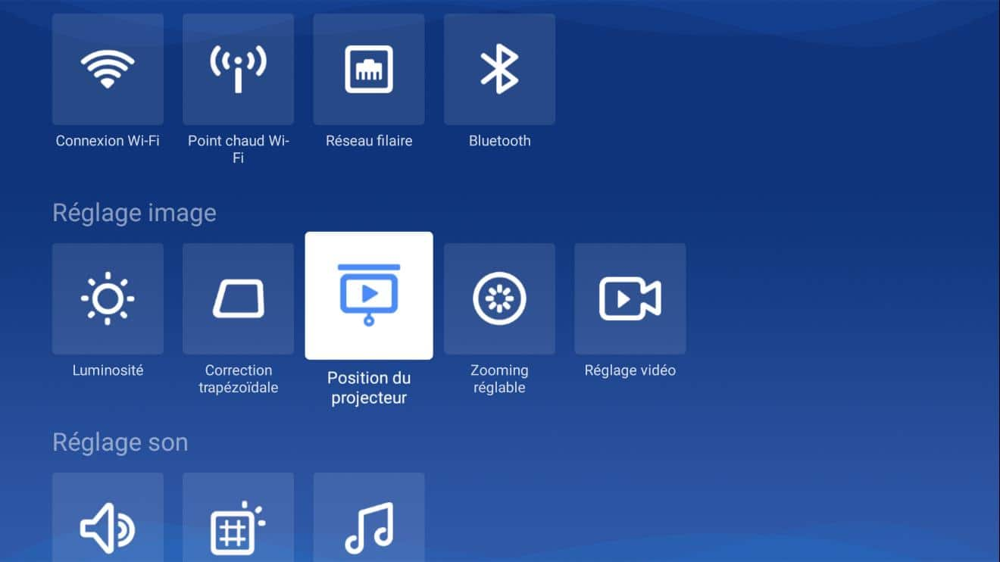

Descendre jusqu’à « Position du projecteur » dans « Réglage Image ».

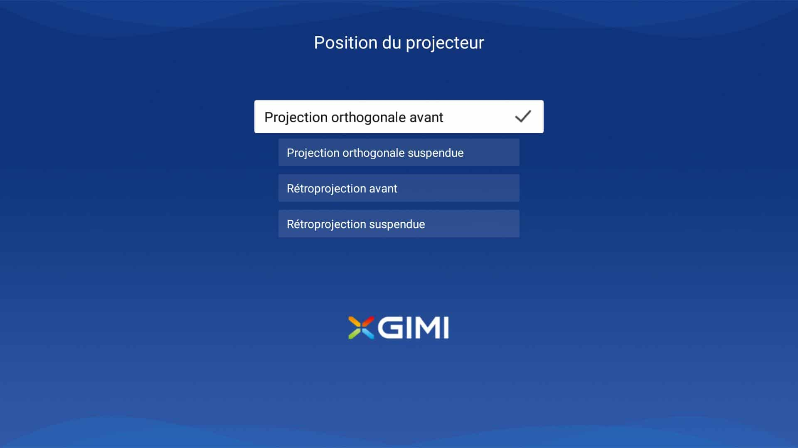

« Position du projecteur »

- - « **Projection orthogonale avant** » : L’image est normale, le H2 est face à l’écran.
  - « **Projection orthogonale suspendue** » : L’image est renversée, le H2 au plafond.
  - « **Rétroprojection avant** » : L’image est inversée, le H2 est derrière l’écran.
  - « **Rétroprojection suspendue** » : L’image est inversée et renversée, le H2 est derrière l’écran au plafond.

### Luminosité (global)

Ce réglage n’est pas spécifique à l’image vidéo projetée, mais à la luminosité globale du vidéoprojecteur, menu, vidéos, applications…

- Aller dans « **Réglages** ».

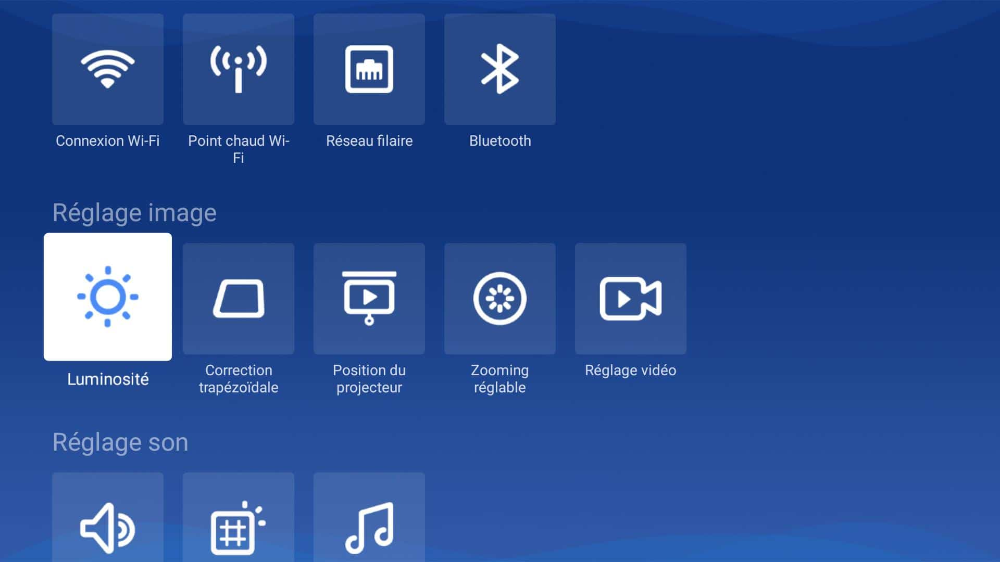

Descendre jusqu’à « Luminosité » dans « Réglage Image ».

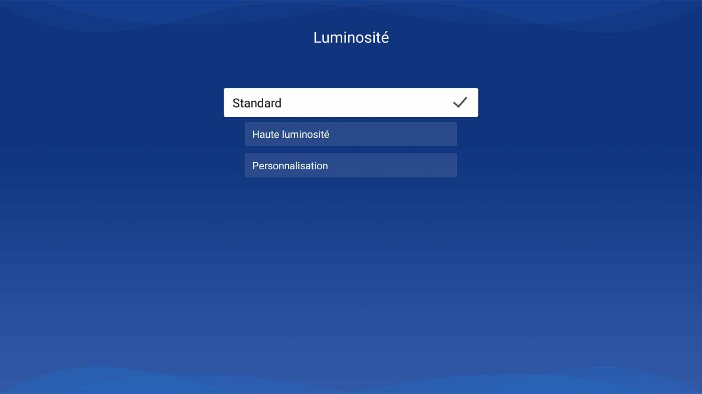

« Luminosité »

- « **Standard** »
- « **Haute luminosité** »
- « **Personnalisation** »

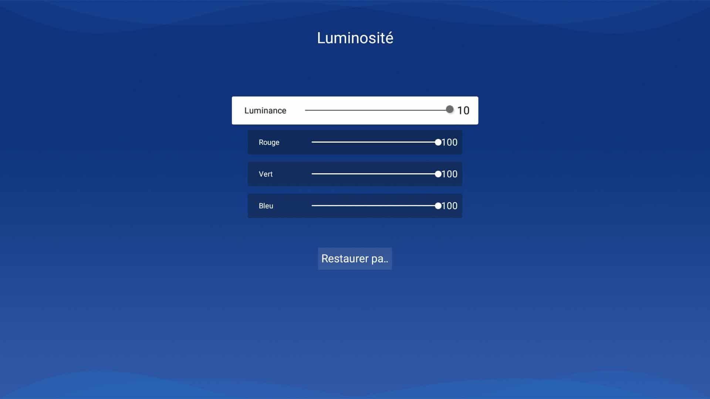

« Personnalisation »

- Luminance, Rouge, Vert, Bleu.

### Renforcement du contraste

Je ne sais pas pourquoi, mais ce réglage ne se trouve pas dans « **Réglage Image** » mais dans le menu « **Réglage** ».

- Aller dans « **Réglages** ».

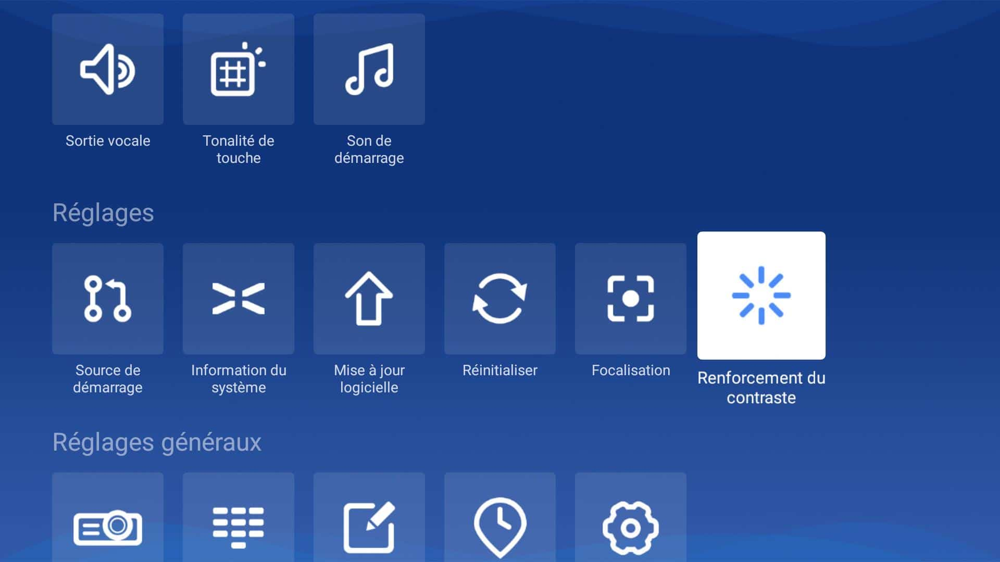

Descendre jusqu’à « Renforcement du contraste » dans « Réglage ».

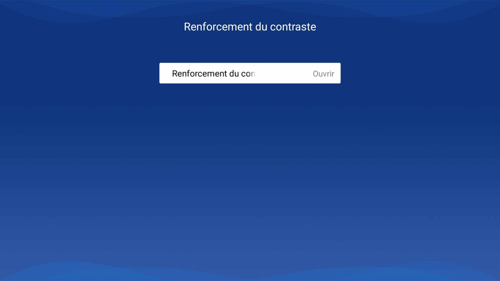

Sélectionner « Ouvrir » pour activer ou « Fermer » pour désactiver.

## Réglage vidéo

Ce menu spécifique à l’image vidéo projetée permet de choisir le ratio d’image, **Automatique**, **16:9, 4:3** ou **Taille originale**, mais surtout de régler les modes d’image.

**Plusieurs modes sont prédéfinis**, Standard, Doux, OFFICE, Jeu, Football, Brillant et Utilisateur, pour choisir ses propres réglages.

### Réglages du mode Utilisateur

- Aller dans « **Réglages** ».
- Descendre jusqu’à « **Réglage vidéo** » dans « **Réglage Image** ».
- Sélectionner « **Image** ».
- Naviguer avec les flèches droite ou gauche jusqu’à « **Utilisateur** ».
- **Luminance** : Sensation visuelle de luminosité d’une surface. Trop élevée, les noirs seront gris, trop faible les détails seront estompés.
- **Ratio de contraste** : Différence d’intensité lumineuse entre les nuances les plus claires et les plus sombres.
- **Saturation** : Puissance des couleurs. Ni trop vives, ni trop ternes.
- **Acuité** : C’est la netteté de l’image. Il ne faut pas en abuser au risque d’avoir une image dégradée.
- **Réduction du bruit indésirable** : Automatique, Bas, Moyen, Fort ou Off. Corrige les imperfections de l’image.
- **Température de couleur** : Standard, Froid, Chaud, Personnalisée.
  - Rouge, Bleu, Vert.
- **MEMC** : Fermer (Off), Bas, Moyen, Fort. Traitement vidéo améliorant la fluidité de l’image.

## L’installation d’applications

Pour installer des applications on ne passe pas par le Google store officiel comme sur la Mi Box, mais par Apoïde qui est un store alternatif au Google Store. Il permet d’installer des applications qui ne sont pas officiellement disponibles pour un appareil Android spécifique, comme le H2. Son fonctionnement est similaire au store officiel, il suffit de faire une recherche et d’installer l’application que l’on souhaite.

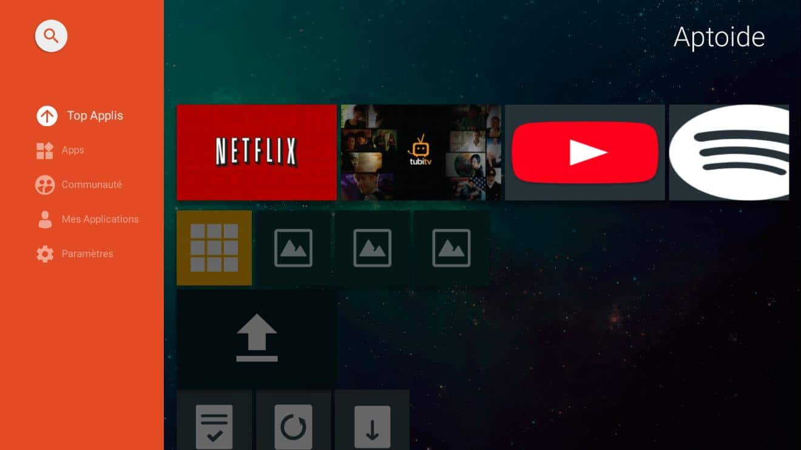

Aptoide

### Installation d’AptoideTV

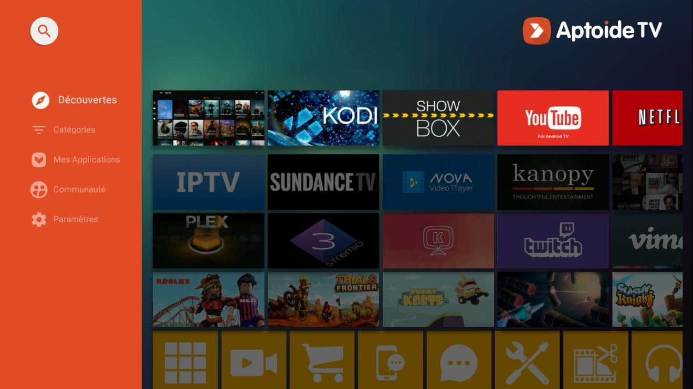

AptoideTV

- Ouvrir le **Navigateur web**.
- Aller sur **Google**.
- Activer la souris virtuel en appuyant sur le bouton de la télécommande.
- Sélectionner la barre de navigation.
- Rechercher **m.aptoide** ou taper l’adresse du site : **[https://m.aptoide.com/installer-aptoide-tv](https://m.aptoide.com/installer-aptoide-tv).**
- Cliquez sur « **Installer Aptoide TV** ».
- Valider les messages pour finir l’installation.

Ceci ne met pas à jour la version d’Aptoide préinstallée, mais installe la version TV. Il faudra donc la rechercher dans la partie basse de l’écran d’accueil pour la lancer.

### Accéder au Google Play Store officiel.

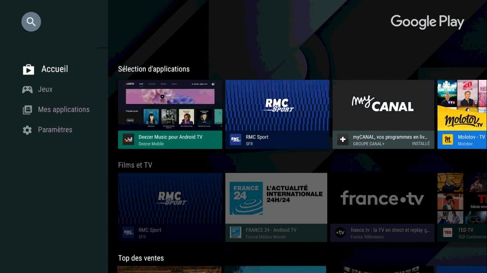

Google Play Store

- Ouvrir le **Navigateur web**.
- Aller sur **Google**.
- Activer la souris virtuel en appuyant sur le bouton de la télécommande.
- Sélectionner la barre de navigation.
- Rechercher « **Play store** ».
- Cliquer sur **Play store**.
- Seules les applications compatibles avec le XGIMI H2 seront installable depuis le Google Store. Pour les autres il faudra utiliser AptoideTV.

## [Ne ratez pas :](/videoprojecteur-xgimi-h2)

J'ai testé le Vidéoprojecteur Xgimi H2

Voilà pour ce petit tutoriel qui vous permettra déjà de régler et d’utiliser votre vidéoprojecteur correctement. Certes il y a encore des fonctions que je n’ai pas abordées ici, mais le but était surtout de vous donner les bases essentielles au démarrage.
