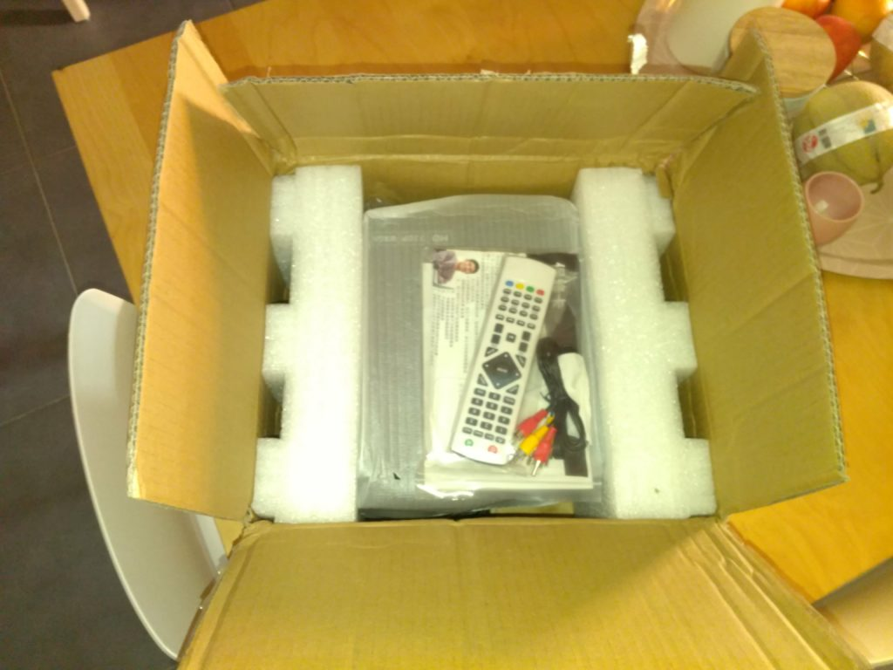
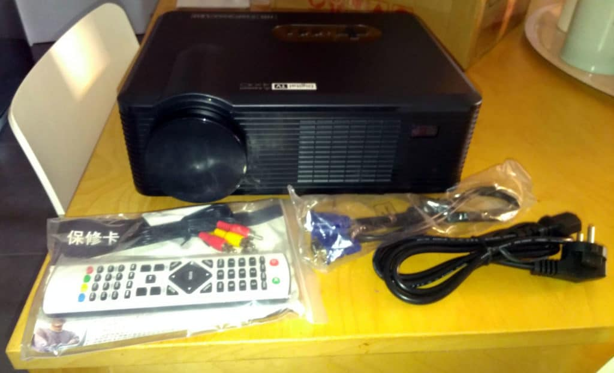

# Vidéoprojecteur Excelvan CL720D

> Nous allons découvrir le vidéo**projecteur Excelvan CL720D**. Cette **présentation** sera **suivie** d’un **test complet,** mais pour cela, il faut que j’utilise un peu le produit histoire de ne pas vous livrez un **article bateau** avec le déballage et un copié / collé de caractéristiques.
>
> Ce vidéoprojecteur est disponible sur **Gearbest au prix de 122.81 € ou sur [Amazon en premium au prix de 165,99 €.](http://amzn.to/2tuRUFS)**

## Description

Le **Excelvan CL720D** est un **vidéoprojecteur** à **LED** haute performance avec **télécommande**.

**L’interface** utilisateur est simple. Elle est disponible dans **plusieurs** **langues,** dont le **français**.

La technologie du **LED** apporte une image **colorée** et **lumineuse,** ainsi que des **vidéos** **fluides,** avec une **définition** de **1280×800** à **3000 lumen** supportant le **1080p**, idéal pour les systèmes **home cinéma**, les **jeux vidéos** et également pour les **entreprises**.

La lumière **LED** offre une longue **durée de vie.** Jusqu’à **50 000 heures**.

Il peut projeter une **image** de **60 centimètres à 6,60 mètres** mais l’idéal se situe entre 1,30 mètres à 3,80 mètres.

Il dispose également **d’enceintes** **stéréo** 2X 5W **intégrées**.

## Caractéristiques

• **3000 lumens** avec un rapport de contraste de **2000: 1** pour des images nettes.
• **16,7 millions de couleurs** offrent une qualité d’affichage exceptionnelle.
• Multi-interfaces, avec lecture depuis le **port HDMI ou USB** et même directement à partir d’une **clé USB**.
• Longue **durée de vie** de la lampe, jusqu’à **50 000 heures**.
• **Eco-mode** respectueux de l’environnement.
• Prend en charge **22 langues**.
• Compatible **3D rouge et bleu** avec des lunettes 3D.
• 2 ports **HDMI** (Support 1.1-1.3), 2 ports **USB**, **VGA** (PC), **YPbPr**, **Composite** A / V, sortie **audio** (L / R), **TNT**.
• Résolution native: **1280×800**.
• Résolution maximale du support: **1080P**.
• Compatibilité vidéo: **PAL** (SECAM / NTSC).
• Méthode de projection: **avant, arrière, montage sous plafond et pose sur dessus de table**.
• Zoom d’image: **bascule horizontal et vertical**.
• Langue OSD: **22 langues** (**anglais**, allemand, **français**, espagnol, portugais, russe, italien, finnois, suédois, hongrois, néerlandais, norvégien, danois, grec, croate, polonais, tchèque, roumain, slovène, serbe, japonais) Peut ajouter n’importe quelle langue à la demande du client.
• Niveau sonore (STD / Bright): **<28db** (faible bruit)
• Alimentation: AC 90-**240V**, 50-60Hz
• Dimensions (L x H x P): **320 \* 255 \* 115 mm**

Voila ça c’est fait, même si c’est rébarbatif, c’est **important d’avoir ces informations**. Bien évidement dans le test complet, je reviendrais sur les **caractéristiques** pour les **confirmer** ou les **infirmer**.

122.81 € chez Gearbest

## Déballage

Pour le conditionnement, on est loin des **classieux cartons Xiaomi,** mais plutôt dans le b**on gros carton marron !** Mais finalement, l’important, c’est qu’il **arrive** en **bon état**, surtout s’il vient depuis l’autre coté de la planète.

**Le carton contient :**

- Le vidéoprojecteur Excelvan CL720D.
- Une télécommande.
- Un câble avec une prise pour la France.
- Un câble audio-vidéo (Rouge, Blanc, Jaune).
- Un câble VGA.
- Un fusible de rechange.
- Un manuel utilisateur en anglais.

## Conclusion

Comme je vous le disais, un **article** **complet** va bientôt arriver, dans lequel je vous présenterai en **détail** le vidéoprojecteur Excelvan CL720D.

[165,99 € sur Amazon (Prime)](http://amzn.to/2t9Q2Aj)
