# Vidéoprojecteur XGIMI H2 Global Version

> Grâce au site Gearbest, j’ai enfin pu tester le nouveau vidéoprojecteur DLP XGIMI H2 dans sa version internationale. Remplaçant du bestseller XGIMI H1, il apporte de vraies améliorations. La luminosité passe de 900 à 1350 Lumens pour une image plus nette en journée ou en pleine lumière. Avec une résolution Full HD (1920×1080) il prend en charge la 4k HDR 10.
>
> Le ratio de projection est passé de 1.39:1 à 1.2:1 ce qui permet de profiter à une distance de 2,70 m d’une diagonale de 100 pouces (2,58m) contre 87 pouces (2,21m) avec le H1. La diagonale de projection peut aller de 60 pouces (1,52 m) à un maximum de 300 pouces (7,62 m).
>
> L’autofocus est maintenant de la partie, avec l’ajout d’un nouveau bloc optique motorisé et d’une caméra haute résolution qui ajuste automatiquement la mise au point. La correction de la distorsion trapézoïdale a elle aussi été automatisée et permet de redresser l’image verticalement et/ou horizontalement de plus ou moins 45 degrés. L’installation du XGIMI H2 est beaucoup plus simple et la fonction Zooming permet d’adapter facilement la taille de l’image au support de projection.
>
> Le traitement vidéo a également été amélioré et la compensation de mouvements (MEMC) limite les traînées d’images.
>
> La technologie 3D DLP Link avec les lunettes 3D actives redonne à la 3D le coté immersive du cinéma et tous les types de films 3D sont pris en charge. Il est même possible de convertir des films 2D en 3D et inversement.
>
> L’automatisation a été poussée jusqu’au cache d’objectif qui est maintenant motorisé pour une protection accrue et un confort d’utilisation amélioré.
>
> Le XGIMI H2 embarque une version modifiée d’Android 6, à l’instar d’un smartphone, il est possible de se connecter à internet et d’installer des applications comme YouTube, Canal Play, Kodi, Molotov, etc …
>
> Le WiFi bi-bande 2.4 / 5GHz assure une expérience de visionnage fluide et avec le port Ethernet ce vidéoprojecteur est facilement connectable au réseau local ou à internet.
>
> La mémoire interne de 16G permet de stocker des fichiers en local et peut être augmentée en branchant un disque dur USB sur l’un des ports USB 2.0 ou USB 3.0.
>
> Afin de le rendre plus autonome, des haut-parleurs Harman Kardon de 16W sont intégrés à l’appareil et diffusent un son stéréo Surround de très bonne qualité, pouvant aussi être utilisés comme enceinte Bluetooth.

**Caractéristiques techniques:**

- CPU: Mstar 838 Cortex-A53
- GPU: Mali-T820
- RAM: 2 Go
- ROM: 16 Go
- Puce d’affichage: 0,47 pouce DMD RGB-LED
- Lampe: LED
- Puissance de la lampe: 100 – 135W
- Durée de vie de la lampe: 30 000 heures

- WIFI: 802.11 a / b / g / n / ac
- Bluetooth: Bluetooth 4.0
- Alimentation: 19V / 5A
- Bruit (dB): moins de 30dB
- Pile de la télécommande: 2 piles AAA (non incluses)
- Poids : 2.1200 kg
- Taille (L x l x h): 20,10 x 20,10 x 13,50 cm

## Déballage du XGIMI H2

Le vidéoprojecteur XGIMI H2 est livré dans une très belle boite blanche avec simplement écrit XGIMI H2 et Harman-Kardon, plus un petit angle rouge indiquant « Global version ». Gearbest envoie, surement par habitude, un adaptateur secteur, mais il n’est pas utile car le XGIMI H2 Global version est déjà fourni avec une prise européenne.

En faisant coulisser le haut de la boite, on découvre l’appareil bien calé dans un fond en mousse épaisse qui respire la qualité et qui protège très bien le vidéoprojecteur.

Une fois le XGIMI H2 sorti, on découvre le mode d’emploi traduit en 18 langues ! Un double fond contient la télécommande et l’adaptateur secteur.

La télécommande n’est pas la même que sur le XGIMI H1. Celle-ci est noire et n’est pas rechargeable, elle fonctionne avec des piles. Elle est compacte et très simple à utiliser.

Un interrupteur se trouve sous la télécommande, il permet d’activer l’autofocus, mais aussi de changer la fonction des touches volumes en touches focus pour un ajustement manuel.

Gris foncé et noir du plus bel effet, le XGIMI H2 ne mesure que 20 cm sur 13,5 cm pour un poids de 2,5 kg.

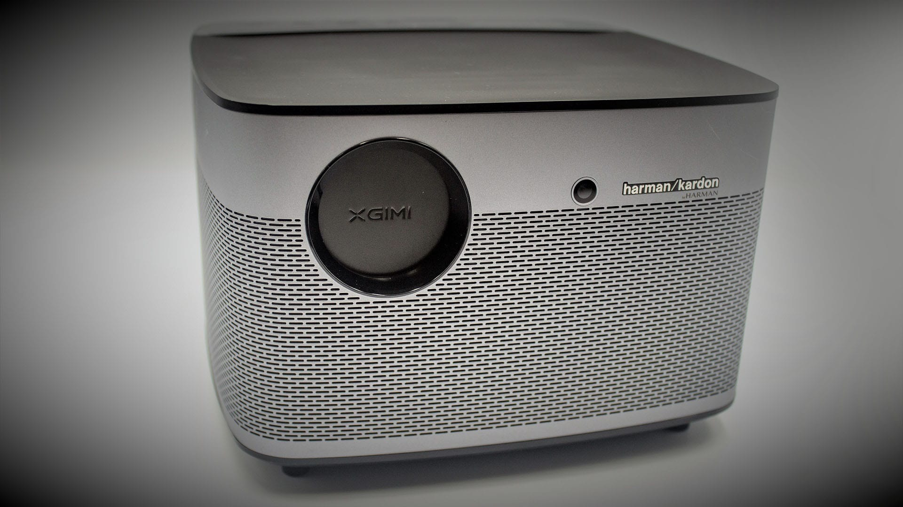

Sur la face avant, en métal gris, il n’y a que l’objectif protégé par son cache automatique gravé du logo XGIMI, la caméra haute définition pour le réglage trapézoïdal et l’autofocus, ainsi que le logo Harman Kardon.

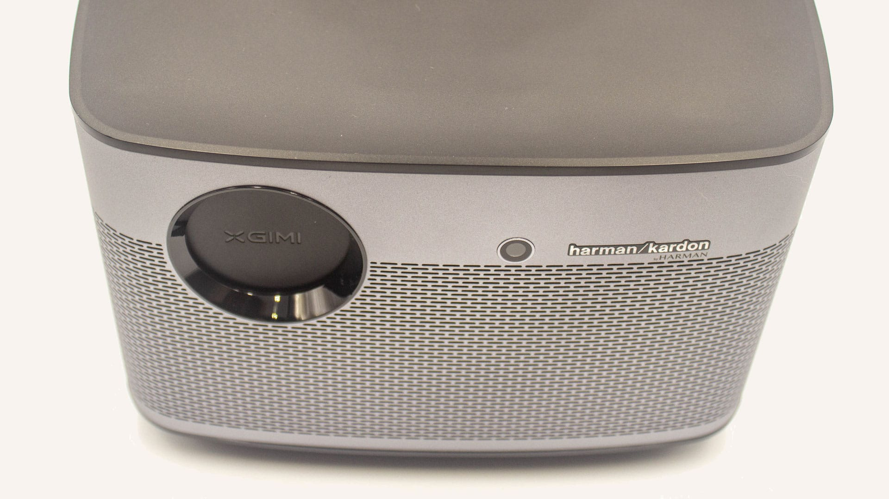

Le dessus de l’appareil est, quant à lui, en plastique noir dépoli, excepté pour le bandeau tactile du réglage du volume. On retrouve ensuite un accès rapide aux boutons Play/Pause, Suivant, Speaker Mode et Power.

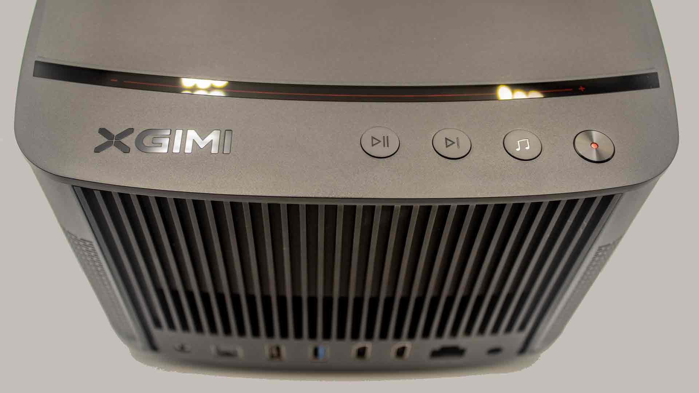

Au dessous on y voit, au centre, un pas de vis pour fixer un trépied au format standard 3/4″ et à côté, le woofer Harman Kardon récompensé aux CES Innovation Award, iF Design Award et Red Dot Design Awards.

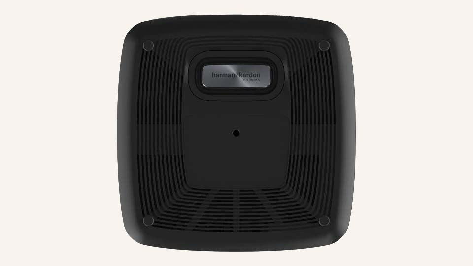

Pour finir, l’arrière est totalement occupé par la grille de ventilation et les différentes connectiques qui permettent d’effectuer tous les branchements nécessaires.

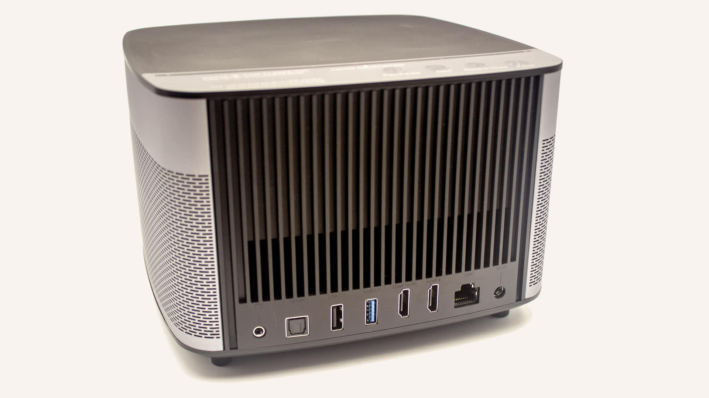

## Branchement du XGIMI H2

Il est relativement simple de brancher l’appareil grâce aux différentes connectiques proposées qui offrent une multitude de possibilités, de gauche à droite :

- Prise casque.
- Prise S/PDIF.
- Port USB 2.0.
- Port USB 3.0.
- Port HDMI compatible ARC.
- Port HDMI.
- Port Ethernet.
- Prise power.

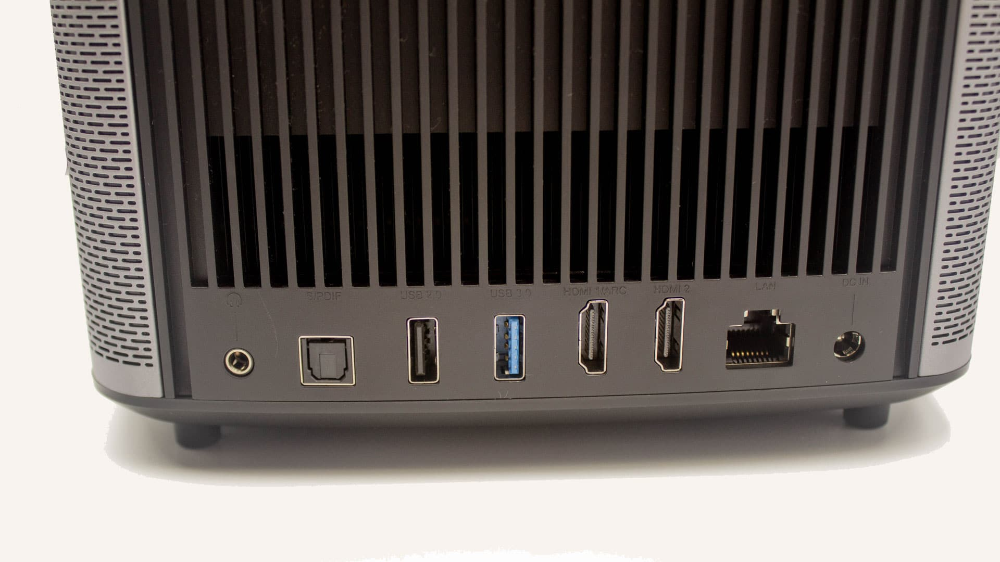

Connectique du XGIMI H2

### Utilisation en wifi seulement

C’est la solution la plus simple à mettre en place, il suffit de brancher la prise de courant. Cette configuration offre un accès à internet (Youtube, Canal play, molotov…) et au réseau local (Kodi, DLNA, NAS…) grâce à votre connexion wifi.

### Utilisation en Ethernet

En connectant un câble RJ45 sur le H2 vous aurez un débit plus élevé et plus stable qu’avec le Wifi.

### Utilisation avec un disque dur externe

Si vous voulez utiliser le vidéoprojecteur sans le relier au réseau, vous pouvez connecter un disque dur externe sur l’un des ports USB. Le port USB 3.0 permet un transfert plus rapide, particulièrement utile pour les vidéos 4k ou 3D.

### Utilisation depuis une source externe

Sur les 2 ports HDMI vous pouvez brancher n’importe quel appareil muni d’une sortie HDMI, comme un ampli home-cinéma ou une box télé.

Grace au port HDMI compatible ARC, ou au port S/PDIF, vous pouvez brancher le vidéoprojecteur à un ampli et envoyer le son du H2 vers l’ampli.

L’avantage est double :

- Vous pouvez diffuser l’image des vidéos provenant des appareils externes reliés à l’ampli Home-cinéma, vers le vidéoprojecteur et le son est diffusé sur les enceintes de l’ampli.
- A l’inverse, lors de la lecture de vidéos en local depuis le vidéoprojecteur, le son est envoyé vers l’ampli via le port HDMI ARC.

## Installation du XGIMI H2

Une fois le branchement effectué, il ne reste plus qu’à installer le vidéoprojecteur. Pour cela, vous trouverez des supports pour vidéoprojecteurs sous forme de pieds qui se posent librement, ou sous forme de fixation murale ou au plafond. Si cela est possible vous pouvez aussi, comme je l’ai fait, le poser sur une étagère.

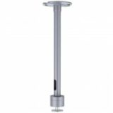

XGIMI C225B Support de Plafond

XGIMI F062S Support de Projecteur au Sol

XGIMI Angle de Support

XGIMI Plateau de Support

Le premier élément à prendre en compte, c’est l’angle de projection du H2. Il diffuse l’image face à lui, soit 50% de l’image au-dessus et 50% au-dessous.

Il n’y a pas de « lens shift » (décalage de l’objectif) permettant de déplacer l’image en intervenant directement sur le bloc optique.

Toutes fois, le réglage de la distorsion trapézoïdale et la fonction Zoom permettront dans la majorité des cas de compenser le décalage.

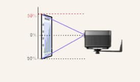

Angle de projection

Vous pouvez incliner ou désaxer le vidéoprojecteur car la distorsion trapézoïdale peut rattraper le décalage.

Veillez à ne pas dépasser un angle de 45° horizontalement ou verticalement.

Le zoom permet de réduire l’image afin de ne pas avoir d’ombre provoquée par des objets perturbateurs et ainsi ajuster parfaitement l’image sur le support de diffusion (Mur blanc, écran pour vidéoprojecteurs…).

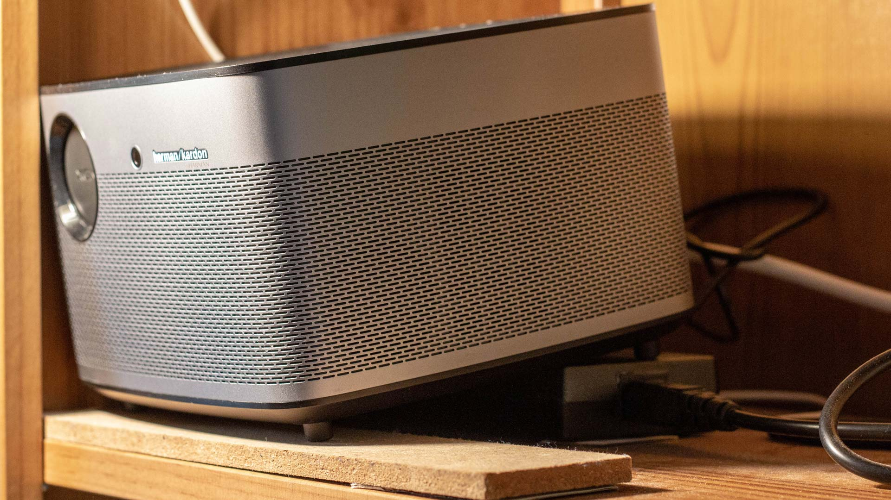

Le H2 sur une étagère

## Démarrage du XGIMI H2

Lorsque vous allumez l’appareil pour la première fois, le logo XGIMI s’affiche et devient flou puis de plus en plus net, c’est l’autofocus qui ajuste la netteté.

Ensuite un assistant vous explique comment appairer la télécommande. Il suffit d’appuyer sur les bouton « Retour » et « home » en maintenant la télécommande à 10 cm de l’appareil.

Une fois cette étape terminée et si vous n’avez pas branché de câble RJ45, l’assistant vous propose de vous connecter au wifi.

La dernière étape explique comment activer la fonction enceinte Bluetooth lorsque le H2 est en veille.

Vous pouvez choisir, lors du démarrage du H2, d’afficher directement Android ou bien une source externe connectée en HDMI.

Si vous êtes sous Android et qu’une source est détecté sur un des ports HDMI, un message vous propose de basculer sur celle-ci. De même, si vous êtes sur une source externe, vous pouvez retourner sous Android en cliquant sur le bouton « Home » de la télécommande.

Lors de la lecture depuis le vidéoprojecteur, le son est diffusé sur les enceintes Harman-Kardon, mais grâce au HDMI ARC, ou au S-PDIF, vous pouvez choisir une source externe, comme un ampli Home-cinéma.

Les réglages de l’image ont été grandement automatisés par rapport au XGIMI H1. Une fonction permet de lancer un réglage automatique de la correction trapézoïdale et de l’autofocus.

La correction trapézoïdale peut être réglée de manière automatique ou manuelle.

Le Zooming réglable n’est pas automatisé, mais permet d’affiner la taille de l’image afin qu’elle s’ajuste parfaitement à la surface de projection que ce soit un mur ou un écran de projection.

L’image peut être inversée où retournée en fonction du mode d’installation du vidéoprojecteur.

- « Projection orthogonale avant » : L’image est normale, le H2 est face à l’écran.
- « Projection orthogonale suspendue » : L’image est renversée, le H2 est fixé au plafond.
- « Rétroprojection avant » : L’image est inversée, le H2 est derrière l’écran.
- « Rétroprojection suspendue » : L’image est inversée et renversée, le H2 est derrière l’écran, au plafond.

Plusieurs modes d’image sont prédéfinis, Standard, Doux, OFFICE, Jeu, Football, Brillant et Utilisateur pour choisir vos propres réglages.

Le dernier point important pour moi lors de l’utilisation d’un vidéoprojecteur, c’est le bruit du ventilateur. On n’y pense pas vraiment lors de notre premier achat, mais ça peut vite gâcher le plaisir qu’on peut avoir lorsqu’on visionne un film.

Le XGIMI H2 fait encore très fort sur ce point, le constructeur l’annonce à moins de 30dB est on y est vraiment. En utilisation normale le sonomètre posé contre l’appareil mesure un bruit entre 35 et 40 dB et on descend à 25-30dB voir moins à une distance de 1 mètre. Autant vous dire que ce n’est rien, pour comparaison 30dB équivaut à un chuchotement et 20dB à un moustique.
Le maximum que j’ai pu mesurer, c’est lors de l’installation, où le ventilateur n’était pas encore régulé, avec un bruit de 65dB ce qui équivaut au bruit d’une conversation.

## L’interface Android GMUI

Le XGIMI H2 n’est pas installé avec une version d’Android TV pure, comme sur une Mi-Box, mais avec une version modifiée d’Android 6.0 avec une couche logiciel appelé GMUI. Le fonctionnement est un peu différent, mais la simplicité de l’interface permet de vite la prendre en main.

Au moment où j’écris cet article (Janvier 2019) la dernière mise à jour est : 

- **Version du système** : V1.3.3
- **Version GMUI** : 3.2.0
- **Version Android** : Android 6.0

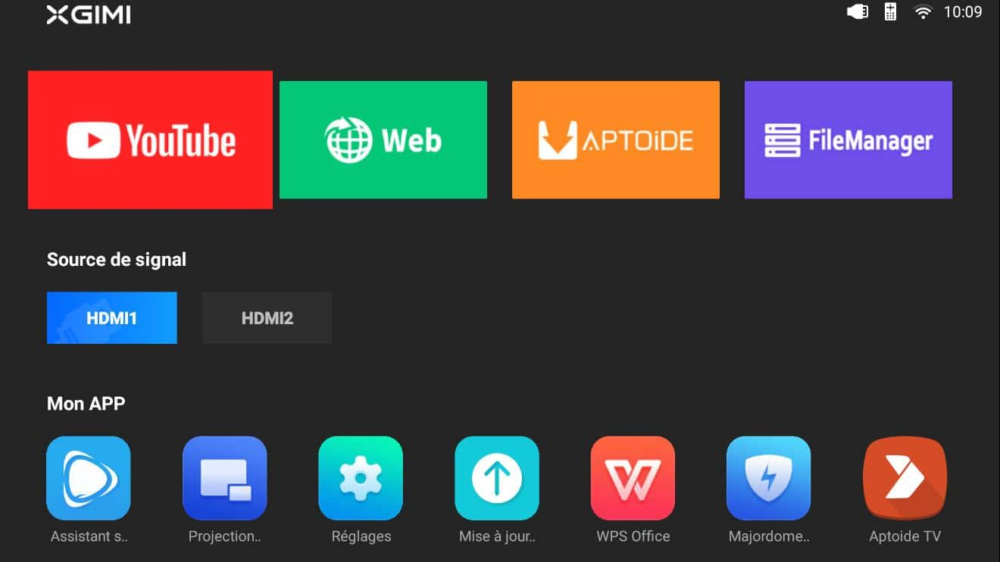

L’interface Android GMUI​ 3.2.0

### Les applications préinstallées

Plusieurs applications sont déjà installées.

- **YouTube** : Il est possible de se connecter avec son compte utilisateur pour retrouver ses playlists et les recommandations comme sur un smartphone.
- **Navigateur Web** : Une version de Chrome permet d’aller sur internet et avec le mode souris virtuelle il est très facile de naviguer à l’aide de la télécommande gyroscopique.
- **File manager** : C’est un explorateur de fichier comme sur un ordinateur.
- **WPS Office** : Permet de lire des fichiers Word pour une utilisation plus bureautique.
- **Majordome du téléviseur sans écran** : C’est une application d’optimisation qui permet, entre autres, de faire un nettoyage des fichiers inutiles ou de tester sa connexion internet.
- **Projection d’écran sans fil** : Application de mirroring depuis IOS (Airplay), Android ou Miracast.
- **Assistant sans écran TV** : Permet le contrôler depuis un smartphone avec une télécommande virtuelle, via l’application XGIMI Assistant.
- **Aptoide** : Remplace le Google store officiel pour l’installation d’autres applications.

## L’installation d’applications

Il est évidement possible d’installer d’autres applications, mais pour cela, on ne passe pas par le Google store officiel, mais par Aptoide, un store alternatif au Google Store.

Il permet d’installer des applications qui ne sont pas officiellement disponibles pour un appareil Android spécifique, comme le H2. Son fonctionnement est similaire au store officiel, il suffit de faire une recherche et d’installer l’application que l’on souhaite.

Malheureusement, la version d’Aptoide installée sur le XGIMI H2 n’est pas la version TV, malgré la mise à jour du système. Cependant il est facile d’installer la version TV appelée AptoideTV.

## Boitier splitter HDMI.

Il est possible d’utiliser le vidéoprojecteur tout en gardant sa Télé sans avoir à débrancher les câbles HDMI à chaque fois. Pour cela, il existe des Splitters HDMI compatibles CEC /ARC qui permettent de garder la fonction CEC de votre télé et de pouvoir utiliser la fonction ARC du XGIMI H2.

J’utilise ce modèle qui fonctionne bien, mais qui nécessite d’appuyer sur un bouton pour passer de la télé au vidéoprojecteur.

[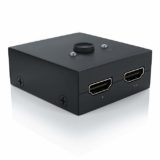](https://amzn.to/2QWP0Sk)

Splitter HDMI bidirectionnel CEC | ARC

## [Ne ratez pas :](/videoprojecteur-xgimi-h2)

Tutoriel d'utilisation du Vidéoprojecteur Xgimi H2 (A venir...)

Je ne vais pas vous dire que le XGIMI H2 est le vidéoprojecteur parfait, sinon vous diriez que je ne suis pas objectif, mais il est vrai que j’en suis plus que satisfait et pour preuve, les autres membres de la famille l’on aussi adopté.

La qualité de l’image est vraiment impressionnante, aussi bien pour regarder des films que des reportages, ou même des dessins animés et la 3D active en immersion totale n’a rien à voir avec la 3D proposée sur un Téléviseur traditionnel. La luminosité permet vraiment de l’utiliser même en pleine journée et ainsi, de vraiment remplacer la télé.

Pour profiter pleinement de l’image, je vous conseille fortement de regarder des vidéos avec une qualité d’au moins 1080p voir 4k. Personnellement, j’ai des séries que j’avais téléchargé en basse qualité et je préfère réduire la taille de l’image pour éviter la pixellisation tout en restant sur une taille très confortable.

L’automatisation des réglages le rend vraiment utilisable par tout le monde, surtout lorsqu’il est branché à un ampli, car on ne change pas ses habitudes en utilisant toujours les box tv, lecteurs Blu-ray ou consoles de jeu, comme on le fait sur une télé.

Pour la partie sonore, les enceintes Harman-Kardon font vraiment le job, même si c’est un peu étrange d’avoir le son derrière soi, mais comme enceinte Bluetooth c’est vraiment parfait.

Comme il faut toujours trouver des points négatifs, je dirais que j’aurais aimé un version d’Android TV pure pour pouvoir utiliser des fonctions comme Google Assistant, surtout lorsqu’on a une Google Home, le CEC, ou encore la reconnaissance vocale, mais ce petit défaut peut être contourné en branchant simplement une Mi-Box à 50€.
